# 第二章：使用 Docker 容器

在本章中，我们将涵盖以下配方：

+   列出/搜索镜像

+   拉取镜像

+   列出镜像

+   启动容器

+   列出容器

+   停止容器

+   查看容器的日志

+   删除容器

+   设置容器的重启策略

+   在容器内获取特权访问

+   在启动容器时暴露端口

+   在容器内访问主机设备

+   向正在运行的容器注入新进程

+   返回有关容器的低级信息

+   对容器进行标记和过滤

# 介绍

在上一章中，安装 Docker 后，我们拉取了一个镜像，并从中创建了一个容器。Docker 的主要目标是运行容器。在本章中，我们将看到我们可以对容器进行不同的操作，如启动、停止、列出、删除等。这将帮助我们将 Docker 用于不同的用例，如测试、CI/CD、设置 PaaS 等，我们将在后面的章节中进行介绍。在开始之前，让我们通过运行以下命令来验证 Docker 安装：

```
$ docker version

```

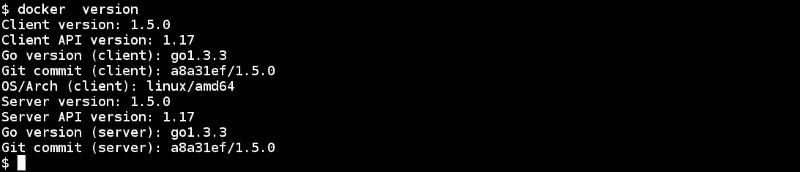

这将提供 Docker 客户端和服务器版本，以及其他详细信息。

我正在使用 Fedora 20/21 作为运行配方的主要环境。它们也应该适用于其他环境。

# 列出/搜索镜像

我们需要一个镜像来启动容器。让我们看看如何在 Docker 注册表上搜索镜像。正如我们在第一章中所看到的，*介绍和安装*，注册表保存 Docker 镜像，它可以是公共的也可以是私有的。默认情况下，搜索将在默认的公共注册表 Docker Hub 上进行，它位于 [`hub.docker.com/`](https://hub.docker.com/)。

## 准备就绪

确保 Docker 守护程序在主机上运行，并且您可以通过 Docker 客户端进行连接。

## 如何做…

1.  要在 Docker 注册表上搜索镜像，请运行以下命令：

```
docker search TERM

```

以下是搜索 Fedora 镜像的示例：

```
$ docker search fedora |  head -n5

```

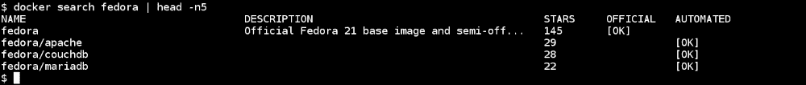

前面的屏幕截图列出了图像的名称，描述和获得的星星数量。它还指出图像是否是官方和自动化的。`STARS`表示有多少人喜欢给定的图像。`OFFICIAL`列帮助我们确定图像是否是从可信任的来源构建的。`AUTOMATED`列是一种告诉我们图像是否是在 GitHub 或 Bitbucket 存储库中自动构建的方法。有关`AUTOMATED`的更多详细信息可以在下一章中找到。

### 提示

图像名称的约定是`<user>/<name>`，但它可以是任何东西。

## 它是如何工作的...

Docker 在 Docker 公共注册表上搜索镜像，该注册表在[`registry.hub.docker.com/`](https://registry.hub.docker.com/)上有一个镜像仓库。

我们也可以配置我们的私有索引，它可以进行搜索。

## 还有更多...

+   要列出获得超过 20 颗星并且是自动化的图像，请运行以下命令：

```
$ docker search -s 20 --automated fedora

```

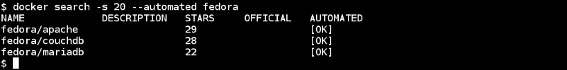

在第三章中，*使用 Docker 镜像*，我们将看到如何设置自动构建。

+   从 Docker 1.3 开始，提供了`--insecure-registry`选项给 Docker 守护程序，允许我们从不安全的注册表中搜索/拉取/提交图像。有关更多详细信息，请查看[`docs.docker.com/reference/commandline/cli/#insecure-registries`](https://docs.docker.com/reference/commandline/cli/#insecure-registries)。

+   RHEL 7 和 Fedora 上的 Docker 软件包提供了`--add-registry`和`--block-registry`选项，分别用于添加和阻止注册表，以更好地控制图像搜索路径。有关更多详细信息，请查看以下链接：

+   [`rhelblog.redhat.com/2015/04/15/understanding-the-changes-to-docker-search-and-docker-pull-in-red-hat-enterprise-linux-7-1/`](http://rhelblog.redhat.com/2015/04/15/understanding-the-changes-to-docker-search-and-docker-pull-in-red-hat-enterprise-linux-7-1/)

+   [`github.com/docker/docker/pull/10411`](https://github.com/docker/docker/pull/10411)

## 另请参阅

+   要获取 Docker 搜索的帮助，请运行以下命令：

```
$ docker search --help

```

+   Docker 网站上的文档[`docs.docker.com/reference/commandline/cli/#search`](https://docs.docker.com/reference/commandline/cli/#search)

# 拉取图像

搜索图像后，我们可以通过运行 Docker 守护程序将其拉取到系统中。让我们看看我们可以如何做到这一点。

## 准备工作

确保 Docker 守护程序在主机上运行，并且可以通过 Docker 客户端进行连接。

## 如何做...

1.  要在 Docker 注册表上拉取图像，请运行以下命令：

```
docker pull NAME[:TAG]

```

以下是拉取 Fedora 图像的示例：

```
$ docker pull fedora

```

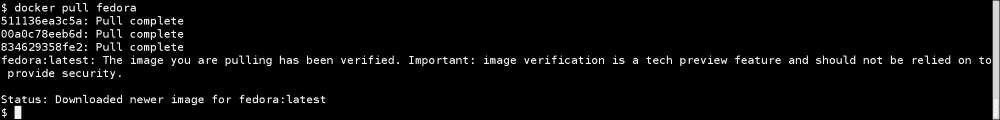

## 它是如何工作的...

`pull`命令从 Docker 注册表下载所有层，这些层是在本地创建该图像所需的。我们将在下一章中看到有关层的详细信息。

## 还有更多...

+   图像标签将相同类型的图像分组。例如，CentOS 可以具有标签如`centos5`，`centos6`等的图像。例如，要拉取具有特定标签的图像，请运行以下命令：

```
$ docker pull centos:centos7

```

+   默认情况下，将拉取具有最新标签的图像。要拉取所有对应于所有标签的图像，请使用以下命令：

```
$ docker pull --all-tags centos

```

+   使用 Docker 1.6（[`blog.docker.com/2015/04/docker-release-1-6/`](https://blog.docker.com/2015/04/docker-release-1-6/)），我们可以通过称为“摘要”的新内容可寻址标识符构建和引用图像。当我们想要使用特定图像而不是标签时，这是一个非常有用的功能。要拉取具有特定摘要的图像，可以考虑以下语法：

```
$ docker pull  <image>@sha256:<digest>

```

以下是一个命令的示例：

```
$ docker pull debian@sha256:cbbf2f9a99b47fc460d422812b6a5adff7dfee951d8fa2e4a98caa0382cfbdbf

```

仅支持 Docker 注册表 v2 的摘要。

+   一旦图像被拉取，它将驻留在本地缓存（存储）中，因此后续的拉取将非常快。这个功能在构建 Docker 分层图像中扮演着非常重要的角色。

## 另请参阅

+   查看 Docker `pull`的`help`选项：

```
$ docker pull --help

```

+   Docker 网站上的文档[`docs.docker.com/reference/commandline/cli/#pull`](https://docs.docker.com/reference/commandline/cli/#pull)

# 列出图像

我们可以列出运行 Docker 守护程序的系统上可用的图像。这些图像可能已经从注册表中拉取，通过`docker`命令导入，或者通过 Docker 文件创建。

## 准备工作

确保 Docker 守护程序在主机上运行，并且可以通过 Docker 客户端进行连接。

## 如何做...

1.  运行以下命令列出图像：

```
$ docker images

```

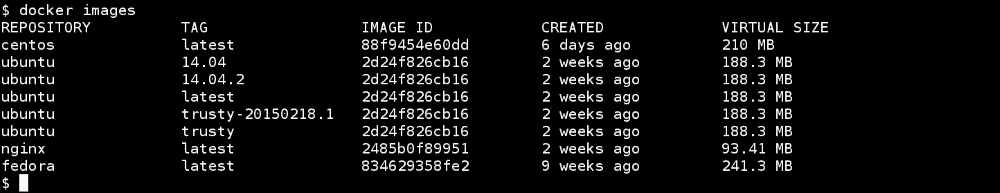

## 它是如何工作的...

Docker 客户端与 Docker 服务器通信，并获取服务器端的图像列表。

## 还有更多...

+   所有具有相同名称但不同标签的图像都会被下载。这里值得注意的有趣之处是它们具有相同的名称但不同的标签。此外，对于相同的`IMAGE ID`，有两个不同的标签，即`2d24f826cb16`。

+   您可能会看到与最新的 Docker 软件包不同的`REPOSITORY`输出，如下面的屏幕截图所示。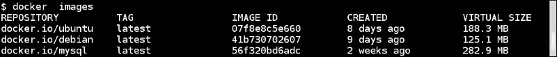

这是因为镜像列表打印了 Docker 注册表主机名。如前面的屏幕截图所示，`docker.io`是注册表主机名。

## 另请参阅

+   查看`docker images`的`help`选项：

```
$ docker images --help

```

+   Docker 网站上的文档[`docs.docker.com/reference/commandline/cli/#images`](https://docs.docker.com/reference/commandline/cli/#images)

# 启动容器

一旦我们有了镜像，就可以使用它们来启动容器。在这个示例中，我们将使用`fedora:latest`镜像启动一个容器，并查看幕后发生的所有事情。

## 准备就绪

确保 Docker 守护程序在主机上运行，并且您可以通过 Docker 客户端进行连接。

## 如何做…

1.  启动容器的语法如下：

```
docker run [ OPTIONS ]  IMAGE[:TAG]  [COMMAND]  [ARG...]

```

以下是一个命令的示例：

```
$ docker run -i -t --name=f21 fedora /bin/bash

```

默认情况下，Docker 会选择带有最新标签的镜像：

+   `-i`选项以交互模式启动容器

+   使用`-t`选项分配一个`伪终端`并将其附加到标准输入

因此，通过上述命令，我们从`fedora:latest`镜像启动一个容器，附加`伪终端`，将其命名为`f21`，并运行`/bin/bash`命令。如果未指定名称，则将分配一个随机字符串作为名称。

此外，如果镜像在本地不可用，则会首先从注册表中下载，然后运行。在运行`run`命令之前，Docker 将运行`search`和`pull`命令。

## 工作原理…

在幕后，Docker：

+   将使用 UnionFS 合并构成该镜像的所有层。

+   为容器分配一个唯一的 ID，称为容器 ID。

+   为容器分配一个文件系统并挂载一个读/写层。对该层的任何更改都将是临时的，如果它们没有被提交，就会被丢弃。

+   分配一个网络/桥接口。

+   为容器分配一个 IP 地址。

+   执行用户指定的进程。

此外，默认情况下，Docker 会在`/var/lib/docker/containers`目录中创建一个包含容器 ID 的目录，其中包含容器的特定信息，如主机名、配置详细信息、日志和`/etc/hosts`。

## 更多内容…

+   要退出容器，请按*Ctrl* + *D*或输入`exit`。这类似于从 shell 中退出，但这将停止容器。

+   `run`命令创建并启动容器。使用 Docker 1.3 或更高版本，可以使用`create`命令只创建容器，然后使用`start`命令稍后运行它，如下例所示：

```
$ ID=$(docker create -t -i fedora bash)
$ docker start -a -i $ID

```

+   容器可以在后台启动，然后我们可以在需要时附加到它。我们需要使用`-d`选项在后台启动容器：

```
$ docker run -d -i -t fedora /bin/bash
0df95cc49e258b74be713c31d5a28b9d590906ed9d6e1a2dc756 72aa48f28c4f

```

前面的命令返回容器的容器 ID，稍后我们可以附加到该容器，如下所示：

```
$ ID='docker run -d -t -i fedora /bin/bash'
$ docker attach $ID

```

在前面的情况下，我们选择了`/bin/bash`在容器内运行。如果我们附加到容器，我们将获得一个交互式 shell。我们可以运行一个非交互式进程，并将其在后台运行，以创建一个守护进程容器，如下所示：

```
$ docker run -d  fedora /bin/bash -c  "while [ 1 ]; do echo hello docker ; sleep 1; done"

```

+   要在退出后删除容器，请使用`--rm`选项启动容器，如下所示：

```
$ docker run --rm fedora date

```

一旦`date`命令退出，容器将被删除。

+   `run`命令的`--read-only`选项将以`只读`模式挂载根文件系统：

```
$ docker run --read-only -d -i -t fedora /bin/bash

```

请记住，此选项只是确保我们不能修改根文件系统上的任何内容，但我们正在写入卷，这将在本书的后面部分进行介绍。当我们不希望用户意外地在容器内写入内容时，此选项非常有用，如果容器没有提交或复制到非临时存储（如卷）上，这些内容将会丢失。

+   您还可以为容器设置自定义标签，这些标签可以用于根据标签对容器进行分组。有关更多详细信息，请参阅本章中的*标记和过滤容器*配方。

### 提示

容器可以通过三种方式引用：按名称，按容器 ID（0df95cc49e258b74be713c31d5a28b9d590906ed9d6e1a2dc75672 aa48f28c4f）和按短容器 ID（0df95cc49e25）

## 另请参阅

+   查看`docker run`的`help`选项：

```
$ docker run --help

```

+   Docker 网站上的文档[`docs.docker.com/reference/commandline/cli/#run`](https://docs.docker.com/reference/commandline/cli/#run)

+   Docker 1.3 发布公告[`blog.docker.com/2014/10/docker-1-3-signed-images-process-injection-security-options-mac-shared-directories/`](http://blog.docker.com/2014/10/docker-1-3-signed-images-process-injection-security-options-mac-shared-directories/)

# 列出容器

我们可以列出正在运行和停止的容器。

## 准备就绪

确保 Docker 守护程序在主机上运行，并且您可以通过 Docker 客户端进行连接。您还需要一些正在运行和/或已停止的容器。

## 如何做…

1.  要列出容器，请运行以下命令：

```
docker ps [ OPTIONS ]

```


## 它是如何工作的…

Docker 守护程序可以查看与容器关联的元数据并将其列出。默认情况下，该命令返回：

+   容器 ID

+   创建它的镜像

+   在启动容器后运行的命令

+   有关创建时间的详细信息

+   当前状态

+   从容器中公开的端口

+   容器的名称

## 还有更多…

+   要列出运行和停止的容器，请使用`-a`选项，如下所示：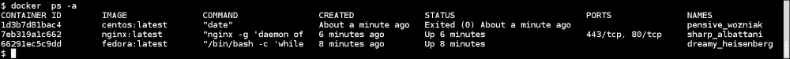

+   要仅返回所有容器的容器 ID，请使用`-aq`选项，如下所示：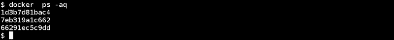

+   要显示最后创建的容器，包括非运行容器，请运行以下命令：

```
$ docker ps -l

```

+   使用`--filter/-f`选项对`ps`进行标记，我们可以列出具有特定标签的容器。有关更多详细信息，请参阅本章中的*标记和过滤容器*示例。

## 另请参阅

查看`docker ps`的`man`页面以查看更多选项：

+   查看`docker ps`的`help`选项：

```
$ docker ps --help

```

+   Docker 网站上的文档[`docs.docker.com/reference/commandline/cli/#ps`](https://docs.docker.com/reference/commandline/cli/#ps)

# 查看容器的日志

如果容器在`STDOUT`/`STDERR`上发出日志或输出，则可以在不登录到容器的情况下获取它们。

## 准备就绪

确保 Docker 守护程序在主机上运行，并且您可以通过 Docker 客户端进行连接。您还需要一个正在运行的容器，该容器会在`STDOUT`上发出日志/输出。

## 如何做…

1.  要从容器中获取日志，请运行以下命令：

```
docker logs [-f|--follow[=false]][-t|--timestamps[=false]] CONTAINER

```

1.  让我们以前面部分的示例为例，运行一个守护式容器并查看日志：

```
$ docker run -d  fedora /bin/bash -c  "while [ 1 ]; do echo hello docker ; sleep 1; done"

```

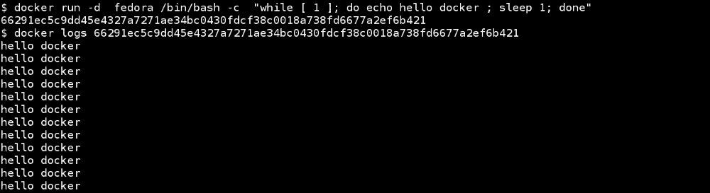

## 它是如何工作的…

Docker 将查看来自`/var/lib/docker/containers/<Container ID>`的容器特定日志文件并显示结果。

## 还有更多…

使用`-t`选项，我们可以在每个日志行中获取时间戳，并使用`-f`可以获得类似 tailf 的行为。

## 另请参阅

+   查看`docker logs`的`help`选项：

```
$ docker logs --help

```

+   Docker 网站上的文档[`docs.docker.com/reference/commandline/cli/#logs`](https://docs.docker.com/reference/commandline/cli/#logs)

# 停止一个容器

我们可以一次停止一个或多个容器。在这个示例中，我们将首先启动一个容器，然后停止它。

## 准备就绪

确保 Docker 守护程序在主机上运行，并且您可以通过 Docker 客户端进行连接。您还需要一个或多个正在运行的容器。

## 如何做…

1.  要停止容器，请运行以下命令：

```
docker stop [-t|--time[=10]] CONTAINER [CONTAINER...]

```

1.  如果您已经有一个正在运行的容器，那么您可以继续停止它；如果没有，我们可以创建一个然后停止它，如下所示：

```
$ ID='docker run -d -i fedora /bin/bash'
$ docker stop $ID

```

## 它是如何工作的…

这将保存容器的状态并停止它。如果需要，可以重新启动。

## 还有更多…

+   要在等待一段时间后停止容器，请使用`--time/-t`选项。

+   要停止所有正在运行的容器，请运行以下命令：

```
$ docker stop 'docker ps -q'

```

## 另请参阅

+   查看`docker stop`的`help`选项：

```
$ docker stop --help

```

+   Docker 网站上的文档[`docs.docker.com/reference/commandline/cli/#stop`](https://docs.docker.com/reference/commandline/cli/#stop)

# 删除容器

我们可以永久删除一个容器，但在此之前我们必须停止容器或使用强制选项。在这个示例中，我们将启动、停止和删除一个容器。

## 准备工作

确保 Docker 守护程序在主机上运行，并且您可以通过 Docker 客户端进行连接。您还需要一些处于停止或运行状态的容器来删除它们。

## 如何做…

1.  使用以下命令：

```
$ docker rm [ OPTIONS ] CONTAINER [ CONTAINER ]

```

1.  让我们首先启动一个容器，然后停止它，然后使用以下命令删除它：

```
$ ID='docker run -d -i fedora /bin/bash '
$ docker stop $ID
$ docker rm $ID

```


正如我们从前面的屏幕截图中可以看到的，容器没有显示出来，这是在停止后输入`docker ps`命令后。我们必须提供`-a`选项来列出它。容器停止后，我们可以删除它。

## 还有更多…

+   强制删除容器而不进行中间停止，请使用`-f`选项。

+   要删除所有容器，我们首先需要停止所有正在运行的容器，然后再删除它们。在运行命令之前要小心，因为这些命令将删除正在运行和停止的容器：

```
$ docker stop 'docker ps -q'
$ docker rm 'docker ps -aq'

```

+   有选项可以删除与容器相关的指定链接和卷，我们将在后面探讨。

## 它是如何工作的…

Docker 守护程序将删除在启动容器时创建的读/写层。

## 另请参阅

+   查看`docker rm`的`help`选项

```
$ docker rm --help

```

+   Docker 网站上的文档[`docs.docker.com/reference/commandline/cli/#rm`](https://docs.docker.com/reference/commandline/cli/#rm)

# 在容器上设置重启策略

在 Docker 1.2 之前，曾经有一个重新启动容器的选项。随着 Docker 1.2 的发布，它已经添加到了`run`命令中，并使用标志来指定重新启动策略。通过这个策略，我们可以配置容器在启动时启动。当容器意外死掉时，这个选项也非常有用。

## 准备工作

确保 Docker 守护程序在主机上运行，并且您可以通过 Docker 客户端进行连接。

## 操作步骤…

您可以使用以下语法设置重新启动策略：

```
$ docker run --restart=POLICY [ OPTIONS ]  IMAGE[:TAG]  [COMMAND]  [ARG...]

```

以下是一个命令的示例：

```
$ docker run --restart=always -d -i -t fedora /bin/bash

```

有三种重新启动策略可供选择：

+   `no`: 如果容器死掉，它不会重新启动

+   `on-failure`: 如果容器以非零退出代码失败，则重新启动容器

+   `always`: 这总是重新启动容器，不用担心返回代码

## 还有更多…

您还可以使用`on-failure`策略给出可选的重新启动计数，如下所示：

```
$ docker run --restart=on-failure:3 -d -i -t fedora /bin/bash

```

前面的命令只会在发生故障时重新启动容器三次。

## 另请参阅

+   查看`docker run`的`help`选项：

```
$ docker run --help

```

+   Docker 网站上的文档[`docs.docker.com/reference/commandline/cli/#run`](https://docs.docker.com/reference/commandline/cli/#run)。

+   如果重新启动不符合您的要求，那么可以使用`systemd` ([`freedesktop.org/wiki/Software/systemd/`](http://freedesktop.org/wiki/Software/systemd/)) 来解决容器在失败时自动重新启动的问题。有关更多信息，请访问[`docs.docker.com/articles/host_integration/`](https://docs.docker.com/articles/host_integration/)。

# 在容器内获取特权访问

Linux 将传统上与超级用户关联的特权分为不同的单元，称为功能（在基于 Linux 的系统上运行`man capabilities`），可以独立启用和禁用。例如，`net_bind_service`功能允许非用户进程绑定到 1,024 以下的端口。默认情况下，Docker 以有限的功能启动容器。通过在容器内获取特权访问，我们可以赋予更多的功能来执行通常由 root 完成的操作。例如，让我们尝试在挂载磁盘映像时创建一个回环设备。

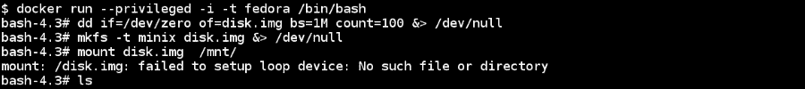

## 准备工作

确保 Docker 守护程序在主机上运行，并且您可以通过 Docker 客户端进行连接。

## 操作步骤…

1.  要使用`privileged`模式，请使用以下命令：

```
$ docker run --privileged [ OPTIONS ]  IMAGE[:TAG]  [COMMAND]  [ARG...]

```

1.  现在让我们尝试使用特权访问的前面的示例：

```
$ docker run  --privileged  -i -t fedora /bin/bash

```


## 它是如何工作的…

通过在容器内提供几乎所有功能。

## 还有更多…

这种模式会带来安全风险，因为容器可以在 Docker 主机上获得根级访问权限。使用 Docker 1.2 或更高版本，添加了两个新标志`--cap-add`和`--cap-del`，以在容器内提供细粒度的控制。例如，要防止容器内的任何`chown`，请使用以下命令：

```
$ docker run --cap-drop=CHOWN [ OPTIONS ]  IMAGE[:TAG]  [COMMAND]  [ARG...]

```

查看第九章，“Docker 安全性”，了解更多详情。

## 另请参阅

+   查看`docker run`的`help`选项：

```
$ docker run --help

```

+   Docker 网站上的文档[`docs.docker.com/reference/commandline/cli/#run`](https://docs.docker.com/reference/commandline/cli/#run)

+   Docker 1.2 发布公告[`blog.docker.com/2014/08/announcing-docker-1-2-0/`](http://blog.docker.com/2014/08/announcing-docker-1-2-0/)

# 在启动容器时暴露端口

有多种方法可以暴露容器上的端口。其中一种是通过`run`命令，我们将在本章中介绍。其他方法是通过 Docker 文件和`--link`命令。我们将在其他章节中探讨它们。

## 准备就绪

确保 Docker 守护程序在主机上运行，并且您可以通过 Docker 客户端进行连接。

## 如何做…

1.  暴露端口的语法如下：

```
$ docker run --expose=PORT [ OPTIONS ]  IMAGE[:TAG]  [COMMAND]  [ARG...]

```

例如，要在启动容器时暴露端口 22，请运行以下命令：

```
$ docker run --expose=22 -i -t fedora /bin/bash

```

## 还有更多…

有多种方法可以为容器暴露端口。现在，我们将看到如何在启动容器时暴露端口。我们将在后续章节中探讨其他暴露端口的选项。

## 另请参阅

+   查看`docker run`的`help`选项：

```
$ docker run --help

```

+   Docker 网站上的文档[`docs.docker.com/reference/commandline/cli/#run`](https://docs.docker.com/reference/commandline/cli/#run)

# 在容器内访问主机设备

从 Docker 1.2 开始，我们可以使用`--device`选项将主机设备的访问权限提供给容器的`run`命令。以前，必须使用`-v`选项进行绑定挂载，并且必须使用`--privileged`选项进行操作。

## 准备就绪

确保 Docker 守护程序在主机上运行，并且您可以通过 Docker 客户端进行连接。您还需要一个设备传递给容器。

## 如何做…

1.  您可以使用以下语法将主机设备的访问权限提供给容器：

```
$ docker run --device=<Host Device>:<Container Device Mapping>:<Permissions>   [ OPTIONS ]  IMAGE[:TAG]  [COMMAND]  [ARG...]

```

这是一个命令的例子：

```
$ docker run --device=/dev/sdc:/dev/xvdc -i -t fedora /bin/bash

```

## 它是如何工作的…

上述命令将访问容器内的`/dev/sdc`。

## 另请参阅

+   查看`docker run`的`help`选项：

```
 $ docker run --help

```

+   Docker 网站上的文档[`docs.docker.com/reference/commandline/cli/#run`](https://docs.docker.com/reference/commandline/cli/#run)

# 向正在运行的容器注入新进程

在开发和调试过程中，我们可能想要查看已经运行的容器内部。有一些实用程序，比如`nsenter`([`github.com/jpetazzo/nsenter`](https://github.com/jpetazzo/nsenter))，允许我们进入容器的命名空间进行检查。使用在 Docker 1.3 中添加的`exec`选项，我们可以在运行的容器内注入新进程。

## 准备工作

确保 Docker 守护程序在主机上运行，并且您可以通过 Docker 客户端进行连接。您可能还需要一个正在运行的容器来注入进程。

## 如何做…

1.  您可以使用以下命令在运行的容器中注入进程：

```
 $ docker exec [-d|--detach[=false]] [--help] [-i|--interactive[=false]] [-t|--tty[=false]] CONTAINER COMMAND [ARG...]

```

1.  让我们启动一个`nginx`容器，然后注入`bash`进去：

```
$ ID='docker run -d nginx'
$ docker run -it $ID bash

```


## 工作原理…

`exec`命令进入容器的命名空间并启动新进程。

## 另请参阅

+   查看 Docker inspect 的`help`选项：

```
 $ docker exec --help

```

+   Docker 网站上的文档[`docs.docker.com/reference/commandline/cli/#exec`](https://docs.docker.com/reference/commandline/cli/#exec)

# 返回有关容器的低级信息

在进行调试、自动化等操作时，我们将需要容器配置详细信息。Docker 提供了`inspect`命令来轻松获取这些信息。

## 准备工作

确保 Docker 守护程序在主机上运行，并且您可以通过 Docker 客户端进行连接。

## 如何做…

1.  要检查容器/镜像，请运行以下命令：

```
$ docker inspect [-f|--format="" CONTAINER|IMAGE [CONTAINER|IMAGE...]

```

1.  我们将启动一个容器，然后对其进行检查：

```
$ ID='docker run -d -i fedora /bin/bash'
$ docker inspect $ID
[{
 "Args": [],
 "Config": {
 "AttachStderr": false,
 "AttachStdin": false,
 "AttachStdout": false,
 "Cmd": [
 "/bin/bash"
 ],
 .........
 .........
}]

```

## 工作原理…

Docker 将查看给定镜像或容器的元数据和配置，并呈现出来。

## 还有更多…

使用`-f | --format`选项，我们可以使用 Go（编程语言）模板来获取特定信息。以下命令将给出容器的 IP 地址：

```
$ docker inspect --format='{{.NetworkSettings.IPAddress}}'  $ID
172.17.0.2

```

## 另请参阅

+   查看`docker inspect`的`help`选项：

```
 $ docker inspect --help

```

+   Docker 网站上的文档[`docs.docker.com/reference/commandline/cli/#inspect`](https://docs.docker.com/reference/commandline/cli/#inspect)

# 标记和过滤容器

使用 Docker 1.6，已添加了一个功能来标记容器和镜像，通过这个功能，我们可以向它们附加任意的键值元数据。您可以将它们视为环境变量，这些变量对于容器内运行的应用程序不可用，但对于管理镜像和容器的程序（Docker CLI）是可用的。附加到镜像的标签也会应用到通过它们启动的容器。我们还可以在启动容器时附加标签。

Docker 还为容器、镜像和事件提供了过滤器（[`docs.docker.com/reference/commandline/cli/#filtering`](https://docs.docker.com/reference/commandline/cli/#filtering)），我们可以与标签一起使用，以缩小搜索范围。

对于这个示例，让我们假设我们有一个带有标签 `distro=fedora21` 的镜像。在下一章中，我们将看到如何为镜像分配标签。

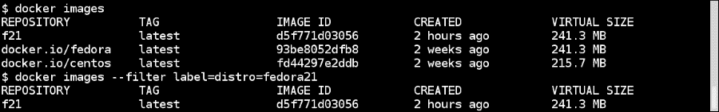

从上面的截图中可以看到，如果我们在 `docker images` 命令中使用过滤器，我们只会得到一个在镜像元数据中找到相应标签的镜像。

## 准备工作

确保主机上运行着 Docker 守护程序 1.6 及以上版本，并且您可以通过 Docker 客户端进行连接。

## 操作步骤如下…

1.  要使用 `--label/-l` 选项启动容器，请运行以下命令：

```
$ docker run --label environment=dev f21 date

```

1.  让我们启动一个没有标签的容器，并使用相同的标签启动另外两个：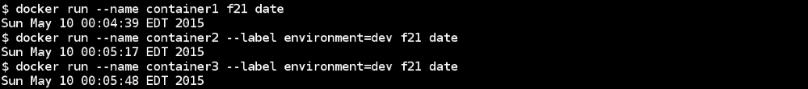

如果我们列出所有没有标签的容器，我们将看到所有的容器，但如果我们使用标签，那么我们只会得到与标签匹配的容器。


## 工作原理…

Docker 在启动容器时附加标签元数据，并在列出它们或其他相关操作时匹配标签。

## 更多信息…

+   我们可以通过 `inspect` 命令列出附加到容器的所有标签，这是我们在之前的示例中看到的。正如我们所看到的，`inspect` 命令返回了镜像和容器的标签。

+   您可以从文件（使用 `--from-file` 选项）中应用标签，该文件包含以新的 EOL 分隔的标签列表。

+   这些标签与 Kubernetes 标签不同，我们将在第八章中看到，*Docker Orchestration and Hosting Platforms*。

## 另请参阅

+   Docker 官网上的文档[`docs.docker.com/reference/builder/#label`](https://docs.docker.com/reference/builder/#label)

+   [`rancher.com/docker-labels/`](http://rancher.com/docker-labels/)
