# 第四章。容器的网络和数据管理

在本章中，我们将涵盖以下内容：

+   从外部访问容器

+   管理容器中的数据

+   连接两个或多个容器

+   通过链接容器开发 LAMP 应用程序

+   使用 Flannel 进行多主机容器的网络

+   为容器分配 IPv6 地址

# 介绍

到目前为止，我们已经使用单个容器并在本地访问它。但是随着我们转向更多的真实用例，我们将需要从外部世界访问容器，在容器内共享外部存储，与在其他主机上运行的容器通信等。在本章中，我们将看到如何满足其中一些要求。让我们首先了解 Docker 的默认网络设置，然后转向高级用例。

当 Docker 守护程序启动时，它会创建一个名为`docker0`的虚拟以太网桥。例如，我们将在运行 Docker 守护程序的系统上使用`ip addr`命令看到以下内容：


正如我们所看到的，`docker0`的 IP 地址为 172.17.42.1/16。Docker 随机选择一个地址和子网，来自 RFC 1918（[`tools.ietf.org/html/rfc1918`](https://tools.ietf.org/html/rfc1918)）中定义的私有范围。使用这个桥接接口，容器可以彼此通信，也可以与主机系统通信。

默认情况下，每次 Docker 启动一个容器，它都会创建一对虚拟接口，其中一端连接到主机系统，另一端连接到创建的容器。让我们启动一个容器，看看会发生什么：

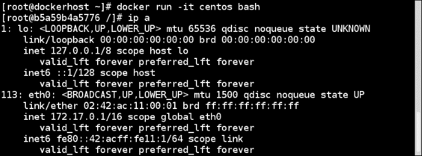

连接到容器的`eth0`接口的一端获得了 172.17.0.1/16 的 IP 地址。我们还在主机系统上的接口的另一端看到了以下条目：


现在，让我们创建更多的容器，并使用管理以太网桥的`brctl`命令查看`docker0`桥接：

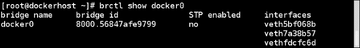

每个 veth*都绑定到`docker0`桥接，这样就在主机和每个 Docker 容器之间创建了一个虚拟子网。除了设置`docker0`桥接之外，Docker 还创建了 IPtables NAT 规则，以便所有容器默认可以与外部世界通信，但反之则不行。让我们看看 Docker 主机上的 NAT 规则：


如果我们尝试从容器连接到外部世界，我们将不得不通过默认创建的 Docker 桥：

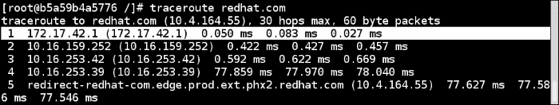

在本章的后面，我们将看到外部世界如何连接到容器。

在启动容器时，我们有几种模式可以选择其网络：

+   `--net=bridge`：这是我们刚刚看到的默认模式。因此，我们用来启动容器的前面的命令可以写成如下形式：

```
**$ docker run -i -t --net=bridge centos /bin/bash** 

```

+   `--net=host`：使用此选项，Docker 不会为容器创建网络命名空间；相反，容器将与主机进行网络堆栈。因此，我们可以使用以下选项启动容器：

```
 **$ docker run -i -t  --net=host centos bash** 

```

然后我们可以在容器内运行`ip addr`命令，如下所示：

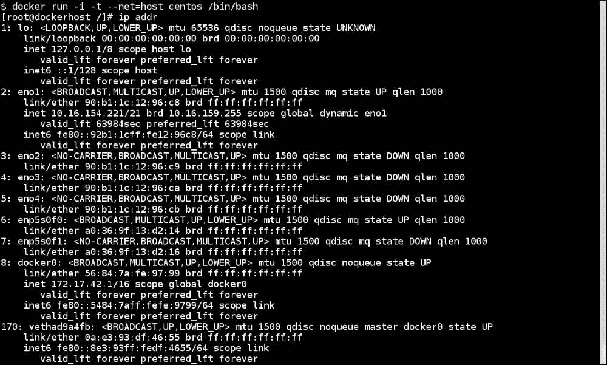

我们可以看到所有连接到主机的网络设备。使用这种配置的一个例子是在容器中运行`nginx`反向代理，以提供在主机上运行的 Web 应用程序。

+   `--net=container:NAME_or_ID`：使用此选项，Docker 在启动容器时不会创建新的网络命名空间，而是从另一个容器中共享它。让我们启动第一个容器并查找其 IP 地址：

```
**$ docker run -i -t --name=centos centos bash** 

```

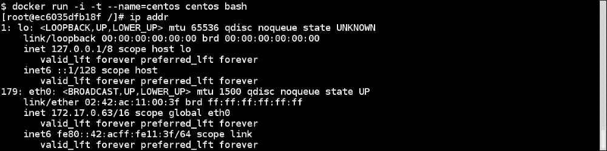

现在开始另一个如下：

```
**$ docker run -i -t --net=container:centos ubuntu bash**

```

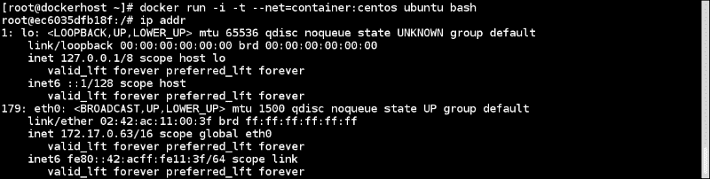

正如我们所看到的，两个容器包含相同的 IP 地址。

Kubernetes（[`kubernetes.io/`](http://kubernetes.io/)）Pod 中的容器使用此技巧来相互连接。我们将在第八章中重新讨论这个问题，*Docker 编排和托管平台*。

+   `--net=none`：使用此选项，Docker 在容器内创建网络命名空间，但不配置网络。

### 注意

有关我们在前面部分讨论的不同网络的更多信息，请访问[`docs.docker.com/articles/networking/#how-docker-networks-a-container`](https://docs.docker.com/articles/networking/#how-docker-networks-a-container)。

从 Docker 1.2 版本开始，还可以在运行的容器上更改`/etc/host`、`/etc/hostname`和`/etc/resolv.conf`。但是，请注意，这些只是用于运行容器。如果重新启动，我们将不得不再次进行更改。

到目前为止，我们已经在单个主机上查看了网络，但在现实世界中，我们希望连接多个主机，并且让一个主机上的容器与另一个主机上的容器进行通信。Flannel ([`github.com/coreos/flannel`](https://github.com/coreos/flannel))，Weave ([`github.com/weaveworks/weave`](https://github.com/weaveworks/weave))，Calio ([`www.projectcalico.org/getting-started/docker/`](http://www.projectcalico.org/getting-started/docker/))和 Socketplane ([`socketplane.io/`](http://socketplane.io/))是一些提供此功能的解决方案。在本章的后面，我们将看到如何配置 Flannel 进行多主机网络。Socketplane 于'15 年 3 月加入了 Docker Inc。

社区和 Docker 正在构建一个**容器网络模型**（**CNM**）与 libnetwork ([`github.com/docker/libnetwork`](https://github.com/docker/libnetwork))，它提供了一个原生的 Go 实现来连接容器。有关此开发的更多信息，请访问[`blog.docker.com/2015/04/docker-networking-takes-a-step-in-the-right-direction-2/`](http://blog.docker.com/2015/04/docker-networking-takes-a-step-in-the-right-direction-2/)。

# 从外部访问容器

一旦容器启动，我们希望从外部访问它。如果您使用`--net=host`选项启动容器，则可以通过 Docker 主机 IP 访问它。使用`--net=none`，您可以通过公共端口或其他复杂的设置附加网络接口。让我们看看默认情况下会发生什么——从主机网络接口转发数据包到容器。

## 准备工作

确保 Docker 守护程序在主机上运行，并且您可以通过 Docker 客户端进行连接。

## 如何做…

1.  让我们使用`-P`选项启动一个容器：

```
**$ docker run --expose 80 -i -d -P --name f20 fedora /bin/bash**

```

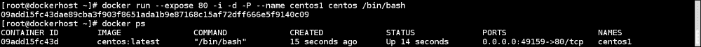

这会自动将容器的任何网络端口映射到 Docker 主机的 49000 到 49900 之间的随机高端口。

在`PORTS`部分，我们看到`0.0.0.0:49159->80/tcp`，格式如下：

```
**<Host Interface>:<Host Port> -> <Container Interface>/<protocol>**

```

因此，如果来自 Docker 主机上任何接口的端口`49159`的任何请求，请求将被转发到`centos1`容器的端口`80`。

我们还可以使用`-p`选项将容器的特定端口映射到主机的特定端口：

```
**$  docker run -i -d -p 5000:22 --name centos2 centos /bin/bash**

```

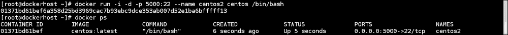

在这种情况下，来自 Docker 主机上任何接口的端口`5000`的所有请求都将被转发到`centos2`容器的端口`22`。

## 工作原理…

使用默认配置，Docker 设置防火墙规则，将连接从主机转发到容器，并在 Docker 主机上启用 IP 转发：


如前面的例子所示，已经设置了一个`DNAT`规则，将主机上端口`5000`的所有流量转发到容器的端口`22`。

## 还有更多…

默认情况下，使用`-p`选项，Docker 将所有请求转发到主机的任何接口。要绑定到特定接口，可以指定如下内容：

```
**$ docker run -i -d -p 192.168.1.10:5000:22 --name f20 fedora /bin/bash**

```

在这种情况下，只有来自 Docker 主机上 IP 为`192.168.1.10`的接口的端口`5000`的所有请求都将被转发到`f20`容器的端口`22`。要将容器的端口`22`映射到主机的动态端口，可以运行以下命令：

```
**$ docker run -i -d -p 192.168.1.10::22 --name f20 fedora /bin/bash**

```

我们可以将容器上的多个端口绑定到主机上的端口，如下所示：

```
**$  docker run -d -i -p 5000:22 -p 8080:80 --name f20 fedora /bin/bash**

```

我们可以查找映射到容器端口的公共端口，如下所示：

```
**$ docker port f20 80**
**0.0.0.0:8080**

```

要查看容器的所有网络设置，可以运行以下命令：

```
**$ docker inspect   -f "{{ .NetworkSettings }}" f20** 

```

## 另请参阅

+   Docker 网站上的网络文档：[`docs.docker.com/articles/networking/`](https://docs.docker.com/articles/networking/)。

# 在容器中管理数据

当容器被删除时，任何未提交的数据或容器中的更改都会丢失。例如，如果您在容器中配置了 Docker 注册表并推送了一些镜像，那么一旦注册表容器被删除，所有这些镜像都会丢失，如果您没有提交它们。即使您提交了，也不是最佳做法。我们应该尽量保持容器的轻量化。以下是两种主要的管理 Docker 数据的方法：

+   **数据卷**：来自 Docker 文档([`docs.docker.com/userguide/dockervolumes/`](https://docs.docker.com/userguide/dockervolumes/))，数据卷是一个专门指定的目录，位于一个或多个容器中，绕过联合文件系统，提供了几个有用的特性，用于持久或共享数据：

+   在创建容器时初始化卷。如果容器的基本镜像包含指定挂载点的数据，则该数据将被复制到新卷中。

+   数据卷可以在容器之间共享和重复使用。

+   对数据卷的更改是直接进行的。

+   对数据卷的更改不会在更新镜像时包含在内。

+   数据卷会持久存在，直到没有容器在使用它们。

+   **数据卷容器**：由于卷会持久存在，直到没有容器在使用它，我们可以使用卷在容器之间共享持久数据。因此，我们可以创建一个命名的数据卷容器，并将数据挂载到另一个容器中。

## 准备工作

确保 Docker 守护程序在主机上运行，并且可以通过 Docker 客户端进行连接。

## 如何做...

1.  添加数据卷。使用`docker run`命令的`-v`选项，我们向容器添加数据卷：

```
**$ docker run -t -d -P -v /data --name f20 fedora /bin/bash** 

```

我们可以在容器中拥有多个数据卷，可以通过多次添加`-v`来创建：

```
**$ docker run -t -d -P -v /data -v /logs --name f20 fedora /bin/bash** 

```

### 提示

`VOLUME`指令可以在 Dockerfile 中使用，通过添加类似于`VOLUME ["/data"]`的内容来添加数据卷。

我们可以使用`inspect`命令查看容器的数据卷详细信息：

```
**$ docker inspect -f "{{ .Config.Volumes }}" f20**
**$ docker inspect -f "{{ .Volumes }}" f20**

```


如果容器中不存在目标目录，它将被创建。

1.  接下来，我们将主机目录挂载为数据卷。我们还可以使用`-v`选项将主机目录映射到数据卷：

```
**$ docker run -i -t -v /source_on_host:/destination_on_container fedora /bin/bash**

```

考虑以下示例：

```
**$ docker run -i -t -v /srv:/mnt/code fedora /bin/bash**

```

在不同环境中测试代码、在中央位置收集日志等情况下，这可能非常有用。我们还可以按照以下方式将主机目录映射为只读模式：

```
**$ docker run -i -t -v /srv:/mnt/code:ro fedora /bin/bash**

```

我们还可以使用以下命令将主机的整个根文件系统挂载到容器中：

```
**$ docker run -i -t -v /:/host:ro fedora /bin/bash**

```

如果主机上的目录（`/srv`）不存在，则将创建它，前提是您有权限创建。此外，在启用 SELinux 的 Docker 主机上，如果 Docker 守护程序配置为使用 SELinux（`docker -d --selinux-enabled`），则在尝试访问挂载卷上的文件之前，如果您尝试访问挂载卷上的文件，您将看到`permission denied`错误。要重新标记它们，请使用以下命令之一：

```
**$ docker run -i -t -v /srv:/mnt/code:z fedora /bin/bash**
**$ docker run -i -t -v /srv:/mnt/code:Z fedora /bin/bash**

```

请访问第九章，*Docker 安全性*，以获取更多详细信息。

1.  现在，创建一个数据卷容器。通过卷共享主机目录到容器时，我们将容器绑定到给定的主机，这是不好的。此外，在这种情况下，存储不受 Docker 控制。因此，在我们希望数据持久化即使更新容器时，我们可以从数据卷容器获得帮助。数据卷容器用于创建卷，仅此而已；它们甚至不运行。由于创建的卷附加到容器（未运行），因此无法删除。例如，这是一个命名的数据容器：

```
**$ docker run -d -v /data --name data fedora echo "data volume container"**

```

这将只创建一个将映射到 Docker 管理的目录的卷。现在，其他容器可以使用`--volumes-from`选项从数据容器中挂载卷，如下所示：

```
**$ docker run  -d -i -t --volumes-from data --name client1 fedora /bin/bash**

```

我们可以从数据卷容器挂载卷到多个容器：

```
**$ docker run  -d -i -t --volumes-from data --name client2 fedora /bin/bash**

```


我们还可以多次使用`--volumes-from`来从多个容器获取数据卷。我们还可以通过从某个其他容器挂载卷的容器来创建链。

## 它是如何工作的...

在数据卷的情况下，当主机目录未共享时，Docker 在`/var/lib/docker/`中创建一个目录，然后与其他容器共享。

## 还有更多...

+   使用`-v`标志删除卷以`docker rm`，只有当没有其他容器在使用它时。如果其他容器正在使用卷，则容器将被删除（使用`docker rm`），但卷将不会被删除。

+   在上一章中，我们看到了如何配置 Docker 注册表，默认情况下以`dev` flavor 启动。在此注册表中，上传的图像保存在我们启动的容器中的`/tmp/registry`文件夹中。我们可以在注册表容器中挂载主机上的`/tmp/registry`目录，因此每当我们上传图像时，它将保存在运行 Docker 注册表的主机上。因此，要启动容器，我们运行以下命令：

```
**$ docker run -v /srv:/tmp/registry -p 5000:5000 registry**

```

要推送图像，我们运行以下命令：

```
**$ docker push registry-host:5000/nkhare/f20**

```

成功推送图像后，我们可以查看我们在 Docker 注册表中挂载的目录的内容。在我们的情况下，我们应该看到以下目录结构：

```
/srv/
├── images 
│   ├── 3f2fed40e4b0941403cd928b6b94e0fd236dfc54656c00e456747093d10157ac 
│   │   ├── ancestry 
│   │   ├── _checksum 
│   │   ├── json 
│   │   └── layer 
│   ├── 511136ea3c5a64f264b78b5433614aec563103b4d4702f3ba7d4d2698e22c158 
│   │   ├── ancestry 
│   │   ├── _checksum 
│   │   ├── json 
│   │   └── layer 
│   ├── 53263a18c28e1e54a8d7666cb835e9fa6a4b7b17385d46a7afe55bc5a7c1994c 
│   │   ├── ancestry 
│   │   ├── _checksum 
│   │   ├── json 
│   │   └── layer 
│   └── fd241224e9cf32f33a7332346a4f2ea39c4d5087b76392c1ac5490bf2ec55b68 
│       ├── ancestry 
│       ├── _checksum 
│       ├── json 
│       └── layer 
├── repositories 
│   └── nkhare 
│       └── f20 
│           ├── _index_images 
│           ├── json 
│           ├── tag_latest 
│           └── taglatest_json 
```

## 另请参阅

+   Docker 网站上的文档位于[`docs.docker.com/userguide/dockervolumes/`](https://docs.docker.com/userguide/dockervolumes/)

+   [`container42.com/2013/12/16/persistent-volumes-with-docker-container-as-volume-pattern/`](http://container42.com/2013/12/16/persistent-volumes-with-docker-container-as-volume-pattern/)

+   [`container42.com/2014/11/03/docker-indepth-volumes/`](http://container42.com/2014/11/03/docker-indepth-volumes/)

# 链接两个或更多个容器

通过容器化，我们希望通过在不同的容器上运行服务，然后将它们链接在一起来创建我们的堆栈。在上一章中，我们通过将 Web 服务器和数据库放在同一个容器中来创建了一个 WordPress 容器。但是，我们也可以将它们放在不同的容器中并将它们链接在一起。容器链接在它们之间创建了一个父子关系，其中父容器可以看到其子容器的选定信息。链接依赖于容器的命名。

## 准备工作

确保 Docker 守护程序在主机上运行，并且您可以通过 Docker 客户端进行连接。

## 如何操作…

1.  创建一个名为`centos_server`的命名容器：

```
**$ docker run  -d -i -t --name centos_server centos /bin/bash**

```

如何操作…

1.  现在，让我们使用`--link`选项启动另一个名为 client 的容器，并将其与`centos_server`容器进行链接，该选项接受`name:alias`参数。然后查看`/etc/hosts`文件：

```
**$ docker run  -i -t --link centos_server:server --name client fedora /bin/bash** 

```

如何操作…

## 工作原理…

在上面的例子中，我们使用别名 server 将`centos_server`容器链接到客户端容器。通过链接这两个容器，第一个容器（在本例中为`centos_server`）的条目将被添加到客户端容器的`/etc/hosts`文件中。此外，在客户端中设置了一个名为`SERVER_NAME`的环境变量来引用服务器。

工作原理…

## 还有更多…

现在，让我们创建一个`mysql`容器：

```
**$ docker run --name mysql -e MYSQL_ROOT_PASSWORD=mysecretpassword -d mysql**

```

然后，让我们从客户端链接它并检查环境变量：

```
**$ docker run  -i -t --link mysql:mysql-server --name client fedora /bin/bash**

```

还有更多…

还让我们看一下`docker ps`的输出：

还有更多…

如果仔细观察，我们在启动`client`容器时没有指定`-P`或`-p`选项来映射两个容器之间的端口。根据容器暴露的端口，Docker 在链接到它的容器之间创建了一个内部安全隧道。为此，Docker 在链接器容器内设置环境变量。在前面的情况下，`mysql`是链接的容器，client 是链接器容器。由于`mysql`容器暴露端口`3306`，我们在客户端容器内看到相应的环境变量（`MYSQL_SERVER_*`）。

### 提示

由于链接取决于容器的名称，如果要重用名称，必须删除旧容器。

## 另请参阅

+   在 Docker 网站上的文档，请访问[`docs.docker.com/userguide/dockerlinks/`](https://docs.docker.com/userguide/dockerlinks/)

# 通过链接容器开发 LAMP 应用程序

让我们通过链接容器来扩展先前的食谱，创建一个 LAMP 应用程序（WordPress）。

## 准备工作

从 Docker 注册表中拉取 MySQL 和 WordPress 镜像：

+   对于 MySQL：

+   有关镜像，请访问[`registry.hub.docker.com/_/mysql/`](https://registry.hub.docker.com/_/mysql/)

+   对于 Dockerfile，请访问[`github.com/docker-library/docker-mysql`](https://github.com/docker-library/docker-mysql)

+   对于 WordPress：

+   有关镜像，请访问[`registry.hub.docker.com/_/wordpress/`](https://registry.hub.docker.com/_/wordpress/)

+   对于 Dockerfile，请访问[`github.com/docker-library/wordpress`](https://github.com/docker-library/wordpress)

## 如何做...

1.  首先，启动一个`mysql`容器：

```
**$ docker run --name mysql -e MYSQL_ROOT_PASSWORD=mysecretpassword -d mysql**

```

1.  然后，启动`wordpress`容器并将其与`mysql`容器链接起来：

```
**$ docker run -d --name wordpress --link mysql:mysql -p 8080:80 wordpress** 

```


我们将 Docker 主机的`8080`端口映射到容器的`80`端口，因此我们可以通过访问 Docker 主机上的`8080`端口和`http://<DockerHost>:8080` URL 来连接 WordPress。

## 它是如何工作的...

在`wordpress`和`mysql`容器之间创建了一个链接。每当`wordpress`容器收到一个数据库请求时，它将其传递给`mysql`容器并获取结果。查看前面的食谱以获取更多详细信息。

# 使用 Flannel 进行多主机容器的网络连接

在这个教程中，我们将使用 Flannel ([`github.com/coreos/flannel`](https://github.com/coreos/flannel)) 来设置多主机容器网络。Flannel 是一个通用的覆盖网络，可以作为**软件定义网络**（**SDN**）的替代方案。它是一个基于 IP 的解决方案，使用**虚拟可扩展局域网**（**VXLAN**），为运行该容器的主机分配唯一的 IP 地址。因此，在这种解决方案中，每个主机在集群中使用覆盖网络内的不同子网进行通信。Flannel 使用`etcd`服务 ([`github.com/coreos/etcd`](https://github.com/coreos/etcd)) 作为键值存储。

## 准备工作

对于这个教程，我们将需要安装了 Fedora 21 的三个虚拟机或物理机。

## 如何做…

1.  让我们称一台机器/虚拟机为`master`，另外两台为`minion1`和`minion2`。根据您系统的 IP 地址，更新`/etc/hosts`文件如下：

1.  在我们设置的所有系统上安装`etcd`、`Flannel`和`Docker`：

```
**$ yum install -y etcd flannel docker**

```

1.  在`/etc/etcd/etcd.conf`文件中将`ETCD_LISTEN_CLIENT_URLS`的值修改为`http://master.example.com:4001`如下：

```
ETCD_LISTEN_CLIENT_URLS="http://master.example.com:4001"
```

1.  在 master 中，启动`etcd`服务并检查其状态：

```
**$ systemctl start etcd**
**$ systemctl enable etcd**
**$ systemctl status etcd**

```

1.  在 master 中，创建一个名为`flannel-config.json`的文件，内容如下：

```
{
"Network": "10.0.0.0/16",
"SubnetLen": 24,
"Backend": {
"Type": "vxlan",
"VNI": 1
   }
}
```

1.  使用`config`作为键将上述配置文件上传到`etcd`：

```
**$ curl -L http://master.example.com:4001/v2/keys/coreos.com/network/config -XPUT --data-urlencode value@flannel-config.json**

```

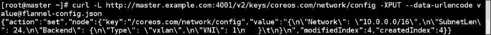

1.  在 master 中，更新`/etc/sysconfig/flanneld`文件中的`FLANNEL_OPTIONS`以反映系统的接口。同时，更新`FLANNEL_ETCD`以使用主机名而不是 127.0.0.1:4001 地址。

1.  在 master 中，启用和启动`flanneld`服务：

```
**$ systemctl enable flanneld**
**$ systemctl start flanneld**
**$ systemctl status flanneld**

```


1.  从 minion 系统中，检查对`etcd`的与 master 的连接：

```
**[root@minion1 ~]#  curl -L http://master.example.com:4001/v2/keys/coreos.com/network/config**

```

1.  更新两个 minion 中的`/etc/sysconfig/flanneld`文件，指向 master 中运行的`etcd`服务器，并更新`FLANNEL_OPTIONS`以反映 minion 主机的接口：

1.  在两个 minion 中启用和启动`flanneld`服务：

```
**$ systemctl enable flanneld**
**$ systemctl start flanneld**
**$ systemctl status flanneld**

```

1.  在集群中的任何一台主机上运行以下命令：

```
**$ curl -L http://master.example.com:4001/v2/keys/coreos.com/network/subnets | python -mjson.tool**

```

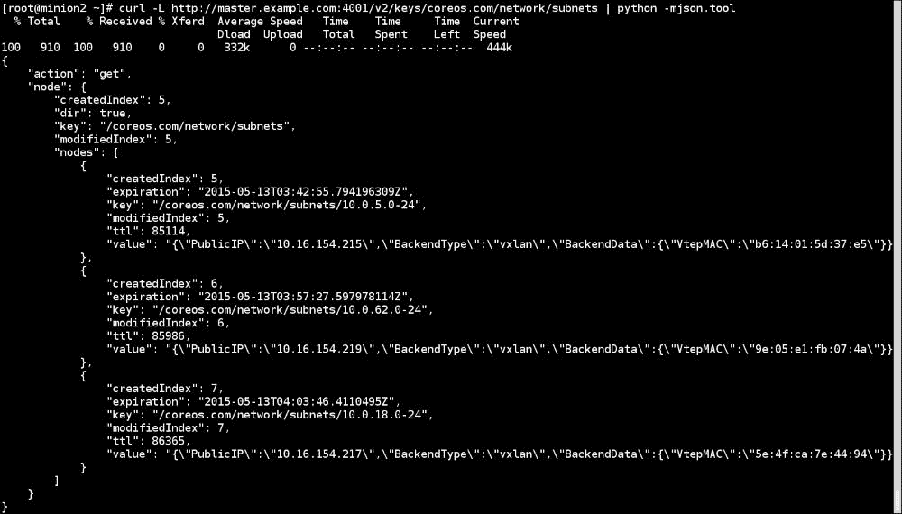

这告诉我们网络中主机的数量以及与它们关联的子网（查看每个节点的密钥）。我们可以将子网与主机上的 MAC 地址关联起来。在每个主机上，`/run/flannel/docker`和`/run/flannel/subnet.env`文件中填充了子网信息。例如，在`minion2`中，你会看到类似以下内容：

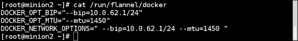

1.  要在所有主机中重新启动 Docker 守护程序：

```
**$ systemctl restart docker** 

```

然后，查看`docker0`和`flannel.1`接口的 IP 地址。在`minion2`中，看起来像下面这样：

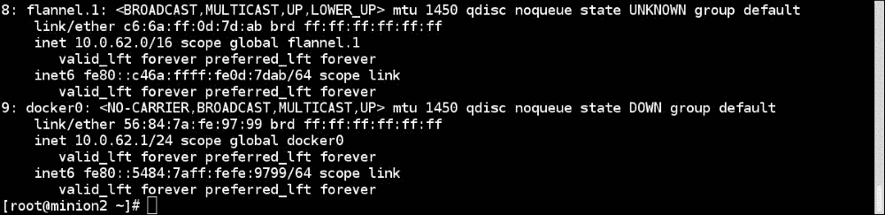

我们可以看到`docker0`接口从与`flannel.1`接口相同的子网中获取了 IP，该子网用于路由所有流量。

1.  我们已经准备好在任何主机中生成两个容器，并且它们应该能够进行通信。让我们在`minion1`中创建一个容器并获取其 IP 地址：

1.  现在在`minion2`中创建另一个容器，并像下面这样 ping`minion1`中运行的容器：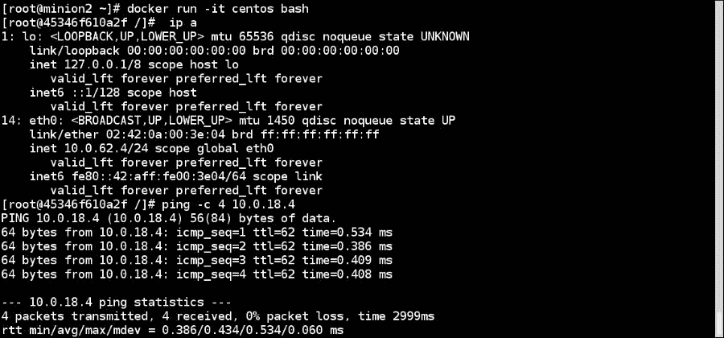

## 工作原理…

使用 Flannel，我们首先使用`10.0.0.0/16`网络配置覆盖。然后，每个主机选择一个随机的`/24`网络；例如，在我们的情况下，`minion2`获取`10.0.62.0/24`子网等等。配置完成后，主机中的容器将从所选的子网中获取 IP 地址。Flannel 封装数据包并使用 UDP 将其发送到远程主机。

此外，在安装过程中，Flannel 会在`/usr/lib/systemd/system/docker.service.d/`中复制一个配置文件（`flannel.conf`），Docker 使用该文件进行配置。

## 另请参阅

+   Flannel GitHub 上的图表可帮助您了解操作理论，网址为[`github.com/coreos/flannel/blob/master/packet-01.png`](https://github.com/coreos/flannel/blob/master/packet-01.png)

+   CoreOS 网站上的文档位于[`coreos.com/blog/introducing-rudder/`](https://coreos.com/blog/introducing-rudder/)

+   Scott Collier 在 Fedora 上设置 Flannel 的博客文章位于[`www.colliernotes.com/2015/01/flannel-and-docker-on-fedora-getting.html`](http://www.colliernotes.com/2015/01/flannel-and-docker-on-fedora-getting.html)

# 为容器分配 IPv6 地址

默认情况下，Docker 为容器分配 IPv4 地址。Docker 1.5 添加了一个功能来支持 IPv6 地址。

## 准备工作

确保 Docker 守护进程（1.5 版本及以上）正在主机上运行，并且您可以通过 Docker 客户端进行连接。

## 如何操作...

1.  使用`--ipv6`选项启动 Docker 守护进程，我们可以在守护进程的配置文件（在 Fedora 上为`/etc/sysconfig/docker`）中添加以下选项：

```
**OPTIONS='--selinux-enabled --ipv6'**

```

或者，如果我们以守护进程模式启动 Docker，那么可以按以下方式启动：

```
**$ docker -d --ipv6**

```

通过运行这些命令之一，Docker 将使用 IPv6 本地链路地址`fe80::1`设置`docker0`桥。

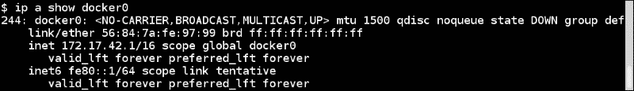

1.  让我们启动容器并查找分配给它的 IP 地址：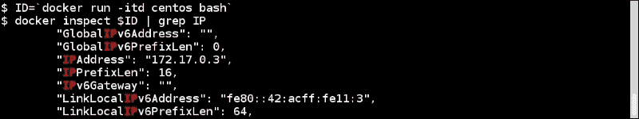

正如我们所看到的，容器可以获得 IPv4 和本地链路 IPv6 地址。要从主机机器上 ping 容器的 IPv6 地址，请运行以下命令：

```
**$ ping6 -I docker0 fe80::42:acff:fe11:3**

```

要从容器中 ping`docker0`桥，请运行以下命令：

```
**[root@c7562c38bd0f /]# ping6 -I eth0 fe80::1** 

```

## 工作原理...

Docker 配置`docker0`桥以向容器分配 IPv6 地址，这使我们能够使用容器的 IPv6 地址。

## 更多信息...

默认情况下，容器将获得链路本地地址。要为它们分配全局可路由地址，可以通过`--fixed-cidr-v6`选项传递 IPv6 子网选择地址，如下所示：

```
**$ docker -d --ipv6 --fixed-cidr-v6="2001:db8:1::/64"**

```

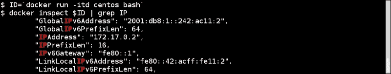

从这里，我们可以看到全局可路由地址（GlobalIPv6Address）现在已经设置。

## 另请参阅

+   有关 Docker 1.5 版本的发布说明，请访问[`blog.docker.com/2015/02/docker-1-5-ipv6-support-read-only-containers-stats-named-dockerfiles-and-more/`](https://blog.docker.com/2015/02/docker-1-5-ipv6-support-read-only-containers-stats-named-dockerfiles-and-more/)。

+   有关 Docker 网站上的文档，请访问[`docs.docker.com/v1.5/articles/networking/#ipv6`](http://docs.docker.com/v1.5/articles/networking/#ipv6)。

+   在设置 IPv6 选项之前，您可能需要删除主机上现有的`docker0`桥接。要了解如何操作，请访问[`docs.docker.com/v1.5/articles/networking/#customizing-docker0`](http://docs.docker.com/v1.5/articles/networking/#customizing-docker0)。
