# 第五章：Docker 使用案例

在本章中，我们将涵盖以下配方：

+   使用 Docker 进行测试

+   使用 Shippable 和 Red Hat OpenShift 进行 CI/CD

+   使用 Drone 进行 CI/CD

+   使用 OpenShift Origin 设置 PaaS

+   在 OpenShift v3 上构建和部署应用程序的源代码

+   将 Docker 配置为 Openstack 的 hypervisor 驱动程序

# 介绍

现在我们知道如何使用容器和镜像。在上一章中，我们还看到了如何链接容器并在主机和其他容器之间共享数据。我们还看到了来自一个主机的容器如何与其他主机的容器进行通信。

现在让我们看看 Docker 的不同用例。这里列举了其中的一些：

+   **快速原型设计**：这是我最喜欢的用例之一。一旦我们有了一个想法，使用 Docker 很容易进行原型设计。我们所需要做的就是设置容器来提供我们需要的所有后端服务，并将它们连接在一起。例如，要设置一个 LAMP 应用程序，获取 Web 和 DB 服务器并将它们链接在一起，就像我们在上一章中看到的那样。

+   **协作和分发**：GitHub 是协作和分发代码的最佳示例之一。同样，Docker 提供了 Dockerfile、注册表和导入/导出等功能，以与他人共享和协作。我们在之前的章节中已经涵盖了所有这些内容。

+   **持续集成**（**CI**）：Martin Fowler 网站上的以下定义（[`www.martinfowler.com/articles/continuousIntegration.html`](http://www.martinfowler.com/articles/continuousIntegration.html)）涵盖了所有内容：

> *"持续集成是一个软件开发实践，团队成员经常集成他们的工作，通常每个人至少每天集成一次 - 导致每天多次集成。每次集成都由自动构建（包括测试）进行验证，以尽快检测集成错误。许多团队发现这种方法大大减少了集成问题，并允许团队更快地开发一致的软件。本文是持续集成的快速概述，总结了该技术及其当前用法。"*

使用其他章节的示例，我们可以使用 Docker 构建一个 CI 环境。您可以创建自己的 CI 环境，也可以从 Shippable 和 Drone 等公司获取服务。我们将在本章后面看到如何使用 Shippable 和 Drone 进行 CI 工作。Shippable 不是托管解决方案，但 Drone 是，它可以给您更好的控制。我认为在这里谈论它们两个会很有帮助：

+   持续交付（CD）：CI 之后的下一步是持续交付，通过这一步，我们可以将我们的代码快速可靠地部署到我们的客户、云和其他环境中，而无需任何手动工作。在本章中，我们将看到如何通过 Shippable CI 自动部署 Red Hat OpenShift 上的应用程序。

+   平台即服务（PaaS）：Docker 可以用于构建您自己的 PaaS。它可以使用 OpenShift、CoreOS、Atomic、Tsuru 等工具/平台进行部署。在本章后面，我们将看到如何使用 OpenShift Origin（[`www.openshift.com/products/origin`](https://www.openshift.com/products/origin)）设置 PaaS。

# 使用 Docker 进行测试

在开发或 QA 期间，如果我们可以针对不同的环境检查我们的代码，将会很有帮助。例如，我们可能希望在不同版本的 Python 或不同发行版（如 Fedora、Ubuntu、CentOS 等）之间检查我们的 Python 代码。对于这个配方，我们将从 Flask 的 GitHub 存储库中挑选示例代码，这是一个用于 Python 的微框架（[`flask.pocoo.org/`](http://flask.pocoo.org/)）。我选择这个是为了保持简单，并且它也更容易用于其他配方。

对于这个配方，我们将创建图像，其中一个容器带有 Python 2.7，另一个带有 Python 3.3。然后，我们将使用一个示例 Python 测试代码来针对每个容器运行。

## 准备就绪

+   由于我们将使用 Flask 的 GitHub 存储库中的示例代码，让我们克隆它：

```
$ git clone https://github.com/mitsuhiko/flask

```

+   创建一个名为`Dockerfile_2.7`的文件，然后从中构建一个图像：

```
$ cat /tmp/ Dockerfile_2.7
FROM python:2.7
RUN pip install flask
RUN pip install pytest
WORKDIR /test
CMD ["/usr/local/bin/py.test"]

```

+   要构建`python2.7test`图像，请运行以下命令：

```
$ docker build -t python2.7test - < /tmp/Dockerfile_2.7

```

+   类似地，创建一个以`python:3.3`为基础图像的 Dockerfile，并构建`python3.3test`图像：

```
$ cat /tmp/Dockerfile_3.3
FROM python:3.3
RUN pip install flask
RUN pip install pytest
WORKDIR /test
CMD ["/usr/local/bin/py.test"]

```

+   要构建图像，请运行以下命令：

```
$ docker build -t python3.3test  - < /tmp/Dockerfile_3.3

```

确保两个图像都已创建。

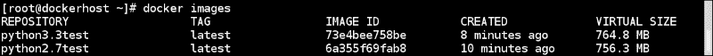

## 如何做…

现在，使用 Docker 的卷功能，我们将挂载包含源代码和测试用例的外部目录。要使用 Python 2.7 进行测试，请执行以下操作：

1.  转到包含 Flask 示例的目录：

```
$ cd /tmp/flask/examples/

```

1.  启动一个带有`python2.7`测试镜像并在`/test`下挂载`blueprintexample`的容器：

```
$ docker run -d -v `pwd`/blueprintexample:/test python2.7test

```


1.  类似地，要使用 Python 3.3 进行测试，请运行以下命令：

```
 $ docker run -d -v `pwd`/blueprintexample:/test python3.3test

```

1.  在启用 SELinux 的 Fedora/RHEL/CentOS 上运行上述测试时，您将收到“权限被拒绝”的错误。要解决此问题，请在容器内挂载主机目录时重新标记主机目录，如下所示：

```
$ docker run -d -v `pwd`/blueprintexample:/test:z python2.7test

```

### 注意

有关 SELinux 的更多详细信息，请参阅第九章，“Docker 安全性”。

## 工作原理...

从 Dockerfile 中可以看出，在运行`py.test`二进制文件的 CMD 之前，我们将工作目录更改为`/test`。在启动容器时，我们将源代码挂载到`/test`。因此，一旦容器启动，它将运行`py.test`二进制文件并运行测试。

## 还有更多...

+   在这个示例中，我们已经看到了如何使用不同版本的 Python 来测试我们的代码。同样，您可以从 Fedora、CentOS、Ubuntu 中选择不同的基本镜像，并在不同的 Linux 发行版上进行测试。

+   如果您在环境中使用 Jenkins，则可以使用其 Docker 插件动态提供从机器，运行构建并在 Docker 主机上关闭它。有关此的更多详细信息，请访问[`wiki.jenkins-ci.org/display/JENKINS/Docker+Plugin`](https://wiki.jenkins-ci.org/display/JENKINS/Docker+Plugin)。

# 使用 Shippable 和 Red Hat OpenShift 进行 CI/CD

在前面的示例中，我们看到了 Docker 如何在本地开发和 QA 环境中用于测试的示例。让我们看一个端到端的示例，看看 Docker 现在如何在 CI/CD 环境中使用。在这个示例中，我们将看到如何使用 Shippable ([`www.shippable.com/`](http://www.shippable.com/)) 进行 CI/CD 并将其部署在 Red Hat 的 OpenShift 环境 ([`openshift.redhat.com`](https://openshift.redhat.com))。

Shippable 是一个 SaaS 平台，可以让您轻松地将持续集成/部署添加到您的 GitHub 和 Bitbucket(Git)存储库中，它完全建立在 Docker 上。Shippable 使用构建 minions，这些是基于 Docker 的容器，用于运行工作负载。Shippable 支持许多语言，如 Ruby、Python、Node.js、Java、Scala、PHP、Go 和 Clojure。默认的构建 minions 是 Ubuntu 12.04 LTS 和 Ubuntu 14.04。他们还添加了支持使用来自 Docker Hub 的自定义镜像作为 minions。Shippable CI 需要关于项目和构建指令的信息，这些信息存储在名为`shippable.yml`的`yml`文件中，您必须在源代码存储库中提供。`yml`文件包含以下指令：

+   `build_image`：这是用于构建的 Docker 镜像

+   `language`：这将显示编程语言

+   `versions`：您可以指定不同版本的语言以在单个构建指令中进行测试。

+   `before_install`：这些是在运行构建之前的指令

+   `script`：这是一个用于运行测试的二进制/脚本

+   `after_success`：这些是构建成功后的指令；这用于在 PaaS 上执行部署，如 Heroku、Amazon Elastic Beanstalk、AWS OpsWorks、Google App Engine、Red Hat OpenShift 等。

Red Hat 的 OpenShift 是一个用于托管应用程序的 PaaS 平台。目前，它使用非基于 Docker 的容器技术来托管应用程序，但下一个版本的 OpenShift([`github.com/openshift/origin`](https://github.com/openshift/origin))正在基于 Kubernetes 和 Docker 构建。这告诉我们 Docker 在企业世界中被采用的速度。我们将在本章后面看到如何设置 OpenShift v3。

对于这个食谱，我们将使用在上一个食谱中使用的相同示例代码，首先在 Shippable 上进行测试，然后在 OpenShift 上部署它。

## 准备工作

1.  在 Shippable 上创建一个帐户([`www.shippable.com/`](https://www.shippable.com/))。

1.  从[`github.com/openshift/flask-example`](https://github.com/openshift/flask-example)派生 flask 示例。

1.  在 OpenShift 上为派生存储库创建一个应用程序，具体步骤如下：

1.  在 OpenShift 上创建一个帐户([`www.openshift.com/app/account/new`](https://www.openshift.com/app/account/new))并登录。

1.  为应用程序选择**Python 2.7 Cartridge**。

1.  更新您想要的**Public URL**部分。在**Source Code**部分，提供我们分叉存储库的 URL。对于本示例，我分别放下了`blueprint`和`https://github.com/nkhare/flask-example`：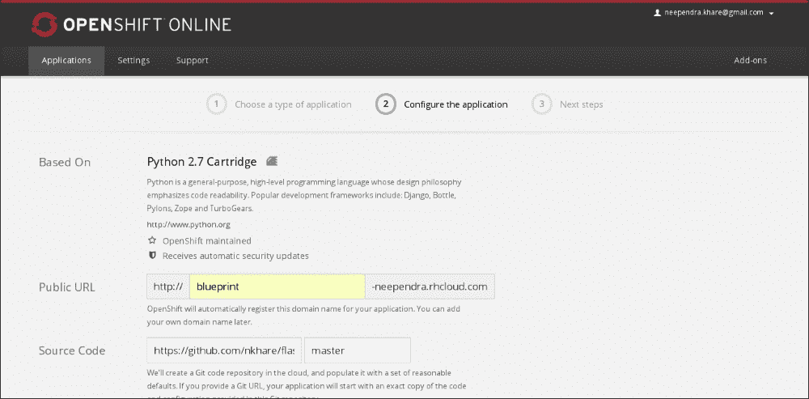

1.  单击**Create Application**创建新应用程序。创建后，您应该能够访问我们在上一步中提到的公共 URL。

创建应用程序后，OpenShift 提供了一种在`进行代码更改`部分管理/更新此应用程序的源代码的方法。由于我们希望使用 Shippable 部署应用程序，因此无需遵循这些说明。

1.  在本地系统上克隆分叉存储库：

```
$ git clone git@github.com:nkhare/flask-example.git

```

1.  让我们使用之前使用过的相同蓝图示例。要这样做，请按照以下说明进行操作：

1.  克隆 flask 存储库：

```
$ git clone https://github.com/mitsuhiko/flask.git

```

1.  复制蓝图示例：

```
$ cp -Rv flask/examples/blueprintexample/* flask-example/wsgi/

```

1.  更新`flask-example/wsgi/application`文件，从`blueprintexample`模块导入`app`模块。因此，`flask-example/wsgi/application`文件中的最后一行看起来像下面这样：

```
from blueprintexample import app as application
```

1.  在 flask-example 存储库的顶层添加带有以下内容的`requirements.txt`文件：

```
flask 
pytest
```

1.  添加带有以下内容的`shippable.yml`文件：

```
language: python 

python: 
  - 2.6 
  - 2.7 

install: 
  - pip install -r requirements.txt 

# Make folders for the reports 
before_script: 
  - mkdir -p shippable/testresults 
  - mkdir -p shippable/codecoverage 

script: 
  - py.test 

archive: true 
```

1.  提交代码并将其推送到您的分叉存储库中。

## 如何操作...

1.  登录到 Shippable。

1.  登录后，单击**SYNC ACCOUNT**以获取列出您的分叉存储库，如果尚未列出。查找并启用要构建和运行测试的存储库。在本例中，我选择了我的 GitHub 存储库中的`flask-example`。启用后，您应该看到类似以下内容：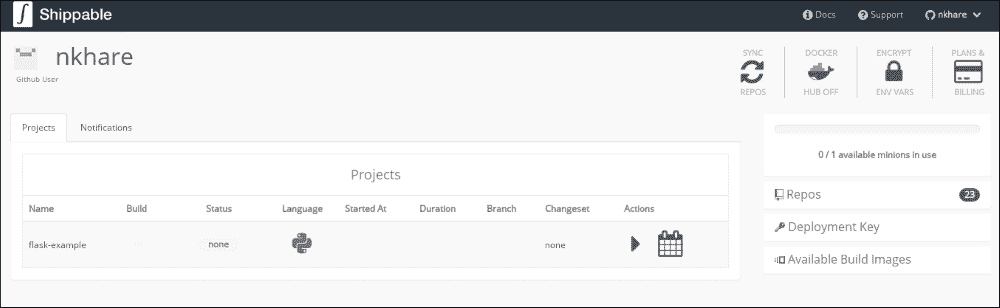

1.  单击播放按钮并选择要构建的分支。对于本示例，我选择了 master：

如果构建成功，您将看到成功的图标。

下次在存储库中提交代码时，Shippable 将触发构建并测试代码。现在，要在 OpenShift 上执行持续部署，请按照 Shippable 网站提供的说明进行操作（[`docs.shippable.com/deployment/openshift/`](http://docs.shippable.com/deployment/openshift/)）：

1.  从 Shippable 仪表板获取部署密钥（位于右侧，**Repos**下方）：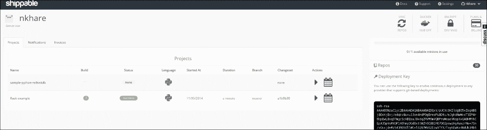

1.  将其复制到 OpenShift 的([`openshift.redhat.com/app/console/settings`](https://openshift.redhat.com/app/console/settings)) **Settings** | **Public** **Keys**部分如下所示：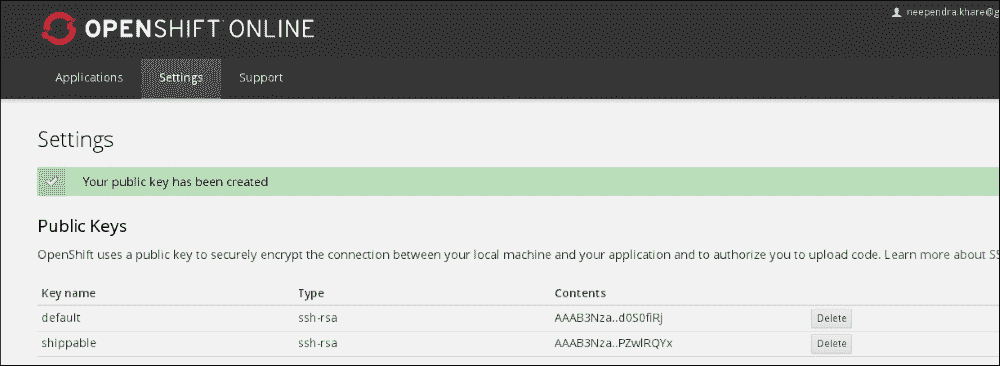

1.  从 OpenShift 应用程序页面获取**源代码**存储库链接，它将在下一步中用作`OPNESHIFT_REPO`：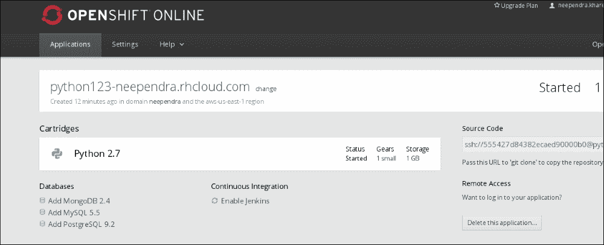

1.  安装部署密钥后，更新`shippable.yml`文件如下：

```
env: 
  global: 
    - **OPENSHIFT_REPO**=ssh://545ea4964382ec337f000009@blueprint-neependra.rhcloud.com/~/git/blueprint.git 

language: python 

python: 
  - 2.6 
  - 2.7 

install: 
  - pip install -r requirements.txt 

# Make folders for the reports 
before_script: 
  - mkdir -p shippable/testresults 
  - mkdir -p shippable/codecoverage 
  - git remote -v | grep ^openshift || git remote add openshift $OPENSHIFT_REPO 
  - cd wsgi 

script: 
  - py.test 

after_success: 
  - git push -f openshift $BRANCH:master 

archive: true 
```

`OPENSHIFT_REPO`应该反映您使用 OpenShift 部署的应用程序。它将与此示例中显示的内容不同。

1.  现在提交这些更改并将其推送到 GitHub。您将看到 Shippable 触发的构建以及在 OpenShift 上部署的新应用程序。

1.  访问您的应用主页，您应该看到其更新的内容。

## 工作原理…

在每个构建指令中，Shippable 会根据`shippable.yml`文件中指定的镜像和语言类型，启动新的容器并运行构建以执行测试。在我们的情况下，Shippable 将启动两个容器，一个用于 Python 2.6，另一个用于 Python 2.7。当您在 GitHub 上注册时，Shippable 会向您的存储库添加一个 webhook，如下所示：

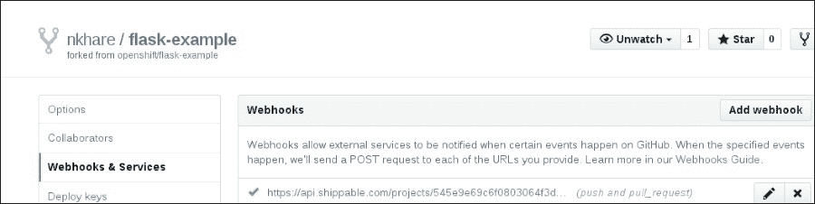

因此，每次对 GitHub 进行提交更改时，Shippable 上的构建都会被触发，并在成功后部署到 OpenShift 上。

## 另请参阅

+   Shippable 网站上提供了详细的文档，网址为[`docs.shippable.com/`](http://docs.shippable.com/)。

# 使用 Drone 进行 CI/CD

如 Drone 网站（[`drone.io/`](https://drone.io/)）上所述，Drone 是一个托管的持续集成服务。它使您能够方便地设置项目，以便在对代码进行更改时自动构建、测试和部署。他们提供了他们平台的开源版本，您可以在您的环境或云上进行托管。截至目前，他们支持诸如 C/C++、Dart、Go、Haskell、Groovy、Java、Node.js、PHP、Python、Ruby 和 Scala 等语言。使用 Drone，您可以将应用程序部署到 Heroku、Dotcloud、Google App Engine 和 S3 等平台。您还可以通过 SSH（rsync）将代码同步到远程服务器进行部署。

对于这个示例，让我们使用之前示例中使用的相同示例。

## 准备工作

1.  登录到 Drone（[`drone.io/`](https://drone.io/)）。

1.  单击**新项目**并设置存储库。在我们的情况下，我们将选择在之前的示例中使用的 GitHub 上的相同存储库（[`github.com/nkhare/flask-example`](https://github.com/nkhare/flask-example)）：

1.  一旦选择了，它会要求您为所选的存储库选择编程语言。在这种情况下，我选择了 Python。

1.  然后它会提示您设置构建脚本。对于这个教程，我们将输入以下内容并保存：

```
pip install -r requirements.txt --use-mirrors
cd wsgi
py.test

```

## 操作步骤如下…

1.  通过单击**立即构建**来触发手动构建，如下面的屏幕截图所示：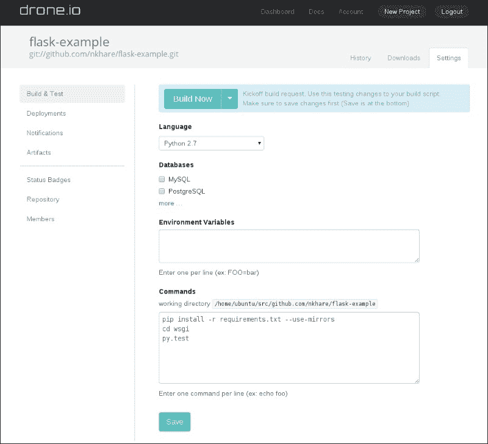

## 它是如何工作的…

构建过程启动一个新的容器，克隆源代码存储库，并在其中运行我们在**命令**部分中指定的命令（运行测试用例）。

## 还有更多…

+   构建完成后，您可以查看控制台输出。

+   Drone 还在 GitHub 中添加了一个 Webhook；因此，下次您提交存储库中的更改时，将触发构建。

+   Drone 还支持将应用程序持续部署到不同的云环境，就像我们在之前的教程中看到的那样。要设置这个，转到**设置**选项卡，选择**部署**，然后选择**添加新的部署**。选择您的云提供商并设置它：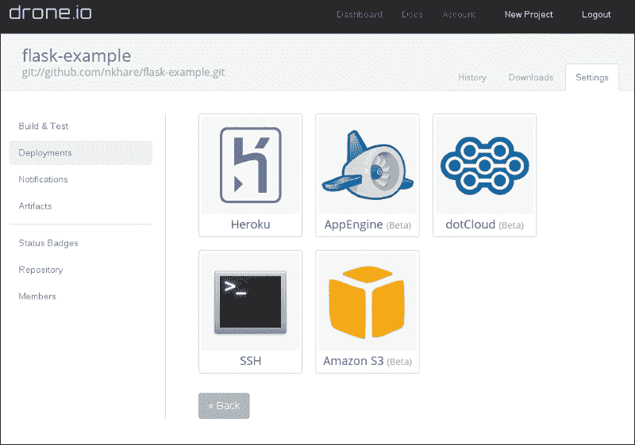

## 另请参阅

+   Drone 的文档网址为[`docs.drone.io/`](http://docs.drone.io/)

+   配置自托管的 Drone 环境的步骤，目前处于 alpha 阶段，网址为[`github.com/drone/drone`](https://github.com/drone/drone)

# 使用 OpenShift Origin 设置 PaaS

平台即服务是一种云服务类型，其中消费者控制应用程序（主要是 Web 应用程序）的软件部署和配置设置，提供者提供服务器、网络和其他服务来管理这些部署。提供者可以是外部的（公共提供者）或内部的（组织中的 IT 部门）。有许多 PaaS 提供者，例如 Amazon ([`aws.amazon.com/`](http://aws.amazon.com/))、Heroku ([`www.heroku.com/`](https://www.heroku.com/))、OpenShift ([`www.openshift.com/`](https://www.openshift.com/))等。最近，容器似乎已成为应用程序部署的自然选择。

在本章的前面，我们看了如何使用 Shippable 和 OpenShift 构建 CI/CD 解决方案，我们将我们的应用程序部署到 OpenShift PaaS。我们在 Openshift Online 上部署了我们的应用程序，这是公共云服务。在撰写本书时，OpenShift 公共云服务使用非 Docker 容器技术将应用程序部署到公共云服务。OpenShift 团队一直在开发 OpenShift v3 ([`github.com/openshift/origin`](https://github.com/openshift/origin))，这是一个利用 Docker 和 Kubernetes ([`kubernetes.io`](http://kubernetes.io))等技术的 PaaS，为您的云启用应用程序提供了一个完整的生态系统。他们计划在今年晚些时候将其移至公共云服务。正如我们在第八章，“Docker 编排和托管平台”中所讨论的，强烈建议在继续本教程之前先阅读该章节。我将借用该章节中的一些概念。

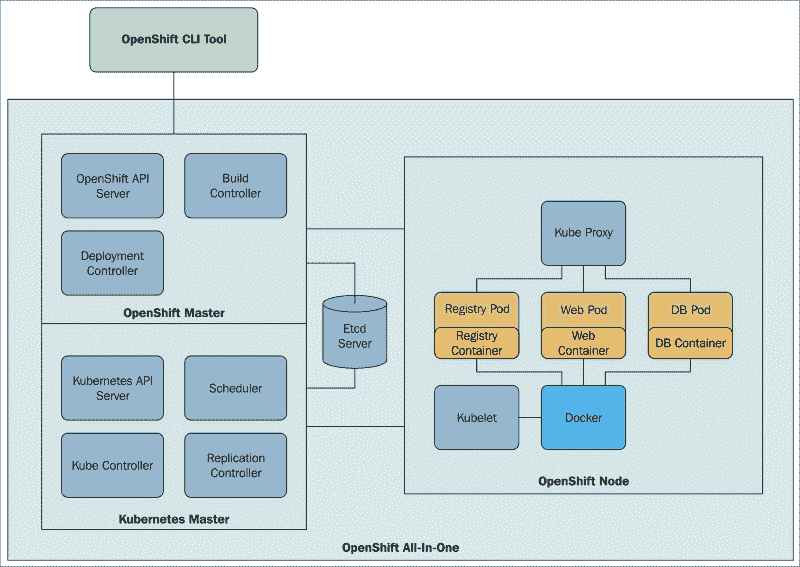

[`blog.openshift.com/openshift-v3-deep-dive-docker-kubernetes/`](https://blog.openshift.com/openshift-v3-deep-dive-docker-kubernetes/)

Kubernetes 提供了容器集群管理的功能，如调度 pod 和服务发现，但它没有完整应用程序的概念，也没有从源代码构建和部署 Docker 镜像的能力。OpenShift v3 扩展了基本的 Kubernetes 模型，并填补了这些空白。如果我们快进并查看第八章，“Docker 编排和托管平台”，对于 Kubernetes 部分，您会注意到要部署一个应用程序，我们需要定义 Pods、Services 和 Replication-Controllers。OpenShift v3 试图将所有这些信息抽象出来，并让您定义一个配置文件，该文件负责处理所有内部连接。此外，OpenShift v3 还提供其他功能，如通过源代码推送进行自动部署，集中管理和管理应用程序，身份验证，团队和项目隔离，以及资源跟踪和限制，所有这些都是企业部署所需的。

在这个示例中，我们将在 VM 上设置全功能的 OpenShift v3 Origin 并启动一个 pod。在下一个示例中，我们将看到如何使用**源到镜像**（**STI**）构建功能通过源代码构建和部署应用程序。由于 OpenShift v3 Origin 正在进行积极的开发，我从源代码中选择了一个标签，并在这个示例和下一个示例中使用了该代码库。在更新的版本中，命令行选项可能会发生变化。有了这些信息，您应该能够适应最新的发布版本。最新的示例可以在[`github.com/openshift/origin/tree/master/examples/hello-openshift`](https://github.com/openshift/origin/tree/master/examples/hello-openshift)找到。

## 准备就绪

设置 Vagrant ([`www.vagrantup.com/`](https://www.vagrantup.com/))并安装 VirtualBox 提供程序([`www.virtualbox.org/`](https://www.virtualbox.org/))。如何设置这些内容的说明超出了本书的范围。

1.  克隆 OpenShift Origin 存储库：

```
$ git clone https://github.com/openshift/origin.git

```

1.  检出`v0.4.3`标签：

```
$ cd origin
$ git checkout tags/v0.4.3

```

1.  启动虚拟机：

```
$ vagrant up --provider=virtualbox

```

1.  登录到容器：

```
$ vagrant ssh

```

## 如何做...

1.  构建 OpenShift 二进制文件：

```
$ cd /data/src/github.com/openshift/origin
$ make clean build

```

1.  转到`hello-openshift`示例：

```
$  cd /data/src/github.com/openshift/origin/examples/hello-openshift

```

1.  在一个守护进程中启动所有 OpenShift 服务：

```
$ mkdir logs
$ sudo /data/src/github.com/openshift/origin/_output/local/go/bin/openshift start --public-master=localhost &> logs/openshift.log &

```

1.  OpenShift 服务由 TLS 保护。我们的客户端需要接受服务器证书并呈现自己的客户端证书。这些证书是作为 Openshift 启动的一部分在当前工作目录中生成的。

```
$ export OPENSHIFTCONFIG=`pwd`/openshift.local.certificates/admin/.kubeconfig
$ export CURL_CA_BUNDLE=`pwd`/openshift.local.certificates/ca/cert.crt
$ sudo chmod a+rwX "$OPENSHIFTCONFIG"

```

1.  根据`hello-pod.json`定义创建 pod：

```
$ osc create -f hello-pod.json

```


1.  连接到 pod：

```
$ curl localhost:6061

```

## 它是如何工作的...

当 OpenShift 启动时，所有 Kubernetes 服务也会启动。然后，我们通过 CLI 连接到 OpenShift 主服务器，并请求它启动一个 pod。该请求然后转发到 Kubernetes，Kubernetes 启动了 pod。在 pod 配置文件中，我们提到将主机机器的端口`6061`映射到 pod 的端口`8080`。因此，当我们在端口`6061`上查询主机时，我们从 pod 得到了回复。

## 还有更多...

如果运行`docker ps`命令，将看到相应的容器正在运行。

## 另请参阅

+   在[`github.com/openshift/origin`](https://github.com/openshift/origin)上的*了解更多*部分

+   在[`blog.openshift.com/openshift-3-beta-3-training-commons-briefing-12/`](https://blog.openshift.com/openshift-3-beta-3-training-commons-briefing-12/)上查看 OpenShift 3 beta 3 视频教程

+   最新的 OpenShift 培训在[`github.com/openshift/training`](https://github.com/openshift/training)

+   OpenShift v3 文档位于[`docs.openshift.org/latest/welcome/index.html`](http://docs.openshift.org/latest/welcome/index.html)

# 从源代码构建和部署应用程序到 OpenShift v3

OpenShift v3 提供了从源代码构建镜像的构建过程。以下是可以遵循的构建策略：

+   **Docker 构建**：在这种情况下，用户将提供 Docker 上下文（Dockerfiles 和支持文件），用于构建镜像。OpenShift 只需触发`docker build`命令来创建镜像。

+   **源到镜像（STI）构建**：在这种情况下，开发人员定义源代码仓库和构建器镜像，后者定义了用于创建应用程序的环境。然后 STI 使用给定的源代码和构建器镜像为应用程序创建一个新的镜像。有关 STI 的更多详细信息，请参见[`github.com/openshift/source-to-image`](https://github.com/openshift/source-to-image)。

+   **自定义构建**：这类似于 Docker 构建策略，但用户可以自定义将用于构建执行的构建器镜像。

在这个教程中，我们将看一下 STI 构建过程。我们将查看 OpenShift v3 Origin 仓库中的 sample-app（[`github.com/openshift/origin/tree/v0.4.3/examples/sample-app`](https://github.com/openshift/origin/tree/v0.4.3/examples/sample-app)）。相应的 STI 构建文件位于[`github.com/openshift/origin/blob/v0.4.3/examples/sample-app/application-template-stibuild.json`](https://github.com/openshift/origin/blob/v0.4.3/examples/sample-app/application-template-stibuild.json)。

在`BuildConfig`部分，我们可以看到源指向 GitHub 仓库（`git://github.com/openshift/ruby-hello-world.git`），而`strategy`部分下的镜像指向`openshift/ruby-20-centos7`镜像。因此，我们将使用`openshift/ruby-20-centos7`镜像，并使用来自 GitHub 仓库的源代码构建一个新的镜像。构建后的新镜像将根据设置被推送到本地或第三方 Docker 注册表。`BuildConfig`部分还定义了何时触发新构建的触发器，例如，当构建镜像发生变化时。

在同一个 STI 构建文件（`application-template-stibuild.json`）中，您会找到多个`DeploymentConfig`部分，每个 pod 一个。`DeploymentConfig`部分包含诸如导出端口、副本、pod 的环境变量和其他信息等信息。简单来说，您可以将`DeploymentConfig`视为 Kubernetes 的扩展复制控制器。它还有触发器来触发新的部署。每次创建新的部署时，`DeploymentConfig`的`latestVersion`字段会递增。还会向`DeploymentConfig`添加`deploymentCause`，描述导致最新部署的更改。

`ImageRepository`，最近更名为`ImageStream`，是一组相关图像。`BuildConfig`和`DeploymentConfig`监视`ImageStream`以查找图像更改并根据各自的触发器做出相应反应。

在 STI 构建文件中，您还会找到用于 pod 的服务（数据库和前端）、用于前端服务的路由，通过该路由可以访问应用程序，以及一个模板。模板描述了一组预期一起使用的资源，可以进行自定义和处理以生成配置。每个模板可以定义一组参数，这些参数可以被容器修改后使用。

与 STI 构建类似，在同一个 sample-app 示例文件夹中有 Docker 和自定义构建的示例。我假设您已经有了之前的配方，所以我们将从那里继续。

## 准备工作

您应该已经完成了之前的配方，*使用 OpenShift Origin 设置 PaaS*。

您当前的工作目录应该是 Vagrant 启动的 VM 内的`/data/src/github.com/openshift/origin /examples/hello-openshift`。

## 如何操作...

1.  部署一个私有的 Docker 注册表来托管 STI 构建过程中创建的镜像：

```
$ sudo openshift ex registry --create --credentials=./openshift.local.certificates/openshift-registry/.kubeconfig

```

1.  确认注册表已启动（这可能需要几分钟）：

```
$ osc describe service docker-registry

```

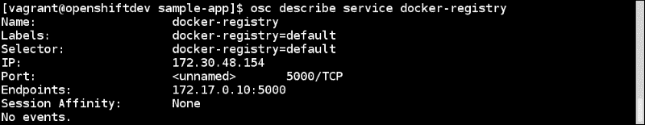

1.  在 OpenShift 中创建一个新项目。这将创建一个命名空间`test`来包含构建和稍后我们将生成的应用程序：

```
$ openshift ex new-project test --display-name="OpenShift 3 Sample" --description="This is an example project to demonstrate OpenShift v3" --admin=test-admin

```

1.  使用`test-admin`用户登录并切换到`test`项目，从现在开始每个命令都将使用该项目：

```
$ osc login -u test-admin -p pass
$ osc project test

```

1.  提交应用程序模板进行处理（生成模板中请求的共享参数），然后请求创建处理后的模板：

```
$ osc process -f application-template-stibuild.json | osc create -f -

```

1.  这不会触发构建。要启动应用程序的构建，请运行以下命令：

```
$ osc start-build ruby-sample-build

```

1.  监视构建并等待状态变为`complete`（这可能需要几分钟）：

```
$ osc get builds

```

1.  获取服务列表：

```
$ osc get services

```


## 它是如何工作的...

在`BuildConfig`（`ruby-sample-build`）部分，我们将源指定为`ruby-hello-world` Git 存储库（`git://github.com/openshift/ruby-hello-world.git`），我们的镜像为`openshift/ruby-20-centos7`。因此，构建过程将使用该镜像，并使用 STI 构建器，在`openshift/ruby-20-centos7`上构建我们的源后创建一个名为`origin-ruby-sample`的新镜像。然后将新镜像推送到我们之前创建的 Docker 注册表中。

使用`DeploymentConfig`，前端和后端 pod 也被部署并链接到相应的服务。

## 还有更多...

+   前面的前端服务可以通过服务 IP 和相应的端口访问，但无法从外部访问。为了使其可访问，我们给我们的应用程序一个 FQDN；例如，在以下示例中，它被定义为`www.example.com`：

OpenShift v3 提供了一个 HAProxy 路由器，可以将 FQDN 映射到相应的 pod。有关更多信息，请访问[`docs.openshift.org/latest/architecture/core_objects/routing.html`](http://docs.openshift.org/latest/architecture/core_objects/routing.html)。您还需要在外部 DNS 中添加一个条目来解析此处提供的 FQDN。

+   OpenShift v3 Origin 也是一个管理 GUI。要在 GUI 上查看我们部署的应用程序，请将用户名`test-admin`绑定到默认命名空间中的查看角色，以便您可以在 Web 控制台中观察进展：

```
$ openshift ex policy add-role-to-user view test-admin

```

然后，通过浏览器，连接到`https://<host>:8443/console`，并通过`test-admin`用户登录，输入任何密码。由于 Vagrant 将主机机器上端口`8443`的流量转发到 VM，您应该能够通过运行 VM 的主机连接。然后选择**OpenShift 3 Sample**作为项目并进行探索。

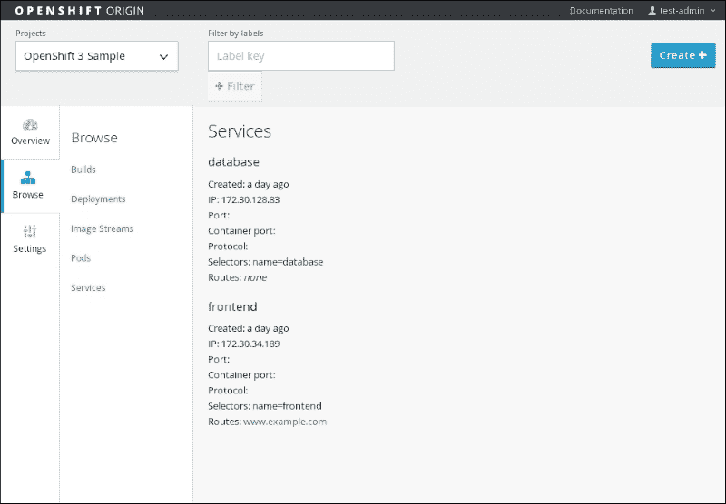

+   在多节点设置中，您的 pod 可以安排在不同的系统上。OpenShift v3 通过覆盖网络 pod 连接 pod，运行在一个节点上的 pod 可以访问另一个节点上的 pod。它被称为`openshift-sdn`。有关更多详细信息，请访问[`github.com/openshift/openshift-sdn`](https://github.com/openshift/openshift-sdn)。

## 另请参阅

+   在[`github.com/openshift/origin`](https://github.com/openshift/origin)的*了解更多*部分

+   在[`blog.openshift.com/openshift-3-beta-3-training-commons-briefing-12/`](https://blog.openshift.com/openshift-3-beta-3-training-commons-briefing-12/)上有 OpenShift 3 beta 3 视频教程

+   最新的 OpenShift 培训在[`github.com/openshift/training`](https://github.com/openshift/training)

+   在[`docs.openshift.org/latest/welcome/index.html`](http://docs.openshift.org/latest/welcome/index.html)上有 OpenShift v3 文档

# 将 Docker 配置为 OpenStack 的虚拟化程序驱动程序

我假设读者对 OpenStack 有一定了解，因为本书不涵盖这方面的内容。有关 OpenStack 及其组件的更多信息，请访问[`www.openstack.org/software/`](http://www.openstack.org/software/)。

在 OpenStack 中，Nova 支持不同的计算虚拟化程序，如 KVM、XEN、VMware、HyperV 等。我们可以使用这些驱动程序来创建虚拟机。使用 Ironic（[`wiki.openstack.org/wiki/Ironic`](https://wiki.openstack.org/wiki/Ironic)），您也可以创建裸金属服务器。Nova 在 Havana（[`www.openstack.org/software/havana/`](https://www.openstack.org/software/havana/)）版本中添加了对 Docker 的容器创建支持，但目前它不在主线中，以加快开发周期。未来计划将其合并到主线中。在底层，它看起来像这样：

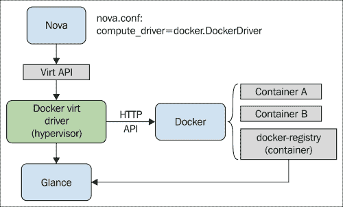

[`wiki.openstack.org/wiki/File:Docker-under-the-hood.png`](https://wiki.openstack.org/wiki/File:Docker-under-the-hood.png)

DevStack（[`docs.openstack.org/developer/devstack/overview.html`](http://docs.openstack.org/developer/devstack/overview.html)）是一组脚本，用于快速创建 OpenStack 开发环境。它不是通用安装程序，但是非常容易开始使用 OpenStack 的方法。在本教程中，我们将在 Fedora21 上将 DevStack 的环境配置为使用 Docker 作为 Nova 驱动程序。

## 准备工作

1.  在系统上安装 Docker。

1.  克隆`nova-docker`和`devstack`：

```
$ git clone https://git.openstack.org/stackforge/nova-docker /opt/stack/nova-docker
$ git clone https://git.openstack.org/openstack-dev/devstack /opt/stack/devstack

```

1.  在我们可以使用`configure_nova_hypervisor_rootwrap`之前需要以下步骤：

```
$ git clone https://git.openstack.org/openstack/nova /opt/stack/nova

```

1.  准备安装 Devstack：

```
$ cd /opt/stack/nova-docker
$ ./contrib/devstack/prepare_devstack.sh

```

1.  创建 stack 用户并将其添加到`sudo`：

```
$ /opt/stack/devstack/tools/create-stack-user.sh

```

1.  使用 Python 安装`docker-py`以与 docker 进行通信：

```
$ yum install python-pip
$ pip install docker-py

```

## 如何做…

1.  完成先决条件步骤后，运行以下命令安装 Devstack：

```
$ cd /opt/stack/devstack
$ ./stack.sh

```

## 它是如何工作的...

+   `prepare_devstack.sh`驱动程序在`localrc`文件中进行以下条目的设置，以设置 Nova 驱动程序的正确环境：

```
export VIRT_DRIVER=docker 
export DEFAULT_IMAGE_NAME=cirros 
export NON_STANDARD_REQS=1 
export IMAGE_URLS=" " 
```

+   运行`stackrc`文件后，我们可以看到关于 Nova 和 Glance 的以下更改：

+   `/etc/nova/nova.conf`文件更改了计算驱动程序：

```
 [DEFAULT] 
 compute_driver = novadocker.virt.docker.DockerDriver 
```

+   `/etc/nova/rootwrap.d/docker.filters`文件更新为以下内容：

```
[Filters] 
# nova/virt/docker/driver.py: 'ln', '-sf', '/var/run/netns/.*' 
ln: CommandFilter, /bin/ln, root 
```

+   在`/etc/glance/glance-api.conf`中，在容器/镜像格式中添加`docker`：

```
[DEFAULT] 
container_formats = ami,ari,aki,bare,ovf,docker 
```

## 还有更多...

+   在`localrc`中，我们将`cirros`作为默认镜像，因此一旦设置完成，我们可以看到已下载`cirros`的 Docker 镜像：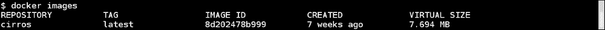

这将自动导入到 Glance 中。

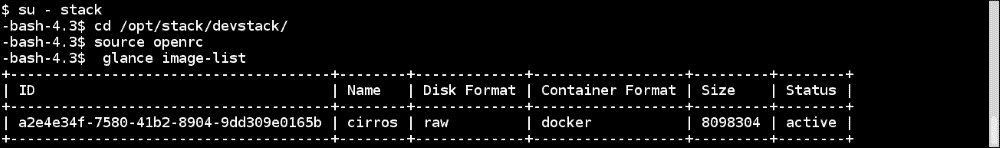

从前面的截图中，我们可以看到容器格式是 Docker。

+   现在您可以使用 Horizon 创建一个使用`cirros`镜像的实例，或者从命令行创建一个实例，并查看使用 Docker 命令行启动的容器。

+   要将任何镜像导入 Glance，可以执行以下操作：

+   从 Docker Hub 拉取所需的镜像：

```
$ docker pull fedora

```

+   导入镜像（目前只有管理员可以导入镜像）：

```
$ source openrc
$ export OS_USERNAME=admin
$ sudo docker save fedora | glance image-create --is-public=True --container-format=docker --disk-format=raw --name fedora

```

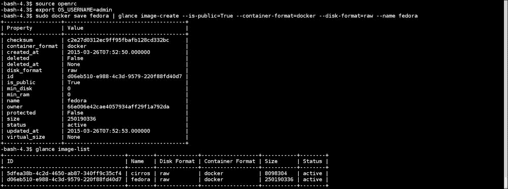

+   Cinder 和 Neutron 的集成不足，但情况正在迅速改善。

+   在安装过程中，如果出现`AttributeError: 'module' object has no attribute 'PY2'`错误，则运行以下命令进行修复：

```
$ pip uninstall  six
$ pip install --upgrade   six

```

## 另请参阅

+   在 OpenStack 网站上的文档[`wiki.openstack.org/wiki/Docker`](https://wiki.openstack.org/wiki/Docker)。

+   Docker 也是 OpenStack Heat 的资源类型之一。在[`docs.openstack.org/developer/heat/template_guide/contrib.html#dockerinc-resource`](http://docs.openstack.org/developer/heat/template_guide/contrib.html#dockerinc-resource)了解更多信息。

+   OpenStack 中有一个有趣的项目叫做 Kolla，它专注于通过 Docker 容器部署 OpenStack 服务。在[`github.com/stackforge/kolla/`](https://github.com/stackforge/kolla/)了解更多信息。
