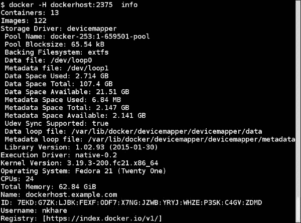
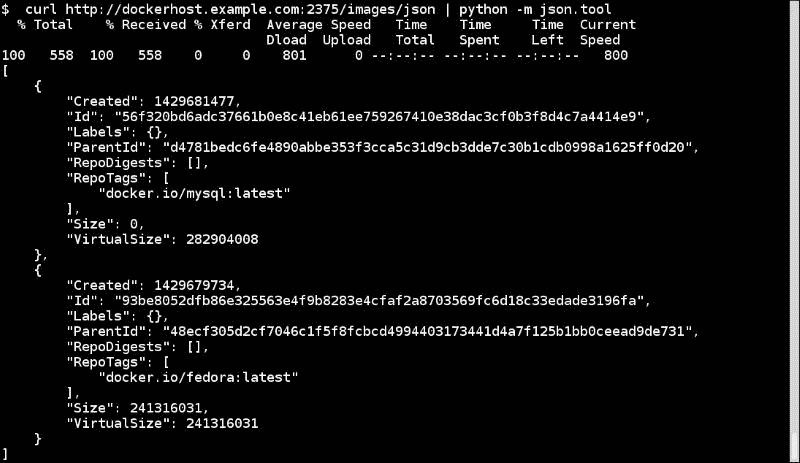
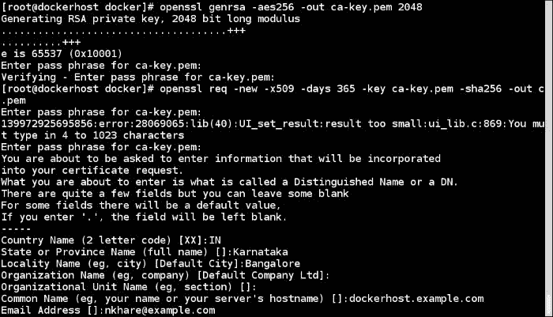
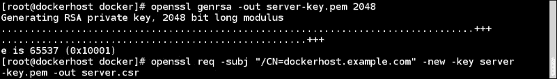
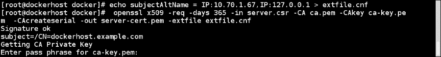
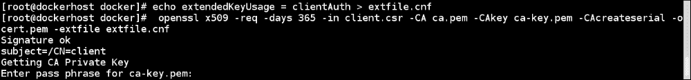
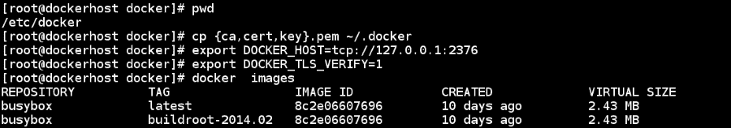

# 第六章：Docker API 和语言绑定

在本章中，我们将涵盖以下内容：

+   配置 Docker 守护程序远程 API

+   使用远程 API 执行图像操作

+   使用远程 API 执行容器操作

+   探索 Docker 远程 API 客户端库

+   保护 Docker 守护程序远程 API

# 介绍

在之前的章节中，我们学习了不同的命令来管理图像、容器等。尽管我们通过命令行运行所有命令，但 Docker 客户端（CLI）与 Docker 守护程序之间的通信是通过 API 进行的，这被称为 Docker 守护程序远程 API。

Docker 还提供了用于与 Docker Hub 和 Docker 注册表通信的 API，Docker 客户端也使用这些 API。除了这些 API 之外，我们还有不同编程语言的 Docker 绑定。因此，如果您想为 Docker 图像、容器管理等构建一个漂亮的 GUI，了解前面提到的 API 将是一个很好的起点。

在本章中，我们将研究 Docker 守护程序远程 API，并使用`curl`命令（[`curl.haxx.se/docs/manpage.html`](http://curl.haxx.se/docs/manpage.html)）与不同 API 的端点进行通信，这将类似于以下命令：

```
**$ curl -X <REQUEST> -H <HEADER> <OPTION> <ENDPOINT>**

```

前面的请求将返回一个返回代码和与我们选择的端点和请求相对应的输出。`GET`、`PUT`和`DELETE`是不同类型的请求，如果没有指定，默认请求是 GET。每个 API 端点对于返回代码都有自己的解释。

# 配置 Docker 守护程序远程 API

正如我们所知，Docker 具有客户端-服务器架构。当我们安装 Docker 时，用户空间程序和守护程序从同一个二进制文件启动。守护程序默认绑定到同一主机上的`unix://var/run/docker.sock`。这将不允许我们远程访问守护程序。为了允许远程访问，我们需要以允许远程访问的方式启动 Docker，这可以通过适当地更改`-H`标志来实现。

## 准备工作

根据您正在运行的 Linux 发行版，找出需要更改的 Docker 守护程序配置文件。对于 Fedora、Red Hat 发行版，它可能是`/etc/sysconfig/docker`，对于 Ubuntu/Debian 发行版，它可能是`/etc/default/docker`。

## 操作步骤…

1.  在 Fedora 20 系统上，在配置文件（/etc/sysconfig/docker）中添加`-H tcp://0.0.0.0:2375`选项，如下所示：

```
**OPTIONS=--selinux-enabled -H tcp://0.0.0.0:2375** 

```

1.  重新启动 Docker 服务。在 Fedora 上，运行以下命令：

```
**$ sudo systemctl restart docker** 

```

1.  从远程客户端连接到 Docker 主机：

```
**$ docker -H <Docker Host>:2375 info**

```



确保防火墙允许在安装了 Docker 守护程序的系统上访问端口`2375`。

## 它是如何工作的…

通过前述命令，我们允许 Docker 守护程序通过 TCP 在所有网络接口上监听端口`2375`。

## 还有更多…

+   在前面提到的客户端和 Docker 之间的通信中，主机是不安全的。在本章的后面，我们将看到如何在它们之间启用 TLS。

+   Docker CLI 查找环境变量；如果被设置了，那么 CLI 将使用该端点进行连接，例如，如果我们设置如下：

```
**$ export DOCKER_HOST=tcp://dockerhost.example.com:2375**

```

然后，在该会话中，未来的 docker 命令默认连接到远程 Docker 主机并运行此命令：

```
**$ docker info**

```

## 另请参阅

+   Docker 网站上的文档[`docs.docker.com/reference/api/docker_remote_api/`](https://docs.docker.com/reference/api/docker_remote_api/)

# 使用远程 API 执行图像操作

在启用了 Docker 守护程序远程 API 之后，我们可以通过客户端进行所有与图像相关的操作。为了更好地理解 API，让我们使用`curl`连接到远程守护程序并进行一些与图像相关的操作。

## 准备工作

配置 Docker 守护程序并允许远程访问，如前面的配方中所解释的。

## 如何做…

在这个配方中，我们将看一下一些图像操作，如下所示：

1.  要列出图像，请使用以下 API：

```
**GET /images/json**

```

以下是前述语法的一个例子：

```
**$ curl http://dockerhost.example.com:2375/images/json**

```



1.  要创建图像，请使用以下 API：

```
**POST /images/create**

```

以下是一些示例：

+   从 Docker Hub 获取 Fedora 图像：

```
 **$ curl -X POST 
http://dockerhost.example.com:2375/images/create?fromImage=fedora**

```

+   获取带有`latest`标签的 WordPress 图像：

```
 **$  curl -X POST 
http://dockerhost.example.com:2375/images/create?fromImage=wordpress&tag=latest**

```

+   从可访问的 Web 服务器上的`tar`文件创建图像：

```
 **$ curl -X POST 
http://dockerhost.example.com:2375/images/create?fromSrc=http://localhost/image.tar**

```

1.  要构建图像，请使用以下 API：

```
**POST  /commit**

```

以下是一些示例：

+   从容器（`container id = 704a7c71f77d`）构建图像

```
 **$ curl -X POST 
http://dockerhost.example.com:2375/commit?container=704a7c71f77d**

```

+   从 Docker 文件构建图像：

```
 **$  curl -X POST  -H "Content-type:application/tar" --data-binary '@/tmp/Dockerfile.tar.gz'  
http://dockerhost.example.com:2375/build?t=apache**

```

由于 API 期望内容为`tar`文件，我们需要将 Docker 文件放入 tar 中并调用 API。

1.  要删除图像，请使用以下 API：

```
**DELETE  /images/<name>**

```

以下是前述语法的一个例子：

```
**$ curl -X DELETE
http://dockerhost.example.com:2375/images/wordpress:3.9.1**

```

## 它是如何工作的…

在前面提到的所有情况下，API 将连接到 Docker 守护程序并执行请求的操作。

## 还有更多…

我们还没有涵盖之前讨论的 API 的所有选项，Docker 为其他与镜像相关的操作提供了 API。访问 API 文档以获取更多详细信息。

## 另请参阅

+   每个 API 端点可以有不同的输入来控制操作。更多详细信息，请访问 Docker 网站上的文档[`docs.docker.com/reference/api/docker_remote_api_v1.18/#22-images`](https://docs.docker.com/reference/api/docker_remote_api_v1.18/#22-images)。

# 使用远程 API 执行容器操作

与我们使用 API 执行镜像操作类似，我们也可以使用 API 执行所有与容器相关的操作。

## 准备工作

配置 Docker 守护程序并允许远程访问，如前面的示例所述。

## 如何做…

在这个示例中，我们将看一些容器操作：

1.  要列出容器，请使用以下 API：

```
**GET  /containers/json**

```

以下是一些示例：

+   获取所有正在运行的容器：

```
 **$ curl -X GET http://shadowfax.example.com:2375/containers/json**

```

+   获取所有正在运行的容器，包括已停止的容器

```
 **$ curl -X GET http://shadowfax.example.com:2375/containers/json?all=True**

```

1.  要创建一个新的容器，请使用以下 API：

```
**POST  /containers/create**

```

以下是一些示例

+   从`fedora`镜像创建一个容器：

```
 **$ curl -X POST  -H "Content-type:application/json" -d '{"Image": "fedora", "Cmd": ["ls"] }' http://dockerhost.example.com:2375/containers/create**

```

+   从`fedora`镜像创建一个名为`f21`的容器：

```
 **$ curl -X POST  -H "Content-type:application/json" -d '{"Image": "fedora", "Cmd": ["ls"] }' http://dockerhost.example.com:2375/containers/create?name=f21**

```

1.  要启动一个容器，请使用以下 API：

```
**POST /containers/<id>/start**

```

例如，启动 ID 为`591ab8ac2650`的容器：

```
**$ curl -X POST  -H "Content-type:application/json" -d '{"Dns":  ["4.2.2.1"] }' http://dockerhost.example.com:2375/containers/591ab8ac2650/start**

```

请注意，当启动已停止的容器时，我们还传递了 DNS 选项，这将改变容器的 DNS 配置。

1.  要检查一个容器，请使用以下 API：

```
**GET  /containers/<id>/json**

```

例如，检查 ID 为`591ab8ac2650`的容器：

```
**$ curl -X GET http://dockerhost.example.com:2375/containers/591ab8ac2650/json**

```

1.  要获取正在容器内运行的进程列表，请使用以下 API：

```
**GET /containers/<id>/top**

```

例如，获取 ID 为`591ab8ac2650`的容器中正在运行的进程：

```
**$ curl -X GET http://dockerhost.example.com:2375/containers/591ab8ac2650/top**

```

1.  要停止一个容器，请使用以下 API：

```
**POST /containers/<id>/stop**

```

例如，停止 ID 为`591ab8ac2650`的容器：

```
**$ curl -X POST http://dockerhost.example.com:2375/containers/591ab8ac2650/stop**

```

## 它是如何工作的…

我们还没有涵盖之前讨论的 API 的所有选项，Docker 为其他与容器相关的操作提供了 API。访问 API 文档以获取更多详细信息。

## 另请参阅

+   Docker 网站上的文档[`docs.docker.com/reference/api/docker_remote_api_v1.18/#21-containers`](https://docs.docker.com/reference/api/docker_remote_api_v1.18/#21-containers)

# 探索 Docker 远程 API 客户端库

在最近的几个示例中，我们探索了 Docker 提供的 API，以连接并对远程 Docker 守护程序执行操作。Docker 社区已经为不同的编程语言添加了绑定，以访问这些 API。其中一些列在[`docs.docker.com/reference/api/remote_api_client_libraries/`](https://docs.docker.com/reference/api/remote_api_client_libraries/)上。

请注意，Docker 维护人员不维护这些库。让我们通过一些示例来探索 Python 绑定，并看看它如何使用 Docker 远程 API。

## 准备就绪

+   在 Fedora 上安装`docker-py`：

```
**$ sudo yum install python-docker-py**

```

或者，使用`pip`来安装该软件包：

```
**$ sudo pip install docker-py**

```

+   导入模块：

```
**$ python**
**>>> import docker**

```

## 如何做…

1.  创建客户端，使用以下步骤：

1.  通过 Unix 套接字连接：

```
 **>>> client = docker.Client(base_url='unix://var/run/docker.sock', version='1.18',  timeout=10)** 

```

1.  通过 HTTP 连接：

```
 **>>> client = docker.Client(base_url='http://dockerhost.example.com:2375', version='1.18',  timeout=10)**

```

在这里，`base_url`是要连接的端点，`version`是客户端将使用的 API 版本，`timeout`是以秒为单位的超时值。

1.  使用以下代码搜索图像：

```
**>>> client.search ("fedora")**

```

1.  使用以下代码拉取图像：

```
**>>> client.pull("fedora", tag="latest")**

```

1.  使用以下代码启动容器：

```
**>>> client.create_container("fedora", command="ls", hostname=None, user=None, detach=False, stdin_open=False, tty=False, mem_limit=0, ports=None, environment=None, dns=None, volumes=None, volumes_from=None,network_disabled=False, name=None, entrypoint=None, cpu_shares=None, working_dir=None,memswap_limit=0)**

```

## 它是如何工作的…

在所有前面的情况下，Docker Python 模块将使用 Docker 提供的 API 向端点发送 RESTful 请求。查看`docker-py`中提供的`search`、`pull`和`start`等方法的以下代码，该代码位于[`github.com/docker/docker-py/blob/master/docker/client.py`](https://github.com/docker/docker-py/blob/master/docker/client.py)。

## 还有更多…

您可以探索为 Docker 编写的不同用户界面。其中一些如下所示：

+   Shipyard（[`shipyard-project.com/`](http://shipyard-project.com/)）—使用 Python 编写

+   DockerUI（[`github.com/crosbymichael/dockerui`](https://github.com/crosbymichael/dockerui)）—使用 AngularJS 编写的 JavaScript

# 保护 Docker 守护程序远程 API

在本章的前面，我们看到了如何配置 Docker 守护程序以接受远程连接。但是，使用我们遵循的方法，任何人都可以连接到我们的 Docker 守护程序。我们可以使用传输层安全性（[`en.wikipedia.org/wiki/Transport_Layer_Security`](http://en.wikipedia.org/wiki/Transport_Layer_Security)）来保护我们的连接。

我们可以通过使用现有的**证书颁发机构**（**CA**）或创建我们自己来配置 TLS。为简单起见，我们将创建自己的证书颁发机构，这在生产中不推荐。在本例中，我们假设运行 Docker 守护程序的主机是`dockerhost.example.com`。

## 准备就绪

确保您已安装`openssl`库。

## 操作步骤...

1.  在您的主机上创建一个目录，放置我们的 CA 和其他相关文件：

```
**$ mkdirc-p /etc/docker**
**$ cd  /etc/docker**

```

1.  创建 CA 私钥和公钥：

```
**$ openssl genrsa -aes256 -out ca-key.pem 2048** 
**$ openssl req -new -x509 -days 365 -key ca-key.pem -sha256 -out ca.pem** 

```



1.  现在，让我们创建服务器密钥和证书签名请求。确保`通用名称`与 Docker 守护程序系统的主机名匹配。在我们的情况下，它是`dockerhost.example.com`。

```
**$ openssl genrsa -out server-key.pem 2048** 
**$ openssl req -subj "/CN=dockerhost.example.com" -new -key server-key.pem -out server.csr** 

```



1.  为了允许来自 127.0.0.1 和特定主机（例如 10.70.1.67）的连接，创建一个扩展配置文件并使用我们的 CA 签署公钥：

```
**$ echo subjectAltName = IP:10.70.1.67,IP:127.0.0.1 > extfile.cnf** 
**$ openssl x509 -req -days 365 -in server.csr -CA ca.pem -CAkey ca-key.pem    -CAcreateserial -out server-cert.pem -extfile extfile.cnf** 

```



1.  对于客户端认证，创建一个客户端密钥和证书签名请求：

```
**$ openssl genrsa -out key.pem 2048** 
**$ openssl req -subj '/CN=client' -new -key key.pem -out client.csr** 

```


1.  为了使密钥适用于客户端认证，创建一个扩展配置文件并签署公钥：

```
**$ echo extendedKeyUsage = clientAuth > extfile_client.cnf** 
**$ openssl x509 -req -days 365 -in client.csr -CA ca.pem -CAkey ca-key.pem  -CAcreateserial -out cert.pem -extfile_client.cnf** 

```



1.  生成`cert.pem`和`server-cert.pem`后，我们可以安全地删除证书签名请求：

```
**$ rm -rf client.csr server.csr** 

```

1.  为了加强安全性并保护密钥免受意外损坏，让我们更改权限：

```
**$ chmod -v 0600 ca-key.pem key.pem server-key.pem ca.pem server-cert.pem cert.pem**

```

1.  如果守护程序正在`dockerhost.example.com`上运行，请停止它。然后，从`/etc/docker`手动启动 Docker 守护程序：

```
 **$ pwd**
 **/etc/docker**
 **$ docker -d --tlsverify --tlscacert=ca.pem --tlscert=server-cert.pem    --tlskey=server-key.pem   -H=0.0.0.0:2376** 

```

1.  从另一个终端，转到`/etc/docker`。运行以下命令连接到 Docker 守护程序：

```
**$ cd /etc/docker**
**$ docker --tlsverify --tlscacert=ca.pem --tlscert=cert.pem --tlskey=key.pem -H=127.0.0.1:2376 version** 

```

您将看到建立了 TLS 连接，并且可以在其上运行命令。您还可以将 CA 公钥和客户端的 TLS 证书和密钥放在用户的主目录中的`.docker`文件夹中，并使用`DOCKER_HOST`和`DOCKER_TLS_VERIFY`环境变量来默认进行安全连接。



1.  要从我们在签署服务器密钥时提到的远程主机连接，我们需要将 CA 公钥和客户端的 TLS 证书和密钥复制到远程机器，然后按照前面的截图连接到 Docker 主机。

## 工作原理…

我们为 Docker 守护程序和客户端建立了 TLS 连接，以进行安全通信。

## 还有更多…

+   要设置 Docker 守护程序默认启动 TLS 配置，我们需要更新 Docker 配置文件。例如，在 Fedora 上，您可以在`/etc/sysconfig/docker`中更新`OPTIONS`参数如下：

```
**OPTIONS='--selinux-enabled -H tcp://0.0.0.0:2376 --tlsverify     --tlscacert=/etc/docker/ca.pem --tlscert=/etc/docker/server-cert.pem --tlskey=/etc/docker/server-key.pem'** 

```

+   如果你还记得，在第一章中，*介绍和安装*，我们看到了如何使用 Docker Machine（[`docs.docker.com/machine/`](http://docs.docker.com/machine/)）来设置 Docker 主机，并且在这个设置过程中，TLS 设置发生在运行 Docker 守护程序的主机和客户端之间。在使用 Docker Machine 配置 Docker 主机后，检查客户端系统上的`.docker/machine`用户。
