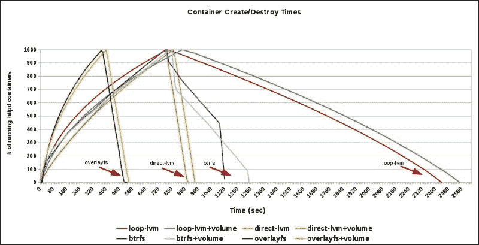
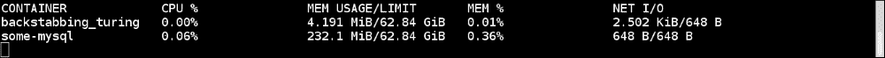
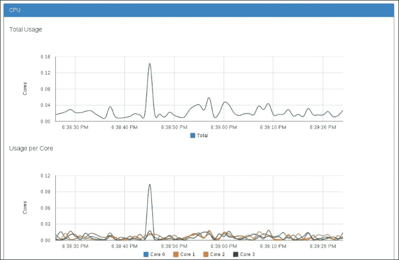

# 第七章。Docker 性能

在本章中，我们将涵盖以下配方：

+   基准测试 CPU 性能

+   基准测试磁盘性能

+   基准测试网络性能

+   使用统计功能获取容器资源使用情况

+   设置性能监控

# 介绍

在第三章中，*使用 Docker 镜像*，我们看到了 Dockerfile 如何用于创建由不同服务/软件组成的镜像，稍后在第四章中，*容器的网络和数据管理*，我们看到了一个 Docker 容器如何与外部世界进行数据和网络交流。在第五章中，*Docker 使用案例*，我们研究了 Docker 的不同使用案例，在第六章中，*Docker API 和语言绑定*，我们看到了如何使用远程 API 连接到远程 Docker 主机。

易用性都很好，但在投入生产之前，性能是考虑的关键因素之一。在本章中，我们将看到 Docker 的性能影响特性以及我们可以遵循的基准测试不同子系统的方法。在进行性能评估时，我们需要将 Docker 性能与以下进行比较：

+   裸金属

+   虚拟机

+   Docker 在虚拟机内运行

在本章中，我们将探讨进行性能评估的方法，而不是从运行中收集的性能数据进行比较。但是，我会指出不同公司进行的性能比较，供您参考。

让我们首先看一些影响 Docker 性能的特性：

+   **卷**：在放置任何企业级工作负载时，您希望相应地调整底层存储。您不应该使用容器使用的主/根文件系统来存储数据。Docker 提供了通过卷附加/挂载外部存储的功能。正如我们在第四章中所看到的，*容器的网络和数据管理*，有两种类型的卷，如下所示：

+   通过`--volume`选项通过主机机器挂载的卷

+   通过`--volumes-from`选项通过另一个容器挂载的卷

+   **存储驱动程序**：我们在第一章中查看了不同的存储驱动程序，即 vfs、aufs、btrfs、devicemapper 和 overlayFS。最近还合并了对 ZFS 的支持。您可以在[`github.com/docker/docker/blob/master/daemon/graphdriver/driver.go`](https://github.com/docker/docker/blob/master/daemon/graphdriver/driver.go)上检查当前支持的存储驱动程序及其选择优先级，如果没有选择 Docker 启动时间。

如果您正在运行 Fedora、CentOS 或 RHEL，则设备映射器将是默认的存储驱动程序。您可以在[`github.com/docker/docker/tree/master/daemon/graphdriver/devmapper`](https://github.com/docker/docker/tree/master/daemon/graphdriver/devmapper)找到一些特定于设备映射器的调整。

您可以使用`-s`选项更改 Docker 守护程序的默认存储驱动程序。您可以更新特定于发行版的配置/系统文件，以在服务重新启动时进行更改。对于 Fedora/RHEL/CentOS，您需要在`/etc/sysconfig/docker`中更新`OPTIONS`字段。类似以下内容可用于使用`btrfs`后端：

```
**OPTIONS=-s btrfs**

```

以下图表显示了使用不同存储驱动程序配置启动和停止 1,000 个容器所需的时间：



[`developerblog.redhat.com/2014/09/30/overview-storage-scalability-docker/`](http://developerblog.redhat.com/2014/09/30/overview-storage-scalability-docker/)

正如您所看到的，overlayFS 的性能优于其他存储驱动程序。

+   **--net=host**：我们知道，默认情况下，Docker 会创建一个桥接，并将 IP 分配给容器。使用`--net=host`将主机网络堆栈暴露给容器，跳过为容器创建网络命名空间。由此可见，与桥接方式相比，此选项始终提供更好的性能。

这有一些限制，比如不能让两个容器或主机应用程序监听相同的端口。

+   **Cgroups**：Docker 的默认执行驱动程序`libcontainer`公开了不同的 Cgroups 旋钮，可用于微调容器性能。其中一些如下：

+   **CPU 份额**：通过这个，我们可以为容器分配比例权重，并相应地共享资源。考虑以下示例：

```
**$ docker run -it -c 100 fedora bash**

```

+   CPUsets：这允许您创建 CPU 掩码，使用它可以控制容器内线程在主机 CPU 上的执行。例如，以下代码将在容器内的第 0 和第 3 个核心上运行线程：

```
**$ docker run -it  --cpuset=0,3 fedora bash**

```

+   内存限制：我们可以为容器设置内存限制。例如，以下命令将限制容器的内存使用量为 512 MB：

```
**$ docker run -it -m 512M fedora bash**

```

+   Sysctl 和 ulimit 设置：在某些情况下，您可能需要根据用例更改一些`sysclt`值以获得最佳性能，例如更改打开文件的数量。使用 Docker 1.6（[`docs.docker.com/v1.6/release-notes/`](https://docs.docker.com/v1.6/release-notes/)）及以上版本，我们可以使用以下命令更改`ulimit`设置：

```
**$ docker run -it --ulimit data=8192 fedora bash**

```

前面的命令将仅更改给定容器的设置，这是一个每个容器的调整变量。我们还可以通过 Docker 守护程序的 systemd 配置文件设置其中一些设置，默认情况下将适用于所有容器。例如，在 Fedora 上查看 Docker 的 systemd 配置文件，您将在服务部分看到类似以下内容：

```
**LimitNOFILE=1048576  # Open file descriptor setting**
**LimitNPROC=1048576   # Number of processes settings**
**LimitCORE=infinity   # Core size settings**

```

您可以根据需要进行更新。

您可以通过研究他人的工作来了解 Docker 的性能。在过去一年中，一些公司已经发表了一些与 Docker 性能相关的研究：

+   来自 Red Hat：

+   在 Red Hat Enterprise Linux 上对 Docker 的性能分析：

[`developerblog.redhat.com/2014/08/19/performance-analysis-docker-red-hat-enterprise-linux-7/`](http://developerblog.redhat.com/2014/08/19/performance-analysis-docker-red-hat-enterprise-linux-7/)

[`github.com/jeremyeder/docker-performance`](https://github.com/jeremyeder/docker-performance)

+   Docker 中存储可扩展性的综合概述：

[`developerblog.redhat.com/2014/09/30/overview-storage-scalability-docker/`](http://developerblog.redhat.com/2014/09/30/overview-storage-scalability-docker/)

+   超越微基准-以特斯拉效率突破容器性能：

[`developerblog.redhat.com/2014/10/21/beyond-microbenchmarks-breakthrough-container-performance-with-tesla-efficiency/`](http://developerblog.redhat.com/2014/10/21/beyond-microbenchmarks-breakthrough-container-performance-with-tesla-efficiency/)

+   使用 Red Hat Enterprise Linux 容器化数据库：

[`rhelblog.redhat.com/2014/10/29/containerizing-databases-with-red-hat-enterprise-linux/`](http://rhelblog.redhat.com/2014/10/29/containerizing-databases-with-red-hat-enterprise-linux/)

+   来自 IBM

+   虚拟机和 Linux 容器的性能比较的更新版本：

[`domino.research.ibm.com/library/cyberdig.nsf/papers/0929052195DD819C85257D2300681E7B/$File/rc25482.pdf`](http://domino.research.ibm.com/library/cyberdig.nsf/papers/0929052195DD819C85257D2300681E7B/%24File/rc25482.pdf)

[`github.com/thewmf/kvm-docker-comparison`](https://github.com/thewmf/kvm-docker-comparison)

+   来自 VMware

+   VMware vSphere 中的 Docker 容器性能

[`blogs.vmware.com/performance/2014/10/docker-containers-performance-vmware-vsphere.html`](http://blogs.vmware.com/performance/2014/10/docker-containers-performance-vmware-vsphere.html)

为了进行基准测试，我们需要在不同的环境（裸机/虚拟机/Docker）上运行类似的工作负载，然后借助不同的性能统计数据收集结果。为了简化事情，我们可以编写通用的基准测试脚本，这些脚本可以用于不同的环境。我们还可以创建 Dockerfiles 来生成带有工作负载生成脚本的容器。例如，在*Red Hat 企业 Linux 上 Docker 性能分析*文章中，作者使用了一个 Dockerfile 来创建一个 CentOS 镜像，并使用`container`环境变量来选择 Docker 和非 Docker 环境的基准测试脚本`run-sysbench.sh`。

同样，IBM 发布了用于其研究的 Dockerfiles 和相关脚本，可在[`github.com/thewmf/kvm-docker-comparison`](https://github.com/thewmf/kvm-docker-comparison)上找到。

我们将在本章的示例中使用一些之前提到的 Docker 文件和脚本。

# 基准测试 CPU 性能

我们可以使用诸如 Linpack（[`www.netlib.org/linpack/`](http://www.netlib.org/linpack/)）和 sysbench（[`github.com/nuodb/sysbench`](https://github.com/nuodb/sysbench)）之类的基准测试来测试 CPU 性能。对于这个示例，我们将使用 sysbench。我们将看到如何在裸机和容器内运行基准测试。如前所述，类似的步骤可以在其他环境中执行。

## 准备工作

我们将使用 CentOS 7 容器在容器内运行基准测试。理想情况下，我们应该有一个安装了 CentOS 7 的系统，以便在裸机上获得基准测试结果。对于容器测试，让我们从之前提到的 GitHub 存储库构建镜像：

```
**$ git clone https://github.com/jeremyeder/docker-performance.git** 
**$ cd docker-performance/Dockerfiles/**
**$ docker build -t c7perf --rm=true - < Dockerfile**
**$ docker images** 
**REPOSITORY           TAG            IMAGE ID          CREATED              VIRTUAL SIZE** 
**c7perf              latest         59a10df39a82    About a minute ago         678.3 MB** 

```

## 如何做…

在同一个 GitHub 存储库中，我们有一个用于运行 sysbench 的脚本，`docker-performance/bench/sysbench/run-sysbench.sh`。它有一些配置，您可以根据需要进行修改。

1.  作为 root 用户，在主机上创建`/results`目录：

```
**$ mkdir -p /results**

```

现在，在将容器环境变量设置为与 Docker 不同的值后运行基准测试，我们在主机上使用该值构建`c7perf`镜像，运行以下命令：

```
**$ cd docker-performance/bench/sysbench**
**$ export container=no**
**$ sh ./run-sysbench.sh  cpu test1**

```

默认情况下，结果会收集在`/results`中。确保您对其具有写访问权限，或者在基准测试脚本中更改`OUTDIR`参数。

1.  要在容器内运行基准测试，我们需要先启动容器，然后运行基准测试脚本：

```
**$ mkdir /results_container**
**$ docker run -it -v /results_container:/results c7perf bash** 
**$ docker-performance/bench/sysbench/run-sysbench.sh cpu test1**

```

由于我们挂载了主机目录`/results_container`到容器内的`/results`，因此结果将在主机上收集。

1.  在 Fedora/RHEL/CentOS 上运行上述测试时，如果启用了 SELinux，您将收到`Permission denied`错误。要解决此问题，请在将其挂载到容器内时重新标记主机目录，如下所示：

```
**$ docker run -it -v /results_container:/results:z c7perf bash**

```

或者，暂时将 SELinux 设置为宽松模式：

```
**$  setenforce 0**

```

然后，在测试之后，将其恢复为宽松模式：

```
**$  setenforce 1**

```

### 注意

有关 SELinux 的更多详细信息，请参阅第九章，“Docker 安全性”。

## 它是如何工作的…

基准测试脚本在内部调用 sysbench 的 CPU 基准测试，用于给定输入。CPU 是通过使用 Euklid 算法进行 64 位整数操作来进行基准测试，用于计算素数。每次运行的结果都会收集在相应的结果目录中，可用于比较。

## 还有更多…

裸机和 Docker CPU 性能报告几乎没有差异。

## 另请参阅

+   查看 IBM 和 VMware 在本章前面引用的链接中使用 Linpack 发布的 CPU 基准测试结果。

# 基准测试磁盘性能

有一些工具可用于基准测试磁盘性能，例如 Iozone ([`www.iozone.org/`](http://www.iozone.org/))，smallfile ([`github.com/bengland2/smallfile`](https://github.com/bengland2/smallfile))和 Flexible IO ([`github.com/axboe/fio`](https://github.com/axboe/fio))。对于本教程，我们将使用 FIO。为此，我们需要编写一个作业文件，模拟您想要运行的工作负载。使用此作业文件，我们可以在目标上模拟工作负载。对于本教程，让我们使用 IBM 发布的基准测试结果中的 FIO 示例（[`github.com/thewmf/kvm-docker-comparison/tree/master/fio`](https://github.com/thewmf/kvm-docker-comparison/tree/master/fio)）。

## 准备就绪

在裸机/虚拟机/Docker 容器上，安装 FIO 并挂载包含文件系统的磁盘以进行每个测试，挂载在`/ferrari`下或在 FIO 作业文件中提到的任何位置。在裸机上，您可以进行本地挂载，在虚拟机上，可以使用虚拟磁盘驱动程序进行挂载，或者可以进行设备透传。在 Docker 上，我们可以使用 Docker 卷从主机机器附加文件系统。

准备工作负载文件。我们可以选择[`github.com/thewmf/kvm-docker-comparison/blob/master/fio/mixed.fio`](https://github.com/thewmf/kvm-docker-comparison/blob/master/fio/mixed.fio)：

```
[global]
ioengine=libaio
direct=1
size=16g
group_reporting
thread
filename=/ferrari/fio-test-file

[mixed-random-rw-32x8]
stonewall
rw=randrw
rwmixread=70
bs=4K
iodepth=32
numjobs=8
runtime=60
```

使用上述作业文件，我们可以在`/ferrari/fio-test-file`上进行 4K 块大小的随机直接 I/O，使用 16GB 文件上的`libaio`驱动程序。I/O 深度为 32，并行作业数为 8。这是一个混合工作负载，其中 70％为读取，30％为写入。

## 如何做...

1.  对于裸机和虚拟机测试，您只需运行 FIO 作业文件并收集结果：

```
**$ fio mixed.fio**

```

1.  对于 Docker 测试，您可以按以下方式准备 Docker 文件：

```
FROM ubuntu
MAINTAINER nkhare@example.com
RUN apt-get update
RUN apt-get -qq install -y fio
ADD mixed.fio /
VOLUME ["/ferrari"]
ENTRYPOINT ["fio"]
```

1.  现在，使用以下命令创建一个镜像：

```
**$ docker build -t docker_fio_perf .**

```

1.  按照以下方式启动容器以运行基准测试并收集结果：

```
**$ docker run --rm -v /ferrari:/ferrari docker_fio_perf mixed.fio**

```

1.  在 Fedora/RHEL/CentOS 上运行上述测试时，启用 SELinux，您将收到“权限被拒绝”的错误。要解决此问题，请在容器内部挂载主机目录时重新标记主机目录，如下所示：

```
**$ docker run --rm -v /ferrari:/ferrari:z docker_fio_perf mixed.fio**

```

## 它是如何工作的...

FIO 将运行作业文件中给定的工作负载并输出结果。

## 还有更多...

收集结果后，您可以进行结果比较。您甚至可以尝试使用作业文件进行不同类型的 I/O 模式，并获得所需的结果。

## 另请参阅

+   查看 IBM 和 VMware 使用 FIO 在本章前面引用的链接中发布的磁盘基准测试结果

# 基准测试网络性能

网络是在容器环境中部署应用程序时需要考虑的关键因素之一。为了与裸机、虚拟机和容器进行性能比较，我们必须考虑以下不同的场景：

+   裸机到裸机

+   虚拟机到虚拟机

+   使用默认网络模式（桥接）的 Docker 容器到容器

+   使用主机网络（`--net=host`）的 Docker 容器到容器

+   Docker 容器在虚拟机中运行，与外部世界连接

在前述任何情况下，我们可以选择两个端点进行基准测试。我们可以使用工具如`nuttcp` ([`www.nuttcp.net/`](http://www.nuttcp.net/))和`netperf` ([`netperf.org/netperf/`](http://netperf.org/netperf/))来分别测量网络带宽和请求/响应。

## 准备就绪

确保两个端点可以相互到达并安装了必要的软件包/软件。在 Fedora 21 上，您可以使用以下命令安装`nuttcp`：

```
**$ yum install -y nuttcp**

```

然后，从其网站获取`netperf`。

## 如何做…

使用`nuttcp`测量网络带宽，执行以下步骤：

1.  在一个端点上启动`nuttcp`服务器：

```
**$ nuttcp -S**

```

1.  使用以下命令从客户端测量传输吞吐量（客户端到服务器）：

```
**$ nuttcp -t <SERVER_IP>**

```

1.  使用以下命令在客户端上测量接收吞吐量（服务器到客户端）：

```
**$ nuttcp -r <SERVER_IP>**

```

1.  使用`netperf`运行请求/响应基准测试，执行以下步骤：

1.  在一个端点上启动`netserver`：

```
**$ netserver** 

```

1.  从另一个端点连接到服务器并运行请求/响应测试：

+   对于 TCP：

```
**$ netperf  -H 172.17.0.6 -t TCP_RR**

```

+   对于 UDP：

```
**$ netperf  -H 172.17.0.6 -t UDP_RR**

```

## 它是如何工作的…

在前面提到的两种情况中，一个端点成为客户端，向另一个端点上的服务器发送请求。

## 还有更多…

我们可以收集不同场景的基准测试结果并进行比较。`netperf`也可以用于吞吐量测试。

## 另请参阅

+   查看 IBM 和 VMware 在本章前面引用的链接中发布的网络基准测试结果。

# 使用统计功能获取容器资源使用情况

随着 1.5 版本的发布，Docker 增加了一个功能，可以从内置命令中获取容器资源使用情况。

## 准备就绪

安装了 1.5 或更高版本的 Docker 主机，可以通过 Docker 客户端访问。同时，启动一些容器以获取统计信息。

## 如何做…

1.  运行以下命令从一个或多个容器获取统计信息：

```
**$ docker stats [CONTAINERS]**

```

例如，如果我们有两个名为`some-mysql`和`backstabbing_turing`的容器，然后运行以下命令以获取统计信息：

```
**$ docker stats some-mysql backstabbing_turing**

```



## 它是如何工作的…

Docker 守护程序从 Cgroups 获取资源信息，并通过 API 提供它。

## 参见

+   参考 Docker 1.5 的发布说明[`docs.docker.com/v1.5/release-notes/`](https://docs.docker.com/v1.5/release-notes/)

# 设置性能监控

我们有诸如 SNMP、Nagios 等工具来监视裸机和虚拟机的性能。同样，有一些可用于监视容器性能的工具/插件，如 cAdvisor（[`github.com/google/cadvisor`](https://github.com/google/cadvisor)）和 sFlow（[`blog.sflow.com/2014/06/docker-performance-monitoring.html`](http://blog.sflow.com/2014/06/docker-performance-monitoring.html)）。在本教程中，让我们看看如何配置 cAdvisor。

## 准备就绪

设置 cAdvisor。

+   运行 cAdvisor 的最简单方法是运行其 Docker 容器，可以使用以下命令完成：

```
**sudo docker run \** 
 **--volume=/:/rootfs:ro \** 
 **--volume=/var/run:/var/run:rw \** 
 **--volume=/sys:/sys:ro \** 
 **--volume=/var/lib/docker/:/var/lib/docker:ro \** 
 **--publish=8080:8080 \** 
 **--detach=true \** 
 **--name=cadvisor \** 
 **google/cadvisor:latest**

```

+   如果您想在 Docker 之外运行 cAdvisor，请按照 cAdvisor 主页上给出的说明进行操作[`github.com/google/cadvisor/blob/master/docs/running.md#standalone`](https://github.com/google/cadvisor/blob/master/docs/running.md#standalone)

## 操作方法…

容器启动后，将浏览器指向`http://localhost:8080`。您将首先获得有关主机机器的 CPU、内存使用情况和其他信息的图表。然后，通过单击 Docker 容器链接，您将在**子容器**部分下获得运行在机器上的容器的 URL。如果单击其中任何一个，您将看到相应容器的资源使用信息。

以下是一个这样的容器的屏幕截图：



## 它是如何工作的…

使用`docker run`命令，我们已经以只读模式挂载了一些卷，cAdvisor 将从中读取相关信息，比如容器的 Cgroup 详细信息，并以图形方式显示它们。

## 还有更多…

cAdvisor 支持将性能矩阵导出到 influxdb（[`influxdb.com/`](http://influxdb.com/)）。Heapster（[`github.com/GoogleCloudPlatform/heapster`](https://github.com/GoogleCloudPlatform/heapster)）是 Google 的另一个项目，它允许使用 cAdvisor 进行集群范围（Kubernetes）监控。

## 参见

+   您可以在 Docker 网站的文档中查看 cAdvisor 从 Cgroups 中使用的矩阵[https://docs.docker.com/articles/runmetrics/]。
