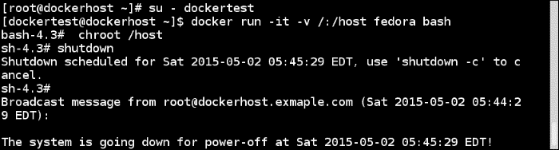
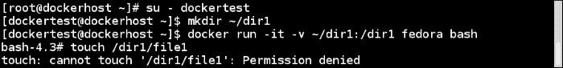
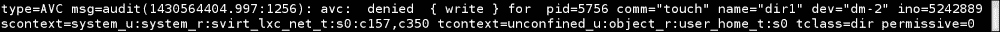
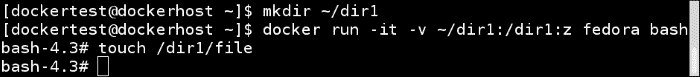
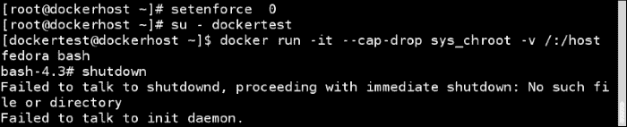

# 第九章。Docker 安全

在本章中，我们将介绍以下配方：

+   使用 SELinux 设置强制访问控制（MAC）

+   允许在启用 SELinux 的情况下对从主机挂载的卷进行写入

+   删除能力以降低容器内部 root 用户的权限

+   在主机和容器之间共享命名空间

# 介绍

Docker 容器实际上并不是沙箱应用程序，这意味着不建议在系统上以 root 身份运行随机应用程序。您应该始终将运行服务/进程的容器视为在主机系统上运行的服务/进程，并在容器内部放置在主机系统上放置的所有安全措施。

我们在第一章中看到，*介绍和安装*，Docker 如何使用命名空间进行隔离。Docker 使用的六个命名空间是进程、网络、挂载、主机名、共享内存和用户。在 Linux 中，并非所有内容都有命名空间，例如 SELinux、Cgroups、设备(`/dev/mem`、`/dev/sd*`)和内核模块。文件系统下的`/sys`、`/proc/sys`、`/proc/sysrq-trigger`、`/proc/irq`、`/proc/bus`也没有命名空间，但它们默认以只读方式挂载，使用 libcontainer 执行驱动程序。

为了使 Docker 成为一个安全的环境，最近已经做了很多工作，还有更多的工作正在进行中。

+   由于 Docker 镜像是基本构建块，因此非常重要的是我们选择正确的基础镜像开始。Docker 有官方镜像的概念，这些镜像由 Docker、供应商或其他人维护。如果您还记得第二章中的内容，*使用 Docker 容器*，我们可以使用以下语法在 Docker Hub 上搜索镜像：

```
**$ docker search <image name>** 

```

例如，考虑以下命令：

```
**$ docker search fedora**

```

我们将看到一个`OFFICIAL`列，如果镜像是官方的，你将在该列中看到对应的`[OK]`。在 Docker 1.3 中添加了一个实验性功能（[`blog.docker.com/2014/10/docker-1-3-signed-images-process-injection-security-options-mac-shared-directories/`](http://blog.docker.com/2014/10/docker-1-3-signed-images-process-injection-security-options-mac-shared-directories/)），它在拉取镜像后对官方镜像进行数字信号验证。如果镜像被篡改，用户将收到通知，但不会阻止用户运行它。目前，此功能仅适用于官方镜像。有关官方镜像的更多详细信息，请访问[`github.com/docker-library/official-images`](https://github.com/docker-library/official-images)。镜像签名和验证功能尚未准备就绪，因此目前不要完全依赖它。

+   在第六章中，*Docker API 和语言绑定*，我们看到了当 Docker 守护程序访问通过 TCP 配置时，我们如何可以保护 Docker 远程 API。

+   我们还可以考虑在 Docker 主机上使用`--icc=false`关闭默认的容器间网络通信。尽管容器仍然可以通过链接进行通信，覆盖 iptables 的默认 DROP 策略，但它们会使用`--icc=false`选项进行设置。

+   我们还可以通过 Cgroups 资源限制来防止**拒绝服务**（**DoS**）攻击通过系统资源约束。

+   Docker 利用了特殊设备 Cgroups，允许我们指定容器内可以使用哪些设备节点。它阻止进程创建和使用可能用于攻击主机的设备节点。

+   在镜像上预先创建的任何设备节点都不能用于与内核通信，因为镜像是以`nodev`选项挂载的。

以下是一些指南（可能不完整），可以遵循以确保安全的 Docker 环境：

+   以非 root 用户身份运行服务，并将容器内外的 root 视为 root。

+   使用来自可信方的镜像来运行容器；避免使用`-insecure-registry=[]`选项。

+   不要从 Docker 注册表或其他任何地方运行随机容器。Red Hat 携带了补丁，以添加和阻止注册表，以便企业有更多控制权（[`rhelblog.redhat.com/2015/04/15/understanding-the-changes-to-docker-search-and-docker-pull-in-red-hat-enterprise-linux-7-1/`](http://rhelblog.redhat.com/2015/04/15/understanding-the-changes-to-docker-search-and-docker-pull-in-red-hat-enterprise-linux-7-1/)）。

+   确保您的主机内核是最新的。

+   尽量避免使用`--privileged`，并尽快放弃容器特权。

+   通过 SELinux 或 AppArmor 配置**强制访问控制**（**MAC**）。

+   收集日志进行审计。

+   定期进行审计。

+   在专门设计仅运行容器的主机上运行容器。考虑使用 Project Atomic、CoreOS 或类似的解决方案。

+   使用`--device`选项挂载设备，而不是使用`--privileged`选项在容器内使用设备。

+   禁止容器内的 SUID 和 SGID。

最近，Docker 和互联网安全中心（[`www.cisecurity.org/`](http://www.cisecurity.org/)）发布了 Docker 安全最佳实践指南，涵盖了大部分前述指南以及更多指南，网址为[`blog.docker.com/2015/05/understanding-docker-security-and-best-practices/`](https://blog.docker.com/2015/05/understanding-docker-security-and-best-practices/)。

为了为本章中的一些示例设置上下文，让我们尝试在安装了 Docker 的 Fedora 21 上进行默认安装的实验。

1.  使用以下命令禁用 SELinux：

```
**$ sudo setenforce 0**

```

1.  创建一个用户并将其添加到默认的 Docker 组中，以便用户可以在不使用`sudo`的情况下运行 Docker 命令：

```
**$ sudo useradd dockertest**
**$ sudo passwd dockertest**
**$ sudo groupadd docker**
**$ sudo gpasswd -a dockertest docker**

```

1.  使用我们之前创建的用户登录，启动容器如下：

```
**$ su - dockertest**
**$ docker run -it -v /:/host fedora bash**

```

1.  从容器 chroot 到`/host`并运行`shutdown`命令：

```
**$ chroot /host**
**$ shutdown** 

```



正如我们所看到的，Docker 组中的用户可以关闭主机系统。Docker 目前没有授权控制，因此如果您可以与 Docker 套接字通信，就可以运行任何 Docker 命令。这类似于`/etc/sudoers`。

```
**USERNAME ALL=(ALL) NOPASSWD: ALL**

```

这真的不好。让我们看看在本章的其余部分中如何防范这种情况以及更多内容。

# 使用 SELinux 设置强制访问控制（MAC）

建议在 Docker 主机上设置某种形式的 MAC，可以是通过 SELinux 或 AppArmor，具体取决于 Linux 发行版。在本教程中，我们将看到如何在安装了 Fedora/RHEL/CentOS 的系统上设置 SELinux。让我们首先看看 SELinux 是什么：

+   SELinux 是一个标签系统

+   每个进程都有一个标签

+   每个文件、目录和系统对象都有一个标签

+   策略规则控制标记进程和标记对象之间的访问

+   内核执行规则

在 Docker 容器中，我们使用两种类型的 SELinux 强制：

+   **类型强制**：用于保护主机系统免受容器进程的影响。每个容器进程都被标记为`svirt_lxc_net_t`，每个容器文件都被标记为`svirt_sandbox_file_t`。`svirt_lxc_net_t`类型被允许管理任何标记为`svirt_sandbox_file_t`的内容。容器进程只能访问/写入容器文件。

+   **多类别安全强制**：通过设置类型强制，所有容器进程将以`svirt_lxc_net_t`标签运行，所有内容都将被标记为`svirt_sandbox_file_t`。然而，只有这些设置，我们无法保护一个容器免受另一个容器的影响，因为它们的标签是相同的。

我们使用**多类别安全**（**MCS**）强制来保护一个容器免受另一个容器的影响，这是基于**多级安全**（**MLS**）的。当启动一个容器时，Docker 守护程序会选择一个随机的 MCS 标签，例如`s0:c41,c717`，并将其保存在容器元数据中。当任何容器进程启动时，Docker 守护程序告诉内核应用正确的 MCS 标签。由于 MCS 标签保存在元数据中，如果容器重新启动，它将获得相同的 MCS 标签。

## 准备就绪

在安装了最新版本的 Docker 的 Fedora/RHEL/CentOS 主机上，可以通过 Docker 客户端访问。

## 如何做到这一点...

Fedora/RHEL/CentOS 默认安装 SELinux 并设置为强制模式，并且 Docker 守护程序设置为与 SELinux 一起启动。要检查是否满足这些条件，请执行以下步骤。

1.  运行以下命令以确保 SELinux 已启用：

```
**$ getenforce**

```

如果前面的命令返回`enforcing`，那就很好，否则我们需要通过更新 SELinux 配置文件（`/etc/selinux/config`）并重新启动系统来进行更改。

1.  Docker 应该使用`--selinux-enabled`选项运行。您可以在 Docker 守护程序配置（`/etc/sysconfig/docker`）文件的`OPTIONS`部分中检查。还要交叉检查 Docker 服务是否已启动并使用 SELinux 选项：

```
**$ systemctl status docker**

```

上述命令假定您没有手动以守护程序模式启动 Docker。

让我们在挂载主机目录作为卷后启动容器（不使用特权选项），并尝试在其中创建一个文件：



如预期的那样，我们看到`Permission denied`，因为具有`svirt_lxc_net_t`标签的容器进程无法在主机文件系统上创建文件。如果我们查看主机上的 SELinux 日志（`/var/log/audit.log`），我们将看到类似以下的消息：



`s0:c157,c350`标签是容器上的 MCS 标签。

## 它是如何工作的...

当为 SELinux 和 Docker 设置正确的选项时，SELinux 设置了类型和多类别安全强制执行。Linux 内核执行这些强制执行。

## 还有更多...

+   如果 SELinux 处于强制执行模式，并且 Docker 守护程序配置为使用 SELinux，则我们将无法像在本章前面那样从容器关闭主机：

+   我们知道，默认情况下，所有容器都将以`svirt_lxc_net_t`标签运行，但我们也可以根据自定义要求调整 SELinux 标签。访问[`opensource.com/business/15/3/docker-security-tuning`](http://opensource.com/business/15/3/docker-security-tuning)的*调整 SELinux 标签*部分。

+   使用 Docker 容器设置 MLS 也是可能的。访问[`opensource.com/business/15/3/docker-security-tuning`](http://opensource.com/business/15/3/docker-security-tuning)的*多级安全模式*部分。

## 另请参阅

+   *SELinux 着色书*；访问[`people.redhat.com/duffy/selinux/selinux-coloring-book_A4-Stapled.pdf`](https://people.redhat.com/duffy/selinux/selinux-coloring-book_A4-Stapled.pdf)

# 允许从启用 SELinux 的主机挂载的卷进行写入

正如我们在前面的示例中看到的，当 SELinux 配置时，非特权容器无法访问从主机系统挂载目录创建的卷上的文件。但是，有时需要允许容器从主机文件访问。在本示例中，我们将看到如何在这种情况下允许访问。

## 准备工作

安装了最新版本的 Docker 的 Fedora/RHEL/CentOS 主机，可以通过 Docker 客户端访问。此外，SELinux 设置为强制模式，并且 Docker 守护程序配置为使用 SELinux。

## 如何做...

1.  使用以下方式使用`z`或`Z`选项挂载卷：

```
**$ docker run -it -v /tmp/:/tmp/host:z docker.io/fedora bash**
**$ docker run -it -v /tmp/:/tmp/host:Z docker.io/fedora bash**

```



## 它是如何工作的...

在挂载卷时，Docker 将重新标记卷以允许访问。来自 Docker 运行的 man 页面。

`z`选项告诉 Docker 卷内容将在容器之间共享。Docker 将使用共享内容标签标记内容。共享卷标签允许所有容器读/写内容。`Z`选项告诉 Docker 使用私有未共享标签标记内容。私有卷只能被当前容器使用。

## 另请参阅

+   *卷挂载*部分在[`opensource.com/business/14/9/security-for-docker`](http://opensource.com/business/14/9/security-for-docker)

# 在容器内取消功能以分解根用户的权限

简而言之，通过功能，我们可以分解根用户的权限。来自*功能*的 man 页面：

> *为了进行权限检查，传统的 UNIX 实现区分两类进程：特权进程（有效用户 ID 为 0，称为超级用户或根用户）和非特权进程（有效 UID 为非零）。特权进程绕过所有内核权限检查，而非特权进程则根据进程的凭据（通常为：有效 UID、有效 GID 和附加组列表）进行完整的权限检查。*
> 
> *从 2.2 内核开始，Linux 将传统上与超级用户关联的特权分为不同的单元，称为功能，可以独立启用和禁用。功能是每个线程的属性。*

一些示例功能包括：

+   `CAP_SYSLOG`：这修改了内核的打印行为

+   `CAP_NET_ADMIN`：这配置网络

+   `CAP_SYS_ADMIN`：这有助于捕获所有功能

内核中只有 32 个功能插槽可用。有一个功能`CAP_SYS_ADMIN`，它捕获所有功能；每当有疑问时使用。

在 1.2 版本中，Docker 添加了一些功能，用于为容器添加或删除功能。它默认使用`chown`、`dac_override`、`fowner`、`kill`、`setgid`、`setuid`、`setpcap`、`net_bind_service`、`net_raw`、`sys_chroot`、`mknod`、`setfcap`和`audit_write`功能，并默认删除容器的以下功能。

+   `CAP_SETPCAP`: 这修改进程功能

+   `CAP_SYS_MODULE`: 这插入/删除内核模块

+   `CAP_SYS_RAWIO`: 这修改内核内存

+   `CAP_SYS_PACCT`: 这配置进程记账

+   `CAP_SYS_NICE`: 这修改进程的优先级

+   `CAP_SYS_RESOURCE`: 这覆盖资源限制

+   `CAP_SYS_TIME`: 这修改系统时钟

+   `CAP_SYS_TTY_CONFIG`: 这配置`tty`设备

+   `CAP_AUDIT_WRITE`: 这写入审计日志

+   `CAP_AUDIT_CONTROL`: 这配置审计子系统

+   `CAP_MAC_OVERRIDE`: 这忽略内核 MAC 策略

+   `CAP_MAC_ADMIN`: 这配置 MAC 配置

+   `CAP_SYSLOG`: 这修改内核 printk 行为

+   `CAP_NET_ADMIN`: 这配置网络

+   `CAP_SYS_ADMIN`: 这有助于捕获所有容器

我们需要非常小心地删除功能，因为如果应用程序没有足够的功能来运行，可能会出现问题。要为容器添加和删除功能，可以分别使用`--cap-add`和`--cap-drop`选项。

## 准备工作

安装了最新版本的 Docker 的主机，可以通过 Docker 客户端访问。

## 如何做…

1.  要删除功能，运行类似以下命令：

```
**$ docker run --cap-drop <CAPABILITY> <image> <command>**

```

要从容器中删除`setuid`和`setgid`功能，以便它无法运行具有这些位设置的二进制文件，运行以下命令：

```
**$ docker run -it --cap-drop  setuid --cap-drop setgid fedora bash**

```

1.  同样，要添加功能，运行类似以下命令：

```
**$ docker run --cap-add <CAPABILITY> <image> <command>**

```

要添加所有功能并仅删除`sys-admin`，运行以下命令：

```
**$ docker run -it --cap-add all --cap-drop sys-admin fedora bash**

```

## 它是如何工作的…

在启动容器之前，Docker 为容器内的根用户设置功能，这会影响容器进程的命令执行。

## 还有更多...

让我们重新访问我们在本章开头看到的例子，通过它我们看到主机系统通过容器关闭。让 SELinux 在主机系统上禁用；但是，在启动容器时，删除`sys_choot`功能：

```
**$ docker run -it --cap-drop  sys_chroot -v /:/host  fedora bash**
**$ shutdown**

```



## 另请参阅

+   Dan Walsh 在[`opensource.com/business/14/9/security-for-docker`](http://opensource.com/business/14/9/security-for-docker)上的文章。

+   [`blog.docker.com/2014/08/announcing-docker-1-2-0/`](http://blog.docker.com/2014/08/announcing-docker-1-2-0)上的 Docker 1.2 发布说明。

+   有努力在进行中，以有选择地禁用容器进程的系统调用，以提供更严格的安全性。访问[`opensource.com/business/15/3/docker-security-future`](http://opensource.com/business/15/3/docker-security-future)的*Seccomp*部分。

+   与版本 1.6 中的自定义命名空间和功能类似，Docker 支持`--cgroup-parent`标志，以传递特定的 Cgroup 来运行容器。[`docs.docker.com/v1.6/release-notes/`](https://docs.docker.com/v1.6/release-notes)。

# 在主机和容器之间共享命名空间

我们知道，在启动容器时，默认情况下，Docker 为容器创建六个不同的命名空间——进程、网络、挂载、主机名、共享内存和用户。在某些情况下，我们可能希望在两个或更多的容器之间共享命名空间。例如，在 Kubernetes 中，一个 pod 中的所有容器共享相同的网络命名空间。

在某些情况下，我们希望与容器共享主机系统的命名空间。例如，我们在主机和容器之间共享相同的网络命名空间，以在容器内获得接近线速。在这个教程中，我们将看到如何在主机和容器之间共享命名空间。

## 准备工作

安装了最新版本的 Docker 的主机，可以通过 Docker 客户端访问。

## 如何做…

1.  要与容器共享主机网络命名空间，请运行以下命令：

```
**$ docker run -it  --net=host fedora bash**

```

如果要在容器内查看网络详细信息，请运行以下命令：

```
**$ ip a** 

```

您将看到与主机相同的结果。

1.  要与容器共享主机网络、PID 和 IPC 命名空间，请运行以下命令：

```
**$ docker run -it --net=host --pid=host --ipc=host fedora bash**

```

## 它是如何工作的…

当传递这些参数给容器时，Docker 不会为容器创建单独的命名空间。

## 还有更多...

对于专门用于运行容器的主机，比如 Project Atomic ([`www.projectatomic.io/`](http://www.projectatomic.io/))，我们在第八章中看到的*Docker 编排和托管平台*，在主机系统上没有像`tcpdump`和`sysstat`这样的调试工具。因此，我们创建了带有这些工具并可以访问主机资源的容器。在这种情况下，在主机和容器之间共享命名空间变得很方便。您可以在以下链接中了解更多信息：

+   [`developerblog.redhat.com/2014/11/06/introducing-a-super-privileged-container-concept/`](http://developerblog.redhat.com/2014/11/06/introducing-a-super-privileged-container-concept/)

+   [`developerblog.redhat.com/2015/03/11/introducing-the-rhel-container-for-rhel-atomic-host/`](http://developerblog.redhat.com/2015/03/11/introducing-the-rhel-container-for-rhel-atomic-host/)

## 另请参阅

+   丹·沃尔什在[`opensource.com/business/15/3/docker-security-tuning`](http://opensource.com/business/15/3/docker-security-tuning)上的 Docker 安全文档
