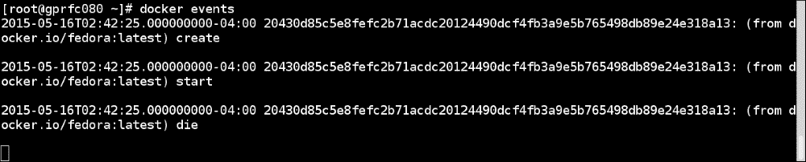

# 第十章：获取帮助和技巧

在本章中，我们将看到以下配方：

+   以调试模式启动 Docker

+   从源代码构建 Docker 二进制文件

+   构建图像而不使用缓存层

+   为容器通信构建自己的桥接

+   更改 Docker 的默认执行驱动程序

+   为容器选择日志记录驱动程序

+   获取容器的实时 Docker 事件

# 介绍

随着我们对 Docker 的了解越来越多，我们会变得更加好奇。邮件列表和 IRC 频道是获取帮助、学习和分享关于 Docker 知识的最佳场所。Docker 在免费节点上有一些 IRC 频道，如`#docker`和`#docker-dev`，分别用于讨论 Docker 和与开发相关的内容。同样，Docker 有两个邮件列表：

+   Docker 用户列表可在[`groups.google.com/forum/#!forum/docker-user`](https://groups.google.com/forum/#!forum/docker-user)找到

+   Docker 开发人员列表可在[`groups.google.com/forum/#!forum/docker-dev`](https://groups.google.com/forum/#!forum/docker-dev)找到

在使用 Docker 时，如果发现任何错误，可以在 GitHub 上报告它们，网址为[`github.com/docker/docker/issues`](https://github.com/docker/docker/issues)。

同样，如果您修复了一个错误，可以发送拉取请求，该请求将得到审查，然后合并到代码库中。

Docker 还有一个论坛和一个 YouTube 频道，它们是很好的学习资源，分别可以在[`forums.docker.com/`](https://forums.docker.com/)和[`www.youtube.com/user/dockerrun`](https://www.youtube.com/user/dockerrun)找到。

在世界各地有许多 Docker 见面小组，您可以在[`www.docker.com/community/meetups/`](https://www.docker.com/community/meetups/)上与志同道合的人见面，并通过分享经验来学习。

在本章中，我还将提供一些技巧和窍门，这将帮助您更好地使用 Docker。

# 以调试模式启动 Docker

我们可以以调试模式启动 Docker 来调试日志。

## 准备就绪

在系统上安装 Docker。

## 如何做…

1.  使用调试选项`-D`启动 Docker 守护进程。要从命令行启动，可以运行以下命令：

```
**$ docker -d -D**

```

1.  您还可以在 Docker 配置文件中添加`--debug/-D`选项以以调试模式启动。

## 它是如何工作的…

上述命令将以守护程序模式启动 Docker。当您启动守护程序时，您将看到许多有用的消息，例如加载现有图像，防火墙设置（iptables）等。如果启动容器，您将看到以下消息：

```
**[info] POST /v1.15/containers/create**
**[99430521] +job create()** 
**......**
**......**

```

# 从源代码构建 Docker 二进制文件

有时需要从源代码构建 Docker 二进制文件以测试补丁。从源代码构建 Docker 二进制文件非常容易。

## 准备工作

1.  使用`git`下载 Docker 源代码：

```
**$ git clone https://github.com/docker/docker.git**

```

1.  在 Fedora 上安装`make`：

```
**$ yum install -y make**

```

1.  确保 Docker 在构建代码的主机上运行，并且您可以通过 Docker 客户端访问它，因为我们讨论的构建发生在容器内。

## 如何做…

1.  进入克隆的目录：

```
**$ cd docker**

```

1.  运行`make`命令：

```
**$ sudo make**

```

## 工作原理…

这将创建一个容器，并在其中从主分支编译代码。完成后，它将在`bundles/<version>/binary`中输出二进制文件。

## 还有更多…

+   与源代码类似，您也可以构建文档：

```
**$ sudo make docs**

```

+   您还可以使用以下命令运行测试：

```
 **$ sudo make test** 

```

## 另请参阅

+   查看 Docker 网站上的文档[`docs.docker.com/contributing/devenvironment/`](https://docs.docker.com/contributing/devenvironment/)

# 构建图像而不使用缓存层

默认情况下，当我们构建图像时，Docker 将尝试使用缓存的层，以便构建时间更短。但是，有时需要从头开始构建。例如，您需要强制进行系统更新，例如`yum -y update`。让我们看看如何在这个示例中做到这一点。

## 准备工作

获取一个 Dockerfile 来构建镜像。

## 如何做…

1.  构建镜像时，通过以下方式传递`--no-cache`选项：

```
**$ docker build -t test --no-cache - < Dockerfile**

```

## 工作原理…

`--no-cache`选项将丢弃任何缓存的层，并根据指令构建一个 Dockerfile。

## 还有更多…

有时，我们还想在仅执行几条指令后丢弃缓存。在这种情况下，我们可以添加任何不影响图像的任意命令，例如创建或设置环境变量。

# 为容器通信构建自己的桥接

我们知道，当 Docker 守护程序启动时，它会创建一个名为`docker0`的桥接，并且所有容器都将从中获取 IP。有时我们可能想要自定义这些设置。让我们看看如何在这个示例中做到这一点。

## 准备工作

我假设您已经设置好了 Docker。在 Docker 主机上，停止 Docker 守护程序。在 Fedora 上，使用以下命令：

```
**$ systemctl stop docker**

```

## 如何做…

1.  要删除默认的`docker0`桥接，请使用以下命令：

```
**$ sudo ip link set dev docker0 down** 
**$ sudo brctl delbr docker0**

```

1.  要创建自定义桥接，请使用以下命令：

```
**$ sudo brctl addbr br0** 
**$ sudo ip addr add 192.168.2.1/24 dev br0** 
**$ sudo ip link set dev bridge0 up**

```

1.  更新 Docker 配置文件以使用我们之前创建的桥接。在 Fedora 上，您可以按以下方式更新配置文件：

```
**$ sed -i '/^OPTIONS/ s/$/ --bridge br0/' /etc/sysconfig/docker**

```

1.  要启动 Docker 守护程序，请使用以下命令：

```
**$ systemctl start docker**

```

## 工作原理…

上述步骤将创建一个新的桥接，并将从 192.168.2.0 子网中为容器分配 IP。

## 还有更多…

您甚至可以向桥接添加接口。

## 另请参阅

+   Docker 网站上的文档[`docs.docker.com/articles/networking/`](https://docs.docker.com/articles/networking/)

# 更改 Docker 的默认执行驱动程序

正如我们所知，libcontainer 是默认的执行驱动程序。对于 LXC 用户空间工具([`linuxcontainers.org/`](https://linuxcontainers.org/))有传统支持。请记住，LXC 不是主要的开发环境。

## 准备工作

在系统上安装 Docker。

## 如何做…

1.  以以下方式启动 Docker 守护程序，使用`-e lxc`选项：

```
**$ docker -d -e lxc**

```

您还可以根据发行版在 Docker 的配置文件中添加此选项。

## 工作原理…

Docker 使用 LXC 工具访问内核功能，如命名空间和 Cgroups 来运行容器。

## 另请参阅

+   Docker 网站上的文档[`docs.docker.com/reference/commandline/cli/#docker-exec-driver-option`](https://docs.docker.com/reference/commandline/cli/#docker-exec-driver-option)

# 为容器选择日志驱动程序

随着 Docker 1.6 的发布，新增了一个功能，可以在启动 Docker 守护程序时选择日志驱动程序。目前支持三种类型的日志驱动程序：

+   none

+   json-file（默认）

+   syslog

## 准备工作

在系统上安装 Docker 1.6 或更高版本。

## 如何做…

1.  以以下方式启动 Docker 守护程序，使用所需的日志驱动程序：

```
**$ docker -d --log-driver=none**
**$ docker -d --log-driver=syslog**

```

您还可以根据发行版在 Docker 的配置文件中添加此选项。

`docker logs`命令将仅支持默认的日志驱动程序 JSON 文件。

## 工作原理…

根据日志驱动程序配置，Docker 守护程序选择相应的日志驱动程序。

## 还有更多…

正在进行工作，将`journald`添加为日志驱动程序之一。它将在 Docker 1.7 中可用[`www.projectatomic.io/blog/2015/04/logging-docker-container-output-to-journald/`](http://www.projectatomic.io/blog/2015/04/logging-docker-container-output-to-journald/)。

## 另请参阅

+   Docker 网站上的文档[`docs.docker.com/reference/run/#logging-drivers-log-driver`](http://docs.docker.com/reference/run/#logging-drivers-log-driver)

# 获取容器的实时 Docker 事件

由于我们将在生产中运行许多容器，如果我们可以观察实时容器事件以进行监视和调试，将会很有帮助。Docker 容器可以报告事件，例如创建、销毁、死亡、导出、杀死、oom、暂停、重启、启动、停止和取消暂停。在这个教程中，我们将看到如何启用事件日志记录，然后使用过滤器选择特定的事件类型、镜像或容器。

## 准备工作

确保 Docker 守护程序在主机上运行，并且您可以通过 Docker 客户端连接。

## 如何做…

1.  使用以下命令启动 Docker 事件日志记录：

```
**$ docker events**

```

1.  从另一个终端执行一些与容器/镜像相关的操作，您将在第一个终端上看到类似以下截图的结果:

在事件收集开始后，我创建了一个容器来打印一些东西。如前面的截图所示，一个容器被创建、启动和死亡。

## 工作原理…

使用 Docker 事件，Docker 开始列出不同的事件。

## 还有更多…

+   您可以使用`--since`或`--until`选项与 Docker 事件，以缩小所选时间戳的结果：

```
 **--since=""         Show all events created since timestamp** 
 **--until=""         Stream events until this timestamp** 

```

考虑以下示例：

```
**$ docker events --since '2015-01-01'**

```

+   使用过滤器，我们可以根据事件、容器和镜像进一步缩小事件日志，如下所示：

+   要仅列出启动事件，请使用以下命令：

```
 **$ docker events --filter 'event=start'**

```

+   要仅列出来自 CentOS 镜像的事件，请使用以下命令：

```
 **$ docker events --filter 'image=docker.io/centos:centos7'**

```

+   要列出特定容器的事件，请使用以下命令：

```
 **docker events --filter 'container=b3619441cb444b87b4d79a8c30616ca70da4b5aa8fdc5d8a48d23a2082052174'**

```

## 另请参阅

+   Docker 网站上的文档[`docs.docker.com/reference/commandline/cli/#events`](https://docs.docker.com/reference/commandline/cli/#events)
