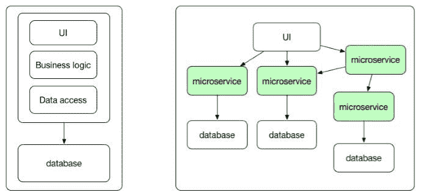
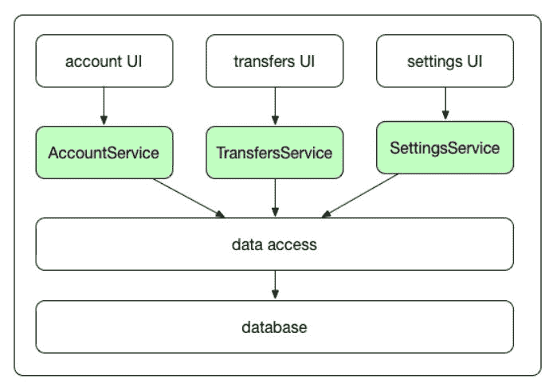
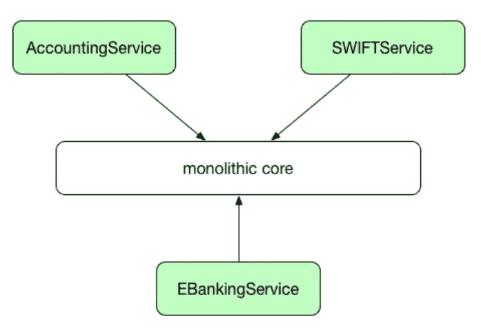
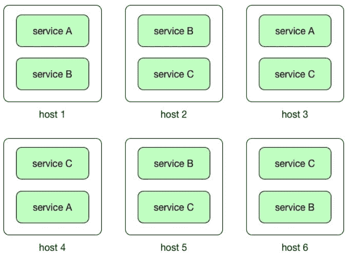
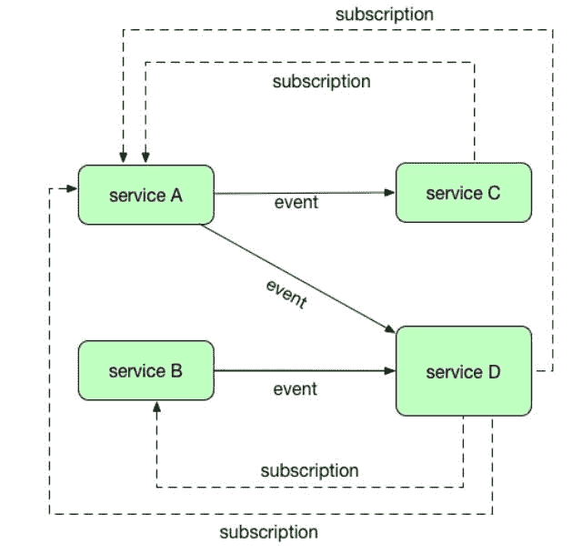

# 第三章：使用微服务

在阅读前两章之后，您现在应该对 Docker 架构及其概念有所了解。在我们继续 Java、Docker 和 Kubernetes 之旅之前，让我们先了解一下微服务的概念。

通过阅读本章，您将了解为什么转向微服务和云开发是必要的，以及为什么单片架构不再是一个选择。微服务架构也是 Docker 和 Kubernetes 特别有用的地方。

本章将涵盖以下主题：

+   微服务简介和与单片架构的比较

+   Docker 和 Kubernetes 如何适应微服务世界

+   何时使用微服务架构

在我们实际创建 Java 微服务并使用 Docker 和 Kubernetes 部署之前，让我们先解释一下微服务的概念，并将其与单片架构进行比较。

# 微服务简介

根据定义，微服务，也称为**微服务架构**（**MSA**），是一种架构风格和设计模式，它认为一个应用程序应该由一组松散耦合的服务组成。这种架构将业务领域模型分解为由服务实现的较小、一致的部分。换句话说，每个服务都将有自己的责任，独立于其他服务，每个服务都将提供特定的功能。

这些服务应该是孤立的和自治的。然而，它们当然需要通信以提供一些业务功能。它们通常使用`REST`暴露或通过发布和订阅事件的方式进行通信。

解释微服务背后理念的最好方式是将其与构建大型应用程序的旧传统方法——单片设计进行比较。

看一下下面的图表，展示了单片应用程序和由微服务组成的分布式应用程序。

正如您在上一个图表中所看到的，单片应用程序与使用微服务架构创建的应用程序完全不同。让我们比较这两种方法，并指出它们的优点和缺点。

# 单片与微服务

我们从描述单片架构开始比较，以展示其特点。

# 单片架构

过去，我们习惯于创建完整、庞大和统一的代码片段作为应用程序。以 Web MVC 应用程序为例。这种应用程序的简化架构如下图所示：

正如你所看到的，该图表展示了典型的网络应用程序，这里是银行系统的一个片段。这是一个**模型** **视图** **控制器**（**MVC**）应用程序，由模型、视图和控制器组成，用于向客户端浏览器提供 HTML 内容。它可能还可以通过 REST 端点接受和发送 JSON 内容。这种应用程序是作为一个单一单元构建的。正如你所看到的，我们在这里有几个层。企业应用程序通常分为三个部分：客户端用户界面（包括在浏览器中运行的 HTML 页面和 JavaScript）、处理`HTTP`请求的服务器端部分（可能使用类似 spring 的控制器构建），然后我们有一个服务层，可能使用 EJB 或 Spring 服务来实现。服务层执行特定领域的业务逻辑，并最终检索/更新数据库中的数据。这是一个非常典型的网络应用程序，我们每个人可能都曾经创建过。整个应用程序是一个单体，一个单一的逻辑可执行文件。要对系统进行任何更改，我们必须构建和部署整个服务器端应用程序的更新版本；这种应用程序通常打包成单个 WAR 或 EAR 存档，连同所有静态内容，如 HTML 和 JavaScript 文件一起。一旦部署，所有应用程序代码都在同一台机器上运行。通常情况下，要扩展这种应用程序，需要在集群中的多台机器上部署多个相同的应用程序代码副本，可能在某个负载均衡器后面。

这个设计并不算太糟糕，毕竟我们的应用程序已经上线运行了。但是，世界变化很快，特别是在使用敏捷方法论的时候。企业已经开始要求比以往更快地发布软件。尽快成为 IT 开发语言词典中非常常见的词语。规格经常波动，所以代码经常变化并随着时间增长。如果团队规模庞大（在复杂的大型应用程序的情况下可能会是这样），每个人都必须非常小心，不要破坏彼此的工作。随着每个新增的功能，我们的应用程序变得越来越复杂。编译和构建时间变得更长，迟早会变得棘手，使用单元测试或集成测试来测试整个系统。此外，新成员加入团队的入口点可能令人望而生畏，他们需要从源代码存储库中检出整个项目。然后他们需要在他们的集成开发环境中构建它（在大型应用程序的情况下并不总是那么容易），并分析和理解组件结构以完成他们的工作。此外，负责用户界面部分的人需要与负责中间层的开发人员、数据库建模人员、数据库管理员等进行沟通。随着时间的推移，团队结构往往会开始模仿应用程序架构。有风险，即特定层上的开发人员倾向于尽可能多地将逻辑放入他所控制的层中。结果，随着时间的推移，代码可能变得难以维护。我们都曾经历过这种情况，对吧？

此外，单片系统的扩展并不像将 WAR 或 EAR 放入另一个应用服务器然后启动那么容易。因为所有应用代码都在服务器上的同一个进程中运行，通常几乎不可能扩展应用程序的各个部分。举个例子：我们有一个集成了 VOIP 外部服务的应用程序。我们的应用程序用户不多，但是来自 VOIP 服务的事件却很多，我们需要处理。为了处理不断增加的负载，我们需要扩展我们的应用程序，在单片系统的情况下，我们需要扩展整个系统。这是因为应用程序是一个单一的、庞大的工作单元。如果应用程序的一个服务是 CPU 或资源密集型的，整个服务器必须配备足够的内存和 CPU 来处理负载。这可能很昂贵。每个服务器都需要一个快速的 CPU 和足够的 RAM 来运行我们应用程序中最苛刻的组件。

所有单片应用程序都具有以下特点：

+   它们通常很大，经常涉及许多人参与其中。这可能是一个问题，当将项目加载到 IDE 中时，尽管拥有强大的机器和出色的开发环境，比如 IntelliJ IDEA。但问题不仅仅在于数百、数千或数百万行代码。它还涉及解决方案的复杂性，比如团队成员之间的沟通问题。沟通问题可能导致在应用程序的不同部分针对同一个问题出现多种解决方案。这将使问题变得更加复杂，很容易演变成一个无人能够理解整个系统的大团团乱。此外，人们可能害怕对系统进行重大更改，因为在相反的一端可能会突然停止工作。如果这是由用户在生产系统上报告的，那就太糟糕了。

+   它们有一个长的发布周期，我们都知道发布管理、权限、回归测试等流程。几乎不可能在一个庞大的单片应用程序中创建持续交付流程。

+   它们很难扩展；通常需要运维团队投入大量工作来在集群中增加一个新的应用实例。扩展特定功能是不可能的，你唯一的选择就是在集群中增加整个系统的实例。这使得扩展变得非常具有挑战性。

+   在部署失败的情况下，整个系统将不可用。

+   你被锁定在特定的编程语言或技术栈中。当然，使用 Java，系统的部分可以用在 JVM 上运行的一个或多个语言开发，比如 Scala、Kotlin 或 Groovy，但如果你需要与`.net`库集成，问题就开始了。这也意味着你不总是能够使用合适的工具来完成工作。想象一下，你想在数据库中存储大量复杂的文档。它们通常有不同的结构。作为文档数据库的 MongoDB 应该是合适的，对吧？是的，但我们的系统正在运行 Oracle。

+   它不太适合敏捷开发过程，在这种过程中，我们需要不断实施变更，几乎立即发布到生产环境，并准备好进行下一次迭代。

正如你所看到的，单体应用只适用于小规模团队和小型项目。如果你需要一个更大规模并涉及多个团队的系统，最好看看其他选择。但是对于现有的单体系统，你可能喜欢处理它，该怎么办呢？你可能会意识到，将系统的一些部分外包到小服务中可能会很方便。这将加快开发过程并增加可测试性。它还将使你的应用程序更容易扩展。虽然单体应用仍保留核心功能，但许多部分可以外包到支持核心模块的小边缘服务中。这种方法在下图中呈现：

在这种中间解决方案中，主要业务逻辑将保留在你的应用程序单体中。诸如集成、后台作业或其他可以通过消息触发的小子系统等事物可以移动到它们自己的服务中。你甚至可以将这些服务放入云中，以进一步减少管理基础设施的必要性。这种方法允许你逐渐将现有的单体应用程序转变为完全面向服务的架构。让我们来看看微服务的方法。

# 微服务架构

微服务架构旨在解决我们提到的单片应用程序的问题。主要区别在于单片应用程序中定义的服务被分解为单独的服务。最重要的是，它们是分别部署在不同的主机上的。看一下下面的图表：

使用微服务架构创建应用程序时，每个微服务负责单一的、特定的业务功能，并且只包含执行该特定业务逻辑所需的实现。这与创建系统的“分而治之”的方式相同。这似乎与面向 SOA 的架构相似。事实上，传统的 SOA 和微服务架构有一些共同的特点。两者都将应用程序的片段组织成服务，并且都定义了清晰的边界，服务可以在其中与其他服务解耦。然而，SOA 起源于需要将单片应用程序与另一个应用程序集成起来。通常情况下，这是通过通常基于 SOAP 的 API 完成的，使用繁重的 XML 消息传递。在 SOA 中，这种集成在中间通常严重依赖某种中间件，通常是企业服务总线（ESB）。微服务架构也可以利用消息总线，但有显著的区别。在微服务架构中，消息层中根本没有逻辑，它纯粹用作从一个服务到另一个服务的消息传输。这与 ESB 形成了鲜明对比，ESB 需要大量的逻辑来进行消息路由、模式验证、消息转换等。因此，微服务架构比传统的 SOA 更不繁琐。

在扩展方面，将微服务与单片应用程序进行比较时存在巨大的差异。微服务的关键优势在于单个服务可以根据资源需求进行独立扩展。这是因为它们是自给自足的和独立的。由于微服务通常部署在资源较小的主机上，主机只需要包含服务正常运行所需的资源。随着资源需求的增长，横向和纵向扩展都很容易。要进行横向扩展，只需部署所需数量的实例来处理特定组件的负载。

在接下来的章节中，当我们开始了解 Kubernetes 时，我们将回到这个概念。与单片系统相比，垂直扩展也更容易和更便宜，您只需升级部署微服务的主机。此外，引入服务的新版本也很容易，您不需要停止整个系统只是为了升级某个功能。事实上，您可以在运行时进行。部署后，微服务提高了整个应用程序的容错能力。例如，如果一个服务出现内存泄漏或其他问题，只有这个服务会受到影响，然后可以修复和升级，而不会干扰其他部分系统。这在单片架构中并非如此，那里一个故障组件可能会导致整个应用程序崩溃。

从开发者的角度来看，将应用程序拆分为单独部署的独立组件具有巨大优势。精通服务器端 JavaScript 的开发者可以开发其`node.js`部分，而系统的其余部分将使用 Java 开发。这一切都与每个微服务暴露的 API 有关；除了这个 API，每个微服务都不需要了解其他服务的任何信息。这使得开发过程变得更加容易。单独的微服务可以独立开发和测试。基本上，微服务的方法规定，不是所有开发者都在一个庞大的代码库上工作，而是由小而敏捷的团队管理的几个较小的代码库。服务之间唯一的依赖是它们暴露的 API。存储数据也有所不同。正如我们之前所说，每个微服务应该负责存储自己的数据，因为它应该是独立的。这导致了微服务架构的另一个特性，即具有多语言持久性的可能性。微服务应该拥有自己的数据。

微服务之间使用 REST 端点或事件进行通信和数据交换，它们可以以最适合工作的形式存储自己的数据。如果数据是关系型的，服务将使用传统的关系型数据库，如 MySQL 或 PostgreSQL。如果文档数据库更适合工作，微服务可以使用例如 MongoDB，或者如果是图形数据，可以使用 Neo4j。这导致另一个结论，通过实施微服务架构，我们现在只能选择最适合工作的编程语言或框架，这也适用于数据存储。当然，拥有自己的数据可能会导致微服务架构中的一个挑战，即数据一致性。我们将在本章稍后讨论这个主题。

让我们从开发过程的角度总结使用微服务架构的好处：

+   服务可以使用各种语言、框架及其版本进行编写

+   每个微服务相对较小，更容易被开发人员理解（从而减少错误），易于开发和可测试

+   部署和启动时间快，这使开发人员更加高效

+   每项服务可以由多个服务实例组成，以增加吞吐量和可用性

+   每个服务可以独立部署，更容易频繁部署新版本的服务

+   更容易组织开发过程；每个团队拥有并负责一个或多个服务，可以独立开发、发布或扩展他们的服务，而不受其他团队的影响

+   您可以选择您认为最适合工作的编程语言或框架。对技术栈没有长期承诺。如果需要，服务可以在新的技术栈中重写，如果没有 API 更改，这对系统的其他部分是透明的

+   对于持续交付来说更好，因为小单元更容易管理、测试和部署。只要每个团队保持向后和向前的 API 兼容性，就可以在与其他团队解耦的发布周期中工作。有一些情况下这些发布周期是耦合的，但这并不是常见情况

# 保持数据一致性

服务必须松散耦合，以便它们可以独立开发、部署和扩展。它们当然需要进行通信，但它们是彼此独立的。它们有明确定义的接口并封装实现细节。但是数据呢？在现实世界和非平凡的应用程序中（微服务应用程序可能是非平凡的），业务交易经常必须跨多个服务。例如，如果你创建一个银行应用程序，在执行客户的转账订单之前，你需要确保它不会超过他的账户余额。单体应用程序附带的单个数据库给了我们很多便利：原子事务，一个查找数据的地方等等。

另一方面，在微服务世界中，不同的服务需要是独立的。这也意味着它们可以有不同的数据存储需求。对于一些服务，它可能是关系型数据库，而其他服务可能需要像 MongoDB 这样擅长存储复杂的非结构化数据的文档数据库。

因此，在构建微服务并将我们的数据库拆分成多个较小的数据库时，我们如何管理这些挑战呢？我们还说过服务应该拥有自己的数据。也就是说，每个微服务应该只依赖于自己的数据库。服务的数据库实际上是该服务实现的一部分。这在设计微服务架构时会带来相当有趣的挑战。正如马丁·福勒在他的“微服务权衡”专栏中所说的：在分布式系统中保持强一致性非常困难，这意味着每个人都必须管理最终一致性。我们如何处理这个问题？嗯，这一切都与边界有关。

微服务应该有明确定义的责任和边界。

微服务需要根据其业务领域进行分组。此外，在实践中，您需要以这样的方式设计您的微服务，使它们不能直接连接到另一个服务拥有的数据库。松散耦合意味着微服务应该公开清晰的 API 接口，模拟与数据相关的数据和访问模式。它们必须遵守这些接口，当需要进行更改时，您可能会引入版本控制机制，并创建另一个版本的微服务。您可以使用发布/订阅模式将一个微服务的事件分派给其他微服务进行处理，就像您在下面的图表中看到的那样。

您希望使用的发布/订阅机制应该为事件处理提供重试和回滚功能。在发布/订阅场景中，修改或生成数据的服务允许其他服务订阅事件。订阅的服务接收到事件，表明数据已被修改。通常情况下，事件包含已经被修改的数据。当然，事件发布/订阅模式不仅可以用于数据更改，还可以作为服务之间的通用通信机制。这是一种简单而有效的方法，但它也有一个缺点，就是可能会丢失事件。

在创建分布式应用程序时，您可能需要考虑一段时间会出现数据不一致的情况。当应用程序在一台机器上更改数据项时，该更改需要传播到其他副本。由于更改传播不是即时的，因此在某个时间间隔内，一些副本将具有最新的更改，而其他副本则没有。然而，更改最终将传播到所有副本。这就是为什么这被称为最终一致性。您的服务需要假设数据在一段时间内处于不一致状态，并需要通过使用数据本身，推迟操作，甚至忽略某些数据来处理这种情况。

正如你所看到的，微服务架构背后有很多挑战，但也有很多优势。不过，你应该注意，我们需要解决更多的挑战。由于服务彼此独立，它们可以用不同的编程语言实现。这意味着每个服务的部署过程可能会有所不同：对于 Java Web 应用程序和 node.js 应用程序来说，部署过程完全不同。这可能会使部署到服务器变得复杂。这正是 Docker 发挥作用的关键点。

# Docker 角色

正如你在前几章中所记得的，Docker 利用了容器化的概念。无论应用程序使用什么语言和技术，你只需将其放入一个可部署和可运行的软件中，称为镜像（在这种情况下，应用程序将是一个微服务）。我们将在第四章《创建 Java 微服务》中详细介绍将 Java 应用程序打包到镜像的过程。Docker 镜像将包含我们的服务所需的一切，可以是一个带有所有必需库和应用服务器的 Java 虚拟机，也可以是一个将 node.js 应用程序与所有所需的 node.js 模块（如 express.js 等）打包在一起的 node.js 运行时。一个微服务可能由两个容器组成，一个运行服务代码，另一个运行数据库以保存服务自己的数据。

Docker 将容器隔离到一个进程或服务。实际上，我们应用程序的所有部分只是一堆打包好的黑匣子，可以直接使用 Docker 镜像。容器作为完全隔离的沙盒运行，每个容器只有操作系统的最小内核。Docker 使用 Linux 内核，并利用诸如 cnames 和命名空间之类的内核接口，允许多个容器共享同一个内核，同时完全隔离运行。

由于底层系统的系统资源是共享的，您可以以最佳性能运行您的服务，与传统虚拟机相比，占用空间大大减小。因为容器是可移植的，正如我们在第二章中所说的，*网络和持久存储*，它们可以在 Docker 引擎可以运行的任何地方运行。这使得微服务的部署过程变得简单。要在给定主机上部署服务的新版本，只需停止运行的容器，并启动一个基于使用服务代码最新版本的 Docker 镜像的新容器。我们将在本书的后面介绍创建镜像新版本的过程。当然，主机上运行的所有其他容器都不会受到此更改的影响。

微服务需要使用`REST`协议进行通信，我们的 Docker 容器（或者更准确地说，您的 Java 微服务打包并在 Docker 容器内运行）也需要使用网络进行通信。正如您在第二章中记得的，关于网络的*网络和持久存储*，很容易暴露和映射 Docker 容器的网络端口。Docker 容器化似乎非常适合微服务架构的目的。您可以将微服务打包到一个便携式盒子中，并暴露所需的网络端口，使其能够与外部世界通信。在需要时，您可以运行任意数量的这些盒子。

让我们总结一下在处理微服务时有用的 Docker 功能：

+   很容易扩展和缩减服务，只需更改运行的容器实例数量

+   容器隐藏了每个服务背后技术的细节。我们的所有服务容器都以完全相同的方式启动和停止，无论它们使用什么技术栈

+   每个服务实例都是隔离的

+   您可以限制容器消耗的 CPU 和内存的运行时约束

+   容器构建和启动速度快。正如您在第一章中记得的，*Docker 简介*，与传统虚拟化相比，开销很小

+   Docker 镜像层被缓存，这在创建服务的新版本时可以提供另一个速度提升

微服务架构的定义完全符合吗？当然符合，但是有一个问题。因为我们的微服务分布在多个主机上，很难跟踪哪些主机正在运行某些服务，也很难监视哪些服务需要更多资源，或者在最坏的情况下，已经死掉并且无法正常运行。此外，我们需要对属于特定应用程序或功能的服务进行分组。这是我们拼图中缺少的元素：容器管理和编排。许多框架出现了，目的是处理更复杂的场景：在集群中管理单个服务或在多个主机上管理多个实例，或者如何在部署和管理级别协调多个服务之间。其中一个工具就是 Kubernetes。

# Kubernetes 的作用

虽然 Docker 提供了容器的生命周期管理，但 Kubernetes 将其提升到了下一个级别，提供了容器集群的编排和管理。正如你所知，使用微服务架构创建的应用程序将包含一些分离的、独立的服务。我们如何对它们进行编排和管理？Kubernetes 是一个开源工具，非常适合这种情况。它定义了一组构建块，提供了部署、维护和扩展应用程序的机制。Kubernetes 中的基本调度单元称为 pod。Pod 中的容器在同一主机上运行，共享相同的 IP 地址，并通过 localhost 找到彼此。它们还可以使用标准的进程间通信方式进行通信，比如共享内存或信号量。Pod 为容器化组件增加了另一个抽象级别。一个 pod 由一个或多个容器组成，这些容器保证在主机上共同定位，并且可以共享资源。它与一个应用程序相关的容器的逻辑集合是相同的。

对于传统服务，例如与相应数据库一起的 REST 端点（实际上是我们完整的微服务），Kubernetes 提供了服务的概念。服务定义了一组逻辑 pod，并强制执行从外部世界访问这些逻辑组的规则。Kubernetes 使用标签的概念来为 pod 和其他资源（服务、部署等）添加标签。这些标签是可以在创建时附加到资源上，然后随时添加和修改的简单键值对。我们稍后将使用标签来组织和选择资源的子集（例如 pod）以将它们作为一个实体进行管理。

Kubernetes 可以自动将您的容器或一组容器放置在特定的主机上。为了找到合适的主机（具有最小工作负载的主机），它将分析主机的当前工作负载以及不同的共存和可用性约束。当然，您可以手动指定主机，但拥有这种自动功能可以充分利用可用的处理能力和资源。Kubernetes 可以监视容器、pod 和集群级别的资源使用情况（CPU 和 RAM）。资源使用和性能分析代理在每个节点上运行，自动发现节点上的容器，并收集 CPU、内存、文件系统和网络使用统计信息。

Kubernetes 还管理您的容器实例的生命周期。如果实例过多，其中一些将被停止。如果工作负载增加，新的容器将自动启动。这个功能称为容器自动扩展。它将根据内存、CPU 利用率或您为服务定义的其他指标（例如每秒查询次数）自动更改运行容器的数量。

正如您从第二章中记得的那样，*网络和持久存储*，Docker 使用卷来持久保存您的应用数据。Kubernetes 也支持两种卷：常规卷与 pod 具有相同的生命周期，持久卷则独立于任何 pod 的生命周期。卷类型以插件的形式与 Docker 实现方式相同。这种可扩展的设计使您可以拥有几乎任何类型的卷。它目前包含存储插件，如 Google Cloud Platform 卷、AWS 弹性块存储卷等。

Kubernetes 可以监视您的服务的健康状况，它可以通过执行指定的`HTTP`方法（例如与`GET`相同）来执行指定的 URL 并分析响应中给出的`HTTP`状态代码来实现。此外，TCP 探测可以检查指定端口是否打开，也可以用于监视服务的健康状况。最后，但同样重要的是，您可以指定可以在容器中执行的命令，以及可以根据命令的响应采取的一些操作。如果指定的探测方法发出信号表明容器出现问题，它可以自动重新启动。当您需要更新软件时，Kubernetes 支持滚动更新。此功能允许您以最小的停机时间更新部署的容器化应用程序。滚动更新功能允许您指定在更新时可能关闭的旧副本的数量。使用 Docker 升级容器化软件特别容易，因为您已经知道，它只是容器的新图像版本。我想现在您已经完全了解了。部署可以更新、部署或回滚。负载平衡、服务发现，所有您在编排和管理运行在 Docker 容器中的微服务群时可能需要的功能都可以在 Kubernetes 中使用。最初由谷歌为大规模而制作，Kubernetes 现在被各种规模的组织广泛使用来在生产环境中运行容器。

# 何时使用微服务架构

微服务架构是一种新的思考应用程序结构的方式。在开始时，当您开始创建一个相对较小的系统时，可能不需要使用微服务方法。当然，基本的 Web 应用程序没有问题。在为办公室的人们制作基本的 Web 应用程序时，采用微服务架构可能有些过度。另一方面，如果您计划开发一个新的、超级互联网服务，将被数百万移动客户端使用，我会考虑从一开始就采用微服务。开玩笑的时候，您明白了，始终要选择最适合工作的工具。最终目标是提供业务价值。

然而，你应该在一段时间后牢记你系统的整体情况。如果你的应用程序在功能和功能上比你预期的要大，或者你从一开始就知道这一点，你可能想要开始将功能拆分成微服务。你应该尝试进行功能分解，并指出系统的片段具有明确的边界，并且在将来需要扩展和单独部署。如果有很多人在一个项目上工作，让他们开发应用程序的独立部分将极大地推动开发过程。每个服务可以使用不同的技术栈，可以用不同的编程语言或框架实现，并且可以在最合适的数据存储中存储自己的数据。这一切都与 API 和服务之间的通信方式有关。拥有这样的架构将导致更快的上市时间，与单体架构相比，构建、测试和部署时间大大缩短。如果只需要扩展需要处理更高工作负载的服务。有了 Docker 和 Kubernetes，没有理由不去使用微服务架构；这将在未来得到回报，毫无疑问。

微服务架构不仅仅是一个新潮的时髦词汇，它通常被认为是今天构建应用程序的更好方式。微服务理念的诞生是由于需要更好地利用计算资源以及需要维护越来越复杂的基于 Web 的应用程序。

在构建微服务时，Java 是一个很好的选择。你可以将微服务创建为一个单独的可执行 JAR，自包含的 Spring Boot 应用程序，或者部署在诸如 Wildfly 或 Tomcat 之类的应用服务器上的功能齐全的 Web 应用程序。根据你的用例和微服务的职责和功能，任何一种方式都可以。Docker 仓库包含许多有用的镜像，你可以自由地将其作为微服务的基础。Docker Hub 中的许多镜像是由私人个人创建的，有些是扩展官方镜像并根据自己的需求进行定制，但其他一些是从基础镜像定制的整个平台配置。基础镜像可以简单到纯 JDK，也可以是一个完全配置好的 Wildfly 准备运行。这将极大地提高开发性能。

# 总结

在这一章中，我们已经比较了单体架构和微服务架构。我希望你能看到使用后者的优势。我们还学习了 Docker 和 Kubernetes 在部署容器化应用程序时如何融入整个画面，使这个过程变得更加简单和愉快。Java 是一个实践证明的生态系统，用于实现微服务。您将要创建的软件将由小型、高度可测试和高效的模块组成。实际上，在第四章 *创建 Java 微服务*中，我们将亲自动手创建这样一个微服务。
