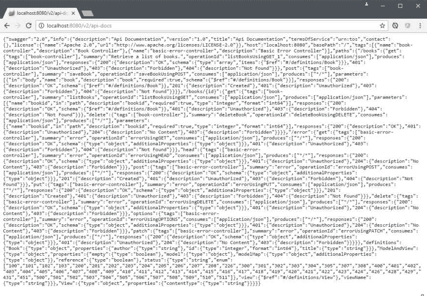
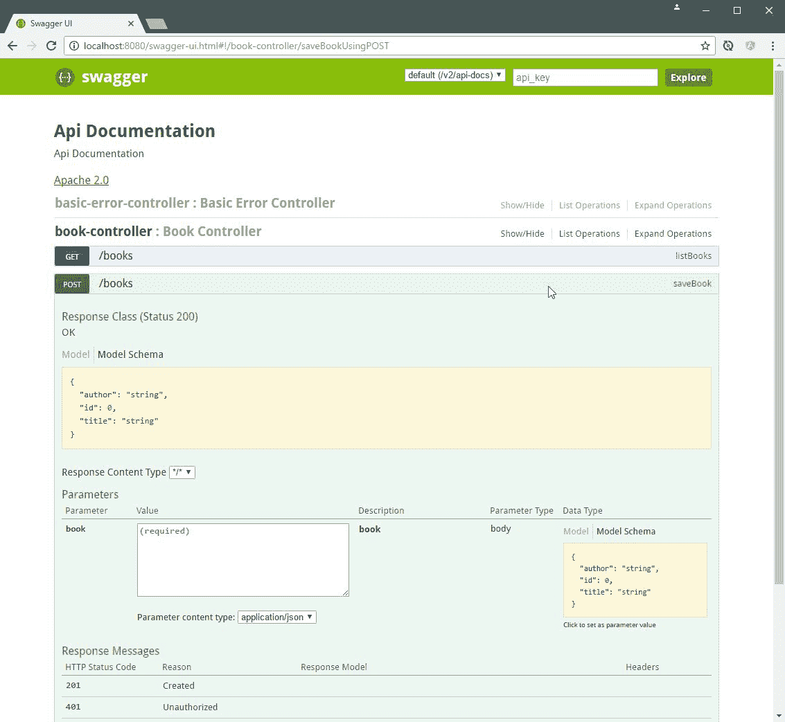
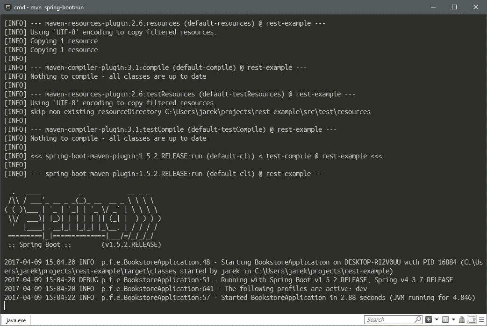
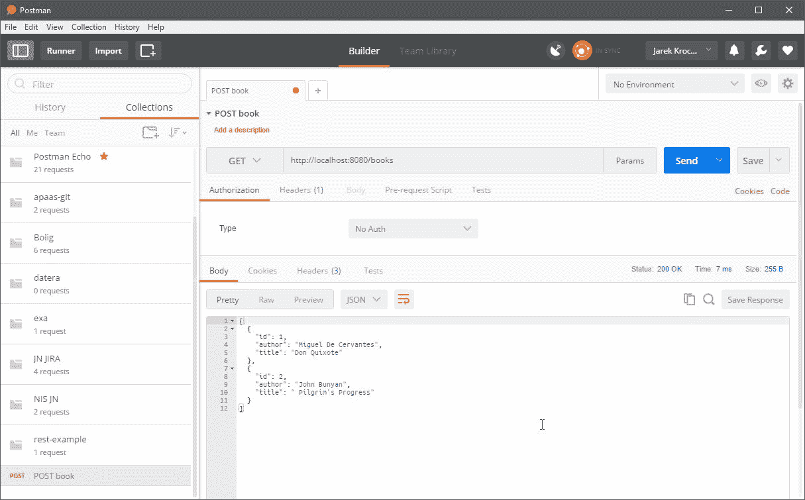
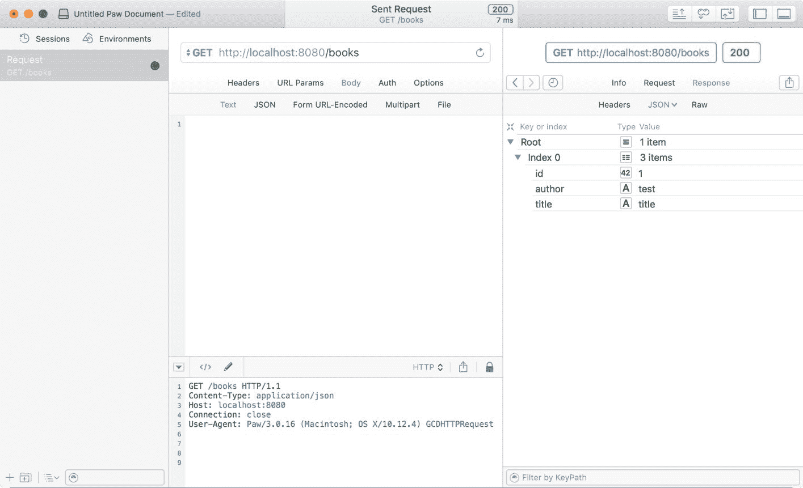
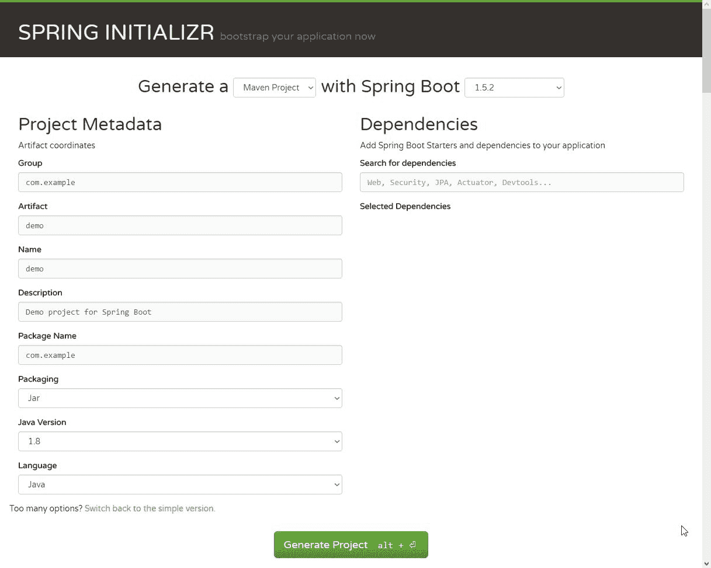
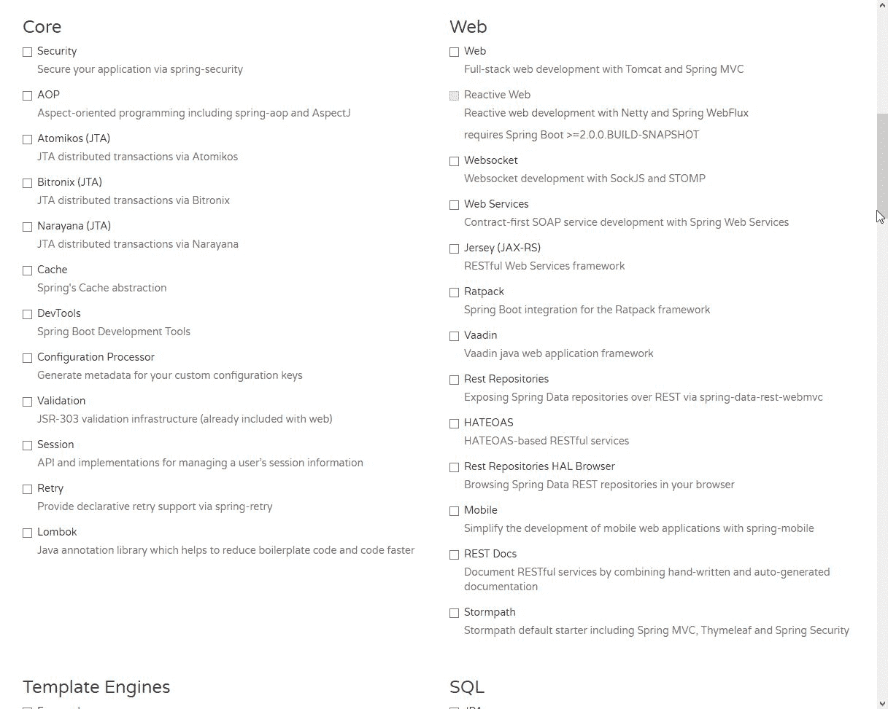

# 创建 Java 微服务

在第三章中，我们已经看到了微服务架构背后的许多理论，*使用微服务*。现在是实践的时候；我们将要实现我们自己的微服务。这将是一个简单的 REST 服务，接受`GET`和`POST`等`HTTP`方法来检索和更新实体。在 Java 中开发微服务时有几种选择。在本章中，我们将概述两种主要方法，可能最流行的将是 JEE7 和 Spring Boot。我们将简要介绍如何使用 JEE JAX-RS 编写微服务。我们还将创建一个在 Spring Boot 上运行的微服务。实际上，在第五章中，*使用 Java 应用程序创建图像*，我们将从 Docker 容器中运行我们的 Spring Boot 微服务。正如我们在第三章中所说，*使用微服务*，微服务通常使用 REST 与外部世界通信。我们的 REST 微服务将尽可能简单；我们只需要有一些东西可以使用 Docker 和 Kubernetes 部署。我们不会专注于高级微服务功能，比如身份验证、安全、过滤器等等，因为这超出了本书的范围。我们的示例的目的是让您了解如何开发 REST 服务，然后使用 Docker 和 Kubernetes 部署它们。本章将涵盖以下主题：

+   REST 简介

+   使用 Java EE7 注解在 Java 中创建 REST 服务

+   使用 Spring Boot 创建 REST 服务

+   运行服务，然后使用不同的 HTTP 客户端调用它

在本章末尾，我们将熟悉一些有用的工具-我们将使用一些代码生成工具，比如 Spring Initialzr，快速启动一个 Spring Boot 服务项目。在我们开始编写自己的微服务之前，让我们简要解释一下 REST 是什么。

# REST 简介

REST 首字母缩略词代表表述性状态转移。这是一种基于网络的软件的架构风格和设计。它描述了一个系统如何与另一个系统通信状态。这非常适合微服务世界。正如您从第三章中所记得的，*使用微服务*，基于微服务架构的软件应用程序是一堆分离的、独立的服务相互通信。

在我们继续之前，有一些 REST 中的概念我们需要了解：

+   `resource`：这是 REST 架构中的主要概念。任何信息都可以是一个资源。银行账户、人员、图像、书籍。资源的表示必须是**无状态**的。

+   `representation`：资源可以被表示的特定方式。例如，银行账户资源可以使用 JSON、XML 或 HTML 来表示。不同的客户端可能请求资源的不同表示，一个可以接受 JSON，而其他人可能期望 XML。

+   `server`：服务提供者。它公开可以被客户端消费的服务。

+   `client`：服务消费者。这可以是另一个微服务、应用程序，或者只是运行 Angular 应用程序的用户的网络浏览器

正如定义所说，REST 被用来在网络上传输这些资源表示。表示本身是通过某种媒体类型创建的。媒体类型可以不同。一些媒体类型的例子包括 JSON、XML 或 RDF。JSON 媒体类型被广泛接受，可能是最常用的。在我们的例子中，我们也将使用 JSON 来与我们的服务进行通信。当然，REST 不是微服务通信的唯一选择；还有其他选择，比如谷歌的非常好的 gRPC，它带来了很多优势，比如 HTTP/2 和 protobuff。在 REST 架构中，资源由组件来操作。事实上，这些组件就是我们的微服务。组件通过标准统一接口请求和操作资源。REST 不绑定到任何特定的协议；然而，REST 调用最常使用最流行的 `HTTP` 或 `HTTPS` 协议。在 `HTTP` 的情况下，这个统一接口由标准的 HTTP 方法组成，比如 `GET`、`PUT`、`POST` 和 `DELETE`。

REST 不绑定到任何特定的协议。

在我们开始实现响应 `HTTP` 调用的服务之前，了解一下我们将要使用的 HTTP 方法是值得的。我们现在将更加关注它们。

# HTTP 方法

基于 REST 的架构使用标准的 HTTP 方法：`PUT`、`GET`、`POST` 和 `DELETE`。以下列表解释了这些操作：

+   `GET` 提供对资源的读取访问。调用 `GET` 不应该产生任何副作用。这意味着 `GET` 操作是幂等的。资源永远不会通过 `GET` 请求而被改变；例如，请求没有副作用。这意味着它是幂等的。

+   `PUT`创建一个新资源。与`GET`类似，它也应该是幂等的。

+   `DELETE`移除资源。当重复调用时，`DELETE`操作不应产生不同的结果。

+   `POST`将更新现有资源或创建新资源。

RESTful web 服务就是基于`REST`资源概念和使用 HTTP 方法的 web 服务。它应该定义暴露方法的基本 URI，支持的 MIME 类型，比如 XML、文本或 JSON，以及服务处理的一组操作（`POST`，`GET`，`PUT`和`DELETE`）。根据 RESTful 原则，HTTP 对 REST 来说是简单且非常自然的。这些原则是一组约束，确保客户端（比如服务消费者、其他服务或浏览器）可以以灵活的方式与服务器通信。现在让我们来看看它们。

在 REST 原则的客户端-服务器通信中，所有以 RESTful 风格构建的应用程序原则上也必须是客户端-服务器的。应该有一个服务器（服务提供者）和一个客户端（服务消费者）。这样可以实现松散耦合和服务器和客户端的独立演进。这非常符合微服务的概念。正如你在第三章中所记得的，*使用微服务*，它们必须是独立的：

+   **无状态**：每个客户端对服务器的请求都要求其状态完全表示。服务器必须能够完全理解客户端的请求，而不使用任何服务器上下文或服务器会话状态。换句话说，所有状态必须在客户端上管理。每个 REST 服务都应该是**无状态**的。后续请求不应该依赖于临时存储在先前请求中的某些数据。消息应该是自描述的。

+   **可缓存**：响应数据可以标记为可缓存或不可缓存。任何标记为可缓存的数据都可以在同一后续请求的响应中被重用。每个响应都应该指示它是否可缓存。

+   **统一接口**：所有组件必须通过单一统一的接口进行交互。因为所有组件的交互都通过这个接口进行，与不同服务的交互非常简单。

+   分层系统：服务的消费者不应假定与服务提供者直接连接。换句话说，客户端在任何时候都无法确定自己是连接到最终服务器还是中间服务器。中间层有助于强制执行安全策略，并通过启用负载平衡来提高系统的可伸缩性。由于请求可以被缓存，客户端可能会从中间层获取缓存的响应。

+   资源通过表示的操作：一个资源可以有多个表示。应该可以通过任何这些表示的消息来修改资源。

+   超媒体作为应用状态的引擎（HATEOAS）：RESTful 应用的消费者应该只知道一个固定的服务 URL。所有后续资源应该可以从资源表示中包含的链接中发现。

前述概念代表了 REST 的定义特征，并将 REST 架构与其他架构（如 Web 服务）区分开来。值得注意的是，REST 服务是 Web 服务，但 Web 服务不一定是 REST 服务。REST 微服务应该代表实体的状态。例如，让我们的实体是一本书（连同其属性，如 ID、标题和作者），表示为 XML、JSON 或纯文本。关于 REST 最基本的思考方式是将服务的 URL 格式化。例如，有了我们的`book`资源，我们可以想象在服务中定义以下操作：

+   `/books`将允许访问所有书籍

+   `/books/:id`将是查看单个书籍的操作，根据其唯一 ID 检索

+   向`/books`发送`POST`请求将是您实际上创建新书并将其存储在数据库中的方式

+   向`/books/:id`发送`PUT`请求将是您如何更新给定书籍的属性，再次根据其唯一 ID 进行标识

+   向`/books/:id`发送`DELETE`请求将是您如何删除特定书籍，再次根据其唯一 ID 进行标识

值得一试的是，REST 不是 HTTP。它通常使用 HTTP，因为在其最一般的形式中，REST 是关于将动词的概念映射到任意的名词集合，并且与 HTTP 方法很好地契合。HTTP 包含一组有用的通用动词（`GET`，`POST`，`PUT`，`PATCH`等）。在 REST 中，我们不传输实际对象，而是以特定形式的表示形式传输，例如 XML、文本或 JSON。作为一种架构风格，REST 只是一个概念。它的实现方式取决于你。Java 非常适合开发 REST 服务。让我们看看我们该如何做。

# Java 中的 REST

在 Java 中开发 REST 服务时，我们至少有几种框架可以选择。最流行的将是纯 JEE7 与 JAX-RS 或 Spring 框架与其 Spring Boot。您可以选择其中任何一个，或者将它们混合在一起。现在让我们更详细地看看这两个，从 JAX-RS 开始。

# Java EE7 - 使用 Jersey 的 JAX-RS

JAX-RS 诞生于**Java 规范请求**（**JSR**）311。正如官方定义所说，JAX-RS 是用于 RESTful web 服务的 Java API。它是一个规范，提供支持，根据 REST 架构模式创建 web 服务。JAX-RS 使用 Java 注解，引入自 Java SE 5，以简化 web 服务客户端和端点的开发和部署。从 1.1 版本开始，JAX-RS 是 Java EE 的官方一部分。作为 Java EE 的官方一部分的一个显著特点是，无需配置即可开始使用 JAX-RS。

Java EE 7 与 JAX-RS 2.0 带来了几个有用的功能，进一步简化了微服务的开发。JAX-RS 2.0 最重要的新功能之一是支持遵循 REST 的 HATEOAS 原则的超媒体。`Jersey`，来自 Oracle 的库，可能是最广为人知的实现了这一规范的库。

Jersey 是 JSR 311 规范的参考实现。

Jersey 实现提供了一个库，用于在 Java servlet 容器中实现 RESTful web 服务。在服务器端，Jersey 提供了一个 servlet 实现，它扫描预定义的类来识别 RESTful 资源。Jersey 使编写 RESTful 服务变得更加容易。它抽象了许多低级别的编码，否则你将需要自己完成。使用 Jersey，你可以以声明性的方式来完成。在`web.xml`文件中注册的 servlet 会分析传入的`HTTP`请求，并选择正确的类和方法来响应此请求。它通过查看类和方法级别的注解来找到要执行的正确方法。注解类可以存在于不同的包中，但是你可以通过`web.xml`指示 Jersey servlet 扫描特定的包以查找注解类。

JAX-RS 支持通过**Java XML 绑定架构**（**JAXB**）创建 XML 和 JSON。Jersey 实现还提供了一个`client`库，用于与 RESTful web 服务进行通信。

正如我们之前所说，我们使用 Java 注解开发 JAX-RS 应用程序。这很容易且愉快。现在让我们来描述这些注解。

# JAX-RS 注解

JAX-RS 中最重要的注解列在下表中：

| - **注解** | **含义** |
| --- | --- |
| - `@PATH` | 设置基本 URL + /your_path 的路径。基本 URL 基于你的应用程序名称、servlet 和`web.xml`配置文件中的 URL 模式。 |
| - `@POST` | 表示以下方法将响应`HTTP POST`请求。 |
| - `@GET` | 表示以下方法将响应`HTTP GET`请求。 |
| - `@PUT` | 表示以下方法将响应`HTTP PUT`请求。 |
| - `@DELETE` | 表示以下方法将响应`HTTP DELETE`请求。 |
| - `@Produces` | 定义了一个带有`@GET`注解的方法要传递的 MIME 类型。例如可以是`"text/plain"`，`"application/xml"`或`"application/json"`。 |
| - `@Consumes` | 定义了这个方法要消耗的 MIME 类型。 |
| - `@PathParam` | 用于从 URL 中提取（注入）值到方法参数中。这样，你可以将资源的 ID 注入到方法中，以获取正确的对象。 |
| - `@QueryParam` | 用于提取（注入）请求中携带的 URI 查询参数。**统一资源标识符**（**URI**）是用于在互联网上标识名称或资源的一串字符。 |
| `@DefaultValue` | 指定默认值。对于可选参数很有用。 |
| `@CookieParam` | 允许您将客户端请求发送的 cookie 注入到 JAX-RS 资源方法中的注释。 |
| `@Provider` | `@Provider`注释用于 JAX-RS 运行时感兴趣的任何内容，例如`MessageBodyReader`和`MessageBodyWriter`。对于`HTTP`请求，`MessageBodyReader`用于将`HTTP`请求实体主体映射到方法参数。在响应端，返回值通过使用`MessageBodyWriter`映射到`HTTP`响应实体主体。如果应用程序需要提供额外的元数据，例如`HTTP`标头或不同的状态代码，方法可以返回一个包装实体的响应，并且可以使用`Response.ResponseBuilder`构建。 |
| `@ApplicationPath` | `@ApplicationPath`注释用于定义应用程序的 URL 映射。`@ApplicationPath`指定的路径是`resource`类中`@Path`注释指定的所有资源 URI 的基本 URI。您只能将`@ApplicationPath`应用于`javax.ws.rs.core.Application`的子类。 |

注释名称一开始可能不够清晰或不够自解释。让我们看一下示例 REST 端点实现，它将变得更加清晰。应用程序本身带有`@ApplicationPath`注释。默认情况下，在启动符合 JEE 的服务器时，JAX-RS 将扫描 Java 应用程序存档中的所有资源，以查找公开的端点。我们可以重写`getClasses()`方法，手动向 JAX-RS 运行时注册应用程序中的`resource`类。您可以在以下示例中看到它：

```
package pl.finsys.jaxrs_example 
@ApplicationPath("/myApp") 
public class MyApplication extends Application { 
   @Override 
   public Set<Class<?>> getClasses() { 
      final Set<Class<?>> classes = new HashSet<>(); 
      classes.add(MyBeansExposure.class); 
      return classes; 
   } 
} 
```

在前面的示例中，我们只是注册了一个 REST 应用程序，给它了`/myApp`基本 URI 路径。只有一个`REST`方法处理程序（端点），即`MyBeansExposure`类，我们在 REST 应用程序中注册它。在单独的 Java 类中实现的简化 REST 端点可以看起来与此相同：

```
package pl.finsys.jaxrs_example 
import javax.annotation.PostConstruct; 
import javax.enterprise.context.ApplicationScoped; 
import javax.ws.rs.DELETE; 
import javax.ws.rs.GET; 
import javax.ws.rs.POST; 
import javax.ws.rs.Path; 
import javax.ws.rs.PathParam; 
import javax.ws.rs.container.ResourceContext; 
import javax.ws.rs.core.Context; 
import javax.ws.rs.core.Response; 

@ApplicationScoped 
@Path("beans") 
public class MyBeansExposure { 
    @Context ResourceContext rc; 
    private Map<String, Bean> myBeans; 

    @GET 
    @Produces("application/json") 
    public Collection<Bean> allBeans() { 
        return Response.status(200).entity(myBeans.values()).build(); 
    } 

    @GET 
    @Produces("application/json") 
    @Path("{id}") 
    public Bean singleBean(@PathParam("id") String id) { 
        return Response.status(200).entity(myBeans.get(id)).build(); 
    } 

    @POST 
    @Consumes("application/json") 
    public Response add(Bean bean) { 
        if (bean != null) { 
            myBeans.put(bean.getName(), bean); 
        } 
        final URI id = URI.create(bean.getName()); 
        return Response.created(id).build(); 
    } 

    @DELETE 
    @Path("{id}") 
    public void remove(@PathParam("id") String id) { 
        myBeans.remove(id); 
    } 

} 
```

正如你在上一个例子中所看到的，我们有类级别的`@Path`注解。每个标记有`@GET`，`@PUT`，`@DELETE`或`@POST`注解的方法都将响应于以基本`@Path`开头的 URI 的调用。此外，我们可以在方法级别上使用`@Path`注解；它将扩展特定方法响应的 URI 路径。在我们的例子中，使用 URI 路径`myApp/beans`执行的`HTTP GET`将调用`allBeans()`方法，以 JSON 格式返回豆子集合。使用`myApp/beans/12` URI 路径执行的`GET`方法将调用`singleBean()`方法，并且由于`@PathParam`注解，`{id}`参数将被传递给方法。在`myApp|beans|12` URI 上调用`HTTP DELETE`方法将执行`remove()`方法，参数值为`12`。为了给你几乎无限的灵活性，`@Path`注解支持正则表达式。考虑以下例子：

```
package pl.finsys.jaxrs_example 
import javax.ws.rs.GET; 
import javax.ws.rs.Path; 
import javax.ws.rs.PathParam; 
import javax.ws.rs.core.Response; 

@Stateless 
@Path("/books") 
public class BookResource { 

   @GET 
   @Path("{title : [a-zA-Z][a-zA-Z_0-9]}") 
    public Response getBookByTitle(@PathParam("title") String title) { 
      return Response.status(200).entity("getBookByTitle is called, title : " + title).build(); 
   } 

   @GET 
   @Path("{isbn : \\d+}") 
   public Response getBookByISBN(@PathParam("isbn") String isbn) { 
      return Response.status(200).entity("getBookByISBN is called, isbn : " + isbn).build(); 
   } 
} 
```

在上一个例子中，我们有两个`@GET`映射，每个映射都有相同的`/books/`路径映射。第一个映射，带有`/{title : [a-zA-Z][a-zA-Z_0-9]}`参数，只会对字母和数字做出反应。第二个映射，带有`/{isbn : \\d+}`参数，只有在调用 URI 时提供数字时才会执行。正如你所看到的，我们映射了两个相同的路径，但每个路径都会对不同类型的传入路径参数做出反应。

除了使用`@PathParam`，我们还可以使用`@QueryParams`来使用请求参数提供参数。看看下面的例子：

```
package pl.finsys.jaxrs_example 
import java.util.List; 
import javax.ws.rs.GET; 
import javax.ws.rs.Path; 
import javax.ws.rs.core.Context; 
import javax.ws.rs.core.Response; 
import javax.ws.rs.core.UriInfo; 

@Stateless 
@Path("/users") 
public class UserResource { 
   @EJB private UserService userService; 
   @GET 
   @Path("/query") 
   @Produces("application/json") 
   public Response getUsers( 
      @QueryParam("from") int from, 
      @QueryParam("to") int to, 
      @QueryParam("orderBy") List<String> orderBy)) { 
      List<User> users = userService.getUsers(from, to, orderBy); 
      return Response.status(200).entity(users).build(); 
   } 
} 
```

在上一个例子中，当在`/users/query?from=1&to=100&orderBy=name`上调用`HTTP GET`时，JAX-RS 将把 URI 参数传递给`getUsers()`方法参数，并调用注入的`userService`来获取数据（例如，从数据库中）。

要打包 JAX-RS 应用程序，我们当然需要一个 Maven `pom.xml`文件。在其最简单的形式中，它可以看起来与以下内容相同：

```
<?xml version="1.0" encoding="UTF-8"?> 
<project  

         xsi:schemaLocation="http://maven.apache.org/POM/4.0.0 http://maven.apache.org/xsd/maven-4.0.0.xsd"> 
    <modelVersion>4.0.0</modelVersion> 

    <groupId>pl.finsys</groupId> 
    <artifactId>jee7-rest</artifactId> 
    <packaging>war</packaging> 
    <version>1.0-SNAPSHOT</version> 

    <dependencies> 
        <dependency> 
            <groupId>javax</groupId> 
            <artifactId>javaee-api</artifactId> 
            <version>7.0</version> 
            <scope>provided</scope> 
        </dependency> 
    </dependencies> 
    <build> 
        <finalName>jee7-rest</finalName> 
    </build> 

    <properties> 
        <maven.compiler.source>1.8</maven.compiler.source> 
        <maven.compiler.target>1.8</maven.compiler.target> 
        <failOnMissingWebXml>false</failOnMissingWebXml> 
    </properties> 
</project> 

```

创建 JEE7 REST 服务非常简单，不是吗？通过构建项目并将其部署到符合 JEE 标准的应用服务器，我们有一些端点准备好等待通过`HTTP`调用。但还有一种更简单和更快的方法。在微服务时代，我们希望以最小的开销更快地创建单独的组件。这就是 Spring Boot 的用武之地。现在让我们来看看它。

# Spring Boot

Spring 本身是一个非常受欢迎的基于 Java 的框架，用于构建 Web 和企业应用程序。它不仅仅是关注依赖注入的 Spring Core。Spring 框架提供了许多功能，可以让开发人员的生活更轻松，并允许您更快地交付所需的功能。列表很长；这里只是一些例子：

+   Spring data：简化了与关系型和 NoSQL 数据存储的数据访问

+   Spring batch：提供了一个强大的批处理框架

+   Spring security：提供了许多保护应用程序的方式

+   Spring social：支持与 Twitter、Facebook、GitHub 等社交网络站点集成

+   Spring integration：实现了企业集成模式，以便使用轻量级消息传递和声明性适配器与其他企业应用程序集成

但是为什么 Spring 变得如此受欢迎？有几个原因：

+   它采用依赖注入方法，鼓励编写可测试、松耦合的代码

+   很容易包含数据库事务管理功能

+   与其他流行的 Java 框架集成，如 JPA/Hibernate 等

+   它包括一个用于更快地构建 Web 应用程序的最先进的 MVC 框架，将视图与业务逻辑分离。

在 Spring 框架中配置 bean 可以通过多种方式进行，如 XML 定义文件、Java 注解和代码配置。这可能是一个繁琐的过程。此外，我们经常为不同的应用程序做大量样板配置。Spring Boot 应运而生，以解决配置的复杂性。我们可以将 Spring Boot 用于自己的目的，并开发可以直接运行的小型独立服务。它可以是一个单独的可运行的 fat JAR 文件，其中包含运行应用程序所需的所有 Java 依赖项。无需应用服务器或复杂的部署描述符配置。实际上，在幕后，Spring Boot 将为您启动嵌入式服务器。当然，您并不一定要使用嵌入式应用服务器。您始终可以构建一个 WAR 文件，将其部署到自己的 Tomcat 或 Wildfly 上，例如。值得知道的是，即使在运行 Spring Boot 应用程序时大多数事情都会自动发生，它也不是一个代码生成框架。

所有这些是否让你想起了 Docker 容器的简单性和可移植性？当然，但是在应用程序级别。正如我们在第三章 *使用微服务*中讨论的那样，我们正在向着具有更小、独立部署的微服务的架构迈进。这意味着我们需要能够快速上手并运行新组件。使用 Spring Boot 时，我们可以获得很多开箱即用的功能。这些功能以 Maven 构件的形式提供，你只需在 Maven 的`pom.xml`文件中包含它们。

下表显示了 Spring Boot 提供的一些重要起始项目，我们将使用：

| **项目** | **描述** |
| --- | --- |
| `spring-boot-starter` | Spring Boot 应用程序的基本起始项目。提供自动配置和日志记录的支持。 |
| `spring-boot-starter-web` | 用于构建基于 Spring MVC 的 Web 应用程序或 RESTful 应用程序的起始项目。这使用 Tomcat 作为默认的嵌入式 Servlet 容器。 |
| `spring-boot-starter-data-jpa` | 提供对 Spring Data JPA 的支持。默认实现是 Hibernate。 |
| `spring-boot-starter-validation` | 提供对 Java Bean 验证 API 的支持。默认实现是 Hibernate Validator。 |
| `spring-boot-starter-test` | 提供对各种单元测试框架的支持，如 JUnit、Mockito 和 Hamcrest matchers |

还有很多其他项目，可能对你有用。我们不打算使用它们，但让我们看看还有什么其他选择：

| `spring-boot-starter-web-services` | 用于开发基于 XML 的 Web 服务的起始项目 |
| --- | --- |
| `spring-boot-starter-activemq` | 支持使用 ActiveMQ 上的 JMS 进行基于消息的通信 |
| `spring-boot-starter-integration` | 支持 Spring Integration，这是一个提供企业集成模式实现的框架 |
| `spring-boot-starter-jdbc` | 提供对 Spring JDBC 的支持。默认情况下配置了 Tomcat JDBC 连接池。 |
| `spring-boot-starter-hateoas` | HATEOAS 代表超媒体作为应用状态的引擎。使用`HATEOAS`的 RESTful 服务返回与当前上下文相关的附加资源的链接，以及数据。 |
| `spring-boot-starter-jersey` | JAX-RS 是开发 REST API 的 Java EE 标准。Jersey 是默认实现。这个起始项目提供了构建基于 JAX-RS 的 REST API 的支持。 |
| `spring-boot-starter-websocket` | `HTTP`是无状态的。Web 套接字允许在服务器和浏览器之间保持连接。这个启动器项目提供了对 Spring WebSockets 的支持。 |
| `spring-boot-starter-aop` | 提供面向切面编程的支持。还提供了对高级面向切面编程的 AspectJ 的支持。 |
| `spring-boot-starter-amqp` | 默认为`RabbitMQ`，这个启动器项目提供了使用 AMQP 进行消息传递的支持。 |
| `spring-boot-starter-security` | 这个启动器项目启用了 Spring Security 的自动配置。 |
| `spring-boot-starter-batch` | 提供使用 Spring Batch 开发批处理应用程序的支持。 |
| `spring-boot-starter-cache` | 使用 Spring Framework 基本支持缓存。 |
| `spring-boot-starter-data-rest` | 支持使用 Spring Data REST 公开 REST 服务。 |

让我们使用一些这些好东西来编写我们自己的 Spring Boot 微服务。

# 编写 Spring Boot 微服务

我们知道我们有一些启动器可用，所以让我们利用它们来节省一些时间。我们要创建的服务将是用于从数据库中存储和检索实体的简单 REST 微服务：在我们的案例中是书籍。我们不打算实现身份验证和安全功能，只是尽可能地使它简洁和简单。书籍将存储在内存关系型 H2 数据库中。我们将使用 Maven 构建和运行我们的书店，所以让我们从`pom.xml`构建文件开始。

# Maven 构建文件

正如你所看到的，我们自己服务的父项目是 spring-boot-starter-parent。Spring 这是为基于 Spring Boot 的应用程序提供依赖和插件管理的父项目。这为我们提供了很多功能。我们还包括两个启动器：

+   `spring-boot-starter-web`：这是因为我们将创建我们的请求映射（类似于使用 JEE7 JAX-RS 之前使用`@Path`注释的`@GET`或`@POST`映射）

+   `spring-boot-starter-data-jpa`：因为我们将把我们的书保存在内存中的 H2 数据库中

启动器是为不同目的定制的简化的依赖描述符。例如，`spring-boot-starter-web`是用于使用 Spring MVC 构建 Web 和 RESTful 应用程序的启动器。它使用 Tomcat 作为默认的嵌入式容器。我们还包括了 Spring Boot Maven 插件，它允许我们在原地运行应用程序，而无需构建 JAR 或 WAR，或准备 JAR 或 WAR 文件以供将来部署。我们完整的`pom.xml`应该与这个一样：

```
<?xml version="1.0" encoding="UTF-8"?> 
<project   
         xsi:schemaLocation="http://maven.apache.org/POM/4.0.0 http://maven.apache.org/xsd/maven-4.0.0.xsd"> 
    <modelVersion>4.0.0</modelVersion> 

    <groupId>pl.finsys</groupId> 
    <artifactId>rest-example</artifactId> 
    <version>0.1.0</version> 

    <parent> 
        <groupId>org.springframework.boot</groupId> 
        <artifactId>spring-boot-starter-

 parent</artifactId> 
        <version>1.5.2.RELEASE</version> 
    </parent> 

    <dependencies> 
        <dependency> 
            <groupId>org.springframework.boot</groupId> 
            <artifactId>spring-boot-starter-

 web</artifactId> 
        </dependency> 
        <dependency> 
            <groupId>org.springframework.boot</groupId> 
            <artifactId>spring-boot-starter-data-

 jpa</artifactId> 
        </dependency> 
        <dependency> 
            <groupId>org.hibernate</groupId> 
            <artifactId>hibernate-validator</artifactId> 
        </dependency> 
        <dependency> 
            <groupId>org.hsqldb</groupId> 
            <artifactId>hsqldb</artifactId> 
            <scope>runtime</scope> 
        </dependency> 

        <!--test dependencies--> 
        <dependency> 
            <groupId>org.springframework.boot</groupId> 
            <artifactId>spring-boot-starter-test</artifactId> 
            <scope>test</scope> 
        </dependency> 
        <dependency> 
            <groupId>com.jayway.jsonpath</groupId> 
            <artifactId>json-path</artifactId> 
            <scope>test</scope> 
        </dependency> 
    </dependencies> 

    <properties> 
        <java.version>1.8</java.version> 
    </properties> 

    <build> 
        <plugins> 
            <plugin> 
                <groupId>org.springframework.boot</groupId> 
                <artifactId>spring-boot-maven-plugin</artifactId> 
            </plugin> 
        </plugins> 
    </build> 

    <repositories> 
        <repository> 
            <id>spring-releases</id> 
            <url>https://repo.spring.io/libs-release</url> 
        </repository> 
    </repositories> 
    <pluginRepositories> 
        <pluginRepository> 
            <id>spring-releases</id> 
            <url>https://repo.spring.io/libs-release</url> 
        </pluginRepository> 
    </pluginRepositories> 
</project> 

```

首先，在`pom.xml`文件中，我们定义了父 Maven artifact。由于我们的应用是 Spring Boot 应用程序，我们从`spring-boot-starter-parent` artifact 继承我们的`pom.xml`。这为我们提供了所有 Spring Boot 的好处，例如启动机制，依赖注入等。通过将`spring-boot-starter-data-jpa`作为依赖项添加，我们将能够使用所有与数据库相关的功能，例如 JDBC 事务管理，用于实体类的 JPA 注解等。有了准备好的`pom.xml`，让我们继续定义微服务的入口点。

# 应用程序入口点

我们的应用程序入口点将被命名为`BookStoreApplication`，并且将是`BookstoreApplication.java`：

```
package pl.finsys.example; 

import org.springframework.boot.SpringApplication; 
import org.springframework.boot.autoconfigure.SpringBootApplication; 

@SpringBootApplication 
public class BookstoreApplication { 

    public static void main(final String[] args) { 
        SpringApplication.run(BookstoreApplication.class, args); 
    } 
} 
```

就是这样。整个代码只有九行，不包括空行。它不能再简洁了。`@SpringBootApplication`是一种快捷注解，非常方便。它替代了以下所有注解：

+   `@Configuration`：标有此注解的类成为应用程序上下文的 bean 定义源

+   `@EnableAutoConfiguration`：此注解使 Spring Boot 根据类路径设置、其他 bean 和各种属性设置添加 bean

+   `@EnableWebMvc`：通常你会为 Spring MVC 应用程序添加`这个`，但是当 Spring Boot 在类路径上看到`spring-webmvc`时，它会自动添加它。这标志着应用程序是一个 Web 应用程序，从而激活关键行为，如设置`DispatcherServlet`。

+   `@ComponentScan`：告诉 Spring 查找其他组件、配置和服务，使其能够找到控制器

到目前为止一切顺利。我们需要一些模型来为我们的服务。我们将在数据库中保存一些实体；这就是`spring-boot-starter-data-jpa`启动器派上用场的地方。我们将能够使用 JPA（使用 Hibernate 实现）和`javax.transaction-api`，甚至无需明确声明它。我们需要一个书店的实体模型。

# 领域模型和仓库

我们服务中的领域模型将是一个`Book`类，在`Book.java`文件中定义：

```
package pl.finsys.example.domain; 

import javax.persistence.Column; 
import javax.persistence.Entity; 
import javax.persistence.Id; 
import javax.validation.constraints.NotNull; 
import javax.validation.constraints.Size; 

@Entity 
public class Book { 

    @Id 
    @NotNull 
    @Column(name = "id", nullable = false, updatable = false) 
    private Long id; 

    @NotNull 
    @Size(max = 64) 
    @Column(name = "author", nullable = false) 
    private String author; 

    @NotNull 
    @Size(max = 64) 
    @Column(name = "title", nullable = false) 
    private String title; 

    public Book() { 
    } 

    public Book(final Long id, final String author, final String title) { 
        this.id = id; 
        this.title = title; 
        this.author = author; 
    } 

    public Long getId() { 
        return id; 
    } 

    public String getAuthor() { 
        return author; 
    } 

    public String getTitle() { 
        return title; 
    } 

    public void setTitle(String title) { 
        this.title = title; 
    } 

    @Override 
    public String toString() { 
        return "Book{" + 
                "id=" + id + 
                ", author='" + author + '\'' + 
                ", title='" + title + '\'' + 
                '}'; 
    } 
} 
```

正如您在前面的清单中所看到的，`Book`类是一个简单的 POJO，带有一些注解、属性和 getter 和 setter。`@Entity`注解来自`javax.persistence`包，并将 POJO 标记为数据库实体，以便 JPA 可以从 H2 数据库中存储或检索它。`@Column`注解指定了数据库列的名称，对应的书籍属性将被存储在其中。`@NotNull`和`@Size`注解将确保我们的实体在进入数据库之前填入了适当的值。

我们已经定义了我们的实体；现在是时候有一个机制来读取和存储它在数据库中。我们将使用 Spring 的`JpaRepository`来实现这个目的。我们的仓库的名称将在`BookRepository.java`文件中为`BookRepository`：

```
package pl.finsys.example.repository; 

import pl.finsys.example.domain.Book; 
import org.springframework.data.jpa.repository.JpaRepository; 

public interface BookRepository extends JpaRepository<Book, Long> { 
} 
```

Spring Data JPA 提供了一个仓库编程模型，它从每个受管领域对象的接口开始。定义这个接口有两个目的。首先，通过扩展`JPARepository`接口，我们可以在我们的类型中获得一堆通用的 CRUD 方法，允许保存我们的实体，删除它们等等。例如，以下方法是可用的（声明在我们正在扩展的`JPARepository`接口中）：

+   `List<T> findAll();`

+   `List<T> findAll(Sort sort);`

+   `List<T> findAll(Iterable<ID> ids);`

+   `<S extends T> List<S> save(Iterable<S> entities);`

+   `T getOne(ID id);`

+   `<S extends T> S save(S entity);`

+   `<S extends T> Iterable<S> save(Iterable<S> entities);`

+   `T findOne(ID id);`

+   `boolean exists(ID id);`

+   `Iterable<T> findAll();`

+   `Iterable<T> findAll(Iterable<ID> ids);`

+   `long count();`

+   `void delete(ID id);`

+   `void delete(T entity);`

+   `void delete(Iterable<? extends T> entities);`

+   `void deleteAll();`

没有 SQL 编码，没有 JPA-QL 查询，什么都没有。只需扩展 Spring 的`JPARepository`接口，所有这些方法都可以随时使用。当然，我们不局限于这些。我们可以在我们的接口中声明自己的方法，比如`findByTitle(String title)`。它将在运行时被 Spring 捕获，并通过标题找到一本书。我强烈建议阅读 Spring Data 项目文档并进一步实验；它非常方便使用。直接从控制器使用`entity`存储库通常不是很好的做法，所以现在是时候有一个书籍服务了。它将是一个`BookService`接口，在`BookService.java`中定义：

```
package pl.finsys.example.service; 

import pl.finsys.example.domain.Book; 
import javax.validation.Valid; 
import javax.validation.constraints.NotNull; 
import java.util.List; 

public interface BookService { 
    Book saveBook(@NotNull @Valid final Book book); 
    List<Book> getList(); 
    Book getBook(Long bookId); 
    void deleteBook(final Long bookId); 
} 
```

实现，在`BookServiceImpl.java`中可以看起来与以下内容相同：

```
package pl.finsys.example.service; 

import org.springframework.beans.factory.annotation.Autowired; 
import pl.finsys.example.domain.Book; 
import pl.finsys.example.repository.BookRepository; 
import pl.finsys.example.service.exception.BookAlreadyExistsException; 
import org.slf4j.Logger; 
import org.slf4j.LoggerFactory; 
import org.springframework.stereotype.Service; 
import org.springframework.transaction.annotation.Transactional; 
import org.springframework.validation.annotation.Validated; 

import javax.validation.Valid; 
import javax.validation.constraints.NotNull; 
import java.util.List; 

@Service 
@Validated 
public class BookServiceImpl implements BookService { 

    private static final Logger LOGGER = LoggerFactory.getLogger(BookServiceImpl.class); 
    private final BookRepository repository; 

    @Autowired 
    public BookServiceImpl(final BookRepository repository) { 
        this.repository = repository; 
    } 

    @Override 
    @Transactional 
    public Book saveBook(@NotNull @Valid final Book book) { 
        LOGGER.debug("Creating {}", book); 
        Book existing = repository.findOne(book.getId()); 
        if (existing != null) { 
            throw new BookAlreadyExistsException( 
                    String.format("There already exists a book with id=%s", book.getId())); 
        } 
        return repository.save(book); 
    } 

    @Override 
    @Transactional(readOnly = true) 
    public List<Book> getList() { 
        LOGGER.debug("Retrieving the list of all users"); 
        return repository.findAll(); 
    } 

    @Override 
    public Book getBook(Long bookId) { 
        return repository.findOne(bookId); 
    } 

    @Override 
    @Transactional 
    public void deleteBook(final Long bookId) { 
        LOGGER.debug("deleting {}", bookId); 
        repository.delete(bookId); 
    } 

} 
```

前面的清单介绍了`BookService`的实现。请注意，我们已经在构造函数中注入了`BookRepository`。所有实现方法，如`saveBook()`，`getBook()`，`deleteBook()`和`getList()`都将使用注入的`BookRepository`来操作数据库中的书籍实体。现在是最后一个类的时候，实际的控制器将把所有前面的类连接在一起。

# REST 控制器

REST 控制器定义了服务将要响应的 URI 路径。它声明了路径和相应的`HTTP`方法，每个控制器方法都应该对其做出反应。我们使用注解来定义所有这些。这种方法与 Jersey 的 JAX-RS 非常相似。我们的服务只有一个`book`资源，所以我们首先只会有一个控制器。它将是`BookController`类，在`BookController.java`中定义：

```
package pl.finsys.example.controller; 

import org.springframework.beans.factory.annotation.Autowired; 
import pl.finsys.example.domain.Book; 
import pl.finsys.example.service.BookService; 
import pl.finsys.example.service.exception.BookAlreadyExistsException; 
import org.slf4j.Logger; 
import org.slf4j.LoggerFactory; 
import org.springframework.http.HttpStatus; 
import org.springframework.web.bind.annotation.*; 

import javax.validation.Valid; 
import java.util.List; 

@RestController 
public class BookController { 

   private static final Logger LOGGER =     LoggerFactory.getLogger(BookController.class); 
private final BookService bookService; 

    @Autowired 
    public BookController(final BookService bookService) { 
        this.bookService = bookService; 
    } 

@RequestMapping(value = "/books", method = RequestMethod.POST, consumes={"application/json"}) 
    public Book saveBook(@RequestBody @Valid final Book book) { 
        LOGGER.debug("Received request to create the {}", book); 
        return bookService.saveBook(book); 
    } 

@RequestMapping(value = "/books", method = RequestMethod.GET, produces={"application/json"}) 
    public List<Book> listBooks() {             
        LOGGER.debug("Received request to list all books"); 
        return bookService.getList(); 
    } 

@RequestMapping(value = "/books/{id}", method = RequestMethod.GET, produces={"application/json"}) 
    public Book singleBook(@PathVariable Long id) { 
        LOGGER.debug("Received request to list a specific book"); 
        return bookService.getBook(id); 
    } 

@RequestMapping(value = "/books/{id}", method = RequestMethod.DELETE) 
    public void deleteBook(@PathVariable Long id) { 
        LOGGER.debug("Received request to delete a specific book"); 
        bookService.deleteBook(id); 
    } 
    @ExceptionHandler 
    @ResponseStatus(HttpStatus.CONFLICT) 
   public String handleUserAlreadyExistsException(BookAlreadyExistsException e) { 
        return e.getMessage(); 
    } 
} 
```

正如您在前面的示例中所看到的，该类使用`@RestController`注解进行了标注。这实际上是使其成为控制器的原因。事实上，这是一个方便的注解，它本身带有`@Controller`和`@ResponseBody`注解。`@Controller`表示一个被注解的类是一个控制器（Web 控制器），还允许通过 Spring 的类路径扫描自动检测实现类。控制器中应该对特定 URI 的调用做出响应的每个方法都使用`@RequestMapping`注解进行映射。`@RequestMapping`接受参数，其中最重要的是：

+   `value`：它将指定 URI 路径

+   `method`：指定要处理的`HTTP`方法

+   `headers`：映射请求的标头，格式为`myHeader=myValue`。只有当传入请求标头被发现具有给定值时，请求才会使用标头参数来处理该方法

+   `consumes`：指定映射请求可以消耗的媒体类型，例如`"text/plain"`或`"application/json"`。这也可以是媒体类型的列表，例如：`{"text/plain", "application/json"}`

+   `produces`：指定映射请求可以生成的媒体类型，例如`"text/plain"`或`"application/json"`。这也可以是媒体类型的列表，例如：`{"text/plain", "application/json"}`

`类似于 JAX-RS` `@PathParam`和`@QueryParam`用于指定控制器方法的输入参数，现在在 Spring 中我们有`@PathVariable`和`@RequestParam`。如果您需要使方法参数出现在请求体中（作为您想要保存的整个 JSON 对象，与我们的`saveBook()`方法中一样），则需要使用`@RequestBody`注释来映射参数。至于输出，`@ResponseBody`注释可以告诉我们的控制器，方法返回值应绑定到 Web 响应主体。

在现实世界的服务中，您可能会有很多具有许多映射路径的控制器。将这样的服务暴露给世界时，通常最好记录服务的 API。这个 API 文档就是服务合同。手动执行此操作可能会很繁琐。而且，如果您进行更改，最好将 API 文档同步。有一个工具可以使这变得更容易，Swagger。

# 记录 API

在客户端可以使用服务之前，它需要一个服务合同。服务合同定义了有关服务的所有细节；例如，服务如何被调用，服务的 URI 是什么，请求和响应格式是什么。您的客户端需要知道如何与您的 API 进行交互。在过去几年中，Swagger 得到了许多主要供应商的支持。Swagger 的规范以 JSON 格式呈现了服务资源和操作的所有细节。规范的格式被称为 OpenAPI 规范（Swagger RESTful API 文档规范）。它既可以被人类阅读，也可以被机器阅读，易于解析、传输和在集成中使用。`SpringFox`库可用于从 RESTful 服务代码生成 Swagger 文档。而且，还有一个名为 Swagger UI 的精彩工具，当集成到应用程序中时，提供人类可读的文档。在本节中，我们将为我们的服务生成 Swagger 文档。`SpringFox`库可在 GitHub 上找到[`springfox.github.io/springfox/`](http://springfox.github.io/springfox/)，并且在 Maven 中央库中也可以找到，它是一个用于自动构建 Spring 构建的 API 的 JSON API 文档的工具。更好的是，该库提供了 Swagger UI 工具。该工具将与您的服务一起部署，并且可以以非常便捷的方式浏览生成的 API 文档。让我们向我们的服务介绍 Swagger。我们首先要向我们的服务的`pom.xml`文件添加所需的依赖项：

```
<dependency> 
   <groupId>io.springfox</groupId> 
   <artifactId>springfox-swagger2</artifactId> 
   <version>2.6.1</version> 
</dependency> 

<dependency> 
   <groupId>io.springfox</groupId> 
   <artifactId>springfox-swagger-ui</artifactId> 
   <version>2.5.0</version> 
</dependency> 

```

在我们的应用程序的类路径中有了该库后，我们需要将其打开。接下来的步骤将是添加配置类以启用和生成 Swagger 文档。我们可以通过创建一个使用 Spring `@Configuration`注解的类来实现，就像下面的例子一样：

```
package pl.finsys.example.configuration; 

import org.springframework.context.annotation.Bean; 
import org.springframework.context.annotation.Configuration; 
import springfox.documentation.builders.PathSelectors; 
import springfox.documentation.builders.RequestHandlerSelectors; 
import springfox.documentation.spi.DocumentationType; 
import springfox.documentation.spring.web.plugins.Docket; 
import springfox.documentation.swagger2.annotations.EnableSwagger2; 

@Configuration 
@EnableSwagger2 
public class SwaggerConfig { 
    @Bean 
    public Docket api() { 
        return new Docket(DocumentationType.SWAGGER_2) 
                .select() 
                .apis(RequestHandlerSelectors.any()) 
                .paths(PathSelectors.any()).build(); 
    } 
} 
```

在这里解释一下。`@Configuration`表示被注释的类定义了一个 Spring 配置，`@EnableSwagger2`关闭了 Swagger 支持。`Docket`是一个构建器类，用于配置生成 Swagger 文档，配置为`DocumentationType.SWAGGER_2`以生成兼容 Swagger 2 的 API 文档。在`Docket`实例上调用的`select()`方法返回一个`ApiSelectorBuilder`，它提供了`apis()`和`paths()`方法，用于使用字符串谓词过滤要记录的控制器和方法。在我们的例子中，我们希望记录所有控制器和所有映射的路径；这就是为什么我们使用`.apis(RequestHandlerSelectors.any()).paths(PathSelectors.any())`。

您还可以使用传递给`paths()`的`regex`参数来提供一个额外的过滤器，仅为与正则表达式匹配的路径生成文档。

就是这样；这是为您的 API 生成文档的最简单形式。如果您现在运行服务（我们将在不久的将来这样做），将会有两个端点可用：

+   `http://localhost:8080/v2/api-docs`

+   `http://localhost:8080/swagger-ui.html`

第一个包含了 Swagger 2 兼容的文档，以 JSON 格式呈现，如下截图所示：



要以更加有用的形式浏览 API 文档，请将浏览器指向第二个 URL。您将看到 Swagger UI 工具界面：



Swagger UI 是一组 HTML、JavaScript 和 CSS 资源，可以根据符合 Swagger 的 API 动态生成美观的文档。它列出了您的服务操作以及其请求和响应格式。最重要的是，您可以使用此工具测试您的服务，执行特定的请求。实际上，这是一个快速测试您的服务的好工具。我们的文档并不是非常描述性的。当然，我们列出了我们的暴露端点及其输入和输出描述。如果我们能用一些更具体的细节增强文档就更好了。我们可以做到这一点，我们可以在服务的代码中使用 Java 注解来增强生成的文档。这些注解来自 Swagger-annotation 包，如果您在项目中使用`springfox-swagger2`库，它将可用。例如，考虑以下代码片段：

```
@ApiOperation(value = "Retrieve a list of books.",

responseContainer = "List")

@RequestMapping(value = "/books", method = RequestMethod.GET, produces = {"application/json"})

public List<Book> listBooks() {

LOGGER.debug("Received request to list all books");

return bookService.getList();

}
```

在前面的代码中，我们使用`@ApiOperation`注解提供了对操作的更详细描述。还有更多：`@ApiImplicitParam`用于描述参数，`@Authorization`提供要在此资源/操作上使用的授权方案的名称，`@License`提供有关许可证的信息，等等。所有这些注解都将被`springfox-swagger2`捕获并用于增强生成的文档。我强烈建议查看 swagger-annotations 的 JavaDoc；你将能够以详细、专业的方式记录你的 API。

我想我们的小服务已经准备好了；是时候让它活起来了。

# 运行应用程序

因为我们已经在`pom.xml`构建文件中定义了 Spring Boot 插件，所以现在可以使用 Maven 启动应用程序。你只需要在系统路径上有 Maven，但作为 Java 开发人员，你可能已经有了。要运行应用程序，请在命令行（MacOS 上的终端或 Windows 上的`cmd.exe`）中执行以下操作：

```
$ mvn spring-boot:run

```

过一会儿，Spring 的启动日志将出现在控制台上，你的微服务将准备好接受`HTTP`请求。很快，在第五章，*使用 Java 应用程序创建图像*，我们的目标将是从 Docker 容器中看到相同的情况：



如果你愿意，你也可以直接从 IDE（IntelliJ IDEA、Eclipse 或 Netbeans）运行应用程序。我们的`BookstoreApplication`类有一个`main()`方法；你只需要在你的 IDE 中创建一个运行时配置并运行它。这与 JEE7 JAX-RS 服务不同。在那种情况下，你需要将服务部署在一个符合 JEE 标准的应用服务器上才能运行它。当调试服务时，定义`main()`方法非常方便。只需以`BookstoreApplication`为入口点开始调试会话。无需创建远程调试会话。服务运行后，是时候对其公开的端点进行一些调用了。

# 发出调用

调用从服务中公开的操作可以使用任何可以执行`HTTP`请求的工具或库。第一个明显的选择可能只是一个网络浏览器。但是网络浏览器只方便执行`GET`请求（比如从我们的书店服务获取书籍列表）。如果你需要执行其他方法，比如`POST`或`PUT`，或者提供额外的请求参数、头部值等，你将需要使用一些替代方案。第一个选择可能是 cURL，一个用于使用各种协议传输数据的命令行工具。让我们看看我们还有哪些其他选择。

# Spring RestTemplate

如果你需要从另一个服务调用服务，你将需要一个`HTTP`客户端。Spring 提供了非常有用的`RestTemplate`类。它为你提供了同步的客户端端`HTTP`访问，简化了与 HTTP 服务器的通信，并强制执行 RESTful 原则。它处理 HTTP 连接，让应用程序代码提供 URL（可能带有模板变量）并提取结果。默认情况下，`RestTemplate`依赖于标准的 JDK 设施来建立 HTTP 连接。你可以通过其`setRequestFactory()`方法切换到你选择的不同的 HTTP 库，比如 Apache `HttpComponents`，`Netty`和`OkHttp`。调用`REST`资源以获取`ID = 1`的书可以简单地如下所示：

```
package pl.finsys.example.client; 

import org.springframework.http.ResponseEntity; 
import org.springframework.web.client.RestTemplate; 
import pl.finsys.example.domain.Book; 

public class ExampleClient { 
    public static void main(String[] args) { 
        try { 
            RestTemplate restTemplate = new RestTemplate(); 
            ResponseEntity<Book> response = restTemplate.getForEntity("http://localhost:8080/books/1", Book.class); 
            System.out.println(response.getBody()); 
        } catch (Exception e) { 
            e.printStackTrace(); 
        } 
    } 
} 
```

当然，这只是一个简化的客户端示例，来向你展示这个想法。你可以使用`RestTemplate`来创建更复杂的客户端调用 REST 资源。

# HTTPie

HTTPie 是 cURL 的一个很好的命令行替代品，可在[`httpie.org`](https://httpie.org)找到。它是一个命令行`HTTP`客户端。幸运的是，名字中的“ie”并不是来自于 Internet Explorer。如果你喜欢从 shell 或命令行工作，`HTTPie`只是一个单一的命令，它为 cUrl 添加了以下功能：合理的默认设置，表达和直观的命令语法，带颜色和格式的终端输出，内置的 JSON 支持，持久会话，表单和文件上传，代理和认证支持，以及对任意请求数据和头部的支持。它是用 Python 编写的，在 Linux、macOSX 和 Windows 上都可以运行。

# Postman

Postman 是许多开发人员的首选工具。它可以作为 Chrome 插件或独立实用程序在[`www.getpostman.com`](https://www.getpostman.com)上使用。Postman 非常方便使用。它是一个强大的 GUI 平台，可以使您的 API 开发更快速、更容易，从构建 API 请求到测试、文档编制和共享。您可以保存 HTTP 请求以供以后使用，并将它们组织成集合。如果您在多个环境中工作，例如在开发服务时使用本地主机和以后在生产环境中使用，Postman 引入了环境的概念。环境使您能够使用变量自定义您的请求。这样，您可以轻松地在不同的设置之间切换，而不必更改您的请求。每个环境都表示为一组键值对。这使得在多个环境中工作变得容易。它还具有非常方便的 UI 来编辑您的 HTTP 请求：



您可以定义请求头、cookie 和正文。如果您的服务支持身份验证，Postman 包含许多身份验证助手：它可以是基本身份验证、摘要身份验证和 OAuth。响应正文可以在三个视图中的一个中查看：漂亮、原始和预览。漂亮模式会格式化 JSON 或 XML 响应，使其更容易查看，并且标题会显示为标题选项卡中的键/值对。这是一个非常强大和愉快的工具。如果您在 macOS 上工作，甚至有更好的东西。

# Paw for Mac

Paw 是一个功能齐全的 HTTP 客户端，可以让您测试构建或使用的 API。它具有美丽的原生 OS X 界面，可以组合请求，检查服务器响应，并直接生成客户端代码。正如您在以下截图中所看到的，它还包含一个强大的编辑器来组合您的请求：

****

它还支持许多身份验证模式，包括 OAuth 1 和 2、基本身份验证、摘要身份验证、Hawk、AWS 签名版本 4 和 Amazon S3。与 Postman 类似，Paw 还允许您将请求组织到文件夹中。您还可以快速定义和切换不同的环境。有趣的功能是 Paw 可以生成客户端代码来执行您的请求。它可以为 cURL、HTTPie、Objective-C、Python、JavaScript、Ruby、PHP、Java、Go 等生成代码。猜猜？Paw 还可以导入我们一直在谈论的 Swagger 文档。您可以使用此功能来测试您获得文档的服务。

如果您需要快速启动新服务，有一些工具可能会派上用场。其中之一是**Initializr**。

# Spring Initializr

Spring Initializr 是一个基于 Web 的工具，可在[`start.spring.io`](https://start.spring.io)上使用。这是 Spring 项目的快速启动生成器。Spring Initializr 的使用方法如下：

+   从网页浏览器访问[`start.spring.io`](https://start.spring.io)

+   在您的 IDE（IntelliJ IDEA Ultimate 或 NetBeans，使用插件）

+   从命令行使用 Spring Boot CLI，或者简单地使用 cURL 或 HTTPie

使用 Web 应用程序非常方便；您只需要提供有关您的应用程序 Maven 原型的详细信息，例如组、工件名称、描述等：



在“依赖项”部分，您可以输入您想要包括的功能的关键字，例如 JPA、web 等。您还可以切换 UI 以查看高级视图，以列出所有功能并准备选择：



作为输出，Spring Initializr 将创建一个 ZIP 存档，其中包含您想要开始的基本 Maven 项目。Spring Initializr 创建的项目是一个 Maven 项目，并遵循标准的`Maven`目录布局。这在创建新的 Spring 项目时真的节省了很多时间。您不再需要搜索特定的 Maven 原型并寻找它们的版本。Initializr 将自动为您生成`pom.xml`。`pom.xml`中的依赖项的存在很重要，因为当在类路径上发现某些内容时，Spring Boot 将自动决定要自动创建什么。例如，如果 H2 数据库的依赖项存在并且在应用程序运行时存在于类路径上，Spring Boot 将自动创建数据连接和嵌入式 H2 数据库。

# 摘要

正如您所看到的，开发 Java 微服务并不像听起来那么棘手。您可以选择使用 JEE7 JAX-RS 或 Spring Boot，连接一些类，一个基本的服务就准备好了。您并不局限于使用 Spring MVC 来创建您的 REST 端点。如果您更熟悉 Java EE JAX-RS 规范，您可以很容易地将 JAX-RS 集成到 Spring 应用程序中，特别是 Spring Boot 应用程序。然后您可以从两者中选择最适合您的部分。

当然，在现实世界中，您可能希望包括一些更高级的功能，如身份验证和安全性。有了 Spring Initializr，您在开发自己的服务时可以获得严重的速度提升。在第五章中，*使用 Java 应用程序创建图像*，我们将把我们的书店服务打包成一个 Docker 镜像，并使用 Docker Engine 运行它。
