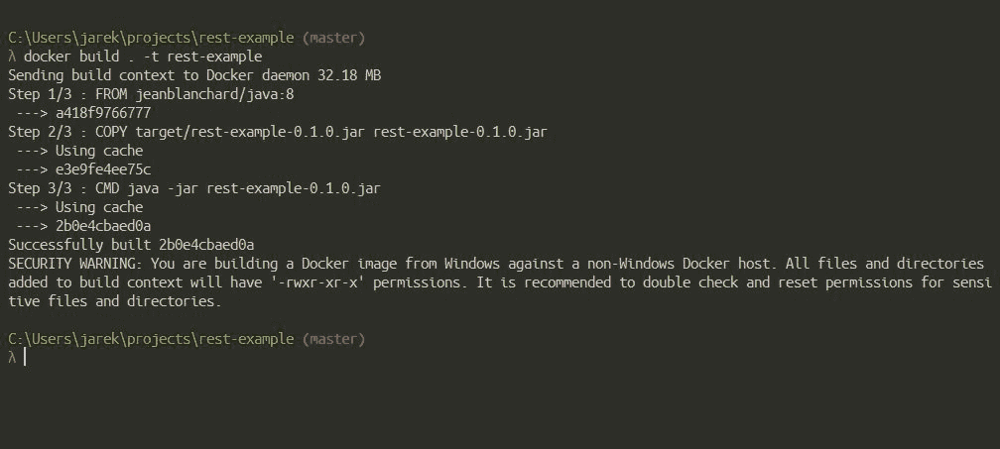
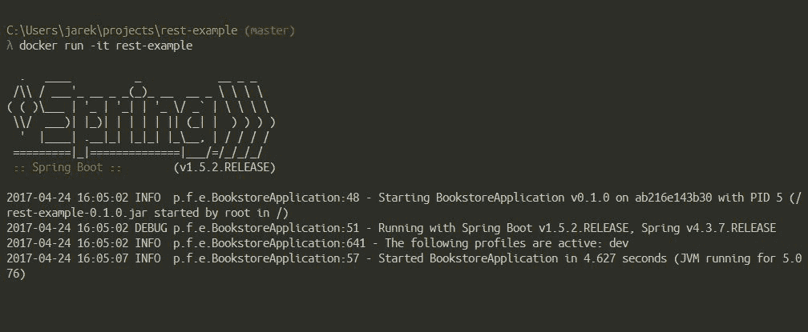
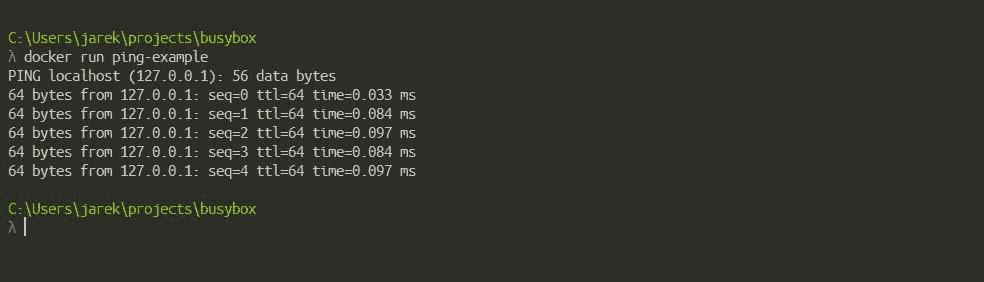
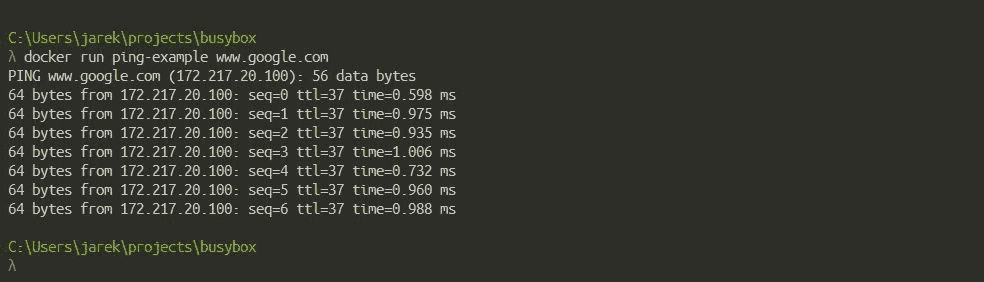
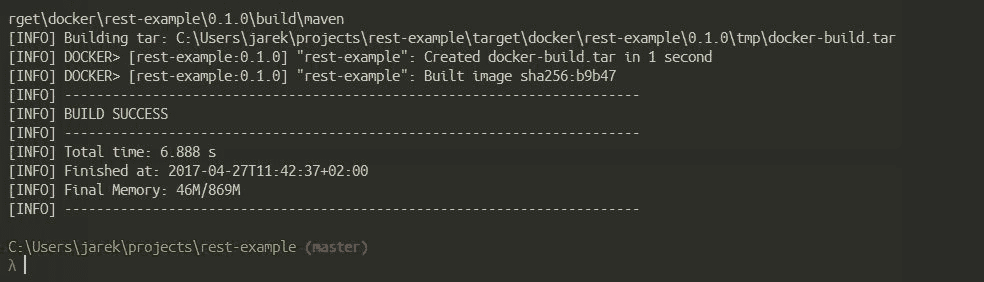

# 第五章：使用 Java 应用程序创建镜像

现在我们有一个简单但功能齐全的基于 Spring Bootstrap 的 Java 微服务，我们可以进一步进行。在使用 Kubernetes 部署之前，让我们将其打包为 Docker 镜像。在本章中，我们将创建一个包含我们应用程序的 Docker 镜像，并将 Spring Boot 应用程序 docker 化以在隔离环境中运行，即容器中。

本章涵盖的主题将是：

+   创建 Dockerfile

+   Dockerfile 指令

+   构建镜像

+   创建和删除镜像

让我们从定义一个`Dockerfile`开始，这将是我们容器的定义。

# Dockerfile

正如您在第一章中所记得的，*Docker 简介*，`Dockerfile`是一种构建镜像的配方。它是一个纯文本文件，包含按顺序由 Docker 执行的指令。每个`Dockerfile`都有一个基础镜像，Docker 引擎将用它来构建。生成的镜像将是文件系统的特定状态：一个只读的、冻结的不可变的快照，由代表文件系统在不同时间点上的更改的层组成。

Docker 中的镜像创建流程非常简单，基本上包括两个步骤：

1.  首先，您准备一个名为`Dockerfile`的文本文件，其中包含一系列关于如何构建镜像的指令。您可以在`Dockerfile`中使用的指令集并不是很广泛，但足以充分指导 Docker 如何创建镜像。

1.  接下来，您执行`docker build`命令，基于您刚刚创建的`Dockerfile`创建一个 Docker 镜像。`docker build`命令在上下文中运行。构建的上下文是指定位置的文件，可以是`PATH`或 URL。`PATH`是本地文件系统上的目录，URL 是 Git 存储库位置。上下文会递归处理。`PATH`将包括任何子目录。URL 将包括存储库及其子模块。

如果您创建一个包含 Java 应用程序的镜像，您也可以跳过第二步，并利用其中一个可用的 Docker Maven 插件。在学习如何使用`docker build`命令构建镜像之后，我们还将使用 Maven 创建我们的镜像。在使用 Maven 构建时，上下文将由 Maven 自动提供给`docker build`命令（或者在这种情况下是一个构建过程）。实际上，根本不需要`Dockerfile`，它将在构建过程中自动创建。我们将在短时间内了解这一点。

`Dockerfile`的标准名称就是`Dockerfile`。它只是一个纯文本文件。根据您使用的 IDE，有插件可以提供 Dockerfile 语法高亮和自动补全，这使得编辑它们变得轻而易举。Dockerfile 指令使用简单明了的语法，使它们非常容易理解、创建和使用。它们被设计为自解释的，特别是因为它们允许像正确编写的应用程序源代码一样进行注释。现在让我们来了解一下`Dockerfile`指令。

# Dockerfile 指令

我们将从每个 Dockerfile 顶部必须具有的指令`FROM`开始。

# FROM

这是 Dockerfile 中的第一条指令。它为文件中接下来的每个后续指令设置基础镜像。`FROM`指令的语法很简单。就是：

`FROM <image>`，或`FROM <image>:<tag>`，或`FROM <image>@<digest>`

`FROM`指令以`tag`或`digest`作为参数。如果您决定跳过它们，Docker 将假定您想要从`latest`标签构建您的镜像。请注意，`latest`并不总是您想要构建的镜像的最新版本。`latest`标签有点特殊。而且它可能不会像您期望的那样工作。总之，除非镜像创建者（例如`openjdk`或`fabric8`）有特定的`build`、`tag`和`push`模式，否则`latest`标签并不意味着任何特殊含义。分配给镜像的`latest`标签只是意味着它是最后构建并执行的镜像，没有提供特定标签。很容易理解，这可能会令人困惑，拉取标记为`latest`的镜像将不会获取软件的最新版本。

当拉取标记为`latest`的镜像时，Docker 不会检查您是否获取了软件的最新版本。

如果 Docker 在构建过程中找不到你提供的标签或摘要，将会抛出错误。你应该明智地选择基础镜像。我的建议是始终优先选择在 Docker Hub 上找到的官方仓库。通过选择官方镜像，你可以相当确信它的质量高，经过测试，得到支持和维护。

对于容器化 Java 应用程序，我们有两个选项。第一个是使用基础 Linux 镜像，并使用`RUN`指令安装 Java（我们将在稍后介绍`RUN`）。第二个选项是拉取已经安装了 Java 运行时的镜像。在这里，你有更多选择。例如：

+   `openjdk`：一个官方仓库，包含了 Java 平台标准版的开源实现。标签`latest`指向了`8u121-alpine` OpenJDK 版本，这是在撰写本书时的最新版本。

+   `fabric8/java-alpine-openjdk8-jdk`：这个基础镜像实际上也被 fabric8 Maven 插件使用。

+   `frolvlad/alpine-oraclejdk8`：有三个标签可供选择：full（只删除源代码 tarballs），cleaned（清理桌面部分），slim（删除除编译器和 JVM 之外的所有内容）。标签 latest 指向了 cleaned 版本。

+   `jeanblanchard/java`：一个包含基于 Alpine Linux 的镜像的仓库，以保持尺寸最小（大约是基于 Ubuntu 的镜像的 25%）。标签`latest`指向了 Oracle Java 8（Server JRE）。

通过在 Docker Hub 上注册并创建账户，你将获得访问 Docker Store 的权限。它可以在[`store.docker.com`](https://store.docker.com)找到。尝试在 Docker Store 中搜索与 Java 相关的镜像。你会找到许多有用的镜像可供选择，其中之一就是官方的 Oracle Java 8 SE（Server JRE）镜像。这个 Docker 镜像提供了 Server JRE，这是专门针对在服务器环境中部署 Java 的运行时环境。Server JRE 包括用于 JVM 监控和服务器应用程序常用的工具。你可以通过在 Docker Store 购买官方 Java Docker 镜像来获取这个官方 Java Docker 镜像。点击获取内容，价格为$0.00，因此可以免费用于开发目的。

请注意，来自 Docker Store 的镜像与您的 Docker Hub 帐户绑定。在拉取它们或构建以它们为基础镜像的自己的镜像之前，您需要使用 `docker login` 命令和您的 Docker Hub 凭据对 Docker Store 进行身份验证。

为了我们的目的，让我们选择 `jeanblanchard/java`。这是官方的 Oracle Java 运行在 Alpine Linux 发行版之上。基础镜像小巧且下载速度快。我们的 `FROM` 指令将与此相同：

```
FROM jeanblanchard/java:8

```

如果在您的 Docker 主机上（例如在您的本地计算机上）找不到 `FROM` 镜像，Docker 将尝试从 Docker Hub（或者如果您已经设置了私有仓库，则从私有仓库）中找到并拉取它。`Dockerfile` 中的所有后续指令将使用 `FROM` 中指定的镜像作为基础起点。这就是为什么它是强制性的；一个有效的 `Dockerfile` 必须在顶部有它。

# MAINTAINER

通过使用 `MAINTAINER` 指令，您可以设置生成的镜像的 `Author` 字段。这可以是您的姓名、用户名，或者您希望作为您正在编写的 `Dockerfile` 创建的镜像的作者。这个命令可以放在 `Dockerfile` 的任何位置，但最好的做法是将其放在文件顶部，在 `FROM` 指令之后。这是一个所谓的非执行命令，意味着它不会对生成的镜像进行任何更改。语法非常简单：

```
MAINTAINER authors_name

```

# WORKDIR

`WORKDIR` 指令为 Dockerfile 中在它之后出现的任何 `CMD` 、`RUN` 、`ENTRYPOINT` 、`COPY` 和 `ADD` 指令添加一个工作目录。该指令的语法是 `WORKDIR /PATH`。如果提供了相对路径，可以在一个 Dockerfile 中有多个 `WORKDIR` 指令；它将相对于前一个 `WORKDIR` 指令的路径。

# ADD

`ADD` 的基本作用是将文件从源复制到容器自己的文件系统中的所需目的地。它接受两个参数：源（`<source path or URL>`）和目的地（`<destination path>`）：

```
ADD <source path or URL> <destination path >

```

源可以有两种形式：它可以是文件、目录或 URL 的路径。路径是相对于构建过程将要启动的目录（我们之前提到的构建上下文）的。这意味着您不能将例如 `"../../config.json"` 放置为 `ADD` 指令的源路径参数。

源路径和目标路径可以包含通配符。这些与常规文件系统中的通配符相同：`*`表示任何文本字符串，`?`表示任何单个字符。

例如，`ADD target/*.jar /`将所有以`.jar`结尾的文件添加到镜像文件系统的根目录中。

如果需要，可以指定多个源路径，并用逗号分隔。它们都必须相对于构建上下文，就像只有一个源路径一样。如果您的源路径或目标路径包含空格，您需要使用特殊的语法，添加方括号：

`ADD ["<source path or URL>" "<destination path>"]`

如果源路径不以斜杠结尾，它将被视为单个文件，并且只会被复制到目标路径中。如果源路径以斜杠结尾，它将被视为目录：然后将其整个内容复制到目标路径中，但目录本身不会在目标路径中创建。因此，可以看到，当向镜像添加文件或目录时，斜杠`/`非常重要。如果源路径指向常见格式（如 ZIP、TAR 等）的压缩存档，它将被解压缩到目标路径中。Docker 不是通过文件名来识别存档，而是检查文件的内容。

如果存档损坏或者以其他方式无法被 Docker 读取，它将不会被解压缩，也不会给出错误消息。文件将被复制到目标路径中。

相同的尾部斜杠规则适用于目标路径；如果以斜杠结尾，表示它是一个目录。否则，它将被视为单个文件。这在构建镜像的文件系统内容时为您提供了很大的灵活性；您可以将文件添加到目录中，将文件添加为单个文件（使用相同或不同的名称），或者只添加整个目录。

`ADD` 命令不仅仅是从本地文件系统复制文件，您还可以使用它从网络获取文件。如果源是一个 URL，那么 URL 的内容将自动下载并放置在目标位置。请注意，从网络下载的文件存档将不会被解压缩。再次强调，当下载文件时，尾部的斜杠很重要；如果目标路径以斜杠结尾，文件将被下载到该目录中。否则，下载的文件将只是保存在您提供的目标路径下的名称。

`<destination directory>` 可以是绝对路径，也可以是相对于 `WORKDIR` 指令指定的目录的路径（我们将在稍后介绍）。源（或多个源）将被复制到指定的目标位置。例如：

+   `ADD config.json projectRoot/` 将把 `config.json` 文件添加到 `<WORKDIR>/projectRoot/` 中

+   `ADD config.json /absoluteDirectory/` 将把 `config.json` 文件添加到 `/absoluteDirectory/` 中

关于镜像中创建的文件的所有权，它们将始终以用户 ID（`UID`）`0` 和组 ID（`GID`）`0` 创建。权限将与源文件相同，除非它是从远程 URL 下载的文件：在这种情况下，它将获得权限值 `600`（只有所有者可以读写该文件）。如果您需要更改这些值（所有权或权限），您需要在 `ADD` 指令之后在您的 Dockerfile 中提供更多的指令。

如果您需要添加到镜像的文件位于需要身份验证的 URL 上，`ADD` 指令将无法工作。您需要使用 shell 命令来下载文件，比如 `wget` 或 `curl`。

请注意，如果您不需要其特殊功能，比如解压缩存档，就不应该使用 `ADD`，而应该使用 `COPY`。

# COPY

`COPY` 指令将从 `<source path>` 复制新文件或目录，并将它们添加到容器的文件系统中的路径 `<destination path>`。

它与 `ADD` 指令非常相似，甚至语法也没有区别：

```
COPY <source path or URL> <destination path >

```

`COPY` 也适用于 `ADD` 的所有规则：所有源路径必须相对于构建的上下文。再次强调，源路径和目标路径末尾的斜杠的存在很重要：如果存在，路径将被视为文件；否则，它将被视为目录。

当然，就像`ADD`一样，你可以有多个源路径。如果源路径或目标路径包含空格，你需要用方括号括起来：

```
COPY ["<source path or URL>" "<destination path>"]

```

`<destination path>`是一个绝对路径（如果以斜杠开头），或者是相对于`WORKDIR`指令指定的路径的路径。

正如你所看到的，`COPY`的功能与`ADD`指令几乎相同，只有一个区别。`COPY`仅支持将本地文件基本复制到容器中。另一方面，`ADD`提供了一些更多的功能，比如归档解压、通过 URL 下载文件等。Docker 的最佳实践建议，如果你不需要`ADD`的这些附加功能，应该优先使用`COPY`。由于`COPY`命令的透明性，`Dockerfile`将更清洁、更易于理解。

`ADD`和`COPY`指令有一个共同的重要方面，即缓存。基本上，Docker 在构建过程中缓存进入镜像的文件。镜像中文件或文件的内容被检查，并为每个文件计算校验和。在缓存查找期间，校验和与现有镜像中的校验和进行比较。如果文件的内容和元数据发生了变化，缓存就会失效。否则，如果源文件没有发生变化，现有的镜像层就会被重用。

如果你有多个 Dockerfile 步骤使用来自你的上下文的不同文件，单独`COPY`它们，而不是一次性全部复制。这将确保每个步骤的构建缓存只有在特定所需文件发生变化时才会失效（强制步骤重新运行）。

正如你所看到的，`COPY`指令的语法和行为几乎与`ADD`指令相同，但它们的功能集有些不同。对于不需要`ADD`功能的归档解压或从 URL 获取文件的文件和目录，你应该始终使用`COPY`。

# 运行

`RUN`指令是`Dockerfile`的中心执行指令。实质上，`RUN`指令将在当前镜像的新层上执行一个命令（或多个命令），然后提交结果。生成的提交镜像将作为`Dockerfile`中下一条指令的基础。正如你从第一章中记得的，*Docker 简介*，分层是 Docker 的核心概念。`RUN`以命令作为其参数，并运行它以创建新的层。

这也意味着`COPY`和`ENTRYPOINT`设置的参数可以在运行时被覆盖，所以如果你在启动容器后没有改变任何东西，结果将始终相同。然而，`RUN`将在构建时执行，无论你在运行时做什么，其效果都会存在。

为了使你的 Dockerfile 更易读和更易维护，你可以将长或复杂的`RUN`语句拆分成多行，用反斜杠分隔它们。

`Dockerfile`中的`RUN`命令将按照它们在其中出现的顺序执行。

每个`RUN`指令在镜像中创建一个新的层。

正如你已经从第一章中了解的那样，*Docker 简介*，层被 Docker 缓存和重用。在下一次构建期间，`RUN`指令的缓存不会自动失效。例如，`RUN apt-get upgrade -y`的指令的缓存将在下一次构建中被重用。缓存为什么重要？在大多数情况下，缓存非常有用，可以节省大量构建镜像的时间。它使构建新容器变得非常快速。然而，需要警惕。有时缓存可能会带来意外的结果。在构建过程中，缓存被大量使用，当你希望`RUN`命令的更新输出进入新容器时，可能会出现问题。如果`RUN`命令在两次构建之间没有改变，Docker 的缓存将不会失效。实际上，Docker 将重用缓存中的先前结果。这显然是有害的。想象一种情况，当你使用`RUN`命令从 Git 仓库中拉取源代码时，通过使用`git clone`作为构建镜像的第一步。

当 Docker 缓存需要失效时要注意，否则你将在镜像构建中得到意外的结果。

这就是为什么知道如何选择性地使缓存失效很重要。在 Docker 世界中，这被称为缓存破坏。

考虑以下示例。`RUN`最常见的用例可能是`apt-get`的应用，它是 Ubuntu 上用于下载软件包的包管理器命令。假设我们有以下 Dockerfile，安装 Java 运行时：

```
FROM ubuntu 
RUN apt-get update 
RUN apt-get install -y openjdk-8-jre 

```

如果我们从这个`Dockerfile`构建一个镜像，两个`RUN`指令的所有层将被放入层缓存中。但是，过了一会儿，您决定在镜像中加入`node.js`包，所以现在`Dockerfile`看起来和这样一样：

```
FROM ubuntu 
RUN apt-get update 
RUN apt-get install -y openjdk-8-jre 
RUN apt-get install -y nodejs 

```

如果您第二次运行`docker build`，Docker 将通过从缓存中获取它们来重用层。因此，`apt-get update`将不会被执行，因为将使用缓存的版本。实际上，您新创建的镜像可能会有`java`和`node.js`包的过时版本。在创建`RUN`指令时，您应该始终牢记缓存的概念。在我们的例子中，我们应该始终将`RUN apt-get update`与`apt-get install`结合在同一个`RUN`语句中，这将创建一个单独的层；例如：

```
RUN apt-get update \

&& apt-get install -y openjdk-8-jre \

&& apt-get install -y nodejs \

&& apt-get clean

```

比这更好的是，您还可以使用一种称为“版本固定”的技术来避免缓存问题。这只是为要安装的包提供一个具体的版本。

# CMD

`CMD`指令的目的是为执行容器提供默认值。您可以将`CMD`指令视为镜像的起点，当容器稍后运行时。这可以是一个可执行文件，或者，如果您指定了`ENTRYPOINT`指令（我们将在下面解释），您可以省略可执行文件，只提供默认参数。`CMD`指令的语法可以有两种形式：

+   `CMD ["executable","parameter1","parameter2"]`：这是所谓的`exec`形式。这也是首选和推荐的形式。参数是 JSON 数组，它们需要用方括号括起来。重要的一点是，当容器运行时，`exec`形式不会调用命令 shell。它只是运行提供的可执行文件作为第一个参数。如果`Dockerfile`中存在`ENTRYPOINT`指令，`CMD`为`ENTRYPOINT`指令提供了一组默认参数。

+   `CMD command parameter1 parameter2`：这是指令的 shell 形式。这次，shell（如果存在于镜像中）将处理提供的命令。指定的二进制文件将使用`/bin/sh -c`调用 shell 来执行。这意味着，如果您使用`CMD echo $HOSTNAME`来显示容器的主机名，您应该使用指令的 shell 形式。

我们之前说过，`CMD`指令的推荐形式是`exec`形式。原因在于：通过 shell 启动的所有内容都将作为`/bin/sh -c`的子命令启动，这不会传递信号。这意味着可执行文件不会成为容器的 PID 1，并且不会接收 Unix 信号，因此您的可执行文件将无法接收来自`docker stop <container>`的`SIGTERM`。还有另一个缺点：您将需要在容器中使用 shell。如果您正在构建一个最小的镜像，它不需要包含 shell 二进制文件。使用 shell 形式的`CMD`指令将会简单失败。

当 Docker 执行命令时，它不会检查容器内是否有 shell 可用。如果镜像中没有`/bin/sh`，容器将无法启动。

另一方面，如果我们将`CMD`更改为`exec`形式，Docker 将寻找一个名为`echo`的可执行文件，这当然会失败，因为`echo`是一个 shell 命令。

因为`CMD`在运行容器时与 Docker 引擎的起点相同，Dockerfile 中只能有一个单独的`CMD`指令。

如果在 Dockerfile 中有多个`CMD`指令，只有最后一个会生效。

您可能会注意到`CMD`指令与`RUN`非常相似。它们都可以运行任何命令（或应用程序）。但有一个重要的区别：执行时间。通过`RUN`指令提供的命令在构建时执行，而通过`CMD`指令指定的命令在通过`docker run`在新创建的镜像上启动容器时执行。与`CMD`不同，`RUN`指令实际上用于构建镜像，通过在之前的层上创建一个新的层来提交。

`RUN`是一个构建时指令，`CMD`是一个运行时指令。

信不信由你，我们现在可以将我们的 REST 示例微服务容器化。让我们通过在第四章中创建的`pom.xml`文件上执行`mvn clean install`来检查它是否构建成功，*创建 Java 微服务*。构建成功后，我们应该有一个包含`rest-example-0.1.0.jar`文件的`target`目录。`target`目录中的 Spring Boot 应用程序 JAR 是一个可执行的、厚重的 JAR。我们将从 Docker 容器内运行它。让我们编写基本的`Dockerfile`，使用我们已经知道的命令，并将其放在我们项目的根目录（这将是我们`docker build`命令的上下文）：

```
FROM jeanblanchard/java:8

COPY target/rest-example-0.1.0.jar rest-example-0.1.0.jar

CMD java -jar rest-example-0.1.0.jar

```

现在我们可以运行`docker build`命令，使用`rest-example`作为镜像名称，省略标签（你会记得，在构建镜像时省略标签会导致创建`latest`标签）：

```
$ docker build . -t rest-example

```

作为第一个参数的点指定了`docker build`命令的上下文。在我们的情况下，它将只是我们小微服务的根目录。在构建过程中，Docker 将输出所有的步骤和层 ID。请注意，几乎每个`Dockerfile`指令都会创建一个新的层。如果你还记得第一章，*Docker 简介*，Docker 利用了层缓存。如果特定的层可以被重用，它将从缓存中取出。这极大地提高了构建过程的性能。最后，Docker 将输出新创建的镜像的 ID，如下截图所示：



镜像已经创建，所以应该可以运行。要列出镜像，执行以下 Docker 命令：

```
$ docker image ls

```

如下截图所示，我们的`rest-example`镜像已经准备好可以运行了：


到目前为止，一切都很顺利。我们已经构建了我们的镜像的基本形式。虽然运行镜像的过程是第六章的主题，*使用 Java 应用程序运行容器*，让我们现在快速运行它来证明它正在工作。要运行镜像，执行以下命令：

```
$ docker run -it rest-example

```

过一会儿，你应该会看到熟悉的 Spring Boot 横幅，这表明我们的服务是从 Docker 容器内部运行的：



这并不是很复杂，对吧？基本的`Dockerfile`只包含三行，使用`FROM`定义基础镜像，使用`COPY`将可执行的 jar 传输到镜像的文件系统中，以及使用`CMD`指令来运行服务。

使用 Maven 构建应用程序 jar 存档，然后使用 Dockerfile 的`COPY`指令进行复制就可以了。那么，将构建过程委托给 Docker 守护进程本身呢？嗯，我们可以使用我们已经知道的`Dockerfile`指令来做到这一点。使用 Docker 守护进程构建 Java 应用程序的缺点是镜像将包含所有的 JDK（包括 Java 编译器）、Maven 二进制文件和我们的应用程序源代码。我建议构建一个单一的构件（JAR 或 WAR 文件），进行彻底的测试（使用面向发布的 QA 周期），并将唯一的构件（当然还有它的依赖项）部署到目标机器上。然而，为了了解`Dockerfile`可能实现的功能，让我们看看以下示例，假设我们的应用程序代码在本地磁盘上的`/app`文件夹中：

```
FROM java:8 

RUN apt-get update

RUN apt-get install -y maven

WORKDIR /app

COPY pom.xml /app/pom.xml

COPY src /app/src

RUN ["mvn", "package"]

CMD ["/usr/lib/jvm/java-8-openjdk-amd64/bin/java", 

"-jar", "target/ rest-example-0.1.0.jar"]

```

在前面的例子中，Maven 构建过程将由 Docker 执行。我们只需运行`apt-get`命令来安装 Maven，将我们的应用程序源代码添加到镜像中，执行 Maven 的`package`命令，然后运行我们的服务。它的行为将与我们将已构建的构件复制到镜像文件系统中完全相同。

有一个 Dockerfile 指令与`CMD`指令有点相关：`ENTRYPOINT`。现在让我们来看看它。

# ENTRYPOINT

官方的 Docker 文档说`ENTRYPOINT`指令允许您配置一个将作为可执行文件运行的容器。至少在第一次使用时，这并不是很清楚。`ENTRYPOINT`指令与`CMD`指令有关。实际上，起初可能会有些混淆。其原因很简单：`CMD`首先开发，然后为了更多的定制开发了`ENTRYPOINT`，这两个指令之间的一些功能重叠。让我们解释一下。`ENTRYPOINT`指定容器启动时将始终执行的命令。另一方面，`CMD`指定将传递给`ENTRYPOINT`的参数。Docker 有一个默认的`ENTRYPOINT`，即`/bin/sh -c`，但没有默认的`CMD`。例如，考虑这个 Docker 命令：

```
docker run ubuntu "echo" "hello world"

```

在这种情况下，镜像将是最新的`ubuntu`，`ENTRYPOINT`将是默认的`/bin/sh -c`，传递给`ENTRYPOINT`的命令将是`echo "hello world"`。

`ENTRYPOINT`指令的语法可以有两种形式，类似于`CMD`。

`ENTRYPOINT ["executable", "parameter1", "parameter2"]`是`exec`形式，首选和推荐。与`CMD`指令的`exec`形式一样，这不会调用命令 shell。这意味着不会发生正常的 shell 处理。例如，`ENTRYPOINT [ "echo", "$HOSTNAME" ]`将不会对`$HOSTNAME`变量进行变量替换。如果您需要 shell 处理，那么您需要使用 shell 形式或直接执行 shell。例如：

```
ENTRYPOINT [ "sh", "-c", "echo $HOSTNAME" ]

```

在 Dockerfile 中使用`ENV`定义的变量（我们稍后会介绍），将被 Dockerfile 解析器替换。

`ENTRYPOINT command parameter1 parameter2`是一个 shell 形式。将发生正常的 shell 处理。这种形式还将忽略任何`CMD`或`docker run`命令行参数。此外，您的命令将不会成为 PID 1，因为它将由 shell 执行。因此，如果您然后运行`docker stop <container>`，容器将无法干净地退出，并且在超时后停止命令将被迫发送`SIGKILL`。

与`CMD`指令一样，Dockerfile 中的最后一个`ENTRYPOINT`指令才会生效。在 Dockerfile 中覆盖`ENTRYPOINT`允许您在运行容器时有不同的命令处理您的参数。如果您需要更改图像中的默认 shell，可以通过更改`ENTRYPOINT`来实现：

```
FROM ubuntu 

ENTRYPOINT ["/bin/bash"]

```

从现在开始，所有来自`CMD`的参数，或者在使用`docker run`启动容器时提供的参数，将由 Bash shell 处理，而不是默认的`/bin/sh -c`。

考虑这个基于 BusyBox 的简单`Dockerfile`。BusyBox 是一个软件，它在一个可执行文件中提供了几个精简的 Unix 工具。为了演示`ENTRYPOINT`，我们将使用 BusyBox 中的`ping`命令：

```
FROM busybox 

ENTRYPOINT ["/bin/ping"] 

CMD ["localhost"]

```

让我们使用先前的 Dockerfile 构建镜像，执行以下命令：

```
$ docker build -t ping-example .

```

如果现在使用`ping`镜像运行容器，`ENTRYPOINT`指令将处理提供的`CMD`参数：在我们的情况下，默认情况下将是`localhost`。让我们运行它，使用以下命令：

```
$ docker run ping-example

```

因此，您将得到一个`/bin/ping localhost`的命令行响应，如您在以下截图中所见：



`CMD`指令，正如你从描述中记得的那样，设置了默认命令和/或参数，当你运行容器时，可以从命令行覆盖它们。`ENTRYPOINT`不同，它的命令和参数不能被命令行覆盖。相反，所有命令行参数将被附加到`ENTRYPOINT`参数之后。这样你可以锁定在容器启动时始终执行的命令。

与`CMD`参数不同，当 Docker 容器使用命令行参数运行时，`ENTRYPOINT`命令和参数不会被忽略。

因为命令行参数将被附加到`ENTRYPOINT`参数，我们可以通过传递给`ENTRYPOINT`的不同参数来运行我们的`ping`镜像。让我们尝试一下，通过使用不同的输入来运行我们的 ping 示例：

```
$ docker run ping-example www.google.com

```

这次它的行为会有所不同。提供的参数值`www.google.com`将被附加到`ENTRYPOINT`，而不是 Dockerfile 中提供的默认`CMD`值。将执行的总命令行将是`/bin/ping www.google.com`，如你在下面的截图中所见：

您可以使用`exec`形式的`ENTRYPOINT`来设置相当稳定的默认命令和参数，然后使用`CMD`的任一形式来设置更有可能被更改的附加默认值。

有了`ENTRYPOINT`指令，我们就有了很多的灵活性。最后但并非最不重要的是，当使用`docker run`命令的`--entrypoint`参数启动容器时，`ENTRYPOINT`也可以被覆盖。请注意，你可以使用`--entrypoint`来覆盖`ENTRYPOINT`设置，但这只能设置要执行的二进制文件（不会使用`sh -c`）。正如你所见，`CMD`和`ENTRYPOINT`指令都定义了在运行容器时执行的命令。让我们总结一下我们对它们之间的区别和合作所学到的内容：

+   一个 Dockerfile 应该指定至少一个`CMD`或`ENTRYPOINT`指令

+   Dockerfile 中只有最后一个`CMD`和`ENTRYPOINT`将被使用

+   在使用容器作为可执行文件时，应该定义`ENTRYPOINT`

+   你应该使用`CMD`指令来定义作为`ENTRYPOINT`定义的命令的默认参数，或者在容器中执行`ad-hoc`命令的方式

+   当使用替代参数运行容器时，`CMD`将被覆盖

+   `ENTRYPOINT`设置了每次使用该镜像创建容器时使用的具体默认应用程序。

+   如果你将`ENTRYPOINT`与`CMD`配对，你可以从`CMD`中删除一个可执行文件，只留下它的参数，这些参数将传递给`ENTRYPOINT`。

+   `ENTRYPOINT`的最佳用法是设置镜像的主要命令，允许该镜像像执行该命令一样运行（然后使用`CMD`作为默认标志）。

我们的服务运行正常，但并不是很有用。首先，启动它涉及许多手动步骤，这就是为什么我们将在本章后面使用 Maven 自动化它。其次，正如你会记得的，我们的服务监听着端口号为 8080 的 HTTP 请求。我们的基本镜像运行了，但没有暴露任何网络端口，因此没有人和没有东西可以访问该服务。让我们继续学习有关剩余的 Dockerfile 指令来修复它。

# EXPOSE

`EXPOSE`指令通知 Docker 容器在运行时监听指定的网络端口。我们已经在第二章中提到了`EXPOSE`指令，*网络和持久存储*。正如你会记得的，Dockerfile 中的`EXPOSE`相当于`--expose`命令行选项。Docker 使用`EXPOSE`命令后跟端口号来允许流入的流量到达容器。我们已经知道`EXPOSE`不会自动使容器的端口在主机上可访问。要做到这一点，你必须使用`-p`标志来发布一系列端口，或者使用`-P`标志一次发布所有暴露的端口。

让我们回到我们的`Dockerfile`并暴露一个端口：

```
FROM jeanblanchard/java:8

COPY target/rest-example-0.1.0.jar rest-example-0.1.0.jar

CMD java -jar rest-example-0.1.0.jar

EXPOSE 8080

```

如果你现在使用相同的命令重新构建镜像，`docker build . -t rest-example`，你会注意到 Docker 输出了第四层，表示端口 8080 已经被暴露。暴露的端口将对此 Docker 主机上的其他容器可用，并且如果在运行时映射它们，也对外部世界可用。好吧，让我们尝试一下，使用以下`docker run`命令：

```
$ docker run -p 8080:8080 -it rest-example

```

如果您现在使用`HTTP`请求调用本地主机，比如`POST`（用于保存我们的图书实体）或`GET`（用于获取图书列表或单本图书），就像我们在第四章中所做的那样，*创建 Java 微服务*，使用任何 HTTP 工具，比如 HTTPie 或 Postman，它将像以前一样做出响应。但是，这一次是来自 Docker 容器。现在，这是一件了不起的事情。让我们了解剩下的重要的 Dockerfile 指令。

# VOLUME

正如您在第一章中所记得的，*Docker 简介*，容器文件系统默认是临时的。如果您启动 Docker 镜像（即运行容器），您将得到一个读写层，该层位于堆栈的顶部。您可以随意创建，修改和删除文件，然后提交该层以保留更改。在第二章中，*网络和持久存储*，我们已经学会了如何创建卷，这是一种很好的存储和检索数据的方法。我们可以在`Dockerfile`中使用`VOLUME`指令做同样的事情。

语法再简单不过了：就是`VOLUME ["/volumeName"]`。

`VOLUME`的参数可以是 JSON 数组，也可以是一个带有一个或多个参数的普通字符串。例如：

```
VOLUME ["/var/lib/tomcat8/webapps/"]

VOLUME /var/log/mongodb /var/log/tomcat

```

`VOLUME`指令创建一个具有指定名称的挂载点，并将其标记为包含来自本机主机或其他容器的外部挂载卷。

`VOLUME`命令将在容器内部挂载一个目录，并将在该目录内创建或编辑的任何文件存储在容器文件结构之外的主机磁盘上。在`Dockerfile`中使用`VOLUME`让 Docker 知道某个目录包含永久数据。Docker 将为该数据创建一个卷，并且即使删除使用它的所有容器，也不会删除它。它还绕过了联合文件系统，因此该卷实际上是一个实际的目录，它会在所有共享它的容器中（例如，如果它们使用`--volumes-from`选项启动）以正确的方式挂载，无论是读写还是只读。要理解`VOLUME`，让我们看一个简单的 Dockerfile：

```
FROM ubuntu 

VOLUME /var/myVolume

```

如果您现在运行容器并在`/var/myVolume`中保存一些文件，它们将可供其他容器共享。

基本上，`VOLUME`和`-v`几乎是相等的。`VOLUME`和`-v`之间的区别在于，您可以在执行`docker run`启动容器时动态使用`-v`并将您的`host`目录挂载到容器上。这样做的原因是 Dockerfile 旨在具有可移植性和共享性。主机目录卷是 100%依赖于主机的，并且在任何其他机器上都会出现问题，这与 Docker 的理念有些不符。因此，在 Dockerfile 中只能使用可移植指令。

`VOLUME`和`-v`之间的根本区别在于：`-v`会将操作系统中现有的文件挂载到 Docker 容器内，而`VOLUME`会在主机上创建一个新的空卷，并将其挂载到容器内。

# LABEL

为了向我们的镜像添加元数据，我们使用`LABEL`指令。单个标签是一个键值对。如果标签值中需要有空格，您需要用引号将其包裹起来。标签是可累加的，它们包括从作为您自己镜像基础的镜像（`FROM`指令中的镜像）中获取的所有标签。如果 Docker 遇到已经存在的标签，它将用新值覆盖具有相同键的标签。在定义标签时，有一些规则必须遵守：键只能由小写字母数字字符、点和破折号组成，并且必须以字母数字字符开头和结尾。为了防止命名冲突，Docker 建议使用反向域表示法为标签键使用命名空间。另一方面，没有命名空间（点）的键保留供命令行使用。

`LABEL`指令的语法很简单：

```
LABEL "key"="value"

```

要使用多行值，请使用反斜杠将行分隔开；例如：

```
LABEL description="This is my \

multiline description of the software."

```

您可以在单个镜像中拥有多个标签。用空格或反斜杠分隔它们；例如：

```
LABEL key1="value1" key2="value2" key3="value3"

LABEL key1="value1" \

key2="value2" \

key3="value3"

```

实际上，如果您的镜像中需要有多个标签，建议使用`LABEL`指令的多标签形式，因为这样会在镜像中只产生一个额外的层。

每个`LABEL`指令都会创建一个新的层。如果您的镜像有很多标签，请使用单个`LABEL`指令的多重形式。

如果您想要查看镜像具有哪些标签，可以使用您已经在之前章节中了解过的`docker inspect`命令。

# ENV

`ENV`是一个`Dockerfile`指令，它将环境变量`<key>`设置为值`<value>`。您可以有两种选项来使用`ENV`：

+   第一个，`ENV <key> <value>` ，将一个单一变量设置为一个值。第一个空格后的整个字符串将被视为 `<value>` 。这将包括任何字符，还有空格和引号。例如：

```
ENV JAVA_HOME /var/lib/java8

```

+   第二个，带有等号的是 `ENV <key>=<value>` 。这种形式允许一次设置多个环境变量。如果需要在值中提供空格，您需要使用引号。如果需要在值中使用引号，使用反斜杠：

```
ENV CONFIG_TYPE=file CONFIG_LOCATION="home/Jarek/my \app/config.json"

```

请注意，您可以使用 `ENV` 更新 `PATH` 环境变量，然后 `CMD` 参数将意识到该设置。这将导致 `Dockerfile` 中 `CMD` 参数的更清晰形式。例如，设置如下：

```
ENV PATH /var/lib/tomcat8/bin:$PATH

```

这将确保 `CMD ["startup.sh"]` 起作用，因为它将在系统 `PATH` 中找到 `startup.sh` 文件。您还可以使用 `ENV` 设置经常修改的版本号，以便更容易处理升级，如下例所示：

```
ENV TOMCAT_VERSION_MAJOR 8

ENV TOMCAT_VERSION 8.5.4

RUN curl -SL http://apache.uib.no/tomcat/tomcat-$TOMCAT_VERSION_MAJOR/v$TOMCAT_VERSION/bin/apache-tomcat-$TOMCAT_VERSION.tar.gz | tar zxvf apache-tomcat-$TOMCAT_VERSION.tar.gz -c /usr/Jarek/apache-tomcat-$TOMCAT_VERSION

ENV PATH /usr/Jarek/apache-tomcat-$TOMCAT_VERSION/bin:$PATH

```

在上一个示例中，Docker 将下载 `ENV` 变量中指定的 Tomcat 版本，将其提取到具有该版本名称的新目录中，并设置系统 `PATH` 以使其可用于运行。

使用 `ENV` 设置的环境变量将在从生成的镜像运行容器时持续存在。与使用 `LABEL` 创建的标签一样，您可以使用 `docker inspect` 命令查看 `ENV` 值。`ENV` 值也可以在容器启动之前使用 `docker run --env <key>=<value>` 覆盖。

# USER

`USER` 指令设置运行镜像时要使用的用户名或 UID。它将影响 `Dockerfile` 中接下来的任何 `RUN` 、`CMD` 和 `ENTRYPOINT` 指令的用户。

指令的语法只是 `USER <用户名或 UID>` ；例如：

```
USER tomcat

```

如果可执行文件可以在没有特权的情况下运行，可以使用 `USER` 命令。Dockerfile 可以包含与此相同的用户和组创建指令：

```
RUN groupadd -r tomcat && useradd -r -g tomcat tomcat

```

频繁切换用户将增加生成镜像中的层数，并使 Dockerfile 更加复杂。

# ARG

`ARG` 指令用于在 `docker build` 命令期间向 Docker 守护程序传递参数。`ARG` 变量定义从 `Dockerfile` 中定义的行开始生效。通过使用 `--build-arg` 开关，您可以为已定义的变量分配一个值：

```
$ docker build --build-arg <variable name>=<value> .

```

从`--build-arg`中的值将传递给构建图像的守护程序。您可以使用多个`ARG`指令指定多个参数。如果您指定了未使用`ARG`定义的构建时间参数，构建将失败并显示错误，但可以在`Dockerfile`中指定默认值。您可以通过以下方式指定默认参数值：

```
FROM ubuntu 

ARG user=jarek

```

如果在开始构建之前未指定任何参数，则将使用默认值：

不建议使用`ARG`传递秘密，如 GitHub 密钥、用户凭据、密码等，因为所有这些都将通过使用`docker history`命令对图像的任何用户可见！

# ONBUILD

`ONBUILD`指令指定了另一个指令，当使用此图像作为其基础图像构建其他图像时将触发该指令。换句话说，`ONBUILD`指令是父`Dockerfile`给子`Dockerfile`（下游构建）的指令。任何构建指令都可以注册为触发器，并且这些指令将在`Dockerfile`中的`FROM`指令之后立即触发。

`ONBUILD`指令的语法如下：

```
ONBUILD <INSTRUCTION>

```

在其中，`<INSTRUCTION>`是另一个 Dockerfile 构建指令，稍后将在构建子图像时触发。有一些限制：`ONBUILD`指令不允许链接另一个`ONBUILD`指令，也不允许`FROM`和`MAINTAINER`指令作为`ONBUILD`触发器。

这在构建将用作基础构建其他图像的图像时非常有用。例如，应用程序构建环境或可能使用用户特定配置进行定制的守护程序。`ONBUILD`指令非常有用（[`docs.docker.com/engine/reference/builder/#onbuild`](https://docs.docker.com/engine/reference/builder/#onbuild)和[`docs.docker.com/engine/reference/builder/#maintainer-deprecated`](https://docs.docker.com/engine/reference/builder/#maintainer-deprecated)），用于自动构建所选软件堆栈。考虑以下使用 Maven 构建 Java 应用程序的示例（是的，Maven 也可以作为 Docker 容器使用）。基本上，您项目的 Dockerfile 只需要引用包含`ONBUILD`指令的基础容器即可：

```
 FROM maven:3.3-jdk-8-onbuild 

 CMD ["java","-jar","/usr/src/app/target/app-1.0-SNAPSHOT-jar-with-dependencies.jar"] 

```

没有魔法，如果您查看父级的 Dockerfile，一切都会变得清晰。在我们的情况下，它将是 GitHub 上可用的`docker-maven` Dockerfile：

```
 FROM maven:3-jdk-8

RUN mkdir -p /usr/src/app

WORKDIR /usr/src/app

ONBUILD ADD . /usr/src/app

ONBUILD RUN mvn install 

```

有一个基础镜像，其中安装了 Java 和 Maven，并有一系列指令来复制文件和运行 Maven。

`ONBUILD`指令会向镜像添加一个触发指令，以便在将来作为另一个构建的基础时执行。触发器将在子构建的上下文中执行，就好像它被立即插入到子`Dockerfile`中的`FROM`指令之后一样。

当 Docker 在构建过程中遇到`ONBUILD`指令时，构建器会向正在构建的镜像的元数据中添加一种触发器。但这是影响到该镜像的唯一方式。在构建结束时，所有触发器的列表将存储在镜像清单中，键为`OnBuild`。您可以使用我们已经知道的`docker inspect`命令来查看它们。

稍后，该镜像可以作为新构建的基础，使用`FROM`指令。在处理`FROM`指令时，Docker 构建器会寻找`ONBUILD`触发器，并按照它们注册的顺序执行它们。如果任何触发器失败，`FROM`指令将被中止，这将导致构建失败。如果所有触发器成功，`FROM`指令完成，构建继续进行。

# STOPSIGNAL

要指定应发送哪个系统调用信号以退出容器，请使用`STOPSIGNAL`指令。该信号可以是与内核的`syscall`表中的位置匹配的有效无符号数字，例如`9`，或者是格式为`SIGNAME`的信号名称，例如`SIGKILL`。

# HEALTHCHECK

`HEALTHCHECK`指令可用于通知 Docker 如何测试容器以检查其是否仍在工作。这可以是检查我们的 REST 服务是否响应`HTTP`调用，或者只是监听指定的端口。

容器可以有几种状态，可以使用`docker ps`命令列出。这些可以是`created`，`restarting`，`running`，`paused`，`exited`或`dead`。但有时这还不够；从 Docker 的角度来看，容器可能仍然存活，但应用程序可能会挂起或以其他方式失败。对应用程序状态的额外检查可能很有用，`HEALTHCHECK`非常方便。

`HEALTHCHECK`状态最初为 starting。每当健康检查通过时，它就变为`healthy`（无论之前处于什么状态）。在连续失败一定次数后，它就会变为`unhealthy`。

`HEALTHCHECK`指令的语法如下：

```
HEALTHCHECK --interval=<interval> --timeout=<timeout> CMD <command>

```

`<interval>`（默认值为 30 秒）和`<timeout>`（同样，默认值为 30 秒）是时间值，分别指定检查间隔和超时时间。`<command>`是实际用于检查应用程序是否仍在运行的命令。`<command>`的退出代码被 Docker 用来确定健康检查是失败还是成功。值可以是`0`，表示容器健康并且可以使用，也可以是`1`，表示出现了问题，容器无法正常工作。Java 微服务的`healthcheck`实现可以是一个简单的`/ping` REST 端点，返回任何内容（如时间戳），甚至可以返回一个空响应和`HTTP 200`状态码，证明它还活着。我们的`HEALTHCHECK`可以执行对这个端点的`GET`方法，检查服务是否响应。

```
HEALTHCHECK --interval=5m --timeout=2s --retries=3 CMD curl -f http://localhost/ping || exit 1

```

在上一个示例中，命令`curl -f http://localhost/ping`将每 5 分钟执行一次，最长超时时间为 2 秒。如果检查的单次运行时间超过 2 秒，则认为检查失败。如果连续三次重试失败，容器将获得`unhealthy`状态。

Dockerfile 中只能有一个`HEALTHCHECK`指令。如果列出多个，则只有最后一个`HEALTHCHECK`会生效。

`HEALTHCHECK`指令使您有可能微调容器监控，从而确保容器正常工作。这比仅有`running`、`exited`或`dead`标准 Docker 状态要好。

现在我们已经了解了`Dockerfile`指令，我们准备好准备我们的图像。让我们自动化一些事情。我们将使用 Maven 创建和运行我们的图像。

# 使用 Maven 创建图像

当然，我们可以使用 Docker 本身来构建我们的 Docker 镜像。但这不是 Spring 开发人员的典型用例。对我们来说，典型的用例是使用 Maven。如果你已经设置了持续集成流程，例如使用 Jenkins，这将特别有用。将镜像构建过程委托给 Maven 可以给你很大的灵活性，也可以节省大量时间。目前在 GitHub 上至少有几个免费的 Docker Maven 插件可用，例如：

+   [`github.com/spotify/docker-maven-plugin`](https://github.com/spotify/docker-maven-plugin)：Spotify 提供的用于构建和推送 Docker 镜像的 Maven 插件。

+   [`github.com/alexec/docker-maven-plugin`](https://github.com/alexec/docker-maven-plugin)。

+   [`github.com/fabric8io/docker-maven-plugin`](https://github.com/fabric8io/docker-maven-plugin)：这是我发现最有用和可配置的插件。在撰写本文时，Fabric8 似乎是最健壮的 Maven Docker 插件。Fabric8 是一个集成的开源 DevOps 和集成平台，可以在任何 Kubernetes 或 OpenShift 环境上即插即用，并提供持续交付、管理、ChatOps 和 Chaos Monkey。我们将在本章的其余部分使用这个插件。

我们的用例将使用 Maven 打包 Spring Boot 可执行 JAR 文件，然后将构建产物复制到 Docker 镜像中。使用 Maven 插件来构建 Docker 主要关注两个方面：

+   构建和推送包含构建产物的 Docker 镜像

+   启动和停止 Docker 容器进行集成测试和开发。这是我们将在第六章中专注的内容，*使用 Java 应用程序运行容器*

让我们现在专注于创建一个镜像，从插件目标和可能的配置选项开始。

fabric8 Docker 插件提供了一些 Maven 目标：

+   `docker:build`：这使用 maven-assembly-plugin 的装配描述符格式来指定将从子目录（默认为`/maven`）添加到镜像中的内容

+   `docker:push`：使用此插件构建的镜像可以推送到公共或私有的 Docker 注册表

+   `docker:start`和`docker:stop`：用于启动和停止容器

+   `docker:watch`：这将依次执行`docker:build`和`docker:run`。它可以在后台永远运行（单独的控制台），除非您使用 CTRL+C 停止它。它可以监视装配文件的更改并重新运行构建。这样可以节省很多时间。

+   `docker:remove`：用于清理镜像和容器

+   `docker:logs`：这会打印出正在运行的容器的输出

+   `docker:volume-create`和`docker:volume-remove`：分别用于创建和删除卷。我们将在本章后面再回到这些内容

在我们运行这些目标之前，我们需要告诉插件它应该如何行为。我们在项目的`pom.xml`文件中的插件配置中进行配置：

+   Maven Docker 插件配置

插件定义中的重要部分是`<configuration>`元素。这是您设置插件行为的地方。`<configuration>`中有两个主要元素：

+   指定如何构建镜像的`<build>`配置

+   描述如何创建和启动容器的`<run>`配置

这是`fabric8` Maven 插件的 Docker 的配置的最简单的示例：

```
<plugin>

 <groupId>io.fabric8</groupId>

 <artifactId>docker-maven-plugin</artifactId>

 <version>0.20.1</version>

 <configuration>

 <dockerHost>http://127.0.0.1:2375</dockerHost>

 <verbose>true</verbose>

 <images>

 <image>

 <name>rest-example:${project.version}</name>

 <build>

 <dockerFile>Dockerfile</dockerFile>

 <assembly>

 <descriptorRef>artifact</descriptorRef>

 </assembly>

 </build>

 </image>

 </images>

 </configuration>

</plugin>

```

`<dockerHost>`指定正在运行的 Docker 引擎的 IP 地址和端口，因此，当然，要使其构建，您首先需要运行 Docker。在前面的情况下，如果您从 shell 运行`mvn clean package docker:build`命令，Fabric8 Docker 插件将使用您提供的`Dockerfile`构建镜像。但是还有另一种构建图像的方法，根本不使用`Dockerfile`，至少不是显式定义的。要做到这一点，我们需要稍微更改插件配置。看一下修改后的配置：

```
<configuration>

 <images>

 <image>

 <name>rest-example:${project.version}</name>

 <alias>rest-example</alias>

 <build>

 <from>jeanblanchard/java:8</from>

 <assembly>

 <descriptorRef>artifact</descriptorRef>

 </assembly>

 <cmd>java -jar 

 maven/${project.name}-${project.version}.jar</cmd>

 </build>

 </image>

 </images>

</configuration>

```

正如您所看到的，我们不再提供`Dockerfile`。相反，我们只提供`Dockerfile`指令作为插件配置元素。这非常方便，因为我们不再需要硬编码可执行 jar 名称、版本等。它将从 Maven 构建范围中获取。例如，jar 的名称将被提供给`<cmd>`元素。这将自动导致在`Dockerfile`中生成有效的`CMD`指令。如果我们现在使用`mvn clean package docker:build`命令构建项目，Docker 将使用我们的应用程序构建一个镜像。让我们按字母顺序列出我们可用的配置元素：

| **元素** | **描述** |
| --- | --- |

| `assembly` | `<assembly>` 元素定义了如何构建进入 Docker 镜像的构件和其他文件。您可以使用 `targetDir` 元素提供一个目录，其中包含装配中包含的文件和构件将被复制到镜像中。这个元素的默认值是 `/maven`。在我们的示例中，我们将使用 `<descriptorRef>` 提供预定义装配描述符之一。`<descriptorRef>` 是一种方便的快捷方式，可以取以下值：

+   `artifact-with-dependencies` : 附加项目的构件和所有依赖项。此外，当类路径文件存在于目标目录中时，它将被添加进去。

+   `artifact` : 仅附加项目的构件，而不包括依赖项。

+   `project` : 附加整个 Maven 项目，但不包括 `target/` 目录。

+   `rootWar` : 将构件复制为 `ROOT.war` 到 `exposed` 目录。例如，Tomcat 可以在 `root` 上下文中部署 war 文件。

|

| `buildArgs` | 允许提供一个映射，指定 Docker `buildArgs` 的值，在使用构建参数的外部 Dockerfile 构建镜像时使用。键值语法与定义 Maven 属性（或 `labels` 或 `env`）时相同。 |
| --- | --- |
| `buildOptions` | 一个映射，用于指定构建选项，提供给 Docker 守护程序在构建镜像时使用。 |
| `cleanup` | 这对于在每次构建后清理未标记的镜像很有用（包括从中创建的任何容器）。默认值是 `try`，它尝试删除旧镜像，但如果不可能，例如，镜像仍然被运行中的容器使用，则不会使构建失败。 |
| `cmd` | 这相当于我们已经了解的 `CMD` 指令，用于提供默认执行的命令。 |
| `compression` | 可以取 `none`（默认值）、`gzip` 或 `bzip2` 值。它允许我们指定压缩模式以及构建存档如何传输到 Docker 守护程序（`docker:build`）。 |
| `entryPoint` | 等同于 Dockerfile 中的 `ENTRYPOINT`。 |
| `env` | 等同于 Dockerfile 中的 `ENV`。 |
| `from` | 等同于 Dockerfile 中的 `FROM`，用于指定基础镜像。 |
| `healthCheck` | 等同于 Dockerfile 中的 `HEALTHCHECK`。 |
| `labels` | 用于定义标签，与 Dockerfile 中的 `LABEL` 相同。 |
| `maintainer` | 等同于 Dockerfile 中的 `MAINTAINER`。 |
| `nocache` | 用于禁用 Docker 的构建层缓存。可以通过设置系统属性 `docker.nocache` 来覆盖，当运行 Maven 命令时。 |
| `optimize` | 如果设置为 true，则会将所有 `runCmds` 压缩成单个 `RUN` 指令。强烈建议最小化创建的镜像层的数量。 |
| `ports` | 在 Dockerfile 中的 `EXPOSE` 的等效。这是一个 `<port>` 元素的列表，每个元素表示要暴露的一个端口。格式可以是纯数字，如 `"8080"`，也可以附加协议，如 `"8080/tcp"`。 |
| `runCmds` | 等效于 `RUN`，在构建过程中要运行的命令。它包含要传递给 shell 的 `<run>` 元素。 |
| `tags` | 可以包含一系列 `<tag>` 元素，提供构建后要标记的额外标签。 |
| `user` | 等效于 Dockerfile 中的 `USER`，指定 Dockerfile 应切换到的用户。 |
| `volumes` | 包含一系列 `VOLUME` 等效，一个 `<volume>` 元素的列表，用于创建容器卷。 |
| `workdir` | 与 Dockerfile 中的 `WORKDIR` 等效，表示启动容器时要切换到的目录。 |

如您所见，插件配置非常灵活，包含了 Dockerfile 指令的完整等效集。让我们看看我们的 `pom.xml` 在正确配置下是什么样子。

完整的 `pom.xml`。

如果您从头开始关注我们的项目，完整的 Maven POM 与以下内容相同：

```
 <?xml version="1.0" encoding="UTF-8"?>

    <project   xsi:schemaLocation="http://maven.apache.org/POM/4.0.0 http://maven.apache.org/xsd/maven-4.0.0.xsd">

      <modelVersion>4.0.0</modelVersion>

      <groupId>pl.finsys</groupId>

      <artifactId>rest-example</artifactId>

      <version>0.1.0</version>

      <parent>

        <groupId>org.springframework.boot</groupId>

        <artifactId>spring-boot-starter-

         parent</artifactId>

        <version>1.5.2.RELEASE</version>

      </parent>

      <dependencies>

        <dependency>

          <groupId>org.springframework.boot</groupId>

          <artifactId>spring-boot-starter-web</artifactId>

        </dependency>

        <dependency>

          <groupId>org.springframework.boot</groupId>

          <artifactId>spring-boot-starter-data-

           jpa</artifactId>

        </dependency>

        <dependency>

          <groupId>org.hibernate</groupId>

          <artifactId>hibernate-validator</artifactId>

        </dependency>

        <dependency>

          <groupId>org.hsqldb</groupId>

          <artifactId>hsqldb</artifactId>

          <scope>runtime</scope>

        </dependency>

        <dependency>

          <groupId>io.springfox</groupId>

          <artifactId>springfox-swagger2</artifactId>

          <version>2.6.1</version>

        </dependency>

        <dependency>

          <groupId>io.springfox</groupId>

          <artifactId>springfox-swagger-ui</artifactId>

          <version>2.5.0</version>

        </dependency>

        <!--test dependencies-->

        <dependency>

          <groupId>org.springframework.boot</groupId>

          <artifactId>spring-boot-starter-

           test</artifactId>

          <scope>test</scope>

        </dependency>

        <dependency>

          <groupId>org.springframework.boot</groupId>

          <artifactId>spring-boot-starter-

           test</artifactId>

          <scope>test</scope>

        </dependency>

        <dependency>

          <groupId>com.jayway.jsonpath</groupId>

          <artifactId>json-path</artifactId>

          <scope>test</scope>

        </dependency>

      </dependencies>

      <properties>

        <java.version>1.8</java.version>

      </properties>

      <build>

        <plugins>

          <plugin>

            <groupId>org.springframework.boot</groupId>

            <artifactId>spring-boot-maven-

             plugin</artifactId>

          </plugin>

          <plugin>

            <groupId>org.springframework.boot</groupId>

            <artifactId>spring-boot-maven-

            plugin</artifactId>

          </plugin>

          <plugin>

            <groupId>io.fabric8</groupId>

            <artifactId>docker-maven-plugin</artifactId>

            <version>0.20.1</version>

            <configuration>

              <images>

                <image>

                  <name>rest-example:${project.version}

                  </name>

                  <alias>rest-example</alias>

                  <build>

                    <from>openjdk:latest</from>

                    <assembly>

                      <descriptorRef>artifact</descriptorRef>

                    </assembly>

                    <cmd>java -jar maven/${project.name}-${project.version}.jar</cmd>

                  </build>

                  <run>

                    <wait>

                      <log>Hello World!</log>

                    </wait>

                  </run>

                </image>

              </images>

            </configuration>

          </plugin>

        </plugins>

      </build>

      <repositories>

        <repository>

          <id>spring-releases</id>

          <url>https://repo.spring.io/libs-release</url>

        </repository>

      </repositories>

      <pluginRepositories>

        <pluginRepository>

          <id>spring-releases</id>

          <url>https://repo.spring.io/libs-release</url>

        </pluginRepository>

      </pluginRepositories>

    </project> 

```

# 构建镜像

要使用我们的 Spring Boot 构件构建 Docker 镜像，请运行以下命令：

```
$ mvn clean package docker:build

```

`clean` 告诉 Maven 删除 `target` 目录。Maven 将始终使用 `package` 命令编译您的类。使用 `docker:build` 命令运行 `package` 命令非常重要。如果尝试在两个单独的步骤中运行这些命令，将会遇到错误。在构建 Docker 镜像时，您将在控制台中看到以下输出：



新镜像的 ID 将显示在控制台输出中。如果您想知道自动生成的 Dockerfile 看起来和什么一样，您可以在项目的 `target/docker/rest-example/0.1.0/build` 目录中找到它。第一次构建此 Docker 镜像时，由于正在下载所有层，所以会花费更长时间。但由于层缓存的原因，每次构建都会快得多。

# 创建和删除卷

Fabric8 Maven Docker 插件如果没有管理卷的可能性，就不可能成为一个完整的解决方案。实际上，它提供了两种处理卷的方式：`docker:volume-create`和`docker:volume-remove`。正如你可能还记得的那样，来自第二章的*网络和持久存储*，Docker 在处理卷和它们的驱动程序时使用了类似插件的架构。`fabric8`插件可以配置为将特定的卷驱动程序及其参数传递给 Docker 守护程序。考虑一下插件配置的以下片段：

```
 <plugin> 

 <configuration> 

    [...] 

    <volumes> 

    <volume> 

    <name>myVolume</name> 

    <driver>local</driver> 

    <opts> 

    <type>tmpfs</type> 

    <device>tmpfs</device> 

    <o>size=100m,uid=1000</o> 

    </opts> 

    <labels> 

    <volatileData>true</volatileData> 

    </labels> 

    </volume> 

    </volumes> 

    </configuration> 

  </plugin> 

```

在上一个例子中，我们使用本地文件系统驱动程序创建了一个命名卷。它可以在容器启动期间挂载，如`pom.xml`文件的`<run>`部分中指定的那样。

# 总结

在本章中，我们看了如何开始使用 Docker 容器和打包 Java 应用程序。我们可以通过手动使用`docker build`命令和`Dockerfile`来手动完成，也可以使用 Maven 来自动化。对于 Java 开发人员，Docker 有助于将我们的应用程序隔离在一个干净的环境中。隔离很重要，因为它减少了我们使用的软件环境的复杂性。Fabric8 Maven Docker 插件是一个很好的工具，我们可以使用它来使用 Maven 自动构建我们的镜像，特别是在处理 Java 应用程序时。不再需要手动编写 Dockerfile，我们只需使用广泛的选项配置插件，就可以完成。此外，使用 Maven 使我们可以轻松地将 Docker 构建纳入我们现有的开发流程中，例如使用 Jenkins 进行持续交付。在第六章中，*使用 Java 应用程序运行容器*，我们将更详细地讨论如何从容器内部运行我们的 Java 应用程序。当然，我们也会使用 Maven 来完成这个过程。
