# 使用 Java 与 Kubernetes

在第七章中，*Kubernetes 简介*，我们了解了 Kubernetes 的架构和概念。我们知道节点、Pod 和服务。在本章中，我们将进行一些实际的实践，并将我们的 Java REST 服务部署到本地 Kubernetes 集群。为了学习目的，我们将使用 Minikube 工具在本地机器上创建一个集群。在第一次学习时，最好在本地机器上学习 Kubernetes，而不是直接去云端。因为 Minikube 在本地运行，而不是通过云提供商，某些特定于提供商的功能，如负载均衡器和持久卷，将无法直接使用。但是，您可以使用`NodePort`、`HostPath`、持久卷和一些插件，如 DNS 或仪表板，在将应用程序推送到真正的、生产级别的集群之前，在本地测试您的应用程序。在第十章中，*在云中部署 Java 到 Kubernetes*，我们将在**Amazon Web Services**（**AWS**）和 Google 容器引擎中运行 Kubernetes。

为了跟上，我们需要准备好以下工具：

+   `Docker`：构建我们想要部署的 Docker 镜像

+   `minikube`：本地 Kubernetes 环境

+   `kubectl`：Kubernetes 命令行界面

本章将涵盖以下主题：

+   在 macOS、Windows 和 Linux 上安装 Minikube

+   使用 Minikube 启动本地 Kubernetes 集群

+   在本地集群上部署 Java 应用程序

+   与容器交互：扩展、自动扩展和查看集群事件

+   使用 Kubernetes 仪表板

我假设你到目前为止已经安装并运行了 Docker，所以让我们专注于`minikube`实用程序。我们已经在第七章中提到了`minikube`，*Kubernetes 简介*；现在，我们将详细介绍一些内容，从安装过程开始。

# 安装 Minikube

Minikube 工具源代码和所有文档都可以在 GitHub 上找到[`github.com/kubernetes/minikube`](https://github.com/kubernetes/minikube)。

# 在 Mac 上安装

以下命令序列将下载`minikube`二进制文件，设置可执行标志并将其复制到`/usr/local/bin`文件夹，这将使其在 macOS shell 中可用：

```
$ curl -Lo minikube https://storage.googleapis.com/minikube/releases/v0.12.2/minikube-darwin-amd64

$ chmod +x minikube

$ sudo mv minikube /usr/local/bin/

```

或者，如果您使用 Homebrew 软件包管理器（可以在[`brew.sh`](https://brew.sh)免费获得），这是非常方便和推荐的，您可以通过输入以下命令来安装`minikube`：

```
$ brew cask install minikube

```

# 在 Windows 上安装

Windows 上的 Minikube 也只是一个可执行文件。您可以在 Minikube 的网站[`github.com/kubernetes/minikube`](https://github.com/kubernetes/minikube)上找到最新版本。您只需要下载最新的可执行文件，将其重命名为`minikube.exe`，并将其放在系统路径中，以便从命令行中使用。

# 在 Linux 上安装

在 Linux 上的安装过程与 macOS 相同。唯一的区别是可执行文件的名称。以下命令将下载最新的 Minikube 版本，设置可执行位，并将其移动到`/usr/local/bin`目录中：

```
$ curl -Lo minikube https://storage.googleapis.com/minikube/releases/latest/minikube-linux-amd64 && chmod +x minikube && sudo mv minikube /usr/local/bin/

```

就是这样，一个 Minikube 和 Docker 就足以启动本地集群。是时候让它活起来了：

# 启动本地 Kubernetes 集群

我们正在使用`minikube`提供的本地 Kubernetes 集群。使用以下命令启动您的集群：

```
$ minikube start

```

Minikube 在自己的虚拟机上运行。根据您的主机操作系统，您可以在几个虚拟化驱动程序之间进行选择。目前支持的有`virtualbox`，`vmwarefusion`，`xhyve`，`hyperv`和`kvm`（基于内核的虚拟机）。默认的 VM 驱动程序是 virtual box。您可以覆盖此选项。这是使用`xhyve`的 macOS 启动命令行的示例：

```
$ minikube start --vm-driver=xhyve

```

首次启动 Minikube 时，您会看到它正在下载 Minikube ISO，因此该过程将需要更长一点时间。不过，这是一次性操作。Minikube 配置将保存在您的`home`目录中的`.minikube`文件夹中，例如在 Linux 或 macOS 上为`~/.minikube`。在第一次运行时，Minikube 还将配置`kubectl`命令行工具（我们将在短时间内回到它）以使用本地的`minikube`集群。此设置称为`kubectl`上下文。它确定`kubectl`正在与哪个集群交互。所有可用的上下文都存在于`~/.kube/config`文件中。

由于集群现在正在运行，并且我们默认启用了`dashboard`插件，您可以使用以下命令查看（仍然为空的）Kubernetes 仪表板：

```
$ minikube dashboard

```

它将用集群仪表板的 URL 打开您的默认浏览器：

**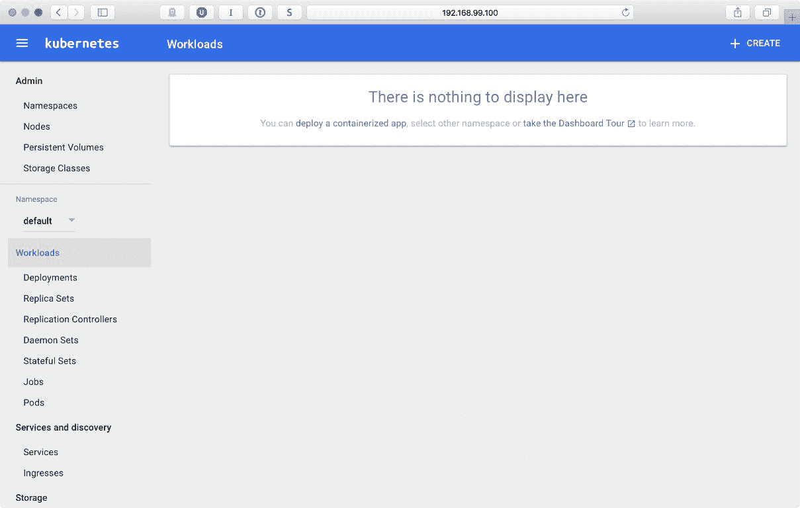**

如您所见，仪表板现在是空的。如果您浏览到命名空间菜单，您会注意到 Minikube 创建了一些命名空间，其中一个可用于我们的目的，简单地命名为默认。Minikube 安装的部分，例如 DNS 或仪表板，也在集群本身上运行，具有单独的命名空间，如 kube-public 和 kube-system。

随意浏览菜单和部分；目前还没有造成任何伤害，这是一个本地开发集群，什么都没有运行。我们将在本章的最后一节回到仪表板，看看我们如何可以使用它来从漂亮的 UI 部署我们的服务，如果你更喜欢这样做，而不是使用命令行的 shell。

当然，让集群空转是相当无用的，所以我们需要一个工具来管理它。虽然我们几乎可以使用仪表板来完成所有事情，但使用命令行工具会更方便。`kubectl`控制 Kubernetes 集群。我们将大量使用`kubectl`命令行工具来部署、调度和扩展我们的应用程序和微服务。该工具作为 Mac、Linux 和 Windows 的独立二进制文件提供。在下一节中，您将找到不同平台的安装说明。

# 安装 kubectl

`kubectl`适用于所有主要平台。让我们从 macOS 安装开始。

# 在 Mac 上安装

以下命令序列将下载`kubectl`二进制文件，设置可执行标志并将其复制到`/usr/local/bin`文件夹中，这将使其在 macOS shell 中可用：

```
$ curl -O https://storage.googleapis.com/kubernetes-release/release/v1.5.2

/bin/darwin/amd64/kubectl

$ chmod +x kubectl

$ sudo cp kubectl /usr/local/bin

```

Homebrew 提供了安装`kubectl`并保持其最新的最便捷方式。要安装，请使用此命令：

```
$ brew install kubectl

```

要更新，请使用以下命令：

```
$ brew upgrade kubectl

```

# 在 Windows 上安装

您可以在 GitHub 上找到 Windows `kubectl`的发布列表[`github.com/eirslett/kubectl-windows/releases`](https://github.com/eirslett/kubectl-windows/releases) 。与 Minikube 类似，kubectl 只是一个单独的`.exe`文件。在撰写本书时，它是[`github.com/eirslett/kubectl-windows/releases/download/v1.6.3/kubectl.exe`](https://github.com/eirslett/kubectl-windows/releases/download/v1.6.3/kubectl.exe) 。您需要下载`exe`文件并将其放在系统路径上，以便在命令行中使用。

# 在 Linux 上安装

安装过程与 macOS 非常相似。以下命令将获取`kubectl`二进制文件，给予可执行标志，然后将其移动到`/usr/local/bin`中，以便在 shell 中使用：

```
$ curl -O https://storage.googleapis.com/kubernetes-release/release/v1.5.2

/bin/linux/amd64/kubectl

$ chmod +x kubectl

$ sudo cp kubectl /usr/local/bin/kubectl

```

要验证您的本地集群是否已启动并且`kubectl`已正确配置，请执行以下命令：

```
$ kubectl cluster-info 

```

在输出中，您将获得有关集群的基本信息，包括其 IP 地址和运行的 Minikube 插件（我们将在本章后面再回到插件）：

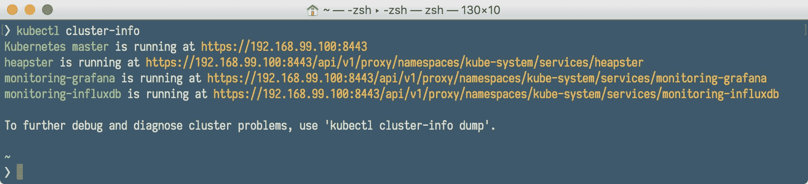

要列出我们集群中正在运行的节点，执行`get nodes`命令：

```
$ kubectl get nodes

```

当然，这只是一个单节点集群，所以在上一个命令的输出中没有什么意外：

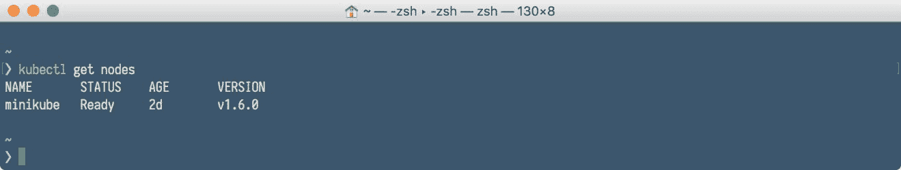

我们的集群已经启动运行了；现在是时候在上面部署我们的服务了。

# 在 Kubernetes 集群上部署

我们通过定义一个服务来开始在 Kubernetes 集群上部署我们的软件。正如您从第七章 *Kubernetes 简介*中记得的那样，服务将一组 Pods 抽象为单个 IP 和端口，允许简单的 TCP/UDP 负载，并允许 Pods 列表动态更改。让我们从创建服务开始。

# 创建服务

默认情况下，每个 Pod 只能在 Kubernetes 集群内部通过其内部 IP 地址访问。为了使容器可以从 Kubernetes 虚拟网络外部访问，我们需要将 Pod 公开为 Kubernetes 服务。要创建一个服务，我们将使用简单的`.yaml`文件，其中包含服务清单。YAML 是一种人类可读的数据序列化语言，通常用于配置文件。我们的 Java `rest-example`的示例服务清单可能看起来与以下内容相同：

```
apiVersion: v1

kind: Service

metadata:

 name: rest-example

 labels:

 app: rest-example

 tier: backend

spec:

 type: NodePort

 ports:

 - port: 8080

 selector:

 app: rest-example

 tier: backend

```

请注意，服务的清单不涉及 Docker 镜像。这是因为，正如您从第七章 *Kubernetes 简介*中记得的那样，Kubernetes 中的服务只是一个提供网络连接给一个或多个 Pod 的抽象。每个服务都有自己的 IP 地址和端口，其在服务的生命周期内保持不变。每个 Pod 都需要具有特定的标签，以便服务发现，服务使用和标签`selectors`来分组查找 Pods。在我们之前的示例中，`selector`将挑选出所有具有标签`app`值为`rest-example`和标签名为`tier`值为`backend`的 Pods：

```
selector:

 app: rest-example

 tier: backend

```

正如您在第七章中所记得的，*Kubernetes 简介*，Kubernetes 集群中的每个节点都运行一个 kube-proxy 进程。kube-proxy 在 Kubernetes 服务中扮演着至关重要的角色。它的目的是为它们公开虚拟 IP。自 Kubernetes 1.2 以来，iptables 代理是默认设置。您可以使用两种选项来设置代理：用户空间和 iptables。这些设置指的是实际处理连接转发的内容。在两种情况下，都会安装本地 iptables 规则来拦截具有与服务关联的目标 IP 地址的出站 TCP 连接。这两种模式之间有一个重要的区别：

+   代理模式：用户空间：在用户空间模式下，iptables 规则转发到一个本地端口，kube-proxy 正在监听连接。运行在用户空间的 kube-proxy 终止连接，与服务的后端建立新连接，然后将请求转发到后端，并将响应返回给本地进程。用户空间模式的优势在于，因为连接是从应用程序创建的，如果连接被拒绝，应用程序可以重试到不同的后端。

+   代理模式：iptables：在这种模式下，iptables 规则被安装直接将目的地为服务的数据包转发到服务的后端。这比将数据包从内核移动到 kube-proxy 然后再返回内核更有效，因此会产生更高的吞吐量和更好的尾延迟。然而，与用户空间模式不同，使用 iptables 模式会使得如果最初选择的 Pod 不响应，则无法自动重试另一个 Pod，因此它依赖于工作的就绪探针。

正如您所看到的，在这两种情况下，节点上都会运行 kube-proxy 二进制文件。在用户空间模式下，它会将自己插入为代理；在 iptables 模式下，它将配置 iptables 而不是自己代理连接。

服务类型可以具有以下值：

+   NodePort：通过指定`NodePort`服务类型，我们声明将服务暴露到集群外部。Kubernetes 主节点将从配置的标志范围（默认值：30000-32767）分配一个端口，集群的每个节点将代理该端口（每个节点上的相同端口号）到您的服务。

+   **负载均衡器**：这将在支持外部负载均衡器的云提供商（例如在 Amazon AWS 云上）上创建负载均衡器。在使用 Minikube 时，此功能不可用。

+   **Cluster IP**：这将仅在集群内部公开服务。这是默认值，如果您不提供其他值，将使用此值。

准备好我们的`service.yml`文件后，我们可以通过执行以下`kubectl`命令来创建我们的第一个 Kubernetes 服务：

```
$ kubectl create -f service.yml

```

要查看我们的服务是否正确创建，我们可以执行`kubectl get services`命令：

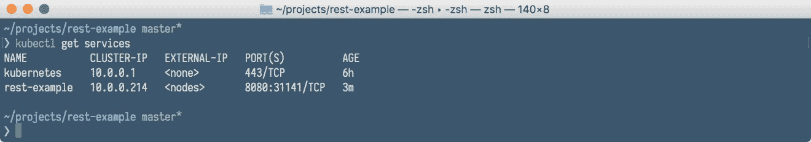

我们还可以通过添加`--all-namespaces`开关来列出其他服务（包括`minikube`集群本身提供的服务，如果您感兴趣）。

```
$ kubectl get services --all-namespaces

```

查看特定服务的详细信息，我们使用`describe`命令。执行以下命令以查看我们的`rest-example` Java 服务的详细信息：

```
$ kubectl describe service rest-example

```

在输出中，我们呈现了最有用的服务属性，特别是端点（我们的内部容器 IP 和端口，在这种情况下只有一个，因为我们有一个 Pod 在服务中运行），服务内部端口和代理的 NodePort：

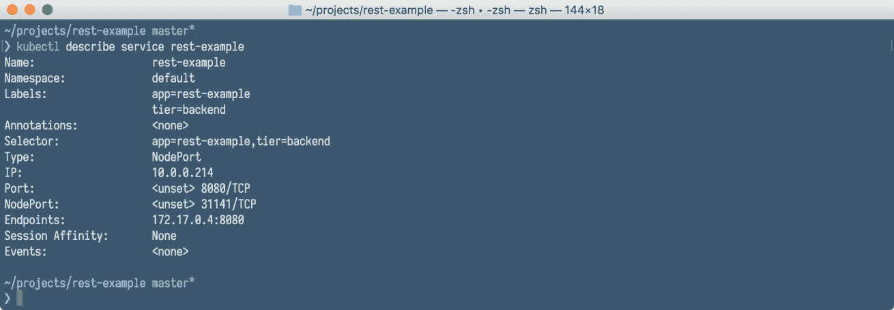

将所有设置放在`.yaml`文件中非常方便。但有时，需要以更动态的方式创建服务；例如在一些自动化流程中。在这种情况下，我们可以通过向`kubectl`命令本身提供所有参数和选项，手动创建服务，而不是首先创建`.yaml`文件。但在执行此操作之前，您需要先创建部署，因为手动创建服务只是使用`kubectl`命令公开部署。毕竟，服务是一个公开的部署，实际上只是一组 Pod。这样公开的示例，将导致服务创建，看起来与这个相同：

```
$ kubectl expose deployment rest-example--type="NodePort"

```

# 创建部署

在创建部署之前，我们需要准备好并发布到注册表的 Docker 镜像，例如 Docker Hub。当然，它也可以是您组织中托管的私有存储库。正如您从第七章中记得的，*Kubernetes 简介*，Pod 中的每个 Docker 容器都有自己的镜像。默认情况下，Pod 中的 kubectl 进程将尝试从指定的注册表中拉取每个镜像。您可以通过在部署描述符中为`imagePullPolicy`属性指定值来更改此行为。它可以具有以下值：

+   `IfNotPresent`：使用此设置，仅当本地主机上不存在图像时，才会从注册表中提取图像

+   `Never`：使用此选项，kubelet 将仅使用本地图像。

在创建部署时，使用值`IfNotPresent`设置`imagePullPolicy`很有用；否则，Minikube 将在查找本地主机上的图像之前尝试下载图像。

Kubernetes 使用与 Docker 本身相同的图像语法，包括私有注册表和标记。

重要的是您在图像名称中提供标记。否则，Kubernetes 将在存储库中查找图像时使用最新标记，与 Docker 一样。

在本地构建图像时，与本地 Kubernetes 集群一起工作会有点棘手。Minikube 在单独的 VM 中运行，因此它不会看到您在本地使用 Docker 在计算机上构建的图像。有一个解决方法。您可以执行以下命令：

```
$ eval $(minikube docker-env)

```

先前的命令实际上将利用在`minikube`上运行的 Docker 守护程序，并在 Minikube 的 Docker 上构建您的图像。这样，本地构建的图像将可供 Minikube 使用，而无需从外部注册表中提取。这并不是很方便，将 Docker 图像推送到`远程`注册表肯定更容易。让我们将我们的 rest-example 图像推送到`DockerHub`注册表。

1.  首先，我们需要登录：

```
$ docker login

```

1.  然后，我们将使用`docker tag`命令标记我们的图像（请注意，您需要提供自己的 DockerHub 用户名，而不是`$DOCKER_HUB_USER`）：

```
$ docker tag 54529c0ebed7 $DOCKER_HUB_USER/rest-example

```

1.  最后一步将是使用`docker push`命令将我们的图像推送到 Docker Hub：

```
$ docker push $DOCKER_HUB_USER/rest-example

```

1.  现在我们在注册表中有一个可用的图像，我们需要一个部署清单。这又是一个`.yaml`文件，看起来可能与此相同：

```
 apiVersion: extensions/v1beta1

kind: Deployment

metadata:

  name: rest-example

spec:

  replicas: 1

  template:

    metadata:

      labels:

        app: rest-example

        tier: backend

    spec:

      containers:

      - name: rest-example

        image: jotka/rest-example

        imagePullPolicy: IfNotPresent

        resources:

          requests:

            cpu: 100m

            memory: 100Mi

        env:

        - name: GET_HOSTS_FROM

          value: dns

        ports:

        - containerPort: 8080

```

在集群上使用`kubectl`创建此部署，您需要执行以下命令，与创建服务时完全相同，只是文件名不同：

```
$ kubectl create -f deployment.yml

```

！[](Image00089.jpg)

您可以查看部署属性：

```
$ kubectl describe deployment rest-service

```

！[](Image00090.jpg)

如您所见，已创建一个 Pod 以及一个 ReplicaSet 和默认的滚动更新策略。您还可以查看 Pods：

```
$ kubectl get pods

```

`get pods`命令的输出将给出部署中运行的 Pod 的名称。稍后这将很重要，因为如果要与特定的 Pod 交互，您需要知道其名称：

！[](Image00091.jpg)

作为`.yaml`文件中部署描述符的替代方案，您可以使用`kubectl run`命令和选项从命令行创建部署，如下例所示：

```
$ kubectl run rest-example --image=jotka/rest-example --replicas=1 --port=8080 --labels="app:rest-example;tier:backend" --expose 

```

让我们总结一下与创建资源和获取有关它们的信息相关的`kubectl`命令，以及一些示例，放在表中：

| **示例命令** | **意义** |
| --- | --- |
| `kubectl create -f ./service.yaml` | 创建资源 |
| `kubectl create -f ./service.yaml -f ./deployment.yaml` | 从多个文件创建 |
| `kubectl create -f ./dir` | 在指定目录中的所有清单文件中创建资源 |
| `kubectl create -f https://sampleUrl` | 从 URL 创建资源 |
| `kubectl run nginx --image=nginx` | 启动 nginx 的单个实例 |
| `Kubectl get pods` | 获取`pod`的文档 |
| `kubectl get pods --selector=app=rest-example` | 列出与指定标签`selector`匹配的所有 Pod |
| `kubectl explain pods` | 显示所有 Pod 的详细信息 |
| `kubectl get services` | 列出所有已创建的服务 |
| `kubectl explain service` | 显示指定服务的详细信息 |
| `kubectl explain services` | 显示所有已创建服务的详细信息 |
| `kubectl get deployments` | 列出所有已创建的部署 |
| `kubectl get deployment` | 显示指定服务的详细信息 |
| `kubectl explain deployment` | 显示指定部署的详细信息 |
| `kubectl explain deployments` | 显示所有已创建部署的详细信息 |
| `kubectl get nodes` | 列出所有集群节点 |
| `kubectl explain node` | 显示指定节点的详细信息 |

```
 Calling the service

```

正如我们在`kubectl describe service rest-example`命令输出中所看到的，我们的`rest-example service`可以通过端口`8080`和域名`rest-example`在集群内部访问。在我们的情况下，端点的完整 URL 将是`http://rest-example:8080`。然而，为了能够从外部世界执行服务，我们使用了`NodePort`映射，并且我们知道它被赋予了端口`31141`。我们所需要的只是集群的 IP 来调用服务。我们可以使用以下命令获取它：

```
$ minikube ip

```

有一个快捷方式可以了解外部可访问的服务 URL 和端口号。我们可以使用`minikube service`命令来告诉我们确切的服务地址：

```
$ minikube service rest-example --url

```

上一个命令的输出将是带有映射端口号的服务 URL。如果您跳过`--url`开关，`minikube`将只是使用您的默认 Web 浏览器打开服务的 URL。这有时很方便。

拥有端点的完整 URL 后，我们可以使用任何`HTTP`客户端（例如`curl`）访问服务：

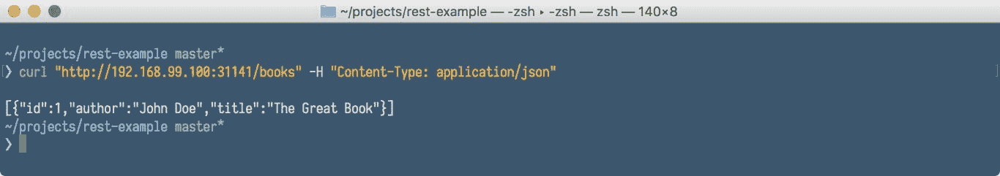

当服务运行时，应用程序日志通常可以帮助您了解集群内部发生了什么。日志对于调试问题和监视集群活动特别有用。让我们看看如何访问我们的容器日志。

# 与容器交互和查看日志

大多数现代应用程序都有某种日志记录机制。例如，我们的 Java REST 服务使用 slf4j 从 REST 控制器输出日志。容器化应用程序最简单和最简单的日志记录方法就是写入标准输出和标准错误流。Kubernetes 支持这一点。

假设我们已经使用浏览器或 curl 向我们的新 Web 服务发送了请求，现在应该能够看到一些日志。在此之前，我们需要有一个 Pod 的名称，在部署过程中会自动创建。要获取 Pod 的名称，请使用`kubectl get pods`命令。之后，您可以显示指定 Pod 的日志：

```
$ kubectl logs rest-example-3660361385-gkzb8

```

如您在以下截图中所见，我们将访问来自 Pod 中运行的服务的著名 Spring Boot 横幅：


查看日志并不是我们可以对特定 Pod 进行的唯一操作。与 Docker 类似（实际上，Pod 正在运行 Docker），我们可以使用`kubectl exec`命令与容器进行交互。例如，要获取正在运行的容器的 shell：

```
$ kubectl exec -it rest-example-3660361385-gkzb8 -- /bin/bash

```

上一个命令将把您的 shell 控制台附加到正在运行的容器中的 shell，您可以与之交互，例如列出进程，就像您在以下截图中所见的那样：

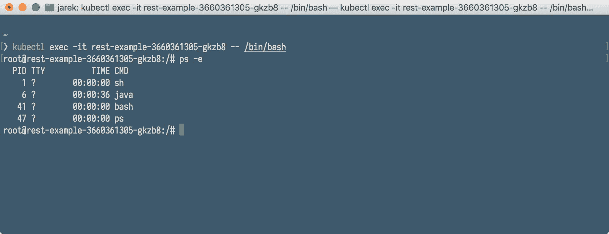

`kubectl exec`命令的语法与 Docker 中的`exec`命令非常相似，只有一个小差别，正如您从第七章中所记得的，*Kubernetes 简介*，一个 Pod 可以运行多个容器。在这种情况下，我们可以使用`--container`或`-c`命令开关来指定`kubectl exec`命令中的容器。例如，假设我们有一个名为`rest-example-3660361385-gkzb8`的 Pod。这个 Pod 有两个名为 service 和 database 的容器。以下命令将打开一个 shell 到 service 容器：

```
$ kubectl exec -it rest-example-3660361385-gkzb8 --container service -- /bin/bash

```

拥有查看日志和与容器交互的可能性为您提供了很大的灵活性，可以准确定位您在运行 Pod 时可能遇到的问题。让我们总结与查看日志和与 Pod 交互相关的 `kubectl` 命令表：

| **示例命令** | **意义** |
| --- | --- |
| `kubectl logs myPod` | 转储 pod 日志（stdout） |
| `kubectl logs myPod -c myContainer` | 转储 pod 容器日志（stdout，多容器情况） |
| `kubectl logs -f myPod` | 流式传输 pod 日志（stdout） |
| `kubectl logs -f myPod -c myContainer` | 流式传输 pod 容器日志（stdout，多容器情况） |
| `kubectl run -i --tty busybox --image=busybox -- sh` | 以交互式 shell 运行 pod |
| `kubectl attach myPod -i` | 连接到正在运行的容器 |
| `kubectl port-forward myPod 8080:8090` | 将 Pod 的端口 `8080` 转发到本地机器上的 `8090` |
| `kubectl exec myPod -- ls /` | 在现有 pod 中运行命令（单容器情况） |
| `kubectl exec myPod -c myContainer -- ls /` | 在现有 pod 中运行命令（多容器情况） |
| `kubectl top pod POD_NAME --containers` | 显示给定 pod 及其容器的指标 |

正如您已经知道的那样，Pod 和容器是脆弱的。它们可能会崩溃或被杀死。您可以使用 `kubectl` logs 命令检索具有 `--previous` 标志的容器的先前实例化的日志，以防容器崩溃。假设我们的服务运行良好，但由于第七章 *Kubernetes 简介* 中描述的原因，例如更高的负载，您决定增加运行的容器数量。Kubernetes 允许您增加每个服务运行的 Pod 实例的数量。这可以手动或自动完成。让我们首先关注手动扩展。

# 手动扩展

部署创建后，新的 ReplicaSet 也会自动创建。正如您在第七章 *Kubernetes 简介*中所记得的那样，ReplicaSet 确保在任何给定时间运行指定数量的 Pod 克隆，称为`副本`。如果太多，其中一些将被关闭。如果需要更多，例如如果其中一些因错误或崩溃而死亡，将创建新的 Pod。请注意，如果尝试直接扩展 ReplicaSet，那么它将（在很短的时间内）具有所需的 Pod 数量，例如三个。但是，如果部署控制器看到您已将副本集修改为三个，因为它知道应该是一个（在部署清单中定义），它将将其重置为一个。通过手动修改为您创建的副本集，您有点违背了系统控制器。

需要扩展部署而不是直接扩展副本集。

当然，我们的 Java `rest-example`服务将数据保存在内存中，因此它不是无状态的，因此它可能不是扩展的最佳示例；如果另一个实例被启动，它将拥有自己的数据。但是，它是一个 Kubernetes 服务，因此我们可以使用它来演示扩展。要将我们的`rest-example`部署从一个扩展到三个 Pod，请执行以下`kubectl scale`命令：

```
$ kubectl scale deployment rest-example --replicas=3

```

过一段时间，为了检查，执行以下命令，您将看到部署中现在运行着三个 Pod：

```
$ kubectl get deployments

$ kubectl get pods

```

在下表中，您可以看到与手动扩展相关的一些`kubectl`命令的更多示例：

| **示例命令** | **意义** |
| --- | --- |
| `kubectl scale deployment rest-example --replicas=3` | 将名为`rest-example`的部署扩展到`3`个 Pod |
| `kubectl scale --replicas=3 -f deployment.yaml` | 将`deployment.yaml`文件中指定的资源扩展到`3` |
| `kubectl scale deployment rest-example --current-replicas=2 --replicas=3` | 如果名为`rest-example`的部署当前大小为`2`，则将其扩展到`3`个 Pod |
| `kubectl scale --replicas=5 deployment/foo deployment/bar` | 一次扩展多个部署 |

如果服务负载增加，Kubernetes 可以自动进行扩展。

# 自动缩放

通过水平 Pod 自动缩放，Kubernetes 根据观察到的 CPU 利用率自动调整部署或 ReplicaSet 中 Pod 的数量。Kubernetes 控制器定期调整部署中 Pod“副本”的数量，以匹配观察到的平均 CPU 利用率与您指定的目标。

水平自动缩放器只是 Kubernetes 中的另一种资源类型，因此我们可以像创建其他资源一样使用`kubectl`命令创建它：

+   `kubectl get hpa`：列出自动缩放器

+   `kubectl describe hpa`：获取详细描述

+   `kubectl delete hpa`：删除自动缩放器

此外，还有一个特殊的`kubectl autoscale`命令，用于轻松创建水平 Pod 自动缩放器。一个示例可能是：

```
$ kubectl autoscale deployment rest-example --cpu-percent=50 --min=1 --max=10

```

上一个命令将为我们的`rest-example`部署创建一个自动缩放器，目标 CPU 利用率设置为`50%`，`副本`数量在`1`和`10`之间。

所有集群事件都被注册，包括手动或自动缩放产生的事件。查看集群事件在监视我们的集群上执行的确切操作时可能会有所帮助。

# 查看集群事件

查看集群事件，请输入以下命令：

```
$ kubectl get events

```

它将呈现一个巨大的表格，其中包含集群上注册的所有事件：

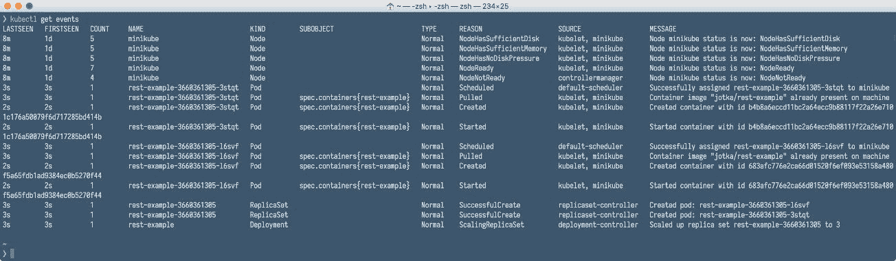

表格将包括节点状态的更改，拉取 Docker 镜像，启动和停止容器等事件。查看整个集群的情况非常方便。

# 使用 Kubernetes 仪表板

Kubernetes 仪表板是 Kubernetes 集群的通用、基于 Web 的 UI。它允许用户管理运行在集群中的应用程序并对其进行故障排除，以及管理集群本身。我们还可以编辑部署、服务或 Pod 的清单文件。更改将立即被 Kubernetes 接管，因此它使我们能够扩展或缩减部署，例如。

如果您使用`minikube dashboard`命令打开仪表板，它将在默认浏览器中打开一个仪表板 URL。从这里，您可以列出集群上的所有资源，例如部署、服务、Pod 等。正如您在下面的屏幕截图中所看到的，我们的仪表板不再是空的；我们有一个名为`rest-example`的部署：

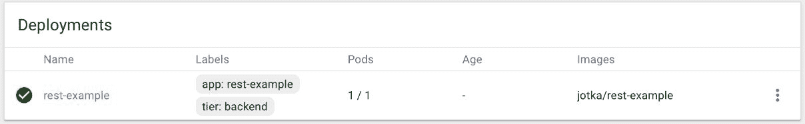

如果您点击它的名称，您将进入部署详细信息页面，它将显示您可以使用`kubectl describe deployment`命令获取的相同信息，但具有良好的 UI：


仪表板不仅是只读实用程序。每个资源都有一个方便的菜单，您可以使用它来删除或编辑其清单：

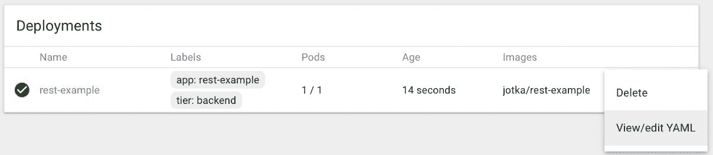

如果您选择查看/编辑 YAML 菜单选项，您将能够使用方便的编辑器编辑清单：

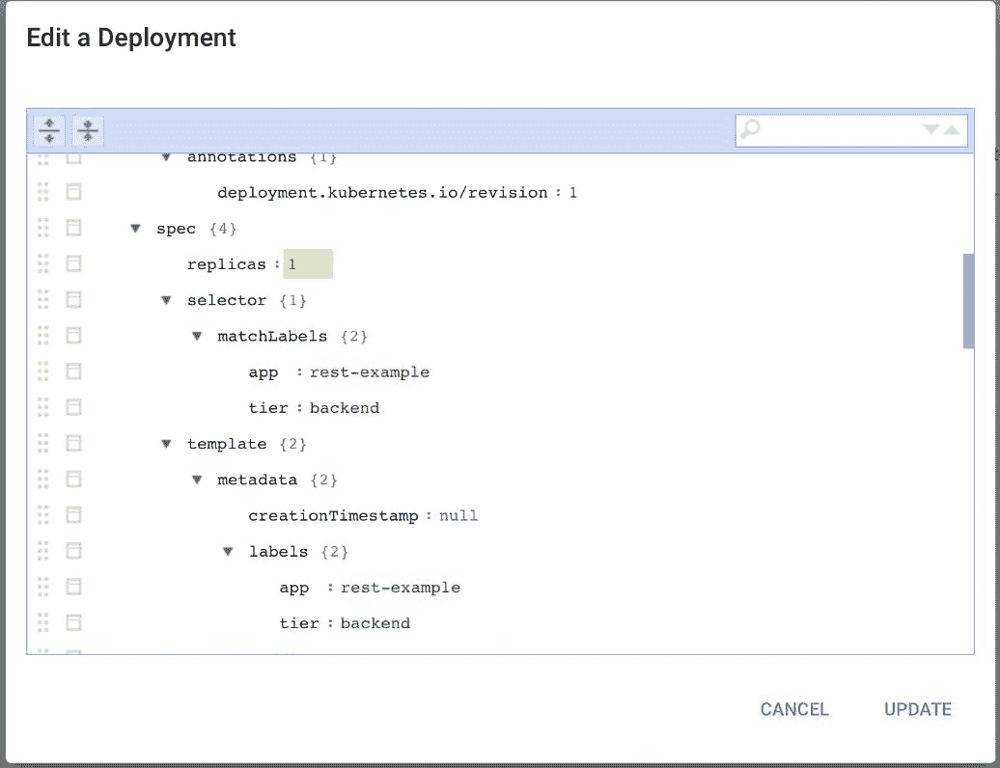

请注意，如果您更改一个值，例如`replicas`的数量，并单击“更新”，更改将被发送到 Kubernetes 并执行。这样，您也可以例如扩展您的部署。

由于部署已自动创建了一个 ReplicaSet，因此 ReplicaSet 也将显示在仪表板上：

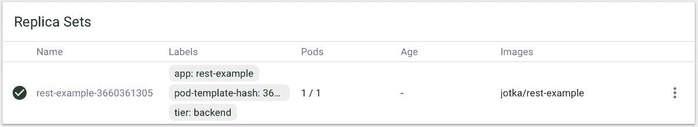

服务也是一样的。如果您浏览到服务菜单，它将显示在集群上创建的所有服务的列表：

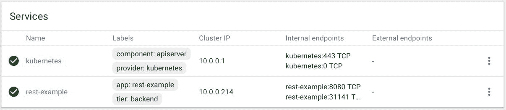

单击服务名称将带您转到详细信息页面：

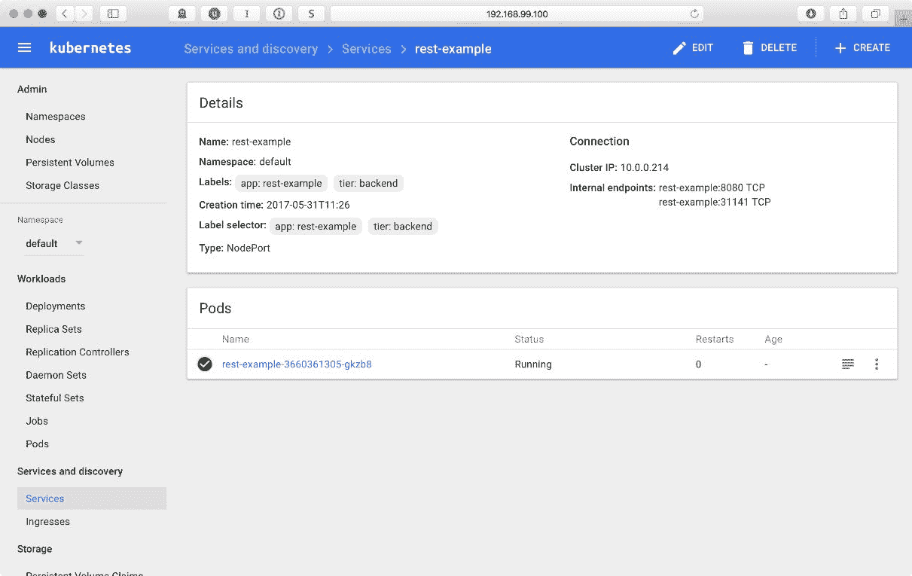

在详细信息屏幕上，列出了所有重要信息。这包括标签选择器，用于查找 Pod 的端口类型，集群 IP，内部端点，当然还有运行在服务内部的 Pod 的列表。通过单击 Pod 的名称，您可以查看正在运行的 Pod 的详细信息，包括其日志输出，如下面的屏幕截图所示：

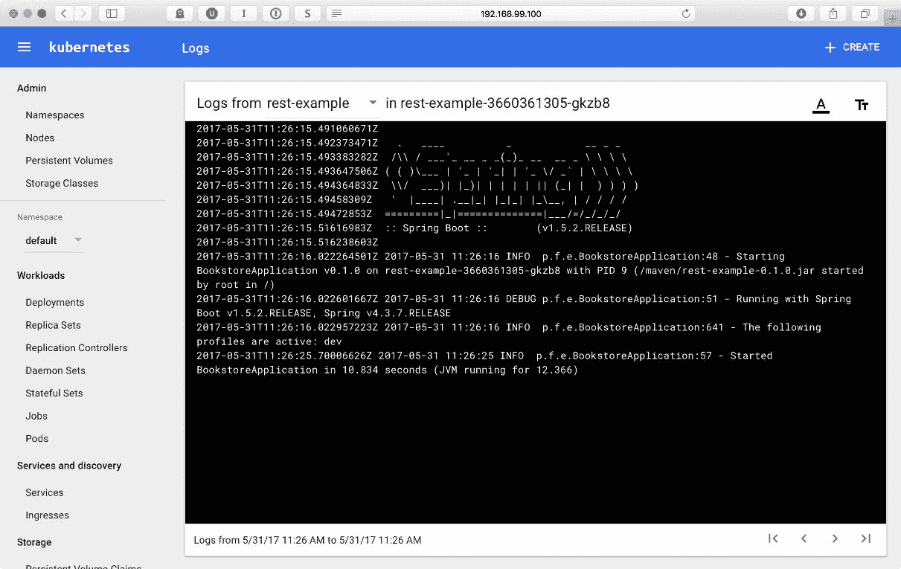

仪表板是一个非常方便的工具，可以与现有的部署、服务和 Pod 进行交互。但还有更多。如果您单击仪表板工具栏右上角的“创建”按钮，将显示一个“部署容器化应用程序”屏幕。从这里，您实际上可以创建一个新的部署：

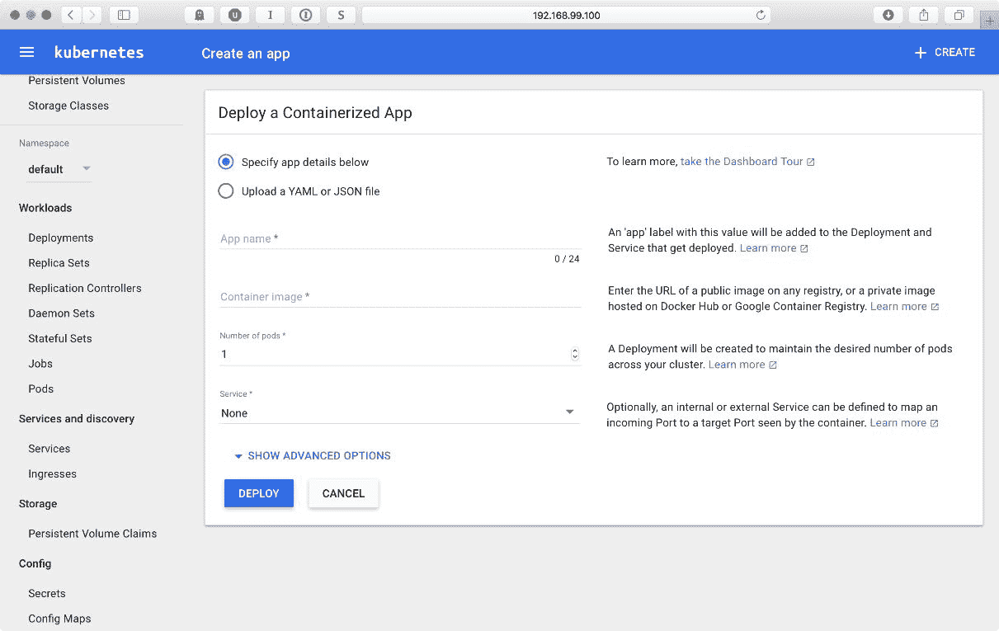

您有机会使用`.yaml`文件，就像我们之前使用命令行一样，但是您还可以手动指定部署的详细信息，提供应用程序名称，并且可以选择创建一个服务用于部署。相当方便，不是吗？仪表板只是 Minikube 可用的插件之一。让我们看看我们还有什么可以使用。

# Minikube 插件

Minikube 带有几个插件，例如 Kubernetes 仪表板，Kubernetes DNS 等。我们可以通过执行以下命令列出可用的插件：

```
$ minikube addons list

```

上一个命令的输出将列出可用的插件及其当前状态，例如：

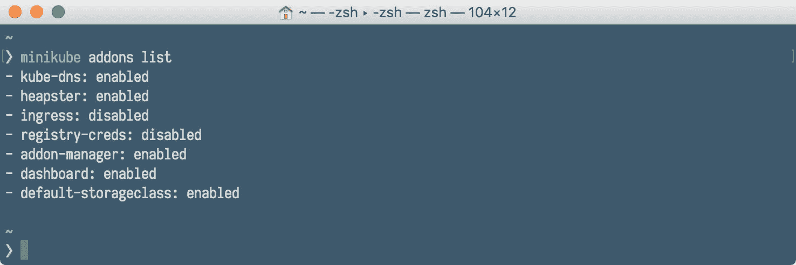

要启用或禁用插件，我们使用`minikube addons disable`或`minikube addons enable`，例如：

```
$ minikube addons disable dashboard

$ minikube addons enable heapster

```

如果插件已启用，我们可以通过执行`addon open`命令打开相应的 Web 用户界面，例如：

```
$ minikube addons open heapster

```

# 清理

如果您完成了部署和服务的操作，或者想要从头开始，您可以通过删除部署或服务来清理集群：

```
$ kubectl delete deployment rest-example

$ kubectl delete service rest-example

```

这段代码也可以合并成一个命令，例如：

```
$ kubectl delete service,deployment rest-example

```

`kubectl delete`支持标签`selectors`和命名空间。让我们在表中看一些命令的其他示例：

| **示例命令** | **含义** |
| --- | --- |
| `kubectl delete pod,service baz foo` | 删除具有相同名称`baz`和`foo`的 pod 和服务 |
| `kubectl delete pods,services -l name=myLabel` | 删除具有标签`name=myLabel`的 pod 和服务 |
| `kubectl -n my-ns delete po,svc --all` | 删除命名空间`my-ns`中的所有 pod 和服务 |

要停止`minikube`集群，只需发出：

```
$ minikube stop

```

如果您想要删除当前的`minikube`集群，可以发出以下命令来执行：

```
$ minikube delete

```

# 总结

正如您所看到的，Minikube 是尝试 Kubernetes 并在本地开发中使用它的简单方法。运行本地集群并不像开始时看起来那么可怕。最重要的是，本地的`minikube`集群是一个有效的 Kubernetes 集群。如果您通过在本地玩耍来了解 Kubernetes，您将能够在真实的云中部署您的应用程序而不会遇到任何问题。让我们总结一下我们需要执行的步骤，以使我们的 Java 应用程序在 Kubernetes 集群上运行。

首先，我们需要为我们的微服务编写一些代码。这可以基于您想要的任何内容，可以是在 Tomcat、JBoss 或 Spring Bootstrap 上运行的微服务。没关系，您只需选择您希望软件运行的技术：

+   接下来，将代码放入 Docker 镜像中。您可以通过手动创建 Dockerfile 来完成，也可以使用 Docker Maven 插件来自动化此过程

+   创建 Kubernetes 元数据，如部署清单和服务清单

+   通过部署和创建服务来应用元数据

+   根据您的需求扩展您的应用程序

+   从命令行或仪表板管理您的集群

在第九章中，*使用 Kubernetes API*，我们将深入了解 Kubernetes API。这是与 Kubernetes 集群进行交互的绝佳方式。由于 API 的存在，可能性几乎是无限的，您可以创建自己的开发流程，例如使用 Jenkins 进行持续交付。拥有 API，您不仅仅局限于现有工具来部署软件到 Kubernetes。事情可能会变得更有趣。
