# 在云中部署 Java 在 Kubernetes 上

在之前的章节中，我们已经成功在本地运行了 Kubernetes 集群。使用`minikube`是学习 Kubernetes 和在自己的机器上进行实验的好方法。由`minikube`支持的集群的行为与在服务器上运行的普通集群完全相同。然而，如果您决定在生产环境中运行集群软件，云是最佳解决方案之一。在本章中，我们将简要介绍在 Docker 上运行微服务的情况下使用云环境的优势。接下来，我们将在 Amazon AWS 上部署我们的 Kubernetes 集群。配置 AWS 并在其上运行 Kubernetes 并不是从一开始就最简单和直接的过程，但是，遵循本章将为您提供一个过程概述，您将能够快速运行自己的云集群，并在其上部署自己或第三方的 Docker 镜像。

涵盖的主题列表包括：

+   使用云、Docker 和 Kubernetes 的好处

+   安装所需工具

+   配置 AWS

+   部署集群

让我们从使用云部署的 Kubernetes 集群的优势开始。

# 使用云、Docker 和 Kubernetes 的好处

在 Kubernetes 集群上部署应用程序有其优势。它具有故障弹性、可扩展性和高效的架构。拥有自己的基础设施和使用云有什么区别？嗯，这归结为几个因素。首先，它可以显著降低成本。对于小型服务或应用程序，当不使用时可以关闭，因此在云中部署应用程序的价格可能更低，由于硬件成本更低，将更有效地利用物理资源。您将不必为不使用计算能力或网络带宽的节点付费。

拥有自己的服务器需要支付硬件、能源和操作系统软件的费用。Docker 和 Kubernetes 是免费的，即使用于商业目的；因此，如果在云中运行，云服务提供商的费用将是唯一的成本。云服务提供商经常更新其软件堆栈；通过拥有最新和最好的操作系统软件版本，您可以从中受益。

在计算能力或网络带宽方面，像亚马逊或谷歌这样的大型云提供商很难被击败。他们的云基础设施非常庞大。由于他们为许多不同的客户提供服务，他们购买大型高性能系统，其性能水平远高于小公司内部运行的水平。此外，正如您将在本章的后续部分中看到的，云提供商可以在几分钟甚至几秒钟内启动新的服务器或服务。因此，如果有需要，新的实例将以几乎对软件用户透明的方式被带到生活中。如果您的应用程序需要处理大量请求，有时在云中部署它可能是唯一的选择。

至于容错性，因为云提供商将其基础设施分布在全球各地（例如 AWS 区域，您将在本章后面看到），您的软件可以是无故障的。没有任何单一事故，如停电、火灾或地震，可以阻止您的应用程序运行。将 Kubernetes 加入到方程式中可以扩展部署的规模，增加应用程序的容错性，甚至将完全失败的机会降低到零。

让我们将软件移到云端。为此，我们需要先创建一个工具集，安装所需的软件。

# 安装工具

要能够在 Amazon EC2 上管理 Kubernetes 集群，我们需要先安装一些命令行工具。当然，也可以使用 Amazon EC2 的 Web 界面。启动集群是一个相当复杂的过程；您需要一个具有适当访问权限和权限的用户，用于集群状态的存储，运行 Kubernetes 主节点和工作节点的 EC2 实例等。手动完成所有操作是可能的，但可能会耗时且容易出错。幸运的是，我们有工具可以自动化大部分工作，这将是 AWS 命令行客户端（`awscli`）和`kops`，Kubernetes 操作，生产级 K8s 安装，升级和管理。不过有一些要求。`Kops`在 Linux 和 macOS 上运行，它是用 Go 编写的，就像 Docker 一样。`awscli`是用 Python 编写的，所以让我们先专注于 Python 安装。

# Python 和 PIP

运行 AWS 命令行工具（`awscli`），我们需要在我们的机器上安装`python3`。

它可能已经存在，您可以使用以下命令进行验证：

```
$ python3 --version

```

如果输出是`command not found`，最快的安装方法将是使用系统上的软件包管理器，例如 Debian/Ubuntu 上的`apt`，Fedora 上的`yum`，或 macOS 上的 Homebrew。如果您在 macOS 上工作并且尚未安装 Homebrew，我强烈建议您这样做；它是一个很棒的工具，可以让您轻松安装成千上万的软件包以及所有所需的依赖项。Homebrew 可以免费获取[`brew.sh/`](https://brew.sh/)。要安装它，请执行以下命令：

```
$ ruby -e "$(curl -fsSL https://raw.githubusercontent.com/Homebrew/install/master/install)"

```

从现在开始，您应该在 macOS 终端中可以使用`brew`命令。

要在 Linux 上使用`apt`软件包管理器（在 Debian 或 Ubuntu 上）安装 Python，请执行以下命令：

```
$ sudo apt-get update

$ sudo apt-get install python3.6

```

在 macOS 上，这将是以下命令：

```
$ brew install python3

```

安装 Python 的过程取决于您的计算机速度和互联网连接速度，但不应该花费太长时间。一旦安装了 Python，我们将需要另一个工具，即`pip`。`pip`是安装 Python 软件包的推荐工具。它本身是用 Python 编写的。您可以使用您选择的软件包管理器来安装它，例如在 Ubuntu 或 Debian 上执行以下命令：

```
$ sudo apt-get install python3-pip

```

安装`pip`的另一种方法是使用安装脚本。在这种情况下，Linux 和 macOS 的过程完全相同。首先，我们需要使用以下命令下载安装脚本：

```
$ curl -O https://bootstrap.pypa.io/get-pip.py

```

过一段时间，我们需要通过执行以下命令运行安装脚本：

```
$ python3 get-pip.py -user

```

过一段时间，`pip`应该可以在终端 shell 中使用。要验证它是否正常工作，请执行以下命令：

```
$ pip -V

or 

$ pip --version

```

现在我们已经安装并正常运行 Python 和 pip，是时候转向更有趣的事情了，安装 Amazon AWS 命令行工具。

# AWS 命令行工具

Amazon **AWS 命令行工具**（**awscli**）界面是管理 AWS 服务的统一工具。`awscli`是建立在 AWS SDK for Python 之上的，它提供了与 AWS 服务交互的命令。只需进行最小配置（实际上，提供登录 ID 和密码就足够了，我们马上就会做），您就可以开始使用 AWS 管理控制台 Web 界面提供的所有功能。此外，`awscli`不仅仅是关于 EC2，我们将用它来部署我们的集群，还涉及其他服务，例如 S3（存储服务）。

要安装`awscli`，执行以下`pip`命令：

```
$ pip3 install --user --upgrade awscli

```

过一会儿，`pip`将在驱动器的`python3`文件夹结构中下载并安装必要的文件。在 macOS 和 Python 3.6 的情况下，它将是`~/Library/Python/3.6/bin`。将此文件夹添加到您的`PATH`环境变量中非常方便，以便在 shell 中的任何位置都可以使用。这很简单；您需要编辑其中一个文件中的`PATH`变量，具体取决于您使用的 shell：

+   **Bash**：`.bash_profile`、`.profile`或`.bash_login`

+   **Zsh**：`.zshrc`

+   **Tcsh**：`.tcshrc`、`.cshrc`或`.login`

在 macOS 上，`PATH`条目可能看起来与此相同：

```
export PATH=~/Library/Python/3.6/bin/:$PATH

```

重新登录或启动新的终端后，您可以通过执行以下命令来验证`aws`命令是否可用：

```
$ aws -version

```

正如您在输出中所看到的，这将为您提供详细的`aws`命令行工具版本，还有它运行的 Python 版本：

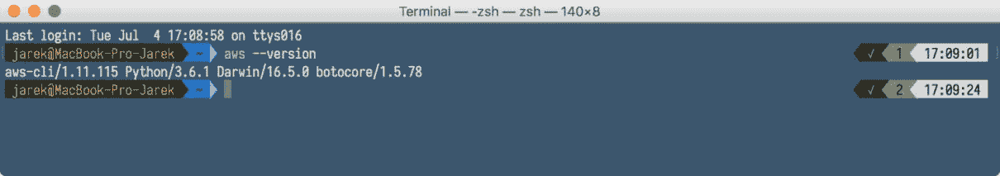

`awscli`已准备就绪，但我们还有一个工具要添加到我们的工具设置中。这将是 Kubernetes `kops`。

# Kops

Kubernetes 操作或简称`kops`是生产级 Kubernetes 安装、升级和管理工具。它是一个命令行实用程序，可帮助您在 AWS 上创建、销毁、升级和维护高可用的 Kubernetes 集群。该工具官方支持 AWS。您可以在 GitHub 上找到`kops`的发布版本：[`github.com/kubernetes/kops/releases`](https://github.com/kubernetes/kops/releases)

要在 macOS 或 Linux 上安装，您只需要下载二进制文件，更改权限为可执行，然后就完成了。例如，要下载，请执行：

```
$ wget \ https://github.com/kubernetes/kops/releases/download/1.6.1/kops-darwin-amd64 

$ chmod +x kops-darwin-amd64

$ mv kops-darwin-amd64 /usr/local/bin/kops

```

或者，如果您使用 Linux，请执行以下命令：

```
$ wget \ https://github.com/kubernetes/kops/releases/download/1.6.2/kops-linux-amd64

$ chmod +x kops-linux-amd64

$ mv kops-linux-amd64 /usr/local/bin/kops

```

另外，再次使用软件包管理器将是获取最新的`kops`二进制文件的最简单方法，例如在 macOS 上使用`brew`：

```
$ brew update && brew install kops

```

请注意，您必须安装`kubectl`（[`kubernetes.io/docs/tasks/tools/install-kubectl/`](https://kubernetes.io/docs/tasks/tools/install-kubectl/)）才能使`kops`正常工作。如果您使用软件包管理器，`kubectl`的依赖关系可能已经在`kops`软件包中定义，因此将首先安装`kubernetes-cli`。

最后一个工具是`jq`。虽然不是强制性的，但在处理 JSON 数据时非常有用。所有 AWS、Kubernetes 和`kops`命令都将发布和接收 JSON 对象，因此安装`jq`工具非常方便，我强烈建议安装`jq`。

# jq

`jq`是一个命令行 JSON 处理器。它的工作原理类似于 JSON 数据的`sed`；您可以使用它来过滤、解析和转换结构化数据，就像`sed`、`awk`或`grep`让您处理原始文本一样容易。`Jq`可在 GitHub 上找到[`stedolan.github.io/jq/`](https://stedolan.github.io/jq/)。安装非常简单；它只是一个单一的二进制文件，适用于 Windows、macOS 和 Linux。只需下载它并将其复制到系统`PATH`上可用的文件夹中，以便能够从 shell 或命令行中运行它。

假设在开始使用 kops 之前我们已经安装了所有工具，我们需要首先配置我们的 AWS 账户。这将创建一个管理员用户，然后使用`aws`命令行工具创建用于运行`kops`的用户。

# 配置 Amazon AWS

在设置 Kubernetes 集群之前，AWS 的配置基本上是创建一个用户。所有其他工作将由`kops`命令更多或更少地自动完成。在我们可以从命令行使用`kops`之前，最好有一个专门用于`kops`的用户。但首先，我们需要创建一个管理员用户。我们将从 Web 管理控制台进行操作。

# 创建一个管理员用户

根据您选择的 AWS 区域，AWS 管理控制台可在`console.aws.amazon.com`的子域上使用，例如[`eu-central-1.console.aws.amazon.com`](https://eu-central-1.console.aws.amazon.com)。登录后，转到安全、身份和合规性部分的 IAM 页面，然后切换到用户页面，然后单击“添加用户”按钮。

您将看到用户创建屏幕：

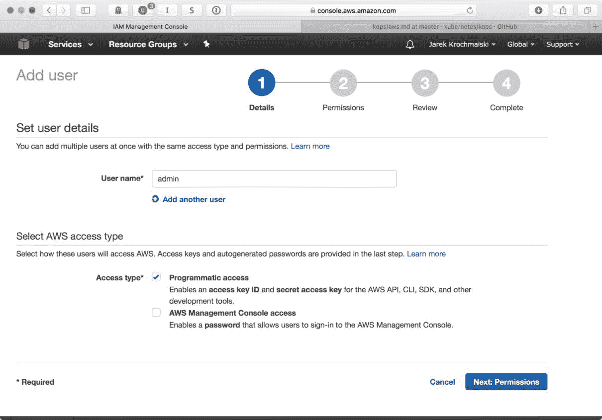

我们将需要这个用户来使用`awscli`，所以我们需要标记的唯一选项是程序化访问。单击“下一步：权限”，让我们通过将其添加到`admin`组来为我们的`admin`用户提供完整的管理权限。

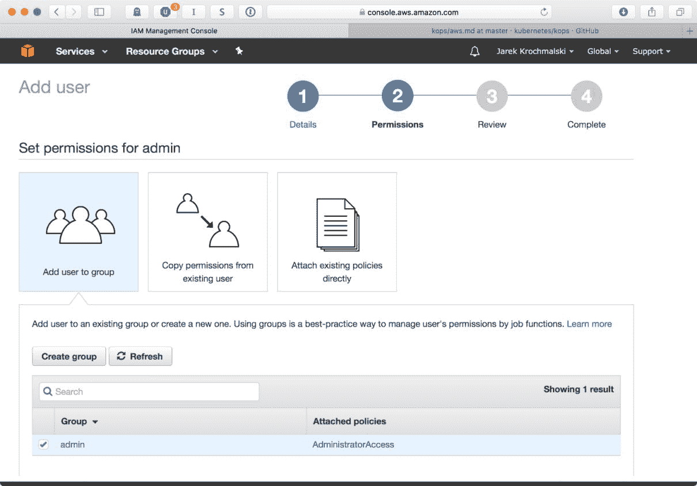

在用户创建向导的最后一页，您将能够看到访问密钥 ID 和秘密访问密钥 ID。不要关闭页面，我们将在短时间内需要两者来使用`awscli`进行身份验证：

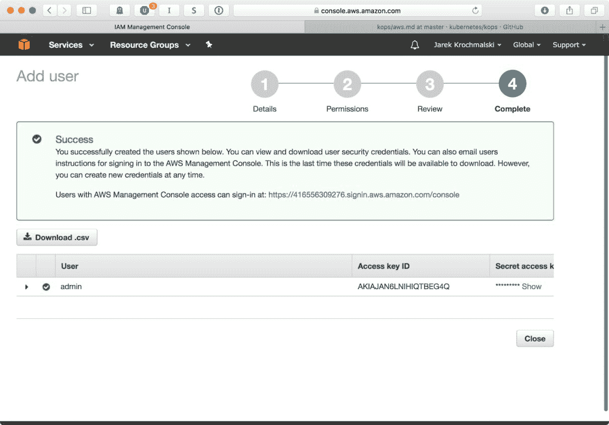

就是这样。我们已经创建了一个具有所有管理权限的管理员用户，并获得了访问密钥。这就是我们使用`awscli`管理 AWS 实例所需要的一切。使用`admin`用户运行`kops`可能不是最好的主意，所以让我们为此创建一个单独的用户。然而，这次我们将从命令行进行操作。与在 Web 控制台上点击 UI 相比，这将更加容易。首先，让我们使用管理员用户的 Access Key ID 和`Secret access key ID`进行身份验证，这些信息显示在用户创建向导的最后一页上。

# 为 kops 创建用户

`kops`用户需要在 AWS 中具有以下权限才能正常运行：

+   `AmazonEC2FullAccess`

+   `AmazonS3FullAccess`

+   `AmazonRoute53FullAccess`

+   `IAMFullAccess`

+   `AmazonVPCFullAccess`

首先，我们将创建一个名为`kops`的组，并为该组分配所需的权限。执行以下命令列表来创建一个组并分配权限：

```
$ aws iam create-group --group-name kops

$ aws iam attach-group-policy --policy-arn $ arn:aws:iam::aws:policy/AmazonEC2FullAccess --group-name kops

$ aws iam attach-group-policy --policy-arn arn:aws:iam::aws:policy/AmazonS3FullAccess --group-name kops

$ aws iam attach-group-policy --policy-arn arn:aws:iam::aws:policy/AmazonRoute53FullAccess --group-name kops

$ aws iam attach-group-policy --policy-arn arn:aws:iam::aws:policy/IAMFullAccess --group-name kops

$ aws iam attach-group-policy --policy-arn arn:aws:iam::aws:policy/AmazonVPCFullAccess --group-name kops

```

`create-group`命令将给您一些 JSON 响应，但是如果一切顺利，当将权限（组策略）附加到组时将不会有响应：

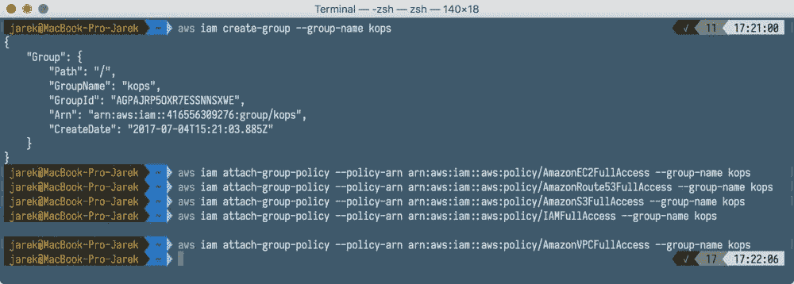

接下来，让我们创建`kops` IAM 用户并将用户添加到`kops`组，使用以下命令：

```
$ aws iam create-user --user-name kops

$ aws iam add-user-to-group --user-name kops --group-name kops

```

如果您感兴趣，现在可以登录到 Web AWS 控制台。您会看到我们的`kops`用户拥有我们需要的所有权限：

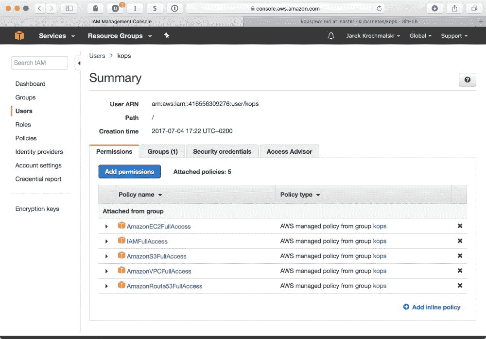

要列出所有注册用户，请执行以下命令：

```
$ aws iam list-users 

```

正如您在以下截图中所看到的，我们现在应该有两个用户：`admin`和`kops`：

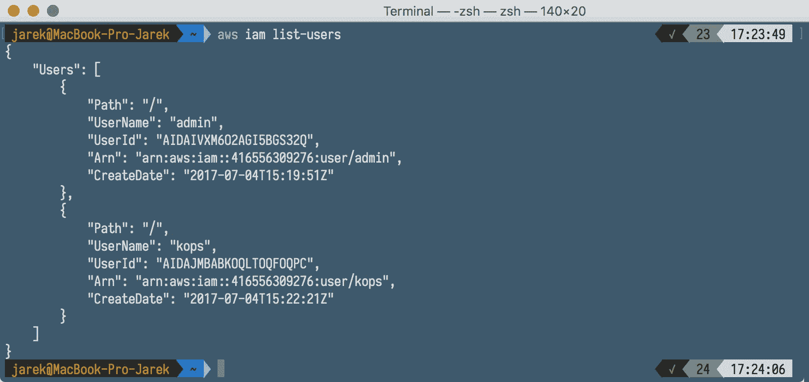

关于我们的新`kops`用户，我们需要做的最后一件事就是生成访问密钥。我们将需要它们来使用`aws configure`命令进行身份验证。执行以下操作为`kops`用户生成访问密钥：

```
$ aws iam create-access-key --user-name kops

```

正如您在以下截图中所看到的，AWS 将以包含`AccessKeyId`和`SecretAccessKey`的 JSON 响应进行回答；在使用`aws configure`命令进行身份验证时，我们将需要这两者：

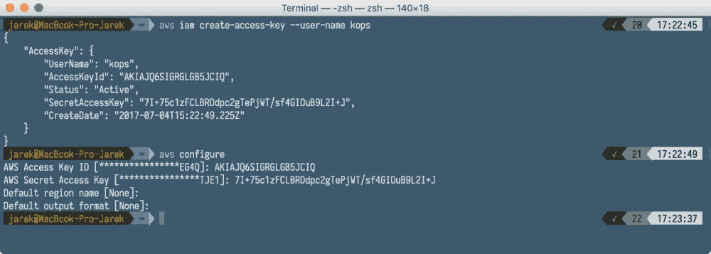

现在我们需要做的就是使用`aws configure`命令进行身份验证，提供我们在响应中获得的`AccessKeyId`和`SecretAccessKey`。执行以下操作：

```
$ aws configure 

```

因为`aws configure`命令不会为`kops`导出这些变量以供使用，所以我们现在需要导出它们：

```
$ export AWS_ACCESS_KEY_ID=<access key>

$ export AWS_SECRET_ACCESS_KEY=<secret key>

```

就是这样，我们已经使用名为`kops`的新用户进行了身份验证，该用户具有启动 Kubernetes 集群所需的所有权限。从现在开始，我们执行的每个`kops`命令都将使用 AWS `kops`用户。现在是时候回到重点并最终创建我们的集群了。

# 创建集群

我们将创建一个包含一个主节点和两个工作节点的简单集群。要使用`kops`进行操作，我们需要：

+   用户配置文件在`~/.aws/credentials`中声明（如果您使用`aws configure`进行身份验证，则会自动完成）。

+   用于存储`kops`集群状态的 S3 存储桶。为了存储我们集群及其状态的表示，我们需要创建一个专用的 S3 存储桶供`kops`使用。这个存储桶将成为我们集群配置的真相来源。

+   已配置 DNS。这意味着我们需要在同一 AWS 账户中拥有一个 Route 53 托管区域。Amazon Route 53 是一个高可用性和可扩展的云**域名系统**（**DNS**）网络服务。Kops 将使用它来创建集群所需的记录。如果您使用更新的 kops（1.6.2 或更高版本），则 DNS 配置是可选的。相反，可以轻松地创建一个基于 gossip 的集群。为了简单起见，我们将使用基于 gossip 的集群。为了使其工作，集群名称必须以`k8s.local`结尾。让我们看看关于 DNS 设置的其他选项。

# DNS 设置

基本上，我们的集群域名有四种可能的情况：托管在 AWS 上的根域，托管在 AWS 上的域的子域，在其他地方托管的域使用亚马逊 Route 53，最后，在 Route 53 中设置集群的子域，同时在其他地方设置根域。现在让我们简要地看一下这些设置。

# 托管在 AWS 上的根域

如果您在 AWS 上购买并托管了您的域名，那么您可能已经自动配置了 Route 53。如果您想要使用此根级域名用于您的集群，您无需做任何操作即可使用该域名与您的集群。

# 托管在 AWS 上的域的子域

如果您在 AWS 上购买并托管了您的域名，但想要将子域用于集群，您需要在 Route 53 中创建一个新的托管区域，然后将新路由委派给这个新区域。基本上就是将您的子域的 NS 服务器复制到 Route 53 中的父域。假设我们的域是[mydomain.com](http://www.mydomain.com/)；我们首先需要获取一些信息。请注意，当执行`aws`命令时，现在`jq`命令行工具非常方便。首先，我们需要我们主要父区域的 ID：

```
$ aws route53 list-hosted-zones | jq '.HostedZones[] \ 

| select(.Name=="mydomain.com.") | .Id'

```

要创建新的子域，请执行以下操作：

```
$ aws route53 create-hosted-zone --name myservice.mydomain.com \ 

--caller-reference $ID | jq .DelegationSet.NameServers

```

请注意，上一个命令将列出新域的名称服务器。如果您之前创建了子域，并且想要列出名称服务器（以便首先将 NS 服务器列表复制到父区域，我们需要知道它们），请执行以下命令以获取子域区域 ID：

```
$ aws route53 list-hosted-zones | jq '.HostedZones[] | \ select(.Name==" myservice.mydomain.com.") | .Id'

```

有了子域区域的 ID，我们可以通过执行以下命令列出其名称服务器：

```
$ aws route53 get-hosted-zone --id <your-subdomain-zoneID> \

| jq .DelegationSet.NameServers

```

到目前为止，我们有父区域的区域 ID，子域区域的 ID 和子域名称服务器列表。我们准备好将它们复制到父区域中了。最方便的方法是准备 JSON 文件，因为输入内容相当长。文件将如下所示：

```
{

 "Changes": [

 {

 "Action": "CREATE",

 "ResourceRecordSet": {

 "Name": "myservice.mydomain.com",

 "Type": "NS",

 "TTL": 300,

 "ResourceRecords": [

 {

 "Value": "ns-1.awsdns-1.com"

 },

 {

 "Value": "ns-2.awsdns-2.org"

 },

 {

 "Value": "ns-3.awsdns-3.com"

 },

 {

 "Value": "ns-4.awsdns-4.net"

 }

 ]

 }

 }

 ]

}

```

您需要将此保存为文件，比如`my-service-subdomain.json`，并执行最后一个命令。它将把名称服务器列表复制到父区域中。

```
$ aws route53 change-resource-record-sets 

--change-batch file://my-service-subdomain.json \

--hosted-zone-id <your-parent-zone-id>

```

一段时间后，所有发送到`*.myservice.mydomain.com`的网络流量将被路由到 AWS Route 53 中正确的子域托管区域。

# 使用另一个注册商购买的域名的 Route 53

如果您在其他地方购买了域名，并且想要将整个域专用于您的 AWS 托管集群，情况可能会有些复杂，因为此设置要求您在另一个域名注册商处进行重要更改。

如果您的域名注册商也是域名的 DNS 服务提供商（实际上，这种情况非常常见），建议在继续域名注册转移过程之前将您的 DNS 服务转移到 Amazon Route 53。

这样做的原因是，当您转移注册时，之前的注册商可能会在他们收到来自 Route 53 的转移请求后禁用该域的 DNS 服务。因此，您在该域上拥有的任何服务，如 Web 应用程序或电子邮件，可能会变得不可用。要将域注册转移到 Route 53，您需要使用 Route 53 控制台，该控制台位于[`console.aws.amazon.com/route53/`](https://console.aws.amazon.com/route53/)。在导航窗格中，选择 Registered Domains，然后选择 Transfer Domain，并输入您想要转移的域的名称，然后单击 Check。如果该域不可转移，控制台将列出可能的原因以及处理它们的推荐方法。如果一切正常并且该域可以转移，您将有选项将其添加到购物车中。然后，您需要输入一些详细信息，例如您的联系信息，用于转移的授权代码（您应该从之前的注册商那里获取），以及名称服务器设置。我强烈建议选择 Route 63 托管的 DNS 服务器，因为它非常容易配置且可靠。Route 63 将负责与您之前的注册商进行通信，但您可能会收到一些需要确认的电子邮件。转移过程可能需要更长的时间，但完成后，您可以继续以与前两种情况相同的方式配置基于 AWS 的集群的域。

# AWS Route 53 中集群的子域，域名在其他地方

如果您在亚马逊以外的注册商那里注册了您的域，并且想要使用该域的子域指向您的集群，您需要修改您注册商中的名称服务器条目。这将需要在 Route 53 中创建一个新的托管区子域，然后将该子域的名称服务器记录迁移到您的注册商。

与托管在 AWS 上的域上的子域类似，让我们首先创建一个子域，通过执行以下命令：

```
$ aws route53 create-hosted-zone \

--name myservice.mydomain.com \

--caller-reference $ID | jq .DelegationSet.NameServers

```

上一个命令的输出将列出子域的名称服务器。您需要登录到您的注册商设置页面，并创建一个新的子域，提供从上一个命令中收到的四个名称服务器记录。您可以在您特定的注册商帮助指南中找到有关如何编辑您域的名称服务器的详细说明。

之前的指南应该使您的集群在特定域或子域下可用。然而，在本章的其余部分，我们将运行基于流言的集群。

在 AWS 上创建任何内容之前，我们必须查看可用的区域。您应该知道，Amazon EC2 托管在全球多个位置。这些位置由区域和可用区组成。每个区域是一个单独的地理区域。每个区域都有多个隔离的位置，称为可用区。您可以选择您想要的位置，但首先，您需要检查可用的区域。现在让我们这样做。

# 检查区域的可用性

要列出特定区域可用的区域，请执行以下命令：

```
$ aws ec2 describe-availability-zones --region eu-central-1

```

如您在以下截图中所见，AWS 将在响应中列出可用的区域：

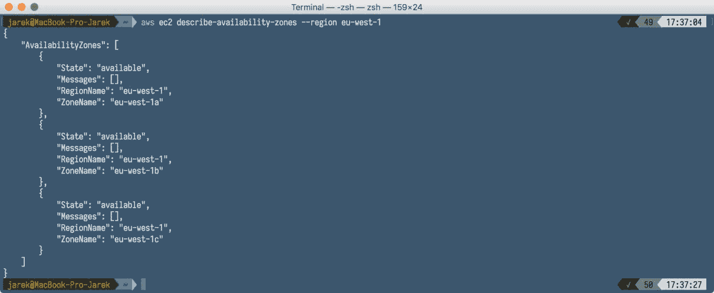

# 创建存储

我们的集群需要在某个地方存储其状态。Kops 使用 Amazon S3 存储桶来实现这一目的。S3 存储桶是**Amazon Web Services**（**AWS**）对象存储服务**Simple Storage Solution**（**S3**）中的逻辑存储单元。存储桶用于存储对象，对象由描述数据的数据和元数据组成。要创建一个存储桶，请执行以下`aws`命令：

```
$ aws s3api create-bucket \

--bucket my-cluster-store \

--region eu-central-1 \

--create-bucket-configuration LocationConstraint=eu-central-1

```

如您在以下截图中所见，AWS 将向您提供有关存储位置的简明信息：


创建存储后，我们需要在创建集群时使其对`kops`可用。为此，我们需要将存储桶的名称导出到`KOPS_STATE_STORE`环境变量中：

```
$ export KOPS_STATE_STORE=s3://my-cluster-store

```

我们现在准备创建一个集群。

在你记得的时候，我们将使用基于流言的集群，而不是配置的 DNS，因此名称必须以`k8s.local`结尾。

# 创建一个集群

首先将我们的集群名称导出到环境变量中。这将很有用，因为我们经常会引用集群的名称。执行以下命令导出集群名称：

```
$ export NAME=my-rest-cluster.k8s.local

```

`kops create cluster`是我们将用来创建集群的命令。请注意，这不会影响我们的 Amazon EC2 实例。该命令的结果只是一个本地集群模板，我们可以在在 AWS 上进行真正的物理更改之前进行审查和编辑。

命令的语法非常简单：

```
$ kops create cluster [options]

```

该命令有很多选项；您可以在 GitHub 上始终找到最新的描述，网址为[`github.com/kubernetes/kops/blob/master/docs/cli/kops_create_cluster.md`](https://github.com/kubernetes/kops/blob/master/docs/cli/kops_create_cluster.md) 。让我们专注于最重要的几个：

| **选项** | **描述** |
| --- | --- |
| `--master-count [number]` | 设置主节点的数量。默认值是每个主区域一个主节点。 |
| `--master-size [string]` | 设置主节点的实例大小，例如：`--master-size=t2.medium` 。 |
| `--master-volume-size [number]` | 设置主节点实例卷大小（以 GB 为单位）。 |
| `--master-zones [zone1,zone2]` | 指定要运行主节点的 AWS 区域（这必须是奇数）。 |
| `--zones [zone1,zone2 ]` | 用于运行集群的区域，例如：`--zones eu-central-1a,eu-central-1b` 。 |
| `--node-count [number]` | 设置节点的数量。 |
| `--node-size [string]` | 设置节点的实例大小，例如：`--node-size=t2.medium` 。 |
| `--node-volume-size int32` | 设置节点的实例卷大小（以 GB 为单位）。 |

如果您想将您的集群设置为私有的（默认情况下是公共的），您还需要考虑使用以下选项：

| **选项** | **描述** |
| --- | --- |
| `--associate-public-ip [true&#124;false]` | 指定是否要为您的集群分配公共 IP。 |
| `--topology [public&#124;private]` | 指定集群的内部网络拓扑，可以是`public`或`private`。 |
| `--bastion` | `--bastion`标志启用了一个堡垒实例组。该选项仅适用于私有拓扑。它将为集群实例的 SSH 访问生成一个专用的 SSH 跳转主机。跳转主机提供了进入集群私有网络的入口点。它可以启动和停止，以启用或禁用来自互联网的入站 SSH 通信。 |

现在让我们使用以下命令创建我们的集群：

```
$ kops create cluster --v=0 \

--cloud=aws --node-count 2 \

--master-size=t2.medium \

--master-zones=eu-central-1a \

--zones eu-central-1a,eu-central-1b  \

--name=${NAME} \

--node-size=t2.medium

```

在响应中，`kops`将列出已创建的配置的所有细节，并建议您可以采取的新集群配置的一些下一步操作：

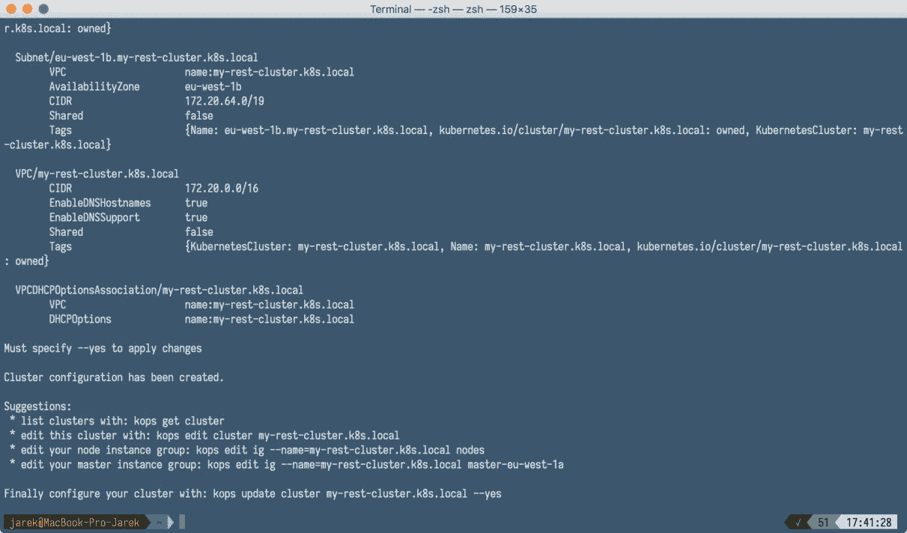

运行命令后，`kops`将配置您的`kubectl` Kubernetes 客户端指向您的新集群；在我们的示例中，这将是`my-rest-cluster.k8s.local`。

正如我们之前所说，在这个阶段，只创建了集群的模板，而不是集群本身。您仍然可以通过编辑您的集群来更改任何选项：

```
$ kops edit cluster my-rest-cluster.k8s.local

```

这将启动你在 shell 中定义的默认编辑器，在那里你可以看到已生成的集群模板。它将包含更多的设置，不仅仅是你在运行`cluster create`命令时指定的那些：

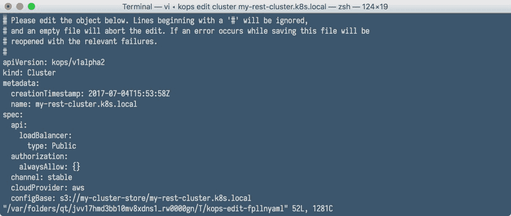

如果你对你的集群模板满意，现在是时候启动它，创建真正的基于云的资源，比如网络和 EC2 实例。一旦基础设施准备好，`kops`将在 EC2 实例上安装 Kubernetes。让我们开始吧。

# 启动集群

要启动集群并启动所有必要的 EC2 实例，你需要执行`update`命令。`kops`手册建议你首先在预览模式下执行，不要使用`--yes`开关。这不会启动任何 EC2 实例：

```
$ kops update cluster ${NAME} 

```

如果一切看起来正确，使用`--yes`开关执行更新命令：

```
$ kops update cluster ${NAME} --yes

```

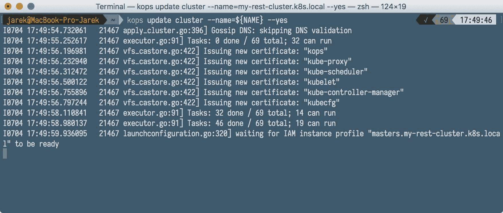

你的集群正在启动，应该在几分钟内准备就绪。如果你现在登录到 WAS 管理控制台，你会看到你的 EC2 实例正在启动，就像你在下面的截图中看到的那样：

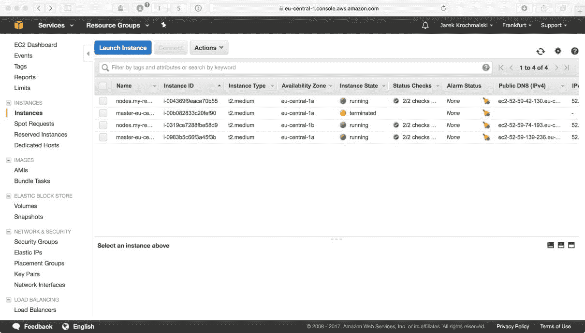

你也可以通过发出以下命令来检查整个集群状态：

```
$ kops validate cluster

```

输出将包含有关集群节点数量和状态的信息，包括主节点：

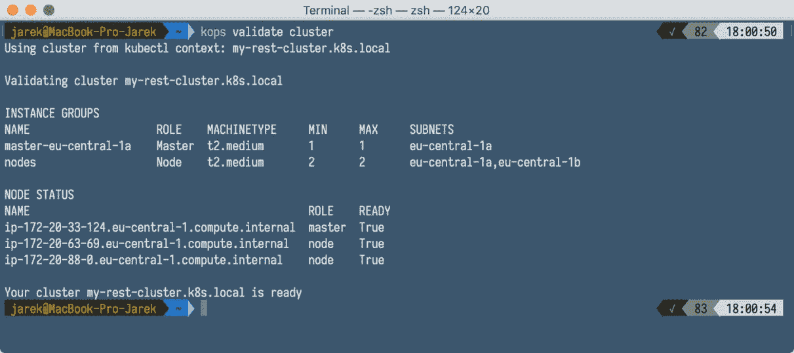

当然，由于`kubectl`现在配置为在我们的 AWS 集群上操作，我们可以使用`kubectl get nodes`命令列出节点，就像我们在第九章中使用`minikube`基础集群一样。执行以下命令：

```
$ list nodes: kubectl get nodes --show-labels

```

将会给你提供有关你的集群节点名称和状态的信息：

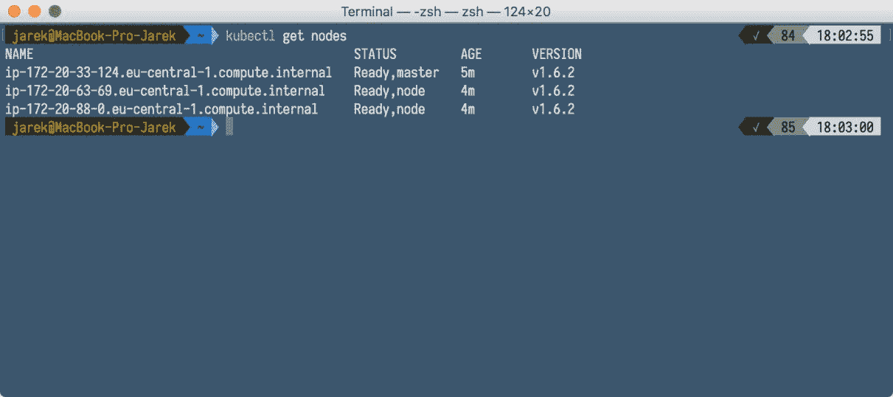

# 更新集群

`Kops`的行为类似于`kubectl`；你可以在编辑器中编辑配置文件，然后再实际对集群进行任何更改。`kops update`命令将应用配置更改，但不会修改正在运行的基础设施。要更新运行中的集群，你需要执行`rolling-update`命令。以下将启动集群基础设施的更新或重建过程：

```
 $ kops 

rolling

-

update 

cluster

 –

yes 

```

我们的新集群正在运行，但是它是空的。让我们部署一些东西。

# 安装仪表板

当集群运行时，部署一个仪表板会很好，以查看您的服务、部署、Pod 等的状态。仪表板默认包含在 `minikube` 集群中，但是在我们全新的亚马逊集群上，我们需要手动安装它。这是一个简单的过程。由于我们已经配置了 `kubectl` 来操作远程集群，我们可以使用 `kubernetes-dashboard.yaml` 模板作为输入执行以下 `kubectl create` 命令：

```
$ kubectl create -f \

https://rawgit.com/kubernetes/dashboard/master/src/deploy

kubernetes-dashboard.yaml

```

接下来要做的事情是代理网络流量，使用我们已经知道的以下 `kubectl proxy` 命令：

```
$ kubectl proxy

```

就是这样！过一会儿，仪表板将被部署，我们将能够使用本地主机地址访问它：

`http://localhost:8001/`，如下截图所示，是我们在第九章中已经看到的相同的仪表板，*使用 Kubernetes API*：

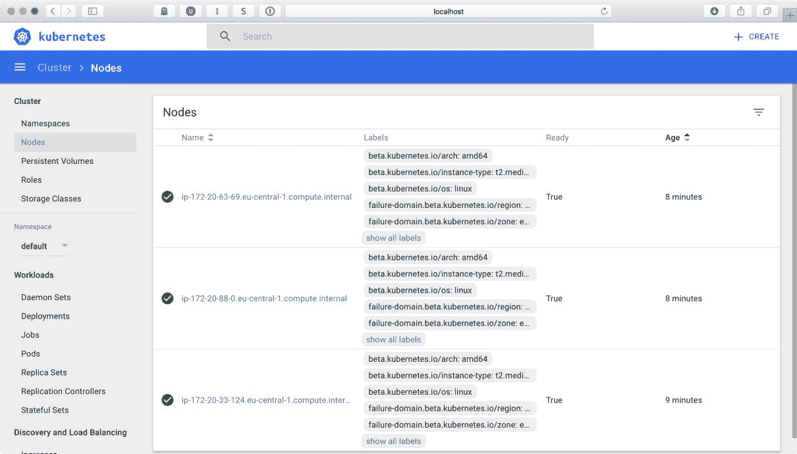

从现在开始，您可以使用 `kubectl` 和仪表板来管理您的集群，就像我们在第九章中所做的那样，*使用 Kubernetes API*。所有 `kubectl create` 命令将与本地集群一样工作。但是，这一次，您的软件将部署到云端。

如果您决定删除集群，请执行以下命令：

```
$ kops delete cluster -name=${NAME} --yes

```

请注意，如果您只是创建了集群模板，而没有首先执行 `kops update cluster ${NAME} --yes`，您也可以删除集群，如下截图所示：

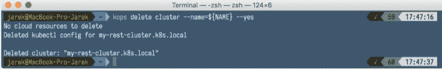

如果集群已经在亚马逊上创建，删除过程将需要更长时间，因为首先需要关闭所有主节点和工作节点的 EC2 实例。

# 摘要

在本章中，我们在真正的云端，亚马逊 AWS 上设置了一个集群。`Kops`是我们目前可用的最好的工具之一，用于在 AWS 上管理 Kubernetes。使用它，您可以轻松地在 AWS 上创建和管理集群。它可以是一个测试或生产级别的集群；`kops`将使其创建和管理变得轻而易举。
