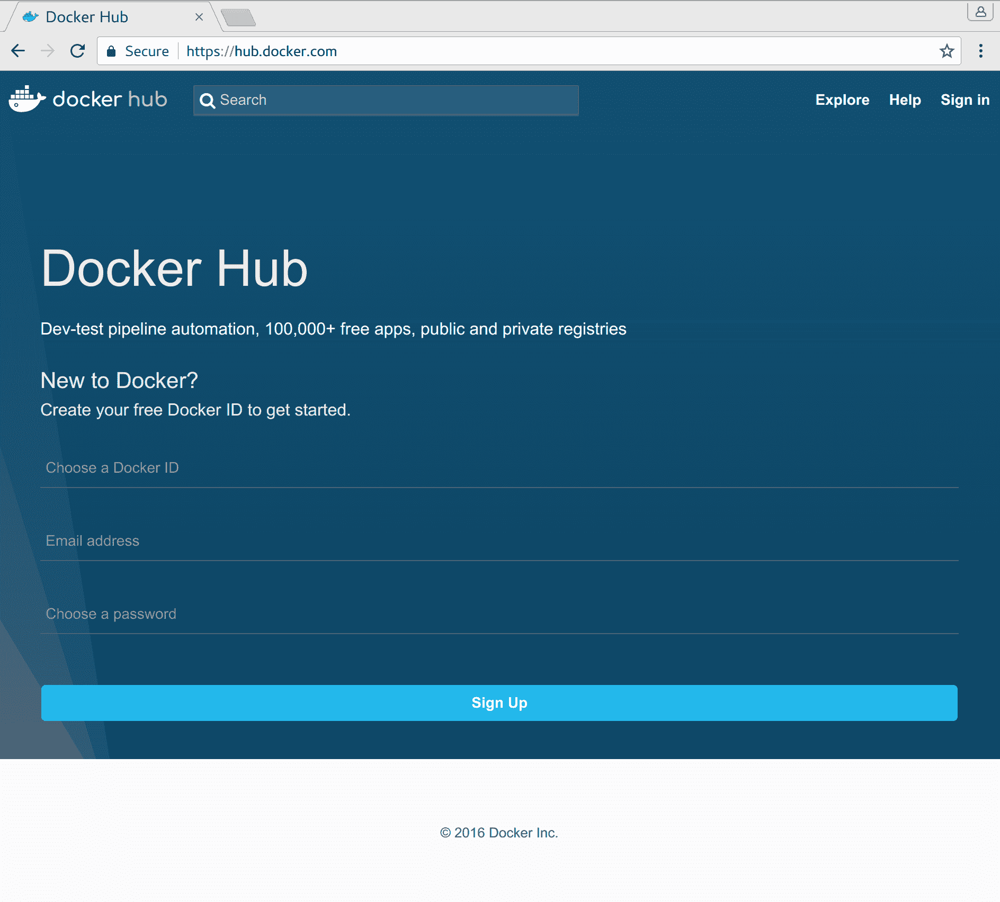
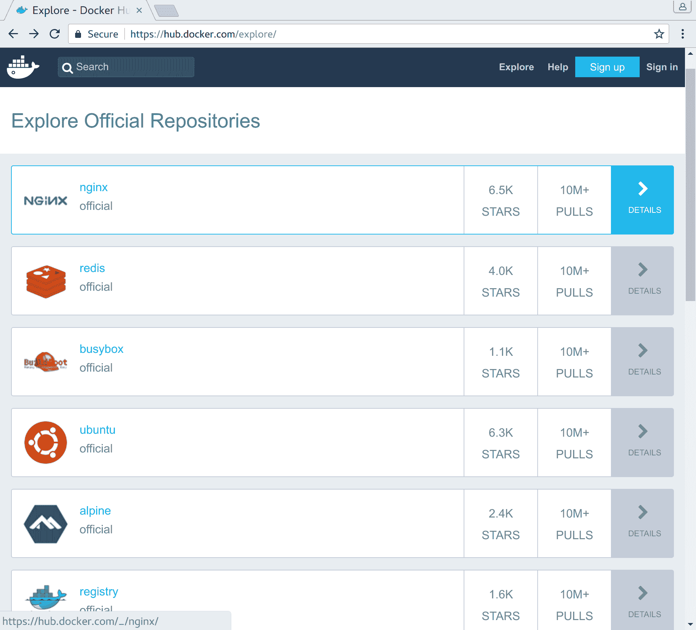
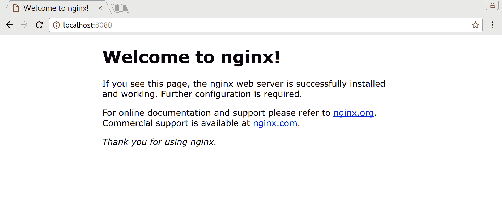
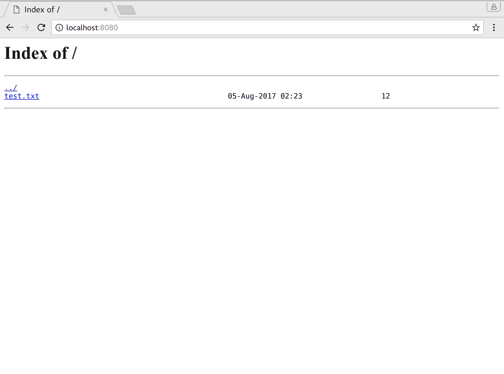
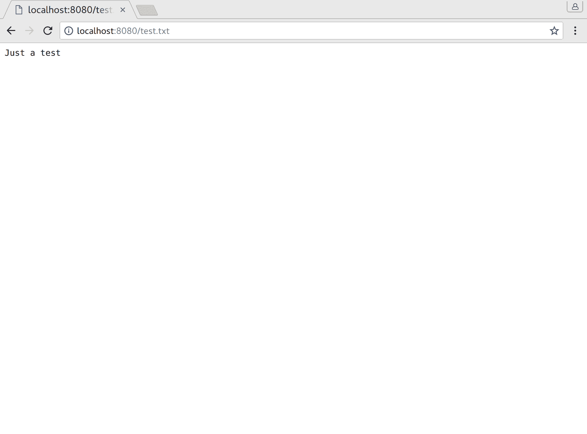
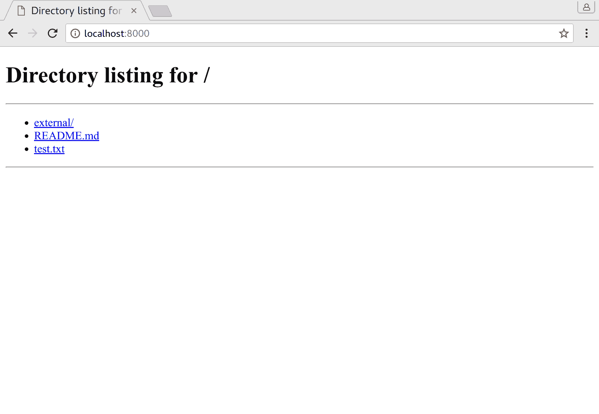
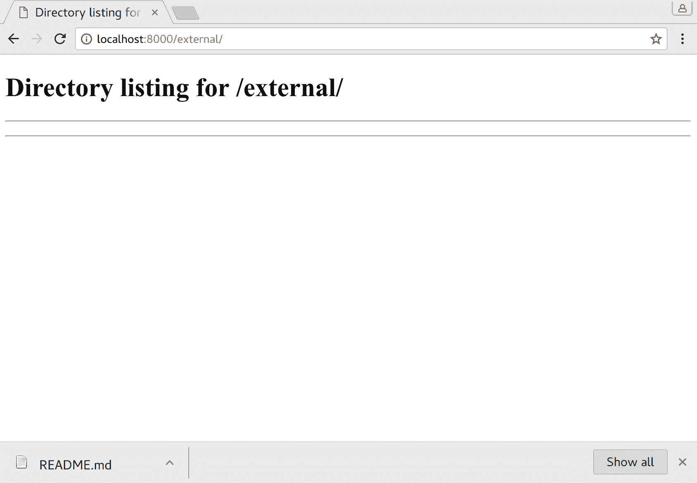
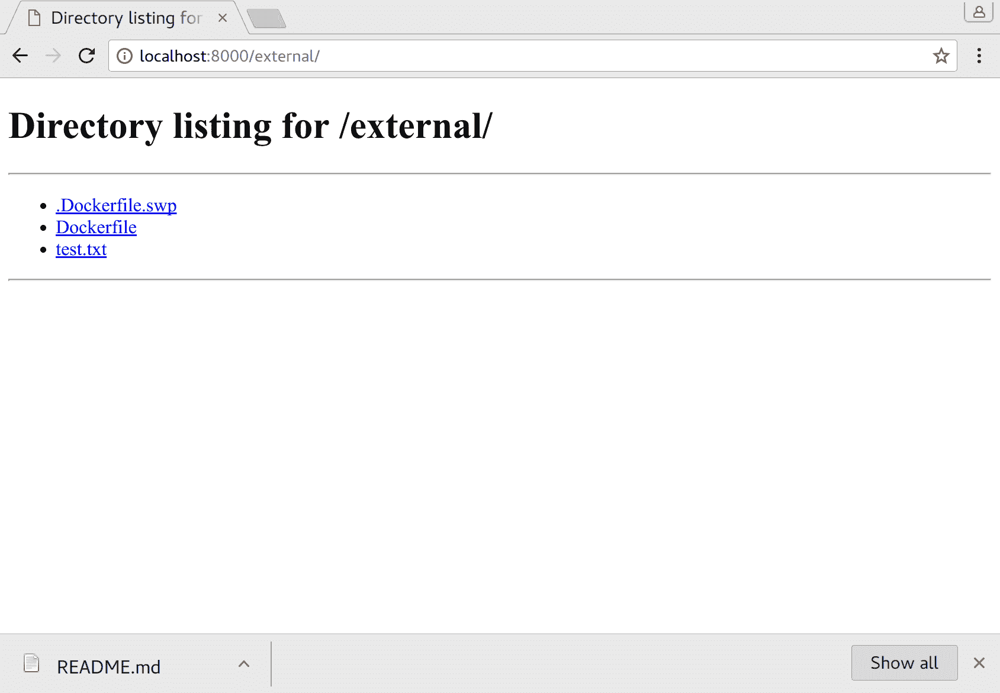

# 第二章：卷起袖子

在上一章中，我们看了容器是什么，它们在基础设施中可以扮演什么角色，以及为什么 Docker 是服务部署中的领头羊。现在我们知道了 Docker 是什么，也知道了它不是什么，我们可以开始基础知识了。在本章中，我们将涵盖以下主题：

+   安装 Docker

+   扩展一个容器

+   构建一个容器

+   调试容器

# 安装 Docker

Docker 的安装在操作系统之间有很大的差异，但对于大多数系统，都有详细的说明。通常有两个级别的 Docker 可用：**社区版**（**CE**）和**企业版**（**EE**）。虽然略有不同，但对于本书中我们将要处理的几乎所有内容来说，社区版都是完全功能的，完全够用。一旦你达到需要更高级功能的规模，比如安全扫描、LDAP 和技术支持，企业版可能是有意义的。不出所料，企业版是收费的，您可以查看[`www.docker.com/pricing`](https://www.docker.com/pricing)来了解这些版本的区别。

对于本书中的示例和任何特定于操作系统的命令，从现在开始，我们将使用 Ubuntu 的**长期支持**（**LTS**）版本，Ubuntu 目前是最流行的 Linux 发行版。 LTS 产品的最新版本是 16.04，这将是我们 CLI 交互和示例的基础，但在您阅读本书时，18.04 也可能已经推出。请记住，除了安装部分外，大多数代码和示例都是非常可移植的，通常可以在其他平台上运行，因此即使需要进行更改，也应该是最小的。也就是说，在非 Linux 平台上开发 Docker 服务可能不太精细或稳定，因为 Docker 通常用于在 Linux 机器上部署基于 Linux 的服务，尽管其他一些特殊情况也得到了一定程度的支持。自从微软试图推动他们自己的容器策略以来，他们在这个领域取得了重大进展，因此请密切关注他们的进展，因为它可能成为一个非常有竞争力的开发平台。

一些后续章节中的手动网络示例在 macOS 中可能无法完全工作，因为该平台对该子系统的实现不同。对于这些情况，建议您在虚拟机上使用 Ubuntu LTS 进行跟随操作。

因此，使用我们干净的 Ubuntu 16.04 LTS 机器、虚拟机或兼容的操作系统，让我们安装 Docker。虽然 Docker 软件包已经在分发中的`apt`仓库中可用，但我强烈不建议以这种方式安装，因为这些版本通常要旧得多。虽然对于大多数软件来说这不是问题，但对于像 Docker 这样快速发展的项目来说，这将使您在支持最新功能方面处于明显的劣势。因此，出于这个原因，我们将从 Docker 自己的 apt 仓库中安装 Docker：

警告！还有其他几种安装 Docker 的方法，但除非绝对必要，使用`sudo curl -sSL https://somesite.com/ | sh`模式或类似的方式进行安装是非常危险的，因为您在未检查脚本功能的情况下为网站的脚本授予了 root 权限。这种执行模式也几乎没有留下执行过程的证据。此外，中途出现的异常可能会损坏下载文件但仍然执行，部分造成损害，并且您只依赖**传输层安全性**（**TLS**），全球数百家组织都可以创建伪造证书。换句话说，如果您关心您的机器，除非软件供应商对安全一无所知并且他们强迫您这样做，否则您绝对不应该以这种方式安装软件，那么您就完全受他们的支配。

```
$ # Install the pre-requisites
$ sudo apt install -y apt-transport-https \
                      curl

$ # Add Docker's signing key into our apt configuration to ensure they are the only ones that can send us updates. This key should match the one that the apt repository is using so check the online installation instruction if you see "NO_PUBKEY <key_id>" errors.
$ apt-key adv --keyserver hkp://p80.pool.sks-keyservers.net:80 \
              --recv-keys 58118E89F3A912897C070ADBF76221572C52609D

$ # Add the repository location to apt. Your URL may be different depending on if Xenial is your distribution.
$ echo "deb https://apt.dockerproject.org/repo ubuntu-xenial main" | sudo tee -a /etc/apt/sources.list.d/docker.list

$ # Update the apt listings and install Docker
$ sudo apt update
$ sudo apt install docker-engine
```

默认情况下，Docker 将要求在所有命令前加上`sudo`（或`root`）来运行，包括本书中未明确提到的命令。通常情况下，对于开发机器来说，这是一个很大的麻烦，所以我可能会提到，但*强烈*不建议，您也可以将当前用户添加到`docker`组中，这样您就不需要在每个 Docker 命令前加上`sudo`：

1.  使用`usermod`将用户添加到组中（例如`$ sudo usermod -aG docker $USER`）。

1.  完全注销并重新登录（组仅在会话启动时进行评估）。

请记住，这是一个*巨大*的安全漏洞，可以允许本地用户轻松提升为根权限，因此在任何情况下都不要在任何将连接到互联网的服务器上执行此操作。

如果所有前面的命令都按预期工作，您将能够看到 Docker 是否已安装：

```
$ docker --version
Docker version 17.05.0-ce, build 89658be
```

安装了 Docker 但没有任何东西可运行是相当无用的，所以让我们看看是否可以获得一个可以在本地运行的镜像。我们的选择是要么从头开始制作自己的镜像，要么使用已经构建好的东西。鉴于 Docker 之所以能够达到如此高的采用率的一个重要原因是通过 Docker Hub（[`hub.docker.com/`](https://hub.docker.com/)）轻松共享镜像，而我们刚刚开始，我们将延迟一点时间来创建自己的镜像，以探索这个站点，这是一个集中发布和下载 Docker 镜像的地方。



在这个非描述性和单调的页面背后是成千上万的 Docker 镜像的存储，由于我们目前不感兴趣发布镜像，我们可以点击页面右上角的“探索”按钮，看看有哪些可用的镜像：



正如您所看到的，这列出了写作时最受欢迎的镜像，但您也可以通过左上角的搜索框查找特定的镜像。目前，正如之前提到的，我们不会在这里花太多时间，但对于您来说，了解如何从 Docker Hub 运行镜像将是有价值的，因此我们将尝试拉取和运行其中一个来向您展示如何操作。

目前可用的顶级容器似乎是 NGINX，所以我们将尝试在我们的 Docker 环境中运行它。如果您以前没有使用过 NGINX，它是一个高性能的 Web 服务器，被许多互联网上的网站使用。在这个阶段，我们只是想要感受一下运行这些容器的感觉，让我们看看如何做到：

```
$ # Pull the image from the server to our local repository
$ docker pull nginx
Using default tag: latest
latest: Pulling from library/nginx
94ed0c431eb5: Pull complete
9406c100a1c3: Pull complete
aa74daafd50c: Pull complete
Digest: sha256:788fa27763db6d69ad3444e8ba72f947df9e7e163bad7c1f5614f8fd27a311c3
Status: Downloaded newer image for nginx:latest
```

`pull`命令拉取组成此镜像的任何和所有层。在这种情况下，NGINX 镜像基于三个堆叠的层，并且具有哈希值`788fa277..27a311c3`，由于我们没有指定我们想要的特定版本，我们得到了默认标签，即`latest`。通过这个单一的命令，我们已经从 Docker Hub 检索了 NGINX 镜像，以便我们可以在本地运行它。如果我们想使用不同的标签或从不同的服务器拉取，该命令将变得更加具有表现力，类似于`docker pull <hostname_or_ip>:<port>/<tag_name>`，但我们将在后面的章节中介绍这些高级用法。

现在，镜像已经存储在我们本地的 Docker 存储中（通常在`/var/lib/docker`中），我们可以尝试运行它。NGINX 有大量可能的选项，您可以在[`hub.docker.com/_/nginx/`](https://hub.docker.com/_/nginx/)上进一步了解，但我们现在只对启动镜像感兴趣：

```
$ docker run nginx
```

您可能注意到什么都没有发生，但不要担心，这是预期的。遗憾的是，单独这个命令是不够的，因为 NGINX 将在前台运行，并且根本无法通过套接字访问，所以我们需要覆盖一些标志和开关，使其真正有用。所以让我们按下*Ctrl* + *C*关闭容器，然后再试一次，这次添加一些必要的标志：

```
$ docker run -d \
             -p 8080:80 \
             nginx
dd1fd1b62d9cf556d96edc3ae7549f469e972267191ba725b0ad6081dda31e74
```

`-d`标志以后台模式运行容器，这样我们的终端就不会被 NGINX 占用，而`-p 8080:80`标志将我们的本地端口`8080`映射到容器的端口`80`。容器通常会暴露特定的端口，而在这种情况下，是`80`，但如果没有映射，我们将无法访问它。命令返回的输出是一个唯一的标识符（容器 ID），可以用来在启动后跟踪和控制这个特定的容器。希望您现在能够看到 Docker 的端口白名单方法如何增加了额外的安全级别，因为只有您明确允许监听的东西才被允许。

现在，您可以打开浏览器访问`http://localhost:8080`，您应该会看到一个类似这样的页面：



但是我们究竟是如何知道端口`80`需要被监听的呢？确实，我们将在接下来的一秒钟内介绍这一点，但首先，因为我们以分离模式启动了这个容器，它仍然在后台运行，我们可能应该确保停止它。要查看我们正在运行的容器，让我们用`docker ps`来检查我们的 Docker 容器状态：

```
$ docker ps
CONTAINER ID IMAGE COMMAND CREATED STATUS PORTS NAMES
dd1fd1b62d9c nginx "nginx -g 'daemon ..." 13 minutes ago Up 13 minutes 0.0.0.0:8080->80/tcp dazzling_swanson
```

我们在这里看到的是，我们的 NGINX 容器仍在运行，它已经将本地主机接口端口`8080`（包括外部可访问的端口）映射到容器的端口`80`，而且我们已经运行了`13`分钟。如果我们有更多的容器，它们都会在这里列出，因此这个命令对于处理 Docker 容器非常有用，通常用于调试和容器管理。

由于我们想要关闭这个容器，我们现在将实际执行。要关闭容器，我们需要知道容器 ID，这是`docker run`返回的值，也是`docker ps`的第一列显示的值（`dd1fd1b62d9c`）。可以使用 ID 的短或长版本，但为了简洁起见，我们将使用前者：

```
$ docker stop dd1fd1b62d9c
dd1fd1b62d9c
```

这将优雅地尝试停止容器并将使用的资源返回给操作系统，并在特定的超时后强制杀死它。如果容器真的卡住了，我们可以用`kill`替换`stop`来强制杀死进程，但这很少需要，因为如果进程没有响应，`stop`通常会做同样的事情。我们现在要确保我们的容器已经消失了：

```
$ docker ps
CONTAINER ID IMAGE COMMAND CREATED STATUS PORTS NAMES
```

是的，事情看起来正如我们所期望的那样，但请注意，虽然停止的容器不可见，但默认情况下它们并没有完全从文件系统中删除：

```
$ docker ps -a
CONTAINER ID IMAGE COMMAND CREATED STATUS PORTS NAMES
dd1fd1b62d9c nginx "nginx -g 'daemon ..." 24 minutes ago Exited (137) 2 minutes ago dazzling_swanson
```

`-a`标志用于显示所有容器状态，而不仅仅是正在运行的容器，您可以看到系统仍然知道我们的旧容器。我们甚至可以使用`docker start`来恢复它！

```
$ docker start dd1fd1b62d9c
dd1fd1b62d9c

$ docker ps
CONTAINER ID IMAGE COMMAND CREATED STATUS PORTS NAMES
dd1fd1b62d9c nginx "nginx -g 'daemon ..." 28 minutes ago Up About a minute 0.0.0.0:8080->80/tcp dazzling_swanson
```

要真正永久删除容器，我们需要明确地使用`docker rm`来摆脱它，如下所示，或者使用`--rm`开关运行`docker run`命令（我们将在接下来的几页中介绍这个）：

```
$ docker stop dd1fd1b62d9c
dd1fd1b62d9c

$ docker rm dd1fd1b62d9c
dd1fd1b62d9c

$ docker ps -a
CONTAINER ID IMAGE COMMAND CREATED STATUS PORTS NAMES
```

成功！

现在让我们回到之前的问题，我们如何知道容器需要将端口 80 映射到它？我们有几种选项可以找到这些信息，最简单的一种是启动容器并在`docker ps`中检查未绑定的端口：

```
$ docker run -d \
             --rm \
             nginx
f64b35fc42c33f4af2648bf4f1dce316b095b30d31edf703e099b93470ab725a

$ docker ps
CONTAINER ID IMAGE COMMAND CREATED STATUS PORTS NAMES
f64b35fc42c3 nginx "nginx -g 'daemon ..." 4 seconds ago Up 3 seconds 80/tcp awesome_bell
```

我们在`docker run`中使用的新标志是`--rm`，我们刚刚提到过，它告诉 Docker 守护程序在停止后完全删除容器，这样我们就不必手动删除了。

如果您已经有一个要检查映射端口的容器，可以使用`docker port <container_id>`命令，但我们在这里省略了，因为它不能用于镜像，而只能用于容器。

虽然这是查看所需端口的最快方法，但在读取其 Dockerfile 和文档之外检查镜像的一般方法是通过`docker inspect`：

```
$ # Inspect NGINX image info and after you match our query, return also next two lines
$ docker inspect nginx | grep -A2 "ExposedPorts"
"ExposedPorts": {
 "80/tcp": {}
},
```

此外，`docker inspect`还可以显示各种其他有趣的信息，例如以下内容：

+   镜像的 ID

+   标签名称

+   镜像创建日期

+   硬编码的环境变量

+   容器在启动时运行的命令

+   容器的大小

+   镜像层 ID

+   指定的卷

随时运行检查命令在任何容器或镜像上，并查看您可能在那里找到的宝石。大多数情况下，这个输出主要用于调试，但在镜像文档缺乏的情况下，它可以是一个无价的工具，让您在最短的时间内运行起来。

# 调试容器

通常在与容器一般工作中，您可能需要弄清楚正在运行的容器的情况，但`docker ps`并不能提供您需要弄清楚事情的所有信息。对于这些情况，要使用的第一个命令是`docker logs`。这个命令显示容器发出的任何输出，包括`stdout`和`stderr`流。对于以下日志，我从前面开始了相同的 NGINX 容器，并访问了它在`localhost`上托管的页面。

```
$ docker run -d \
             -p 8080:80 \
             nginx
06ebb46f64817329d360bb897bda824f932b9bcf380ed871709c2033af069118

$ # Access the page http://localhost:8080 with your browser

$ docker logs 06ebb46f
172.17.0.1 - - [02/Aug/2017:01:39:51 +0000] "GET / HTTP/1.1" 200 612 "-" "Mozilla/5.0 (Windows NT 6.3; rv:36.0) Gecko/20100101 Firefox/36.01" "-"
2017/08/02 01:39:51 [error] 6#6: *1 open() "/usr/share/nginx/html/favicon.ico" failed (2: No such file or directory), client: 172.17.0.1, server: localhost, request: "GET /favicon.ico HTTP/1.1", host: "localhost:8080"
172.17.0.1 - - [02/Aug/2017:01:39:51 +0000] "GET /favicon.ico HTTP/1.1" 404 169 "-" "Mozilla/5.0 (Windows NT 6.3; rv:36.0) Gecko/20100101 Firefox/36.01" "-"
172.17.0.1 - - [02/Aug/2017:01:39:52 +0000] "GET / HTTP/1.1" 200 612 "-" "Mozilla/5.0 (Windows NT 6.3; rv:36.0) Gecko/20100101 Firefox/36.01" "-"
```

您可以在这里看到，NGINX 记录了所有访问和相关的响应代码，这对于调试 Web 服务器非常宝贵。一般来说，输出可以因服务运行的内容而有很大的变化，但通常是开始搜索的好地方。如果您想要在日志被写入时跟踪日志，还可以添加`-f`标志，这在日志很大并且您试图过滤特定内容时非常有帮助。

# 看到容器看到的内容

当日志并不能真正解决问题时，要使用的命令是`docker exec`，以便在运行的容器上执行一个命令，可以包括访问完整的 shell：

```
$ docker run -d \
             -p 8080:80 \
             nginx
06ebb46f64817329d360bb897bda824f932b9bcf380ed871709c2033af069118

$ docker exec 06ebb46f ls -la /etc/nginx/conf.d/
total 12
drwxr-xr-x 2 root root 4096 Jul 26 07:33 .
drwxr-xr-x 3 root root 4096 Jul 26 07:33 ..
-rw-r--r-- 1 root root 1093 Jul 11 13:06 default.conf
```

在这种情况下，我们使用`docker exec`在容器中运行`ls`命令，但实际上这并不是一个强大的调试工具。如果我们尝试在容器内获取完整的 shell 并以这种方式进行检查呢？

```
$ docker exec -it \
              06ebb46f /bin/bash
root@06ebb46f6481:/# ls -la /etc/nginx/conf.d/
total 12
drwxr-xr-x 2 root root 4096 Jul 26 07:33 .
drwxr-xr-x 3 root root 4096 Jul 26 07:33 ..
-rw-r--r-- 1 root root 1093 Jul 11 13:06 default.conf
root@06ebb46f6481:/# exit
exit

$ # Back to host shell
```

这一次，我们使用了`-it`，这是`-i`和`-t`标志的简写，结合起来设置了所需的交互式终端，然后我们使用`/bin/bash`在容器内运行 Bash。容器内的 shell 在这里是一个更有用的工具，但由于许多镜像会删除图像中的任何不必要的软件包，我们受制于容器本身--在这种情况下，NGINX 容器没有`ps`，这是一个非常有价值的用于查找问题原因的实用程序。由于容器通常是隔离的一次性组件，有时可能可以向容器添加调试工具以找出问题的原因（尽管我们将在后面的章节中介绍使用`pid`命名空间的更好方法）：

```
$ docker exec -it 06ebb46f /bin/bash

root@06ebb46f6481:/# ps  # No ps on system
bash: ps: command not found

root@06ebb46f6481:/# apt-get update -q
Hit:1 http://security.debian.org stretch/updates InRelease
Get:3 http://nginx.org/packages/mainline/debian stretch InRelease [2854 B]
Ign:2 http://cdn-fastly.deb.debian.org/debian stretch InRelease
Hit:4 http://cdn-fastly.deb.debian.org/debian stretch-updates InRelease
Hit:5 http://cdn-fastly.deb.debian.org/debian stretch Release
Fetched 2854 B in 0s (2860 B/s)
Reading package lists...

root@06ebb46f6481:/# apt-get install -y procps
<snip>
The following NEW packages will be installed:
libgpm2 libncurses5 libprocps6 procps psmisc
0 upgraded, 5 newly installed, 0 to remove and 0 not upgraded.
Need to get 558 kB of archives.
After this operation, 1785 kB of additional disk space will be used.
<snip>

root@06ebb46f6481:/# ps
PID TTY TIME CMD
31 ? 00:00:00 bash
595 ? 00:00:00 ps

root@06ebb46f6481:/#
```

正如您所看到的，从上游分发的任何调试工具都很容易添加到容器中，但请注意，一旦找到问题，您应该启动一个新的容器并删除旧的容器，以清理掉剩下的垃圾，因为它浪费空间，而新的容器将从没有添加您新安装的调试工具的图像开始（在我们的情况下是`procps`）。

另一件事需要记住的是，有时镜像会阻止安装额外的软件包，因此对于这些情况，我们需要等到后面的章节来看看如何使用命名空间在这样受限制的环境中工作。

有时，容器被锁定在有限的用户 shell 中，因此您将无法访问或修改容器系统的其他部分。在这种配置中，您可以添加`-u 0`标志来将`docker exec`命令作为`root`（`user 0`）运行。您也可以指定任何其他用户名或用户 ID，但通常如果您需要在容器上使用辅助用户，`root`是您想要的。

# 我们的第一个 Dockerfile

现在我们对如何操作容器有了一点了解，这是一个很好的地方来尝试创建我们自己的容器。要开始构建容器，我们需要知道的第一件事是，Docker 在构建镜像时查找的默认文件名是`Dockerfile`。虽然您可以为此主要配置文件使用不同的名称，但这是极不鼓励的，尽管在一些罕见的情况下，您可能无法避免 - 例如，如果您需要一个测试套件镜像和主镜像构建文件在同一个文件夹中。现在，我们假设您只有一个单一的构建配置，考虑到这一点，我们来看看这些基本`Dockerfile`是什么样子的。在您的文件系统的某个地方创建一个测试文件夹，并将其放入名为`Dockerfile`的文件中：

```
FROM ubuntu:latest

RUN apt-get update -q && \
 apt-get install -qy iputils-ping

CMD ["ping", "google.com"]
```

让我们逐行检查这个文件。首先，我们有`FROM ubuntu:latest`这一行。这行表示我们要使用最新的 Ubuntu Docker 镜像作为我们自己服务的基础。这个镜像将自动从 Docker Hub 中拉取，但这个镜像也可以来自自定义存储库、您自己的本地镜像，并且可以基于任何其他镜像，只要它为您的服务提供了一个良好的基础（即 NGINX、Apline Linux、Jenkins 等）。

接下来的一行非常重要，因为基本的 Ubuntu 镜像默认情况下几乎没有任何东西，所以我们需要通过其软件包管理器`apt`安装提供 ping 实用程序（`iputils-ping`）的软件包，就像我们在命令行上使用`RUN`指令给 Docker 一样。不过，在安装之前，我们还需要确保我们的更新索引是最新的，我们使用`apt-get update`来做到这一点。稍后，我们将详细介绍为什么使用`&&`来链接`update`和`install`命令，但现在我们将神奇地忽略它，以免我们的示例偏离太多。

`CMD`指令指示 Docker 默认情况下，每次启动容器时 Docker 都会运行`"ping" "google.com"`，而无需进一步的参数。该指令用于在容器内启动服务，并将容器的生命周期与该进程绑定，因此如果我们的`ping`失败，容器将终止，反之亦然。您的 Dockerfile 中只能有一行`CMD`，因此要特别小心如何使用它。

现在我们已经配置好整个容器，让我们来构建它：

```
$ # Build using Dockerfile from current directory and tag our resulting image as "test_container"
$ docker build -t test_container . 
Sending build context to Docker daemon 1.716MB
Step 1/3 : FROM ubuntu:latest
---> 14f60031763d
Step 2/3 : RUN apt-get update -q && apt-get install -qy iputils-ping
---> Running in ad1ea6a6d4fc
Get:1 http://security.ubuntu.com/ubuntu xenial-security InRelease [102 kB]
<snip>
The following NEW packages will be installed:
iputils-ping libffi6 libgmp10 libgnutls-openssl27 libgnutls30 libhogweed4
libidn11 libnettle6 libp11-kit0 libtasn1-6
0 upgraded, 10 newly installed, 0 to remove and 8 not upgraded.
Need to get 1304 kB of archives.
<snip>
Setting up iputils-ping (3:20121221-5ubuntu2) ...
Processing triggers for libc-bin (2.23-0ubuntu9) ...
---> eab9729248d9
Removing intermediate container ad1ea6a6d4fc
Step 3/3 : CMD ping google.com
---> Running in 44fbc308e790
---> a719d8db1c35
Removing intermediate container 44fbc308e790
Successfully built a719d8db1c35
Successfully tagged test_container:latest
```

正如它所暗示的评论，我们在这里使用`docker build -t test_container .`构建了容器（使用默认的 Dockerfile 配置名称）在我们当前的目录，并用名称`test_container`标记了它。由于我们没有在`test_container`的末尾指定版本，Docker 为我们分配了一个称为`latest`的版本，正如我们可以从输出的末尾看到的那样。如果我们仔细检查输出，我们还可以看到对基本镜像的每个更改都会创建一个新的层，并且该层的 ID 然后被用作下一个指令的输入，每个层都会将自己的文件系统差异添加到镜像中。例如，如果我们再次运行构建，Docker 足够聪明，知道没有任何变化，它将再次使用这些层的缓存版本。将最终容器 ID（`a719d8db1c35`）与上一次运行的 ID 进行比较：

```
$ docker build -t test_container . 
Sending build context to Docker daemon 1.716MB
Step 1/3 : FROM ubuntu:latest
---> 14f60031763d
Step 2/3 : RUN apt-get update -q && apt-get install -qy iputils-ping
---> Using cache
---> eab9729248d9
Step 3/3 : CMD ping google.com
---> Using cache
---> a719d8db1c35
Successfully built a719d8db1c35
Successfully tagged test_container:latest
```

如果在 Dockerfile 的指令中检测到任何更改，Docker 将重建该层和任何后续层，以确保一致性。这种功能和选择性的“缓存破坏”将在以后进行介绍，并且它在管理您的存储库和镜像大小方面起着非常重要的作用。

容器构建完成后，让我们看看它是否真的有效（要退出循环，请按*Ctrl* + *C*）：

```
$ # Run the image tagged "test_container"
$ docker run test_container 
PING google.com (216.58.216.78) 56(84) bytes of data.
64 bytes from ord30s21-in-f14.1e100.net (216.58.216.78): icmp_seq=1 ttl=52 time=45.9 ms
64 bytes from ord30s21-in-f14.1e100.net (216.58.216.78): icmp_seq=2 ttl=52 time=41.9 ms
64 bytes from ord30s21-in-f14.1e100.net (216.58.216.78): icmp_seq=3 ttl=52 time=249 ms
^C
--- google.com ping statistics ---
3 packets transmitted, 3 received, 0% packet loss, time 2002ms
rtt min/avg/max/mdev = 41.963/112.460/249.470/96.894 ms
```

又一个成功！你写了你的第一个运行 Docker 容器！

# 打破缓存

在我们刚刚写的容器中，我们有点忽略了这一行`RUN apt-get update -q && apt-get install -qy iputils-ping`，因为它需要在这里进行更深入的讨论。在大多数 Linux 发行版中，软件包的版本经常变化，但告诉我们在哪里找到这些软件包的索引列表是在创建原始 Docker 镜像时就已经固定了（在这种情况下是`ubuntu:latest`）。在大多数情况下，在我们安装软件包之前，我们的索引文件已经过时太久了（如果它们没有被完全删除），所以我们需要更新它们。将这个`&&`连接的行拆分成两个单独的行将适用于第一次构建：

```
RUN apt-get update -q
RUN apt-get install -qy iputils-ping
```

但是，当你以后在第二行添加另一个软件包时，会发生什么，就像下一行所示的那样？

```
RUN apt-get install -qy curl iputils-ping
```

在这种情况下，Docker 并不是很智能，它会认为 `update` 行没有改变，不会再次运行更新命令，因此它将使用缓存中的状态进行更新层，然后继续下一个尝试安装 `curl` 的命令（自上次构建以来已更改），如果仓库中的版本已经足够多次轮换，索引将再次过时，这很可能会失败。为了防止这种情况发生，我们使用 `&&` 将 `update` 和 `install` 命令连接起来，这样它们将被视为一个指令并创建一个层，在这种情况下，更改两个连接命令中的任何部分都将破坏缓存并正确运行 `update`。不幸的是，随着您更多地涉足可扩展的 Docker 组件，使用这些奇技淫巧来管理缓存和进行选择性缓存破坏将成为您工作的重要部分。

# 一个更实用的容器。

这可能是我们开始与其他 Docker 材料有所不同的地方，其他材料几乎假设只要掌握了这些基本知识，其余的工作就像小菜一碟一样，但实际上并非如此。这并不是什么高深的科学，但这些简单的例子确实不足以让我们达到我们需要的地方，因此我们将使用一个实际的例子，基于我们之前使用 NGINX 的工作，并创建一个使用这个 Web 服务器镜像的容器，以提供和提供我们将嵌入到镜像中的内容。

本书中的这个例子和其他所有例子也可以在 GitHub 上找到 [`github.com/sgnn7/deploying_with_docker`](https://github.com/sgnn7/deploying_with_docker)。您可以使用 `git` 或他们的 Web 界面来跟随这些例子，但我们将使用的所有代码示例也将直接包含在书中。

要开始创建我们的 Web 服务器，我们需要创建一个目录来放置我们所有的文件：

```
$ mkdir ~/advanced_nginx
$ cd ~/advanced_nginx
```

我们需要创建的第一个文件是我们将尝试在镜像中提供的虚拟文本文件：

```
$ echo "Just a test file" > test.txt
```

我们接下来需要的文件是所需的 NGINX 配置。将以下文本放入一个名为 `nginx_main_site.conf` 的文件中：

```
    server {
      listen 80;
      server_name _;
      root /srv/www/html;

      # Deny access to any files prefixed with '.'
      location ~/\. {
        deny all;
      }

      # Serve up the root path at <host>/
      location / {
        index index.html;
        autoindex on;
      }
    }
```

如果你从未使用过 NGINX，让我们看看这个文件做了什么。在第一个块中，我们创建了一个在镜像上以 `/srv/www/html` 为根的监听端口 `80` 的 `server`。第二个块虽然不是严格必需的，并且对于更大的网站需要进行更改，但对于任何在 NGINX 上工作的人来说，这应该是一种肌肉记忆，因为它可以防止下载像 `.htaccess`、`.htpasswd` 和许多其他不应该公开的隐藏文件。最后一个块只是确保任何以 `/` 开头的路径将从 `root` 中读取，并且如果没有提供索引文件，它将使用 `index.html`。如果没有这样的文件可用并且我们在一个目录中，`autoindex` 确保它可以向您显示一个目录的可读列表。

虽然这个 NGINX 配置是功能性的，但它还有很多不包括的东西（如 SSL 配置、日志记录、错误文件、文件查找匹配等），但这主要是因为这本书试图专注于 Docker 本身而不是 NGINX。如果您想了解如何完全和正确地配置 NGINX，您可以访问 [`nginx.org/en/docs/`](https://nginx.org/en/docs/) 了解更多信息。

配置写好后，我们现在可以创建我们的 Dockerfile，它将获取我们的测试文件、配置文件和 NGINX 镜像，并将它们转换成一个运行 Web 服务器并提供我们的测试文件的 Docker 镜像。

```
FROM nginx:latest

# Make sure we are fully up to date
RUN apt-get update -q && \
 apt-get dist-upgrade -y

# Remove the default configuration
RUN rm /etc/nginx/conf.d/default.conf

# Create our website's directory and make sure
# that the webserver process can read it
RUN mkdir -p /srv/www/html && \
 chown nginx:nginx /srv/www/html

# Put our custom server configuration in
COPY nginx_main_site.conf /etc/nginx/conf.d/

# Copy our test file in the location that is
# being served up
COPY test.txt /srv/www/html/
```

这个 Dockerfile 可能看起来与第一个有很大不同，所以我们将花一些时间来深入了解我们在这里做了什么。

# 使用 FROM 扩展另一个容器

与我们上一个容器类似，我们的 `FROM nginx:latest` 行确保我们使用基础镜像的最新版本，但这里我们将使用 NGINX 作为基础，而不是 Ubuntu。`latest` 确保我们获取具有最新功能和通常也有补丁的镜像，但稍微存在未来破坏和 API 不兼容的风险。

在编写 Docker 容器时，您通常必须根据您的情况和稳定性要求做出这些权衡决定，但是 NGINX API 多年来一直非常稳定，因此在这种特定情况下，我们不需要命名标签提供的稳定性。如果我们想在这里使用其中一个带有标签的版本，`latest`只需更改为我们在 Docker Hub 上找到的所需版本，例如[`hub.docker.com/_/nginx/`](https://hub.docker.com/_/nginx/)，因此像`FROM nginx:1.13`这样的东西也完全可以。

# 确保包含最新的补丁

我们的下一步，`apt-get upgrade` 和 `apt-get dist-upgrade`，在当前的 Docker 世界中有点争议，但我认为它们是一个很好的补充，我会解释原因。在常规的基于`deb`软件包的 Linux 发行版（即 Debian，Ubuntu 等），这两个命令确保您的系统与当前发布的软件包完全保持最新。这意味着任何不是最新版本的软件包将被升级，任何过时的软件包将被替换为更新的软件包。由于 Docker 的一般准则是容器多多少是可丢弃的，以这种方式更新容器似乎有点不受欢迎，但它并非没有缺点。

由于 Docker Hub 上的大多数 Docker 镜像只有在基本源文件或 Dockerfile 本身发生更改时才构建，因此许多这些镜像具有较旧和/或未修补的系统库，因此当服务将它们用作动态库时，可能会受到已经修复的任何错误的影响。为了确保我们在这方面的安全加固工作不落后，我们确保在做任何其他事情之前更新系统。虽然由于系统 API 可能发生变化而导致服务中断的风险很小，并且由于应用了额外的更改而导致镜像大小增加，但在我看来，这种权衡不足以让服务处于无保护状态，但在这里请随意使用您的最佳判断。

# 应用我们的自定义 NGINX 配置

我们在系统更新后的指令（`RUN rm /etc/nginx/conf.d/default.conf`）是删除容器中默认的 web 服务器配置。您可以通过我们上一个提示中的链接了解更多关于 NGINX 配置的信息，但现在，我们可以说默认情况下，所有单独的站点配置文件都存储在`/etc/nginx/conf.d`中，NGINX Docker 镜像默认带有一个名为`default.conf`的简单示例文件，我们绝对不想使用。

虽然我们可以覆盖提到的文件，但我们将被困在名为`default`的名称中，这并不是很描述性的，因此对于我们的配置，我们将删除这个文件，并使用一个更好的文件名添加我们自己的文件。

接下来，我们需要确保我们将要提供文件的文件夹可以被网络服务器进程访问和读取。使用`mkdir -p`的第一个命令创建了所有相关的目录，但由于 NGINX 不以 root 身份运行，我们需要知道进程将以什么用户来读取我们想要提供的文件，否则我们的服务器将无法显示任何内容。我们可以通过显示包含在镜像中的系统范围 NGINX 配置的前几行来找到原始配置中的默认用户，该配置位于`/etc/nginx/nginx.conf`中。

```
$ # Print top 2 lines of main config file in NGINX image
$ docker run --rm \
             nginx /bin/head -2 /etc/nginx/nginx.conf

user nginx;
```

完美！现在，需要能够读取这个目录的用户是`nginx`，我们将使用`chown nginx:nginx /srv/www/html`来更改我们目标文件夹的所有者，但是我们刚刚使用了新的`run` Docker 命令来尝试找到这个信息，这是怎么回事？如果在指定镜像名称后包含一个命令，而不是在镜像中使用`CMD`指令，Docker 将用这个新命令替换它。在前面的命令中，我们运行了`/bin/head`可执行文件，并传入参数告诉它我们只想要从`/etc/nginx/nginx.conf`文件中获取前两行。由于这个命令一旦完成就退出了，容器就会停止并完全删除，因为我们使用了`--rm`标志。

随着默认配置的消失和我们的目录创建，我们现在可以使用`COPY nginx_main_site.conf /etc/nginx/conf.d/`将 NGINX 的主要配置放在指定位置。`COPY`参数基本上就是将当前构建目录中的文件复制到镜像中的指定位置。

非常小心地结束`COPY`指令的参数，如果不加斜杠，源文件会被放入目标文件，即使目标是一个目录。为了确保这种情况不会发生，始终在目标目录路径的末尾加上斜杠。

添加我们想要托管的主要`test.txt`文件是最后一部分，它遵循与其他`COPY`指令相同的步骤，但我们将确保将其放入我们的 NGINX 配置引用的文件夹中。由于我们为这个端点打开了`autoindex`标志，因此不需要采取其他步骤，因为文件夹本身是可浏览的。

# 构建和运行

现在我们已经讨论了整个构建配置，我们可以创建我们的镜像，看看我们刚刚做了什么：

```
$ docker build -t web_server . 
Sending build context to Docker daemon 17.41kB
Step 1/6 : FROM nginx:latest
 ---> b8efb18f159b
Step 2/6 : RUN apt-get update -q && apt-get dist-upgrade -yq
 ---> Running in 5cd9ae3712da
Get:1 http://nginx.org/packages/mainline/debian stretch InRelease [2854 B]
Get:2 http://security.debian.org stretch/updates InRelease [62.9 kB]
Get:3 http://nginx.org/packages/mainline/debian stretch/nginx amd64 Packages [11.1 kB]
Get:5 http://security.debian.org stretch/updates/main amd64 Packages [156 kB]
Ign:4 http://cdn-fastly.deb.debian.org/debian stretch InRelease
Get:6 http://cdn-fastly.deb.debian.org/debian stretch-updates InRelease [88.5 kB]
Get:7 http://cdn-fastly.deb.debian.org/debian stretch Release [118 kB]
Get:8 http://cdn-fastly.deb.debian.org/debian stretch Release.gpg [2373 B]
Get:9 http://cdn-fastly.deb.debian.org/debian stretch/main amd64 Packages [9497 kB]
Fetched 9939 kB in 40s (246 kB/s)
Reading package lists...
Reading package lists...
Building dependency tree...
Reading state information...
Calculating upgrade...
0 upgraded, 0 newly installed, 0 to remove and 0 not upgraded.
 ---> 4bbd446af380
Removing intermediate container 5cd9ae3712da
Step 3/6 : RUN rm /etc/nginx/conf.d/default.conf
 ---> Running in 39ad3da8979a
 ---> 7678bc9abdf2
Removing intermediate container 39ad3da8979a
Step 4/6 : RUN mkdir -p /srv/www/html && chown nginx:nginx /srv/www/html
 ---> Running in e6e50483e207
 ---> 5565de1d2ec8
Removing intermediate container e6e50483e207
Step 5/6 : COPY nginx_main_site.conf /etc/nginx/conf.d/
 ---> 624833d750f9
Removing intermediate container a2591854ff1a
Step 6/6 : COPY test.txt /srv/www/html/
 ---> 59668a8f45dd
Removing intermediate container f96dccae7b5b
Successfully built 59668a8f45dd
Successfully tagged web_server:latest
```

容器构建似乎很好，让我们来运行它：

```
$ docker run -d \
             -p 8080:80 \
             --rm \
             web_server 
bc457d0c2fb0b5706b4ca51b37ca2c7b8cdecefa2e5ba95123aee4458e472377

$ docker ps
CONTAINER ID IMAGE COMMAND CREATED STATUS PORTS NAMES
bc457d0c2fb0 web_server "nginx -g 'daemon ..." 30 seconds ago Up 29 seconds 0.0.0.0:8080->80/tcp goofy_barti
```

到目前为止，一切都很顺利，似乎运行得很好。现在我们将在`http://localhost:8080`上用浏览器访问容器。



正如我们所希望的那样，我们的服务器正在工作，并显示`/srv/www/html`的内容，但让我们点击`test.txt`，确保它也在工作：



太好了，看起来我们的计划成功了，我们创建了一个高性能的静态网站托管服务器容器！当然，我们还可以添加许多其他东西，但我们扩展示例镜像以执行一些有用的操作的主要目标已经实现了！

# 从头开始的服务

我们上一个示例相当全面，但遗漏了一些重要的 Docker 命令，我们也应该知道，因此我们将使用另一个示例，尽管以略微不太理想的方式重新设计 Web 服务器解决方案，以展示它们的使用并解释它们的作用。在这个过程中，我们将深入一点，看看是否可以自己制作服务的许多部分。

我们将从创建一个干净的目录开始这个示例，并创建我们之前使用的相同的测试文件：

```
$ mkdir ~/python_webserver
$ cd ~/python_webserver

$ echo "Just a test file" > test.txt
```

现在我们将通过将以下内容放入`Dockerfile`来创建一个稍微复杂一点的基于 Python 的 Web 服务器容器。

```
FROM python:3

# Add some labels for cache busting and annotating
LABEL version="1.0"
LABEL org.sgnn7.name="python-webserver"

# Set a variable that we will keep reusing to prevent typos
ENV SRV_PATH=/srv/www/html

# Make sure we are fully up to date
RUN apt-get update -q && \
 apt-get dist-upgrade -y

# Let Docker know that the exposed port we will use is 8000
EXPOSE 8000

# Create our website's directory, then create a limited user
# and group
RUN mkdir -p $SRV_PATH && \
 groupadd -r -g 350 pythonsrv && \
 useradd -r -m -u 350 -g 350 pythonsrv

# Define ./external as an externally-mounted directory
VOLUME $SRV_PATH/external

# To serve things up with Python, we need to be in that
# same directory
WORKDIR $SRV_PATH

# Copy our test file
COPY test.txt $SRV_PATH/

# Add a URL-hosted content into the image
ADD https://raw.githubusercontent.com/moby/moby/master/README.md \
 $SRV_PATH/

# Make sure that we can read all of these files as a
# limited user
RUN chown -R pythonsrv:pythonsrv $SRV_PATH

# From here on out, use the limited user
USER pythonsrv

# Run the simple http python server to serve up the content
CMD [ "python3", "-m", "http.server" ]
```

在几乎所有情况下，使用 Python 内置的 Web 服务器都是极不推荐的，因为它既不可扩展，也没有任何显著的配置方式，但它可以作为一个通过 Docker 托管的服务的良好示例，并且几乎在所有安装了 Python 的系统上都可用。除非你真的知道自己在做什么，否则不要在真实的生产服务中使用它。

除了关于在生产中使用 python 的 web 服务器模块的注意之外，这仍然是我们没有涵盖的所有其他主要 Dockerfile 指令的一个很好的例子，现在您将学习如何使用它们。

# 标签

我们这里的第一个新指令是`LABEL`：

```
LABEL version="1.0"
LABEL org.sgnn7.name="python-webserver"
```

`LABEL <key>=<value>`或`LABEL <key> <value>`用于向正在构建的镜像添加元数据，稍后可以通过`docker ps`和`docker images`进行检查和过滤，使用类似`docker images --filter "<key>=<value>"`的方式。键通常以`reverse-dns`表示法全部小写，但在这里您可以使用任何内容，`version`应该出现在每个镜像上，因此我们使用顶级版本键名称。但是，这里的版本不仅用于过滤图像，还用于在更改时打破 Docker 的缓存。如果没有这种缓存破坏或在构建过程中通过手动设置标志（`docker build --no-cache`），Docker 将一直重用缓存，直到最近更改的指令或文件，因此您的容器很可能会保持在冻结的软件包配置中。这种情况可能是您想要的，也可能不是，但是以防万一您有自动化构建工具，添加一个`version`层，可以在更改时打破缓存，使得容器非常容易更新。

# 使用 ENV 设置环境变量

`ENV`与其他一些命令不同，应该大部分是不言自明的：它在`Dockerfile`和容器中设置环境变量。由于我们需要在`Dockerfile`中不断重新输入`/srv/www/html`，为了防止拼写错误并确保对最终服务器目录目标的轻松更改，我们设置了`SRV_PATH`变量，稍后我们将不断重用`$SRV_PATH`。通常对于 Docker 容器，几乎所有的容器配置都是通过这些环境变量完成的，因此在后面的章节中可以预期会看到这个指令。

即使在这个示例中我们没有使用它，但是在`CMD`指令中直接使用环境变量时需要注意，因为它不会被展开，而是直接运行。您可以通过将其作为类似于这样的 shell 命令结构的一部分来确保您的变量在`CMD`中被展开：`CMD [ "sh", "-c", "echo", "$SRV_PATH" ]`。

# 暴露端口

我们接下来的新指令是`EXPOSE 8000`。还记得我们如何使用`docker info`来找出 NGINX 容器使用的端口吗？这个指令填写了元数据中的信息，并且被 Docker 编排工具用来将传入端口映射到容器的正确入口端口。由于 Python 的 HTTP 服务器默认在端口`8000`上启动服务，我们使用`EXPOSE`来通知 Docker，使用这个容器的人应该确保他们在主机上映射这个端口。你也可以在这个指令中列出多个端口，但由于我们的服务只使用一个端口，所以现在不需要使用。

# 使用有限用户的容器安全层

我们`Dockerfile`中的以下新代码块可能有点复杂，但我们将一起学习：

```
RUN mkdir -p $SRV_PATH && \
 groupadd -r -g 350 pythonsrv && \
 useradd -r -m -u 350 -g 350 pythonsrv
```

这是我们需要在多个层面上扩展的内容，但你首先需要知道的是，默认情况下，Dockerfile 指令是以`root`用户执行的，如果稍后没有指定不同的`USER`，你的服务将以`root`凭据运行，从安全角度来看，这是一个巨大的漏洞，我们试图通过将我们的服务仅作为有限用户运行来修补这个漏洞。然而，如果没有定义用户和组，我们无法将上下文从`root`切换，因此我们首先创建一个`pythonsrv`组，然后创建附属于该组的`pythonsrv`用户。`-r`标志将用户和组标记为系统级实体，对于不会直接登录的组和用户来说，这是一个良好的做法。

说到用户和组，如果你将一个卷从主机挂载到以有限用户身份运行的 Docker 容器中，如果主机和容器对用户和组 ID（分别为`uid`和`gid`）没有完全一致，你将无法从卷中读取或写入文件。为了避免这种情况，我们使用一个稳定的 UID 和 GID，即`350`，这个数字易于记忆，在大多数主机系统的常规 UID/GID 表中通常不会出现。这个数字大多是任意的，但只要它在主机 OS 的服务范围内，并且不会与主机上的用户或组冲突，就应该没问题。

到目前为止没有涵盖的最后一个标志是`-m`，它的作用是为用户创建主目录骨架文件。大多数情况下，你不需要这个，但如果任何后续操作尝试使用`$HOME`（比如`npm`或大量其他服务），除非你指定这个标志并且你的构建将失败，否则不会有这样的目录，所以我们确保通过为`pythonsrv`用户创建`$HOME`来避免这种情况。

为了完成这一切，我们将所有这些`RUN`命令链接在一起，以确保我们使用尽可能少的层。每一层都会创建额外的元数据，并增加你的镜像大小，所以就像 Docker 最佳实践文档所述，我们尝试通过堆叠这些命令来减少它们。虽然在所有情况下都不是最好的做法，因为调试这种风格的配置非常困难，但通常会显著减小容器的大小。

# 卷和存在于容器之外的数据

但是，如果我们想要添加存在于容器之外的文件，即使容器死亡时也需要持久存在的文件呢？这就是`VOLUME`指令发挥作用的地方。使用`VOLUME`，每次启动容器时，这个路径实际上被假定为从容器外部挂载，如果没有提供，将会自动为你创建并附加一个。

在这里，我们将我们的`/srv/www/html/external`路径分配给这个未命名的卷，但我们将保留大部分关于卷的详细讨论到后面的章节。

# 设置工作目录

由于 Python HTTP 服务器只能从其运行的当前目录中提供文件，如果不正确配置，我们的容器将显示`/`目录之外的文件。为了解决这个问题，我们在`Dockerfile`中包含了`WORKDIR $SRV_ROOT`，这将把我们的工作目录更改为包含我们想要提供的文件的目录。关于这个命令需要注意的一点是，你可以多次重用它，并且它适用于 Dockerfile 中的任何后续命令（如`RUN`或`CMD`）。

# 从互联网添加文件

如果要尝试向容器中添加不在本地托管的文件和/或由于许可问题无法将它们包含在`Dockerfile`所在的存储库中，该怎么办？为了这个特定的目的，有`ADD`指令。这个命令会从提供的 URI 下载文件并将其放入容器中。如果文件是本地压缩存档，比如`.tgz`或`.zip`文件，并且目标路径以斜杠结尾，它将被扩展到该目录中，这是一个非常有用的选项，与`COPY`相比。在我们写的例子中，我们将从 GitHub 中随机选择一个文件，并将其放入要包含的目录中。

```
ADD https://raw.githubusercontent.com/moby/moby/master/README.md \
 $SRV_PATH/
```

# 改变当前用户

我们已经解释了为什么需要将我们的服务运行为受限用户以及我们如何为其创建用户，但现在是永久切换上下文到`pythonsrv`的时候了。使用`USER pythonsrv`，任何进一步的命令都将以`pythonsrv`用户的身份执行，包括容器的`CMD`可执行命令，这正是我们想要的。就像`WORKDIR`一样，这个指令可以在`Dockerfile`中多次使用，但对于我们的目的来说，没有必要将其余的配置设置为非`root`。通常，将这个层语句尽可能放在`Dockerfile`中很高的位置是一个很好的做法，因为它很少会改变，也不太可能破坏缓存。然而，在这个例子中，我们不能将它移到更高的位置，因为我们之前的命令使用了`chown`，这需要`root`权限。

# 把所有东西放在一起

我们快要完成了！我们需要做的最后一件事是在容器启动时启动 Python 的内置 HTTP 服务器模块：

```
CMD [ "python3", "-m", "http.server" ]
```

一切就绪后，我们可以构建并启动我们的新容器：

```
$ docker build -t python_server . 
Sending build context to Docker daemon 16.9kB
Step 1/14 : FROM python:3
 ---> 968120d8cbe8
<snip>
Step 14/14 : CMD python3 -m http.server
 ---> Running in 55262476f342
 ---> 38fab9dca6cd
Removing intermediate container 55262476f342
Successfully built 38fab9dca6cd
Successfully tagged python_server:latest

$ docker run -d \
             -p 8000:8000 \
             --rm \
             python_server 
d19e9bf7fe70793d7fce49f3bd268917015167c51bd35d7a476feaac629c32b8
```

我们可以祈祷并通过访问`http://localhost:8000`来检查我们构建的内容：



成功了！点击`test.txt`显示了正确的`Just a test`字符串，当点击时，我们从 GitHub 下载的`README.md`也很好地显示出来。所有的功能都在那里，`external/`目录中有什么？



如果卷是空的，那么我们的目录也是空的并不奇怪。我们来看看是否可以将一些文件从我们的主机挂载到这个目录中：

```
$ # Kill our old container that is still running
$ docker kill d19e9bf7
d19e9bf7

$ # Run our image but mount our current folder to container's
$ # /srv/www/html/external folder
$ docker run -d \
             -p 8000:8000 \
             --rm \
             -v $(pwd):/srv/www/html/external \
             python_server 
9756b456074f167d698326aa4cbe5245648e5487be51b37b00fee36067464b0e
```

在这里，我们使用`-v`标志将我们的当前目录(`$(pwd)`)挂载到我们的`/srv/www/html/external`目标上。那么现在`http://localhost:8000/external`是什么样子呢？我们的文件可见吗？



确实是的 - 我们的服务正如我们所期望的那样工作！一个从头开始编写的真正的服务！

有了一个正常工作的服务，我们现在应该能够在下一章中继续我们的 Docker 之旅，通过扩展我们的容器。

# 摘要

在本章中，我们涵盖了从基本的 Docker 容器到扩展现有容器，一直到从头开始创建我们自己的服务的所有内容。在这个过程中，我们涵盖了最重要的 Docker 和 Dockerfile 命令以及如何使用它们，更重要的是*在哪里*和*为什么*使用它们。虽然这并不是对该主题最深入的覆盖，但这正是我们在下一章开始扩展容器工作所需要的适当深度。
