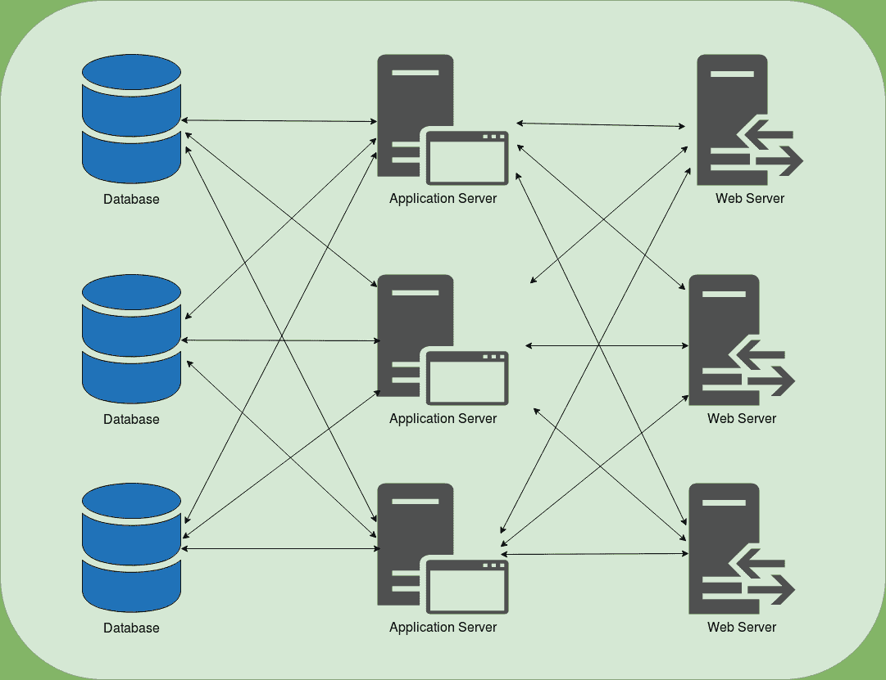
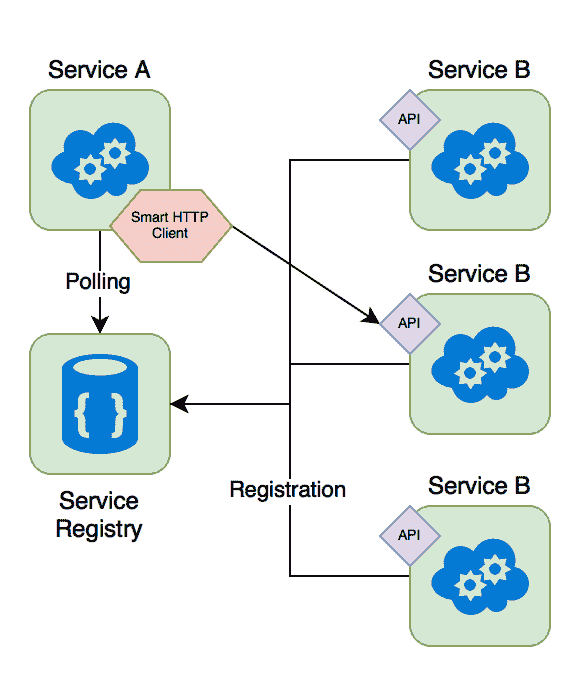
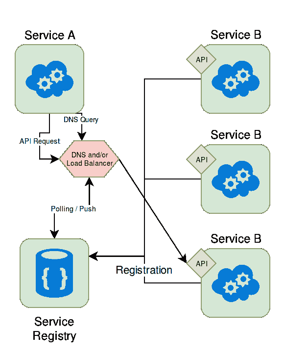
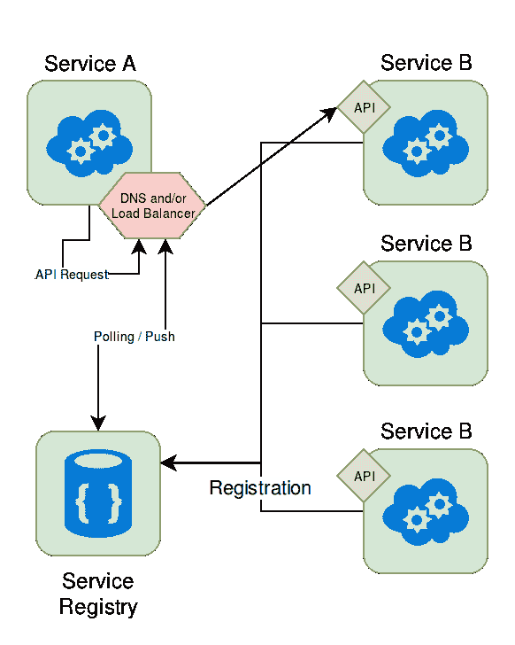
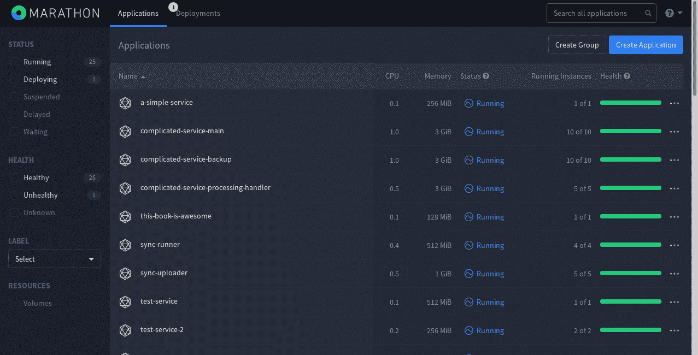
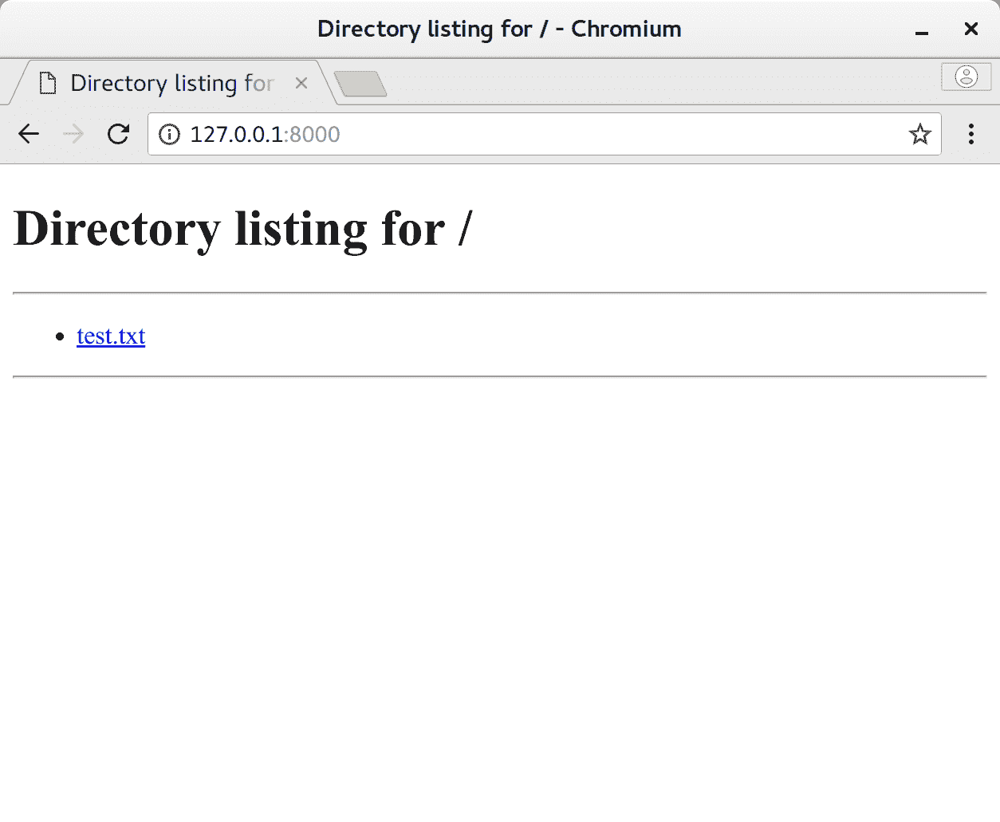
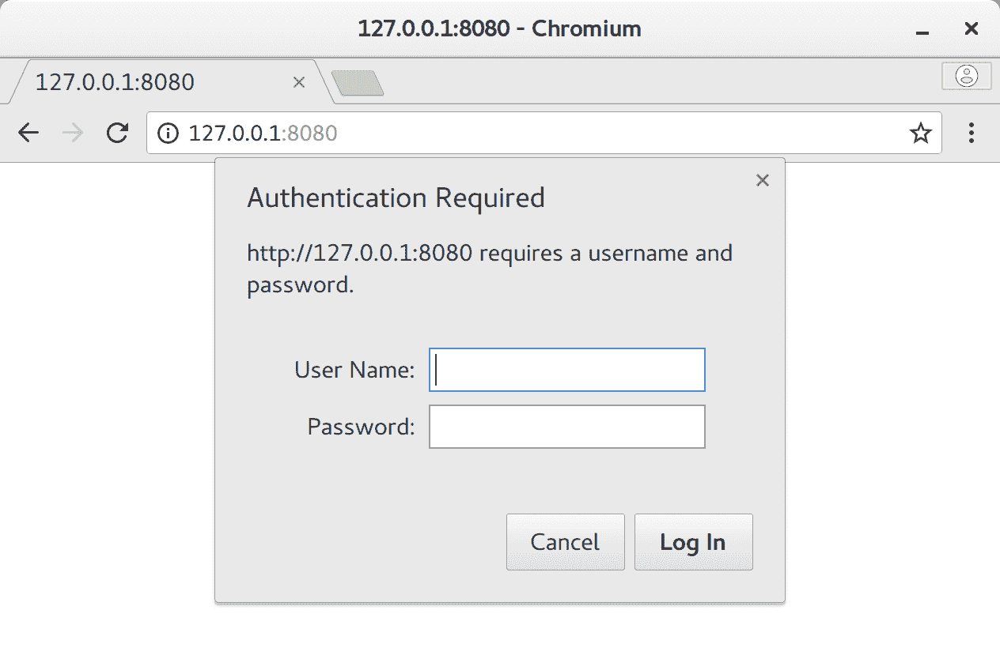
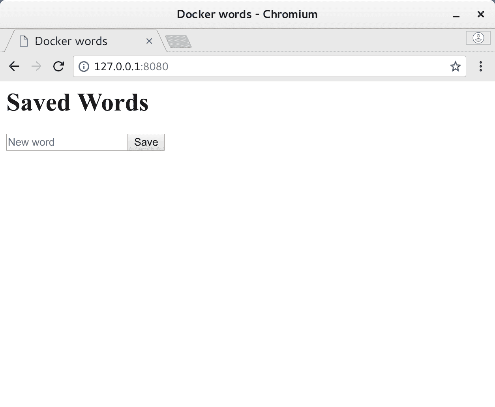
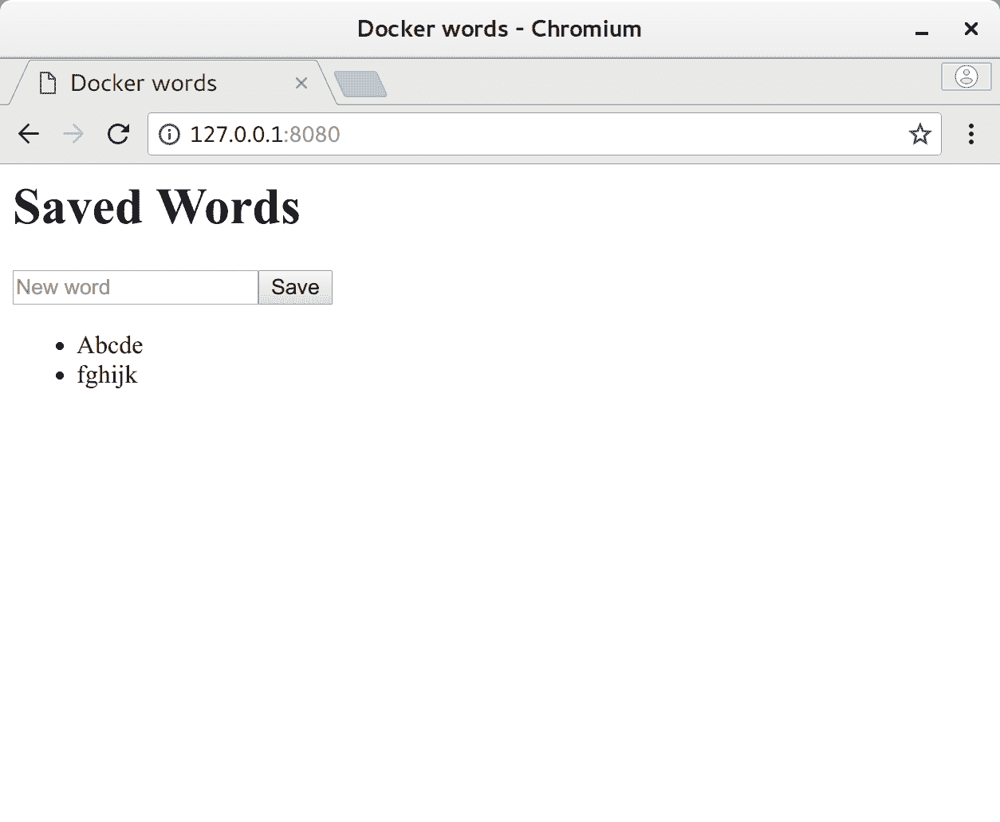

# 第四章：扩展容器

在本章中，我们将使用我们的服务，并尝试通过多个相同容器的实例来水平扩展它。我们将在本章中涵盖以下主题：

+   编排选项及其优缺点

+   服务发现

+   状态协调

+   部署自己的 Docker Swarm 集群

+   将我们在上一章中的 word 服务部署到该集群上

# 服务发现

在我们进一步之前，我们真的需要深入了解概念上的 Docker 容器连通性，这在某种程度上与在非容器化世界中使用服务器构建高可用服务非常相似。因此，深入探讨这个主题不仅会扩展您对 Docker 网络的理解，还有助于通常构建出弹性服务。

# Docker 网络的回顾

在上一章中，我们介绍了一些 Docker 网络布局，所以我们将在这里介绍主要内容：

+   默认情况下，Docker 容器在主机上运行在一个隔离的虚拟网络中

+   每个容器在该网络中都有自己的网络地址

+   默认情况下，容器的 `localhost` *不是* 主机机器的 `localhost`

+   手动连接容器存在很高的人工工作开销

+   容器之间的手动网络连接本质上是脆弱的

在设置本地服务器网络的并行世界中，Docker 连通性的基本体验非常类似于使用静态 IP 连接整个网络。虽然这种方法并不难以实现，但维护起来非常困难和费力，这就是为什么我们需要比这更好的东西。

# 深入了解服务发现

由于我们不想处理这种脆弱的保持和维护硬编码 IP 地址的系统，我们需要找出一种方法，使我们的连接灵活，并且不需要客户端进行任何调整，如果目标服务死掉或创建一个新的服务。如果每个对同一服务的连接在所有相同服务的实例之间平衡，那就更好了。理想情况下，我们的服务看起来应该是这样的：



对于互联网的这种确切用例，DNS 被创建出来，以便客户端可以在世界各地找到服务器，即使 IP 地址或网络发生变化。作为一个附加好处，我们有更容易记住的目标地址（DNS 名称，如[`google.com`](https://google.com)，而不是诸如`https://123.45.67.89`之类的东西），并且可以将处理分配给尽可能多的处理服务。

如果您没有深入研究 DNS，主要原则可以归纳为这些基本步骤：

1.  用户（或应用程序）想要连接到一个服务器（即[google.com](http://www.google.com)）。

1.  本地机器要么使用自己缓存的 DNS 答案，要么去 DNS 系统搜索这个名称。

1.  本地机器得到应该用作目标的 IP 地址（`123.45.67.89`）。

1.  本地机器连接到 IP 地址。

DNS 系统比这里提到的单个句子要复杂得多。虽然 DNS 是任何面向服务器的技术职位中了解的一件非常好的事情，在这里，只需要知道 DNS 系统的输入是主机名，输出是真正的目标（IP）就足够了。如果您想了解 DNS 系统实际上是如何工作的更多信息，我建议您在闲暇时访问[`en.wikipedia.org/wiki/Domain_Name_System`](https://en.wikipedia.org/wiki/Domain_Name_System)。

如果我们强迫几乎所有客户端中已实现的 DNS 处理作为一种自动发现服务的方式，我们可以使自己成为我们一直在寻找的服务发现机制！如果我们使它足够智能，它可以告诉我们正在运行的容器在哪里，平衡相同容器的所有实例，并为我们提供一个静态名称作为我们的目标使用。正如人们可能期望的那样，几乎所有容器服务发现系统都具有这种功能模式；只是通常有所不同，无论是作为客户端发现模式、服务器端发现模式，还是某种混合系统。

# 客户端发现模式

这种类型的模式并不经常使用，但它基本上涉及使用服务感知客户端来发现其他服务并在它们之间进行负载平衡。这里的优势在于客户端可以智能地决定连接到哪里以及以何种方式，但缺点是这种决策分布在每个服务上并且难以维护，但它不依赖于单一的真相来源（单一服务注册表），如果它失败，可能会导致整个集群崩溃。

体系结构通常看起来类似于这样：

****

# 服务器端发现模式

更常见的服务发现模式是集中式服务器端发现模式，其中使用 DNS 系统将客户端引导到容器。在这种特定的服务发现方式中，容器会从服务注册表中注册和注销自己，该注册表保存系统的状态。这种状态反过来用于填充 DNS 条目，然后客户端联系这些条目以找到它试图连接的目标。虽然这个系统通常相当稳定和灵活，但有时会遇到非常棘手的问题，通常会妨碍 DNS 系统的其他地方，比如 DNS 缓存，它使用过时的 IP 地址，直到**生存时间**（TTL）到期，或者应用程序本身缓存 DNS 条目而不管更新（NGINX 和 Java 应用程序以此著称）。

****

# 混合系统

这个分组包括我们尚未涵盖的所有其他组合，但它涵盖了使用工具 HAProxy 的最大部署类别，我们稍后将详细介绍。它基本上是将主机上的特定端口（即`<host>:10101`）与集群中的负载平衡目标绑定起来。

从客户端的角度来看，他们连接到一个单一且稳定的位置，然后 HAProxy 将其无缝地隧道到正确的目标。

****

这种设置支持拉取和推送刷新方法，并且非常有韧性，但我们将在后面的章节中深入探讨这种类型的设置。

# 选择（不）可用的选项

有了所有这些类型的服务发现可用，我们应该能够处理任何我们想要的容器扩展，但我们需要牢记一件非常重要的事情：几乎所有服务发现工具都与用于部署和管理容器的系统（也称为容器编排）紧密相关，因为容器端点的更新通常只是编排系统的实现细节。因此，服务发现系统通常不像人们希望的那样可移植，因此这种基础设施的选择通常由您的编排工具决定（偶尔会有一些例外）。

# 容器编排

正如我们稍早所暗示的，服务发现是在任何情况下部署基于容器的系统的关键部分。如果没有类似的东西，你可能会选择使用裸机服务器，因为使用容器获得的大部分优势都已经丧失了。要拥有有效的服务发现系统，你几乎必须使用某种容器编排平台，而幸运的是（或者可能是不幸的？），容器编排的选择几乎以惊人的速度不断涌现！总的来说，在撰写本书时（以及在我谦逊的意见中），流行且稳定的选择主要归结为以下几种：

+   Docker Swarm

+   Kubernetes

+   Apache Mesos/Marathon

+   基于云的服务（Amazon ECS，Google Container Engine，Azure Container Service 等）

每个都有自己的词汇表和基础设施连接方式，因此在我们进一步之前，我们需要涵盖有关编排服务的相关词汇，这些词汇在所有这些服务之间大多是可重复使用的：

+   **节点**：Docker 引擎的一个实例。通常仅在谈论集群连接的实例时使用。

+   **服务**：由一个或多个运行中的相同 Docker 镜像实例组成的功能组。

+   **任务**：运行服务的特定和唯一实例。通常是一个运行中的 Docker 容器。

+   **扩展**：指定服务运行的任务数量。这通常决定了服务可以支持多少吞吐量。

+   **管理节点**：负责集群管理和编排任务的节点。

+   **工作节点**：指定为任务运行者的节点。

# 状态协调

除了我们刚学到的字典，我们还需要了解几乎所有编排框架的基本算法，状态协调，它值得在这里有自己的小节。这个工作的基本原则是一个非常简单的三步过程，如下：

+   用户设置每个服务或服务消失的期望计数。

+   编排框架看到了改变当前状态到期望状态所需的内容（增量评估）。

+   执行任何需要将集群带到该状态的操作（称为状态协调）。

！[](assets/23380424-de88-49b9-8fe9-76b0e8f78015.png)

例如，如果我们当前在集群中为一个服务运行了五个任务，并将期望状态更改为只有三个任务，我们的管理/编排系统将看到差异为`-2`，因此选择两个随机任务并无缝地杀死它们。相反，如果我们有三个正在运行的任务，而我们想要五个，管理/编排系统将看到期望的增量为`+2`，因此它将选择两个具有可用资源的位置，并启动两个新任务。对两个状态转换的简要解释也应该有助于澄清这个过程：

```
Initial State: Service #1 (3 tasks), Service #2 (2 tasks)
Desired State: Service #1 (1 task),  Service #2 (4 tasks)

Reconciliation:
 - Kill 2 random Service #1 tasks
 - Start 2 Service #2 tasks on available nodes

New Initial State: Service #1 (1 tasks), Service #2 (4 tasks)

New Desired State: Service #1 (2 tasks), Service #2 (0 tasks)

Reconciliation:
 - Start 1 tasks of Service #1 on available node
 - Kill all 4 running tasks of Service #2

Final State: Service #1 (2 tasks), Service #2 (0 tasks)
```

使用这个非常简单但强大的逻辑，我们可以动态地扩展和缩小我们的服务，而不必担心中间阶段（在一定程度上）。在内部，保持和维护状态是一个非常困难的任务，大多数编排框架使用特殊的高速键值存储组件来为它们执行此操作（即`etcd`，`ZooKeeper`和`Consul`）。

由于我们的系统只关心当前状态和需要的状态，这个算法也兼作建立弹性的系统，当一个节点死掉，或者容器减少了应用程序的当前任务计数，将自动触发状态转换回到期望的计数。只要服务大多是无状态的，并且你有资源来运行新的服务，这些集群对几乎任何类型的故障都是有弹性的，现在你可以希望看到一些简单的概念如何结合在一起创建这样一个强大的基础设施。

有了我们对管理和编排框架基础的新理解，我们现在将简要地看一下我们可用选项中的每一个（Docker Swarm，Kubernetes，Marathon），并看看它们如何相互比较。

# Docker Swarm

Docker 默认包含一个编排框架和一个管理平台，其架构与刚才介绍的非常相似，称为 Docker Swarm。Swarm 允许以相对较快和简单的方式将扩展集成到您的平台中，而且几乎不需要时间来适应，而且它已经是 Docker 本身的一部分，因此您实际上不需要太多其他东西来在集群环境中部署一组简单的服务。作为额外的好处，它包含一个相当可靠的服务发现框架，具有多主机网络能力，并且在节点之间使用 TLS 进行通信。

多主机网络能力是系统在多台物理机器之间创建虚拟网络的能力，从容器的角度来看，这些物理机器是透明的。使用其中之一，您的容器可以彼此通信，就好像它们在同一个物理网络上一样，简化了连接逻辑并降低了运营成本。我们稍后将深入研究集群的这一方面。

Docker Swarm 的集群配置可以是一个简单的 YAML 文件，但缺点是，在撰写本文时，GUI 工具有些欠缺，尽管 Portainer（[`portainer.io`](https://portainer.io)）和 Shipyard（[`shipyard-project.com`](https://shipyard-project.com)）正在变得相当不错，所以这可能不会是一个长期的问题。此外，一些大规模的运维工具缺失，似乎 Swarm 的功能正在大幅发展，因此处于不稳定状态，因此我的个人建议是，如果您需要快速在小到大规模上运行某些东西，可以使用这种编排。随着这款产品变得越来越成熟（并且由于 Docker Inc.正在投入大量开发资源），它可能会有显著改进，我期望它在许多方面能够与 Kubernetes 功能相匹敌，因此请密切关注其功能新闻。

# Kubernetes

Kubernetes 是谷歌的云平台和编排引擎，目前在功能方面比 Swarm 提供了更多。Kubernetes 的设置要困难得多，因为你需要：一个主节点，一个节点（根据我们之前的词典，这是工作节点），以及 pod（一个或多个容器的分组）。Pod 始终是共同定位和共同调度的，因此处理它们的依赖关系会更容易一些，但你不会得到相同的隔离。在这里需要记住的有趣的事情是，pod 内的所有容器共享相同的 IP 地址/端口，共享卷，并且通常在相同的隔离组内。几乎可以将 pod 视为运行多个服务的小型虚拟机，而不是并行运行多个容器。

Kubernetes 最近一直在获得大量的社区关注，可能是最被部署的集群编排和管理系统，尽管要公平地说，找到确切的数字是棘手的，其中大多数被部署在私有云中。考虑到谷歌已经在如此大规模上使用这个系统，它有着相当成熟的记录，我可能会推荐它用于中大规模。如果你不介意设置一切的开销，我认为即使在较小规模上也是可以接受的，但在这个领域，Docker Swarm 非常容易使用，因此使用 Kubernetes 通常是不切实际的。

在撰写本书时，Mesos 和 Docker EE 都已经包含了支持 Kubernetes 的功能，所以如果你想要在编排引擎上打赌，这可能就是它！

# Apache Mesos/Marathon

当你真的需要将规模扩大到 Twitter 和 Airbnb 的级别时，你可能需要比 Swarm 或 Kubernetes 更强大的东西，这就是 Mesos 和 Marathon 发挥作用的地方。Apache Mesos 实际上并不是为 Docker 而建立的，而是作为一种通用的集群管理工具，以一种一致的方式为在其之上运行的应用程序提供资源管理和 API。你可以相对容易地运行从脚本、实际应用程序到多个平台（如 HDFS 和 Hadoop）的任何东西。对于这个平台上基于容器的编排和调度，Marathon 是通用的选择。

正如稍早提到的，Kubernetes 支持现在又可以在 Mesos 上使用了，之前一段时间处于破碎状态，因此在您阅读本文时，对 Marathon 的建议可能会改变。

Marathon 作为 Mesos 上的应用程序（在非常宽松的意义上）运行作为容器编排平台，并提供各种便利，如出色的用户界面（尽管 Kubernetes 也有一个），指标，约束，持久卷（在撰写本文时为实验性质），以及其他许多功能。作为一个平台，Mesos 和 Marathon 可能是处理成千上万个节点的集群最强大的组合，但要将所有东西组合在一起，除非您使用预打包的 DC/OS 解决方案（[`dcos.io/`](https://dcos.io/)），根据我的经验，与其他两种方法相比，真的非常棘手。如果您需要覆盖中等到最大规模，并增加灵活性以便在其上运行其他平台（如 Chronos），目前，我强烈推荐这种组合。



# 基于云的服务

如果所有这些似乎太麻烦，而且您不介意每个月支付高昂的费用，所有大型云服务提供商都有某种基于容器的服务提供。由于这些服务在功能和特性方面差异很大，任何放在这个页面上的内容在发布时可能已经过时，而我们更感兴趣的是部署我们自己的服务，因此我将为您提供适当的服务的链接，这些链接将提供最新的信息，如果您选择这条路线：

+   亚马逊 ECS：[`aws.amazon.com/ecs/`](https://aws.amazon.com/ecs/)

+   谷歌容器引擎：[`cloud.google.com/container-engine/`](https://cloud.google.com/container-engine/)

+   微软 Azure（Azure 容器服务）：[`azure.microsoft.com/en-us/services/container-service/`](https://azure.microsoft.com/en-us/services/container-service/)

+   Oracle 容器云服务：[`cloud.oracle.com/container`](https://cloud.oracle.com/container)

+   Docker Cloud：[`cloud.docker.com/`](https://cloud.docker.com/)

+   可能还有其他一些我错过的

就我个人而言，我会推荐这种方法用于中小型部署，因为它易于使用并且经过测试。如果您的需求超出了这些规模，通常有一种方法是在**虚拟私有云**（**VPCs**）上的可扩展虚拟机组上实施您的服务，因为您可以根据需求扩展自己的基础架构，尽管前期的 DevOps 成本不小，所以请据此决定。几乎任何云服务提供商提供的一个良好的经验法则是，通过提供易用的工具，您可以获得更快的部署速度，但代价是成本增加（通常是隐藏的）和缺乏灵活性/可定制性。

# 实施编排

通过我们新获得的对编排和管理工具的理解，现在是时候自己尝试一下了。在我们的下一个练习中，我们将首先尝试使用 Docker Swarm 来创建并在本地集群上进行一些操作，然后我们将尝试将上一章的服务部署到其中。

# 设置 Docker Swarm 集群

由于设置 Docker Swarm 集群的所有功能已经包含在 Docker 安装中，这实际上是一件非常容易的事情。让我们看看我们可以使用哪些命令：

```
$ docker swarm
<snip>
Commands:
 init        Initialize a swarm
 join        Join a swarm as a node and/or manager
 join-token  Manage join tokens
 leave       Leave the swarm
 unlock      Unlock swarm
 unlock-key  Manage the unlock key
 update      Update the swarm
```

这里有几件事情需要注意--有些比其他更明显：

+   您可以使用 `docker swarm init` 创建一个集群

+   您可以使用 `docker swarm join` 加入一个集群，该机器可以是工作节点、管理节点或两者兼而有之

+   身份验证是使用令牌（需要匹配的唯一字符串）进行管理

+   如果管理节点发生故障，例如重新启动或断电，并且您已经设置了自动锁定集群，您将需要一个解锁密钥来解锁 TLS 密钥

到目前为止，一切顺利，让我们看看我们是否可以设置一个同时作为管理节点和工作节点的集群，以了解其工作原理。

# 初始化 Docker Swarm 集群

要创建我们的集群，我们首先需要实例化它：

```
$ docker swarm init 
Swarm initialized: current node (osb7tritzhtlux1o9unlu2vd0) is now a manager.

To add a worker to this swarm, run the following command:

 docker swarm join \
 --token SWMTKN-1-4atg39hw64uagiqk3i6s3zlv5mforrzj0kk1aeae22tpsat2jj-2zn0ak0ldxo58d1q7347t4rd5 \
 192.168.4.128:2377

To add a manager to this swarm, run 'docker swarm join-token manager' and follow the instructions.

$ # Make sure that our node is operational
$ docker node ls
ID                           HOSTNAME  STATUS  AVAILABILITY  MANAGER STATUS
osb7tritzhtlux1o9unlu2vd0 *  feather2  Ready   Active        Leader
```

我们已经用那个命令创建了一个集群，并且我们自动注册为管理节点。如果您查看输出，添加工作节点的命令只是 `docker swarm join --token <token> <ip>`，但是我们现在只对单节点部署感兴趣，所以我们不需要担心这个。鉴于我们的管理节点也是工作节点，我们可以直接使用它来部署一些服务。

# 部署服务

我们最初需要的大多数命令都可以通过`docker services`命令访问：

```
$ docker service
<snip>
Commands:
 create      Create a new service
 inspect     Display detailed information on one or more services
 logs        Fetch the logs of a service or task
 ls          List services
 ps          List the tasks of one or more services
 rm          Remove one or more services
 scale       Scale one or multiple replicated services
 update      Update a service
```

正如你可能怀疑的那样，考虑到这些命令与管理容器的一些命令有多么相似，一旦你转移到编排平台而不是直接操作容器，你的服务的理想管理将通过编排本身完成。我可能会扩展这一点，并且会说，如果你在拥有编排平台的同时过多地使用容器，那么你没有设置好某些东西，或者你没有正确地设置它。

我们现在将尝试在我们的 Swarm 上运行某种服务，但由于我们只是在探索所有这些是如何工作的，我们可以使用一个非常简化（也非常不安全）的我们的 Python Web 服务器的版本。从第二章 *Rolling Up the Sleeves*。创建一个新文件夹，并将其添加到新的`Dockerfile`中：

```
FROM python:3

ENV SRV_PATH=/srv/www/html

EXPOSE 8000

RUN mkdir -p $SRV_PATH && \
 groupadd -r -g 350 pythonsrv && \
 useradd -r -m -u 350 -g 350 pythonsrv && \
 echo "Test file content" > $SRV_PATH/test.txt && \
 chown -R pythonsrv:pythonsrv $SRV_PATH

WORKDIR $SRV_PATH

CMD [ "python3", "-m", "http.server" ]
```

让我们构建它，以便我们的本地注册表有一个镜像可以从中拉取，当我们定义我们的服务时：

```
$ docker build -t simple_server .
```

有了这个镜像，让我们在我们的 Swarm 上部署它：

```
$ docker service create --detach=true \
 --name simple-server \
 -p 8000:8000 \
 simple_server 
image simple_server could not be accessed on a registry to record
its digest. Each node will access simple_server independently,
possibly leading to different nodes running different
versions of the image.

z0z90wgylcpf11xxbm8knks9m

$ docker service ls
ID           NAME          MODE       REPLICAS IMAGE         PORTS
z0z90wgylcpf simple-server replicated 1/1      simple_server *:8000->8000/tcp
```

所显示的警告实际上非常重要：我们构建时服务仅在我们本地机器的 Docker 注册表上可用，因此使用分布在多个节点之间的 Swarm 服务将会出现问题，因为其他机器将无法加载相同的镜像。因此，将镜像注册表从单一来源提供给所有节点对于集群部署是强制性的。随着我们在本章和接下来的章节中的进展，我们将更详细地讨论这个问题。

如果我们检查`http://127.0.0.1:8000`，我们可以看到我们的服务正在运行！让我们看看这个：



如果我们将这项服务扩展到三个实例，我们可以看到我们的编排工具是如何处理状态转换的：

```
$ docker service scale simple-server=3 
image simple_server could not be accessed on a registry to record
its digest. Each node will access simple_server independently,
possibly leading to different nodes running different
versions of the image.

simple-server scaled to 3

$ docker service ls
ID           NAME          MODE       REPLICAS IMAGE         PORTS
z0z90wgylcpf simple-server replicated 2/3      simple_server *:8000->8000/tcp

$ # After waiting a bit, let's see if we have 3 instances now
$ docker service ls
ID           NAME          MODE       REPLICAS IMAGE         PORTS
z0z90wgylcpf simple-server replicated 3/3      simple_server *:8000->8000/tcp

$ # You can even use regular container commands to see it
$ docker ps --format 'table {{.ID}}  {{.Image}}  {{.Ports}}'
CONTAINER ID  IMAGE  PORTS
0c9fdf88634f  simple_server:latest  8000/tcp
98d158f82132  simple_server:latest  8000/tcp
9242a969632f  simple_server:latest  8000/tcp
```

您可以看到这是如何调整容器实例以适应我们指定的参数的。如果我们现在在其中添加一些在现实生活中会发生的事情-容器死亡：

```
$ docker ps --format 'table {{.ID}}  {{.Image}}  {{.Ports}}'
CONTAINER ID  IMAGE  PORTS
0c9fdf88634f  simple_server:latest  8000/tcp
98d158f82132  simple_server:latest  8000/tcp
9242a969632f  simple_server:latest  8000/tcp

$ docker kill 0c9fdf88634f
0c9fdf88634f

$ # We should only now have 2 containers
$ docker ps --format 'table {{.ID}}  {{.Image}}  {{.Ports}}'
CONTAINER ID  IMAGE  PORTS
98d158f82132  simple_server:latest  8000/tcp
9242a969632f  simple_server:latest  8000/tcp

$ # Wait a few seconds and try again
$ docker ps --format 'table {{.ID}}  {{.Image}}  {{.Ports}}'
CONTAINER ID  IMAGE  PORTS
d98622eaabe5  simple_server:latest  8000/tcp
98d158f82132  simple_server:latest  8000/tcp
9242a969632f  simple_server:latest  8000/tcp

$ docker service ls
ID           NAME          MODE       REPLICAS IMAGE         PORTS
z0z90wgylcpf simple-server replicated 3/3      simple_server *:8000->8000/tcp
```

正如你所看到的，集群将像没有发生任何事情一样反弹回来，这正是容器化如此强大的原因：我们不仅可以在许多机器之间分配处理任务并灵活地扩展吞吐量，而且使用相同的服务，如果一些（希望很少）服务死掉，我们并不会太在意，因为框架会使客户端完全无缝地进行处理。借助 Docker Swarm 的内置服务发现，负载均衡器将把连接转移到任何正在运行/可用的容器，因此任何试图连接到我们服务器的人都不应该看到太大的差异。

# 清理

与我们完成的任何服务一样，我们需要确保清理我们迄今为止使用的任何资源。在 Swarm 的情况下，我们可能应该删除我们的服务并销毁我们的集群，直到我们再次需要它。您可以使用`docker service rm`和`docker swarm leave`来执行这两个操作：

```
$ docker service ls
ID           NAME          MODE       REPLICAS IMAGE         PORTS
z0z90wgylcpf simple-server replicated 3/3      simple_server *:8000->8000/tcp

$ docker service rm simple-server
simple-server

$ docker service ls
ID           NAME          MODE       REPLICAS IMAGE         PORTS

$ docker swarm leave --force
Node left the swarm.
```

我们在这里不得不使用`--force`标志的原因是因为我们是管理节点，也是集群中的最后一个节点，所以默认情况下，Docker 会阻止这个操作。在多节点设置中，通常不需要这个标志。

通过这个操作，我们现在回到了起点，并准备使用一个真正的服务。

# 使用 Swarm 来编排我们的单词服务

在上一章中，我们构建了一个简单的服务，用于添加和列出在表单上输入的单词。但是如果你记得的话，我们在连接服务时大量使用了一些实现细节，如果不是完全地拼凑在一起，那就会变得非常脆弱。有了我们对服务发现的新认识和对 Docker Swarm 编排的理解，我们可以尝试准备好我们的旧代码以进行真正的集群部署，并摆脱我们之前脆弱的设置。

# 应用服务器

从第三章 *服务分解*中复制旧的应用服务器文件夹到一个新文件夹，我们将更改我们的主处理程序代码（`index.js`），因为我们必须适应这样一个事实，即我们将不再是唯一从数据库中读取和写入的实例。

与往常一样，所有代码也可以在[`github.com/sgnn7/deploying_with_docker`](https://github.com/sgnn7/deploying_with_docker)找到。这个特定的实现可以在`chapter_4/clustered_application`中找到。警告！当您开始考虑类似的容器并行运行时，您必须开始特别注意容器控制范围之外可能发生的数据更改。因此，在运行容器中保留或缓存状态通常是灾难和数据不一致的原因。为了避免这个问题，通常情况下，您应该尽量确保在进行任何转换或传递数据之前从上游源（即数据库）重新读取信息，就像我们在这里所做的那样。

# index.js

这个文件基本上与上一章的文件相同，但我们将进行一些更改以消除缓存：

```
'use strict'

const bodyParser = require('body-parser')
const express = require('express');
const mongo = require('mongodb')

const DB_NAME = 'word_database';
const DB_HOST = process.env.DB_HOST || 'localhost:27017';
const COLLECTION_NAME = 'words';
const SERVER_PORT = 8000;

const app = express();
const client = mongo.MongoClient();
const dbUri = `mongodb://${DB_HOST}/${DB_NAME}`;

app.set('view engine', 'pug')
app.use(bodyParser.urlencoded({ extended: false }))

function loadWordsFromDatabase() {
    return client.connect(dbUri).then((db) => {
        return db.collection(COLLECTION_NAME).find({}).toArray();
    })
    .then((docs) => {
        return docs.map(doc => doc.word);
    });
}

app.get('/', (req, res) => {
    console.info("Loading data from database...");
    loadWordsFromDatabase().then(words => {
        console.info("Data loaded, showing the result...");
        res.render('index', { words: words });
    });
});

app.post('/new', (req, res) => {
    const word = req.body.word;

    console.info(`Got word: ${word}`);
    if (word) {
        client.connect(dbUri).then((db) => {
            db.collection(COLLECTION_NAME).insertOne({ word }, () => {
                db.close();
            });
        });
    }

    res.redirect('/');
});

app.listen(SERVER_PORT, () => {
    console.info("Server started on port %d...", SERVER_PORT);
});
```

如果您可能已经注意到，许多事情是相似的，但也有根本性的变化：

+   我们不会在启动时预加载单词，因为列表可能会在服务初始化和用户请求数据之间发生变化。

+   我们在每个`GET`请求中加载保存的单词，以确保我们始终获得新鲜数据。

+   当我们保存单词时，我们只是将其插入到数据库中，并不在应用程序中保留它，因为我们将在`GET`重新显示时获得新数据。

使用这种方法，数据库中的数据由任何应用程序实例进行的更改将立即反映在所有实例中。此外，如果数据库管理员更改了任何数据，我们也将在应用程序中看到这些更改。由于我们的服务还使用环境变量作为数据库主机，我们不应该需要将其更改为支持服务发现。

注意！请注意，因为我们在每个`GET`请求中读取数据库，我们对支持集群的更改并不是免费的，并且会增加数据库查询，这可能会在网络、缓存失效或磁盘传输过度饱和时成为真正的瓶颈。此外，由于我们在显示数据之前读取数据库，后端处理数据库“find（）”的减速将对用户可见，可能导致不良用户体验，因此在开发容器友好型服务时请牢记这些事情。

# Web 服务器

我们的 Web 服务器更改会有点棘手，因为 NGINX 配置处理的一个怪癖/特性可能也会影响到您，如果您使用基于 Java 的 DNS 解析。基本上，NGINX 会缓存 DNS 条目，以至于一旦它读取配置文件，该配置中的任何新的 DNS 解析实际上根本不会发生，除非指定一些额外的标志（`resolver`）。由于 Docker 服务不断可变和可重定位，这是一个严重的问题，必须解决才能在 Swarm 上正常运行。在这里，您有几个选择：

+   并行运行 DNS 转发器（例如`dnsmasq`）和 NGINX，并将其用作解析器。这需要在同一个容器中运行`dnsmasq`和 NGINX。

+   使用`envsubst`从系统中填充 NGINX 配置容器的启动解析器，这需要所有容器在同一个用户定义的网络中。

+   硬编码 DNS 解析器 IP（`127.0.0.11`）：这也需要所有容器在同一个用户定义的网络中。

为了稳健性，我们将使用第二个选项，因此将 Web 服务器从上一章复制到一个新文件夹中，并将其重命名为`nginx_main_site.conf.template`。然后我们将为其添加一个解析器配置和一个名为`$APP_NAME`的变量，用于我们的代理主机端点：

```
server {
  listen         8080;
  server_name    _;  

  resolver $DNS_RESOLVERS;

  root /srv/www/html;

  location ~/\. {
    deny all;
  }

  location / { 
    auth_basic           "Authentication required";
    auth_basic_user_file /srv/www/html/.htpasswd;

    proxy_pass           http://$APP_NAME:8000;
  }
}
```

由于 NGINX 在配置文件中不处理环境变量替换，我们将在其周围编写一个包装脚本。添加一个名为`start_nginx.sh`的新文件，并在其中包含以下内容，以获取主机的解析器并生成新的 main_site 配置：

```
#!/bin/bash -e

export DNS_RESOLVERS=$(cat /etc/resolv.conf | grep 'nameserver' | awk '{ print $2 }' | xargs echo)

cat /etc/nginx/conf.d/nginx_main_site.conf.template | envsubst '$DNS_RESOLVERS $APP_NAME' > /etc/nginx/conf.d/nginx_main_site.conf

nginx -g 'daemon off;'
```

为了使其运行，我们最终需要确保我们使用此脚本启动 NGINX，而不是内置的脚本，因此我们还需要修改我们的`Dockerfile`。

打开我们的 Dockerfile，并确保它具有以下内容：

```
FROM nginx:latest

RUN apt-get update -q && \
    apt-get dist-upgrade -y && \
    apt-get install openssl && \
    apt-get clean && \
    apt-get autoclean

EXPOSE 8080

ENV SRV_PATH /srv/www/html

ARG PASSWORD=test

RUN rm /etc/nginx/conf.d/default.conf

COPY start_nginx.sh /usr/local/bin/

RUN mkdir -p $SRV_PATH && \
    chown nginx:nginx $SRV_PATH && \
    printf "user:$(openssl passwd -crypt $PASSWORD)\n" >> $SRV_PATH/.htpasswd && \
    chmod +x /usr/local/bin/start_nginx.sh

COPY nginx_main_site.conf.template /etc/nginx/conf.d/

CMD ["/usr/local/bin/start_nginx.sh"]
```

在这里，主要的变化是启动脚本`CMD`的覆盖，并将配置转换为模板，其余基本保持不变。

# 数据库

与其他两个容器不同，由于一系列原因，我们将数据库留在一个容器中：

+   MongoDB 可以通过垂直扩展轻松扩展到高 GB/低 TB 数据集大小。

+   数据库极其难以扩展，如果没有对卷的深入了解（在下一章中介绍）。

+   数据库的分片和副本集通常足够复杂，以至于整本书都可以专门写在这个主题上。

我们可能会在以后的章节中涵盖这个主题，但在这里，这会让我们偏离我们学习如何部署服务的一般目标，所以现在我们只有我们在上一章中使用的单个数据库实例。

# 部署所有

就像我们为简单的 Web 服务器所做的那样，我们将开始创建另一个 Swarm 集群：

```
$ docker swarm init
Swarm initialized: current node (1y1h7rgpxbsfqryvrxa04rvcp) is now a manager.

To add a worker to this swarm, run the following command:

 docker swarm join \
 --token SWMTKN-1-36flmf9vnika6x5mbxx7vf9kldqaw6bq8lxtkeyaj4r5s461ln-aiqlw49iufv3s6po4z2fytos1 \
 192.168.4.128:2377
```

然后，我们需要为服务发现主机名解析创建覆盖网络才能工作。您不需要了解太多关于这个，除了它创建了一个隔离的网络，我们将把所有服务添加到其中：

```
$ docker network create --driver overlay service_network
44cyg4vsitbx81p208vslp0rx
```

最后，我们将构建和启动我们的容器：

```
$ cd ../database
$ docker build . -t local_database
$ docker service create -d --replicas 1 \
 --name local-database \
 --network service_network \
 --mount type=volume,source=database_volume,destination=/data/db \
                           local_database
<snip>
pilssv8du68rg0oztm6gdsqse

$ cd ../application_server
$ docker build -t application_server .
$ docker service create -d -e DB_HOST=local-database \
 --replicas 3 \
 --network service_network \
 --name application-server \
 application_server
<snip>
pue2ant1lg2u8ejocbsovsxy3

$ cd ../web_server
$ docker build -t web_server .
$ docker service create -d --name web-server \
 --network service_network \
 --replicas 3 \
 -e APP_NAME=application-server \
 -p 8080:8080 \
 web_server
<snip>
swi95q7z38i2wepmdzoiuudv7

$ # Sanity checks
$ docker service ls
ID           NAME               MODE       REPLICAS IMAGE                PORTS
pilssv8du68r local-database     replicated 1/1      local_database 
pue2ant1lg2u application-server replicated 3/3      application_server
swi95q7z38i2 web-server         replicated 3/3      web_server            *:8080->8080/tcp

$ docker ps --format 'table {{.ID}}  {{.Image}}\t  {{.Ports}}'
CONTAINER ID  IMAGE                         PORTS
8cdbec233de7  application_server:latest     8000/tcp
372c0b3195cd  application_server:latest     8000/tcp
6be2d6e9ce77  web_server:latest             80/tcp, 8080/tcp
7aca0c1564f0  web_server:latest             80/tcp, 8080/tcp
3d621c697ed0  web_server:latest             80/tcp, 8080/tcp
d3dad64c4837  application_server:latest     8000/tcp
aab4b2e62952  local_database:latest         27017/tcp 
```

如果您在启动这些服务时遇到问题，可以使用`docker service logs <service_name>`来查看日志，以找出出了什么问题。如果特定容器出现问题，还可以使用`docker logs <container_id>`。

有了这些，我们现在可以检查我们的代码是否在`http://127.0.0.1:8080`上工作（用户名：`user`，密码：`test`）：

****

看起来它正在工作！一旦我们输入凭据，我们应该被重定向到主应用程序页面：



如果我们输入一些单词，数据库是否能工作？



确实！我们真的创建了一个支持 Swarm 的 1 节点服务，并且它是可扩展的加负载平衡的！

# Docker 堆栈

就像从前面几段文字中很明显的那样，手动设置这些服务似乎有点麻烦，所以在这里我们介绍一个新工具，可以帮助我们更轻松地完成这项工作：Docker Stack。这个工具使用一个 YAML 文件来轻松和重复地部署所有服务。

在尝试使用 Docker 堆栈配置之前，我们将清理旧的练习：

```
$ docker service ls -q | xargs docker service rm
pilssv8du68r
pue2ant1lg2u
swi95q7z38i2

$ docker network rm service_network
service_network
```

现在我们可以编写我们的 YAML 配置文件--您可以很容易地注意到 CLI 与此配置文件之间的相似之处：

您可以通过访问[`docs.docker.com/docker-cloud/apps/stack-yaml-reference/`](https://docs.docker.com/docker-cloud/apps/stack-yaml-reference)找到有关 Docker 堆栈 YAML 文件中所有可用选项的更多信息。通常，您可以使用 CLI 命令设置的任何内容，也可以在 YAML 配置中执行相同的操作。

```
version: "3"
services:
 local-database:
 image: local_database
 networks:
 - service_network
 deploy:
 replicas: 1
 restart_policy:
 condition: on-failure
 volumes:
 - database_volume:/data/db 
 application-server:
 image: application_server
 networks:
 - service_network
 depends_on:
 - local-database
 environment:
 - DB_HOST=local-database
 deploy:
 replicas: 3
 restart_policy:
 condition: on-failure 
 web-server:
 image: web_server
 networks:
 - service_network
 ports:
 - 8080:8080
 depends_on:
 - application-server
 environment:
 - APP_NAME=application-server
 deploy:
 replicas: 3
 restart_policy:
 condition: on-failure

networks:
 service_network:

volumes:
 database_volume:
```

启动我们的堆栈怎么样？这也很容易！堆栈几乎与`docker services`具有相同的命令：

```
$ docker stack deploy --compose-file swarm_application.yml swarm_test
Creating network swarm_test_service_network
Creating service swarm_test_local-database
Creating service swarm_test_application-server
Creating service swarm_test_web-server

$ # Sanity checks
$ docker stack ls
NAME        SERVICES
swarm_test  3

$ docker stack services swarm_test
ID           NAME                          MODE       REPLICAS            IMAGE                PORTS
n5qnthc6031k swarm_test_application-server replicated 3/3                 application_server 
v9ho17uniwc4 swarm_test_web-server         replicated 3/3                 web_server           *:8080->8080/tcp
vu06jxakqn6o swarm_test_local-database     replicated 1/1                 local_database

$ docker ps --format 'table {{.ID}}  {{.Image}}\t  {{.Ports}}'
CONTAINER ID  IMAGE                         PORTS
afb936897b0d  application_server:latest     8000/tcp
d9c6bab2453a  web_server:latest             80/tcp, 8080/tcp
5e6591ee608b  web_server:latest             80/tcp, 8080/tcp
c8a8dc620023  web_server:latest             80/tcp, 8080/tcp
5db03c196fda  application_server:latest     8000/tcp
d2bf613ecae0  application_server:latest     8000/tcp
369c86b73ae1  local_database:latest         27017/tcp
```

如果您再次在浏览器中输入`http://127.0.0.1:8080`，您会发现我们的应用程序就像以前一样工作！我们已经成功地使用 Docker Swarm 集群上的单个文件部署了整个集群的镜像！

# 清理

我们不会留下无用的服务，所以我们将删除我们的堆栈并停止我们的 Swarm 集群，为下一章做准备：

```
$ docker stack rm swarm_test
Removing service swarm_test_application-server
Removing service swarm_test_web-server
Removing service swarm_test_local-database
Removing network swarm_test_service_network

$ docker swarm leave --force
Node left the swarm.
```

我们不需要清理网络或运行的容器，因为一旦我们的堆栈消失，Docker 会自动将它们删除。完成这部分后，我们现在可以以全新的状态进入下一章关于卷。

# 总结

在本章中，我们涵盖了许多内容，比如：什么是服务发现以及为什么我们需要它，容器编排的基础知识和状态协调原则，以及编排世界中的一些主要参与者。有了这些知识，我们继续使用 Docker Swarm 实现了单节点完整集群，以展示类似这样的工作如何完成，最后我们使用 Docker stack 来管理一组服务，希望向您展示如何将理论转化为实践。

在下一章中，我们将开始探索 Docker 卷和数据持久性的复杂世界，所以请继续关注。
