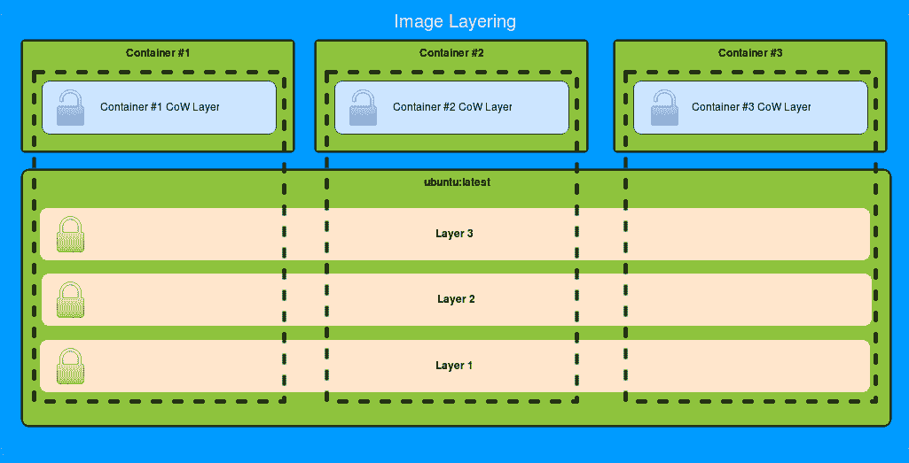
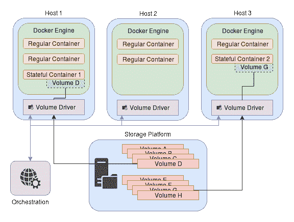
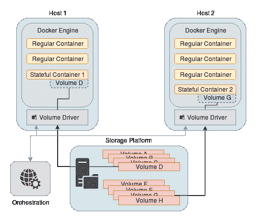

# 保持数据持久性

在本章中，我们将介绍如何通过涵盖 Docker 卷的所有内容来保持您的重要数据持久、安全并独立于您的容器。我们将涵盖各种主题，包括以下内容：

+   Docker 镜像内部

+   部署您自己的存储库实例

+   瞬态存储

+   持久存储

+   绑定挂载

+   命名卷

+   可移动卷

+   用户和组 ID 处理

虽然我们不会涵盖所有可用的存储选项，特别是那些特定于编排工具的选项，但本章应该让您更好地了解 Docker 如何处理数据，以及您可以采取哪些措施来确保数据被保持在您想要的方式。

# Docker 镜像内部

为了更好地理解为什么我们需要持久性数据，我们首先需要详细了解 Docker 如何处理容器层。我们在之前的章节中已经详细介绍了这个主题，但在这里，我们将花一些时间来了解底层发生了什么。我们将首先讨论 Docker 目前如何处理容器内部的写入数据。

# 镜像的分层方式

正如我们之前所介绍的，Docker 将组成镜像的数据存储在一组离散的只读文件系统层中，当您构建镜像时，这些层会堆叠在一起。对文件系统所做的任何更改都会像透明幻灯片一样堆叠在一起，以创建完整的树，任何具有更新内容的文件（包括完全删除的文件）都会用新层遮盖旧的文件。我们以前对此的理解深度可能已经足够用于基本的容器处理，但对于高级用法，我们需要了解数据的全部内部处理方式。

当您使用相同的基础镜像启动多个容器时，它们都会被赋予与原始镜像相同的一组文件系统层，因此它们从完全相同的文件系统历史开始（除了任何挂载的卷或变量），这是我们所期望的。然而，在启动过程中，会在镜像顶部添加一个额外的可写层，该层会保留容器内部写入的任何数据：



正如您所期望的那样，任何新文件都将写入此顶层，但是这个层实际上不是与其他层相同的类型，而是特殊的**写时复制**（CoW）类型。如果您在容器中写入的文件已经是底层层之一的一部分，Docker 将在新层中对其进行复制，掩盖旧文件，并从那时起，如果您读取或写入该文件，CoW 层将返回其内容。

如果您在不尝试保存这个新的 CoW 层或不使用卷的情况下销毁此容器，就像我们之前在不同的上下文中经历过的那样，这个可写层将被删除，并且容器写入文件系统的所有数据将被有效删除。实际上，如果您通常将容器视为具有薄且可写的 CoW 层的镜像，您会发现这种分层系统是多么简单而有效。

# 持久化可写的 CoW 层

在某个时候，您可能希望保存可写的容器层，以便以后用作常规镜像。虽然强烈不建议这种类型的镜像拼接，我大多数情况下也会同意，但您可能会发现在其他方式无法调查容器代码时，它可以为您提供一个宝贵的调试工具。要从现有容器创建镜像，有`docker commit`命令：

```
$ docker commit --help

Usage:  docker commit [OPTIONS] CONTAINER [REPOSITORY[:TAG]]

Create a new image from a container's changes

Options:
 -a, --author string    Author (e.g., "John Hannibal Smith <hannibal@a-team.com>")
 -c, --change list      Apply Dockerfile instruction to the created image
 --help             Print usage
 -m, --message string   Commit message
 -p, --pause            Pause container during commit (default true)
```

如您所见，我们只需要一些基本信息，Docker 会处理其余的部分。我们自己试一下如何：

```
$ # Run a new NGINX container and add a new file to it
$ docker run -d nginx:latest
2020a3b1c0fdb83c1f70c13c192eae25e78ca8288c441d753d5b42461727fa78
$ docker exec -it \
              2020a3b1 \
              /bin/bash -c "/bin/echo test > /root/testfile"

$ # Make sure that the file is in /root
$ docker exec -it \
              2020a3b1 \
              /bin/ls /root
testfile

$ # Check what this container's base image is so that we can see changes
$ docker inspect 2020a3b1 | grep Image
 "Image": "sha256:b8efb18f159bd948486f18bd8940b56fd2298b438229f5bd2bcf4cedcf037448",
 "Image": "nginx:latest",

$ # Commit our changes to a new image called "new_nginx_image"
$ docker commit -a "Author Name <author@site.com>" \
                -m "Added a test file" \
                2020a3b1 new_nginx_image
sha256:fda147bfb46277e55d9edf090c5a4afa76bc4ca348e446ca980795ad4160fc11

$ # Clean up our original container
$ docker stop 2020a3b1 && docker rm 2020a3b1
2020a3b1
2020a3b1

$ # Run this new image that includes the custom file
$ docker run -d new_nginx_image
16c5835eef14090e058524c18c9cb55f489976605f3d8c41c505babba660952d

$ # Verify that the file is there
$ docker exec -it \
              16c5835e \
              /bin/ls /root
testfile

$ # What about the content?
$ docker exec -it \
              16c5835e \
              /bin/cat /root/testfile
test

$ See what the new container's image is recorded as
$ docker inspect 16c5835e | grep Image
 "Image": "sha256:fda147bfb46277e55d9edf090c5a4afa76bc4ca348e446ca980795ad4160fc11",
 "Image": "new_nginx_image",

$ # Clean up
$ docker stop 16c5835e && docker rm 16c5835e
16c5835e
16c5835e
```

`docker commit -c`开关非常有用，并且像 Dockerfile 一样向镜像添加命令，并接受 Dockerfile 接受的相同指令，但由于这种形式很少使用，我们决定跳过它。如果您想了解更多关于这种特定形式和/或更多关于`docker commit`的信息，请随意在闲暇时探索[`docs.docker.com/engine/reference/commandline/commit/#commit-a-container-with-new-configurations`](https://docs.docker.com/engine/reference/commandline/commit/#commit-a-container-with-new-configurations)。

# 运行您自己的镜像注册表

在我们之前的章节中，在 Swarm 部署期间，我们收到了有关不使用注册表来存储我们的镜像的警告，而且理由充分。我们所做的所有工作都是基于我们的镜像仅对我们本地的 Docker 引擎可用，因此多个节点无法使用我们构建的任何镜像。对于绝对基本的设置，您可以使用 Docker Hub（[`hub.docker.com/`](https://hub.docker.com/)）作为托管公共镜像的选项，但由于几乎每个**虚拟私有云（VPC）**集群都使用其自己的内部私有注册表实例来确保安全、速度和隐私，我们将把 Docker Hub 作为一个探索的练习留给您，如果您想探索它，我们将介绍如何在这里运行我们自己的注册表。

Docker 最近推出了一个名为 Docker Cloud 的服务（[`cloud.docker.com/`](https://cloud.docker.com/)），其中包括私有注册表托管和持续集成，可能涵盖了小规模部署的相当多的用例，尽管目前该服务在单个私有存储库之外并不免费。一般来说，建立可扩展的基于 Docker 的集群的最受欢迎的方式是使用私有托管的注册表，因此我们将专注于这种方法，但要密切关注 Docker Cloud 正在开发的功能集，因为它可能填补了集群中的一些运营空白，您可以在构建基础设施的其他部分时推迟处理这些空白。

为了在本地托管注册表，Docker 提供了一个 Docker Registry 镜像（`registry:2`），您可以将其作为常规容器运行，包括以下后端：

+   `inmemory`：使用本地内存映射的临时镜像存储。这仅建议用于测试。

+   `filesystem`：使用常规文件系统树存储镜像。

+   `s3`，`azure`，`swift`，`oss`，`gcs`：云供应商特定的存储后端实现。

让我们部署一个具有本地文件系统后端的注册表，并看看它如何被使用。

警告！以下部分不使用 TLS 安全或经过身份验证的注册表配置。虽然在一些孤立的 VPC 中，这种配置可能是可以接受的，但通常情况下，您希望使用 TLS 证书来保护传输层，并添加某种形式的身份验证。幸运的是，由于 API 是基于 HTTP 的，您可以在不安全的注册表上使用反向代理的 Web 服务器，就像我们之前使用 NGINX 一样。由于证书需要被您的 Docker 客户端评估为“有效”，而这个过程对于几乎每个操作系统来说都是不同的，因此在大多数配置中，这里的工作通常不具备可移植性，这就是为什么我们跳过它的原因。

```
$ # Make our registry storage folder
$ mkdir registry_storage

$ # Start our registry, mounting the data volume in the container
$ # at the expected location. Use standard port 5000 for it.
$ docker run -d \
 -p 5000:5000 \
 -v $(pwd)/registry_storage:/var/lib/registry \
 --restart=always \
 --name registry \
 registry:2 
19e4edf1acec031a34f8e902198e6615fda1e12fb1862a35442ac9d92b32a637

$ # Pull a test image into our local Docker storage
$ docker pull ubuntu:latest
latest: Pulling from library/ubuntu
<snip>
Digest: sha256:2b9285d3e340ae9d4297f83fed6a9563493945935fc787e98cc32a69f5687641
Status: Downloaded newer image for ubuntu:latest

$ # "Tag our image" by marking it as something that is linked to our local registry
$ # we just started
$ docker tag ubuntu:latest localhost:5000/local-ubuntu-image

$ # Push our ubuntu:latest image into our local registry under "local-ubuntu-image" name
$ docker push localhost:5000/local-ubuntu-image
The push refers to a repository [localhost:5000/local-ubuntu-image]
<snip>
latest: digest: sha256:4b56d10000d71c595e1d4230317b0a18b3c0443b54ac65b9dcd3cac9104dfad2 size: 1357

$ # Verify that our image is in the right location in registry container
$ ls registry_storage/docker/registry/v2/repositories/
local-ubuntu-image

$ # Remove our images from our main Docker storage
$ docker rmi ubuntu:latest localhost:5000/local-ubuntu-image
Untagged: ubuntu:latest
Untagged: localhost:5000/local-ubuntu-image:latest
<snip>

$ # Verify that our Docker Engine doesn't have either our new image
$ # nor ubuntu:latest
$ docker images
REPOSITORY                TAG                 IMAGE ID            CREATED             SIZE

$ # Pull the image from our registry container to verify that our registry works
$ docker pull localhost:5000/local-ubuntu-image
Using default tag: latest
latest: Pulling from local-ubuntu-image
<snip>
Digest: sha256:4b56d10000d71c595e1d4230317b0a18b3c0443b54ac65b9dcd3cac9104dfad2
Status: Downloaded newer image for localhost:5000/local-ubuntu-image:latest

$ # Great! Verify that we have the image.
$ docker images
REPOSITORY                          TAG                 IMAGE ID            CREATED             SIZE
localhost:5000/local-ubuntu-image   latest              8b72bba4485f        23 hours ago        120MB
```

如您所见，使用本地注册表似乎非常容易！这里引入的唯一新事物可能需要在注册表本身之外进行一些覆盖的是`--restart=always`，它确保容器在意外退出时自动重新启动。标记是必需的，以将图像与注册表关联起来，因此通过执行`docker tag [<source_registry>/]<original_tag_or_id> [<target_registry>/]<new_tag>`，我们可以有效地为现有图像标签分配一个新标签，或者我们可以创建一个新标签。正如在这个小的代码片段中所示，源和目标都可以以可选的存储库位置为前缀，如果未指定，则默认为`docker.io`（Docker Hub）。

遗憾的是，根据个人经验，尽管这个例子让事情看起来很容易，但实际的注册表部署绝对不容易，因为外表可能具有欺骗性，而在使用它时需要牢记一些事情：

+   如果您使用不安全的注册表，要从不同的机器访问它，您必须将`"insecure-registries" : ["<ip_or_dns_name>:<port>"]`添加到将使用该注册表的图像的每个 Docker 引擎的`/etc/docker/daemon.json`中。

+   注意：出于许多安全原因，不建议使用此配置。

+   如果您使用无效的 HTTPS 证书，您还必须在所有客户端上将其标记为不安全的注册表。

+   这种配置也不建议，因为它只比不安全的注册表稍微好一点，可能会导致传输降级**中间人攻击（MITM）**。

我要给你的最后一条建议是，根据我的经验，注册表的云提供商后端文档一直都是错误的，并且一直（我敢说是故意的吗？）错误。我强烈建议，如果注册表拒绝了你的设置，你应该查看源代码，因为设置正确的变量相当不直观。你也可以使用挂载文件来配置注册表，但如果你不想在集群刚启动时构建一个新的镜像，环境变量是一个不错的选择。环境变量都是全大写的名称，用`_`连接起来，并与可用选项的层次结构相匹配：

```
parent
└─ child_option
 └─ some_setting
```

然后，注册表的这个字段将设置为`-e PARENT_CHILD_OPTION_SOME_SETTING=<value>`。

有关可用注册表选项的完整列表，您可以访问[`github.com/docker/docker-registry/blob/master/config/config_sample.yml`](https://github.com/docker/docker-registry/blob/master/config/config_sample.yml)，并查看您需要运行注册表的选项。正如前面提到的，我发现[docs.docker.com](https://docs.docker.com/)上的主要文档以及代码存储库本身的大部分文档在配置方面极不可靠，因此不要害怕阅读源代码以找出注册表实际期望的内容。

为了帮助那些将使用最有可能的后备存储（在“文件系统”之外）部署注册表的人，即`s3`，我将留下一个可用的（在撰写本文时）配置：

```
$ docker run -d \
 -p 5000:5000 \
 -v $(pwd)/registry_storage:/var/lib/registry \
             -e REGISTRY_STORAGE=s3 \
 -e REGISTRY_STORAGE_CACHE_BLOBDESCRIPTOR=inmemory \
 -e REGISTRY_STORAGE_S3_ACCESSKEY=<aws_key_id> \
 -e REGISTRY_STORAGE_S3_BUCKET=<bucket> \
 -e REGISTRY_STORAGE_S3_REGION=<s3_region> \
 -e REGISTRY_STORAGE_S3_SECRETKEY=<aws_key_secret> \
 --restart=always \
 --name registry \
 registry:2
```

```
 --name registry
```

# 底层存储驱动程序

这一部分对一些读者来说可能有点高级，并且并不严格要求阅读，但为了充分理解 Docker 如何处理镜像以及在大规模部署中可能遇到的问题，我鼓励每个人至少浏览一下，因为识别后备存储驱动程序问题可能会有用。另外，请注意，这里提到的问题可能随着 Docker 代码库的演变而变得不太适用，因此请查看他们的网站以获取最新信息。

与您可能从 Docker 守护程序期望的不同，本地图像层的处理实际上是以非常模块化的方式进行的，因此几乎可以将任何分层文件系统驱动程序插入到守护程序中。存储驱动程序控制着图像在您的 Docker 主机上的存储和检索方式，虽然从客户端的角度看可能没有任何区别，但每个驱动程序在许多方面都是独一无二的。

首先，我们将提到的所有可用存储驱动程序都是由 Docker 使用的底层容器化技术`containerd`提供的。虽然了解它之外的任何内容通常对大多数 Docker 用途来说都是多余的，但可以说它只是 Docker 用作图像处理 API 的底层模块之一。`containerd`提供了一个稳定的 API，用于存储和检索图像及其指定的层，以便构建在其之上的任何软件（如 Docker 和 Kubernetes）只需担心将其全部整合在一起。

您可能会在代码和/或文档中看到有关称为图形驱动程序的内容，这在学究式上是与存储驱动程序进行交互的高级 API，但在大多数情况下，当它被写入时，它用于描述实现图形驱动程序 API 的存储驱动程序；例如，当谈论新类型的存储驱动程序时，您经常会看到它被称为新的图形驱动程序。

要查看您正在使用的后备文件系统，可以输入`docker info`并查找`Storage Driver`部分：

```
$ docker info
<snip>
Storage Driver: overlay2
 Backing Filesystem: extfs
 Supports d_type: true
 Native Overlay Diff: true
<snip>
```

警告！在大多数情况下，更改存储驱动程序将删除您的计算机上由旧驱动程序存储的任何和所有图像和层的访问权限，因此请谨慎操作！此外，我相信通过更改存储驱动程序而不通过 CLI 手动清理图像和容器，或者通过从`/var/lib/docker/`中删除内容，将使这些图像和容器悬空，因此请确保在考虑这些更改时清理一下。

如果您想将存储驱动程序更改为我们将在此处讨论的任何选项，您可以编辑（或创建缺失的）`/etc/docker/daemon.json`并在其中添加以下内容，之后应重新启动 docker 服务：

```
{
  "storage-driver": "driver_name"
}
```

如果`daemon.json`不起作用，您还可以尝试通过向`DOCKER_OPTS`添加`-s`标志并重新启动服务来更改`/etc/default/docker`：

```
DOCKER_OPTS="-s driver_name"
```

一般来说，Docker 正在从`/etc/default/docker`（取决于发行版的路径）过渡到`/etc/docker/daemon.json`作为其配置文件，因此，如果您在互联网或其他文档中看到引用了前者文件，请查看是否可以找到`daemon.json`的等效配置，因为我相信它将在将来的某个时候完全取代另一个（就像所有的书籍一样，可能是在这本书发布后的一周内）。

所以现在我们知道了存储驱动程序是什么，以及如何更改它们，我们可以在这里使用哪些选项呢？

# aufs

`aufs`（也称为`unionfs`）是 Docker 可用的最古老但可能也是最成熟和稳定的分层文件系统。这种存储驱动程序通常启动快速，并且在存储和内存开销方面非常高效。如果您的内核已构建支持此驱动程序，Docker 将默认使用它，但通常情况下，除了 Ubuntu 并且只有安装了`linux-image-extra-$(uname -r)`软件包的情况下，大多数发行版都不会将该驱动程序添加到其内核中，也不会提供该驱动程序，因此您的计算机很可能无法运行它。您可以下载内核源代码并重新编译以支持`aufs`，但通常情况下，这是一个维护的噩梦，如果它不容易获得，您可能会选择不同的存储驱动程序。您可以使用`grep aufs /proc/filesystems`来检查您的计算机是否启用并可用`aufs`内核模块。

请注意，`aufs`驱动程序只能用于`ext4`和`xfs`文件系统。

# btrfs / zfs

这些在概念上不太像驱动程序，而更像是您在`/var/lib/docker`下挂载的实际文件系统，每个都有其自己的一套优缺点。一般来说，它们都会对性能产生影响，与其他选项相比具有较高的内存开销，但可能为您提供更容易的管理工具和/或更高密度的存储。由于这些驱动程序目前的支持有限，我听说仍然存在许多影响它们的关键错误，所以我不建议在生产环境中使用它们，除非您有非常充分的理由这样做。如果系统在`/var/lib/docker`下挂载了适当的驱动，并且相关的内核模块可用，Docker 将在`aufs`之后选择这些驱动程序。

请注意，这里的优先顺序并不意味着这两个存储驱动程序比本节中提到的其他存储驱动程序更可取，而纯粹是如果驱动器已挂载到适当（且不常见）的文件系统位置，则 Docker 将假定这是用户想要的配置。

# overlay 和 overlay2

这些特定的存储驱动程序正在逐渐成为 Docker 安装的首选。它们与`aufs`非常相似，但实现速度更快，更简单。与`aufs`一样，`overlay`和`overlay2`都需要包含和加载内核叠加模块，一般来说应该在 3.18 及更高版本的内核上可用。此外，两者只能在`ext4`或`xfs`文件系统上运行。`overlay`和`overlay2`之间的区别在于较新版本在内核 4.0 中添加了减少`inode`使用的改进，而较旧版本在领域中有更长的使用记录。如果您有任何疑问，`overlay2`几乎在任何情况下都是一个非常可靠的选择。

如果您以前没有使用过 inode，请注意它们包含有关文件系统上每个单独文件的元数据，并且在创建文件系统时大多数情况下都是硬编码的最大计数。虽然这种硬编码的最大值对于大多数一般用途来说是可以的，但也有一些边缘情况，您可能会用尽它们，这种情况下文件系统将在任何新文件创建时给出错误，即使您有可用空间来存储文件。如果您想了解更多关于这些结构的信息，您可以访问[`www.linfo.org/inode.html`](http://www.linfo.org/inode.html)。`overlay`和`overlay2`支持的存储驱动程序由于其内部处理文件复制的方式而被认为会导致大量的 inode 使用。虽然`overlay2`被宣传为不会出现这些问题，但我个人在使用默认 inode 最大值构建大型 Docker 卷时多次遇到 inode 问题。如果您曾经使用这些驱动程序并注意到磁盘已满但设备上仍有空间，请使用`df -i`检查 inode 是否已用尽，以确保不是 Docker 存储引起的问题。

# devicemapper

这个驱动程序不是在文件级设备上工作，而是直接在 Docker 实例所在的块设备上操作。虽然默认设置通常会设置一个回环设备，并且在本地测试时大多数情况下都很好，但由于在回环设备中创建的稀疏文件，这种特定设置极不建议用于生产系统。对于生产系统，建议您将其与`direct-lvm`结合使用，但这种复杂的设置需要特别棘手且比`overlay`存储驱动慢，因此我通常不建议使用它，除非您无法使用`aufs`或`overlay`/`overlay2`。

# Docker 存储的清理

如果您使用 Docker 镜像和容器，您会注意到，一般来说，Docker 会相对快速地消耗您提供的任何存储空间，因此建议定期进行适当的维护，以确保您的主机上不会积累无用的垃圾或者某些存储驱动程序的 inode 用尽。

# 手动清理

首先是清理您运行过但忘记使用`--rm`的所有容器，使用`docker rm`：

```
$ docker rm $(docker ps -aq)
86604ed7bb17
<snip>
7f7178567aba
```

这个命令有效地找到所有容器（`docker ps`），甚至是您停止的容器（`-a`标志），并且只返回它们的 ID（`-q`标志）。然后将其传递给`docker rm`，它将尝试逐个删除它们。如果有任何容器仍在运行，它将给出警告并跳过它们。一般来说，如果您的容器是无状态的或者具有在容器本身之外存储的状态，这通常是一个很好的做法，您可以随时执行。

接下来，尽管可能更具破坏性和节省空间，但要删除您积累的 Docker 镜像。如果您经常遇到空间问题，手动删除可能非常有效。一个经验法则是，任何标签为`<none>`的镜像（也称为悬空）通常可以使用`docker rmi`来删除，因为在大多数情况下，这些镜像表明该镜像已被`Dockerfile`的新版本取代：

```
$ docker images --filter "dangling=true"
REPOSITORY          TAG                 IMAGE ID            CREATED             SIZE
<none>              <none>              873473f192c8        7 days ago          129MB
<snip>
registry            <none>              751f286bc25e        7 weeks ago         33.2MB

$ # Use those image IDs and delete them
$ docker rmi $(docker images -q --filter "dangling=true")
 Deleted: sha256:873473f192c8977716fcf658c1fe0df0429d4faf9c833b7c24ef269cacd140ff
<snip>
Deleted: sha256:2aee30e0a82b1a6b6b36b93800633da378832d623e215be8b4140e8705c4101f
```

# 自动清理

我们刚刚做的所有事情似乎都很痛苦，很难记住，所以 Docker 最近添加了`docker image prune`来帮助解决这个问题。通过使用`docker image prune`，所有悬空的镜像将被一条命令删除：

```
$ docker image prune 
WARNING! This will remove all dangling images.
Are you sure you want to continue? [y/N] y 
Deleted Images:
untagged: ubuntu@sha256:2b9285d3e340ae9d4297f83fed6a9563493945935fc787e98cc32a69f5687641
deleted: sha256:8b72bba4485f1004e8378bc6bc42775f8d4fb851c750c6c0329d3770b3a09086
<snip>
deleted: sha256:f4744c6e9f1f2c5e4cfa52bab35e67231a76ede42889ab12f7b04a908f058551

Total reclaimed space: 188MB
```

如果您打算清理与容器无关的所有镜像，还可以运行`docker image prune -a`。鉴于这个命令相当具有破坏性，除了在 Docker 从属节点上夜间/每周定时器上运行它以减少空间使用之外，在大多数情况下我不建议这样做。

需要注意的是，正如您可能已经注意到的，删除对镜像层的所有引用也会级联到子层。

最后但同样重要的是卷的清理，可以使用`docker volume`命令进行管理。我建议在执行此操作时要极度谨慎，以避免删除您可能需要的数据，并且只使用手动卷选择或`prune`。

```
$ docker volume ls
DRIVER              VOLUME NAME
local               database_volume
local               local_storage
local               swarm_test_database_volume

$ docker volume prune 
WARNING! This will remove all volumes not used by at least one container.
Are you sure you want to continue? [y/N] y 
Deleted Volumes:
local_storage
swarm_test_database_volume
database_volume

Total reclaimed space: 630.5MB
```

作为参考，我在写这一章的那周对 Docker 的使用相当轻，清理了陈旧的容器、镜像和卷后，我的文件系统使用量减少了大约 3GB。虽然这个数字大部分是个人经验，并且可能看起来不多，但在具有小实例硬盘的云节点和添加了持续集成的集群上，保留这些东西会比你意识到的更快地耗尽磁盘空间，因此期望花一些时间手动执行这个过程，或者为您的节点自动化这个过程，比如使用`systemd`定时器或`crontab`。

# 持久存储

既然我们已经讨论了瞬态本地存储，现在我们可以考虑当容器死亡或移动时，我们还有哪些选项可以保护数据安全。正如我们之前讨论过的，如果不能以某种方式将容器中的数据保存到外部源，那么当节点或容器在提供服务时意外死机时（比如您的数据库），您很可能会丢失其中包含的一些或全部数据，这绝对是我们想要避免的。使用一些形式的容器外部存储来存储您的数据，就像我们在之前的章节中使用挂载卷一样，我们可以开始使集群真正具有弹性，并且在其上运行的容器是无状态的。

通过使容器无状态，您可以放心地不用太担心容器在哪个 Docker 引擎上运行，只要它们可以拉取正确的镜像并使用正确的参数运行即可。如果您仔细考虑一下，您甚至可能会注意到这种方法与线程有很多相似之处，但是更加强大。您可以将 Docker 引擎想象成虚拟 CPU 核心，每个服务作为一个进程，每个任务作为一个线程。考虑到这一点，如果您的系统中的一切都是无状态的，那么您的集群也是无状态的，因此，您必须利用容器外的某种形式的数据存储来保护您的数据。

注意！最近，我注意到一些在线来源一直在建议您通过大规模复制服务、分片和集群化后端数据库来保留数据，而不将数据持久化在磁盘上，依赖于云提供商的分布式可用区和信任**服务级别协议**（SLA）来为您的集群提供弹性和自愈特性。虽然我同意这些集群在某种程度上是有弹性的，但如果没有某种形式的永久物理表示您的数据的存储，您可能会在数据完全复制之前遇到集群的级联故障，并且有风险丢失数据而无法恢复。在这里，我个人建议至少有一个节点在您的有状态服务中使用存储，这种存储是在出现问题时不会被擦除的物理介质（例如 NAS、AWS EBS 存储等）。

# 节点本地存储

这种存储类型是外部于容器的，专门用于将数据与容器实例分开，但仅限于在部署到同一节点的容器内使用。这种存储允许无状态容器设置，并具有许多面向开发的用途，例如隔离构建和读取配置文件，但对于集群部署来说，它受到严重限制，因为在其他节点上运行的容器将无法访问在原始节点上创建的数据。无论哪种情况，我们将在这里涵盖所有这些节点本地存储类型，因为大多数大型集群都使用节点本地存储和可重定位存储的某种组合。

# 绑定挂载

我们之前见过这些，但也许我们不知道它们是什么。绑定挂载将特定文件或文件夹挂载到容器沙箱中的指定位置，用`:`分隔。到目前为止，我们使用的一般语法应该类似于以下内容：

```
$ docker run <run_params> \
             -v /path/on/host:/path/on/container \
             <image>...
```

这个功能的新的 Docker 语法正在逐渐成为标准，其中`-v`和`--volume`现在正在被`--mount`替换，所以你也应该习惯这种语法。事实上，从现在开始，我们将尽可能多地使用两种语法，以便你能够熟悉任何一种风格，但在撰写本书时，`--mount`还没有像替代方案那样完全功能，所以根据工作情况和不工作情况，可能会有一些交替。

特别是在这里，在这个时候，一个简单的绑定挂载卷，带有绝对路径源，与几乎所有我们迄今为止使用的`--mount`样式都不起作用，这就是为什么我们之前没有介绍这种形式的原因。

说了这么多，不像`--volume`，`--mount`是一个`<key>=<value>`逗号分隔的参数列表：

+   `类型`：挂载的类型，可以是`bind`，`volume`或`tmpfs`。

+   `源`：挂载的源。

+   `target`：容器中源将被挂载的位置。

+   `readonly`：使挂载为只读。

+   `volume-opt`：卷的额外选项。可以输入多次。

这是我们用于`--volume`的比较版本：

```
$ docker run <run_params> \
             --mount source=/path/on/host,target=/path/on/container \
             <image>...
```

# 只读绑定挂载

我们之前没有真正涵盖的另一种绑定挂载类型是只读绑定挂载。当容器中挂载的数据需要保持只读时，这种配置非常有用，尤其是从主机向多个容器传递配置文件时。这种挂载卷的形式看起来有点像这样，适用于两种语法风格：

```
$ # Old-style
$ docker run <run_params> \
             -v /path/on/host:/path/on/container:ro \
             <image>...

$ # New-style
$ docker run <run_params> \
             --mount source=/path/on/host,target=/path/on/container,readonly \
             <image>...
```

正如稍早提到的，只读卷相对于常规挂载可以为我们提供一些东西，这是从主机传递配置文件到容器的。这通常在 Docker 引擎主机有一些影响容器运行代码的配置时使用（即，用于存储或获取数据的路径前缀，我们正在运行的主机，机器从`/etc/resolv.conf`使用的 DNS 解析器等），因此在大型部署中广泛使用，并且经常会看到。

作为一个很好的经验法则，除非你明确需要向卷写入数据，否则始终将其挂载为只读到容器中。这将防止从一个受损的容器传播到其他容器和主机本身的安全漏洞的意外打开。

# 命名卷

另一种卷挂载的形式是使用命名卷。与绑定挂载不同，命名数据卷（通常称为数据卷容器）提供了一种更便携的方式来引用卷，因为它们不依赖于对主机的任何了解。在底层，它们的工作方式几乎与绑定挂载完全相同，但由于使用更简单，它们更容易处理。此外，它们还有一个额外的好处，就是可以很容易地在容器之间共享，甚至可以由与主机无关的解决方案或完全独立的后端进行管理。

注意！如果命名的数据卷是通过简单地运行容器创建的，与字面上替换容器在挂载路径上的所有内容的绑定挂载不同，当容器启动时，命名的数据卷将把容器镜像在该位置的内容复制到命名的数据卷中。这种差异非常微妙，但可能会导致严重的问题，因为如果你忘记了这个细节或者假设它的行为与绑定挂载相同，你可能会在卷中得到意外的内容。

现在我们知道了命名数据卷是什么，让我们通过使用早期配置方法（而不是直接运行容器创建一个）来创建一个。

```
$ # Create our volume
$ docker volume create mongodb_data
mongodb_data

$ docker volume inspect mongodb_data
[
 {
 "Driver": "local",
 "Labels": {},
 "Mountpoint": "/var/lib/docker/volumes/mongodb_data/_data",
 "Name": "mongodb_data",
 "Options": {},
 "Scope": "local"
 }
]

$ # We can start our container now
$ # XXX: For non-bind-mounts, the new "--mount" option
$ #      works fine so we will use it here
$ docker run -d \
             --mount source=mongodb_data,target=/data/db \
             mongo:latest
888a8402d809174d25ac14ba77445c17ab5ed371483c1f38c918a22f3478f25a

$ # Did it work?
$ docker exec -it 888a8402 ls -la /data/db
total 200
drwxr-xr-x 4 mongodb mongodb  4096 Sep 16 14:10 .
drwxr-xr-x 4 root    root     4096 Sep 13 21:18 ..
-rw-r--r-- 1 mongodb mongodb    49 Sep 16 14:08 WiredTiger
<snip>
-rw-r--r-- 1 mongodb mongodb    95 Sep 16 14:08 storage.bson

$ # Stop the container
$ docker stop 888a8402 && docker rm 888a8402
888a8402
888a8402

$ # What does our host's FS have in the
$ # volume storage? (path used is from docker inspect output)
$ sudo ls -la /var/lib/docker/volumes/mongodb_data/_data
total 72
drwxr-xr-x 4  999 docker 4096 Sep 16 09:08 .
drwxr-xr-x 3 root root   4096 Sep 16 09:03 ..
-rw-r--r-- 1  999 docker 4096 Sep 16 09:08 collection-0-6180071043564974707.wt
<snip>
-rw-r--r-- 1  999 docker 4096 Sep 16 09:08 WiredTiger.wt

$ # Remove the new volume
$ docker volume rm mongodb_data
mongodb_data
```

在使用之前手动创建卷（使用`docker volume create`）通常是不必要的，但在这里这样做是为了演示这样做的长格式，但我们可以只是启动我们的容器作为第一步，Docker 将自行创建卷。

```
$ # Verify that we don't have any volumes
$ docker volume ls
DRIVER              VOLUME NAME

$ # Run our MongoDB without creating the volume beforehand
$ docker run -d \
             --mount source=mongodb_data,target=/data/db \
             mongo:latest
f73a90585d972407fc21eb841d657e5795d45adc22d7ad27a75f7d5b0bf86f69

$ # Stop and remove our container
$ docker stop f73a9058 && docker rm f73a9058
f73a9058
f73a9058

$ # Check our volumes
$ docker volume ls
DRIVER              VOLUME NAME
local               4182af67f0d2445e8e2289a4c427d0725335b732522989087579677cf937eb53
local               mongodb_data

$ # Remove our new volumes
$ docker volume rm mongodb_data 4182af67f0d2445e8e2289a4c427d0725335b732522989087579677cf937eb53
mongodb_data
4182af67f0d2445e8e2289a4c427d0725335b732522989087579677cf937eb53
```

你可能已经注意到，在这里，我们最终得到了两个卷，而不仅仅是我们预期的`mongodb_data`，如果你按照前面的例子进行了这个例子，你可能实际上有三个（一个命名，两个随机命名）。这是因为每个启动的容器都会创建`Dockerfile`中定义的所有本地卷，无论你是否给它们命名，而且我们的 MongoDB 镜像实际上定义了两个卷：

```
$ # See what volumes Mongo image defines
$ docker inspect mongo:latest | grep -A 3 Volumes
<snip>
            "Volumes": {
                "/data/configdb": {},
                "/data/db": {}
            },
```

我们只给第一个命名，所以`/data/configdb`卷收到了一个随机的名称。要注意这样的事情，因为如果你不够注意，你可能会遇到空间耗尽的问题。偶尔运行`docker volume prune`可以帮助回收空间，但要小心使用这个命令，因为它会销毁所有未绑定到容器的卷。

# 可移动卷

我们之前讨论的所有这些选项在单个主机上工作时都很好，但它们缺乏不同物理主机之间的真正数据可移植性。例如，当前的保持数据持久性的方法实际上可以扩展到但不能超出（没有一些极端的黑客行为）单个物理服务器与单个 Docker 引擎和共享附加存储。这对于强大的服务器可能还可以，但在真正的集群配置中开始缺乏任何形式的用途，因为您可能会处理未知数量的服务器，混合虚拟和物理主机，不同的地理区域等等。

此外，当容器重新启动时，您很可能无法轻易预测它将在何处启动，以便在其启动时为其提供卷后端。对于这种用例，有一些被称为可移动卷的东西。它们有各种不同的名称，比如“共享多主机存储”，“编排数据卷”等等，但基本上想法在各方面都是相同的：拥有一个数据卷，无论容器去哪里，它都会跟随。

为了举例说明，在这里，我们有三个主机，连接着两个有状态服务，它们都使用相同的可移动卷存储驱动程序：

+   **带有** **卷 D** 的**有状态容器 1**在**主机 1**上

+   **带有** **卷 G** 的**有状态容器 2**在**主机 3**上



为了这个例子，假设**主机 3**已经死机。在正常的卷驱动程序情况下，**有状态** **容器 2**的所有数据都会丢失，但因为您将使用可移动存储：

+   编排平台将通知您的存储驱动程序容器已经死亡。

+   编排平台将指示它希望在具有可用资源的主机上重新启动被杀死的服务。

+   卷驱动程序将将相同的卷挂载到将运行服务的新主机上。

+   编排平台将启动服务，并将卷详细信息传递到新容器中。

在我们的假设示例中，新系统状态应该看起来有点像这样：



从外部观点来看，没有任何变化，数据无缝地过渡到新容器并保持其状态，这正是我们想要的。对于这个特定目的，有许多 Docker 卷驱动程序可供选择，每个驱动程序都有其自己的配置方法用于各种存储后端，但 Docker 预构建的 Azure 和 AWS 镜像中唯一包含的是 CloudStor，它仅适用于 Docker Swarm，使其非常特定且完全不可移植。

出于各种原因，包括技术的老化和 Docker 以及插件开发人员的支持不力，不得不进行这种类型的卷处理很可能会是在构建基础设施时您要花费大量时间的部分。我不想打击你的积极性，但在撰写本文时，无论易于教程可能让您相信的是，事实情况确实非常严峻。

您可以在[`docs.docker.com/engine/extend/legacy_plugins/#volume-plugins`](https://docs.docker.com/engine/extend/legacy_plugins/#volume-plugins)找到大多数驱动程序。配置后，如果您手动进行管理挂载而没有编排，可以按以下方式使用它们：

```
$ # New-style volume switch (--mount)
$ docker run --mount source=<volume_name>,target=/dest/path,volume-driver=<name> \
             <image>...

$ # Old-style volume switch
$ docker run -v <volume_name>:/dest/path \
             --volume-driver <name> \
             <image>...
```

供参考，目前我认为处理可移动卷最受欢迎的插件是 Flocker、REX-Ray ([`github.com/codedellemc/rexray`](https://github.com/codedellemc/rexray))和 GlusterFS，尽管有许多可供选择的插件，其中许多具有类似的功能。如前所述，对于如此重要的功能，这个生态系统的状态相当糟糕，似乎几乎每个大型参与者都在运行他们的集群时要么分叉并构建自己的存储解决方案，要么他们自己制作并保持封闭源。一些部署甚至选择使用标签来避免完全避开这个话题，并强制特定容器去特定主机，以便它们可以使用本地挂载的卷。

Flocker 的母公司 ClusterHQ 因财务原因于 2016 年 12 月停止运营，虽然缺乏支持会给不予提及提供一点推动力，但在撰写本书时，它仍然是最受欢迎的一种卷管理方式。所有代码都在 GitHub 上开源[`github.com/ClusterHQ`](https://github.com/ClusterHQ)，因此即使没有官方支持，你也可以构建、安装和运行它。如果你想在企业环境中使用这个插件，并希望得到支持，一些原始开发人员可以通过一个名为 ScatterHQ 的新公司进行雇佣[`www.scatterhq.com/`](https://www.scatterhq.com/)，他们在[`github.com/ScatterHQ`](https://github.com/ScatterHQ)上有自己的源代码库。GlusterFS 在其原始源中没有维护，就像 Flocker 一样，但你可以从源代码库[`github.com/calavera/docker-volume-glusterfs`](https://github.com/calavera/docker-volume-glusterfs)中构建、安装和运行完整的代码。如果你想要已经接收更新的代码版本，你可以在分支网络中找到一些[`github.com/calavera/docker-volume-glusterfs/network`](https://github.com/calavera/docker-volume-glusterfs/network)。

除了所有这些生态系统的分裂，这种与 Docker 集成的特定方式开始被弃用，而更倾向于管理和安装这些插件的“docker 插件”系统，这些插件是从 Docker Hub 作为 Docker 镜像安装的，但由于这些新风格插件的可用性不足，根据你的具体用例，你可能需要使用遗留插件。

很遗憾，在撰写本书时，“docker 插件”系统像许多其他功能一样是全新的，几乎没有可用的插件。例如，在早期提到的遗留插件中，唯一使用这个新系统构建的插件是 REX-Ray，但最流行的存储后端（EBS）插件似乎无法干净地安装。当你阅读本书时，这里的情况可能已经改变，但请注意，在你自己的实现中，你可能会使用经过验证的遗留插件。

因此，在提到所有这些警告之后，让我们实际尝试获取唯一一个可以使用新的“docker 插件安装”系统找到的插件（sshfs）：

要复制这项工作，您需要访问一个启用了 SSH 并且可以从 Docker 引擎运行的地方到达的辅助机器（尽管您也可以在回环上运行），因为它使用的是支持存储系统。您还需要在设备上创建目标文件夹`ssh_movable_volume`，可能还需要根据您的设置在`sshfs`卷参数中添加`-o odmap=user`。

```
$ # Install the plugin
$ docker plugin install vieux/sshfs 
Plugin "vieux/sshfs" is requesting the following privileges:
 - network: [host]
 - mount: [/var/lib/docker/plugins/]
 - mount: []
 - device: [/dev/fuse]
 - capabilities: [CAP_SYS_ADMIN]
Do you grant the above permissions? [y/N] y
latest: Pulling from vieux/sshfs
2381f72027fc: Download complete 
Digest: sha256:72c8cfd1a6eb02e6db4928e27705f9b141a2a0d7f4257f069ce8bd813784b558
Status: Downloaded newer image for vieux/sshfs:latest
Installed plugin vieux/sshfs

$ # Sanity check
$ docker plugin ls
ID                  NAME                 DESCRIPTION               ENABLED
0d160591d86f        vieux/sshfs:latest   sshFS plugin for Docker   true

$ # Add our password to a file
$ echo -n '<password>' > password_file

$ # Create a volume backed by sshfs on a remote server with SSH daemon running
$ docker volume create -d vieux/sshfs \
 -o sshcmd=user@192.168.56.101/ssh_movable_volume \
 -o password=$(cat password_file) \
 ssh_movable_volume
ssh_movable_volume

$ # Sanity check
$ docker volume ls
DRIVER               VOLUME NAME
vieux/sshfs:latest   ssh_movable_volume

$ # Time to test it with a container
$ docker run -it \
 --rm \
 --mount source=ssh_movable_volume,target=/my_volume,volume-driver=vieux/sshfs:latest \
 ubuntu:latest \
 /bin/bash

root@75f4d1d2ab8d:/# # Create a dummy file
root@75f4d1d2ab8d:/# echo 'test_content' > /my_volume/test_file

root@75f4d1d2ab8d:/# exit
exit

$ # See that the file is hosted on the remote server
$ ssh user@192.168.56.101
user@192.168.56.101's password: 
<snip>
user@ubuntu:~$ cat ssh_movable_volume/test_file 
test_content

$ # Get back to our Docker Engine host
user@ubuntu:~$ exit
logout
Connection to 192.168.56.101 closed.

$ # Clean up the volume
$ docker volume rm ssh_movable_volume
ssh_movable_volume
```

由于卷的使用方式，这个卷大多是可移动的，并且可以允许我们需要的可移动特性，尽管大多数其他插件使用一个在 Docker 之外并行在每个主机上运行的进程来管理卷的挂载、卸载和移动，因此这些指令将大不相同。

# 可移动卷同步丢失

在这一部分中还必须提到的最后一件事是，大多数处理卷移动的插件通常只能处理连接到单个节点，因为卷被多个源写入通常会导致严重问题，因此大多数驱动程序不允许这样做。

然而，这与大多数编排引擎的主要特性相冲突，即对 Docker 服务的更改将使原始服务保持运行，直到新服务启动并通过健康检查，从而需要在旧服务和新服务任务上挂载相同的卷，实际上产生了一个鸡蛋-鸡的悖论。

在大多数情况下，这可以通过确保 Docker 在启动新服务之前完全终止旧服务来解决，但即使这样，您也可以预期偶尔旧卷将无法从旧节点快速卸载，因此新服务将无法启动。

# 卷的 UID/GID 和安全考虑

这一部分不像我在其他地方放置的小信息框那样，因为这是一个足够大的问题，足够棘手，值得有自己的部分。要理解容器**用户 ID**（**UID**）和**组 ID**（**GID**）发生了什么，我们需要了解主机系统权限是如何工作的。当你有一个带有组和用户权限的文件时，它们实际上都被映射为数字，而不是保留为用户名或组名，当你使用常规的`ls`开关列出东西时，你会看到它们：

```
$ # Create a folder and a file that we will mount in the container
$ mkdir /tmp/foo
$ cd /tmp/foo
$ touch foofile

$ # Let's see what we have. Take note of owner and group of the file and directory
$ ls -la
total 0
drwxrwxr-x  2 user user   60 Sep  8 20:20 .
drwxrwxrwt 56 root root 1200 Sep  8 20:20 ..
-rw-rw-r--  1 user user    0 Sep  8 20:20 foofile

$ # See what our current UID and GID are
$ id
uid=1001(user) gid=1001(user) <snip>

$ # How about we see the actual values that the underlying system uses
$  ls -na
total 0
drwxrwxr-x  2 1001 1001   60 Sep  8 20:20 .
drwxrwxrwt 56    0    0 1200 Sep  8 20:20 ..
-rw-rw-r--  1 1001 1001    0 Sep  8 20:20 foofile
```

当您执行`ls`时，系统会读取`/etc/passwd`和`/etc/group`以显示权限的实际用户名和组名，这是 UID/GID 映射到权限的唯一方式，但底层值是 UID 和 GID。

正如你可能已经猜到的那样，这种用户到 UID 和组到 GID 的映射在容器化系统中可能无法很好地转换，因为容器将不具有相同的`/etc/passwd`和`/etc/group`文件，但外部卷上的文件权限是与数据一起存储的。例如，如果容器有一个 GID 为`1001`的组，它将匹配我们的`foofile`上的组权限位`-rw`，如果它有一个 UID 为`1001`的用户，它将匹配我们文件上的`-rw`用户权限。相反，如果您的 UID 和 GID 不匹配，即使容器和主机上有相同名称的组或用户，您也不会拥有正确的 UID 和 GID 以进行适当的权限处理。是时候看看我们可以用这个做成什么样的混乱了：

```
$ ls -la
total 0
drwxrwxr-x  2 user user   60 Sep  8 21:16 .
drwxrwxrwt 57 root root 1220 Sep  8 21:16 ..
-rw-rw-r--  1 user user    0 Sep  8 21:16 foofile 
$ ls -na
total 0
drwxrwxr-x  2 1001 1001   60 Sep  8 21:16 .
drwxrwxrwt 57    0    0 1220 Sep  8 21:16 ..
-rw-rw-r--  1 1001 1001    0 Sep  8 21:16 foofile

$ # Start a container with this volume mounted
$ # Note: We have to use the -v form since at the time of writing this
$ #       you can't mount a bind mount with absolute path :(
$ docker run --rm \
             -it \
             -v $(pwd)/foofile:/tmp/foofile \
             ubuntu:latest /bin/bash

root@d7776ec7b655:/# # What does the container sees as owner/group?
root@d7776ec7b655:/# ls -la /tmp
total 8
drwxrwxrwt 1 root root 4096 Sep  9 02:17 .
drwxr-xr-x 1 root root 4096 Sep  9 02:17 ..
-rw-rw-r-- 1 1001 1001    0 Sep  9 02:16 foofile 
root@d7776ec7b655:/# # Our container doesn't know about our users
root@d7776ec7b655:/# # so it only shows UID/GID 
root@d7776ec7b655:/# # Let's change the owner/group to root (UID 0) and set setuid flag
root@d7776ec7b655:/# chown 0:0 /tmp/foofile 
root@d7776ec7b655:/# chmod +x 4777 /tmp/foofile 

root@d7776ec7b655:/# # See what the permissions look like now in container
root@d7776ec7b655:/# ls -la /tmp
total 8
drwxrwxrwt 1 root root 4096 Sep  9 02:17 .
drwxr-xr-x 1 root root 4096 Sep  9 02:17 ..
-rwsrwxrwx 1 root root    0 Sep  9 02:16 foofile

root@d7776ec7b655:/# # Exit the container
root@d7776ec7b655:/# exit
exit

$ # What does our unmounted volume looks like?
$ ls -la
total 0
drwxrwxr-x  2 user user   60 Sep  8 21:16 .
drwxrwxrwt 57 root root 1220 Sep  8 21:17 ..
-rwsrwxrwx  1 root root    0 Sep  8 21:16 foofile
$ # Our host now has a setuid file! Bad news! 
```

警告！在文件上设置`setuid`标志是一个真正的安全漏洞，它以文件所有者的权限执行文件。如果我们决定编译一个程序并在其上设置此标志，我们可能会对主机造成大量的破坏。有关此标志的更多信息，请参阅[`en.wikipedia.org/wiki/Setuid`](https://en.wikipedia.org/wiki/Setuid)。

正如你所看到的，如果我们决定更加恶意地使用我们的`setuid`标志，这可能是一个严重的问题。这个问题也延伸到我们使用的任何挂载卷，因此在处理它们时，请确保您要谨慎行事。

Docker 一直在努力使用户命名空间工作，以避免一些这些安全问题，它通过`/etc/subuid`和`/etc/subgid`文件重新映射 UID 和 GID 到容器内的其他内容，以便在主机和容器之间没有`root` UID 冲突，但它们并不是没有问题的（在撰写本书时存在大量问题）。有关使用用户命名空间的更多信息，您可以在[`docs.docker.com/engine/security/userns-remap/`](https://docs.docker.com/engine/security/userns-remap/)找到更多信息。

加剧这个 UID/GID 问题的是另一个问题，即在这样的独立环境中会发生的问题：即使在两个容器之间以相同的顺序安装了所有相同的软件包，由于用户和组通常是按名称而不是特定的 UID/GID 创建的，你不能保证在容器运行之间这些一致，如果你想重新挂载已升级或重建的容器之间的相同卷，这是一个严重的问题。因此，你必须确保卷上的 UID 和 GID 是稳定的，方法类似于我们在一些早期示例中所做的，在安装包之前：

```
RUN groupadd -r -g 910 mongodb && \
 useradd -r -u 910 -g 910 mongodb && \
 mkdir -p /data/db && \
 chown -R mongodb:mongodb /data/db && \
 chmod -R 700 /data/db && \
 apt-get install mongodb-org
```

在这里，我们创建了一个 GID 为`910`的组`mongodb`和一个 UID 为`910`的用户`mongodb`，然后确保我们的数据目录由它拥有，然后再安装 MongoDB。通过这样做，当安装`mongodb-org`软件包时，用于运行数据库的组和用户已经存在，并且具有不会更改的确切 UID/GID。有了稳定的 UID/GID，我们可以在任何具有相同配置的构建容器上挂载和重新挂载卷，因为这两个数字将匹配，并且它应该在我们将卷移动到的任何机器上工作。

最后可能需要担心的一件事（在上一个示例中也是一个问题）是，挂载文件夹将覆盖主机上已创建的文件夹并替换其权限。这意味着，如果你将一个新文件夹挂载到容器上，要么你必须手动更改卷的权限，要么在容器启动时更改所有权。让我们看看我是什么意思：

```
$ mkdir /tmp/some_folder
$ ls -la /tmp | grep some_folder
drwxrwxr-x  2 sg   sg        40 Sep  8 21:56 some_folder

$ # Mount this folder to a container and list the content
$ docker run -it \
             --rm \
             -v /tmp/some_folder:/tmp/some_folder \
             ubuntu:latest \
             ls -la /tmp
total 8
drwxrwxrwt 1 root root 4096 Sep  9 02:59 .
drwxr-xr-x 1 root root 4096 Sep  9 02:59 ..
drwxrwxr-x 2 1000 1000   40 Sep  9 02:56 some_folder

$ # Somewhat expected but we will do this now by overlaying
$ # an existing folder (/var/log - root owned) in the container

$ # First a sanity chech
$ docker run -it \
             --rm \
             ubuntu:latest \
             ls -la /var | grep log
drwxr-xr-x 4 root root  4096 Jul 10 18:56 log 
$ # Seems ok but now we mount our folder here
$ docker run -it \
             --rm \
             -v /tmp/some_folder:/var/log \
             ubuntu:latest \
             ls -la /var | grep log
drwxrwxr-x 2 1000  1000   40 Sep  9 02:56 log
```

正如你所看到的，容器内文件夹上已经设置的任何权限都被我们挂载的目录卷完全覆盖了。如前所述，避免在容器中运行服务的有限用户出现权限错误的最佳方法是在容器启动时使用包装脚本更改挂载路径上的权限，或者使用挂载卷启动容器并手动更改权限，前者是更可取的选项。最简单的包装脚本大致如下：

```
#!/bin/bash -e

# Change owner of volume to the one we expect
chown mongodb:mongodb /path/to/volume

# Optionally you can use this recursive version too
# but in most cases it is a bit heavy-handed
# chown -R mongodb:mongodb /path/to/volume

su - <original limited user> -c '<original cmd invocation>'
```

将此脚本放在容器的`/usr/bin/wrapper.sh`中，并在`Dockerfile`中以 root 身份运行的地方添加以下代码片段应该足以解决问题：

```
<snip>
CMD [ "/usr/bin/wrapper.sh" ]
```

当容器启动时，卷将已经挂载，并且脚本将在将命令传递给容器的原始运行程序之前，更改卷的用户和组为正确的用户和组，从而解决了我们的问题。

从本节中最重要的收获应该是，在处理卷时，您应该注意用户权限，因为如果不小心，它们可能会导致可用性和安全性问题。当您开发您的服务和基础设施时，这些类型的陷阱可能会导致从轻微头痛到灾难性故障的一切，但是现在您对它们了解更多，我们希望已经预防了最坏的情况。

# 总结

在本章中，您已经学到了大量关于 Docker 数据处理的新知识，包括 Docker 镜像内部和运行自己的 Docker 注册表。我们还涵盖了瞬态、节点本地和可重定位数据存储以及相关的卷管理，这将帮助您有效地在云中部署您的服务。随后，我们花了一些时间来介绍卷编排生态系统，以帮助您在 Docker 卷驱动程序的不断变化中进行导航，因为在这个领域事情变化得很快。最后，我们还涵盖了各种陷阱（如 UID/GID 问题），以便您可以在自己的部署中避免它们。

在我们继续进入下一章时，我们将介绍集群加固以及如何以有序的方式在大量服务之间传递数据。 
