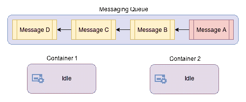
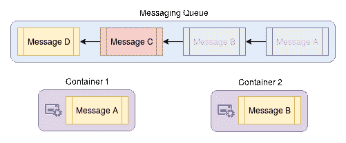
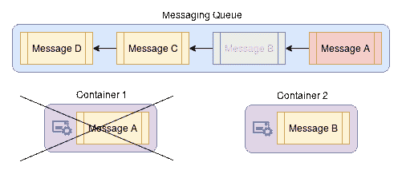
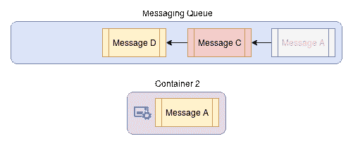

# 第六章：高级部署主题

我们已经花了相当多的时间讨论容器通信和安全性，但在本章中，我们将进一步探讨以下内容：

+   高级调试技术。

+   实现队列消息传递。

+   运行安全检查。

+   深入容器安全。

我们还将介绍一些其他工具和技术，帮助您更好地管理部署。

# 高级调试

在野外调试容器的能力是一个非常重要的话题，我们之前介绍了一些基本的技术，可以在这里派上用场。但也有一些情况下，`docker ps`和`docker exec`并不够用，因此在本节中，我们将探讨一些可以添加到您的工具箱中的其他工具，可以帮助解决那些棘手的问题。

# 附加到容器的进程空间

有时容器正在运行的是极简的发行版，比如 Alpine Linux（[`www.alpinelinux.org/`](https://www.alpinelinux.org/)），而且容器本身存在一个你想要调试的进程问题，但缺乏基本的调试工具。默认情况下，Docker 会将所有容器隔离在它们各自的进程命名空间中，因此我们之前直接附加到容器并尝试使用非常有限的工具来找出问题的调试工作流在这里不会有太大帮助。

幸运的是，Docker 完全能够使用`docker run --pid "container:<name_or_id>"`标志加入两个容器的进程命名空间，这样我们就可以直接将调试工具容器附加到受影响的容器上：

```
$ # Start an NGINX container
$ docker run -d --rm nginx
650a1baedb0c274cf91c086a9e697b630b2b60d3c3f94231c43984bed1073349

$ # What can we see from a new/separate container?
$ docker run --rm \
 ubuntu \
 ps -ef 
UID        PID  PPID  C STIME TTY          TIME CMD
root         1     0  0 16:37 ?        00:00:00 ps -ef

$ # Now let us try the same thing but attach to the NGINX's PID space
$ docker run --rm \
 --pid "container:650a1bae" \
 ubuntu \
 ps -ef 
UID      PID  PPID  C STIME TTY    TIME CMD
root       1     0  0 16:37 ?      00:00:00 nginx: master process nginx -g daemon off;
systemd+   7     1  0 16:37 ?      00:00:00 nginx: worker process
root       8     0  0 16:37 ?      00:00:00 ps -ef
```

正如你所看到的，我们可以将一个调试容器附加到相同的 PID 命名空间中，以这种方式调试任何行为异常的进程，并且可以保持原始容器不受调试工具的安装！使用这种技术，原始容器可以保持较小，因为工具可以单独安装，而且容器在整个调试过程中保持运行，因此您的任务不会被重新安排。也就是说，当您使用这种方法调试不同的容器时，要小心不要杀死其中的进程或线程，因为它们有可能会级联并杀死整个容器，从而停止您的调查。

有趣的是，这个`pid`标志也可以通过`--pid host`来调用，以共享主机的进程命名空间，如果你有一个在你的发行版上无法运行的工具，并且有一个 Docker 容器可以运行它（或者，如果你想要使用一个容器来管理主机的进程）：

```
$ # Sanity check
$ docker run --rm \
 ubuntu \
 ps -ef 
UID        PID  PPID  C STIME TTY          TIME CMD
root         1     0  0 16:44 ?        00:00:00 ps -ef

$ # Now we try to attach to host's process namespace
$ docker run --rm \
 --pid host \
 ubuntu \
 ps -ef 
UID        PID  PPID  C STIME TTY          TIME CMD
root         1     0  0 15:44 ?        00:00:02 /sbin/init splash
root         2     0  0 15:44 ?        00:00:00 [kthreadd]
root         4     2  0 15:44 ?        00:00:00 [kworker/0:0H]
<snip>
root      5504  5485  3 16:44 ?        00:00:00 ps -ef
```

很明显，这个标志的功能对于运行和调试应用程序提供了多少能力，所以不要犹豫使用它。

警告！与容器共享主机的进程命名空间是一个很大的安全漏洞，因为恶意容器可以轻易地通过操纵进程来控制或者 DoS 主机，特别是如果容器的用户是以 root 身份运行的。因此，在使用`--pid host`时要格外小心，并确保只在你完全信任的容器上使用这个标志。

# 调试 Docker 守护程序

如果到目前为止这些技术都没有帮助到你，你可以尝试运行 Docker 容器，并使用`docker system events`来检查守护程序 API 正在执行的操作，该命令可以跟踪几乎所有在其 API 端点上触发的操作。你可以用它来进行审计和调试，但一般来说，后者是它的主要目的，就像你在下面的例子中所看到的那样。

在第一个终端上运行以下命令，并让它保持运行，这样我们就可以看到我们可以收集到什么信息：

```
$ docker system events
```

在另一个终端上，我们将运行一个新的容器：

```
$ docker run -it \
 --rm \
 ubuntu /bin/bash 
$ root@563ad88c26c3:/# exit
exit
```

在你完成了对容器的启动和停止之后，第一个终端中的`events`命令应该输出类似于这样的内容：

```
$ docker system events
2017-09-27T10:54:58.943347229-07:00 container create 563ad88c26c3ae7c9f34dfe05c77376397b0f79ece3e233c0ce5e7ae1f01004f (image=ubuntu, name=thirsty_mccarthy)
2017-09-27T10:54:58.943965010-07:00 container attach 563ad88c26c3ae7c9f34dfe05c77376397b0f79ece3e233c0ce5e7ae1f01004f (image=ubuntu, name=thirsty_mccarthy)
2017-09-27T10:54:58.998179393-07:00 network connect 1e1fd43bd0845a13695ea02d77af2493a449dd9ee50f2f1372f589dc4968410e (container=563ad88c26c3ae7c9f34dfe05c77376397b0f79ece3e233c0ce5e7ae1f01004f, name=bridge, type=bridge)
2017-09-27T10:54:59.236311822-07:00 container start 563ad88c26c3ae7c9f34dfe05c77376397b0f79ece3e233c0ce5e7ae1f01004f (image=ubuntu, name=thirsty_mccarthy)
2017-09-27T10:54:59.237416694-07:00 container resize 563ad88c26c3ae7c9f34dfe05c77376397b0f79ece3e233c0ce5e7ae1f01004f (height=57, image=ubuntu, name=thirsty_mccarthy, width=176)
2017-09-27T10:55:05.992143308-07:00 container die 563ad88c26c3ae7c9f34dfe05c77376397b0f79ece3e233c0ce5e7ae1f01004f (exitCode=0, image=ubuntu, name=thirsty_mccarthy)
2017-09-27T10:55:06.172682910-07:00 network disconnect 1e1fd43bd0845a13695ea02d77af2493a449dd9ee50f2f1372f589dc4968410e (container=563ad88c26c3ae7c9f34dfe05c77376397b0f79ece3e233c0ce5e7ae1f01004f, name=bridge, type=bridge)
2017-09-27T10:55:06.295496139-07:00 container destroy 563ad88c26c3ae7c9f34dfe05c77376397b0f79ece3e233c0ce5e7ae1f01004f (image=ubuntu, name=thirsty_mccarthy)
```

它的使用范围相当有限，但是这种跟踪方式，以及我们到目前为止讨论过的其他技巧，应该为你提供在基于 Docker 的集群上解决几乎任何类型的问题的工具。除了已经提到的一切之外，在我的个人经验中，也有几次需要使用`gdb`，还有几次问题最终被证明是上游 bug。因此，在扩展规模时，要做好准备，因为出现新问题的可能性也会增加。

# 高级网络

网络是 Docker 集群中最重要的事情之一，它需要在整个系统的集群上保持运行顺畅，以便系统能够以任何能力运行。考虑到这一点，我们有理由涵盖一些我们尚未讨论但在大多数实际部署中都很重要的主题。您很有可能会在自己的部署中遇到至少其中一个用例，因此我建议您全文阅读，但您的情况可能有所不同。

# 静态主机配置

在某些特定的配置中，您可能有一个需要映射或重新映射到容器尝试到达的特定 IP 地址的网络主机。这允许对命名服务器进行灵活配置，并且对于网络上没有良好的网络 DNS 服务器的静态主机来说，这可能是一个真正的救命稻草。

要将这样的主机映射添加到容器中，您可以使用`docker run --add-host`命令运行容器，并使用此标志，将在`/etc/hosts`中添加一个与您的输入匹配的条目，以便您可以正确地将请求路由到它：

```
$ # Show what the default /etc/hosts has
$ docker run --rm \
 -it \
 ubuntu \
 /bin/cat /etc/hosts 
127.0.0.1    localhost
::1    localhost ip6-localhost ip6-loopback
fe00::0    ip6-localnet
ff00::0    ip6-mcastprefix
ff02::1    ip6-allnodes
ff02::2    ip6-allrouters
172.17.0.2    3c46adb8a875

$ # We now will add our fake server1 host mapping
$ docker run --rm \
 -it \
 --add-host "server1:123.45.67.89" \
 ubuntu \
 /bin/cat /etc/hosts 
127.0.0.1    localhost
::1    localhost ip6-localhost ip6-loopback
fe00::0    ip6-localnet
ff00::0    ip6-mcastprefix
ff02::1    ip6-allnodes
ff02::2    ip6-allrouters
123.45.67.89    server1
172.17.0.2    dd4d7c6ef7b8

$ # What does the container see when we have an additional host?
$ docker run --rm \
 -it \
 --add-host "server1:123.45.67.89" \
 ubuntu /bin/bash 
root@0ade7f3e8a80:/# getent hosts server1
123.45.67.89    server1

root@0ade7f3e8a80:/# exit
exit
```

如前所述，当您有一个非容器化服务时，您可能不希望将 IP 硬编码到容器中，该服务也无法从互联网 DNS 服务器解析时，这可能非常有用。

# DNS 配置

说到 DNS，我们可能应该稍微谈谈 Docker DNS 处理。默认情况下，Docker 引擎使用主机的 DNS 设置，但在一些高级部署设置中，集群所在的网络可能已经构建好，此时可能需要配置引擎或容器的自定义 DNS 设置或 DNS 搜索前缀（也称为域名）。在这种情况下，您可以通过向`/etc/docker/daemon.json`添加`dns`和/或`dns-search`参数并重新启动守护程序来轻松覆盖 Docker 引擎的默认 DNS 设置。这两个参数都允许多个值，并且相当容易理解。

```
{
...
        "dns": ["1.2.3.4", "5.6.7.8", ...],
        "dns-search": ["domain.com", ...],
...
}
```

在我曾经工作过的所有网络设置中，我从未见过覆盖 DNS 服务器 IP 或 DNS 搜索前缀是部署自己的 DHCP 服务器并设置适当的选项来设置 DNS 服务器（`选项 6`）和域名（`选项 15`）更好的选择，当初始化网络接口时，机器将会选择这些选项。如果您想了解更多关于这些 DHCP 标志的信息，我强烈建议您访问[`en.wikipedia.org/wiki/Dynamic_Host_Configuration_Protocol#DHCP_options`](https://en.wikipedia.org/wiki/Dynamic_Host_Configuration_Protocol#DHCP_options)并在使用我们之前阅读相关内容。注意！在某些情况下，引擎主机的 DNS 服务器指向`localhost`范围，就像大多数`systemd-resolve`和`dnsmasq`设置一样，容器无法访问主机的`localhost`地址，因此默认情况下，所有在该实例上运行的容器都会被替换为 Google 的 DNS 服务器（`8.8.8.8`和`8.8.4.4`）。如果您想在容器中保留主机的 DNS 设置，您必须确保配置中的 DNS 解析器不是`localhost` IP 范围之一，并且可以被容器网络访问。您可以在[`docs.docker.com/engine/userguide/networking/default_network/configure-dns/`](https://docs.docker.com/engine/userguide/networking/default_network/configure-dns/)找到更多信息。

如果您对引擎范围的配置不感兴趣，只想覆盖单个容器的 DNS 设置，您可以通过向`docker run`命令添加`--dns`和`--dns-search`选项来执行等效操作，这将替换相关容器中的默认`/etc/resolv.conf`设置。

```
$ # Since my default DNS is pointed to localhost, the default should be Google's DNS servers
$ docker run --rm \
 -it \
 ubuntu \
 /bin/cat /etc/resolv.conf 
# Dynamic resolv.conf(5) file for glibc resolver(3) generated by resolvconf(8)
#     DO NOT EDIT THIS FILE BY HAND -- YOUR CHANGES WILL BE OVERWRITTEN
# 127.0.0.53 is the systemd-resolved stub resolver.
# run "systemd-resolve --status" to see details about the actual nameservers.
nameserver 8.8.8.8
nameserver 8.8.4.4

$ # Now we will specify a custom DNS and DNS search prefix and see what the same file looks like
$ docker run --rm \
 -it \
 --dns 4.4.4.2 \
 --dns-search "domain.com" \
 ubuntu \
 /bin/cat /etc/resolv.conf 
search domain.com
nameserver 4.4.4.2
```

正如您所看到的，容器中的设置已经更改以匹配我们的参数。在我们的情况下，任何 DNS 解析都将流向`4.4.4.2`服务器，并且任何未经验证的主机名将首先尝试解析为`<host>.domain.com`。

# 叠加网络

我们在《第四章》*扩展容器*中只是简单提及了这一点，但为了使我们的容器能够与 Swarm 服务发现一起工作，我们不得不创建这种类型的网络，尽管我们并没有花太多时间解释它是什么。在 Docker Swarm 的上下文中，一台机器上的容器无法访问另一台机器上的容器，因为它们的网络直接路由到下一个跳点，而桥接网络阻止了每个容器在同一节点上访问其邻居。为了在这种多主机设置中无缝地连接所有容器，您可以创建一个覆盖整个集群的 overlay 网络。遗憾的是，这种类型的网络只在 Docker Swarm 集群中可用，因此在编排工具中的可移植性有限，但您可以使用`docker network create -d overlay network_name`来创建一个。由于我们已经在《第四章》*扩展容器*中涵盖了使用这种类型网络的部署示例，您可以在那里查看它的运行情况。

注意！默认情况下，覆盖网络不会与其他节点安全地通信，因此在创建时使用`--opt encrypted`标志是非常鼓励的，特别是在网络传输不能完全信任的情况下。使用此选项将产生一些处理成本，并要求您在集群内允许端口`50`的通信，但在大多数情况下，打开它应该是值得的。

# Docker 内置网络映射

在之前的章节中，我们大多数情况下都是使用默认网络设置的容器，大多数情况下都是使用`bridge`网络，因为这是默认设置，但这并不是容器可以使用的唯一类型的网络。以下是可用网络连接的列表，几乎所有这些连接都可以通过`docker run --network`参数进行设置：

+   `bridge`：如前几章所述，这种类型的网络在主机上创建了一个独立的虚拟接口，用于与容器通信，容器可以与主机和互联网通信。通常情况下，这种类型的网络会阻止容器之间的通信。

+   `none`：禁用容器的所有网络通信。这对于只包含工具的容器并且不需要网络通信的情况非常有用。

+   `host`：使用主机的网络堆栈，不创建任何虚拟接口。

+   `<network_name_or_id>`：连接到命名网络。当您创建一个网络并希望将多个容器放入相同的网络组时，此标志非常有用。例如，这对于连接多个喋喋不休的容器（如 Elasticsearch）到它们自己的隔离网络中将非常有用。

+   `<container_name_or_id>`：这允许您连接到指定容器的网络堆栈。就像`--pid`标志一样，这对于调试运行中的容器非常有用，而无需直接附加到它们，尽管根据使用的网络驱动程序，网络可能需要使用`--attachable`标志进行创建。

警告！使用`host`网络开关会使容器完全访问本地系统服务，因此在除测试之外的任何情况下使用都是一种风险。在使用此标志时要非常小心，但幸运的是，只有极少数情况（如果有的话）会有正当使用这种模式的情况。

# Docker 通信端口

除非您正在运行 Docker Swarm，否则您可能永远不需要担心 Docker 用于通信的端口，但这是一个相对重要的参考点，如果您在现场遇到这样的配置或者您想在集群中部署这样的部署。列表非常简短，但每个端口对于大多数 Swarm 集群的操作非常重要：

```
2377 TCP - Used for Swarm node communication
4789 UDP - Container ingress network
7946 TCP/UDP - Container network discovery
50 IP - Used for secure communication of overlay networks if you use "--opt encrypted" when creating the overlay network
```

# 高可用性管道

以前，我们大部分时间都在集群中的节点之间进行基于套接字的通信，这通常是大多数人可以理解的事情，并且几乎每种编程语言都有围绕它构建的工具。因此，这是人们将经典基础架构转换为容器时通常会选择的第一个工具，但对于大规模及以上规模的纯数据处理，由于超出了处理管道其余阶段的容量而导致的背压，它根本不起作用。

如果您将每个集群服务想象为一系列连续的转换步骤，那么基于套接字的系统将经历类似于这些步骤的循环：

+   打开一个监听套接字。

+   永远循环执行以下操作：

+   在套接字上等待来自上一阶段的数据。

+   处理这些数据。

+   将处理后的数据发送到下一阶段的套接字。

但是，如果下一个阶段已经达到最大容量，最后一步会发生什么呢？大多数基于套接字的系统要么会抛出异常并完全失败处理管道的这一特定数据，要么阻止执行继续并不断重试将数据发送到下一个阶段直到成功。由于我们不希望处理管道失败，因为结果并非错误，也不希望让我们的工作人员等待下一个阶段解除阻塞，我们需要一些可以按顺序保存阶段输入的东西，以便前一个阶段可以继续处理自己的新输入。

# 容器消息

对于我们刚刚讨论的情景，即个别处理阶段的背压导致级联回流停止的情况，消息队列（通常也称为发布/订阅消息系统）在这里为我们提供了我们需要的确切解决方案。消息队列通常将数据存储为**先进先出**（FIFO）队列结构中的消息，并通过允许发送方将所需的输入添加到特定阶段的队列（"入队"），并允许工作人员（监听器）在该队列中触发新消息来工作。当工作人员处理消息时，队列会将其隐藏在其他工作人员之外，当工作人员完成并成功时，消息将永久从队列中删除。通过以异步方式处理结果，我们可以允许发送方继续处理自己的任务，并完全模块化数据处理管道。

为了看到队列的运作，假设我们有两个正在运行的容器，并且在很短的时间内，消息**A**、**B**、**C**和**D**一个接一个地作为来自某个想象的处理步骤的输入到达（红色表示队列顶部）：



在内部，队列跟踪它们的顺序，最初，容器队列监听器都没有注意到这些消息，但很快，它们收到通知，有新的工作要做，所以它们按接收顺序获取消息。消息队列（取决于确切的实现）将这些消息标记为不可用于其他监听器，并为工作人员设置一个完成的超时。在这个例子中，**消息 A**和**消息 B**已被标记为可供可用工作人员处理：



在这个过程中，假设**容器**1 发生了灾难性故障并且它就这样死了。**消息 A**在队列中的超时时间到期，而它还没有完成，所以队列将其放回顶部，并使其再次可用于侦听器，而我们的另一个容器继续工作：



成功完成**消息 B**后，**容器 2**通知队列任务已完成，并且队列将其从列表中完全移除。完成这一步后，容器现在取出最顶部的消息，结果是未完成的**消息 A**，整个过程就像以前一样进行：



在这个集群阶段处理故障和过载的同时，将所有这些消息放入队列的上一个阶段继续处理其专用工作负载。即使在某个随机时间点，我们的处理能力的一半被强制移除，我们当前的阶段也没有丢失任何数据。

现在，工作人员的新伪代码循环会更像这样：

+   在队列上注册为侦听器。

+   永远循环执行以下操作：

+   等待队列中的消息。

+   处理队列中的数据。

+   将处理后的数据发送到下一个队列。

有了这个新系统，如果管道中的某个阶段出现任何处理减速，那么这些过载阶段的队列将开始增长，但如果较早的阶段减速，队列将缩小直到为空。只要最大队列大小能够处理消息的数量，过载阶段能够处理平均需求，你就可以确定管道中的所有数据最终都会被处理，而且扩展阶段的触发器几乎就像是注意到不是由错误引起的更大的队列一样简单。这不仅有助于缓解管道阶段扩展的差异，而且还有助于在集群的某些部分出现故障时保留数据，因为队列在故障时会增长，然后在将基础设施恢复到正常工作时会清空 - 所有这些都将在不丢失数据的情况下发生。

如果这些好处的组合还不够积极，那么请考虑现在可以保证数据已经被处理，因为队列会保留数据，所以如果一个工作进程死掉，队列会（正如我们之前看到的）将消息放回队列，可能由另一个工作进程处理，而不像基于套接字的处理那样在这种情况下会悄然死去。处理密度的增加、故障容忍度的增加以及对突发数据的更好处理使队列对容器开发者非常有吸引力。如果你所有的通信也都是通过队列完成的，那么服务发现甚至可能不需要对这些工作进程进行除了告诉它们队列管理器在哪里之外的工作，因为队列正在为你做这项发现工作。

毫不奇怪，大多数队列都需要开发成本，这就是为什么它们没有像人们预期的那样被广泛使用的原因。在大多数情况下，你不仅需要将自定义队列客户端库添加到你的工作代码中，而且在许多类型的部署中，你还需要一个处理消息的主要队列仲裁者的进程或守护进程。事实上，我可能会说选择消息系统本身就是一个研究任务，但如果你正在寻找快速答案，一般来说，Apache Kafka（[`kafka.apache.org/`](https://kafka.apache.org/)）、RabbitMQ（[`www.rabbitmq.com/`](https://www.rabbitmq.com/)）和基于 Redis 的自定义实现（[`redis.io/`](https://redis.io/)）似乎在集群环境中更受欢迎，从最大的部署到最小的部署。

就像我们迄今为止一直在讨论的所有事物一样，大多数云提供商都提供了某种类型的服务（如 AWS SQS，Google Cloud Pub/Sub，Azure Queue Storage 等），这样你就不必自己构建它。如果你愿意多花一点钱，你可以利用这些服务，而不必担心自己托管守护进程。从历史上看，消息队列在内部维护和管理方面一直很难，所以我敢说，许多云系统使用这些服务，而不是部署自己的服务。

# 实现我们自己的消息队列

理论讲解完毕，让我们看看如何构建我们自己的小型队列发布者和监听者。在这个例子中，我们将使用基于 Redis 的较简单的消息系统之一，名为`bull`（[`www.npmjs.com/package/bull`](https://www.npmjs.com/package/bull)）。首先，我们将编写将运行整个系统的代码，并且为了简化操作，我们将同时使用相同的镜像作为消费者和生产者。

在一个新的目录中，创建以下内容：

作为提醒，这段代码也在 GitHub 存储库中，如果你不想输入完整的文本，可以在[`github.com/sgnn7/deploying_with_docker/tree/master/chapter_6/redis_queue`](https://github.com/sgnn7/deploying_with_docker/tree/master/chapter_6/redis_queue)查看或克隆它。

# package.json

这个文件基本上只是我们旧的示例的副本，增加了`bull`包和名称更改：

```
{
  "name": "queue-worker",
  "version": "0.0.1",
  "scripts": {
    "start": "node index.js"
  },
  "dependencies": {
    "bull": "³.2.0"
  }
}
```

# index.js

`index.js`是一个单文件应用程序，根据调用参数，每 1.5 秒要么向队列发送一个时间戳，要么从队列中读取。队列位置由`QUEUE_HOST`环境变量定义：

```
'use strict'

const Queue = require('bull');

const veryImportantThingsQueue = new Queue('very_important_things',
                                           { redis: { port: 6379,
                                                      host: process.env.QUEUE_HOST }});

// Prints any message data received
class Receiver {
    constructor () {
        console.info('Registering listener...');
        veryImportantThingsQueue.process(job => {
            console.info('Got a message from the queue with data:', job.data);
            return Promise.resolve({});
        });
    }
}

// Sends the date every 1.5 seconds
class Sender {
    constructor () {
        function sendMessage() {
            const messageValue = new Date();
            console.info('Sending a message...', messageValue);
            veryImportantThingsQueue.add({ 'key': messageValue });
        }

        setInterval(sendMessage, 1500);
    }
}

// Sanity check
if (process.argv.length < 2) {
    throw new Error(`Usage: ${process.argv.slice(2).join(' ')} <sender | receiver>`);
}

// Start either receiver or sender depending of CLI arg
console.info('Starting...');
if (process.argv[2] === 'sender') {
    new Sender();
} else if (process.argv[2] === 'receiver') {
    new Receiver();
} else {
    throw new Error(`Usage: ${process.argv.slice(0, 2).join(' ')} <sender | receiver>`);
}
```

# Dockerfile

这里没有什么特别的：这个文件基本上是我们旧的 Node.js 应用程序的精简版本：

```
FROM node:8

# Make sure we are fully up to date
RUN apt-get update -q && \
 apt-get dist-upgrade -y && \
 apt-get clean && \
 apt-get autoclean

# Container port that should get exposed
EXPOSE 8000

ENV SRV_PATH /usr/local/share/queue_handler

# Make our directory
RUN mkdir -p $SRV_PATH && \
 chown node:node $SRV_PATH

WORKDIR $SRV_PATH

USER node

COPY . $SRV_PATH/

RUN npm install

CMD ["npm", "start"]
```

我们现在将构建镜像：

```
$ docker build -t queue-worker .
Sending build context to Docker daemon  7.168kB
<snip>
 ---> 08e33a32ba60
Removing intermediate container e17c836c5a33
Successfully built 08e33a32ba60
Successfully tagged queue-worker:latest
```

通过构建镜像，我们现在可以编写我们的堆栈定义文件：`swarm_application.yml`。我们基本上是在单个网络上创建队列服务器、队列监听器和队列发送器，并确保它们可以在这里找到彼此：

```
version: "3"
services:
 queue-sender:
 image: queue-worker
 command: ["npm", "start", "sender"]
 networks:
 - queue_network
 deploy:
 replicas: 1
 depends_on:
 - redis-server
 environment:
 - QUEUE_HOST=redis-server

 queue-receiver:
 image: queue-worker
 command: ["npm", "start", "receiver"]
 networks:
 - queue_network
 deploy:
 replicas: 1
 depends_on:
 - redis-server
 environment:
 - QUEUE_HOST=redis-server

 redis-server:
 image: redis
 networks:
 - queue_network
 deploy:
 replicas: 1
 networks:
 - queue_network
 ports:
 - 6379:6379

networks:
 queue_network:
```

在镜像构建和堆栈定义都完成后，我们可以启动我们的队列集群，看看它是否正常工作：

```
$ # We need a Swarm first
$ docker swarm init
Swarm initialized: current node (c0tq34hm6u3ypam9cjr1vkefe) is now a manager.
<snip>

$ # Now we deploy our stack and name it "queue_stack"
$ docker stack deploy \
               -c swarm_application.yml \
               queue_stack
Creating service queue_stack_queue-sender
Creating service queue_stack_queue-receiver
Creating service queue_stack_redis-server

$ # At this point, we should be seeing some traffic...
$ docker service logs queue_stack_queue-receiver
<snip>
queue_stack_queue-receiver.1.ozk2uxqnbfqz@machine    | Starting...
queue_stack_queue-receiver.1.ozk2uxqnbfqz@machine    | Registering listener...
queue_stack_queue-receiver.1.ozk2uxqnbfqz@machine    | Got a message from the queue with data: { key: '2017-10-02T08:24:21.391Z' }
queue_stack_queue-receiver.1.ozk2uxqnbfqz@machine    | Got a message from the queue with data: { key: '2017-10-02T08:24:22.898Z' }
<snip>

$ # Yay! It's working!

$ # Let's clean things up to finish up
$ docker stack rm queue_stack
Removing service queue_stack_queue-receiver
Removing service queue_stack_queue-sender
Removing service queue_stack_redis-server
Removing network queue_stack_redis-server
Removing network queue_stack_queue_network
Removing network queue_stack_service_network

$ docker swarm leave --force
Node left the swarm.
```

在这一点上，我们可以添加任意数量的发送者和监听者（在合理范围内），我们的系统将以非常异步的方式正常工作，从而增加两端的吞吐量。不过，作为提醒，如果你决定走这条路，强烈建议使用另一种队列类型（如 Kafka、SQS 等），但基本原则基本上是相同的。

# 高级安全

我们在之前的章节中已经涵盖了一些安全问题，但对于一些似乎经常被忽视的问题，我们需要更深入地讨论它们，而不仅仅是在文本中间的小信息框中看到它们，并了解为什么当不正确使用时它们会成为如此严重的问题。虽然在实施我们在各种警告和信息框中指出的所有事情可能会显得很费力，但是你提供给潜在入侵者的攻击面越小，从长远来看你就会越好。也就是说，除非你正在为政府机构部署这个系统，我预计会有一些妥协，但我敦促你强烈权衡每个方面的利弊，否则你就有可能会收到那个可怕的午夜电话，通知你发生了入侵。

具有讽刺意味的是，加固系统通常需要花费大量时间来开发和部署，以至于它们往往在投入生产环境时已经过时或提供的业务价值较小，并且由于它们精心组装的部件，它们很少（如果有的话）会更新为新功能，迅速应用补丁，或对源代码进行改进，因此它真的是一把双刃剑。没有*完美的解决方案，只有一系列你在某种程度上感到舒适的事情。从历史上看，我大多数情况下看到的是在两个极端之间的可怕执行，所以我在这里的建议是，如果可能的话，你应该寻求两者的结合。

# 将 Docker 套接字挂载到容器中

这绝对是开发人员在部署容器化解决方案时完全忽视的最严重的安全漏洞。对于与容器管理相关的各种事情，通常在互联网上的建议都倾向于将 Docker 套接字（`/var/run/docker.sock`）绑定到容器中，但很少提到的是这样做实际上会有效地将主机的根级访问权限赋予这样的容器。由于 Docker 的套接字实际上只是一个 API 端点，而 Docker 守护程序以 root 身份运行，容器可以通过在其上挂载主机系统文件夹并在其上执行任意命令来简单地逃离其封闭环境。

有关使用 Docker 套接字作为 RESTful 端点的更多信息，您可以查看源代码，或者通过 Docker Engine API 的文档进行探索[`docs.docker.com/engine/api/v1.31/`](https://docs.docker.com/engine/api/v1.31/)。通常，您只需要通过诸如`curl`之类的工具添加`--unix-socket <socket_path>`，并且对于`POST`请求，可以选择添加`-H "Content-Type: application/json"`。

Docker 一直在努力将其服务从根级别转变为用户空间级别，但到目前为止，这个功能还没有以任何实际的方式实现。尽管我个人对这种情况很怀疑，但请留意这个功能，因为在某个时候它可能会真正发布并成为一个可用的功能，这将是容器安全性的重大进步。

```
$ Start a "benign" container with the Docker socket mounted and run Bash
$ docker run --rm \
 -it \
 -v /var/run/docker.sock:/var/run/docker.sock \
 ubuntu /bin/bash 

root@686212135a17:/# # Sanity check - make sure that the socket is there
root@686212135a17:/# ls -la /var/run/docker.sock
srw-rw---- 1 root 136 0 Sep 20 05:03 /var/run/docker.sock

root@686212135a17:/# # Install curl but almost any other HTTP client will work
root@686212135a17:/# # Even a base Python can do this but curl is fine for brevity
root@686212135a17:/# apt-get update && apt-get install -y curl
<snip>
done

root@686212135a17:/# # Create a container through the socket and bind-mount root to it
root@686212135a17:/# # with a "malicious" touch command to run
root@686212135a17:/# curl -s \
 --unix-socket /var/run/docker.sock \
 -H "Content-Type: application/json" \
 -d '{"Image": "ubuntu", "Cmd": ["touch", "/mnt/security_breach"], "Mounts": [{"Type": "bind", "Source": "/", "Target":"/mnt", "RW": true}]}' \
 -X POST \
 http:/v1.29/containers/create 
{"Id":"894c4838931767462173678aacc51c3bb98f4dffe15eaf167782513305c72558","Warnings":null}

root@686212135a17:/# # Start our escaped container
root@686212135a17:/# curl --unix-socket /var/run/docker.sock \
 -X POST \
 http:/v1.29/containers/894c4838/start

root@686212135a17:/# # Exit out of our "benign" container back to host
root@686212135a17:/# exit
exit

$ # Let's see what happened on our host
$ ls -la / | grep breach
-rw-r--r--   1 root root       0 Sep 20 23:14 security_breach 
$ # Oops!
```

现在应该很明显了，良性容器是如何能够仅通过几个 CLI 命令就在主机上获得 root 权限的。虽然其中一些是基于容器进程以 root 身份运行，但如果 Docker 组 ID 与容器中的非特权组冲突，可能也会出现相同的情况，但是除了这些细微之处，可以说，挂载 Docker 套接字而不完全理解其影响可能导致非常痛苦的违规行为。考虑到这一点，这种技术也有（虽然很少）合法的用途，所以在这里要慎重使用。

# 现在我们已经了解了如何滥用 Docker 套接字的理论，接下来我们将跳出容器，尽管我们不会真的对系统造成任何破坏：主机安全扫描。

作为增加部署安全性的一部分，Docker 发布了一个工具，可以帮助轻松识别运行 Docker Engine 的主机上最常见的安全问题，称为**Docker Bench for Security**。这个工具将扫描和验证配置中的大量可能的弱点，并以非常易于阅读的列表形式呈现出来。您可以像在 Docker Hub 上使用其他常规容器一样下载和运行这个镜像。

警告！此安全扫描需要许多权限（`--net host`、`--pid host`、Docker 套接字挂载等），我们已经讨论过这些权限通常是在主机上运行的一个非常糟糕的主意，因为它们为恶意行为者提供了一个相当大的攻击向量，但另一方面，扫描需要这些权限来检查您的设置。因此，我强烈建议在网络隔离的环境中克隆要测试的主机机器上运行这种类型的安全扫描，以防止扫描镜像被恶意修改而危及您的基础设施。

```
$ docker run --rm \
 -it \
 --net host \
 --pid host \
 --cap-add audit_control \
 -e DOCKER_CONTENT_TRUST=$DOCKER_CONTENT_TRUST \
 -v /var/lib:/var/lib \
 -v /var/run/docker.sock:/var/run/docker.sock \
 -v /usr/lib/systemd:/usr/lib/systemd \
 -v /etc:/etc \
 docker/docker-bench-security
# ------------------------------------------------------------------------------
# Docker Bench for Security v1.3.3
#
# Docker, Inc. (c) 2015-
#
# Checks for dozens of common best-practices around deploying Docker containers in production.
# Inspired by the CIS Docker Community Edition Benchmark v1.1.0.
# ------------------------------------------------------------------------------

Initializing Mon Oct  2 00:03:29 CDT 2017

[INFO] 1 - Host Configuration
[WARN] 1.1  - Ensure a separate partition for containers has been created
[NOTE] 1.2  - Ensure the container host has been Hardened
date: invalid date '17-10-1 -1 month'
sh: out of range
sh: out of range
[PASS] 1.3  - Ensure Docker is up to date
[INFO]      * Using 17.09.0 which is current
[INFO]      * Check with your operating system vendor for support and security maintenance for Docker
[INFO] 1.4  - Ensure only trusted users are allowed to control Docker daemon
[INFO]      * docker:x:999
[WARN] 1.5  - Ensure auditing is configured for the Docker daemon
[WARN] 1.6  - Ensure auditing is configured for Docker files and directories - /var/lib/docker
[WARN] 1.7  - Ensure auditing is configured for Docker files and directories - /etc/docker
[INFO] 1.8  - Ensure auditing is configured for Docker files and directories - docker.service
<snip>
[PASS] 2.10 - Ensure base device size is not changed until needed
[WARN] 2.11 - Ensure that authorization for Docker client commands is enabled
[WARN] 2.12 - Ensure centralized and remote logging is configured
[WARN] 2.13 - Ensure operations on legacy registry (v1) are Disabled
[WARN] 2.14 - Ensure live restore is Enabled
[WARN] 2.15 - Ensure Userland Proxy is Disabled
<snip>
[PASS] 7.9  - Ensure CA certificates are rotated as appropriate (Swarm mode not enabled)
[PASS] 7.10 - Ensure management plane traffic has been separated from data plane traffic (Swarm mode not enabled)
```

列表相当长，因此大部分输出行都被删除了，但你应该对这个工具的功能和如何使用有一个相当好的了解。请注意，这不是这个领域唯一的产品（例如，CoreOS 的 Clair 在 [`github.com/coreos/clair`](https://github.com/coreos/clair)），因此尽量使用尽可能多的产品，以便了解基础设施的弱点所在。

# 只读容器

在我们之前的示例开发中，跨越了大部分章节，我们并没有真正关注容器在运行时是否改变了文件系统的状态。这对于测试和开发系统来说并不是问题，但在生产环境中，进一步加强锁定非常重要，以防止来自内部和外部来源的恶意运行时利用。为此，有一个 `docker run --read-only` 标志，它（不出所料地）将容器的根文件系统挂载为只读。通过这样做，我们确保除了使用卷挂载的数据外，所有数据都与构建镜像时一样纯净，确保一致性并保护您的集群。如果以这种方式运行容器，您唯一需要注意的是，容器在执行过程中极有可能需要临时存储文件的位置，例如 `/run`、`/tmp` 和 `/var/tmp`，因此这些挂载应该额外作为 `tmpfs` 卷挂载：

```
$ # Start a regular container
$ docker run -it \
 --rm \
 ubuntu /bin/bash 
root@79042a966943:/# # Write something to /bin
root@79042a966943:/# echo "just_a_test" > /bin/test

root@79042a966943:/# # Check if it's there
root@79042a966943:/# ls -la /bin | grep test
-rw-r--r-- 1 root root      12 Sep 27 17:43 test

root@79042a966943:/# exit
exit

$ # Now try a read-only container
$ docker run -it \
 --rm \
 --tmpfs /run \
 --tmpfs /tmp \
 --tmpfs /var/tmp \
 --read-only \
 ubuntu /bin/bash 
root@5b4574a46c09:/# # Try to write to /bin
root@5b4574a46c09:/# echo "just_a_test" > /bin/test
bash: /bin/test: Read-only file system

root@5b4574a46c09:/# # Works as expected! What about /tmp?
root@5b4574a46c09:/# echo "just_a_test" > /tmp/test
root@5b4574a46c09:/# ls /tmp
test

root@5b4574a46c09:/# exit
exit
```

如果您不希望容器在文件系统上做出任何更改，并且由于容器通常不需要写入 `/usr` 等路径，强烈建议在生产中使用此标志，因此如果可能的话，请在所有静态服务上广泛应用它。

# 基础系统（软件包）更新

我们之前已经谈到了这个问题，但似乎在大多数在线文档和博客中，Docker 容器环境中软件包更新的覆盖范围被严重忽视。虽然支持者有两种观点，但重要的是要记住，无法保证来自 Docker Hub 等地方可用的标记图像是否已经使用最新的更新构建，即使在这些情况下，标记图像可能已经建立了一段时间，因此不包含最新的安全补丁。

尽管在 Docker 容器中使用主机的内核来运行容器的上下文是真实的，但容器中任何支持库的安全漏洞通常会导致漏洞，这些漏洞经常会级联到主机和整个网络中。因此，我个人建议部署到生产环境的容器应该尽可能确保使用最新的库构建容器。手动升级一些基本镜像上的软件包存在明显的风险，这是由于升级时可能会出现库不兼容性，但总的来说，这是一个值得冒的风险。

在大多数情况下，为了进行这种升级，就像我们在大多数 Docker 示例中所介绍的那样，你基本上需要在`Dockerfile`中调用特定于镜像基本操作系统发行版的系统升级命令。对于我们默认的部署操作系统（Ubuntu LTS），可以使用`apt-get update`和`apt-get dist-upgrade`来完成此操作。

```
...
RUN apt-get update && apt-get -y dist-upgrade
...
```

注意！不要忘记，默认情况下，`docker build`将缓存所有未更改的`Dockerfile`指令的各个层，因此该命令在第一次使用时会按预期工作，但如果它之前的任何行都没有更改，那么在后续使用时将从缓存中提取其层，因为这行将保持不变，而不管上游包是否更改。如果要确保获取最新更新，必须通过更改`Dockerfile`中`apt-get`上面的行或在`docker build`命令中添加`--no-cache`来打破缓存。此外，请注意，使用`--no-cache`将重新生成所有层，可能会导致较长的构建周期和/或注册表磁盘使用。

# 特权模式与--cap-add 和--cap-drop

在容器内可能需要执行的一些高级操作，例如**Docker-in-Docker（DinD）**、NTP、挂载回环设备等，都需要比默认情况下容器的根用户所拥有的更高权限。因此，需要为容器允许额外的权限，以便它能够无问题地运行，因此，对于这种情况，Docker 有一个非常简单但非常广泛的特权模式，它将主机的完整功能添加到容器中。要使用此模式，只需在`docker run`命令后附加`--privileged`：

**Docker-in-Docker**（通常称为**DinD**）是容器的特殊配置，允许您在已在 Docker 引擎上运行的容器内运行 Docker 引擎，但不共享 Docker 套接字，这允许（如果采取预防措施）更安全和更可靠地在已容器化的基础架构中构建容器。这种配置的普及程度有些罕见，但在**持续集成**（**CI**）和**持续交付**（**CD**）设置的一部分时非常强大。

```
$ # Run an NTP daemon without the extra privileges and see what happens
$ docker run -it \
 --rm \
 cguenther/ntpd 
ntpd: can't set priority: Permission denied
reset adjtime failed: Operation not permitted
creating new /var/db/ntpd.drift
adjtimex failed: Operation not permitted
adjtimex adjusted frequency by 0.000000ppm
ntp engine ready
reply from 38.229.71.1: offset -2.312472 delay 0.023870, next query 8s
settimeofday: Operation not permitted
reply from 198.206.133.14: offset -2.312562 delay 0.032579, next query 8s
reply from 96.244.96.19: offset -2.302669 delay 0.035253, next query 9s
reply from 66.228.42.59: offset -2.302408 delay 0.035170, next query 7s
^C

$ And now with our new privileged mode
$ docker run -it \
 --rm \
 --privileged \
 cguenther/ntpd 
creating new /var/db/ntpd.drift
adjtimex adjusted frequency by 0.000000ppm
ntp engine ready
^C
```

正如您所看到的，添加此标志将从输出中删除所有错误，因为我们现在可以更改系统时间。

解释了此模式的功能后，我们现在可以谈论为什么在理想情况下，如果可能的话，您永远不应该使用特权模式。默认情况下，特权模式几乎允许访问主机系统的所有内容，并且在大多数情况下不够细粒度，因此在确定容器需要额外权限后，应该使用`--cap-add`有选择地添加它们。这些标志是标准的 Linux 功能标识符，您可以在[`man7.org/linux/man-pages/man7/capabilities.7.html`](http://man7.org/linux/man-pages/man7/capabilities.7.html)等地方找到，并允许对所需的访问级别进行微调。如果我们现在将先前的 NTP 守护程序示例转换为这种新样式，它应该看起来更像这样：

```
$ # Sanity check
$ docker run -it \
 --rm \
 cguenther/ntpd 
ntpd: can't set priority: Permission denied
<snip>
settimeofday: Operation not permitted
<snip>
^C

$ # Now with the added SYS_TIME capability
$ docker run -it \
 --rm \
 --cap-add SYS_TIME \
 cguenther/ntpd 
ntpd: can't set priority: Permission denied
creating new /var/db/ntpd.drift
adjtimex adjusted frequency by 0.000000ppm
ntp engine ready
reply from 204.9.54.119: offset 15.805277 delay 0.023080, next query 5s
set local clock to Mon Oct  2 06:05:47 UTC 2017 (offset 15.805277s)
reply from 38.229.71.1: offset 0.005709 delay 31.617842, next query 9s
^C
```

如果您注意到，由于另一个缺失的功能，我们仍然有一个可见的错误，但`settimeofday`错误已经消失了，这是我们需要解决的最重要的问题，以便该容器能够运行。

有趣的是，我们还可以使用`--cap-drop`从容器中删除未被使用的功能，以增加安全性。对于这个标志，还有一个特殊的关键字`ALL`，可以用来删除所有可用的权限。如果我们使用这个来完全锁定我们的 NTP 容器，但一切正常运行，让我们看看会是什么样子：

```
docker run -it \
 --rm \
 --cap-drop ALL \
 --cap-add SYS_TIME \
 --cap-add SYS_CHROOT \
 --cap-add SETUID \
 --cap-add SETGID \
 --cap-add SYS_NICE \
 cguenther/ntpd 
creating new /var/db/ntpd.drift
adjtimex adjusted frequency by 0.000000ppm
ntp engine ready
reply from 216.229.0.49: offset 14.738336 delay 1.993620, next query 8s
set local clock to Mon Oct  2 06:16:09 UTC 2017 (offset 14.738336s)
reply from 216.6.2.70: offset 0.523095 delay 30.422572, next query 6s
^C
```

在这里，我们首先删除了所有的功能，然后再添加回运行容器所需的少数功能，正如您所看到的，一切都运行正常。在您自己的部署中，我强烈建议，如果您有多余的开发能力或者注重安全性，花一些时间以这种方式锁定正在运行的容器，这样它们将更加安全，您也将更加确信容器是在最小权限原则下运行的。

“最小权限原则”是计算机安全中的一个概念，它只允许用户或服务运行组件所需的最低权限。这个原则在高安全性实现中非常重要，但通常在其他地方很少见，因为管理访问的开销被认为很大，尽管这是增加系统安全性和稳定性的好方法。如果您想了解更多关于这个概念的信息，您应该去[`en.wikipedia.org/wiki/Principle_of_least_privilege`](https://en.wikipedia.org/wiki/Principle_of_least_privilege)查看一下。

# 总结

在本章中，我们学习了许多部署强大集群所需的高级工具和技术，例如以下内容：

+   管理容器问题的额外调试选项。

+   深入研究 Docker 的高级网络主题。

+   实施我们自己的队列消息传递。

+   各种安全加固技巧和窍门。

所有这些主题加上之前的材料应该涵盖了大多数集群的部署需求。但在下一章中，我们将看到当主机、服务和任务的数量达到通常不被期望的水平时，我们需要担心什么问题，以及我们可以采取什么措施来减轻这些问题。
