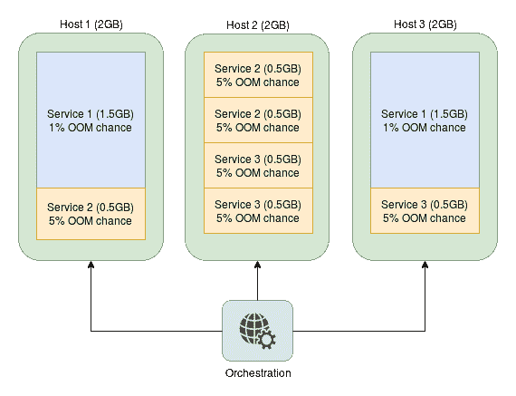
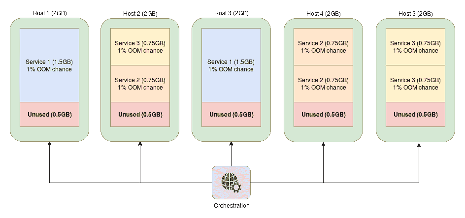

# 第七章：扩展的限制和解决方法

当您扩展系统时，您使用的每个工具或框架都会达到一个破坏或不按预期运行的点。对于某些事物，这一点可能很高，对于某些事物，这一点可能很低，本章的目的是介绍在使用微服务集群时可能遇到的最常见的可扩展性问题的策略和解决方法。在本章中，我们将涵盖以下主题：

+   增加服务密度和稳定性。

+   避免和减轻大规模部署中的常见问题。

+   多服务容器。

+   零停机部署的最佳实践。

# 限制服务资源

到目前为止，我们并没有真正花时间讨论与服务可用资源相关的服务隔离，但这是一个非常重要的话题。如果不限制资源，恶意或行为不端的服务可能会导致整个集群崩溃，具体取决于严重程度，因此需要非常小心地指定个别服务任务应该使用的资源限额。

处理集群资源的通常接受的策略如下：

+   任何资源如果超出预期值使用可能会导致其他服务出现错误或故障，强烈建议在服务级别上进行限制。这通常是 RAM 分配，但也可能包括 CPU 或其他资源。

+   任何资源，特别是硬件资源，都应该在 Docker 容器中进行限制（例如，您只能使用 1-Gbps NAS 连接的特定部分）。

+   任何需要在特定设备、机器或主机上运行的东西都应以相同的方式锁定到这些资源上。当只有一定数量的机器具有适合某项服务的正确硬件时，这种设置非常常见，比如在 GPU 计算集群中。

+   通常应该对希望在集群中特别配给的任何资源施加限制。这包括降低低优先级服务的 CPU 时间百分比等事项。

+   在大多数情况下，其余资源应该可以正常使用主机可用资源的正常分配。

通过应用这些规则，我们将确保我们的集群更加稳定和安全，资源的分配也更加精确。此外，如果指定了服务所需的确切资源，编排工具通常可以更好地决定在哪里安排新创建的任务，以便最大化每个引擎的服务密度。

# RAM 限制

奇怪的是，尽管 CPU 可能被认为是最重要的计算资源，但由于 RAM 的过度使用可能会导致内存不足（OOM）进程和任务失败，因此对集群服务的 RAM 分配甚至更为重要。由于软件中内存泄漏的普遍存在，这通常不是“是否”而是“何时”的问题，因此设置 RAM 分配限制通常是非常可取的，在某些编排配置中甚至是强制性的。遇到这个问题通常会看到`SIGKILL`，`"进程被杀死"`或`退出代码-9`。

请记住，这些信号很可能是由其他原因引起的，但最常见的原因是 OOM 失败。

通过限制可用的 RAM，而不是由 OOM 管理器杀死主机上的随机进程，只有有问题的任务进程将被定位为目标，因此可以更容易和更快地识别出有问题的代码，因为您可以看到来自该服务的大量失败，而您的其他服务将保持运行，增加了集群的稳定性。

OOM 管理是一个庞大的主题，比起在本节中包含它更明智，但如果您在 Linux 内核中花费大量时间，了解这一点非常重要。如果您对此主题感兴趣，我强烈建议您访问[`www.kernel.org/doc/gorman/html/understand/understand016.html`](https://www.kernel.org/doc/gorman/html/understand/understand016.html)并对其进行阅读。警告！在一些最流行的内核上，由于其开销，内存和/或交换 cgroups 被禁用。要在这些内核上启用内存和交换限制，您的主机内核必须以`cgroup_enable=memory`和`swapaccount=1`标志启动。如果您使用 GRUB 作为引导加载程序，您可以通过编辑`/etc/default/grub`（或者在最新系统上，`/etc/default/grub.d/<name>`），设置`GRUB_CMDLINE_LINUX="cgroup_enable=memory swapaccount=1"`，运行`sudo update-grub`，然后重新启动您的机器来启用它们。

要使用限制 RAM 的`cgroup`配置，运行容器时使用以下标志的组合：

+   -m / --内存：容器可以使用的最大内存量的硬限制。超过此限制的新内存分配将失败，并且内核将终止容器中通常运行服务的主要进程。

+   --内存交换：容器可以使用的包括交换在内的内存总量。这必须与前一个选项一起使用，并且比它大。默认情况下，容器最多可以使用两倍于容器的允许内存的内存。将其设置为`-1`允许容器使用主机拥有的交换空间。

+   --内存交换倾向：系统将页面从物理内存移动到磁盘交换空间的渴望程度。该值介于`0`和`100`之间，其中`0`表示页面将尽可能留在驻留 RAM 中，反之亦然。在大多数机器上，该值为`80`，将用作默认值，但由于与 RAM 相比，交换空间访问非常缓慢，我的建议是将此数字设置为尽可能接近`0`。

+   --内存预留：服务的 RAM 使用的软限制，通常仅用于检测资源争用，以便编排引擎可以安排任务以实现最大使用密度。此标志不能保证将保持服务的 RAM 使用量低于此水平。

还有一些其他标志可以用于内存限制，但即使前面的列表可能比你需要担心的要详细一些。对于大多数部署，无论大小，你可能只需要使用`-m`并设置一个较低的值`--memory-swappiness`，后者通常是通过`sysctl.d`引导设置在主机上完成的，以便所有服务都将利用它。

你可以通过运行`sysctl vm.swappiness`来检查你的`swappiness`设置是什么。如果你想改变这个值，在大多数集群部署中你会这样做，你可以通过运行以下命令来设置这个值：

`$ echo "vm.swappiness = 10" | sudo tee -a /etc/sysctl.d/60-swappiness.conf`

要看到这一点的实际效果，我们首先将运行一个最资源密集的框架（JBoss），限制为 30 MB 的 RAM，看看会发生什么：

```
$ docker run -it \
             --rm \
             -m 30m \
             jboss/wildfly 
Unable to find image 'jboss/wildfly:latest' locally
latest: Pulling from jboss/wildfly
<snip>
Status: Downloaded newer image for jboss/wildfly:latest
=========================================================================

 JBoss Bootstrap Environment

 JBOSS_HOME: /opt/jboss/wildfly

 JAVA: /usr/lib/jvm/java/bin/java

 JAVA_OPTS:  -server -Xms64m -Xmx512m -XX:MetaspaceSize=96M -XX:MaxMetaspaceSize=256m -Djava.net.preferIPv4Stack=true -Djboss.modules.system.pkgs=org.jboss.byteman -Djava.awt.headless=true

=========================================================================

*** JBossAS process (57) received KILL signal ***
```

不出所料，容器使用了太多的 RAM，并立即被内核杀死。现在，如果我们尝试相同的事情，但给它 400 MB 的 RAM 呢？

```

$ docker run -it \
             --rm \
             -m 400m \
             jboss/wildfly
=========================================================================

 JBoss Bootstrap Environment

 JBOSS_HOME: /opt/jboss/wildfly

 JAVA: /usr/lib/jvm/java/bin/java

 JAVA_OPTS:  -server -Xms64m -Xmx512m -XX:MetaspaceSize=96M -XX:MaxMetaspaceSize=256m -Djava.net.preferIPv4Stack=true -Djboss.modules.system.pkgs=org.jboss.byteman -Djava.awt.headless=true

=========================================================================

14:05:23,476 INFO  [org.jboss.modules] (main) JBoss Modules version 1.5.2.Final
<snip>
14:05:25,568 INFO  [org.jboss.ws.common.management] (MSC service thread 1-6) JBWS022052: Starting JBossWS 5.1.5.Final (Apache CXF 3.1.6) 
14:05:25,667 INFO  [org.jboss.as] (Controller Boot Thread) WFLYSRV0060: Http management interface listening on http://127.0.0.1:9990/management
14:05:25,667 INFO  [org.jboss.as] (Controller Boot Thread) WFLYSRV0051: Admin console listening on http://127.0.0.1:9990
14:05:25,668 INFO  [org.jboss.as] (Controller Boot Thread) WFLYSRV0025: WildFly Full 10.1.0.Final (WildFly Core 2.2.0.Final) started in 2532ms - Started 331 of 577 services (393 services are lazy, passive or on-demand)
```

我们的容器现在可以无问题地启动了！

如果你在裸机环境中大量使用应用程序，你可能会问自己为什么 JBoss JVM 事先不知道它将无法在如此受限制的环境中运行并更早地失败。答案在于`cgroups`的一个非常不幸的怪癖（尽管我认为它可能被视为一个特性，取决于你的观点），它将主机的资源未经修改地呈现给容器，即使容器本身受到限制。如果你运行一个内存受限的容器并打印出可用的 RAM 限制，你很容易看到这一点：

```
$ # Let's see what a low allocation shows
$ docker run -it --rm -m 30m ubuntu /usr/bin/free -h
 total        used        free      shared  buff/cache   available
Mem:           7.6G        1.4G        4.4G         54M        1.8G        5.9G
Swap:            0B          0B          0B

$ # What about a high one?
$ docker run -it --rm -m 900m ubuntu /usr/bin/free -h
 total        used        free      shared  buff/cache   available
Mem:           7.6G        1.4G        4.4G         54M        1.8G        5.9G
Swap:            0B          0B          0B
```

正如你所想象的，这会导致在这样一个`cgroup`受限制的容器中启动的应用程序出现各种级联问题，主要问题是应用程序根本不知道有限制，因此它会尝试做它的工作，假设它可以完全访问可用的 RAM。一旦应用程序达到预定义的限制，应用程序进程通常会被杀死，容器也会死掉。这是一个巨大的问题，对于可以对高内存压力做出反应的应用程序和运行时来说，它们可能能够在容器中使用更少的 RAM，但因为它们无法确定它们正在受到限制，它们倾向于以比应该更高的速率吞噬内存。

遗憾的是，对于容器来说，情况甚至更糟。你不仅必须给服务一个足够大的 RAM 限制来启动它，还必须足够大，以便它可以处理在服务的整个持续时间内动态分配的内存。如果不这样做，同样的情况将在一个不太可预测的时间发生。例如，如果你只给一个 NGINX 容器 4MB 的 RAM 限制，它会正常启动，但在连接到它的几次后，内存分配将超过阈值，容器将死机。然后服务可能会重新启动任务，除非你有日志记录机制或你的编排提供了良好的工具支持，否则你最终会得到一个状态为“运行”的服务，但实际上它无法处理任何请求。

如果这还不够，你也真的不应该随意地分配高限制。这是因为容器的一个目的是在给定的硬件配置下最大化服务密度。通过设置几乎不可能被运行服务达到的限制，你实际上在浪费这些资源，因为它们无法被其他服务使用。从长远来看，这会增加基础设施的成本和维护所需的资源，因此有很大的动力来保持服务受到最低限度的限制，以确保安全运行，而不是使用非常高的限制。

编排工具通常可以防止资源过度分配，尽管 Docker Swarm 和 Kubernetes 都在支持这一特性方面取得了一些进展，你可以指定软限制（内存请求）与真实限制（内存限制）。然而，即使有了这些参数，调整 RAM 设置仍然是一个非常具有挑战性的任务，因为你可能会出现资源利用不足或持续重新调度的情况，因此这里涉及的所有主题仍然非常相关。关于编排特定处理资源过度分配的更多信息，我建议你阅读你特定编排工具的最新文档。

因此，当考虑所有必须牢记的事情时，调整限制更接近于一种艺术形式，而不是其他任何东西，因为它几乎就像著名的装箱问题的变体（[`en.wikipedia.org/wiki/Bin_packing_problem`](https://en.wikipedia.org/wiki/Bin_packing_problem)），但也增加了服务的统计组件，因为您可能需要找出最佳的服务可用性与由于宽松限制而浪费资源之间的平衡。

假设我们有一个以下分布的服务：

+   每个物理主机的 RAM 为 2 GB（是的，这确实很低，但这是为了演示小规模问题）

+   **服务 1**（数据库）的内存限制为 1.5 GB，有两个任务，并且有 1%的几率超过硬限制运行

+   **服务 2**（应用程序）的内存限制为 0.5 GB，有三个任务，并且有 5%的几率超过硬限制运行

+   **服务 3**（数据处理服务）的内存限制为 0.5 GB，有三个任务，并且有 5%的几率超过硬限制运行

调度程序可以按以下方式分配服务：

警告！您应该始终在集群上保留一定的容量以进行滚动服务更新，因此在实际情况下，配置与图表中所示的类似配置效果不佳。通常，这种额外的容量也是一个模糊值，就像 RAM 限制一样。通常，我的公式如下，但随时可以根据需要进行调整：

`过剩容量=平均（服务大小）*平均（服务计数）*平均（最大滚动服务重启）`

我们将在文本中进一步讨论这一点。

如果我们拿最后一个例子，现在说我们应该只在整体上以 1%的 OOM 故障率运行，将我们的**服务 2**和**服务 3**的内存限制从 0.5 GB 增加到 0.75 GB，而不考虑也许在数据处理服务和应用程序任务上具有更高的故障率可能是可以接受的（甚至如果您使用消息队列，最终用户可能根本不会注意到）？

新的服务分布现在看起来是这样的：



我们的新配置存在大量明显的问题：

+   服务密度减少 25%。这个数字应该尽可能高，以获得使用微服务的所有好处。

+   硬件利用率减少了 25％。实际上，在这种设置中，可用硬件资源的四分之一被浪费。

+   节点数量增加了 66％。大多数云服务提供商按照运行的机器数量收费，假设它们是相同类型的。通过进行这种改变，您实际上增加了 66％的云成本，并可能需要额外的运维支持来保持集群的运行。

尽管这个例子是故意操纵的，以便在调整时产生最大的影响，但显而易见的是，对这些限制进行轻微的更改可能会对整个基础设施产生巨大的影响。在实际场景中，这种影响将会减少，因为主机机器会更大，这将使它们更能够在可用空间中堆叠较小（相对于总容量）的服务，*不要*低估增加服务资源分配的级联效应。

# CPU 限制

就像我们之前关于服务内存限制的部分一样，`docker run`也支持各种 CPU 设置和参数，以调整您的服务的计算需求：

+   `-c`/`--cpu-shares`：在高负载主机上，默认情况下所有任务的权重都是相等的。在任务或服务上设置此标志（从默认值`1024`）将增加或减少任务可以被调度的 CPU 利用率的百分比。

+   `--cpu-quota`：此标志设置任务或服务在默认的 100 毫秒（100,000 微秒）时间块内可以使用 CPU 的微秒数。例如，要仅允许任务最多使用单个 CPU 核心 50％的使用率，您将把此标志设置为`50000`。对于多个核心，您需要相应地增加此值。

+   `--cpu-period`：这会更改以微秒为单位的先前配额标志默认间隔，用于评估`cpu-quota`（100 毫秒/100,000 微秒），并将其减少或增加以反向影响服务的 CPU 资源分配。

+   `--cpus`：一个浮点值，结合了`cpu-quota`和`cpu-period`的部分，以限制任务对 CPU 核分配的数量。例如，如果您只希望任务最多使用四分之一的单个 CPU 资源，您可以将其设置为`0.25`，它将产生与`--cpu-quota 25000 --cpu-period 100000`相同的效果。

+   `--cpuset-cpus`：此数组标志允许服务仅在从 0 开始索引的指定 CPU 上运行。如果您希望服务仅使用 CPU 0 和 3，您可以使用`--cpuset-cpus "0,3"`。此标志还支持将值输入为范围（即`1-3`）。

虽然可能看起来有很多选项需要考虑，但在大多数情况下，您只需要调整`--cpu-shares`和`--cpus`标志，但有可能您需要更精细地控制它们提供的资源。

我们来看看`--cpu-shares`值对我们有什么作用？为此，我们需要模拟资源争用，在下一个示例中，我们将尝试通过在机器上的每个 CPU 上增加一个整数变量的次数来在 60 秒内尽可能多地模拟这一点。代码有点复杂，但其中大部分是为了使 CPU 在所有核心上达到资源争用水平。

将以下内容添加到名为`cpu_shares.sh`的文件中（也可在[`github.com/sgnn7/deploying_with_docker`](https://github.com/sgnn7/deploying_with_docker)上找到）：

```
#!/bin/bash -e

CPU_COUNT=$(nproc --all)
START_AT=$(date +%s)
STOP_AT=$(( $START_AT + 60 ))

echo "Detected $CPU_COUNT CPUs"
echo "Time range: $START_AT -> $STOP_AT"

declare -a CONTAINERS

echo "Allocating all cores but one with default shares"
for ((i = 0; i < $CPU_COUNT - 1; i++)); do
  echo "Starting container $i"
  CONTAINERS[i]=$(docker run \
                  -d \
                  ubuntu \
                  /bin/bash -c "c=0; while [ $STOP_AT -gt \$(date +%s) ]; do c=\$((c + 1)); done; echo \$c")
done

echo "Starting container with high shares"
  fast_task=$(docker run \
              -d \
              --cpu-shares 8192 \
              ubuntu \
              /bin/bash -c "c=0; while [ $STOP_AT -gt \$(date +%s) ]; do c=\$((c + 1)); done; echo \$c")

  CONTAINERS[$((CPU_COUNT - 1))]=$fast_task

echo "Waiting full minute for containers to finish..."
sleep 62

for ((i = 0; i < $CPU_COUNT; i++)); do
  container_id=${CONTAINERS[i]}
  echo "Container $i counted to $(docker logs $container_id)"
  docker rm $container_id >/dev/null
done
```

现在我们将运行此代码并查看我们标志的效果：

```
$ # Make the file executable
$ chmod +x ./cpu_shares.sh

$ # Run our little program
$ ./cpu_shares.sh
Detected 8 CPUs
Time range: 1507405189 -> 1507405249
Allocating all cores but one with default shares
Starting container 0
Starting container 1
Starting container 2
Starting container 3
Starting container 4
Starting container 5
Starting container 6
Starting container with high shares
Waiting full minute for containers to finish...
Container 0 counted to 25380
Container 1 counted to 25173
Container 2 counted to 24961
Container 3 counted to 24882
Container 4 counted to 24649
Container 5 counted to 24306
Container 6 counted to 24280
Container 7 counted to 31938
```

尽管具有较高`--cpu-share`值的容器没有得到预期的完全增加，但如果我们在更长的时间内使用更紧密的 CPU 绑定循环运行基准测试，差异将会更加明显。但即使在我们的小例子中，您也可以看到最后一个容器在机器上运行的所有其他容器中具有明显优势。

为了了解`--cpus`标志的作用，让我们看看在一个没有争用的系统上它能做什么：

```
$ # First without any limiting
$ time docker run -it \
 --rm \
 ubuntu \
 /bin/bash -c 'for ((i=0; i<100; i++)); do sha256sum /bin/bash >/dev/null; done'
real    0m1.902s
user    0m0.030s
sys    0m0.006s

$ # Now with only a quarter of the CPU available
$ time docker run -it \
 --rm \
 --cpus=0.25 \
 ubuntu \
 /bin/bash -c 'for ((i=0; i<100; i++)); do sha256sum /bin/bash >/dev/null; done'
real    0m6.456s
user    0m0.018s
sys    0m0.017s
```

正如您所看到的，`--cpus`标志非常适合确保任务不会使用超过指定值的 CPU，即使在机器上没有资源争用的情况下。

请记住，还有一些限制容器资源使用的选项，这些选项有些超出了我们已经涵盖的一般范围，但它们主要用于特定设备的限制（例如设备 IOPS）。如果您有兴趣了解如何将资源限制到任务或服务的所有可用方式，您应该能够在[`docs.docker.com/engine/reference/run/#runtime-constraints-on-resources`](https://docs.docker.com/engine/reference/run/#runtime-constraints-on-resources)找到它们。

# 避免陷阱

在大多数小型和中型部署中，您永远不会遇到与扩展超出它们时会开始遇到的相同问题，因此本节旨在向您展示您将遇到的最常见问题以及如何以最干净的方式解决它们。虽然这个列表应该涵盖您将遇到的大多数突出问题，但您自己的一些问题将需要自定义修复。您不应该害怕进行这些更改，因为几乎所有主机操作系统安装都不适合高负载多容器所需的配置。

警告！本节中的许多值和调整都是基于在云中部署 Docker 集群的个人经验。根据您的云提供商、操作系统分发和基础设施特定配置的组合，这些值可能不需要从默认值更改，有些甚至可能对系统造成损害，如果直接使用而不花时间学习它们的含义和如何修改。如果您继续阅读本节，请将示例仅用作更改值的示例，而不是直接复制/粘贴到配置管理工具中。

# ulimits

`ulimit`设置对大多数 Linux 桌面用户来说是鲜为人知的，但在与服务器工作时，它们是一个非常痛苦且经常遇到的问题。简而言之，`ulimit`设置控制了进程资源使用的许多方面，就像我们之前介绍的 Docker 资源调整一样，并应用于已启动的每个进程和 shell。这些限制几乎总是在发行版上设置的，以防止一个杂乱的进程使您的机器崩溃，但这些数字通常是根据常规桌面使用而选择的，因此尝试在未更改的系统上运行服务器类型的代码几乎肯定会至少触及打开文件限制，可能还会触及其他一些限制。

我们可以使用`ulimit -a`来查看我们当前（也称为**软限制**）的设置：

```
$ ulimit -a
core file size          (blocks, -c) 0
data seg size           (kbytes, -d) unlimited
scheduling priority             (-e) 0
file size               (blocks, -f) unlimited
pending signals                 (-i) 29683
max locked memory       (kbytes, -l) 64
max memory size         (kbytes, -m) unlimited
open files                      (-n) 1024
pipe size            (512 bytes, -p) 8
POSIX message queues     (bytes, -q) 819200
real-time priority              (-r) 0
stack size              (kbytes, -s) 8192
cpu time               (seconds, -t) unlimited
max user processes              (-u) 29683
virtual memory          (kbytes, -v) unlimited
file locks                      (-x) unlimited
```

正如您所看到的，这里只设置了一些东西，但有一项突出：我们的“打开文件”限制（`1024`）对于一般应用程序来说是可以的，但如果我们运行许多处理大量打开文件的服务（例如相当数量的 Docker 容器），这个值必须更改，否则您将遇到错误，您的服务将有效地停止运行。

您可以使用`ulimit -S <flag> <value>`来更改当前 shell 的值：

```
$ ulimit -n
1024

$ # Set max open files to 2048
$ ulimit -S -n 2048

$ # Let's see the full list again
$ ulimit -a
<snip>
open files                      (-n) 2048
<snip>
```

但是，如果我们尝试将其设置为非常高的值会怎样呢？

```
$ ulimit -S -n 10240
bash: ulimit: open files: cannot modify limit: Invalid argument
```

在这里，我们现在遇到了系统强加的硬限制。如果我们想要修改超出这些值，这个限制是需要在系统级别进行更改的。我们可以使用`ulimit -H -a`来检查这些硬限制是什么：

```
$ ulimit -H -a | grep '^open files'
open files                      (-n) 4096
```

因此，如果我们想要增加我们的打开文件数超过`4096`，我们确实需要更改系统级设置。此外，即使`4086`的软限制对我们来说没问题，该设置仅适用于我们自己的 shell 及其子进程，因此不会影响系统上的任何其他服务或进程。

如果你真的想要，你实际上可以使用`util-linux`软件包中的`prlimit`更改已运行进程的`ulimit`设置，但不鼓励使用这种调整值的方法，因为这些设置在进程重新启动期间不会持续，因此对于这个目的而言是相当无用的。话虽如此，如果你想要找出你的`ulimit`设置是否已应用于已经运行的服务，这个 CLI 工具是非常宝贵的，所以在这些情况下不要害怕使用它。

要更改此设置，您需要根据您的发行版进行一系列选项的组合：

+   创建一个安全限制配置文件。你可以通过向`/etc/security/limits.d/90-ulimit-open-files-increase.conf`添加几行来简单地做到这一点。以下示例将`root`的打开文件软限制设置为`65536`，然后设置所有其他账户（`*`不适用于`root`账户）的限制。你应该提前找出你的系统的适当值是多少。

```
root soft nofile 65536
root hard nofile 65536
* soft nofile 65536
* hard nofile 65536
```

+   将`pam_limits`模块添加到**可插拔认证模块**（**PAM**）。这将影响所有用户会话以前的`ulimit`更改设置，因为一些发行版没有包含它，否则你的更改可能不会持续。将以下内容添加到`/etc/pam.d/common-session`：

```
session required pam_limits.so
```

+   或者，在一些发行版上，你可以直接在`systemd`中的受影响服务定义中添加设置到覆盖文件中：

```
LimitNOFILE=65536
```

覆盖`systemd`服务是本节中一个相当冗长和分散注意力的话题，但它是一个非常常见的策略，用于调整在具有该 init 系统的集群部署上运行的第三方服务，因此这是一个非常有价值的技能。如果您想了解更多关于这个话题的信息，您可以在[`askubuntu.com/a/659268`](https://askubuntu.com/a/659268)找到该过程的简化版本，如果您想要详细版本，可以在[`www.freedesktop.org/software/systemd/man/systemd.service.html`](https://www.freedesktop.org/software/systemd/man/systemd.service.html)找到上游文档。注意！在第一个例子中，我们使用了`*`通配符，它影响了机器上的所有账户。通常，出于安全原因，您希望将此设置隔离到仅受影响的服务账户，如果可能的话。我们还使用了`root`，因为在一些发行版中，根值是通过名称专门设置的，这会由于更高的特异性而覆盖`*`通配符设置。如果您想了解更多关于限制的信息，您可以在[`linux.die.net/man/5/limits.conf`](https://linux.die.net/man/5/limits.conf)找到更多信息。

# 最大文件描述符

就像我们对会话和进程有最大打开文件限制一样，内核本身对整个系统的最大打开文件描述符也有限制。如果达到了这个限制，就无法打开其他文件，因此在可能同时打开大量文件的机器上需要进行调整。

这个值是内核参数的一部分，因此可以使用`sysctl`命令查看：

```
$ sysctl fs.file-max
fs.file-max = 757778
```

虽然在这台机器上这个值似乎是合理的，但我曾经看到一些旧版本的发行版具有令人惊讶的低值，如果您在系统上运行了大量容器，很容易出现错误。

我们在这里和本章后面讨论的大多数内核配置设置都可以使用`sysctl -w <key>="<value>"`进行临时更改。然而，由于这些值在每次重新启动时都会重置为默认值，它们通常对我们没有长期用途，因此这里不会涉及到它们，但请记住，如果您需要调试实时系统或应用临时的时间敏感的修复，您可以使用这些技术。

要更改此值以使其在重新启动后保持不变，我们需要将以下内容添加到`/etc/sysctl.d`文件夹中（即`/etc/sysctl.d/10-file-descriptors-increase.conf`）：

```
fs.file-max = 1000000
```

更改后，重新启动，您现在应该能够在机器上打开多达 100 万个文件句柄！

# 套接字缓冲区

为了提高性能，通常增加套接字缓冲区的大小非常有利，因为它们不再只是单台机器的工作，而是作为您在常规机器连接上运行的所有 Docker 容器的工作。为此，有一些设置您可能应该设置，以确保套接字缓冲区不会努力跟上所有通过它们传递的流量。在撰写本书时，大多数这些默认缓冲区设置在机器启动时通常非常小（在我检查过的一些机器上为 200 KB），它们应该是动态缩放的，但您可以强制从一开始就使它们变得更大。

在 Ubuntu LTS 16.04 安装中，默认的缓冲区设置如下（尽管您的设置可能有所不同）：

```
net.core.optmem_max = 20480
net.core.rmem_default = 212992
net.core.rmem_max = 212992
net.core.wmem_default = 212992
net.core.wmem_max = 212992
net.ipv4.tcp_rmem = 4096 87380 6291456
net.ipv4.tcp_wmem = 4096 16384 4194304
```

我们将通过将以下内容添加到`/etc/sysctl.d/10-socket-buffers.conf`中，将这些值调整为一些合理的默认值，但请确保在您的环境中使用合理的值：

```
net.core.optmem_max = 40960
net.core.rmem_default = 16777216
net.core.rmem_max = 16777216
net.core.wmem_default = 16777216
net.core.wmem_max = 16777216
net.ipv4.tcp_rmem = 4096 87380 16777216
net.ipv4.tcp_wmem = 4096 87380 16777216
```

通过增加这些值，我们的缓冲区变得更大，应该能够处理相当多的流量，并且具有更好的吞吐量，这是我们在集群环境中想要的。

# 临时端口

如果您不熟悉临时端口，它们是所有出站连接分配的端口号，如果未在连接上明确指定起始端口，那就是绝大多数端口。例如，如果您使用几乎每个客户端库进行任何类型的出站 HTTP 请求，您很可能会发现其中一个临时端口被分配为连接的返回通信端口。

要查看您的机器上一些示例临时端口的使用情况，您可以使用`netstat`：

```
$ netstat -an | grep ESTABLISHED
tcp        0      0 192.168.56.101:46496     <redacted>:443      ESTABLISHED
tcp        0      0 192.168.56.101:45512     <redacted>:443      ESTABLISHED
tcp        0      0 192.168.56.101:42014     <redacted>:443      ESTABLISHED
<snip>
tcp        0      0 192.168.56.101:45984     <redacted>:443      ESTABLISHED
tcp        0      0 192.168.56.101:56528     <redacted>:443      ESTABLISHED
```

当您开发具有大量出站连接的多个服务的系统时（在使用 Docker 服务时几乎是强制性的），您可能会注意到您被允许使用的端口数量有限，并且可能会发现这些端口可能与一些内部 Docker 服务使用的范围重叠，导致间歇性且经常令人讨厌的连接问题。为了解决这些问题，需要对临时端口范围进行更改。

由于这些也是内核设置，我们可以使用`sysctl`来查看我们当前的范围，就像我们在之前的几个示例中所做的那样：

```
$ sysctl net.ipv4.ip_local_port_range
net.ipv4.ip_local_port_range = 32768    60999
```

您可以看到我们的范围在端口分配的上半部分，但在该范围内可能开始监听的任何服务都可能遇到麻烦。我们可能需要的端口数量也可能超过 28,000 个。

您可能会好奇如何获取或设置此参数的`ipv6`设置，但幸运的是（至少目前是这样），这个相同的设置键用于`ipv4`和`ipv6`临时端口范围。在某个时候，这个设置名称可能会改变，但我认为至少还有几年的时间。

要更改此值，我们可以使用`sysctl -w`进行临时更改，或者使用`sysctl.d`进行永久更改：

```
$ # First the temporary change to get us up to 40000
$ # ports. For our services, we separately have to
$ # ensure none listen on any ports above 24999.
$ sudo sysctl -w net.ipv4.ip_local_port_range="25000 65000"
net.ipv4.ip_local_port_range = 25000 65000

$ # Sanity check
$ sysctl net.ipv4.ip_local_port_range
net.ipv4.ip_local_port_range = 25000    65000

$ # Now for the permanent change (requires restart)
$ echo "net.ipv4.ip_local_port_range = 25000 65000" | sudo tee /etc/sysctl.d/10-ephemeral-ports.conf
```

通过这个改变，我们有效地增加了我们可以支持的出站连接数量超过 30％，但我们也可以使用相同的设置来确保临时端口不会与其他运行中的服务发生冲突。

# Netfilter 调整

很遗憾，到目前为止我们看到的设置并不是唯一需要调整的东西，随着对服务器的网络连接增加，您可能还会在`dmesg`和/或内核日志中看到`nf_conntrack: table full`错误。对于不熟悉`netfilter`的人来说，它是一个跟踪所有**网络地址转换**（**NAT**）会话的内核模块，它将任何新连接添加到哈希表中，并在关闭连接并达到预定义的超时后清除它们，因此随着对单台机器的连接数量增加，您很可能会发现大多数相关设置都是默认的保守设置，需要进行调整（尽管您的发行版可能有所不同-请确保验证您的设置！）：

```
$ sysctl -a | grep nf_conntrack
net.netfilter.nf_conntrack_buckets = 65536
<snip>
net.netfilter.nf_conntrack_generic_timeout = 600
<snip>
net.netfilter.nf_conntrack_max = 262144
<snip>
net.netfilter.nf_conntrack_tcp_timeout_close = 10
net.netfilter.nf_conntrack_tcp_timeout_close_wait = 60
net.netfilter.nf_conntrack_tcp_timeout_established = 432000
net.netfilter.nf_conntrack_tcp_timeout_fin_wait = 120
net.netfilter.nf_conntrack_tcp_timeout_last_ack = 30
net.netfilter.nf_conntrack_tcp_timeout_max_retrans = 300
net.netfilter.nf_conntrack_tcp_timeout_syn_recv = 60
net.netfilter.nf_conntrack_tcp_timeout_syn_sent = 120
net.netfilter.nf_conntrack_tcp_timeout_time_wait = 120
net.netfilter.nf_conntrack_tcp_timeout_unacknowledged = 300
<snip>
```

其中有很多可以改变，但需要调整的错误通常是以下几种：

+   `net.netfilter.nf_conntrack_buckets`：控制连接的哈希表的大小。增加这个是明智的，尽管它可以用更激进的超时来替代。请注意，这不能使用常规的`sysctl.d`设置，而是需要使用内核模块参数进行设置。

+   `net.netfilter.nf_conntrack_max`：要保存的条目数。默认情况下，这是前一个条目值的四倍。

+   `net.netfilter.nf_conntrack_tcp_timeout_established`: 这将保持开放连接的映射长达五天之久(!)。通常情况下，必须减少这个时间以避免连接跟踪表溢出，但不要忘记它需要大于 TCP 的`keepalive`超时时间，否则会出现意外的连接中断。

要应用最后两个设置，您需要将以下内容添加到`/etc/sysctl.d/10-conntrack.conf`，并根据自己的基础架构配置调整值：

```
net.netfilter.nf_conntrack_tcp_timeout_established = 43200
net.netfilter.nf_conntrack_max = 524288
```

netfilter 是一个非常复杂的话题，在一个小节中涵盖不全，因此在更改这些数字之前，强烈建议阅读其影响和配置设置。要了解每个设置的情况，您可以访问[`www.kernel.org/doc/Documentation/networking/nf_conntrack-sysctl.txt`](https://www.kernel.org/doc/Documentation/networking/nf_conntrack-sysctl.txt)并阅读相关内容。

对于桶计数，您需要直接更改`nf_conntrack` `hashsize`内核模块参数：

```
echo '131072' | sudo tee /sys/module/nf_conntrack/parameters/hashsize
```

最后，为了确保在加载 netfilter 模块时遵循正确的顺序，以便这些值正确地持久化，您可能还需要将以下内容添加到`/etc/modules`的末尾：

```
nf_conntrack_ipv4
nf_conntrack_ipv6
```

如果一切都正确完成，下次重启应该会设置所有我们讨论过的 netfilter 设置。

# 多服务容器

多服务容器是一个特别棘手的话题，因为 Docker 的整个概念和推荐的用法是您只在容器中运行单进程服务。因此，有相当多的隐含压力不要涉及这个话题，因为开发人员很容易滥用并误用它，而不理解为什么强烈不建议这种做法。

然而，话虽如此，有时您需要在一个紧密的逻辑分组中运行多个进程，而多容器解决方案可能没有意义，或者会过于笨拙，这就是为什么这个话题仍然很重要的原因。话虽如此，我再次强调，您应该将这种类型的服务共存作为最后的手段。

在我们写下一行代码之前，我们必须讨论一个架构问题，即在同一个容器内运行多个进程的问题，这被称为`PID 1`问题。这个问题的关键在于 Docker 容器在一个隔离的环境中运行，它们无法从主机的`init`进程中获得帮助来清理孤儿子进程。考虑一个例子进程`父进程`，它是一个基本的可执行文件，启动另一个进程称为`子进程`，但在某个时刻，如果相关的`父进程`退出或被杀死，你将会留下在容器中游荡的僵尸`子进程`，因为`父进程`已经消失，容器沙盒中没有其他孤儿收割进程在运行。如果容器退出，那么僵尸进程将被清理，因为它们都被包裹在一个命名空间中，但对于长时间运行的任务来说，这可能会对在单个镜像内运行多个进程造成严重问题。

这里的术语可能会令人困惑，但简单来说，每个进程在退出后都应该被从进程表中移除（也称为收割），要么是由父进程，要么是由层次结构中的其他指定进程（通常是`init`）来接管它以完成最终的清理。在这种情况下，没有运行父进程的进程被称为孤儿进程。

有些工具有能力收割这些僵尸进程（比如 Bash 和其他几个 shell），但即使它们也不是我们容器的良好 init 进程，因为它们不会将信号（如 SIGKILL、SIGINT 等）传递给子进程，因此停止容器或在终端中按下 Ctrl + C 等操作是无效的，不会终止容器。如果你真的想在容器内运行多个进程，你的启动进程必须进行孤儿收割和信号传递给子进程。由于我们不想从容器中使用完整的 init 系统，比如`systemd`，这里有几种替代方案，但在最近的 Docker 版本中，我们现在有`--init`标志，它可以使用真正的 init 运行器进程来运行我们的容器。

让我们看看这个过程，并尝试退出一个以`bash`为起始进程的程序：

```
$ # Let's try to run 'sleep' and exit with <Ctrl>-C
$ docker run -it \
 ubuntu \
 bash -c 'sleep 5000'
^C^C^C^C^C^C^C^C^C^C
<Ctrl-C not working>

$ # On second terminal
$ docker ps
CONTAINER ID IMAGE  COMMAND                CREATED            STATUS 
c7b69001271d ubuntu "bash -c 'sleep 5000'" About a minute ago Up About a minute

$ # Can we stop it?
$ docker stop c7b69001271d
<nothing happening>
^C

$ # Last resort - kill the container!
$ docker kill c7b69001271d
c7b69001271d
```

这次，我们将使用`--init`标志运行我们的容器：

```
$ docker run -it \
 --init \
 ubuntu \
 bash -c 'sleep 5000'
^C

$ # <Ctrl>-C worked just fine!
```

正如你所看到的，`--init`能够接收我们的信号并将其传递给所有正在监听的子进程，并且它作为一个孤儿进程收割者运行良好，尽管后者在基本容器中真的很难展示出来。有了这个标志及其功能，你现在应该能够使用诸如 Bash 之类的 shell 运行多个进程，或者升级到一个完整的进程管理工具，比如`supervisord`（[`supervisord.org/`](http://supervisord.org/)），而不会出现任何问题。

# 零停机部署

在每次集群部署时，您都会在某个时候需要考虑代码重新部署，同时最大程度地减少对用户的影响。对于小规模部署，有可能您会有一个维护期，在此期间您关闭所有内容，重建新的镜像，并重新启动服务，但这种部署方式实际上并不适合中等和大型集群的管理，因为您希望最小化维护集群所需的任何直接工作。事实上，即使对于小集群，以无缝的方式处理代码和配置升级对于提高生产率来说也是非常宝贵的。

# 滚动服务重启

如果新的服务代码没有改变它与其他服务交互的基本方式（输入和输出），通常唯一需要的就是重建（或替换）容器镜像，然后将其放入 Docker 注册表，然后以有序和交错的方式重新启动服务。通过交错重启，始终至少有一个任务可以处理服务请求，并且从外部观点来看，这种转换应该是完全无缝的。大多数编排工具会在您更改或更新服务的任何设置时自动为您执行此操作，但由于它们非常特定于实现，我们将专注于 Docker Swarm 作为我们的示例：

```
$ # Create a new swarm
$ docker swarm init
Swarm initialized: current node (j4p08hdfou1tyrdqj3eclnfb6) is now a manager.
<snip>

$ # Create a service based on mainline NGINX and update-delay
$ # of 15 seconds
$ docker service create \
 --detach=true \
 --replicas 4 \
 --name nginx_update \
 --update-delay 15s \
 nginx:mainline
s9f44kn9a4g6sf3ve449fychv

$ # Let's see what we have
$ docker service ps nginx_update
ID            NAME            IMAGE           DESIRED STATE  CURRENT STATE
rbvv37cg85ms  nginx_update.1  nginx:mainline  Running        Running 56 seconds ago
y4l76ld41olf  nginx_update.2  nginx:mainline  Running        Running 56 seconds ago
gza13g9ar7jx  nginx_update.3  nginx:mainline  Running        Running 56 seconds ago
z7dhy6zu4jt5  nginx_update.4  nginx:mainline  Running        Running 56 seconds ago

$ # Update our service to use the stable NGINX branch
$ docker service update \
 --detach=true \
 --image nginx:stable \
 nginx_update
nginx_update

$ # After a minute, we can now see the new service status
$ docker service ps nginx_update
ID            NAME               IMAGE           DESIRED STATE  CURRENT STATE
qa7evkjvdml5  nginx_update.1     nginx:stable    Running        Running about a minute ago
rbvv37cg85ms  \_ nginx_update.1  nginx:mainline  Shutdown       Shutdown about a minute ago
qbg0hsd4nxyz  nginx_update.2     nginx:stable    Running        Running about a minute ago
y4l76ld41olf  \_ nginx_update.2  nginx:mainline  Shutdown       Shutdown about a minute ago
nj5gcf541fgj  nginx_update.3     nginx:stable    Running        Running 30 seconds ago
gza13g9ar7jx  \_ nginx_update.3  nginx:mainline  Shutdown       Shutdown 31 seconds ago
433461xm4roq  nginx_update.4     nginx:stable    Running        Running 47 seconds ago
z7dhy6zu4jt5  \_ nginx_update.4  nginx:mainline  Shutdown       Shutdown 48 seconds ago

$ # All our services now are using the new image
$ # and were started staggered!

$ # Clean up
$ docker service rm nginx_update 
nginx_update 
$ docker swarm leave --force 
Node left the swarm.
```

正如你所看到的，应该很容易做到在没有任何停机时间的情况下进行自己的代码更改！

如果你想要能够一次重启多个任务而不是一个，Docker Swarm 也有一个`--update-parallelism <count>`标志，可以设置在一个服务上。使用这个标志时，仍然会观察`--update-delay`，但是不是单个任务被重启，而是以`<count>`大小的批次进行。

# 蓝绿部署

滚动重启很好，但有时需要应用的更改是在主机上，需要对集群中的每个 Docker Engine 节点进行更改，例如，如果需要升级到更新的编排版本或升级操作系统版本。在这些情况下，通常接受的做法是使用一种称为**蓝绿部署**的方法来完成，而不需要大量的支持团队。它通过在当前运行的集群旁边部署一个次要集群开始，可能与相同的数据存储后端相关联，然后在最合适的时间将入口路由切换到新集群。一旦原始集群上的所有处理都完成后，它将被删除，新集群将成为主要处理组。如果操作正确，用户的影响应该是不可察觉的，并且整个基础设施在此过程中已经发生了变化。

该过程始于次要集群的创建。在那时，除了测试新集群是否按预期运行外，没有实质性的变化：

（图片）

次要集群运行后，路由器交换端点，处理继续在新集群上进行：

（图片）

交换完成后，所有处理完成后，原始集群被废弃（或作为紧急备份留下）：

（图片）

但是在完整集群上应用这种部署模式并不是它的唯一用途——在某些情况下，可以在同一集群内的服务级别上使用相同的模式来替换更高版本的组件，但是有一个更好的系统可以做到这一点，我们接下来会介绍。

# 蓝绿部署

在代码部署中，情况变得有些棘手，因为在输入或输出端或数据库架构上更改 API 可能会对具有交错代码版本的集群造成严重破坏。为了解决这个问题，有一种修改过的蓝绿部署模式称为**蓝绿松石绿部署**，其中尝试使代码与所有运行版本兼容，直到部署新代码后，然后通过删除兼容代码再次更新服务。

这里的过程非常简单：

1.  使用 API 版本`x`的服务以滚动方式替换为支持 API 版本`x`和 API 版本`(x+1)`的新版本服务。这从用户的角度提供了零停机时间，但创建了一个具有更新的 API 支持的新服务。

1.  在一切更新完成后，具有旧 API 版本`x`的服务将从代码库中删除。

1.  对服务进行另一次滚动重启，以删除废弃 API 的痕迹，只留下 API 版本`(x+1)`的支持。

当您使用的服务需要持续可用时，这种方法非常有价值，在许多情况下，您可以轻松地将 API 版本替换为消息队列格式，如果您的集群基于队列。过渡是平稳的，但与一次硬交换相比，需要两次修改服务，但这是一个不错的权衡。当使用的服务涉及可能需要迁移的数据库时，这种方法也非常有价值，因此当其他方法不够好时，您应该使用这种方法。

# 摘要

在本章中，我们涵盖了各种工具和技术，这些工具和技术将在您将基础架构规模扩大到简单原型之外时需要。到目前为止，我们应该已经学会了如何限制服务访问主机资源，轻松处理最常见的问题，运行多个服务在一个容器中，并处理零停机部署和配置更改。

在下一章中，我们将花时间部署我们自己的**平台即服务**（PAAS）的迷你版本，使用我们迄今为止学到的许多知识。
