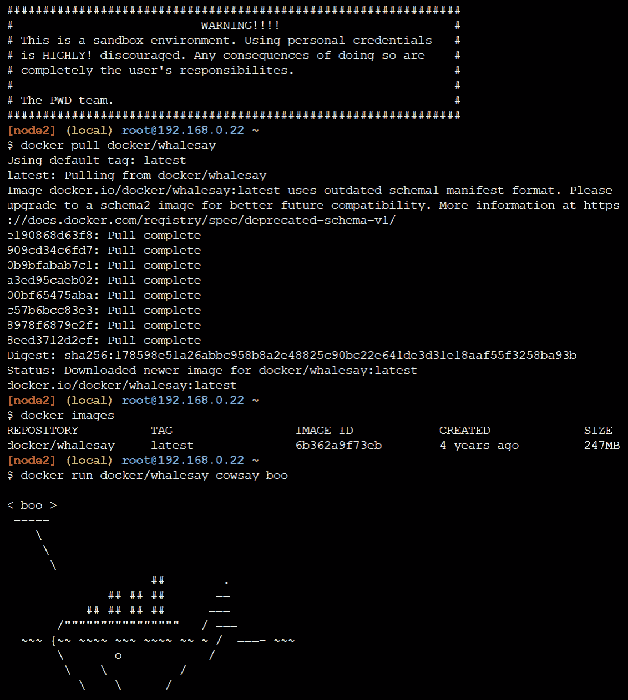
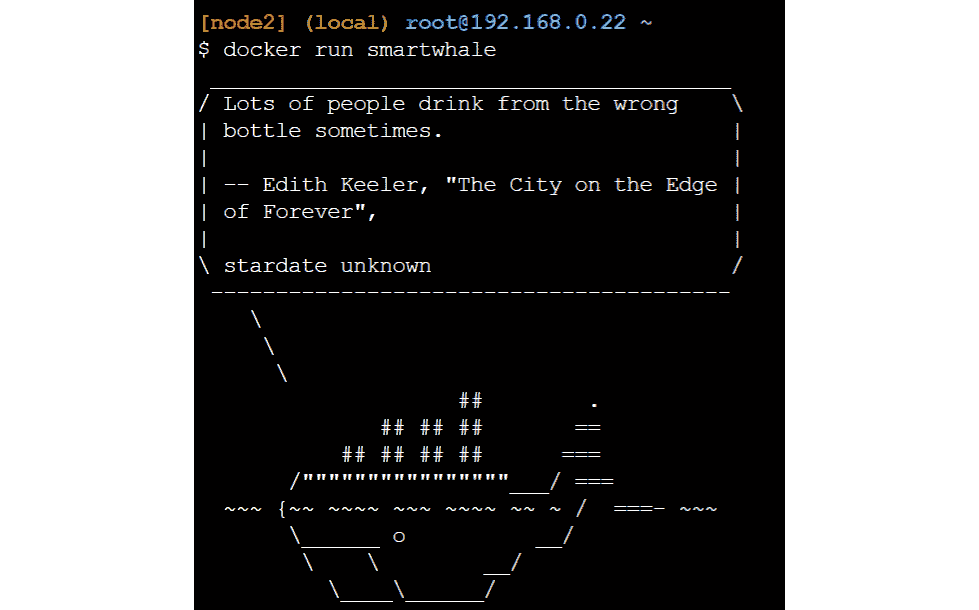
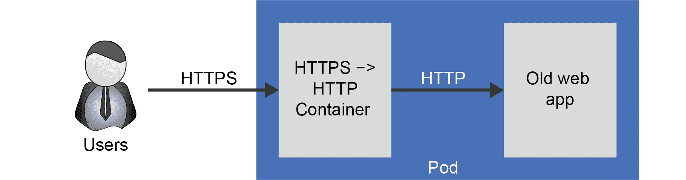

# 第一章：Docker 和 Kubernetes 简介

Kubernetes 已成为容器编排的领先标准。自 2014 年成立以来，它已经获得了巨大的流行。它已被初创公司和主要企业采用，而且主要的公共云供应商都提供了托管的 Kubernetes 服务。

Kubernetes 建立在 Docker 容器革命的成功基础上。Docker 既是一家公司，也是一种技术的名称。作为一种技术，Docker 是创建和运行软件容器的标准方式，通常称为 Docker 容器。容器本身是一种打包软件的方式，使得在任何平台上运行该软件变得容易，从您的笔记本电脑到数据中心的服务器，再到公共云中运行的集群。

Docker 也是 Docker 技术背后公司的名称。尽管核心技术是开源的，但 Docker 公司专注于通过多种商业产品减少开发人员的复杂性。

Kubernetes 将 Docker 容器提升到了一个新的水平。Kubernetes 是一个容器编排器。容器编排器是一种软件平台，可以轻松地在成千上万台机器上运行成千上万个容器。它自动化了部署、运行和扩展应用程序所需的许多手动任务。编排器将负责安排正确的容器在正确的机器上运行，并负责健康监控和故障转移，以及扩展您部署的应用程序。

Docker 和 Kubernetes 都是开源软件项目。开源软件允许来自许多公司的开发人员共同合作开发单一软件。Kubernetes 本身有来自微软、谷歌、红帽、VMware 等公司的贡献者。

三大主要的公共云平台 - Azure，Amazon Web Services（AWS）和 Google Cloud Platform（GCP） - 都提供了托管的 Kubernetes 服务。这在市场上引起了很大的兴趣，因为这些托管服务的计算能力几乎是无限的，而且易于使用，可以轻松构建和部署大规模应用程序。

Azure Kubernetes Service（AKS）是 Azure 的 Kubernetes 托管服务。它管理了为您组合所有前述服务的复杂性。在本书中，您将学习如何使用 AKS 来运行您的应用程序。每一章都会介绍新的概念，您将通过本书中的许多示例来应用这些概念。

然而，作为一名工程师，了解支撑 AKS 的技术仍然非常有用。我们将在本章探讨这些基础知识。您将了解 Linux 进程及其与 Docker 的关系。您将看到各种进程如何很好地适配到 Docker 中，以及 Docker 如何很好地适配到 Kubernetes 中。尽管 Kubernetes 在技术上是一个容器运行时无关的平台，但 Docker 是最常用的容器技术，被广泛应用。

本章介绍了基本的 Docker 概念，以便您可以开始您的 Kubernetes 之旅。本章还简要介绍了将帮助您构建容器、实现集群、执行容器编排和在 AKS 上排除故障的基础知识。对本章内容的粗略了解将使构建在 AKS 上的经过认证、加密、高度可扩展的应用程序所需的大部分工作变得不再神秘。在接下来的章节中，您将逐渐构建可扩展和安全的应用程序。

本章将涵盖以下主题：

+   将我们带到这里的软件演变

+   Docker 的基础知识

+   Kubernetes 的基础知识

+   AKS 的基础知识

本章的目的是介绍基本知识，而不是提供描述 Docker 和 Kubernetes 的详尽信息源。首先，我们将首先看一下软件是如何演变到现在的。

## 将我们带到这里的软件演变

有两个主要的软件开发演变使得 Docker 和 Kubernetes 变得流行。一个是采用了微服务架构风格。微服务允许应用程序由一系列小服务构建，每个服务都提供特定的功能。使 Docker 和 Kubernetes 变得流行的另一个演变是 DevOps。DevOps 是一组文化实践，允许人员、流程和工具更快、更频繁、更可靠地构建和发布软件。

尽管您可以在不使用微服务或 DevOps 的情况下使用 Docker 和 Kubernetes，但这些技术最广泛地被采用用于使用 DevOps 方法部署微服务。

在本节中，我们将讨论两种演变，首先是微服务。

### 微服务

软件开发随着时间的推移发生了巨大变化。最初，软件是在单一系统上开发和运行的，通常是在大型机上。客户端可以通过终端连接到大型机，而且只能通过那个终端。当计算机网络变得普遍时，这种情况发生了变化，客户端-服务器编程模型出现了。客户端可以远程连接到服务器，甚至在连接到服务器检索应用程序所需的部分数据时，在自己的系统上运行应用程序的一部分。

客户端-服务器编程模型已经发展成真正的分布式系统。分布式系统不同于传统的客户端-服务器模型，因为它们在多个不同的系统上运行多个不同的应用程序，并且彼此相互连接。

如今，在开发分布式系统时，微服务架构很常见。基于微服务的应用程序由一组服务组成，这些服务共同形成应用程序，而这些个别服务本身可以独立构建、测试、部署和独立扩展。这种风格有许多好处，但也有一些缺点。

微服务架构的一个关键部分是每个个别服务只提供一个核心功能。每个服务提供一个单一的业务功能。不同的服务共同形成完整的应用程序。这些服务通过网络通信共同工作，通常使用 HTTP REST API 或 gRPC。

这种架构方法通常被应用程序使用 Docker 和 Kubernetes 运行。Docker 被用作单个服务的打包格式，而 Kubernetes 是部署和管理一起运行的不同服务的编排器。

在我们深入研究 Docker 和 Kubernetes 的具体内容之前，让我们先探讨一下采用微服务的利与弊。

**运行微服务的优势**

运行基于微服务的应用程序有几个优势。第一个是每个服务都独立于其他服务。这些服务被设计得足够小（因此是微型），以满足业务领域的需求。由于它们很小，它们可以被制作成自包含的、可以独立测试的，因此可以独立发布。

这导致了每个微服务都可以独立扩展。如果应用程序的某个部分需求增加，该部分可以独立于应用程序的其他部分进行扩展。

服务可以独立扩展也意味着它们可以独立部署。在微服务方面有多种部署策略。最流行的是滚动升级和蓝/绿部署。

通过滚动升级，服务的新版本只部署到部分最终用户社区。如果服务正常，新版本会受到仔细监控，并逐渐获得更多的流量。如果出现问题，之前的版本仍在运行，流量可以轻松切换。

通过蓝/绿部署，您可以将服务的新版本独立部署。一旦部署并测试了服务的新版本，您就可以将 100%的生产流量切换到新版本。这可以实现服务版本之间的平稳过渡。

微服务架构的另一个好处是每个服务可以用不同的编程语言编写。这被描述为**多语言** - 能够理解和使用多种语言。例如，前端服务可以使用流行的 JavaScript 框架开发，后端可以使用 C#开发，而机器学习算法可以使用 Python 开发。这使您可以为每个服务选择合适的语言，并让开发人员使用他们最熟悉的语言。

**运行微服务的缺点**

每个硬币都有两面，微服务也是如此。虽然基于微服务的架构有多个优点，但这种架构也有其缺点。

微服务的设计和架构需要高度的软件开发成熟度才能正确实施。深刻理解领域的架构师必须确保每个服务都是有界的，并且不同的服务是内聚的。由于服务彼此独立且独立版本化，因此这些不同服务之间的软件合同非常重要。

微服务设计的另一个常见问题是在监视和故障排除这样的应用程序时增加了复杂性。由于不同的服务构成单个应用程序，并且这些不同的服务在多个服务器上运行，因此记录和跟踪这样的应用程序是一项复杂的工作。

与前述的缺点相关的是，通常在微服务中，您需要为应用程序构建更多的容错能力。由于应用程序中不同服务的动态性质，故障更有可能发生。为了保证应用程序的可用性，重要的是在构成应用程序的不同微服务中构建容错能力。实施重试逻辑或断路器等模式对于避免单一故障导致应用程序停机至关重要。

通常与微服务相关联，但是一个独立的转型是 DevOps 运动。我们将在下一节探讨 DevOps 的含义。

### DevOps

DevOps 字面上意味着开发和运营的结合。更具体地说，DevOps 是人员、流程和工具的结合，以更快、更频繁、更可靠地交付软件。DevOps 更多地涉及一套文化实践，而不是任何特定的工具或实施。通常，DevOps 涵盖软件开发的四个领域：规划、开发、发布和操作软件。

#### 注意

存在许多关于 DevOps 的定义。作者采用了这个定义，但鼓励读者在 DevOps 的文献中探索不同的定义。

DevOps 文化始于规划。在 DevOps 项目的规划阶段，项目的目标被概述。这些目标在高层次（称为*史诗*）和较低层次（在*特性*和*任务*中）都有概述。DevOps 项目中的不同工作项被记录在特性积压中。通常，DevOps 团队使用敏捷规划方法，在编程冲刺中工作。看板经常被用来表示项目状态和跟踪工作。当任务从*待办*状态变为*进行中*再到*完成*时，它在看板上从左向右移动。

当工作计划好后，实际的开发工作就可以开始了。在 DevOps 文化中，开发不仅仅是编写代码，还包括测试、审查和与团队成员集成。诸如 Git 之类的版本控制系统用于不同团队成员之间共享代码。自动化的持续集成（CI）工具用于自动化大部分手动任务，如测试和构建代码。

当一个功能完成编码、测试和构建后，就可以交付了。DevOps 项目的下一个阶段可以开始：交付。使用持续交付（CD）工具来自动化软件的部署。通常，软件会部署到不同的环境，如测试、质量保证或生产。使用自动化和手动门来确保在进入下一个环境之前的质量。

最后，当一款软件在生产中运行时，运维阶段就可以开始了。这个阶段涉及在生产中维护、监控和支持应用程序。最终目标是以尽可能少的停机时间可靠地运行应用程序。任何问题都应该尽可能被主动识别。软件中的错误需要在积压中被跟踪。

DevOps 流程是一个迭代的过程。一个团队永远不只处于一个阶段。整个团队不断地规划、开发、交付和操作软件。

存在多种工具来实施 DevOps 实践。有针对单个阶段的点解决方案，比如用于规划的 Jira 或用于 CI 和 CD 的 Jenkins，以及完整的 DevOps 平台，比如 GitLab。微软提供了两种解决方案，使客户能够采用 DevOps 实践：Azure DevOps 和 GitHub。Azure DevOps 是一套服务，支持 DevOps 流程的所有阶段。GitHub 是一个单独的平台，支持 DevOps 软件开发。GitHub 被认为是领先的开源软件开发平台，托管了超过 4000 万个开源项目。

微服务和 DevOps 通常与 Docker 和 Kubernetes 结合使用。在介绍了微服务和 DevOps 之后，我们将继续本章的第一部分，介绍 Docker 和容器的基础知识，然后是 Kubernetes 的基础知识。

## Docker 容器的基础知识

自 20 世纪 70 年代以来，Linux 内核中一种容器技术已经存在。今天容器的技术，称为 cgroups，是由 Google 在 2006 年引入 Linux 内核的。Docker 公司在 2013 年通过引入一种简单的开发者工作流程使这项技术变得流行。该公司以自己的名字命名了这项技术，因此 Docker 这个名字既可以指公司，也可以指技术。不过，通常我们使用 Docker 来指代这项技术。

Docker 作为一种技术既是一种打包格式，也是一个容器运行时。我们将打包称为一种架构，允许应用程序与其依赖项（如二进制文件和运行时）一起打包。运行时指的是运行容器映像的实际过程。

你可以通过在 Docker Hub（[`hub.docker.com/`](https://hub.docker.com/)）创建一个免费的 Docker 账户，并使用该登录信息打开 Docker 实验室（[`labs.play-with-docker.com/`](https://labs.play-with-docker.com/)）来尝试 Docker。这将为你提供一个预先安装了 Docker 的环境，有效期为 4 小时。在本节中，我们将使用 Docker 实验室来构建我们自己的容器和镜像。

#### 注意：

虽然在本章中我们使用基于浏览器的 Docker 实验室来介绍 Docker，但你也可以在本地桌面或服务器上安装 Docker。对于工作站，Docker 有一个名为 Docker Desktop 的产品（[`www.docker.com/products/docker-desktop`](https://www.docker.com/products/docker-desktop)），适用于 Windows 和 Mac，可以在本地创建 Docker 容器。在服务器上，无论是 Windows 还是 Linux，Docker 也可以作为容器的运行时使用。

### Docker 镜像

Docker 使用镜像来启动一个新的容器。镜像包含了在容器内运行所需的所有软件。容器镜像可以存储在本地计算机上，也可以存储在容器注册表中。有公共注册表，如公共 Docker Hub（[`hub.docker.com/`](https://hub.docker.com/)），也有私有注册表，如 Azure 容器注册表（ACR）。当你作为用户在 PC 上没有镜像时，你将使用`docker pull`命令从注册表中拉取镜像。

在下面的示例中，我们将从公共 Docker Hub 存储库中拉取一个镜像并运行实际的容器。你可以按照以下说明在 Docker 实验室中运行这个示例：

[PRE0]

这些命令的输出将类似于*图 1.1*：

###### 图 1.1：在 Docker 实验室中运行 Docker 的示例

这里发生的是，Docker 首先将您的镜像分成多个部分，并将其存储在运行的机器上。当我们运行实际的应用程序时，它使用本地镜像来启动一个容器。如果我们详细查看命令，您会发现`docker pull`只接受一个参数，即`docker/whalesay`。如果您没有提供私有容器注册表，Docker 将在公共 Docker Hub 中查找镜像，这就是 Docker 从中拉取我们的镜像的地方。`docker run`命令接受了几个参数。第一个参数是`docker/whalesay`，这是对镜像的引用。接下来的两个参数，`cowsay boo`，是传递给正在运行的容器以执行的命令。

在前面的示例中，我们了解到可以在不先构建镜像的情况下运行容器是可能的。然而，通常情况下，您会想要构建自己的镜像。为此，您可以使用**Dockerfile**。Dockerfile 包含 Docker 将遵循的步骤，从基础镜像开始构建您的镜像。这些指令可以包括添加文件、安装软件或设置网络等。下面提供了一个 Dockerfile 的示例，我们将在我们的 Docker playground 中创建：

[PRE1]

这个 Dockerfile 有三行。第一行将指示 Docker 使用哪个镜像作为新镜像的源镜像。下一步是运行一个命令，向我们的镜像添加新功能。在这种情况下，更新我们的`apt`仓库并安装一个叫做`fortunes`的应用程序。最后，`CMD`命令告诉 Docker 在基于这个镜像运行的容器中执行哪个命令。

通常将 Dockerfile 保存在名为`Dockerfile`的文件中，不带扩展名。要构建我们的镜像，您需要执行`docker build`命令，并指向您创建的 Dockerfile。在构建 Docker 镜像时，该过程将读取 Dockerfile 并执行其中的不同步骤。该命令还将输出运行容器和构建镜像所采取的步骤。让我们演示构建我们自己的镜像。

要创建这个 Dockerfile，通过`vi Dockerfile`命令打开一个文本编辑器。vi 是 Linux 命令行中的高级文本编辑器。如果你不熟悉它，让我们一起看看你该如何在其中输入文本：

1.  打开 vi 后，按下`i`键进入插入模式。

1.  然后，要么复制粘贴，要么输入这三行代码。

1.  之后，按下*Esc*键，然后输入`:wq!`来写入（w）你的文件并退出（q）文本编辑器。

下一步是执行`docker build`来构建我们的镜像。我们将在该命令中添加最后一部分，即给我们的镜像添加一个标签，这样我们就可以用一个有用的名称来调用它。要构建你的镜像，你将使用`docker build -t smartwhale .`命令（不要忘记在这里加上最后的点）。

现在你会看到 Docker 执行一系列步骤 - 在我们的例子中是三个步骤 - 以构建我们的镜像。镜像构建完成后，你可以运行你的应用程序。要运行容器，你需要运行`docker run smartwhale`，然后你应该会看到类似于*图 1.2*的输出。然而，你可能会看到不同的智能引号。这是因为`fortunes`应用程序生成不同的引言。如果你多次运行容器，你会看到不同的引言出现，就像*图 1.2*中显示的那样。

###### 图 1.2：运行自定义容器的示例

这就结束了我们对 Docker 的概述和演示。在本节中，你从一个现有的容器镜像开始，并在 Docker 实验室上启动了它。之后，你进一步构建了自己的容器镜像，并使用自己的镜像启动了容器。现在你已经学会了构建和运行容器的方法。在下一节中，我们将介绍 Kubernetes。Kubernetes 允许你以规模运行多个容器。

## Kubernetes 作为容器编排平台

构建和运行单个容器似乎足够简单。然而，当你需要在多个服务器上运行多个容器时，情况可能会变得复杂。这就是容器编排器可以帮助的地方。容器编排器负责安排容器在服务器上运行，当容器失败时重新启动容器，当主机不健康时将容器移动到新主机，以及更多其他任务。

当前领先的编排平台是 Kubernetes（[`kubernetes.io/`](https://kubernetes.io/)）。Kubernetes 受到了 Google 的 Borg 项目的启发，该项目本身在生产环境中运行了数百万个容器。

Kubernetes 采用声明性的编排方式；也就是说，你指定你需要什么，Kubernetes 负责部署你指定的工作负载。你不再需要手动启动这些容器，因为 Kubernetes 将启动你指定的 Docker 容器。

#### 注意

尽管 Kubernetes 支持多个容器运行时，但 Docker 是最流行的运行时。

在本书中，我们将构建多个在 Kubernetes 中运行容器的示例，并且你将了解更多关于 Kubernetes 中不同对象的知识。在这个介绍性的章节中，我们将介绍 Kubernetes 中的三个基本对象，这些对象在每个应用中都可能会看到：Pod、Deployment 和 Service。

### Kubernetes 中的 Pod

Kubernetes 中的 Pod 是基本的调度块。一个 Pod 是一个或多个容器的组合。这意味着一个 Pod 可以包含单个容器或多个容器。当创建一个只有一个容器的 Pod 时，你可以互换使用容器和 Pod 这两个术语。然而，Pod 这个术语仍然更受青睐。

当一个 Pod 包含多个容器时，这些容器共享相同的文件系统和网络命名空间。这意味着当一个 Pod 中的容器写入一个文件时，该 Pod 中的其他容器可以读取该文件。这也意味着 Pod 中的所有容器可以使用`localhost`网络相互通信。

在设计方面，你应该只将需要紧密集成的容器放在同一个 Pod 中。想象一下以下情况：你有一个不支持 HTTPS 的旧 Web 应用。你想要升级该应用以支持 HTTPS。你可以创建一个包含旧 Web 应用的 Pod，并包含另一个容器，该容器将为该应用执行 SSL 卸载，如*图 1.3*所述。用户将使用 HTTPS 连接到你的应用，而中间的容器将 HTTPS 流量转换为 HTTP：

###### 图 1.3：执行 HTTPS 卸载的多容器 Pod 的示例

#### 注意

这个设计原则被称为边车。微软提供了一本免费的电子书，描述了多个多容器 Pod 设计和设计分布式系统（[`azure.microsoft.com/resources/designing-distributed-systems/`](https://azure.microsoft.com/resources/designing-distributed-systems/)）。

一个 Pod，无论是单个还是多个容器的 Pod，都是一个短暂的资源。这意味着 Pod 可以在任何时候被终止，并在另一个节点上重新启动。当这种情况发生时，存储在该 Pod 中的状态将丢失。如果您需要在应用程序中存储状态，您需要将其存储在`StatefulSet`中，我们将在*第三章*，*在 AKS 上部署应用程序*中讨论，或者将状态存储在 Kubernetes 之外的外部数据库中。

### Kubernetes 中的部署

Kubernetes 中的部署提供了围绕 Pod 的功能层。它允许您从相同的定义中创建多个 Pod，并轻松地对部署的 Pod 进行更新。部署还有助于扩展您的应用程序，甚至可能自动扩展您的应用程序。

在底层，部署创建一个`ReplicaSet`，然后将创建您请求的 Pod。`ReplicaSet`是 Kubernetes 中的另一个对象。`ReplicaSet`的目的是在任何给定时间维护一组稳定运行的 Pod。如果您对部署进行更新，Kubernetes 将创建一个包含更新的 Pod 的新`ReplicaSet`。默认情况下，Kubernetes 将对新版本进行滚动升级。这意味着它将启动一些新的 Pod。如果这些 Pod 正常运行，那么它将终止一些旧的 Pod 并继续这个循环，直到只有新的 Pod 在运行。

###### 图 1.4：部署、ReplicaSet 和 Pod 之间的关系

### Kubernetes 中的服务

Kubernetes 中的服务是一个网络级的抽象。这允许您在单个 IP 地址和单个 DNS 名称下公开部署中的多个 Pod。

Kubernetes 中的每个 Pod 都有自己的私有 IP 地址。理论上，您可以使用这个私有 IP 地址连接您的应用程序。然而，正如前面提到的，Kubernetes Pods 是短暂的，这意味着它们可以被终止和移动，这会影响它们的 IP 地址。通过使用 Service，您可以使用单个 IP 地址将您的应用程序连接在一起。当一个 Pod 从一个节点移动到另一个节点时，Service 将确保流量被路由到正确的端点。

在本节中，我们介绍了 Kubernetes 和三个基本对象。在下一节中，我们将介绍 AKS。

## Azure Kubernetes 服务

**Azure Kubernetes 服务**（**AKS**）使创建和管理 Kubernetes 集群变得更容易。

典型的 Kubernetes 集群由多个主节点和多个工作节点组成。Kubernetes 中的节点相当于**虚拟机**（**VM**）。主节点包含 Kubernetes API 和包含集群状态的数据库。工作节点是运行实际工作负载的虚拟机。

AKS 使创建集群变得更加容易。当您创建一个 AKS 集群时，AKS 会免费为您设置 Kubernetes 主节点。然后，AKS 将在您的订阅中创建虚拟机，并将这些虚拟机转换为您网络中 Kubernetes 集群的工作节点。您只需为这些虚拟机付费；您不需要为主节点付费。

在 AKS 中，Kubernetes 服务与 Azure 负载均衡器集成，Kubernetes Ingress 与应用程序网关集成。Azure 负载均衡器是一个第 4 层网络负载均衡器服务；应用程序网关是一个基于 HTTP 的第 7 层负载均衡器。Kubernetes 和这两个服务之间的集成意味着当您在 Kubernetes 中创建一个服务或 Ingress 时，Kubernetes 将在 Azure 负载均衡器或应用程序网关中分别创建一个规则。Azure 负载均衡器或应用程序网关将然后将流量路由到托管您的 Pod 的集群中的正确节点。

此外，AKS 添加了许多功能，使得更容易管理集群。AKS 包含升级集群到更新的 Kubernetes 版本的逻辑。它还可以轻松地扩展您的集群，使其变得更大或更小。

服务还带有使操作更容易的集成。AKS 集群预先配置了与 Azure Active Directory（Azure AD）的集成，以便简化身份管理和基于角色的访问控制（RBAC）。RBAC 是定义哪些用户可以访问资源以及他们可以对这些资源执行哪些操作的配置过程。AKS 还集成到 Azure Monitor for containers 中，这使得监视和排除故障变得更简单。

## 总结

在本章中，我们介绍了 Docker 和 Kubernetes 的概念。我们运行了许多容器，从现有的镜像开始，然后使用我们自己构建的镜像。在演示之后，我们探索了三个基本的 Kubernetes 对象：Pod、Deployment 和 Service。

这为剩余的章节提供了共同的背景，您将在 Microsoft AKS 中部署 Docker 化的应用程序。您将看到，Microsoft 的 AKS 平台即服务（PaaS）提供简化部署，通过处理许多管理和运营任务，您将不得不自行处理这些任务，如果您管理和运营自己的 Kubernetes 基础设施。

在下一章中，我们将介绍 Azure 门户及其组件，以便在创建您的第一个 AKS 集群的情况下使用。
