# 第六章：使用 HTTPS 和 Azure AD 保护您的应用程序

HTTPS 已经成为任何面向公众的网站的必需品。它不仅提高了网站的安全性，而且还成为新的浏览器功能的要求。HTTPS 是 HTTP 协议的安全版本。HTTPS 利用**传输层安全**（**TLS**）证书来加密终端用户和服务器之间的流量，或者两个服务器之间的流量。TLS 是**安全套接字层**（**SSL**）的后继者。术语*TLS*和*SSL*经常可以互换使用。

过去，您需要从**证书颁发机构**（**CA**）购买证书，然后在您的 Web 服务器上设置它们，并定期更新它们。虽然今天仍然可能，但 Let's Encrypt 服务和 Kubernetes 中的助手使在集群中设置经过验证的 TLS 证书变得非常容易。Let's Encrypt 是由互联网安全研究组织运营并得到多家公司支持的非营利组织。它是一个提供自动验证 TLS 证书的免费服务。自动化是 Let's Encrypt 服务的一个关键优势。

在 Kubernetes 助手方面，我们将介绍一个名为**Ingress**的新对象，并且我们将使用一个名为**cert-manager**的 Kubernetes 附加组件。Ingress 是 Kubernetes 中管理对服务的外部访问的对象。Ingress 通常用于 HTTP 服务。Ingress 在我们在*第三章，AKS 上的应用部署*中解释的服务对象之上添加了额外的功能。Ingress 可以配置为处理 HTTPS 流量。它还可以根据由用于连接的**域名系统**（**DNS**）分配的主机名配置为将流量路由到不同的后端服务。

`cert-manager`是一个 Kubernetes 附加组件，可帮助自动创建 TLS 证书。它还可以在证书临近到期时帮助进行轮换。`cert-manager`可以与 Let's Encrypt 接口自动请求证书。

在本章中，我们将看到如何设置 Ingress 和`cert-manager`与 Let's Encrypt 接口。

此外，在本章中，我们将探讨为 guestbook 应用程序进行身份验证的不同方法。我们将使用`oauth2_proxy`反向代理来向示例 guest 应用程序添加 Azure Active Directory（AD）的身份验证。`oauth2_proxy`是一个反向代理，将身份验证请求转发到配置身份验证平台。您将学习如何轻松地保护没有内置身份验证的应用程序。身份验证方案可以扩展为使用 GitHub、Google、GitLab、LinkedIn 或 Facebook。

本章将涵盖以下主题：

+   在服务前设置 Ingress

+   为 Ingress 添加 TLS 支持

+   身份验证和常见身份验证提供程序

+   身份验证与授权

+   部署`oauth2_proxy` sidecar

让我们从设置 Ingress 开始。

## HTTPS 支持

传统上，获取 TLS 证书一直是一项昂贵且繁琐的业务。如果您想以低成本完成，可以自行签署证书，但浏览器在打开您的网站时会抱怨并将其标识为不受信任。Let's Encrypt 改变了这一切。Let's Encrypt 是一个免费、自动化和开放的 CA，为公众利益而运行。它为人们提供数字证书，以便免费以最用户友好的方式为网站启用 HTTPS（SSL/TLS）。

#### 注意

尽管本节侧重于使用诸如 Let's Encrypt 之类的自动化服务，您仍然可以选择传统的方式从现有 CA 购买证书并将其导入 Kubernetes。

### 安装 Ingress 控制器

通过 Ingress 对象，Kubernetes 提供了一种安全地公开您的服务的清晰方式。它提供了 SSL 终端点和基于名称的路由，这意味着不同的 DNS 名称可以路由到不同的后端服务。

如果您想在集群中创建 Ingress 对象，首先需要设置 Ingress 控制器。Ingress 控制器将管理您在集群中部署的 Ingresses 的状态。在选择 Ingress 控制器时有多个选项。有关所有选项的完整列表，请参阅[`kubernetes.io/docs/concepts/services-networking/ingress-controllers/`](https://kubernetes.io/docs/concepts/services-networking/ingress-controllers/)。在运行 AKS 时，最常见的两个选项要么使用基于 NGINX 的 Ingress 控制器，要么使用基于 Azure 应用程序网关的 Ingress 控制器。在我们的示例中，我们将使用 NGINX 版本。

让我们继续安装 Ingress 控制器的 NGINX 版本，执行以下步骤：

1.  要跟着操作，请在 Cloud Shell 的 Bash 版本中运行此示例。

1.  输入以下命令开始安装：

```
helm repo add stable https://kubernetes-charts.storage.googleapis.com/ 
helm install ingress stable/nginx-ingress
```

这将为我们的集群设置 Ingress 控制器。这还将创建一个我们将用于访问 Ingress 控制器的公共 IP。

1.  让我们连接到 Ingress 控制器。要获取`ingress-controller`服务的公开 IP，请输入此命令：

```
kubectl get service 
```

您应该看到 Ingress 控制器的条目，如*图 6.1*所示：


###### 图 6.1：获取 Ingress 控制器的 IP

您可以在浏览器中输入`http://<EXTERNAL-IP>`来浏览网页：


###### 图 6.2：显示其默认后端的 Ingress

这向您展示了两件事：

1.  没有后端应用程序，只有一个默认应用程序。

1.  网站通过 HTTP 提供服务，而不是 HTTPS（因此会出现**不安全**警告）。

在接下来的两个部分中，我们将解决这两个问题。我们将首先为我们的留言板应用程序创建一个 Ingress 规则，然后我们将通过 Let's Encrypt 添加 HTTPS 支持。

### 为留言板应用程序添加 Ingress 规则

让我们从重新启动我们的留言板应用程序开始。要启动留言板应用程序，请输入以下命令：

```
kubectl create -f guestbook-all-in-one.yaml
```

这将创建我们信任的留言板应用程序。您应该看到对象被创建，如*图 6.3*所示：

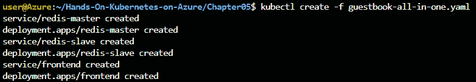

###### 图 6.3：创建留言板应用程序

然后，我们可以使用以下 YAML 文件通过 Ingress 公开前端服务。这在本章的源代码中提供为`simple-frontend-ingress.yaml`：

```
1   apiVersion: extensions/v1beta1
2   kind: Ingress
3   metadata:
4     name: simple-frontend-ingress
5   spec:
6     rules:
7     - http:
8         paths:
9         - path: /
10          backend:
11            serviceName: frontend
12            servicePort: 80
```

让我们看看我们在这个 YAML 文件中定义了什么：

+   **第 2 行**：在这里，我们定义了我们正在创建一个 Ingress 对象的事实。

+   **第 5-12 行**：这些行定义了 Ingress 的配置。特别注意：

+   **第 9 行**：在这里，我们定义了此 Ingress 正在侦听的路径。在我们的情况下，这是顶级路径。在更高级的情况下，您可以有不同的路径指向不同的服务。

+   **第 10-12 行**：这些行定义了应将此流量指向的实际服务。

我们可以使用以下命令创建此 Ingress：

```
kubectl apply -f simple-frontend-ingress.yaml 
```

如果您现在转到`https://<EXTERNAL-IP>/`，您应该会得到如*图 6.4*所示的输出：


###### 图 6.4：通过 Ingress 访问 guestbook 应用程序

请注意以下内容：我们不必像在前面的章节中那样公开暴露前端服务。我们已将 Ingress 添加为公开服务，前端服务仍然对集群保密：

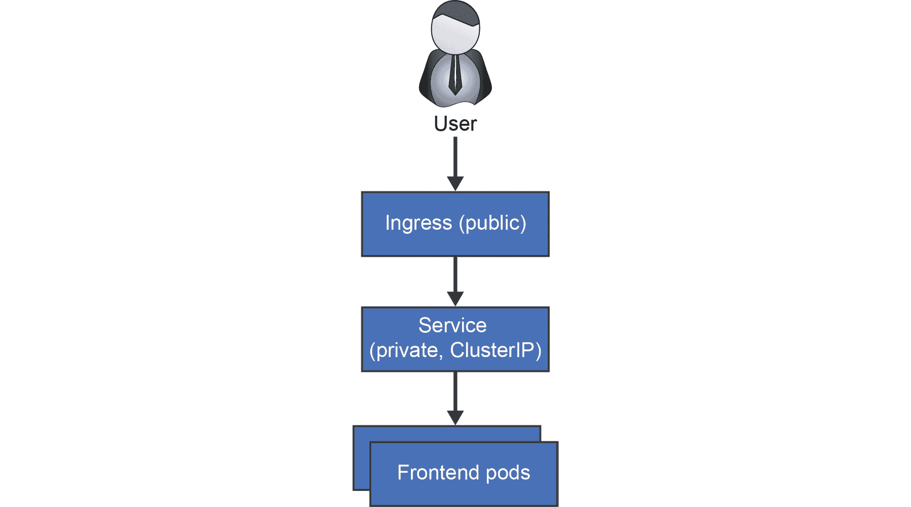

###### 图 6.5：显示可公开访问的 Ingress 的流程图

您可以通过运行以下命令来验证这一点：

```
kubectl get svc
```

这应该只显示一个公共服务：

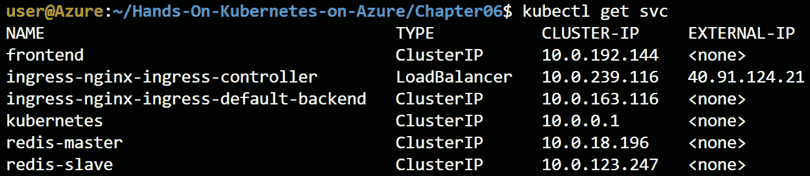

###### 图 6.6：仅显示具有公共 IP 的 Ingress 的输出

在本节中，您已经启动了一个 guestbook 应用程序的实例。您通过创建 Ingress 将其公开。只有 Ingress 是公开访问的。在下一节中，我们将看到如何从 Let's Encrypt 获取证书。

### 从 Let's Encrypt 获取证书

在本节中，我们将为我们的应用程序添加 HTTPS 支持。为此，我们需要一个 TLS 证书。我们将使用`cert-manager` Kubernetes 附加组件从 Let's Encrypt 请求证书。涉及几个步骤。将 HTTPS 添加到我们的应用程序的过程涉及以下步骤：

1.  安装`cert-manager`，它与 Let's Encrypt API 接口，以请求您指定的域名的证书。

1.  将**Azure 完全合格的域名**（**FQDN**）映射到 NGINX Ingress 公共 IP。 FQDN 是服务的完整 DNS 名称，有时称为 DNS 记录，例如`www.google.com`。 为 FQDN 颁发 TLS 证书，这就是为什么我们需要为我们的 Ingress 映射一个 FQDN。

1.  安装证书颁发者，该颁发者将从 Let's Encrypt 获取证书。

1.  为给定的 FQDN 创建 SSL 证书。

1.  通过创建 Ingress 到在*步骤 4*中创建的证书的服务来保护前端服务部分。在我们的示例中，我们不会执行此步骤。但是，我们将重新配置我们的 Ingress 以自动获取在*步骤 4*中创建的证书。

让我们从第一步开始；在我们的集群中安装`cert-manager`。

**安装 cert-manager**

获取 TLS 证书的第一步是在您的集群中安装`cert-manager`。`cert-manager` ([`github.com/jetstack/cert-manager`](https://github.com/jetstack/cert-manager))自动管理和发放来自各种发放源的 TLS 证书。这是由公司**Jetstack**管理的开源解决方案。续订证书和确保它们定期更新都由`cert-manager`管理，这是一个 Kubernetes 附加组件。

以下命令在您的集群中安装`cert-manager`：

```
kubectl create ns cert-manager
helm repo add jetstack https://charts.jetstack.io
helm install cert-manager --namespace cert-manager jetstack/cert-manager
```

这些命令在您的集群中执行了一些操作：

1.  创建一个新的**命名空间**。命名空间在 Kubernetes 中用于隔离彼此的工作负载。

1.  向 Helm 添加一个新的存储库以获取图表。

1.  安装`cert-manager` Helm 图表。

现在您已经安装了`cert-manager`，我们可以继续下一步：将 FQDN 映射到 Ingress。

**将 Azure FQDN 映射到 NGINX Ingress 公共 IP**

获取 TLS 证书过程的下一步是将 FQDN 添加到您的 IP 地址。Let's Encrypt 需要一个公开可用的 DNS 条目来验证 DNS 条目的所有权*之前*发放证书。这确保您不能劫持别人的站点。我们必须将 Azure 给我们的公共域名映射到我们从 Azure 负载均衡器获取的外部 IP，以证明所有权。

以下步骤将帮助我们将 DNS 条目链接到我们的公共 IP：

1.  让我们继续将 DNS 名称链接到我们的公共 IP 地址。首先，请确保从您的 Ingress 服务获取 IP 地址：

```
kubectl get service
```

记下 Ingress 服务的 IP。在 Azure 搜索栏中，现在搜索`public ip`：

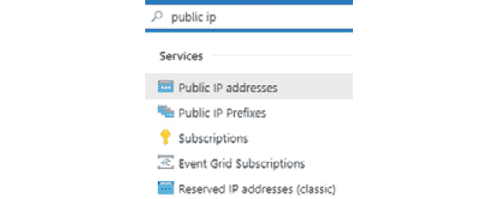

###### 图 6.7：在 Azure 搜索栏中搜索公共 IP

1.  一旦到达那里，您应该会看到许多公共 IP 地址。要找到我们的公共 IP 地址，您可以在这里显示一个额外的列，该列将显示实际的 IP 地址。点击“编辑列”按钮添加额外的列：

###### 图 6.8：点击“编辑列”以添加额外的列

1.  在列选择器中，选择“IP 地址”，然后点击向右的箭头，如*图 6.9*所示：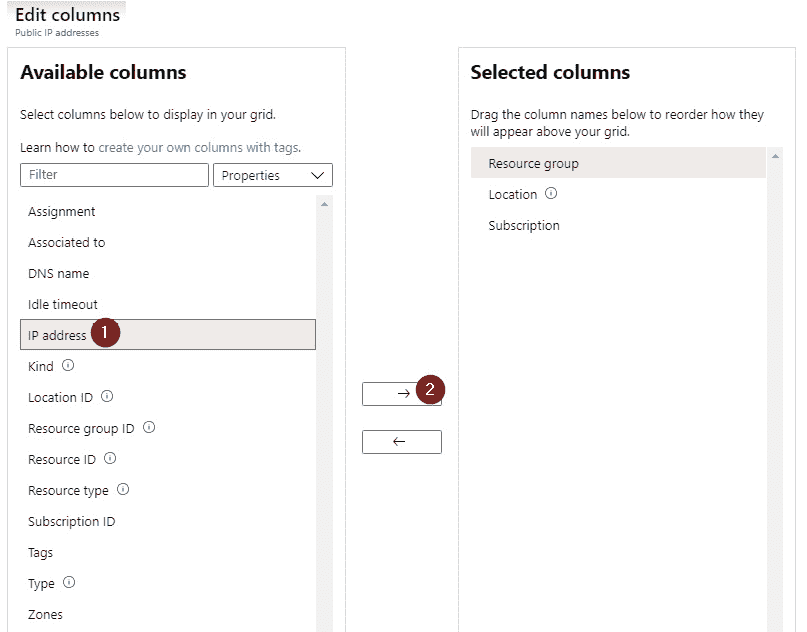

###### 图 6.9：将 IP 地址添加到所选列

1.  点击“应用”以显示实际的 IP 地址。当您看到您的 IP 地址时，请点击它。在您的 IP 地址的窗格中，进入“配置”视图。然后，输入一个*唯一*的 DNS 名称，然后点击“保存”：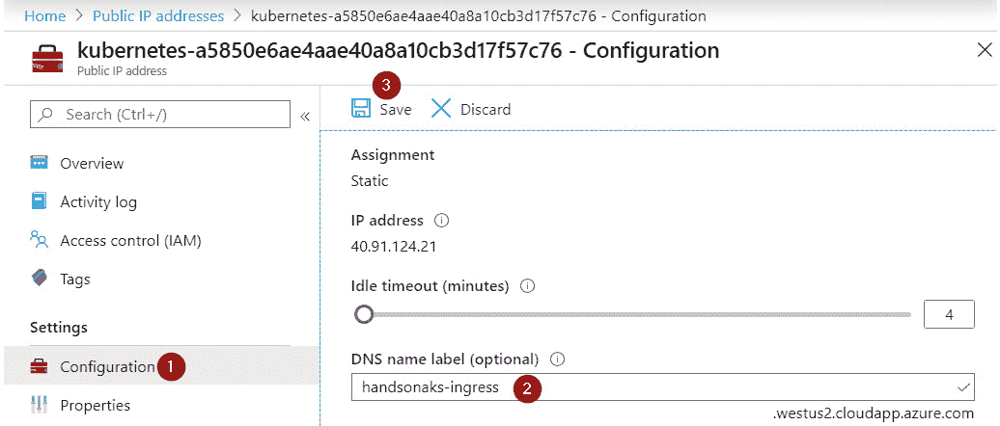

###### 图 6.10：添加一个唯一的 DNS 名称标签并保存配置

现在您已经有了与您的公共 IP 地址相关联的 DNS 记录。接下来，您将在集群中安装证书颁发机构。

**安装证书颁发机构**

在本节中，我们将安装 Let's Encrypt 的 staging 证书颁发机构。一个证书可以由多个颁发机构颁发。例如，`letsencrypt-staging`是用于测试目的。由于我们正在构建测试，我们将使用 staging 服务器。证书颁发机构的代码已经在本章的源代码中提供在`certificate-issuer.yaml`文件中。像往常一样，使用`kubectl create -f certificate-issuer.yaml`，其中包含以下内容：

```
1   apiVersion: cert-manager.io/v1alpha2
2   kind: Issuer
3   metadata:
4     name: letsencrypt-staging
5   spec:
6     acme:
7       server: https://acme-staging-v02.api.letsencrypt.org/directory
8       email: <your e-mailaddress>
9       privateKeySecretRef:
10        name: letsencrypt-staging
11      solvers:
12      - http01:
13          ingress:
14            class: nginx
```

现在，让我们看看我们在这里定义了什么：

+   **第 1-2 行**：在这里，我们使用了我们之前安装的**CustomResourceDefinition**（**CRD**）。CRD 是扩展 Kubernetes API 服务器以创建自定义资源的一种方式，比如证书颁发机构。在这种情况下，我们特别指向了我们注入到 Kubernetes API 中的`cert-manager` API CRD，并创建了一个`Issuer`对象。

+   **第 6-10 行**：我们在这些行中提供了 Let's Encrypt 的配置，并指向了 staging 服务器。

+   **第 11-14 行**：这是用于 ACME 客户端认证域名所有权的附加配置。

安装了证书颁发者后，我们现在可以进行下一步：创建 TLS 证书。

**创建 TLS 证书并保护我们的服务**

在本节中，我们将创建一个 TLS 证书。您可以通过两种方式配置`cert-manager`来创建证书。您可以手动创建证书并将其链接到 Ingress 控制器，或者您可以配置 Ingress 控制器，以便`cert-manager`自动创建证书。在本例中，我们将向您展示第二种方法，即通过编辑我们的 Ingress 来使其看起来像以下的 YAML 代码。此文件在 GitHub 上的源代码中存在，名称为`ingress-with-tls.yaml`：

```
1   apiVersion: extensions/v1beta1
2   kind: Ingress
3   metadata:
4     name: simple-frontend-ingress
5     annotations:
6       cert-manager.io/issuer: "letsencrypt-staging"
7   spec:
8     tls:
9     - hosts:
10      - <your DNS prefix>.<your azure region>.cloudapp.azure.com
11      secretName: frontend-tls
12    rules:
13    - host: <your DNS prefix>.<your Azure location>.cloudapp.azure.com
14      http:
15        paths:
16        - path: /
17          backend:
18            serviceName: frontend
19            servicePort: 80
```

我们对原始 Ingress 进行了以下更改：

+   **第 6 行**：我们已经在 Ingress 上添加了一个指向证书颁发者的注释。

+   **第 10 行和第 13 行**：我们在这里添加了 Ingress 的域名。这是必需的，因为 Let's Encrypt 只为域名颁发证书。

+   **第 11 行**：这是将用于存储我们的证书的密钥的名称。

您可以使用以下命令更新我们之前创建的 Ingress：

```
kubectl apply -f ingress-with-tls.yaml
```

`cert-manager`大约需要一分钟来请求证书并配置我们的 Ingress 以使用该证书。在等待期间，让我们来看看`cert-manager`代表我们创建的中间资源。

首先，`cert-manager`为我们创建了一个`certificate`对象。我们可以使用以下命令查看该对象的状态：

```
kubectl get certificate
```

执行此命令将生成一个输出，如*图 6.11*所示：

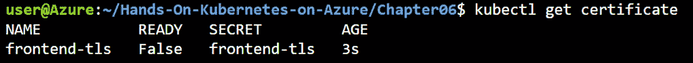

###### 图 6.11：显示证书状态的输出

如您所见，我们的证书尚未准备就绪。`cert-manager`创建了另一个对象来实际获取证书。这个对象是`certificaterequest`。我们可以使用以下命令获取其状态：

```
kubectl get certificaterequest
```

这将生成如*图 6.12*所示的输出：

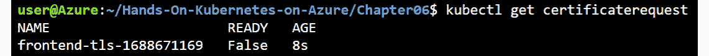

###### 图 6.12：输出显示证书请求对象的状态为 False

我们还可以通过针对`certificaterequest`对象发出`describe`命令来获取有关请求的更多详细信息：

```
kubectl describe certificaterequest
```

当我们在等待证书签发时，状态将类似于*图 6.13*：

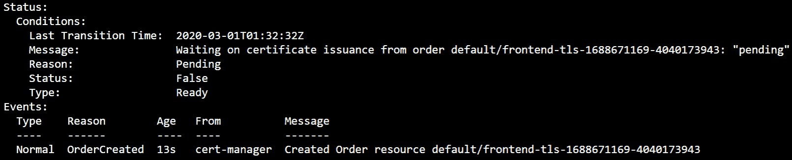

###### 图 6.13：提供有关 certificaterequest 对象的更多详细信息的输出

如果我们再给它几秒钟，`describe`命令应该会返回一个成功创建证书的消息，如*图 6.14*所示：

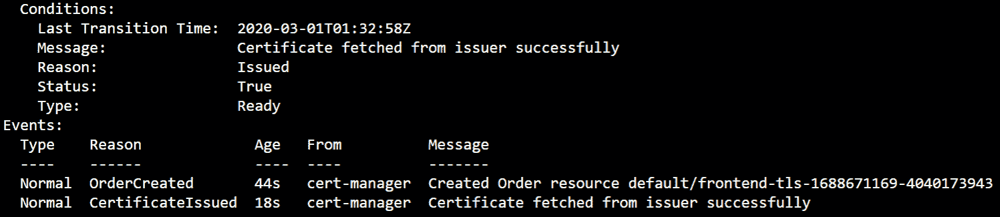

###### 图 6.14：显示已签发证书的输出

现在，这应该可以使我们的前端 Ingress 通过 HTTPS 提供服务。让我们在浏览器中尝试一下，浏览到您在映射 FQDN 部分创建的 DNS 名称。这将在浏览器中显示错误，显示证书无效，如*图 6.15*所示。这是可以预期的，因为我们正在使用 Let's Encrypt 临时服务：

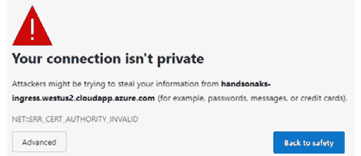

###### 图 6.15：使用 Let's Encrypt 临时服务器，我们的证书默认不受信任

您可以通过单击**高级**并选择**继续**来浏览到您的应用程序。

由于我们能够完成临时证书的测试，现在我们可以转向生产环境。

**从临时切换到生产**

在本节中，我们将从临时证书切换到生产级证书。要做到这一点，您可以通过在集群中创建一个新的签发者来重新执行上一个练习，就像以下所示（在`certificate-issuer-prod.yaml`中提供）。不要忘记在文件中更改您的电子邮件地址：

```
1   apiVersion: cert-manager.io/v1alpha2
2   kind: Issuer
3   metadata:
4     name: letsencrypt-prod
5   spec:
6     acme:
7       server: https://acme-v02.api.letsencrypt.org/directory
8       email: <your e-mail>
9       privateKeySecretRef:
10        name: letsencrypt-staging
11      solvers:
12      - http01:
13          ingress:
14            class: nginx
```

然后将`ingress-with-tls.yaml`文件中对签发者的引用替换为`letsencrypt-prod`，就像这样（在`ingress-with-tls-prod.yaml`文件中提供）：

```
1   apiVersion: extensions/v1beta1
2   kind: Ingress
3   metadata:
4     name: simple-frontend-ingress
5     annotations:
6       cert-manager.io/issuer: "letsencrypt-prod"
7   spec:
8     tls:
9     - hosts:
10      - <your dns prefix>.<your azure region>.cloudapp.azure.com
11      secretName: frontend-tls
12    rules:
13    - host: <your dns prefix>.<your azure region>.cloudapp.azure.com
14      http:
15        paths:
16        - path: /
17          backend:
18            serviceName: frontend
19            servicePort: 80
```

要应用这些更改，请执行以下命令：

```
kubectl create -f certificate-issuer-prod.yaml
kubectl apply -f ingress-with-tls-prod.yaml
```

证书再次生效大约需要一分钟。一旦新证书发放，您可以再次浏览到您的 DNS 名称，并且不应该再看到关于无效证书的警告。如果您单击浏览器中的挂锁项目，您应该会看到您的连接是安全的，并使用有效的证书。

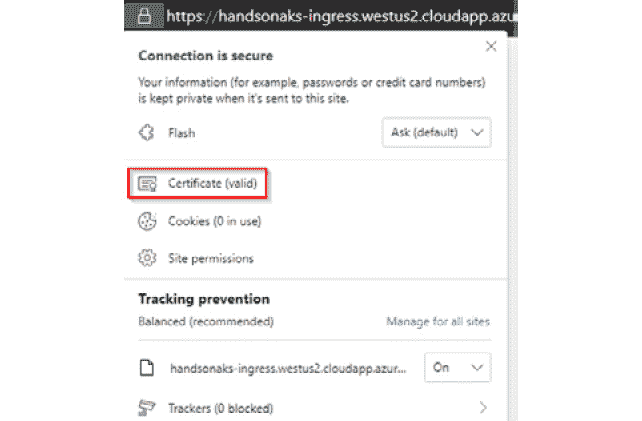

###### 图 6.16：显示有效证书的网页

在本节中，我们介绍了两个新概念：首先，我们为我们的留言板应用程序添加了一个 Ingress。我们首先在集群上设置了一个 Ingress 控制器，然后为我们的留言板应用程序设置了 Ingress。Ingress 允许在 Kubernetes 之上为应用程序进行高级路由和 HTTPS 卸载。之后，我们为我们的留言板应用程序添加了 HTTPS。我们不需要更改应用程序本身的源代码；通过配置我们的 Ingress，我们能够添加 HTTPS 支持。

在接下来的部分，我们将为我们的应用程序添加另一个安全层。我们将为我们的应用程序添加认证。在深入讨论之前，让我们首先讨论一下关于认证和授权的常见误解。

## 认证与授权

**认证**（**AuthN**）经常与**授权**（**AuthZ**）混淆。认证涉及身份（你是谁？），通常需要一个受信任的身份提供者。存在多个提供者，如 Azure AD、Okta 或 GitHub，甚至社交媒体平台如 Facebook、Google 或 Twitter 也可以用作提供者。授权涉及权限（你想做什么？），在应用程序资源需要受保护方面非常具体。

通常需要多次尝试才能理解两者之间的区别，即使这样，你仍然可能会在两者之间感到困惑。混淆的根源在于，在某些情况下，认证提供者和授权提供者是相同的。例如，在我们的 WordPress 示例中，WordPress 提供认证（它有用户名和密码）和授权（它将用户存储在管理员或用户角色下，例如）。

然而，在大多数情况下，身份验证系统和授权系统是不同的。我们将在*第十章*，*保护您的 AKS 集群*中使用一个实际的例子。在该章节中，我们将使用 Azure AD 作为身份验证源，同时使用 Kubernetes RBAC 作为授权源。

### 身份验证和常见的身份验证提供商

我们的留言板应用对所有人开放，并允许任何拥有公共 IP 的人访问该服务。图像本身没有身份验证。一个常见的问题是希望将附加功能与应用程序实现分开。这可以通过引入一个代理来实现，该代理将提供身份验证流量，而不是在主应用程序中引入身份验证逻辑。

最近的黑客攻击表明，自己建立和维护安全的身份验证系统是困难的。为了帮助客户构建安全的应用程序，许多公司允许您使用他们的身份验证服务来验证用户的身份。这些提供商提供了 OAuth 支持的身份验证服务。以下是一些知名的提供商：

+   **Azure** ([`github.com/pusher/oauth2_proxy#azure-auth-provider`](https://github.com/pusher/oauth2_proxy#azure-auth-provider))

+   **Facebook** ([`github.com/pusher/oauth2_proxy#facebook-auth-provider`](https://github.com/pusher/oauth2_proxy#facebook-auth-provider))

+   **GitHub** (https://github.com/pusher/oauth2_proxy#github-auth-provider)

+   **GitLab** (https://github.com/pusher/oauth2_proxy#gitlab-auth-provider)

+   **Google** (https://github.com/pusher/oauth2_proxy#google-auth-provider)

+   **LinkedIn** ([`github.com/pusher/oauth2_proxy#linkedin-auth-provider`](https://github.com/pusher/oauth2_proxy#linkedin-auth-provider))

在接下来的章节中，我们将使用代理实现`oauth2_proxy`来为我们的留言板示例实现身份验证。

### 部署 oauth2_proxy 代理

让我们从清理之前部署的 Ingress 开始。我们将保留集群中部署的证书颁发机构。我们可以使用以下方式清理 Ingress：

```
kubectl delete -f ingress-with-tls-prod.yaml
```

我们将实现来自 Pusher 的`oauth2_proxy` ([`github.com/pusher/oauth2_proxy`](https://github.com/pusher/oauth2_proxy))。按照以下步骤配置`oauth2_proxy`以使用 Azure AD 作为身份验证系统。

首先，在 Azure AD 中注册一个应用程序。通过在搜索栏中搜索`azure active directory`来打开门户中的 Azure AD 选项卡：

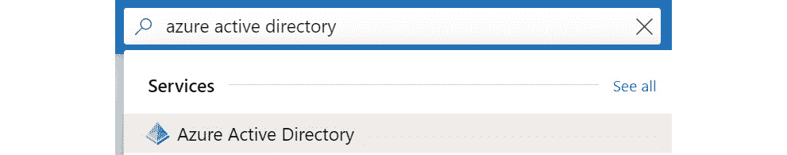

###### 图 6.17：在 Azure 搜索栏中搜索 Azure 活动目录

然后，转到**应用注册**并点击**新注册**：

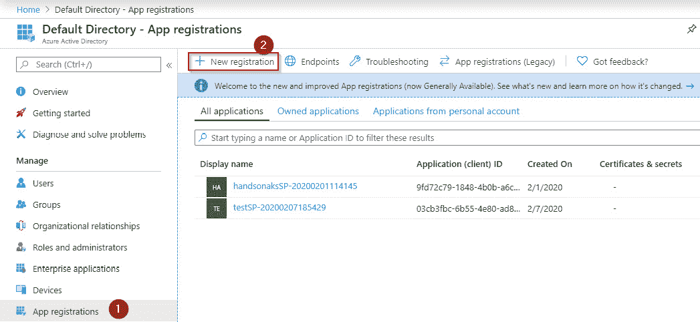

###### 图 6.18：创建新的应用程序注册

然后，为应用程序提供名称并点击**创建**：

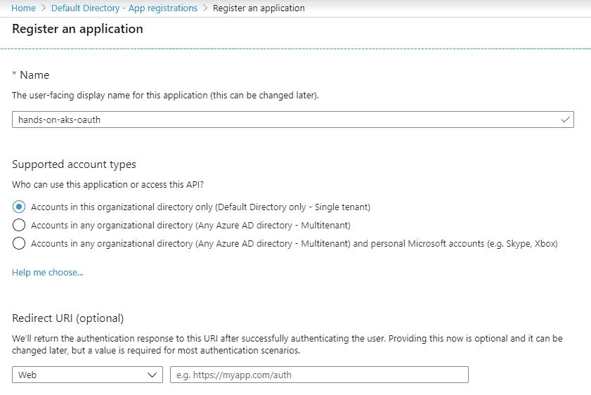

###### 图 6.19：为应用程序提供名称

接下来，通过以下步骤创建客户端 ID 密钥：

1.  选择**证书和密钥**，然后转到**新的客户端密钥**。为密钥提供描述并点击**添加**：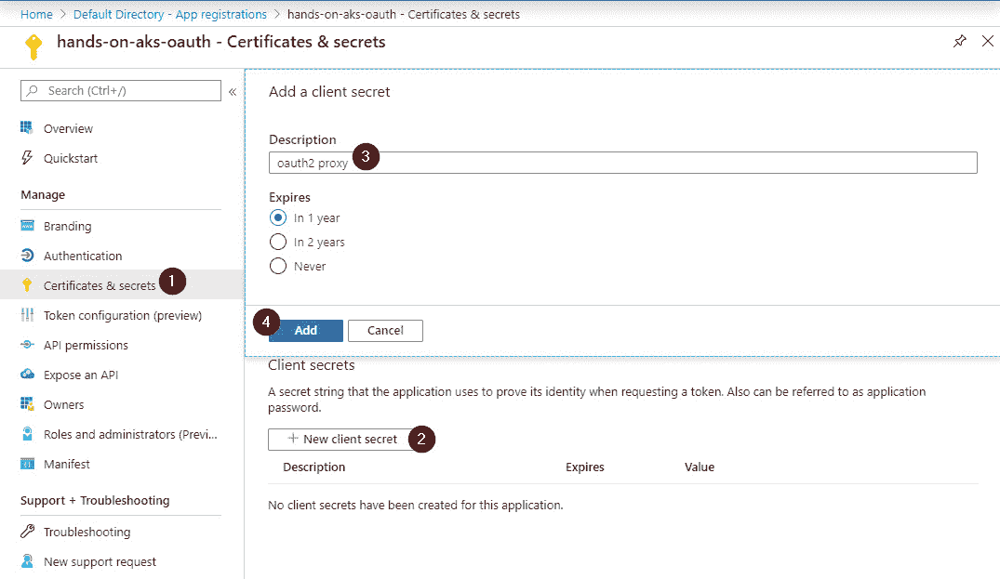

###### 图 6.20：创建新的客户端密钥

1.  点击复制图标并将密钥保存在安全的地方：

###### 图 6.21：复制客户端密钥

1.  接下来，我们需要配置重定向 URL。这是 Azure AD 在用户经过身份验证后将回调的 URL。要进行配置，请转到 Azure AD 的**身份验证**，点击**添加平台**，然后选择**Web**，如*图 6.22*所示：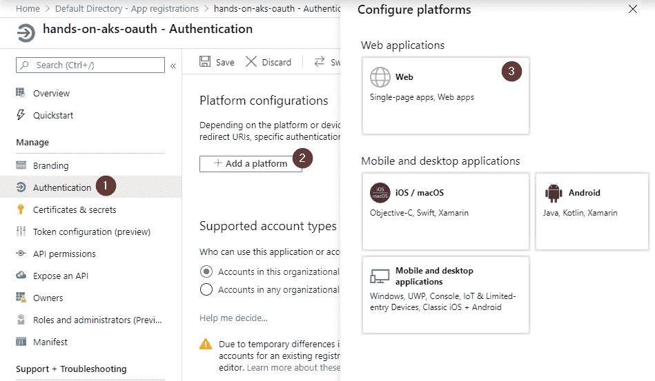

###### 图 6.22：提供重定向 URL

在那里，您可以输入以下 URL：

`https://<your dns prefix>.<your azure region>.cloudapp.azure.com/oauth2/callback`，然后点击**配置**。

1.  然后，返回**概述**窗格并保存**应用程序**和**目录 ID**：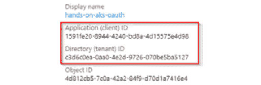

###### 图 6.23：复制应用程序 ID 和目录 ID

在创建客户端 ID 密钥、设置重定向 URL 和复制应用程序和目录 ID 之后，我们需要在 Kubernetes 中创建以下三个对象，以使`oauth2_proxy`在我们的集群上运行，并执行最后一步将 OAuth 链接到我们现有的 Ingress：

1.  首先，我们需要为`oauth2_proxy`创建一个部署。

1.  然后，我们需要将其公开为一个服务。

1.  之后，我们将为`oauth2`创建一个新的 Ingress。

1.  最后，我们将重新配置当前的 Ingress，以便将未经身份验证的请求发送到`oauth2_proxy`。

我们将执行所有三个步骤，并显示 YAML 文件如下：

1.  让我们从第一项开始 - 创建部署。 部署可以在源代码中找到`oauth2_deployment.yaml`文件：

```
1    apiVersion: extensions/v1beta1
2    kind: Deployment
3    metadata:
4      name: oauth2-proxy
5    spec:
6      replicas: 1
7      selector:
8        matchLabels:
9          app: oauth2-proxy
10     template:
11       metadata:
12         labels:
13           app: oauth2-proxy
14       spec:
15         containers:
16         - env:
17             - name: OAUTH2_PROXY_PROVIDER
18               value: azure
19             - name: OAUTH2_PROXY_AZURE_TENANT
20               value: <paste in directory ID>
21             - name: OAUTH2_PROXY_CLIENT_ID
22               value: <paste in application ID>
23             - name: OAUTH2_PROXY_CLIENT_SECRET
24               value: <paste in client secret>
25             - name: OAUTH2_PROXY_COOKIE_SECRET
26               value: somethingveryrandom
27             - name: OAUTH2_PROXY_HTTP_ADDRESS
28               value: "0.0.0.0:4180"
29             - name: OAUTH2_PROXY_UPSTREAM
30               value: "https://<your DNS prefix>.<your azure region>.cloudapp.azure.com/"
31             - name: OAUTH2_PROXY_EMAIL_DOMAINS
32               value: '*'
33           image: quay.io/pusher/oauth2_proxy:latest
34           imagePullPolicy: IfNotPresent
35           name: oauth2-proxy
36           ports:
37           - containerPort: 4180
38             protocol: TCP
```

这个部署有几行有趣的内容需要讨论。 我们在*第三章*的先前示例中讨论了其他行。 我们将在这里重点讨论以下行：

**第 17-18 行**：这些行告诉`oauth2`代理重定向到 Azure AD。

**第 19-32 行**：这是`oauth2`的配置。

**第 33 行**：这行指向正确的容器镜像。 这是我们第一次使用不是托管在 Docker Hub 上的镜像。 **Quay**是由 RedHat 托管的另一个容器存储库。

使用以下命令创建部署：

```
kubectl create -f oauth2_deployment.yaml
```

1.  接下来，`oauth2`需要被公开为一个服务，以便 Ingress 可以与其通信，通过创建以下服务（`oauth2_service.yaml`）：

```
1   apiVersion: v1
2   kind: Service
3   metadata:
4     name: oauth2-proxy
5     namespace: default
6   spec:
7     ports:
8     - name: http
9       port: 4180
10      protocol: TCP
11      targetPort: 4180
12    selector:
13      app: oauth2-proxy
```

使用以下命令创建此服务：

```
kubectl create oauth2_service.yaml
```

1.  接下来，我们将创建一个 Ingress，以便任何访问`handsonaks-ingress-<yourname>.<your azure region>.cloudapp.azure.com/oauth`的 URL 将被重定向到`oauth2-proxy`服务。 这里使用相同的 Let's Encrypt 证书颁发者（本章的源代码中的`oauth2_ingress.yaml`文件）：

```
1   apiVersion: extensions/v1beta1
2   kind: Ingress
3   metadata:
4     name: oauth2-proxy-ingress
5     annotations:
6       kubernetes.io/ingress.class: nginx
7       cert-manager.io/issuer: "letsencrypt-prod"
8   spec:
9     tls:
10     - hosts:
11       - <your DNS prefix>.<your azure region>.cloudapp.azure.com
12       secretName: tls-secret
13     rules:
14     - host: <your DNS prefix>.<your azure region>.cloudapp.azure.com
15       http:
16         paths:
17         - path: /oauth2
18           backend:
19             serviceName: oauth2-proxy
20             servicePort: 4180
```

在这个 Ingress 中有一行很有趣。 **第 17 行**引入了一个新的路径到我们的 Ingress。 正如本章前面提到的，同一个 Ingress 可以将多个路径指向不同的后端服务。 这就是我们在这里配置的内容。

使用以下命令创建此 Ingress：

```
kubectl create -f oauth2_ingress.yaml
```

1.  最后，我们将通过创建 Ingress 将`oauth2`代理链接到前端服务，以配置`nginx`，以便使用`auth-url`和`auth-signin`中的路径进行身份验证检查。如果请求未经身份验证，则流量将发送到`oauth2_proxy`。如果成功经过身份验证，则流量将重定向到后端服务（在我们的案例中是前端服务）。

在 GitHub 存储库中的以下代码执行身份验证成功后的重定向（`frontend-oauth2-ingress.yaml`）：

```
1  apiVersion: extensions/v1beta1
2  kind: Ingress
3  metadata:
4    name: frontend-oauth2-ingress
5    annotations:
6      kubernetes.io/ingress.class: nginx
7      nginx.ingress.kubernetes.io/auth-url: "http://oauth2-proxy.default.svc.cluster.local:4180/oauth2/auth"
8      nginx.ingress.kubernetes.io/auth-signin: "http://<your DNS prefix>.<your azure region>.cloudapp.azure.com/oauth2/start"
9  spec:
10   rules:
11   - host: <your DNS prefix>.<your azure region>.cloudapp.azure.com
12     http:
13       paths:
14       - path: /
15         backend:
16           serviceName: frontend
17           servicePort: 80 
```

在这个 Ingress 配置中有一些有趣的地方要指出。其他行与我们在本章中创建的其他 Ingress 一样普通：

第 5 行：如前所述，Ingress 对象可以由多种技术（如 NGINX 或应用程序网关）支持。 Ingress 对象具有配置基本任务的语法，例如`hosts`和`paths`，但例如没有配置身份验证重定向。注释由多个 Ingress 提供程序使用，以将详细配置数据传递给后端的 Ingress 提供程序。

第 7-8 行：这将配置我们的 Ingress 将非经过身份验证的请求发送到这些 URL。

使用以下命令创建此 Ingress：

```
kubectl create -f frontend-oauth2-ingress.yaml
```

我们现在已经完成了配置。您现在可以使用现有的 Microsoft 帐户登录到`https://handsonaks-ingress-<yourname>.<your azure region>.cloudapp.azure.net/`的服务。为了确保您获得身份验证重定向，请确保使用新的浏览器窗口或私人窗口。您应该会自动重定向到 Azure AD 的登录页面。

#### 注意

`oauth2-proxy`支持多个身份验证提供程序，例如 GitHub 和 Google。只需更改`oauth2-proxy`部署的 YAML 以使用正确的服务更改身份验证提供程序。请参阅 https://github.com/pusher/oauth2_proxy#oauth-provider-configuration 中的相关详细信息。

现在一切都已部署完成，让我们清理一下我们在集群中创建的资源：

```
kubectl delete -f guestbook-all-in-one.yaml
kubectl delete -f frontend-oauth2-ingress.yaml
kubectl delete -f oauth2_ingress.yaml
kubectl delete -f oauth2_deployment.yaml
kubectl delete -f oauth2_service.yaml
kubectl delete ns cert-manager
helm delete ingress
```

在本节中，我们已将 Azure AD 身份验证添加到您的应用程序。我们通过将`oauth2_proxy`添加到我们的集群，然后重新配置现有的 Ingress 以将未经身份验证的请求重定向到`oauth2_proxy`来实现这一点。

## 摘要

在本章中，我们在不实际更改源代码的情况下，为我们的留言板应用程序添加了 HTTPS 安全性和身份控制。我们首先在集群中设置了 Kubernetes Ingress 对象。然后，我们安装了一个证书管理器，该管理器与 Let's Encrypt API 接口，以请求指定的域名的证书。我们利用证书签发者从 Let's Encrypt 获取了证书。然后，我们重新配置了我们的 Ingress，以从集群中的签发者请求证书。

然后，我们深入探讨了身份验证和授权，并向您展示了如何利用 Azure AD 作为留言板应用程序的身份验证提供者。您将学习如何在企业规模上保护您的应用程序。通过与 Azure AD 集成，您可以使任何应用程序连接到组织的 AD。

在下一章中，您将学习如何监视您的部署并设置警报。您还将学习如何在发生错误时快速识别根本原因，并学习如何调试在 AKS 上运行的应用程序。与此同时，您还将学习如何在确定了根本原因后执行正确的修复操作。
