# 第七章：监视 AKS 集群和应用程序

现在您已经知道如何在 AKS 集群上部署应用程序，让我们专注于如何确保您的集群和应用程序保持可用。在本章中，您将学习如何监视您的集群以及运行在其中的应用程序。您将探索 Kubernetes 如何通过就绪和存活探针确保您的应用程序可靠运行。

您还将学习如何使用**Azure Monitor**，以及它如何在 Azure 门户中集成，以及如何为 AKS 集群上的关键事件设置警报。您将了解如何使用 Azure Monitor 监视集群本身的状态，集群上的 Pod 以及以规模访问 Pod 的日志。

简而言之，本章将涵盖以下主题：

+   使用`kubectl`监视和调试应用程序

+   审查 Kubernetes 报告的指标

+   审查来自 Azure Monitor 的指标

让我们从回顾一些`kubectl`中的命令开始，您可以使用这些命令来监视您的应用程序。

## 用于监视应用程序的命令

监控部署在 Kubernetes 上的应用程序的健康状况以及 Kubernetes 基础架构本身对于向客户提供可靠的服务至关重要。监控有两个主要用例：

+   持续监控以获取警报，如果某些情况表现不如预期

+   故障排除和调试应用程序错误

在监视运行在 Kubernetes 集群之上的应用程序时，您需要同时检查多个内容，包括容器、Pod、服务以及集群中的节点。对于持续监控，您将需要像 Azure Monitor 或 Prometheus 这样的监控系统。对于故障排除，您将需要与实时集群进行交互。用于故障排除的最常用命令如下：

[PRE0]

我们将在本章中详细描述每个命令。

在开始之前，我们将使用我们的 guestbook 示例进行清洁启动。再次使用以下命令重新创建 guestbook 示例：

[PRE1]

在`create`命令运行时，我们将在以下章节中观察其进展。

### kubectl get 命令

为了查看部署应用程序的整体情况，`kubectl`提供了`get`命令。`get`命令列出您指定的资源。资源可以是 Pods、ReplicaSets、Ingresses、节点、部署、Secrets 等等。我们已经在前几章中运行了这个命令，以验证我们的应用程序已经准备好使用。执行以下步骤：

1.  运行以下`get`命令，这将获取我们资源及其状态：

[PRE2]

这将显示您的命名空间中的所有部署、ReplicaSets、Pods 和服务：

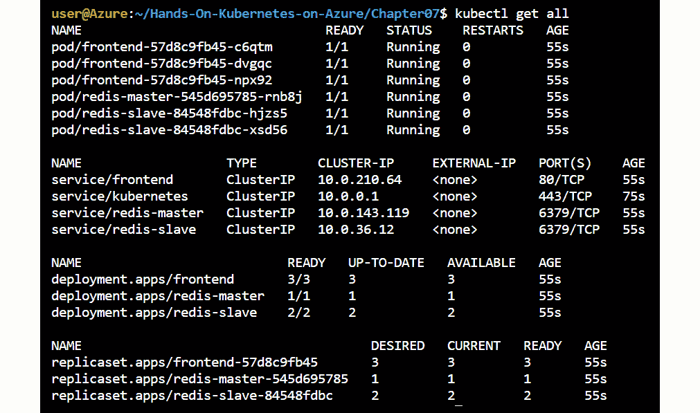

###### 图 7.1：默认命名空间中运行的所有资源

1.  让我们把注意力集中在我们部署中的 Pods 上。我们可以使用以下命令获取 Pods 的状态：

[PRE3]

您将看到，现在只显示了 Pods，就像*图 7.2*中所示。让我们详细调查一下：

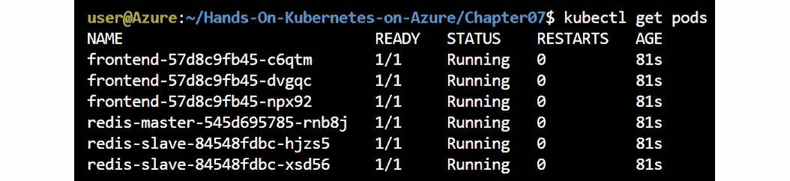

###### 图 7.2：您的命名空间中的所有 Pods

第一列表示 Pod 名称，例如`frontend-57d8c9fb45-c6qtm`。第二列表示 Pod 中准备好的容器数量与 Pod 中的总容器数量。通过 Kubernetes 中的就绪探针来定义就绪状态。我们在本章的后面有一个专门的部分叫做*就绪和存活探针*。

第三列表示状态，例如`Pending`或`ContainerCreating`或`Running`等等。第四列表示重启次数，而第五列表示 Pod 被要求创建的时间。

如果您需要更多关于您的 Pod 的信息，您可以通过在命令中添加`-o wide`来添加额外的列到`get`命令的输出中，就像这样：

[PRE4]

这将显示额外的信息，就像*图 7.3*中所示：

###### 图 7.3：添加-o wide 显示了 Pod 的更多细节

额外的列包括 Pod 的 IP 地址、它所在的节点、被提名的节点和就绪门。只有当高优先级的 Pod 抢占低优先级的 Pod 时，才会设置被提名的节点。被提名的节点是高优先级 Pod 在低优先级 Pod 优雅终止后将启动的节点。就绪门是引入外部系统组件作为 Pod 就绪的一种方式。

执行`get pods`命令只显示当前 Pod 的状态。要查看系统中所有资源的事件，请运行以下命令：

[PRE5]

#### 注意

Kubernetes 默认只保留 1 小时的事件。所有命令只在事件在过去一小时内触发时有效。

如果一切顺利，您应该会得到类似于*图 7.4*的输出：

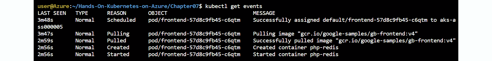

###### 图 7.4：获取事件显示过去一小时的所有事件

如您在输出中所见，Pod 的一般状态为`Scheduled` | `Pulling` | `Pulled` | `Created` | `Started`。接下来我们将看到，任何状态都可能失败，我们需要使用`kubectl describe`命令进行深入挖掘。

### kubectl describe 命令

使用`kubectl get events`命令列出整个命名空间的所有事件。如果您只对 Pod 感兴趣，可以使用以下命令：

[PRE6]

上述命令列出了所有与所有 Pod 相关的信息。这通常是典型 shell 无法包含的太多信息。

如果您想要特定 Pod 的信息，可以输入以下内容：

[PRE7]

#### 注意

您可以在`pod`和`podname`之间使用*斜杠*或*空格*。以下两个命令将产生相同的输出：

`kubectl describe pod/<pod-name>`

`kubectl describe pod <pod-name>`

您将得到类似于*图 7.5*的输出，稍后将对其进行详细解释。

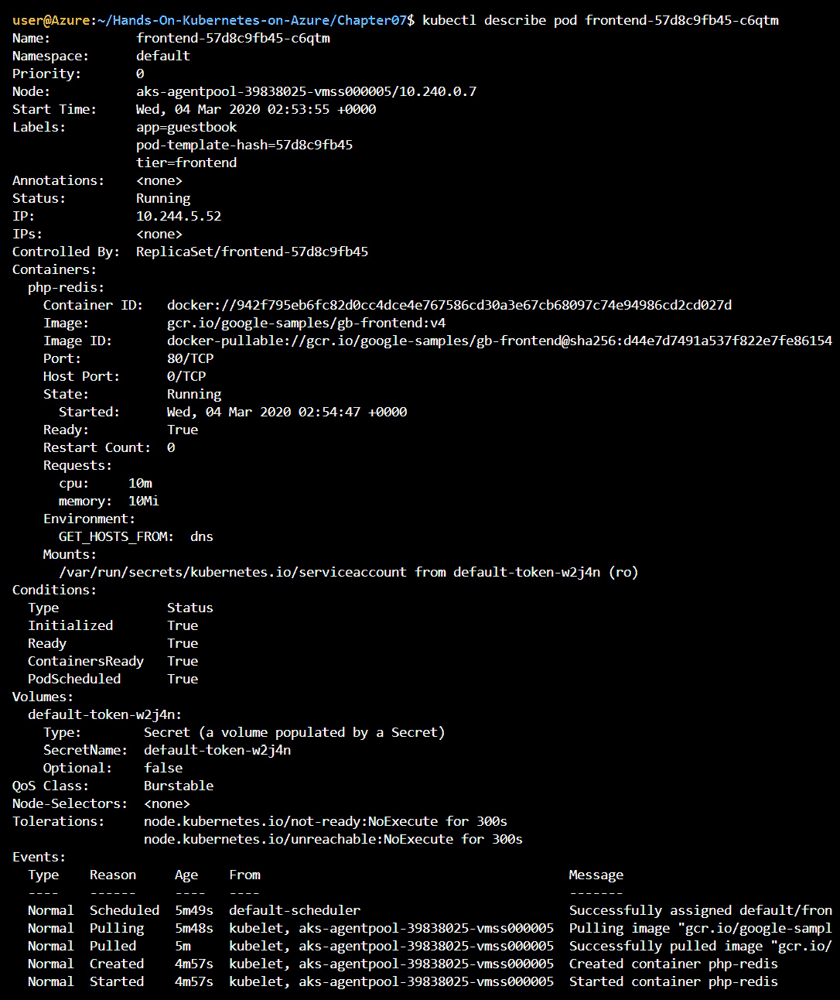

###### 图 7.5：描述对象显示该对象的详细输出

通过描述，您可以获得 Pod 所在的节点、它运行了多长时间、它的内部 IP 地址、Docker 镜像名称、暴露的端口、`env`变量和事件（在过去一小时内）。

在上面的示例中，Pod 的名称是`frontend-57d8c9fb45-c6qtm`。如*第一章《Docker 和 Kubernetes 简介》*中所述，它采用了“<ReplicaSet 名称>-<随机 5 个字符>”的格式。`replicaset`名称本身是从部署名称`frontend`随机生成的：`<deployment 名称>-<随机 5 个字符>`。

*图 7.6*显示了部署、副本集和 Pod 之间的关系：

###### 图 7.6：部署、副本集和 Pod 之间的关系

Pod 运行的命名空间是`default`。到目前为止，我们一直在使用名为`default`的`default`命名空间。在接下来的章节中，我们将看到命名空间如何帮助我们隔离 Pod。

前面输出中重要的另一部分是节点部分：

[PRE8]

节点部分让我们知道 Pod 正在哪个物理节点/虚拟机上运行。如果 Pod 反复重启或出现运行问题，而其他一切似乎正常，可能是节点出现了问题。拥有这些信息对于进行高级调试至关重要。

以下是 Pod 最初被调度的时间：

[PRE9]

这并不意味着 Pod 从那时起一直在运行，因此时间在这方面可能会误导。如果发生健康事件（例如，容器崩溃），Pod 将被重新启动。

资源之间的连接是使用“标签”进行的，如下所示：

[PRE10]

这就是如何建立`Service` | `Deployment` | `ReplicaSet` | `Pod`等连接的。如果发现流量没有从 Service 路由到 Pod，这是您应该检查的第一件事。如果标签不匹配，资源将无法连接。

以下显示了 Pod 的内部 IP 和其状态：

[PRE11]

如前几章所述，构建应用程序时，Pod 可以移动到不同的节点并获得不同的 IP。然而，在调试应用程序问题时，直接获得 Pod 的 IP 可以帮助进行故障排除。您可以直接从一个 Pod 连接到另一个 Pod 以测试连接性，而不是通过 Service 对象连接到应用程序。

在 Pod 中运行的容器和暴露的端口列在以下区块中：

[PRE12]

在这种情况下，我们从`gcr.io`容器注册表中获取带有`v4`标签的`gb-frontend`容器，仓库名称为`google-samples`。

端口`80`对外部流量开放。由于每个 Pod 都有自己的 IP，即使在同一主机上运行时，相同的端口也可以为同一 Pod 的多个实例开放。例如，如果您在同一节点上运行两个运行 Web 服务器的 Pod，这两个 Pod 都可以使用端口`80`，因为每个 Pod 都有自己的 IP 地址。这是一个巨大的管理优势，因为您不必担心端口冲突。需要配置的端口也是固定的，因此可以简单地编写脚本，而无需考虑为 Pod 分配了哪个端口的逻辑。

在此处显示了上一个小时发生的任何事件：

[PRE13]

使用`kubectl describe`非常有用，可以获取有关正在运行的资源的更多上下文。在下一节中，我们将专注于调试应用程序。

### 调试应用程序

现在我们对如何监视部署有了基本的了解，我们可以开始看看如何调试部署中的问题。

在本节中，我们将介绍常见错误并确定如何调试和修复它们。

如果您尚未实现 guestbook 应用程序，请运行以下命令：

[PRE14]

一段时间后，服务应该已经启动并运行。

**图像拉取错误**

在本节中，我们将通过将图像标记值设置为不存在的值来介绍图像拉取错误。当 Kubernetes 无法下载容器所需的图像时，就会发生图像拉取错误。

在 Azure Cloud Shell 上运行以下命令：

[PRE15]

接下来，通过执行以下步骤将图像标记从`v4`更改为`v_non_existent`：

1.  键入`/gb-frontend`并按*Enter*按钮，将光标移到图像定义处。

1.  按下*I*键进入插入模式。删除`v4`并输入`v_non_existent`。

1.  现在，首先按下*Esc*键关闭编辑器，然后输入`:wq!`并按*Enter*键。

运行以下命令列出当前命名空间中的所有 Pod：

[PRE16]

前面的命令应该指示错误，如*图 7.7*所示：

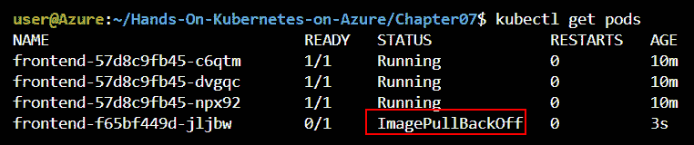

###### 图 7.7：一个 Pod 的状态为 ImagePullBackOff

运行以下命令以获取完整的错误详细信息：

[PRE17]

*图 7.8*显示了一个示例错误输出。关键错误行用红色突出显示：

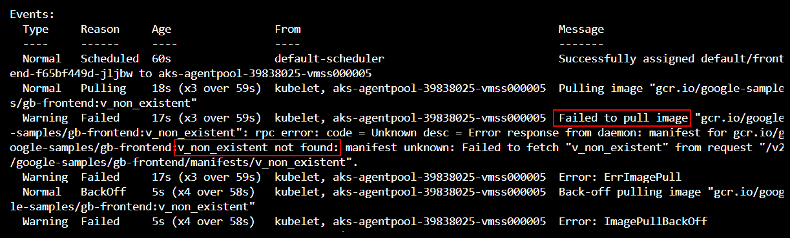

###### 图 7.8：使用 describe 显示错误的更多详细信息

因此，事件清楚地显示图像不存在。将无效凭据传递给私有 Docker 存储库也会在此处显示。

让我们通过将图像标签设置回`v4`来修复错误：

1.  首先，在 Cloud Shell 中键入以下命令以编辑部署：

[PRE18]

1.  键入`/gb-frontend`并按`<enter>`将光标移到图像定义处。

1.  按下*I*键进入插入模式。删除`v_non_existent`，然后输入`v4`。

1.  现在，首先按下*Esc*键关闭编辑器，然后输入`:wq!`并按*Enter*键。

部署应该会自动修复。您可以通过再次获取 Pod 的事件来验证它。

#### 注意

由于 Kubernetes 进行了滚动更新，前端一直可用，没有任何停机时间。Kubernetes 识别出新规范存在问题，并停止自动滚动出额外的更改。

图像拉取错误可能发生在图像不可用时。在下一节中，我们将探索应用程序本身的错误。

**应用程序错误**

我们现在将看到如何调试应用程序错误。本节中的错误将是自我引起的，类似于上一节。调试问题的方法与我们用于调试运行应用程序的方法相同。

为了测试我们的失败，我们将使`frontend`服务可以公开访问：

1.  首先，我们将编辑`frontend`服务：

[PRE19]

1.  键入`/ClusterIP`并按*Enter*将光标移到类型字段（第 27 行）。

1.  按下*I*键进入插入模式。删除`ClusterIP`，然后输入`LoadBalancer`。

1.  现在，首先按下*Esc*键关闭编辑器，然后输入`:wq!`并按*Enter*。这将为我们的前端服务创建一个公共 IP。

1.  我们可以使用以下命令获取此 IP：

[PRE20]

1.  让我们通过在浏览器中粘贴其公共 IP 来连接到服务。创建一些条目：

###### 图 7.9：在留言板应用程序中进行一些条目

#### 注意

大多数错误来自错误配置，可以通过编辑规范来修复。应用程序代码本身的错误需要构建和使用新的映像。

您现在有一个运行中的 guestbook 应用程序实例。为了改善示例的体验，我们将缩减前端，以便只有一个副本在运行。

**缩减前端**

在*第三章*，*在 AKS 上部署应用程序*中，您学习了前端部署的配置为`replicas=3`。这意味着应用程序接收的请求可以由任何一个 Pod 处理。要引入应用程序错误并注意错误，我们需要对所有三个 Pod 进行更改。

为了使这个示例更容易，将`replicas`缩减到`1`，这样您只需要对一个 Pod 进行更改：

[PRE21]

只运行一个副本将使引入错误变得更容易。现在让我们引入这个错误。

**引入应用程序错误**

在这种情况下，我们将使**提交**按钮无法工作。我们需要修改应用程序代码。

#### 注意

不建议使用`kubectl exec`对 Pod 执行命令来对应用程序进行生产更改。如果需要对应用程序进行更改，最好的方法是创建新的容器映像并更新部署。

我们将使用`kubectl exec`命令。此命令允许您在该 Pod 的命令行上运行命令。使用`-it`选项，它会将交互式终端附加到 Pod，并为我们提供一个可以运行命令的 shell。以下命令在 Pod 上启动 Bash 终端：

[PRE22]

一旦您进入容器 shell，运行以下命令：

[PRE23]

上述代码安装了 vim 编辑器，以便我们可以编辑文件引入错误。现在，使用`vim`打开`guestbook.php`文件：

[PRE24]

在第 18 行后添加以下行。记住，在 vim 中插入一行，您按*I*键。编辑完成后，您可以通过按*Esc*退出，然后输入`:wq!`，然后按*Enter*：

[PRE25]

文件将看起来像*图 7.10*：

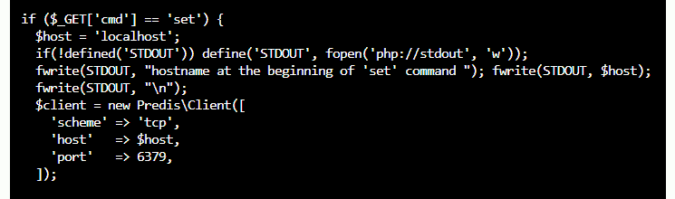

###### 图 7.10：引入错误和额外日志的更新代码

我们引入了一个错误，即读取消息可以工作，但写入消息却不行。我们通过要求前端连接到不存在的本地主机的 Redis 主服务器来实现这一点。写入应该失败。与此同时，为了使这个演示更加直观，我们在代码的这一部分添加了一些额外的日志记录。

通过浏览其公共 IP 打开您的留言板应用程序，您应该可以看到之前的条目：

###### 图 7.11：之前的条目仍然存在

现在，通过输入一条消息并点击**提交**按钮来创建一条新消息：

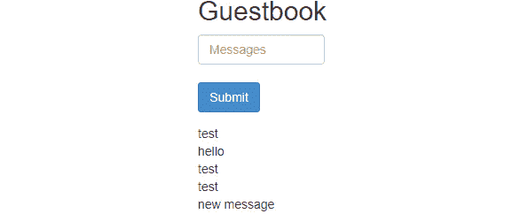

###### 图 7.12：创建了一条新消息

提交新消息会使其出现在我们的应用程序中。如果我们不知道更好的方法，我们可能会认为该条目已经安全地被写入。然而，如果您刷新浏览器，您会发现消息不再存在。

如果您在浏览器中打开了网络调试工具，您可以捕获服务器的错误响应。

为了验证消息没有被写入数据库，点击浏览器中的**刷新**按钮；您将只看到最初的条目，新条目已经消失：

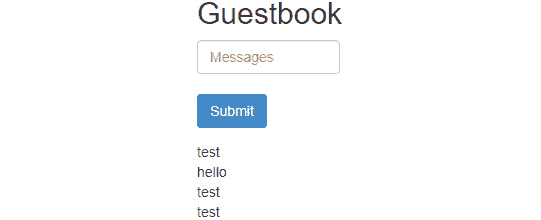

###### 图 7.13：新消息已经消失了

作为应用程序开发人员或操作员，您可能会收到这样的工单：*在新部署后，新条目没有被持久化。修复它。*

### 日志

第一步是获取日志。现在让我们暂时退出前端 Pod 并获取该 Pod 的日志：

[PRE26]

您将看到诸如*图 7.14*中所见的条目：

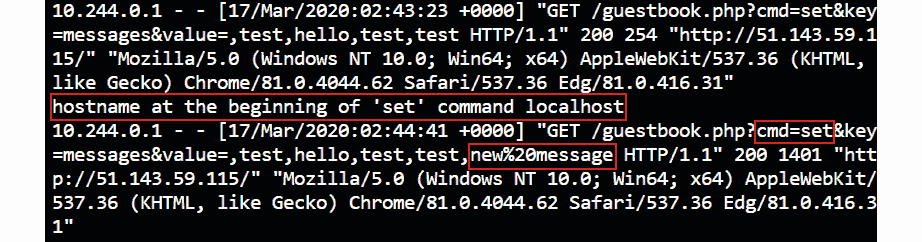

###### 图 7.14：新消息显示在应用程序日志中

因此，您知道错误出现在代码的`set`部分写入数据库时。

您将看到这个条目：

[PRE27]

所以我们知道错误发生在这一行和客户端开始之间，所以`$host = 'localhost'`的设置必须是错误的原因。这种错误并不像你想象的那样罕见，正如我们刚才看到的，除非有特定的指示刷新浏览器，否则它很容易通过 QA。对于开发人员来说，它可能完全正常工作，因为他们可能在本地机器上运行着一个 Redis 服务器。

我们现在有两种选项来修复这个错误：我们可以进入 Pod 并进行代码更改，或者我们可以要求 Kubernetes 为我们提供一个健康的新 Pod。不建议对 Pod 进行手动更改，所以我们将使用第二种方法。让我们通过删除有问题的 Pod 来修复这个错误：

[PRE28]

由于我们有一个控制我们的 Pod 的 ReplicaSet，我们应该立即获得一个已经从正确的镜像启动的新 Pod。尝试再次连接到 guestbook 并验证消息是否再次在浏览器刷新时保留。

以下几点总结了一些常见的错误和修复这些错误的方法：

+   错误可以呈现多种形式。

+   部署团队遇到的大多数错误都是配置问题。

+   日志是你的朋友。

+   在容器上使用`kubectl exec`是一个有用的调试工具。

+   请注意，广泛允许`kubectl exec`是一个严重的安全风险，因为它几乎让 Kubernetes 操作员在他们可以访问的 Pod 中做任何他们想做的事情。

+   任何打印到`stdout`和`stderr`的内容都会显示在日志中（与应用程序/语言/日志框架无关）。

我们在 guestbook 应用程序中引入了一个应用程序错误，并且能够利用 Kubernetes 日志来准确定位代码中的问题。在下一节中，我们将探讨 Kubernetes 中一个强大的机制，称为*就绪和活跃探针*。

## 就绪和活跃探针

我们在上一节中简要提到了就绪探针。在本节中，我们将更深入地探讨它们。

Kubernetes 使用活跃探针和就绪探针来监视应用程序的可用性。每个探针都有不同的目的：

+   **活跃探针**在应用程序运行时监视可用性。如果活跃探针失败，Kubernetes 将重新启动您的 Pod。这对于捕获死锁、无限循环或者只是“卡住”的应用程序可能非常有用。

+   一个**就绪探针**监视应用程序何时变得可用。如果就绪探针失败，Kubernetes 将不会向未准备好的 Pod 发送任何流量。如果您的应用程序在变得可用之前必须经过一些配置，或者如果您的应用程序可能会过载但可以从额外的负载中恢复，这将非常有用。

活跃和就绪探针不需要从应用程序的同一端点提供服务。如果您有一个智能应用程序，该应用程序可以在仍然健康的情况下将自身从轮换中移出（意味着不再向应用程序发送流量）。为了实现这一点，就绪探针将失败，但活跃探针仍然保持活动状态。

让我们通过一个例子来构建这个部署。我们将创建两个 nginx 部署，每个部署都有一个索引页面和一个健康页面。索引页面将作为活跃探针。

### 构建两个 web 容器

在这个例子中，我们将使用一对网页来连接到我们的就绪和活跃探针。让我们首先创建`index1.html`：

[PRE29]

之后，创建`index2.html`：

[PRE30]

我们还将创建一个健康页面，`healthy.html`：

[PRE31]

在下一步中，我们将把这些文件挂载到我们的 Kubernetes 部署中。我们将把每个文件都转换成一个`configmap`，然后连接到我们的 Pods。使用以下命令创建 configmap：

[PRE32]

搞定了这些，我们可以继续创建我们的两个 web 部署。两者将非常相似，只是`configmap`不同。第一个部署文件（`webdeploy1.yaml`）如下所示：

[PRE33]

在这个部署中有一些要强调的事项：

+   第 23-28 行：这是活跃探针。活跃探针指向健康页面。请记住，如果健康页面失败，容器将被重新启动。

+   第 29-32 行：这是就绪探针。在我们的情况下，就绪探针指向索引页面。如果此页面失败，Pod 将暂时不会收到任何流量，但将继续运行。

+   第 44-45 行：这两行包含一对在容器启动时执行的命令。我们不仅仅运行 nginx 服务器，而是将索引和就绪文件复制到正确的位置，然后启动 nginx，然后使用一个睡眠命令（这样我们的容器就会继续运行）。

您可以使用以下命令创建此部署。您还可以部署类似于服务器 1 的第二个版本，用于服务器 2：

[PRE34]

最后，我们还将创建一个服务，将流量路由到两个部署（`webservice.yaml`）：

[PRE35]

我们可以使用以下命令创建该服务：

[PRE36]

我们现在的应用程序已经启动运行。在接下来的部分，我们将引入一些故障来验证活跃性和就绪探针的行为。

### 尝试活跃性和就绪探针

在前一部分中，我们解释了活跃性和就绪探针的功能，并创建了一个示例应用程序。在本节中，我们将在应用程序中引入错误，并验证活跃性和就绪探针的行为。我们将看到就绪探针的失败将导致 Pod 保持运行，但不再接受流量。之后，我们将看到活跃性探针的失败将导致 Pod 被重新启动。

让我们首先尝试使就绪探针失败。

**使就绪探针失败会导致流量暂时停止**

现在我们有一个简单的应用程序正在运行，我们可以尝试活跃性和就绪探针的行为。首先，让我们获取服务的外部 IP 以便使用浏览器连接到我们的 Web 服务器：

[PRE37]

如果您在浏览器中输入外部 IP，您应该看到一个单行，上面要么写着**服务器 1**，要么写着**服务器 2**：

###### 图 7.15：我们的应用程序正在从服务器 2 返回流量

在我们的测试中，我们将使用一个名为`testWeb.sh`的小脚本连接到我们的网页 50 次，这样我们就可以监视服务器 1 和 2 之间结果的良好分布。我们首先需要使该脚本可执行，然后我们可以在我们的部署完全健康的情况下运行该脚本：

[PRE38]

在健康运行期间，我们可以看到服务器 1 和服务器 2 几乎被同等命中，服务器 1 有 24 次命中，服务器 2 有 26 次命中：

###### 图 7.16：当应用程序健康时，流量在服务器 1 和服务器 2 之间进行负载平衡

现在让我们继续并使服务器 1 的就绪探针失败。为此，我们将`exec`进入容器并将索引文件移动到另一个位置：

[PRE39]

一旦执行了这个，我们可以用以下命令查看 Pod 状态的变化：

[PRE40]

您应该看到服务器 1 Pod 的就绪状态更改为`0/1`，如*图 7.17*所示：

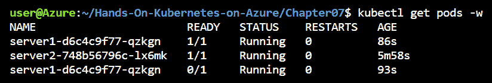

###### 图 7.17：失败的就绪探针导致服务器 1 没有任何 READY 容器

这应该不再将流量定向到服务器 1 的 Pod。让我们验证一下：

[PRE41]

在我们的情况下，流量确实被重定向到了服务器 2：

###### 图 7.18：现在所有流量都由服务器 2 提供

现在我们可以通过将文件移回到其正确位置来恢复服务器 1 的状态：

[PRE42]

这将使我们的 Pod 恢复到健康状态，并应该再次平均分配流量：

[PRE43]

这将显示类似于*图 7.19*的输出：

###### 图 7.19：恢复就绪探针会导致流量再次进行负载均衡

失败的就绪探针将导致 Kubernetes 不再向失败的 Pod 发送流量。我们通过使示例应用程序中的就绪探针失败来验证了这一点。在下一节中，我们将探讨失败的活跃探针的影响。

**失败的活跃探针导致容器重新启动**

我们也可以使用活跃探针重复之前的过程。当活跃探针失败时，我们期望 Kubernetes 会继续重启我们的 Pod。让我们尝试通过删除健康文件来实现这一点：

[PRE44]

让我们看看这对我们的 Pod 有什么影响：

[PRE45]

我们应该看到 Pod 在几秒钟内重新启动：

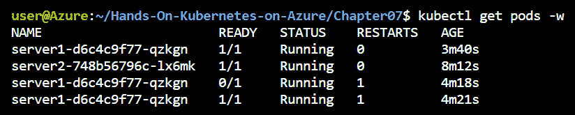

###### 图 7.20：失败的活跃探针将导致 Pod 重新启动

正如您在*图 7.20*中所看到的，Pod 已成功重新启动，影响有限。我们可以通过运行`describe`命令来检查 Pod 中发生了什么：

[PRE46]

上述命令将给出类似于*图 7.21*的输出：

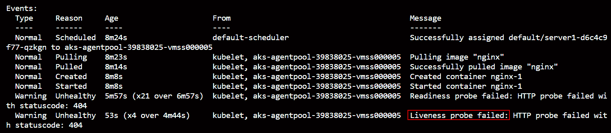

###### 图 7.21：有关 Pod 的更多详细信息，显示了活跃探针的失败情况

在`describe`命令中，我们可以清楚地看到 Pod 未通过活跃探针。在四次失败后，容器被终止并重新启动。

这结束了我们对活跃性和就绪性探针的实验。请记住，这两者对您的应用程序都很有用：就绪性探针可用于暂时停止流量到您的 Pod，以便它承受更少的负载。活跃性探针用于在 Pod 出现实际故障时重新启动 Pod。

让我们也确保清理我们刚刚创建的部署：

[PRE47]

活跃性和就绪性探针对确保只有健康的 Pod 会在您的集群中接收流量很有用。在下一节中，我们将探索 Kubernetes 报告的不同指标，您可以使用这些指标来验证应用程序的状态。

## Kubernetes 报告的指标

Kubernetes 报告多个指标。在本节中，我们首先将使用一些 kubectl 命令来获取这些指标。之后，我们将研究 Azure 容器监视器，看看 Azure 如何帮助容器监视。

### 节点状态和消耗

您的 Kubernetes 中的节点是运行应用程序的服务器。Kubernetes 将 Pod 调度到集群中的不同节点。您需要监视节点的状态，以确保节点本身健康，并且节点有足够的资源来运行新应用程序。

运行以下命令以获取有关集群上节点的信息：

[PRE48]

上述命令列出它们的名称、状态和年龄：

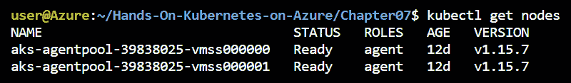

###### 图 7.22：此集群中有两个节点

您可以通过传递`-o` wide 选项来获取更多信息：

[PRE49]

输出列出了底层的`OS-IMAGE`和`INTERNAL-IP`，以及其他有用的信息，可以在*图 7.23*中查看。

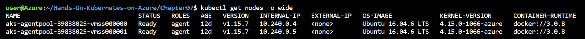

###### 图 7.23：使用-o wide 可以添加关于我们节点的更多细节

您可以使用以下命令找出哪些节点消耗了最多的资源：

[PRE50]

它显示了节点的 CPU 和内存使用情况：

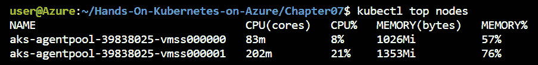

###### 图 7.24：节点的 CPU 和内存利用率

请注意，这是那一时刻的实际消耗，而不是某个节点的请求数。要获取请求数，您可以执行：

[PRE51]

这将向您显示每个 Pod 的请求和限制，以及整个节点的累积量：

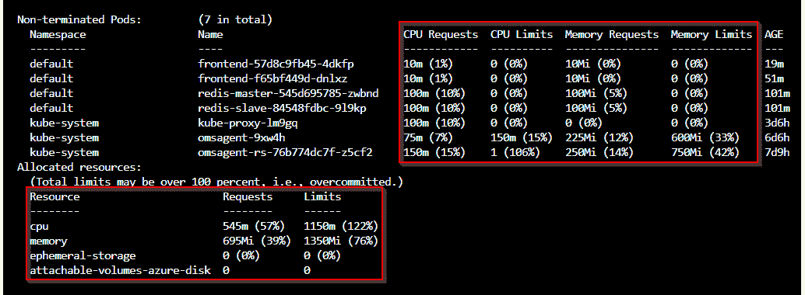

###### 图 7.25：描述节点显示有关请求和限制的详细信息

现在您知道在哪里可以找到有关节点利用率的信息。在下一节中，我们将探讨如何获取单个 Pod 的相同指标。

### Pod 消耗

Pods 从 AKS 集群中消耗 CPU 和内存资源。请求和限制用于配置 Pod 可以消耗多少 CPU 和内存。请求用于保留最小数量的 CPU 和内存，而限制用于设置每个 Pod 的最大 CPU 和内存量。

在本节中，我们将探讨如何使用`kubectl`获取有关 Pod 的 CPU 和内存利用率的信息。

让我们首先探索如何查看当前正在运行的 Pod 的请求和限制：

1.  在这个例子中，我们将使用在`kube-system`命名空间中运行的 Pods。获取此命名空间中的所有 Pods：

[PRE52]

这应该显示类似于*图 7.26*的内容：

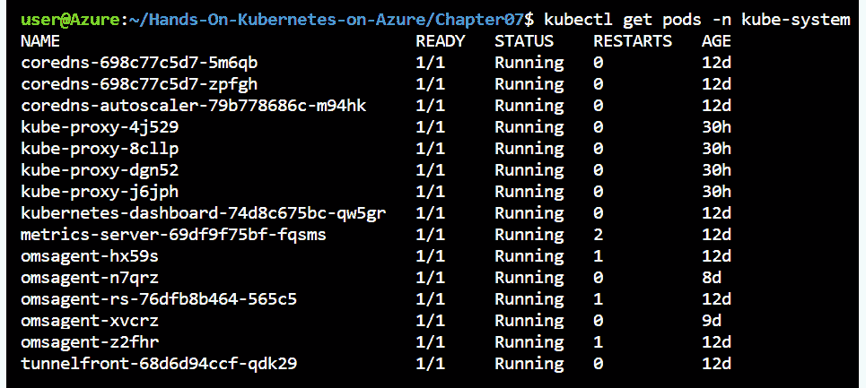

###### 图 7.26：在 kube-system 命名空间中运行的 Pods

1.  让我们获取`coredns` Pods 之一的请求和限制。可以使用`describe`命令来完成：

[PRE53]

在`describe`命令中，应该有一个类似于*图 7.27*的部分：

###### 图 7.27：CoreDNS Pod 的限制和请求

这向我们显示，此 Pod 的内存限制为`170Mi`，没有 CPU 限制，并且请求了 100m CPU（即 0.1 CPU）和`70Mi`内存。

请求和限制用于在集群中执行容量管理。我们还可以通过运行以下命令获取 Pod 的实际 CPU 和内存消耗：

[PRE54]

这应该向您显示类似于*图 7.28*的输出：

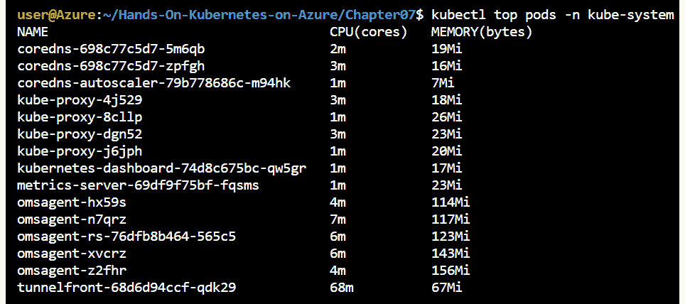

###### 图 7.28：查看 Pod 的 CPU 和内存消耗

使用 kubectl top 命令显示了命令运行时的 CPU 和内存消耗。在这种情况下，我们可以看到 coredns Pods 正在使用 2m 和 3m 的 CPU，并且正在使用 21Mi 和 17Mi 的内存。

在本节中，我们一直在使用 kubectl 命令来了解集群中节点和 Pods 的资源利用情况。这是有用的信息，但仅限于特定时间点。在下一节中，我们将使用 Azure Monitor 来获取有关集群和集群上应用程序的更详细信息。

## 来自 Azure Monitor 的报告指标

Azure 门户显示了许多指标，您希望将其与授权结合在一起，因为只有具有门户访问权限的人员才能查看这些指标。

### AKS Insights

AKS 刀片的 Insights 部分提供了您需要了解有关集群的大多数指标。它还具有深入到容器级别的能力。您还可以查看容器的日志。

Kubernetes 提供了可用的指标，但不会存储它们。Azure Monitor 可用于存储这些指标，并使它们随时间可用于查询。为了将相关指标和日志收集到 Insights 中，Azure 连接到 Kubernetes API 来收集指标，然后将其存储在 Azure Monitor 中。

#### 注意

容器的日志可能包含敏感信息。因此，应控制和审计查看日志的权限。

让我们探索 AKS 刀片的 Insights 选项卡。我们将从集群指标开始。

集群指标

Insights 显示集群指标。图 7.29 显示了集群中所有节点的 CPU 利用率和内存利用率：

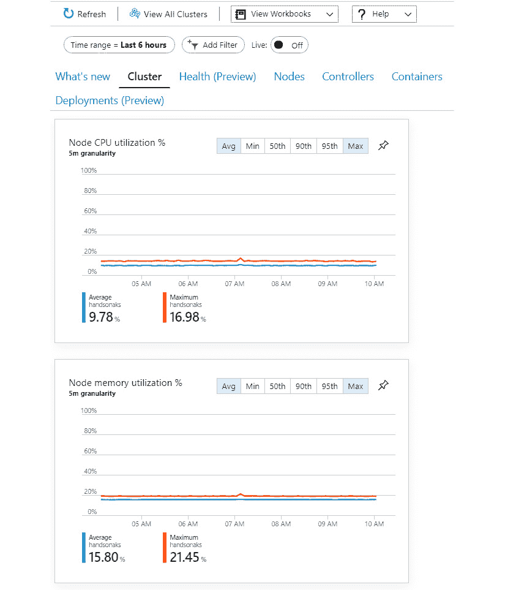

###### 图 7.29：Cluster 选项卡显示了集群的 CPU 和内存利用率

集群指标还显示了节点计数和活动 Pods 的数量。节点计数非常重要，因为您可以跟踪是否有节点处于 Not Ready 状态：

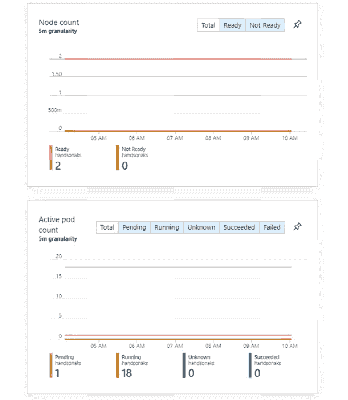

###### 图 7.30：Cluster 选项卡显示了节点计数和活动 Pods 的数量

Cluster 选项卡可用于监视集群中节点的状态。接下来，我们将探索 Health 选项卡。

**使用健康选项卡**

在撰写本书时，“健康”选项卡处于预览状态。该选项卡显示了集群健康状况的视图。为了向您显示这一状态，Azure 监视并检查所需的基础设施组件以及节点健康状况：

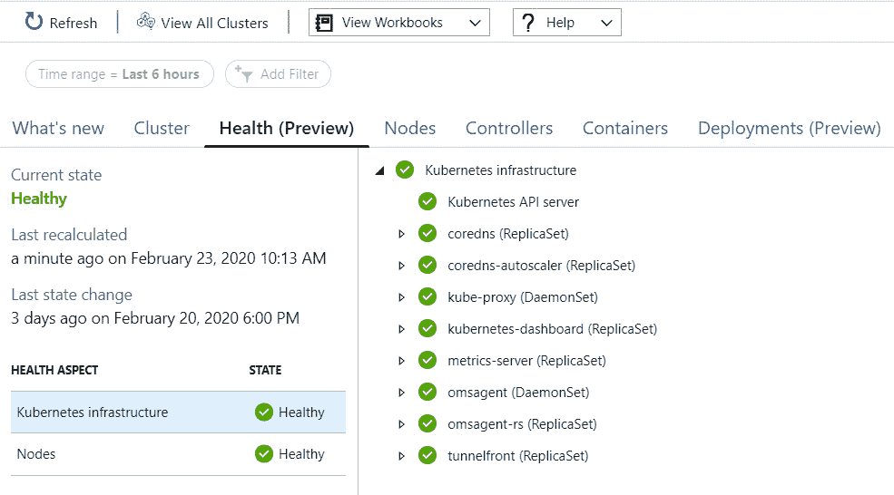

###### 图 7.31：健康选项卡显示了集群的整体健康状况

“健康”选项卡对于跟踪集群的整体健康状况非常有用。我们将要探索的下一个选项卡是“节点”选项卡。

**节点**

“节点”视图向您显示了节点的详细指标。它还向您显示了每个节点上运行的 Pods，正如我们在*图 7.32*中所看到的：

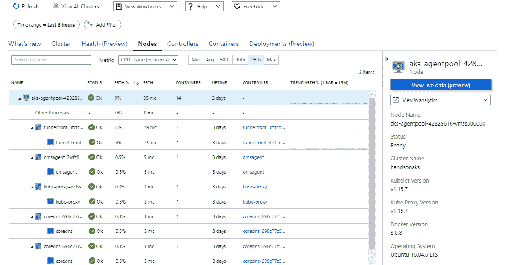

###### 图 7.32：节点视图窗格中节点的详细指标

如果您想要更多细节，您还可以单击并从节点获取 Kubernetes 事件日志：

###### 图 7.33：单击“查看 Kubernetes 事件日志”以从集群获取日志

这将打开 Azure Log Analytics，并为您预先创建一个查询，显示节点的日志。在我们的情况下，我们可以看到我们的节点已经重新启动了几次：

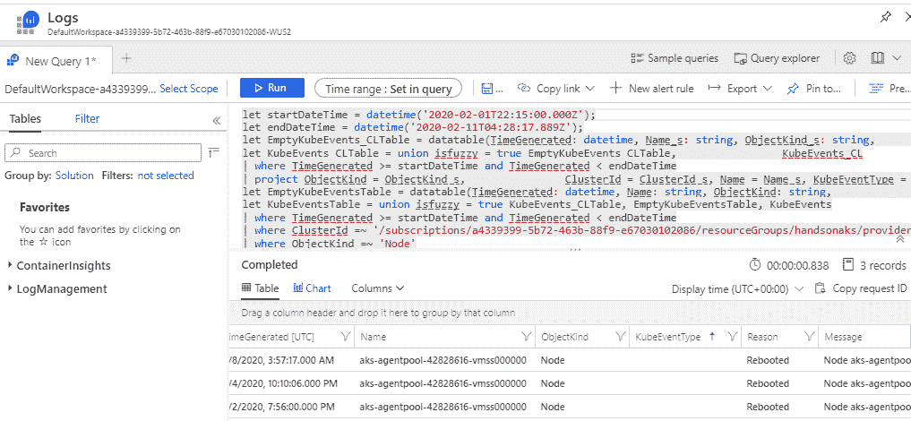

###### 图 7.34：Log Analytics 显示了节点的日志

**控制器**

“控制器”视图向您显示了集群中所有控制器（即 ReplicaSet、DaemonSet 等）的详细信息以及其中运行的 Pods。这向您展示了一个以控制器为中心的运行容器的视图。例如，您可以找到前端 ReplicaSet 并查看其中运行的所有 Pods 和容器，如*图 7.35*所示：

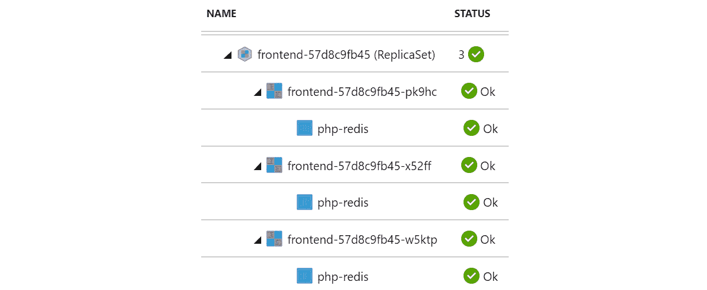

###### 图 7.35：控制器选项卡向我们显示了 ReplicaSet 中运行的所有容器

接下来的选项卡是“容器”选项卡，它将向我们显示容器的指标、日志和环境变量。

**容器指标、日志和环境变量**

单击“容器”选项卡会列出容器指标、环境变量以及访问其日志，如*图 7.36*所示：

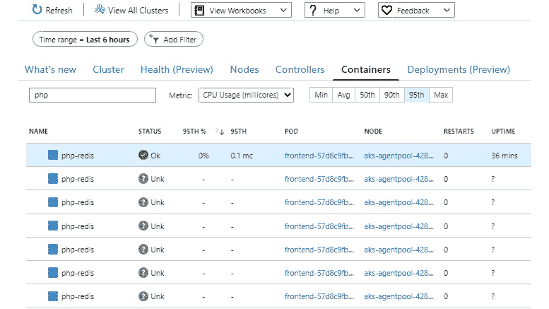

###### 图 7.36：容器选项卡显示了所有单独的容器

#### 注意

您可能会注意到一些容器处于“未知”状态。在我们的情况下，这是可以预料的。在 Azure Monitor 中，我们的时间范围设置为过去 6 小时，在过去 6 小时内，我们创建并删除了许多 Pod。它们不再存在，但 Azure Monitor 知道它们的存在，甚至为它们保留了日志。

我们可以从这个视图中访问我们容器的日志：

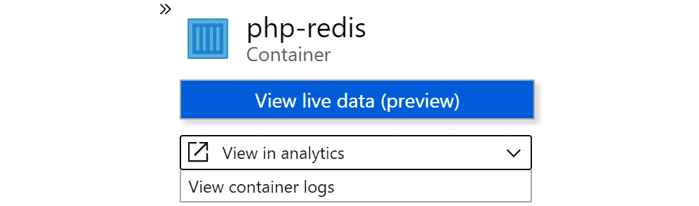

###### 图 7.37：访问容器的日志

这向我们展示了 Kubernetes 从我们的应用程序中记录的所有日志。我们在本章前面手动访问了这些日志。使用这种方法可能会更加高效，因为我们可以编辑日志查询并在单个视图中关联来自不同 Pod 和应用程序的日志：

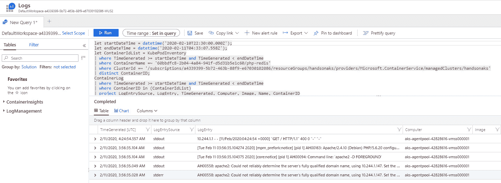

###### 图 7.38：日志已被收集并可以查询

除了日志之外，这个视图还显示了为容器设置的环境变量。要查看环境变量，请在此视图的右侧单元格中向下滚动：

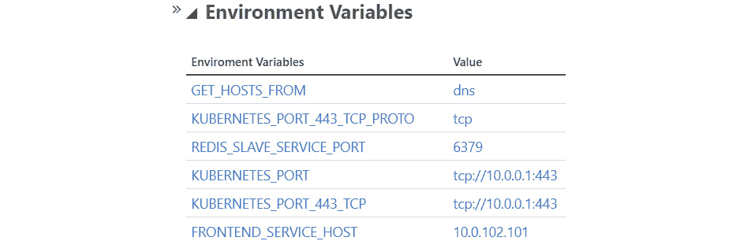

###### 图 7.39：为容器设置的环境变量

以上就是本节的内容。让我们确保清理我们的部署，这样我们就可以在下一章中继续使用一个干净的留言板：

[PRE55]

在本节中，我们探讨了在 Kubernetes 上运行的应用程序的监控。我们在 Azure 门户中使用 AKS **Insights**选项卡来详细查看我们的集群和运行在集群上的容器。

## 总结

我们在本章开始时展示了如何使用不同的`kubectl`命令来监视应用程序。然后，我们展示了 Kubernetes 创建的日志如何用于调试该应用程序。日志包含写入`stdout`和`stderr`的所有信息。最后，我们解释了使用 Azure Monitor 来显示 AKS 指标和环境变量，以及使用日志过滤显示日志。我们还展示了如何使用`kubectl`和 Azure Monitor 监控来调试应用程序和集群问题。

在下一章中，我们将学习如何将 AKS 集群连接到 Azure PaaS 服务。我们将重点关注如何将 AKS 集群连接到 Azure 管理的 MySQL 数据库。
