# 第八章：连接应用程序到 Azure 数据库

在之前的章节中，我们将应用程序的状态存储在我们的集群中，要么在 Redis 集群上，要么在 MariaDB 上。您可能还记得在高可用性方面两者都存在一些问题。本章将带您了解连接到 Azure 托管的 MySQL 数据库的过程。

我们将讨论使用托管数据库与在 Kubernetes 本身上运行 StatefulSets 的好处。为了创建这个托管和管理的数据库，我们将利用 Azure 的 Open Service Broker for Azure（OSBA）。OSBA 是一种从 Kubernetes 集群内部创建 Azure 资源（如托管的 MySQL 数据库）的方式。在本章中，我们将更详细地解释 OSBA 项目，并在我们的集群上设置和配置 OSBA。

然后，我们将利用 OSBA 在 Azure 中创建一个 MySQL 数据库。我们将把这个托管数据库作为 WordPress 应用程序的一部分。这将向您展示如何将应用程序连接到托管数据库。

此外，我们还将向您展示安全性、备份、灾难恢复（DR）、授权和审计日志的方面。还将探讨数据库和集群的独立扩展。我们将把本章的讨论分解为以下主题：

+   OSBA 的设置

+   扩展我们的应用程序以连接到 Azure 数据库

+   探索高级数据库操作

+   审查审计日志

让我们从在我们的集群上设置 OSBA 开始。

## 设置 OSBA

在本节中，我们将在我们的集群上设置 OSBA。OSBA 将允许我们在不离开 Kubernetes 集群的情况下创建一个 MySQL 数据库。我们将从解释使用托管数据库与在 Kubernetes 本身上运行 StatefulSets 的好处开始本节。

### 使用托管数据库服务的好处

到目前为止，我们所讨论的所有示例都是自包含的，也就是说，一切都在 Kubernetes 集群内运行。几乎任何生产应用程序都有状态，通常存储在数据库中。虽然在大部分情况下基本上是云无关的有很大的优势，但在管理数据库等有状态工作负载时却有很大的劣势。

当您在 Kubernetes 集群上运行自己的数据库时，您需要关注可伸缩性、安全性、高可用性、灾难恢复和备份。云提供商提供的托管数据库服务可以减轻您或您的团队执行这些任务的负担。例如，Azure Database for MySQL 具有企业级安全性和合规性、内置高可用性和自动备份。该服务可以在几秒钟内扩展，并且可以非常容易地配置为灾难恢复。

从 Azure 消费生产级数据库要比在 Kubernetes 上设置和管理自己的数据库简单得多。在下一节中，我们将探讨 Kubernetes 如何用于在 Azure 上创建这些数据库的方法。

### 什么是 OSBA？

在本节中，我们将探讨 OSBA 是什么。

与如今大多数应用程序一样，大部分工作已经由开源社区（包括微软员工）为我们完成。微软已经意识到许多用户希望从 Kubernetes 使用其托管服务，并且他们需要一种更容易使用与 Kubernetes 部署相同方法的方式。为了支持这一努力，他们发布了使用这些托管服务作为后端的 Helm 图表 ([`github.com/Azure/helm-charts`](https://github.com/Azure/helm-charts))。

允许您从 Kubernetes 内部创建 Azure 资源的架构的关键部分是 OSBA ([`osba.sh/`](https://osba.sh/))。OSBA 是 Azure 的**开放服务经纪人**（**OSB**）实现。OSB API 是一个规范，定义了云原生应用程序可以使用的平台提供商的通用语言，以管理云服务而无需锁定。

OSB API 本身并不是针对 Azure 或 Kubernetes 的特定。这是一个简化资源供应的行业努力，通过标准化 API 来连接第三方服务。

在使用 Kubernetes 的 OSB API 时，集群上会运行一个名为**服务目录**的扩展。服务目录将监听 Kubernetes API 的请求，并将其转换为 OSB API，以与平台提供商进行接口交互。这意味着当您请求数据库时，Kubernetes API 将该请求发送到服务目录，然后服务目录将使用 OSB API 与平台进行接口交互。*图 8.1*说明了这种逻辑流程：

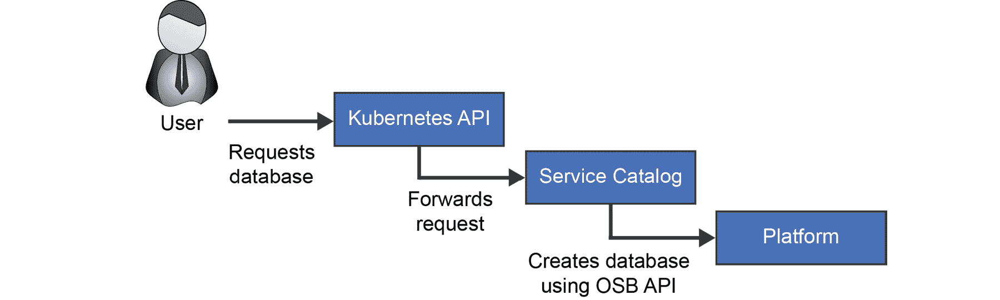

###### 图 8.1：在 Kubernetes 集群上使用 OSB 请求数据库的逻辑流程

OSBA 是用于多个 Azure 服务的 OSB 实现。它允许用户使用 OSB API 创建 14 种支持的 Azure 服务中的任何一种。其中一个服务是 Azure Database for MySQL。这意味着您可以通过 OSBA 在 Azure 上定义一个 MySQL 数据库，而无需使用 Azure 门户。

在下一节中，我们将专注于如何在我们的集群上安装 OSBA。

### 在集群上安装 OSBA

我们将在我们的集群上安装 OSBA。这个安装有两个元素。首先，我们将在我们的集群上安装服务目录扩展。之后，我们可以在集群上安装 OSBA。

由于我们将在我们的集群上安装多个组件，我们的双节点集群不足以满足这个示例。让我们主动将我们的 AKS 集群扩展到三个节点，这样我们在这个示例中就不会遇到任何问题：

[PRE0]

这个扩展将需要几分钟时间。当集群扩展到三个节点时，我们可以开始部署服务目录到集群上。

**在集群上部署服务目录**

服务目录提供了 OSB 所需的目录服务器。要在集群上部署服务目录，请按照以下步骤进行：

1.  让我们通过运行以下命令来部署服务目录：

[PRE1]

1.  等待服务目录部署完成。您可以通过运行以下命令来检查：

[PRE2]

1.  验证部署中的两个 Pod 都是`Running`并且完全准备就绪：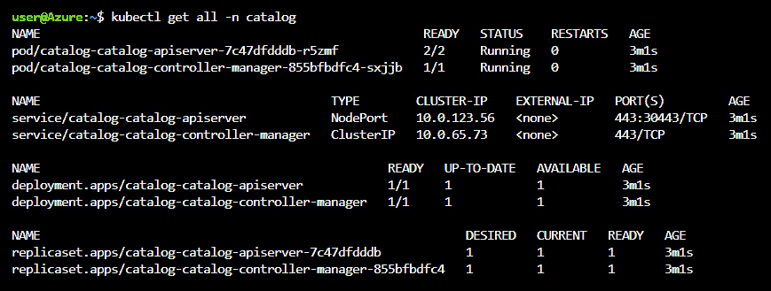

###### 图 8.2：成功部署服务目录

1.  要与服务经纪人进行交互，我们需要安装另一个 CLI 工具，即`svcat`。我们可以使用以下命令来完成：

[PRE3]

我们现在在我们的集群上配置了一个服务目录。现在，我们可以继续在集群上安装 OSBA。

### 部署 OSBA

在本节中，我们将在我们的集群上部署实际的 OSBA。对于这个设置，我们需要获取订阅 ID、租户 ID、客户 ID 和 OSBA 启动 Azure 服务的凭据：

1.  运行以下命令以获取所需的列表：

[PRE4]

输出将如*图 8.3*所示：

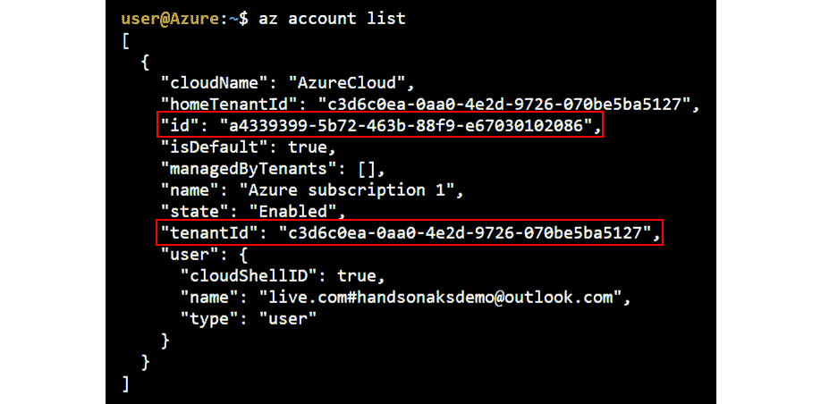

###### 图 8.3：显示所需列表-订阅 ID 和租户 ID 的输出

1.  复制您的`订阅 ID`以及`租户 ID`并将其保存在环境变量中：

[PRE5]

1.  创建一个启用了 RBAC 的服务主体，以便它可以启动 Azure 服务。如果您与其他人共享订阅，请确保服务主体的名称在您的目录中是唯一的：

[PRE6]

这将生成一个如*图 8.4*所示的输出：

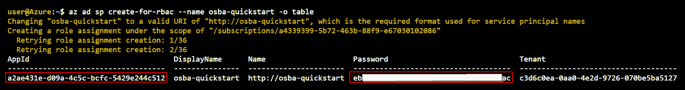

###### 图 8.4：显示服务主体凭据的输出

#### 注意

为了使上一步成功完成，您需要在 Azure 订阅上拥有所有者角色。

1.  将命令输出的值保存在环境变量中：

[PRE7]

1.  现在，我们可以按以下方式部署 OSBA：

[PRE8]

为了验证一切都正确部署了，您可以运行以下命令：

[PRE9]

等待直到两个 Pod 都处于`Running`状态。如果其中一个 Pod 处于`Error`状态，您不必担心。OSBA Pods 将自动重新启动并应达到健康状态。在我们的情况下，一个 Pod 重新启动了三次，如*图 8.5*所示：

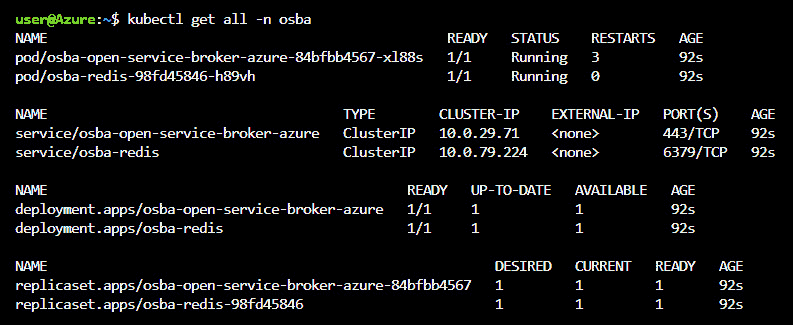

###### 图 8.5：显示 OSBA Pods 处于 Running 状态的输出

1.  为了验证我们的部署完全成功，我们可以使用我们在上一节中下载的`svcat`实用程序：

[PRE10]

这应该显示您的 Azure 经纪人：

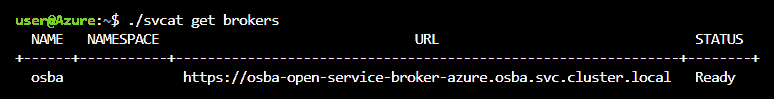

###### 图 8.6：显示集群中运行的 Azure 经纪人的输出

1.  您还可以验证通过 OSBA 驱动程序可以部署的所有服务：

[PRE11]

这将显示可以使用 OSBA 创建的服务列表，如*图 8.7*所示：

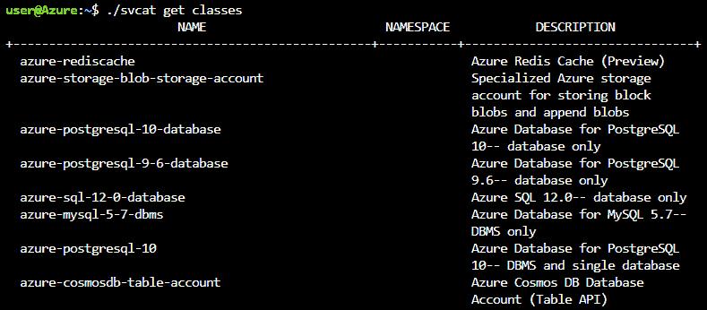

###### 图 8.7：可以使用 OSBA 创建的服务（裁剪后）列表

在本节中，我们在我们的集群上设置了服务目录和 OSBA。这意味着我们现在可以通过 Azure 从我们的集群创建托管服务。在下一节中，当我们使用 Azure 托管的数据库部署 WordPress 时，我们将使用这种能力。

## 部署 WordPress

以下是部署 WordPress 的步骤：

1.  运行以下命令安装 WordPress：

[PRE12]

1.  要验证 WordPress Pod 的状态，请运行以下命令：

[PRE13]

这应该显示单个 WordPress Pod 的状态，如*图 8.8*所示。在我们之前的 WordPress 示例中，我们总是有两个运行的 Pod，但是我们能够在这里将数据库功能卸载到 Azure：

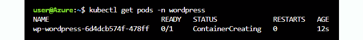

###### 图 8.8：仅显示一个 WordPress Pod 和我们集群中没有数据库的输出

1.  在创建 WordPress Pod 时，我们还可以检查数据库的状态。我们可以使用两种工具来获取此状态，要么是`svcat`，要么是`kubectl`：

[PRE14]

这将生成如*图 8.9*所示的输出：

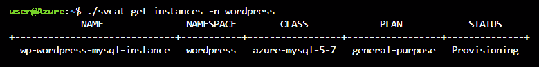

###### 图 8.9：显示使用 svcat 获取我们的 MySQL 实例的输出

我们可以使用`kubectl`获得类似的结果：

[PRE15]

这将生成如*图 8.10*所示的输出：

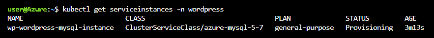

###### 图 8.10：显示使用 kubectl 获取我们的 MySQL 实例的输出

正如您所看到的，每种方法的输出都是相似的。

1.  请给部署几分钟的时间来完成。首先，需要完全配置数据库，然后 WordPress Pod 需要进入“运行”状态。要验证一切是否正常运行，请检查 WordPress Pod 的状态，并确保它处于“运行”状态：

[PRE16]

这将生成一个如*图 8.11*所示的输出：

###### 图 8.11：显示 WordPress Pod 的状态的输出

我们现在已经部署了使用 Azure 托管数据库的 WordPress。但是，默认情况下，对我们的数据库的连接是对互联网开放的。我们将在下一节中更改这一点。

### 保护 MySQL

尽管许多步骤都是自动化的，但这并不意味着我们的 MySQL 数据库已经可以投入生产。例如，MySQL 服务器的网络设置具有允许来自任何地方的流量的默认规则。我们将把这个更改为更安全的服务端点规则，也称为**VNet 规则**。

在 Azure 中，服务端点是您用于部署的网络（也称为 VNet）与其连接的服务之间的安全连接。在 AKS 和 MySQL 的情况下，这将在 AKS 部署的 VNet 和 MySQL 服务之间建立安全连接。

在本节中，我们将配置我们的 MySQL 数据库以使用服务端点：

1.  要进行此更改，请在 Azure 搜索栏中搜索`mysql`：

###### 图 8.12：在 Azure 搜索栏中搜索 MySQL

1.  在 MySQL 资源的资源页面中，转到左侧导航中的**连接安全**：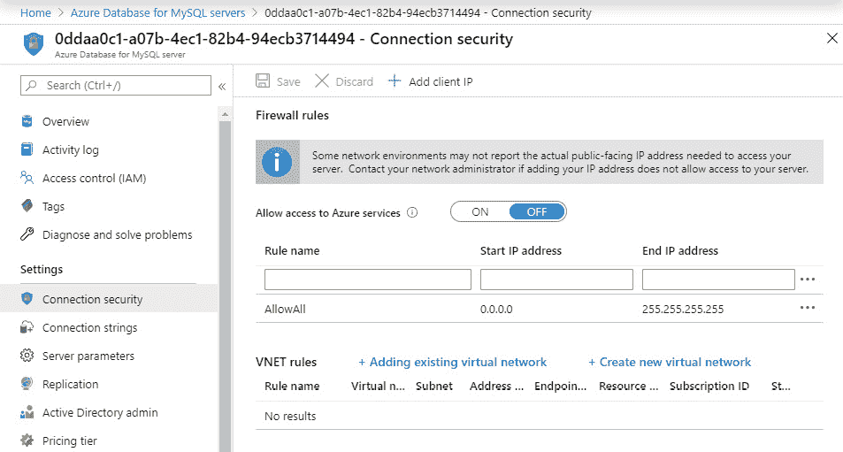

###### 图 8.13：点击连接安全

1.  有一个默认规则允许从任何 IP 地址连接到数据库。您可以将 AKS VNet 添加到**VNet 规则**部分，并删除**AllowAll 0.0.0.0**规则，如*图 8.14*所示：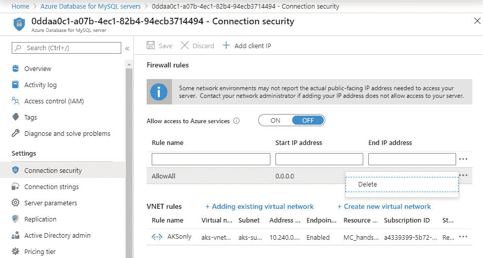

###### 图 8.14：将您的 AKS VNet 添加到 VNet 规则部分并删除 AllowAll 规则

通过进行这个简单的改变，我们大大减少了攻击面。现在我们可以连接到我们的 WordPress 网站。

### 连接到 WordPress 网站

您可以通过使用`EXTERNAL_IP`来验证您的博客网站是否可用和运行，该 IP 是通过运行以下命令获得的：

[PRE17]

这将生成一个如*图 8.15*所示的输出：

###### 图 8.15：显示服务外部 IP 的输出

然后，打开一个网页浏览器，转到`http://<EXTERNAL_IP>/`。您应该会看到您全新的博客：

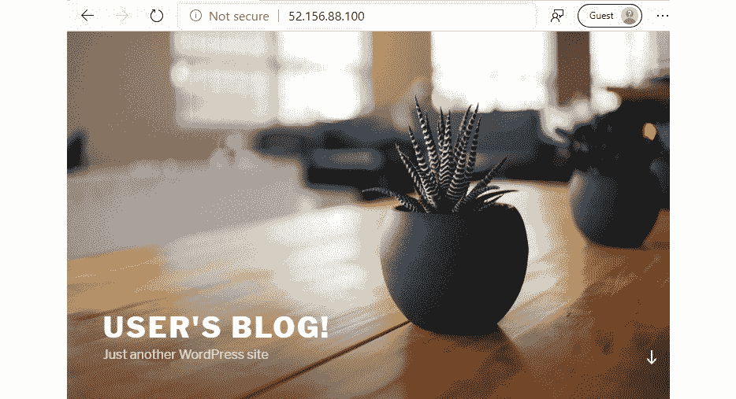

###### 图 8.16：WordPress 博客的最终外观

在本节中，我们启动了一个由 Azure 托管的 WordPress 网站，并对其进行了防火墙修改以确保安全。在接下来的部分，我们将介绍让 Azure 管理数据库的优势。

## 探索高级数据库操作

在 Azure 顶层作为托管服务运行数据库有许多优势。在本节中，我们将探讨这些好处。我们将探讨从备份中恢复，如何设置灾难恢复以及如何访问审计日志以验证谁对您的数据库进行了更改。

我们将从备份中恢复我们的数据库开始。

### 从备份恢复

当您在 Kubernetes 集群中运行数据库时，**高可用性**（**HA**）、备份和灾难恢复是您的责任。让我们花点时间来解释这三个概念之间的区别：

+   **HA**：HA 指的是服务的本地冗余，以确保在单个组件故障时服务仍然可用。这意味着设置服务的多个副本并协调它们之间的状态。在数据库上下文中，这意味着设置数据库集群。

Azure Database for MySQL 服务内置了 HA。在撰写本文时，它提供了每月 99.99%的可用性 SLA。

+   **备份**：备份是指对数据进行历史性的复制。当数据发生意外情况时，如意外数据删除或数据被覆盖时，备份是非常有用的。如果您自己运行数据库，您需要设置`cron`作业来进行备份并将其单独存储。

Azure Database for MySQL 会自动处理备份，无需额外配置。该服务每 5 分钟进行一次备份，并使您能够恢复到任何时间点。备份默认保留 7 天，可选配置使备份保留时间延长至 25 天。

+   **DR**：DR 指的是系统从灾难中恢复的能力。这通常指的是从完全区域性停机中恢复的能力。如果您运行自己的数据库，这将涉及在第二区域设置一个辅助数据库，并将数据复制到该数据库。

在 Azure Database for MySQL 的情况下，很容易配置 DR。该服务可以设置一个辅助托管数据库，并将数据从主要区域复制到辅助区域。

#### 注意

您可以参考[`docs.microsoft.com/azure/mysql/concepts-backup`](https://docs.microsoft.com/azure/mysql/concepts-backup)获取有关备份频率、复制和恢复选项的最新信息。

术语 HA、备份和 DR 经常被混淆。使用正确的术语并理解这三个概念之间的区别非常重要。在本节中，我们将重点关注备份，并从我们的 WordPress 数据库执行恢复。为了证明恢复操作将恢复用户数据，我们将首先创建一个博客帖子。

**在 WordPress 上创建博客帖子**

我们将创建一篇博客文章，以证明恢复操作将捕获我们在数据库上生成的新数据。为了能够发布这篇文章，我们需要我们站点的管理员凭据。我们将首先获取这些凭据，然后发布一篇新文章：

1.  要获取管理员凭据，请使用以下命令：

[PRE18]

这将显示您连接到管理员网站的密码：

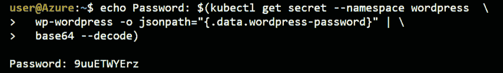

###### 图 8.17：获取管理员凭据

1.  现在浏览`http://<EXTERNAL IP>/admin`以打开 WordPress 站点的管理页面。使用用户名`user`和上一步的密码登录。

1.  连接后，选择**撰写您的第一篇博客文章**链接：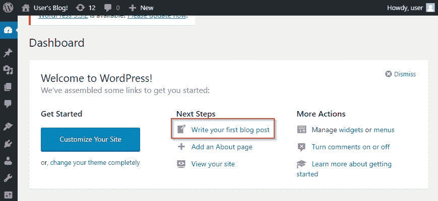

###### 图 8.18：单击链接撰写帖子

1.  创建一篇博客文章。内容并不重要。一旦您满意您的博客文章，选择**发布**按钮保存并发布博客文章：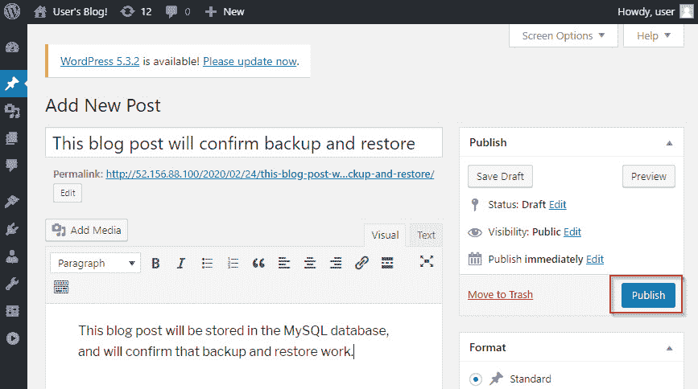

###### 图 8.19：创建一个示例博客文章并点击发布按钮保存

1.  您现在可以连接到`http://<EXTERNAL IP>`来查看您的博客文章：

###### 图 8.20：显示博客文章成功状态的提示

现在我们已经保存了一篇博客文章，请至少等待 5 分钟。Azure 每 5 分钟对 MySQL 数据库进行一次备份，我们要确保我们的新数据已经备份。一旦过了这 5 分钟，我们就可以继续下一步，执行实际的恢复。

**执行恢复**

现在我们的博客和数据库中都有实际内容。假设在更新过程中，数据库损坏了，所以我们想进行时间点恢复：

1.  要开始恢复操作，请在 Azure 门户中的 MySQL 选项卡上点击**恢复**：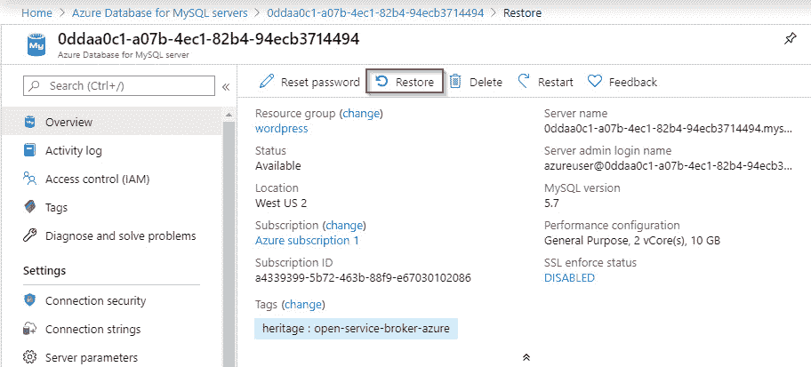

###### 图 8.21：点击恢复按钮来启动恢复过程

1.  然后，您需要选择要执行恢复的时间点。这个时间点可以是当前时间。给恢复的数据库起一个名字，这个名字必须是唯一的，如*图 8.22*所示。最后，点击**确定**。大约 5 到 10 分钟后，MySQL 服务应该会恢复：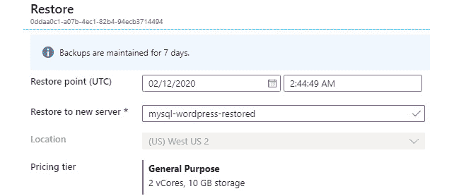

###### 图 8.22：选择要恢复的时间点并点击确定按钮

在本节中，我们恢复了我们的 MySQL 数据库。当恢复操作完成后，还有一步需要完成，那就是将 WordPress 连接到恢复的数据库。

**将 WordPress 连接到恢复的数据库**

恢复操作创建了数据库的新实例。为了使我们的 WordPress 安装连接到恢复的数据库，我们需要修改 Kubernetes 部署文件。理想情况下，您将修改 Helm 值文件并执行 Helm 升级；然而，这超出了本书的范围。以下步骤将帮助您将 WordPress 连接到恢复的数据库：

1.  从 Azure 门户中，记下**服务器名称**，如*图 8.23*所示：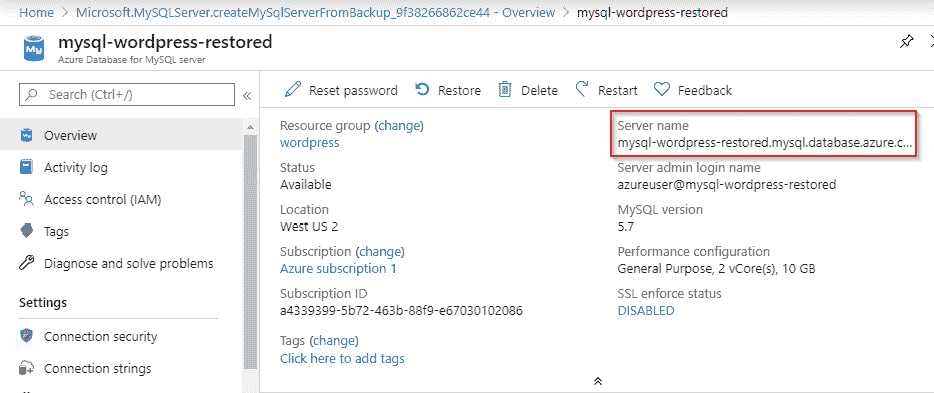

###### 图 8.23：显示恢复的数据库的完整名称

1.  还要修改**连接安全性**，就像之前一样，以允许集群与恢复的数据库通信。删除所有规则并向 AKS 集群的网络添加 VNet 规则。结果如*图 8.24*所示：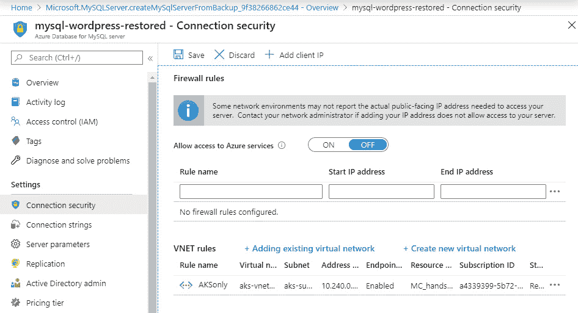

###### 图 8.24：编辑恢复的数据库的连接安全性

1.  接下来，我们需要将我们的 WordPress Pod 连接到新的数据库。让我们指出这是如何发生的。要获取这些信息，请运行以下命令：

[PRE19]

您可以看到连接到数据库的值是从一个 secret 中获取的，如*图 8.25*所示：

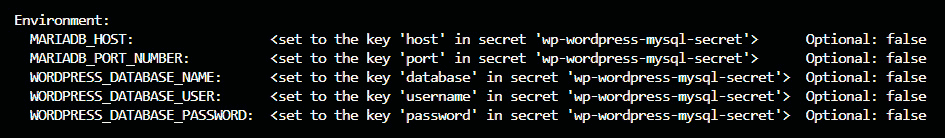

###### 图 8.25：显示 WordPress Pod 的环境变量

在设置 WordPress 时，安装程序将在文件`/bitname/wordpress/wp-config.php`中保存此配置。在接下来的步骤中，我们将首先编辑 secret，然后重新配置`wp-config.php`。

1.  要设置 secrets，我们需要`base64`值。通过运行以下命令获取服务器名称的`base64`值：

[PRE20]

注意`base64`值。

1.  现在，我们将继续编辑 Secret 中的主机名。为此，我们将使用`edit`命令：

[PRE21]

这将打开一个`vi`编辑器。导航到包含`host`的行并按`I`按钮。删除主机的当前值，并粘贴新的`base64`编码值。然后按*Esc*，输入：`wq!`，然后按*Enter*。您的密钥应如*图 8.26*所示：

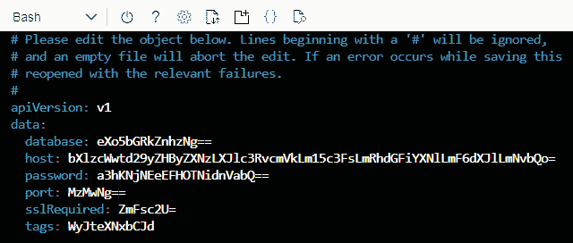

###### 图 8.26：编辑主机行，包含新服务器名称的 base64 编码值

1.  接下来，我们还需要在`wp-config.php`文件中进行更改。为此，让我们`exec`进入当前的 WordPress 容器并更改该值：

[PRE22]

这将再次打开`vi`编辑器。导航到包含`DB_HOST`配置行的第 32 行。按`I`进入插入模式，删除当前值，并用*图 8.27*中显示的恢复数据库的名称替换。然后按*Esc*，输入：`wq!`，然后按*Enter*。确保粘贴真实值，而不是`base64`编码的值：

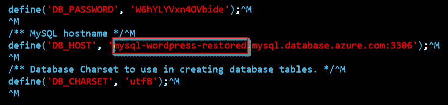

###### 图 8.27：将数据库名称更改为恢复的数据库

然后，使用以下命令退出 Pod：

[PRE23]

尽管我们现在已重置了密钥值和配置文件，但这并不意味着我们的服务器会自动获取新值。我们现在必须重新启动 Pod，以确保配置再次被读取。

1.  有许多方法可以做到这一点，我们将删除现有的 Pod。一旦删除了这个 Pod，我们的`ReplicaSet`控制器将注意到这一点并创建一个新的 Pod。要删除 Pod，请使用以下命令：

[PRE24]

1.  几秒钟后，您应该看到正在创建一个新的 Pod。新的 Pod 上线需要 5 到 10 分钟。一旦上线，您可以观看该 Pod 的容器日志，并验证您确实连接到了新的数据库：

[PRE25]

这应该包含如*图 8.28*所示的一行：

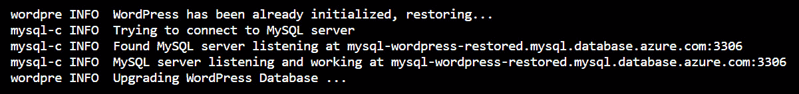

###### 图 8.28：显示连接到恢复数据库的 WordPress Pod 的日志

这表明我们现在已连接到我们恢复的数据库。我们可以确认实际内容已经恢复。您可以通过浏览到`http://<EXTERNAL IP>`来连接到 WordPress 网站本身：

###### 图 8.29：显示博客文章成功恢复的说明

在本节中，我们探讨了 Azure Database for MySQL 的备份和恢复能力。我们发布了一篇博客文章，并恢复了存储该博客文章的数据库。我们将我们的 WordPress 实例连接到恢复的数据库，并能够验证博客文章已成功恢复。

执行备份只是 Azure Database for MySQL 的能力之一。在下一节中，我们将探讨该服务的灾难恢复能力。

### 灾难恢复（DR）选项

根据您的应用程序要求和灾难恢复需求，您可以向 MySQL 服务器添加副本。副本可以在同一区域创建，以提高读取性能，也可以在辅助区域创建。

如果您正在为灾难恢复场景做准备，您需要在辅助区域设置一个副本。这将保护您免受 Azure 区域性故障的影响。设置这一点时，Azure 将会异步地将数据从主服务器复制到您设置的副本服务器。在复制进行时，副本服务器可以用于读取，但不能用于写入。如果发生灾难，意味着 Azure 区域发生了区域性故障，您需要停止复制，将副本服务器变成一个能够同时提供读取和写入请求的服务器。

在新区域创建副本非常简单。虽然设置和测试复制不在本书的范围内，但我们将展示如何设置。要配置复制，您需要在 MySQL 刀片中打开**复制**选项卡，如*图 8.30*所示：

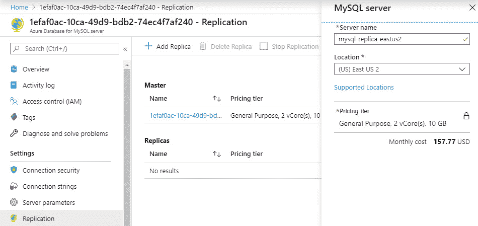

###### 图 8.30：通过 Azure 门户创建副本

#### 注意

备份、恢复和复制选项的完整列表在[`docs.microsoft.com/azure/mysql/concepts-backup`](https://docs.microsoft.com/azure/mysql/concepts-backup)和[`docs.microsoft.com/azure/mysql/concepts-read-replicas`](https://docs.microsoft.com/azure/mysql/concepts-read-replicas)中有文档记录。

在本节中，我们描述了 Azure Database for MySQL 复制到辅助区域的能力。这个副本可以用来为您的数据库构建 DR 策略。在下一节中，我们将介绍如何使用活动日志来审计谁对您的服务器进行了更改。

### 审查审计日志

数据库包含业务关键数据。您将希望有一个日志记录系统，可以显示谁对您的数据库进行了更改。

当您在 Kubernetes 集群上运行数据库时，如果出现问题，很难获取审计日志。您需要一种强大的动态设置审计级别的方式，具体取决于情况。您还必须确保日志被运送到集群外部。

Azure Database for MySQL 服务通过 Azure 门户提供了强大的审计机制来解决上述问题。该服务有两种不同的日志视图：

+   **活动日志**：活动日志显示发生在数据库 Azure 对象上的所有更改。Azure 记录所有针对 Azure 资源的创建、更新和删除事务，并将这些日志保存 90 天。对于 MySQL 来说，这意味着对大小、备份和复制设置等的所有更改。这些日志对于确定谁对您的数据库进行了更改非常有用。

+   **服务器日志**：服务器日志包括来自数据库中实际数据的日志。MySQL 有多个可配置的日志可用。通常建议打开审计日志以验证谁访问了您的数据库，并打开慢查询监视以跟踪运行缓慢的任何查询。

让我们一起看看这两种日志：

1.  要访问活动日志，请在 Azure 门户中打开 MySQL 数据库刀片。在左侧导航中，寻找**活动日志**。这将打开活动日志视图，如*图 8.31*所示：

###### 图 8.31：Azure 活动日志显示针对 Azure 数据库执行的操作

活动日志提供了非常有价值的信息，可以追溯已执行的活动。您应该在活动日志中找到指向您之前对连接安全设置所做更改的事件。

1.  服务器日志可以通过在左侧导航中查找**服务器日志**来获取。服务器日志默认情况下未打开，如*图 8.32*所示：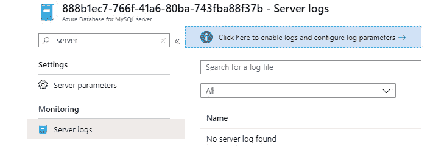

###### 图 8.32：导航显示默认情况下没有服务器日志

1.  让我们打开服务器日志。我们将通过启用`log_slow...`语句和`slow_query_log`来启用审计日志和性能监控，如*图 8.33*所示：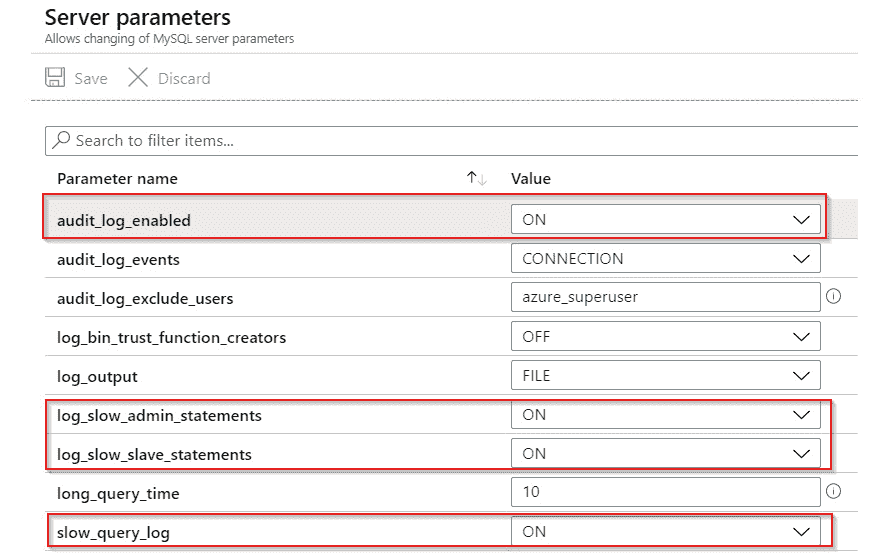

###### 图 8.33：启用审计日志和慢查询日志

一旦您打开了这些日志，实际日志将需要几分钟时间才能显示出来。几分钟后，您应该在 Azure 门户中的**服务器日志**选项卡中看到日志，如*图 8.34*所示：

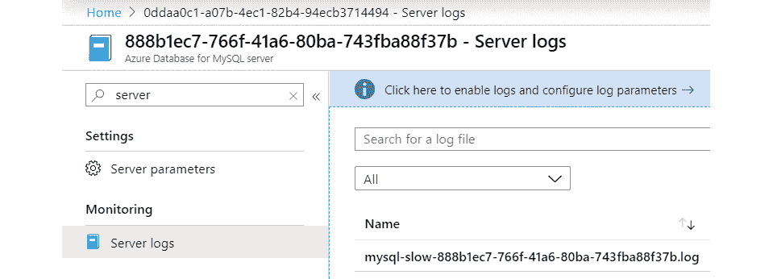

###### 图 8.34：在 Azure 门户中显示服务器日志

让我们确保在部署后再次清理并将我们的集群缩减到两个节点。缩减到两个节点将确保您在 Azure 订阅上节省成本：

[PRE26]

在本节中，我们介绍了 Azure 为 MySQL 数据库生成的两种日志类型。我们查看了活动日志，以查看针对 Azure 数据库执行了哪些操作，并打开了服务器日志，以了解数据库内部发生了什么。

## 总结

本章重点介绍了使用 WordPress 示例解决方案，该解决方案利用 MySQL 数据库作为数据存储。我们首先向您展示了如何通过安装 Azure 的 Open Service Broker 来设置集群，以连接 MySQL 数据库。然后，我们向您展示了如何设置 MySQL 数据库，并通过更改默认配置来大大减少数据库的攻击面，从而不允许公共访问数据库。接着，我们讨论了如何从备份中恢复数据库，以及如何利用解决方案进行灾难恢复。最后，我们讨论了如何配置审计日志以进行故障排除。

在下一章中，您将学习如何在 AKS 上实现微服务，包括使用事件中心实现应用程序之间的松耦合集成。
