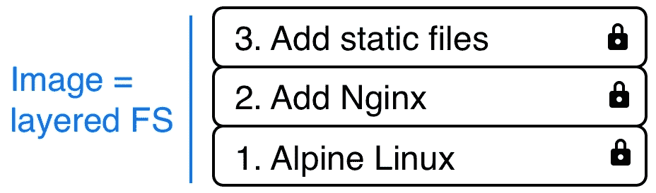
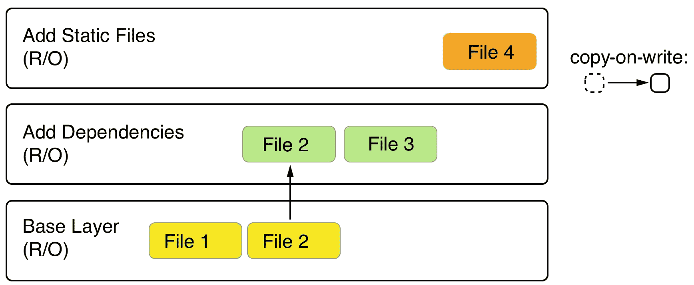

# 第四章：创建和管理容器镜像

在上一章中，我们学习了容器是什么，以及如何运行、停止、删除、列出和检查它们。我们提取了一些容器的日志信息，在已经运行的容器内运行其他进程，最后，我们深入研究了容器的解剖学。每当我们运行一个容器时，我们都是使用容器镜像创建它。在本章中，我们将熟悉这些容器镜像。我们将详细了解它们是什么，如何创建它们以及如何分发它们。

本章将涵盖以下主题：

+   什么是镜像？

+   创建镜像

+   举起和转移：容器化传统应用程序

+   共享或运输镜像

完成本章后，您将能够执行以下操作：

+   列举容器镜像的三个最重要特征。

+   通过交互式更改容器层并提交来创建自定义镜像。

+   编写一个简单的`Dockerfile`来生成自定义镜像。

+   使用`docker image save`导出现有的镜像，并使用`docker image load`将其导入到另一个 Docker 主机。

+   编写一个两步的 Dockerfile，通过仅在最终镜像中包含生成的工件来最小化结果镜像的大小。

# 什么是镜像？

在 Linux 中，一切都是文件。整个操作系统基本上是一个存储在本地磁盘上的文件系统。当查看容器镜像时，这是一个重要的事实要记住。正如我们将看到的，镜像基本上是一个包含文件系统的大型 tarball。更具体地说，它包含一个分层文件系统。

# 分层文件系统

容器镜像是创建容器的模板。这些镜像不仅由一个单一的块组成，而是由许多层组成。镜像中的第一层也被称为基础层。我们可以在下面的图形中看到这一点：

镜像就像一堆层叠的图层

每个单独的图层都包含文件和文件夹。每个图层只包含相对于底层的文件系统的更改。Docker 使用 Union 文件系统——如第三章中所讨论的*掌握容器*——从一组图层中创建虚拟文件系统。存储驱动程序处理有关这些图层如何相互交互的详细信息。不同的存储驱动程序可在不同情况下具有优势和劣势。

容器镜像的层都是不可变的。不可变意味着一旦生成，该层就永远不能被改变。唯一可能影响层的操作是其物理删除。层的这种不可变性很重要，因为它为我们打开了大量的机会，我们将会看到。

在下面的屏幕截图中，我们可以看到一个基于 Nginx 作为 Web 服务器的 Web 应用程序的自定义镜像是什么样子的：

基于 Alpine 和 Nginx 的示例自定义镜像

我们的基础层是**Alpine Linux**发行版。然后，在此基础上，我们有一个**添加 Nginx**层，其中 Nginx 添加在 Alpine 之上。最后，第三层包含构成 Web 应用程序的所有文件，如 HTML、CSS 和 JavaScript 文件。

正如之前所说，每个镜像都以基础镜像开始。通常，这个基础镜像是在 Docker Hub 上找到的官方镜像之一，比如 Linux 发行版、Alpine、Ubuntu 或 CentOS。然而，也可以从头开始创建一个镜像。

Docker Hub 是一个用于容器镜像的公共注册表。它是一个中央枢纽，非常适合共享公共容器镜像。

每个层只包含相对于前一组层的更改。每个层的内容都映射到主机系统上的一个特殊文件夹，通常是`/var/lib/docker/`的子文件夹。

由于层是不可变的，它们可以被缓存而永远不会变得过时。这是一个很大的优势，我们将会看到。

# 可写的容器层

正如我们所讨论的，一个容器镜像由一堆不可变或只读的层组成。当 Docker 引擎从这样的镜像创建一个容器时，它会在这堆不可变层的顶部添加一个可写的容器层。我们的堆现在看起来是这样的：

可写的容器层

容器层标记为可读/可写。镜像层的不可变性的另一个优点是它们可以在许多从该镜像创建的容器之间共享。所需的只是每个容器的一个薄的可写容器层，如下面的屏幕截图所示：

共享相同镜像层的多个容器

当然，这种技术会大大减少资源的消耗。此外，这有助于减少容器的加载时间，因为一旦镜像层加载到内存中，只需创建一个薄容器层，这仅发生在第一个容器中。

# 写时复制

Docker 在处理镜像时使用写时复制技术。写时复制是一种用于最大效率共享和复制文件的策略。如果一个层使用了一个低层次层中可用的文件或文件夹，那么它就直接使用它。另一方面，如果一个层想要修改一个低层次层中的文件，那么它首先将该文件复制到目标层，然后进行修改。在下面的截图中，我们可以看到这意味着什么：

使用写时复制的 Docker 镜像

第二层想要修改**文件 2**，它存在于**基础层**中。因此，它将其复制并进行修改。现在，假设我们正处于前面截图的顶层。这一层将使用**基础层**中的**文件 1**，以及第二层中的**文件 2**和**文件 3**。

# 图形驱动程序

图形驱动程序是启用联合文件系统的东西。图形驱动程序也称为存储驱动程序，在处理分层容器镜像时使用。图形驱动程序将多个镜像层合并为容器的挂载命名空间的根文件系统。换句话说，驱动程序控制着镜像和容器在 Docker 主机上的存储和管理方式。

Docker 支持使用可插拔架构的多种不同的图形驱动程序。首选驱动程序是`overlay2`，其次是`overlay`。

# 创建镜像

在您的系统上有三种方法可以创建一个新的容器镜像。第一种方法是通过交互式地构建一个包含所有所需的添加和更改的容器，然后将这些更改提交到一个新的镜像中。第二种，也是最重要的方法是使用`Dockerfile`描述新镜像中的内容，然后使用该`Dockerfile`构建镜像作为清单。最后，创建镜像的第三种方法是通过从 tarball 导入到系统中。

现在，让我们详细看看这三种方式。

# 交互式镜像创建

我们可以创建自定义镜像的第一种方式是通过交互式构建容器。也就是说，我们从要用作模板的基本镜像开始，并以交互方式运行一个容器。假设这是 Alpine 镜像。

要交互式地创建一个镜像，请按照以下步骤进行：

1.  运行容器的命令应该如下所示：

[PRE0]

上述命令基于`alpine:3.10`镜像运行一个容器。

我们使用`-it`参数交互式运行附加了**电传打字机**（**TTY**）的容器，使用`--name`参数将其命名为`sample`，最后在容器内部使用`/bin/sh`运行一个 shell。

在运行上述命令的终端窗口中，您应该看到类似于这样的内容：

[PRE1]

默认情况下，`alpine`容器没有安装`ping`工具。假设我们想要创建一个新的自定义镜像，其中安装了`ping`。

1.  在容器内部，我们可以运行以下命令：

[PRE2]

这使用`apk` Alpine 软件包管理器来安装`iputils`库，其中包括`ping`。上述命令的输出应该大致如下：

在 Alpine 上安装`ping`

1.  现在，我们确实可以使用`ping`，如下面的代码片段所示：

在容器内部使用 ping

1.  完成自定义后，我们可以通过在提示符处键入`exit`退出容器。

如果我们现在使用`ls -a` Docker 容器列出所有容器，我们可以看到我们的示例容器的状态为`Exited`，但仍然存在于系统中，如下面的代码块所示：

[PRE3]

1.  如果我们想要查看容器相对于基本镜像的变化，我们可以使用`docker container diff`命令，如下所示：

[PRE4]

输出应该呈现出容器文件系统上的所有修改列表，如下所示：

[PRE5]

我们已经缩短了上述输出以便更好地阅读。在列表中，`A`代表*添加*，`C`代表*更改*。如果有任何已删除的文件，那么它们将以**`D`**为前缀。

1.  现在，我们可以使用`docker container commit`命令来保存我们的修改并从中创建一个新的镜像，如下所示：

[PRE6]

通过上述命令，我们指定了新镜像将被称为`my-alpine`。上述命令生成的输出对应于新生成的镜像的 ID。

1.  我们可以通过列出系统上的所有镜像来验证这一点，如下所示：

[PRE7]

我们可以看到这个图像 ID（缩短）如下：

[PRE8]

我们可以看到名为`my-alpine`的图像具有预期的 ID`44bca4141130`，并自动分配了`latest`标签。这是因为我们没有明确定义标签。在这种情况下，Docker 总是默认为`latest`标签。

1.  如果我们想要查看我们的自定义图像是如何构建的，我们可以使用`history`命令如下：

[PRE9]

这将打印出我们的图像包含的层的列表，如下所示：

my-alpine Docker 图像的历史

在前面的输出中，第一层是我们刚刚通过添加`iputils`包创建的层。

# 使用 Dockerfile

手动创建自定义图像，如本章的前一节所示，当进行探索、创建原型或进行可行性研究时非常有帮助。但它有一个严重的缺点：这是一个手动过程，因此不可重复或可扩展。它也像人类手动执行的任何其他任务一样容易出错。必须有更好的方法。

这就是所谓的`Dockerfile`发挥作用的地方。`Dockerfile`是一个文本文件，通常被称为`Dockerfile`。它包含了构建自定义容器映像的指令。这是一种声明性构建图像的方式。

声明式与命令式：

在计算机科学中，通常情况下，特别是在 Docker 中，人们经常使用声明性的方式来定义任务。人们描述期望的结果，让系统找出如何实现这个目标，而不是给系统提供逐步实现所需结果的指令。后者是一种命令式的方法。

让我们看一个示例`Dockerfile`，如下所示：

[PRE10]

这是一个`Dockerfile`，用于容器化 Python 2.7 应用程序。正如我们所看到的，文件有六行，每行以关键字开头，如`FROM`、`RUN`或`COPY`。习惯上将关键字写成大写，但这不是必须的。

`Dockerfile`的每一行都会导致结果图像中的一个层。在下面的截图中，与本章前面的插图相比，图像被颠倒过来，显示为一堆层。在这里，**基础层**显示在顶部。不要被这个搞混了。实际上，基础层始终是堆栈中最低的层：

图像中 Dockerfile 和层的关系

现在，让我们更详细地看看各个关键字。

# FROM 关键字

每个`Dockerfile`都以`FROM`关键字开始。通过它，我们定义了要从哪个基础镜像开始构建我们的自定义镜像。例如，如果我们想从 CentOS 7 开始构建，我们会在`Dockerfile`中有以下行：

[PRE11]

在 Docker Hub 上，有所有主要 Linux 发行版的精选或官方镜像，以及所有重要的开发框架或语言，比如 Python、Node.js、Ruby、Go 等等。根据我们的需求，我们应该选择最合适的基础镜像。

例如，如果我想容器化一个 Python 3.7 应用程序，我可能会选择相关的官方`python:3.7`镜像。

如果我们真的想从头开始，我们也可以使用以下语句：

[PRE12]

这在构建超小型镜像的情况下非常有用，比如只包含一个二进制文件的情况：实际的静态链接可执行文件，比如`Hello-World`。`scratch`镜像实际上是一个空的基础镜像。

`FROM scratch`在`Dockerfile`中是一个`no-op`，因此不会在生成的容器镜像中生成一个层。

# RUN 关键字

下一个重要的关键字是`RUN`。`RUN`的参数是任何有效的 Linux 命令，比如以下内容：

[PRE13]

前面的命令使用`yum` CentOS 包管理器来在运行的容器中安装`wget`包。这假设我们的基础镜像是 CentOS 或 Red Hat Enterprise Linux（RHEL）。如果我们的基础镜像是 Ubuntu，那么命令会类似于以下内容：

[PRE14]

这是因为 Ubuntu 使用`apt-get`作为包管理器。同样，我们可以定义一行`RUN`命令，如下所示：

[PRE15]

我们也可以这样做：

[PRE16]

在这里，前者在容器中创建了一个`/app`文件夹并导航到它，后者将一个文件解压到指定位置。完全可以，甚至建议你使用多于一行的物理行来格式化 Linux 命令，比如这样：

[PRE17]

如果我们使用多行，需要在行尾加上反斜杠（`\`）来指示 shell 命令在下一行继续。

尝试找出前面的命令是做什么的。

# COPY 和 ADD 关键字

`COPY`和`ADD`关键字非常重要，因为最终我们希望向现有的基础镜像添加一些内容，使其成为自定义镜像。大多数情况下，这些是一些源文件，比如 Web 应用程序，或者一些已编译应用程序的二进制文件。

这两个关键字用于将文件和文件夹从主机复制到正在构建的镜像中。 这两个关键字非常相似，唯一的区别是`ADD`关键字还允许我们复制和解压缩 TAR 文件，并提供 URL 作为要复制的文件和文件夹的来源。

让我们看一些如何使用这两个关键字的示例，如下所示：

[PRE18]

在上述代码的前几行中，适用以下内容：

+   第一行将当前目录中的所有文件和文件夹递归地复制到容器镜像内的`app`文件夹中。

+   第二行将`web`子文件夹中的所有内容复制到目标文件夹`/app/web`。

+   第三行将单个文件`sample.txt`复制到目标文件夹`/data`中，并同时将其重命名为`my-sample.txt`。

+   第四个语句将`sample.tar`文件解压缩到目标文件夹`/app/bin`中。

+   最后，最后一个语句将远程文件`sample.txt`复制到目标文件`/data`中。

源路径中允许使用通配符。 例如，以下语句将所有以`sample`开头的文件复制到镜像内的`mydir`文件夹中：

[PRE19]

从安全角度来看，重要的是要知道，默认情况下，镜像内的所有文件和文件夹都将具有`0`的**用户 ID**（**UID**）和**组 ID**（**GID**）。 好处是，对于`ADD`和`COPY`，我们可以使用可选的`--chown`标志更改镜像内文件的所有权，如下所示：

[PRE20]

前面的语句将复制所有以`web`开头的文件并将它们放入镜像中的`/app/data`文件夹，并同时为这些文件分配用户`11`和组`22`。

除了数字之外，用户和组也可以使用名称，但是这些实体必须已在镜像的根文件系统中的`/etc/passwd`和`/etc/group`中定义； 否则，镜像的构建将失败。

# WORKDIR 关键字

`WORKDIR`关键字定义了在从我们的自定义镜像运行容器时使用的工作目录或上下文。 因此，如果我想将上下文设置为镜像内的`/app/bin`文件夹，则我的`Dockerfile`中的表达式必须如下所示：

[PRE21]

在前一行之后发生的所有活动都将使用此目录作为工作目录。 非常重要的一点是要注意，`Dockerfile`中以下两个片段不同：

[PRE22]

将前面的代码与以下代码进行比较：

[PRE23]

前者将在图像文件系统的根目录中创建文件，而后者将在`/app/bin`文件夹中的预期位置创建文件。只有`WORKDIR`关键字设置了图像层之间的上下文。`cd`命令本身不会跨层持久存在。

# CMD 和 ENTRYPOINT 关键字

`CMD`和`ENTRYPOINT`关键字是特殊的。虽然`Dockerfile`为图像定义的所有其他关键字都是由 Docker 构建器在构建图像时执行的，但这两个关键字实际上是定义了当从我们定义的图像启动容器时会发生什么。当容器运行时启动一个容器，它需要知道在该容器内部将运行的进程或应用程序是什么。这正是`CMD`和`ENTRYPOINT`用于告诉 Docker 启动进程是什么以及如何启动该进程。

现在，`CMD`和`ENTRYPOINT`之间的区别微妙，老实说，大多数用户并不完全理解它们，也不按照预期的方式使用它们。幸运的是，在大多数情况下，这不是问题，容器仍然会运行；只是处理它的方式不像可能那么直接。

为了更好地理解如何使用这两个关键字，让我们分析一下典型的 Linux 命令或表达式是什么样的。让我们以`ping`实用程序为例，如下所示：

[PRE24]

在上述表达式中，`ping`是命令，`-c 3 8.8.8.8`是这个命令的参数。让我们再看一个表达式：

[PRE25]

同样，在上述表达式中，`wget`是命令，`-O - http://example.com/downloads/script.sh`是参数。

现在我们已经处理了这个问题，我们可以回到`CMD`和`ENTRYPOINT`。`ENTRYPOINT`用于定义表达式的命令，而`CMD`用于定义命令的参数。因此，使用 Alpine 作为基础镜像并在容器中定义`ping`作为要运行的进程的`Dockerfile`可能如下所示：

[PRE26]

对于`ENTRYPOINT`和`CMD`，值被格式化为一个字符串的 JSON 数组，其中各个项对应于表达式的标记，这些标记由空格分隔。这是定义`CMD`和`ENTRYPOINT`的首选方式。它也被称为*exec*形式。

另外，也可以使用所谓的 shell 形式，如下所示：

[PRE27]

现在我们可以从上述`Dockerfile`构建一个名为`pinger`的镜像，如下所示：

[PRE28]

然后，我们可以从我们刚刚创建的`pinger`镜像中运行一个容器，就像这样：

[PRE29]

这样做的美妙之处在于，我现在可以通过在`docker container run`表达式的末尾添加新值来覆盖我在`Dockerfile`中定义的`CMD`部分（记住，它是`["-c", "3","8.8.8.8"]`），就像这样：

[PRE30]

这将导致容器现在对环回进行 ping 操作，持续 5 秒。

如果我们想要覆盖`Dockerfile`中定义的`ENTRYPOINT`，我们需要在`docker container run`表达式中使用`--entrypoint`参数。假设我们想要在容器中执行 shell 而不是`ping`命令。我们可以通过使用以下命令来实现：

[PRE31]

我们随后将发现自己在容器内部。键入`exit`离开容器。

正如我已经提到的，我们不一定要遵循最佳实践，并通过`ENTRYPOINT`定义命令和通过`CMD`定义参数；相反，我们可以将整个表达式作为`CMD`的值输入，它将起作用，如下面的代码块所示：

[PRE32]

在这里，我甚至使用了 shell 形式来定义`CMD`。但是在`ENTRYPOINT`未定义的情况下会发生什么？如果您未定义`ENTRYPOINT`，那么它将具有默认值`/bin/sh -c`，并且`CMD`的任何值都将作为字符串传递给 shell 命令。因此，前面的定义将导致输入以下代码来运行容器内的进程：

[PRE33]

因此，`/bin/sh`是在容器内运行的主要进程，并且它将启动一个新的子进程来运行`wget`实用程序。

# 一个复杂的 Dockerfile

我们已经讨论了 Dockerfile 中常用的最重要的关键字。让我们看一个现实的，有些复杂的`Dockerfile`的例子。感兴趣的读者可能会注意到，它看起来与我们在本章中呈现的第一个`Dockerfile`非常相似。以下是内容：

[PRE34]

好了，这里发生了什么？显然，这是一个用于构建 Node.js 应用程序的`Dockerfile`；我们可以从使用`node:12.5-stretch`基础镜像这一事实推断出来。然后，第二行是一个指令，在镜像的文件系统中创建一个/app 文件夹。第三行定义了镜像中的工作目录或上下文为这个新的/app 文件夹。然后，在第四行，我们将一个`package.json`文件复制到镜像内的/app 文件夹中。之后，在第五行，我们在容器内执行`npm install`命令；请记住，我们的上下文是/app 文件夹，因此 npm 会在那里找到我们在第四行复制的 package.json 文件。

在安装了所有 Node.js 依赖项之后，我们将应用程序的其余文件从主机的当前文件夹复制到镜像的/app 文件夹中。

最后，在最后两行，我们定义了当从这个镜像运行容器时启动命令将是什么。在我们的情况下，它是`npm start`，这将启动 Node.js 应用程序。

# 构建镜像

让我们看一个具体的例子并构建一个简单的 Docker 镜像，如下所示：

1.  在你的主目录中，创建一个名为`fod`（代表 Docker 基础知识）的文件夹，其中包含一个名为`ch04`的子文件夹，并导航到这个文件夹，就像这样：

[PRE35]

1.  在上述文件夹中，创建一个`sample1`子文件夹并导航到它，就像这样：

[PRE36]

1.  使用你喜欢的编辑器在这个示例文件夹中创建一个名为`Dockerfile`的文件，并包含以下内容：

[PRE37]

4. 保存文件并退出编辑器。

5. 回到终端窗口，我们现在可以使用上述`Dockerfile`作为清单或构建计划构建一个新的容器镜像，就像这样：

[PRE38]

请注意，上述命令末尾有一个句点。这个命令意味着 Docker 构建器正在使用当前目录中存在的`Dockerfile`创建一个名为`my-centos`的新镜像。这里，命令末尾的句点代表*当前目录*。我们也可以将上述命令写成如下形式，结果是一样的：

[PRE39]

但是我们可以省略`-f`参数，因为构建器假设`Dockerfile`的确切名称为`Dockerfile`。只有当我们的`Dockerfile`具有不同的名称或不位于当前目录时，我们才需要`-f`参数。

上述命令给出了这个（缩短的）输出：

[PRE40]

让我们分析这个输出，如下所示：

1.  首先，我们有以下一行：

[PRE41]

构建器的第一件事是打包当前构建上下文中的文件，排除了`.dockerignore`文件中提到的文件和文件夹（如果存在），然后将生成的`.tar`文件发送给`Docker 守护程序`。

1.  接下来，我们有以下几行：

[PRE42]

构建器的第一行告诉我们当前正在执行`Dockerfile`的哪个步骤。在这里，我们的`Dockerfile`中只有两个语句，我们正在执行第*2*步中的*步骤 1*。我们还可以看到该部分的内容是什么。在这里，它是基础镜像的声明，我们要在其上构建自定义镜像。然后构建器会从 Docker Hub 拉取这个镜像，如果本地缓存中没有的话。前面代码片段的最后一行指示了构建器分配给刚构建的镜像层的 ID。

1.  现在，继续下一步。我将它比前面的部分更加简短，以便集中在关键部分上：

[PRE43]

在这里，第一行再次告诉我们，我们正在*步骤 2*中的*步骤 2*。它还向我们显示了`Dockerfile`中的相应条目。在第二行，我们可以看到`Running in bb726903820c`，这告诉我们构建器已创建了一个 ID 为`bb726903820c`的容器，在其中执行了`RUN`命令。

我们在片段中省略了`yum install -y wget`命令的输出，因为在这一部分并不重要。当命令完成时，构建器停止容器，将其提交到一个新层，然后删除容器。在这种特殊情况下，新层的 ID 是`bc070cc81b87`。

1.  在输出的最后，我们遇到以下两行：

[PRE44]

这告诉我们，生成的自定义镜像已被赋予 ID`bc070cc81b87`，并且已被标记为名称`my-centos:latest`。

那么，构建器的工作原理是什么？它从基本图像开始。一旦将基本图像下载到本地缓存中，构建器就会创建一个容器，并在该容器中运行`Dockerfile`中的第一个语句。然后，它停止容器，并将容器中所做的更改持久化到一个新的图像层中。然后，构建器从基本图像和新层创建一个新的容器，并在该新容器中运行第二个语句。再次，结果被提交到一个新的层中。这个过程重复进行，直到`Dockerfile`中遇到最后一个语句。在提交了新图像的最后一层之后，构建器为该图像创建一个 ID，并使用我们在“build”命令中提供的名称对图像进行标记，如下面的屏幕截图所示。

可视化的图像构建过程

现在我们已经分析了 Docker 图像的构建过程以及涉及的步骤，让我们谈谈如何通过引入多步构建来进一步改进这一过程。

# 多步构建

为了演示为什么具有多个构建步骤的`Dockerfile`是有用的，让我们制作一个示例`Dockerfile`。让我们以 C 语言编写的“Hello World”应用程序为例。以下是`hello.c`文件中的代码：

[PRE45]

跟着来体验多步构建的优势：

1.  要将此应用程序容器化，我们首先编写一个带有以下内容的`Dockerfile`：

[PRE46]

1.  接下来，让我们构建这个图像：

[PRE47]

这给我们带来了相当长的输出，因为构建器必须安装 Alpine 软件开发工具包（SDK），其中包含我们需要构建应用程序的 C++编译器等工具。

1.  构建完成后，我们可以列出图像并查看其大小，如下所示：

[PRE48]

生成的图像大小为 176 MB，太大了。最后，它只是一个“Hello World”应用程序。它如此之大的原因是图像不仅包含“Hello World”二进制文件，还包含从源代码编译和链接应用程序所需的所有工具。但是当在生产环境中运行应用程序时，这确实是不可取的。理想情况下，我们只希望图像中有生成的二进制文件，而不是整个 SDK。

正是因为这个原因，我们应该将 Dockerfiles 定义为多阶段。我们有一些阶段用于构建最终的构件，然后有一个最终阶段，在这个阶段我们使用最小必要的基础镜像，并将构件复制到其中。这样可以得到非常小的 Docker 镜像。看一下这个修改后的`Dockerfile`：

[PRE49]

在这里，我们有第一个阶段使用`build`别名来编译应用程序，然后第二个阶段使用相同的`alpine:3.7`基础镜像，但不安装 SDK，只是使用`--from`参数将二进制文件从`build`阶段复制到最终镜像中：

1.  让我们再次构建镜像，如下所示：

[PRE50]

1.  当我们比较镜像的大小时，得到以下输出：

[PRE51]

我们已经成功将大小从 176MB 减小到 4MB。这是大小减小了 40 倍。较小的镜像有许多优点，比如对黑客来说攻击面积更小，内存和磁盘消耗更少，相应容器的启动时间更快，以及从 Docker Hub 等注册表下载镜像所需的带宽减少。

# Dockerfile 最佳实践

在编写`Dockerfile`时，有一些推荐的最佳实践需要考虑，如下所示：

+   首先，我们需要考虑容器是短暂的。所谓短暂，意味着容器可以停止和销毁，然后新建一个并以绝对最少的设置和配置放置在原位。这意味着我们应该努力将容器内运行的应用程序初始化所需的时间保持在最低限度，以及终止或清理应用程序所需的时间也要尽量减少。

+   下一个最佳实践告诉我们应该按照尽可能利用缓存的方式来排序`Dockerfile`中的各个命令。构建镜像的一层可能需要相当长的时间，有时甚至需要几秒钟，甚至几分钟。在开发应用程序时，我们将不得不多次为我们的应用程序构建容器镜像。我们希望将构建时间保持在最低限度。

当我们重新构建之前构建过的镜像时，只有发生了变化的层才会被重新构建，但如果需要重新构建一个层，所有后续的层也需要重新构建。这一点非常重要。考虑以下例子：

[PRE52]

在这个例子中，`Dockerfile`的第五行上的`npm install`命令通常需要最长的时间。经典的 Node.js 应用程序有许多外部依赖项，这些依赖项都会在这一步骤中下载和安装。这可能需要几分钟才能完成。因此，我们希望避免在重建图像时每次运行`npm install`，但是开发人员在应用程序开发过程中经常更改其源代码。这意味着第四行的`COPY`命令的结果每次都会更改，因此必须重新构建该图层。但正如我们之前讨论的，这也意味着所有后续的图层都必须重新构建，而在这种情况下，包括`npm install`命令。为了避免这种情况，我们可以稍微修改`Dockerfile`，并采用以下方式：

[PRE53]

我们在这里所做的是，在第四行，我们只复制了`npm install`命令需要的单个文件，即`package.json`文件。在典型的开发过程中，这个文件很少更改。因此，`npm install`命令也只有在`package.json`文件更改时才需要执行。所有其余经常更改的内容都是在`npm install`命令之后添加到图像中的。

+   进一步的最佳实践是保持构成图像的图层数量相对较少。图像的图层越多，图形驱动程序就需要更多的工作来将这些图层合并为相应容器的单一根文件系统。当然，这需要时间，因此图像的图层数量越少，容器的启动时间就越快。

但是我们如何保持图层数量较少呢？请记住，在`Dockerfile`中，每一行以`FROM`、`COPY`或`RUN`等关键字开头的命令都会创建一个新的图层。减少图层数量的最简单方法是将多个单独的`RUN`命令合并为一个。例如，假设我们在`Dockerfile`中有以下内容：

[PRE54]

我们可以将这些内容合并为一个单一的连接表达式，如下所示：

[PRE55]

前者将在生成的图像中生成三个图层，而后者只创建一个单一的图层。

接下来的三种最佳实践都会导致更小的图像。为什么这很重要？更小的图像减少了从注册表下载图像所需的时间和带宽。它们还减少了在 Docker 主机上本地存储副本所需的磁盘空间和加载图像所需的内存。最后，更小的图像也意味着对黑客的攻击面更小。以下是提到的最佳实践：

+   第一个最佳实践有助于减小图像大小的方法是使用`.dockerignore`文件。我们希望避免将不必要的文件和文件夹复制到图像中，以使其尽可能精简。`.dockerignore`文件的工作方式与熟悉 Git 的人所熟悉的`.gitignore`文件完全相同。在`.dockerignore`文件中，我们可以配置模式来排除某些文件或文件夹在构建图像时包含在上下文中。

+   下一个最佳实践是避免将不必要的软件包安装到图像的文件系统中。再次强调，这是为了使图像尽可能精简。

+   最后但同样重要的是，建议您使用多阶段构建，以使生成的图像尽可能小，并且仅包含运行应用程序或应用程序服务所需的绝对最小内容。

# 保存和加载图像

创建新容器图像的第三种方法是通过从文件导入或加载它。容器图像只不过是一个 tarball。为了证明这一点，我们可以使用`docker image save`命令将现有图像导出为 tarball，就像这样：

[PRE56]

上述命令将我们之前构建的`my-alpine`图像导出到名为`./backup/my-alpine.tar`的文件中。

另一方面，如果我们有一个现有的 tarball 并希望将其导入为图像到我们的系统中，我们可以使用`docker image load`命令，如下所示：

[PRE57]

在下一节中，我们将讨论如何为现有的传统应用程序创建 Docker 图像，并在容器中运行它们，并从中获利。

# 举起和转移：容器化传统应用程序

我们并不总是能够从零开始开发全新的应用程序。往往情况是，我们手头有一大批传统应用程序，它们已经在生产环境中运行，并为公司或客户提供了至关重要的价值。这些应用程序往往是有机发展而来，非常复杂。文档稀缺，没有人真的愿意去碰这样的应用程序。通常情况下，有句话叫做“不要碰正在运行的系统”。然而，市场需求在变化，因此需要更新或重写这些应用程序。由于资源和时间的缺乏，或者成本过高，通常情况下完全重写是不可能的。那么我们该怎么办呢？我们是否可以将它们 Docker 化，并从容器引入的好处中获益呢？

事实证明我们可以。2017 年，Docker 为企业客户推出了一个名为“现代化传统应用程序”（MTA）的计划，该计划本质上承诺帮助这些客户将他们现有的或传统的 Java 和.NET 应用程序进行容器化，而无需改变一行代码。MTA 的重点是 Java 和.NET 应用程序，因为它们在典型企业中占据了绝大部分传统应用程序的份额。但对于任何使用其他语言和平台编写的应用程序，比如 C、C++、Python、Node.js、Ruby、PHP 或 Go 等，也是可能的。

让我们想象一下这样一个遗留应用程序。假设我们有一个 10 年前编写的旧 Java 应用程序，并在接下来的 5 年中不断更新。该应用程序基于 2006 年 12 月发布的 Java SE 6。它使用环境变量和属性文件进行配置。数据库连接字符串中使用的用户名和密码等机密信息是从诸如 HashiCorp 的 Vault 之类的机密存储库中提取的。

# 对外部依赖关系的分析。

现代化过程中的第一步之一是发现和列出遗留应用程序的所有外部依赖关系。

我们需要问自己一些类似以下的问题：

1.  它是否使用数据库？如果是，是哪种数据库？连接字符串是什么样的？

1.  它是否使用外部 API，比如信用卡批准或地理映射 API？API 密钥和密钥机密是什么？

1.  它是否从企业服务总线（ESB）中消费或发布？

这些只是我想到的一些可能的依赖关系。还有更多存在。这些是应用程序与外部世界的接缝，我们需要意识到它们并创建清单。

# 源代码和构建说明

下一步是定位所有源代码和其他资产，例如应用程序的图像、CSS 和 HTML 文件。理想情况下，它们应该位于一个单独的文件夹中。这个文件夹将是我们项目的根目录，可以有许多子文件夹。这个项目根文件夹将在构建我们想要为我们的遗留应用程序创建的容器映像时成为上下文。请记住，Docker 构建器只包括构建中的上下文中的文件；在我们的情况下，这是根项目文件夹。

不过，有一个选项可以在构建过程中从不同位置下载或复制文件，使用`COPY`或`ADD`命令。有关如何使用这两个命令的确切细节，请参考在线文档。如果您的遗留应用程序的源不能轻松地包含在一个单独的本地文件夹中，这个选项是有用的。

一旦我们意识到所有部分都对最终应用程序有贡献，我们需要调查应用程序是如何构建和打包的。在我们的情况下，这很可能是通过使用 Maven 来完成的。Maven 是 Java 最流行的构建自动化工具，并且在大多数开发 Java 应用程序的企业中一直被使用。对于遗留的.NET 应用程序，很可能是通过使用 MSBuild 工具来完成；对于 C/C++应用程序，可能会使用 Make。

再次，让我们扩展我们的库存并记录使用的确切构建命令。以后在编写`Dockerfile`时，我们将需要这些信息。

# 配置

应用程序需要进行配置。在配置过程中提供的信息可以是，例如，要使用的应用程序日志记录类型、连接到数据库的连接字符串、到诸如 ESB 的服务的主机名或到外部 API 的 URI 等。

我们可以区分几种类型的配置，如下所示：

+   **构建时间**：这是在构建应用程序和/或其 Docker 映像时需要的信息。在我们创建 Docker 映像时，它需要可用。

+   环境：这是随着应用程序运行环境的不同而变化的配置信息，例如开发环境与暂存或生产环境。这种配置在应用程序启动时被应用，例如在生产环境中。

+   运行时：这是应用程序在运行时检索的信息，例如访问外部 API 的秘钥。

# 秘钥

每个关键的企业应用程序都需要以某种形式处理秘钥。最熟悉的秘钥是访问数据库所需的连接信息，这些数据库用于保存应用程序产生或使用的数据。其他秘钥包括访问外部 API 所需的凭据，例如信用评分查询 API。重要的是要注意，这里我们谈论的是应用程序必须提供给应用程序使用或依赖的服务提供商的秘钥，而不是应用程序用户提供的秘钥。这里的主体是我们的应用程序，它需要被外部机构和服务提供商进行认证和授权。

传统应用程序获取秘钥的方式有很多种。最糟糕和最不安全的提供秘钥的方式是将它们硬编码或从配置文件或环境变量中读取，这样它们就以明文形式可用。一个更好的方式是在运行时从特殊的秘钥存储中读取秘钥，该存储将秘钥加密并通过安全连接（如传输层安全性（TLS））提供给应用程序。

再一次，我们需要创建一个清单，列出我们的应用程序使用的所有秘钥以及它们获取秘钥的方式。是通过环境变量或配置文件，还是通过访问外部密钥存储，例如 HashiCorp 的 Vault？

# 编写 Dockerfile

一旦我们完成了前面几节讨论的所有项目清单，我们就可以开始编写我们的`Dockerfile`。但我想警告你：不要期望这是一个一次性的任务。你可能需要多次迭代，直到你制定出最终的`Dockerfile`。`Dockerfile`可能会相当长，看起来很丑陋，但这并不是问题，只要我们得到一个可用的 Docker 镜像。一旦我们有了可用的版本，我们总是可以微调`Dockerfile`。

# 基础镜像

让我们首先确定我们想要使用和构建图像的基本图像。是否有官方的 Java 图像可用，符合我们的要求？请记住，我们的虚构应用程序是基于 Java SE 6。如果有这样的基本图像可用，那么让我们使用那个。否则，我们想要从 Red Hat、Oracle 或 Ubuntu 等 Linux 发行版开始。在后一种情况下，我们将使用发行版的适当软件包管理器（`yum`、`apt`或其他）来安装所需版本的 Java 和 Maven。为此，我们在`Dockerfile`中使用`RUN`关键字。请记住，`RUN`关键字使我们有可能在构建过程中执行图像中的任何有效的 Linux 命令。

# 组装源代码

在这一步中，我们确保所有构建应用程序所需的源文件和其他工件都是图像的一部分。在这里，我们主要使用`Dockerfile`的两个关键字：`COPY`和`ADD`。最初，图像中的源结构应该与主机上的完全相同，以避免任何构建问题。理想情况下，您将有一个单独的`COPY`命令，将主机上的根项目文件夹全部复制到图像中。然后，相应的`Dockerfile`片段可能看起来就像这样简单：

[PRE58]

不要忘记还要提供一个位于项目根文件夹中的`.dockerignore`文件，其中列出了项目根文件夹中不应成为构建上下文一部分的所有文件和（子）文件夹。

如前所述，您还可以使用`ADD`关键字将不位于构建上下文中但可以通过 URI 访问的源代码和其他工件下载到 Docker 图像中，如下所示：

[PRE59]

这将在图像的工作文件夹中创建一个`foobar`文件夹，并从 URI 中复制所有内容。

# 构建应用程序

在这一步中，我们确保创建组成我们可执行的遗留应用程序的最终工件。通常，这是一个 JAR 或 WAR 文件，有或没有一些附属的 JAR 文件。`Dockerfile`的这部分应该完全模仿您在将应用程序容器化之前传统用于构建应用程序的方式。因此，如果使用 Maven 作为构建自动化工具，`Dockerfile`的相应片段可能看起来就像这样简单：

[PRE60]

在这一步中，我们可能还想列出应用程序使用的环境变量，并提供合理的默认值。但是永远不要为提供给应用程序的秘密环境变量提供默认值，比如数据库连接字符串！使用`ENV`关键字来定义你的变量，就像这样：

[PRE61]

还要声明应用程序正在侦听的所有端口，并且需要通过`EXPOSE`关键字从容器外部访问，就像这样：

[PRE62]

# 定义启动命令

通常，Java 应用程序是通过诸如`java -jar <主应用程序 jar>`这样的命令启动的，如果它是一个独立的应用程序。如果是 WAR 文件，那么启动命令可能看起来有点不同。因此，我们可以定义`ENTRYPOINT`或`CMD`来使用这个命令。因此，我们的`Dockerfile`中的最终语句可能是这样的：

[PRE63]

然而，通常情况下这太过简单，我们需要执行一些预运行任务。在这种情况下，我们可以编写一个包含需要执行以准备环境并运行应用程序的一系列命令的脚本文件。这样的文件通常被称为`docker-entrypoint.sh`，但你可以自由地命名它。确保文件是可执行的—例如，使用以下命令：

[PRE64]

`Dockerfile`的最后一行将如下所示：

[PRE65]

现在你已经得到了如何将传统应用程序容器化的提示，是时候进行总结并问自己：*真的值得花这么大的努力吗？*

# 为什么费这个劲呢？

此时，我可以看到你正在挠头，问自己：*为什么要费这个劲呢？* 为什么你要花这么大的力气来容器化一个传统应用程序？有什么好处呢？

事实证明**投资回报率**（**ROI**）是巨大的。Docker 的企业客户在 DockerCon 2018 和 2019 等会议上公开披露，他们看到了 Docker 化传统应用程序的这两个主要好处：

+   维护成本节约超过 50%。

+   新版本发布之间的时间减少了 90%。

通过减少维护开销节省的成本可以直接再投资，并用于开发新功能和产品。在传统应用程序的新版本发布期间节省的时间使企业更具敏捷性，能够更快地对客户或市场需求的变化做出反应。

现在我们已经详细讨论了如何构建 Docker 图像，是时候学习如何通过软件交付流程的各个阶段来部署这些图像了。

# 分享或部署图像

为了能够将我们的自定义图像部署到其他环境中，我们需要首先为其指定一个全局唯一的名称。这个操作通常被称为给图像打标签。然后我们需要将图像发布到一个中央位置，其他感兴趣或有权限的方可以从中拉取。这些中央位置被称为*图像注册表*。

# 给图像打标签

每个图像都有一个所谓的*标签*。标签通常用于对图像进行版本控制，但它的作用远不止于版本号。如果在使用图像时没有明确指定标签，那么 Docker 会自动假定我们指的是`latest`标签。这在从 Docker Hub 拉取图像时很重要，就像下面的例子一样：

[PRE66]

上述命令将从 Docker Hub 拉取`alpine:latest`图像。如果我们想要明确指定一个标签，可以这样做：

[PRE67]

现在将拉取已标记为`3.5`的`alpine`图像。

# 图像命名空间

到目前为止，我们一直在拉取各种图像，并没有太在意这些图像的来源。您的 Docker 环境配置为，默认情况下所有图像都是从 Docker Hub 拉取的。我们还只从 Docker Hub 拉取了所谓的官方图像，比如`alpine`或`busybox`。

现在，是时候稍微扩大一下视野，了解图像的命名空间是如何工作的了。定义图像最通用的方式是通过其完全限定名称，如下所示：

[PRE68]

让我们更详细地看一下：

+   `<registry URL>`：这是我们想要从中拉取图像的注册表的 URL。默认情况下，这是`docker.io`。更一般地说，这可能是`https://registry.acme.com`。

除了 Docker Hub，还有很多公共注册表可以从中拉取图像。以下是其中一些的列表，没有特定顺序：

+   +   Google，在[`cloud.google.com/container-registry`](https://cloud.google.com/container-registry)

+   Amazon AWS **Amazon Elastic Container Registry** (**ECR**)，在[`aws.amazon.com/ecr/`](https://aws.amazon.com/ecr/)

+   Microsoft Azure，在[`azure.microsoft.com/en-us/services/container-registry/`](https://azure.microsoft.com/en-us/services/container-registry/)

+   Red Hat，在[`access.redhat.com/containers/`](https://access.redhat.com/containers/)

+   Artifactory，网址为[`jfrog.com/integration/artifactory-docker-registry/`](https://jfrog.com/integration/artifactory-docker-registry/)

+   `<用户或组织>`：这是在 Docker Hub 上定义的个人或组织的私有 Docker ID，或者其他注册表，比如`microsoft`或`oracle`。

+   `<名称>`：这是镜像的名称，通常也称为存储库。

+   `<tag>`：这是镜像的标签。

让我们看一个例子，如下：

[PRE69]

在这里，我们有一个带有版本`1.0`标签的`web-app`镜像，属于`https://registry.acme.com`上的`engineering`组织的私有注册表。

现在，有一些特殊的约定：

+   如果我们省略了注册表 URL，那么 Docker Hub 会自动被使用。

+   如果我们省略了标签，那么将使用`latest`。

+   如果它是 Docker Hub 上的官方镜像，那么不需要用户或组织命名空间。

以下是一些以表格形式呈现的示例：

| **镜像** | **描述** |
| --- | --- |
| `alpine` | Docker Hub 上的官方`alpine`镜像，带有`latest`标签。 |
| `ubuntu:19.04` | Docker Hub 上的官方`ubuntu`镜像，带有`19.04`标签或版本。 |
| `microsoft/nanoserver` | Microsoft 在 Docker Hub 上的`nanoserver`镜像，带有`latest`标签。 |
| `acme/web-api:12.0` | 与`acme`组织相关联的`web-api`镜像版本`12.0`。该镜像在 Docker Hub 上。 |
| `gcr.io/gnschenker/sample-app:1.1` | `sample-app`镜像，带有`1.1`标签，属于 Google 容器注册表上的`gnschenker`ID。 |

现在我们知道了 Docker 镜像的完全限定名称是如何定义的，以及它的组成部分是什么，让我们来谈谈在 Docker Hub 上可以找到的一些特殊镜像。

# 官方镜像

在上表中，我们多次提到了*官方镜像*。这需要解释。镜像存储在 Docker Hub 注册表上的存储库中。官方存储库是由个人或组织策划的一组存储库，他们还负责镜像内打包的软件。让我们看一个例子来解释这意味着什么。Ubuntu Linux 发行版背后有一个官方组织。该团队还提供包含他们 Ubuntu 发行版的官方版本的 Docker 镜像。

官方镜像旨在提供基本的操作系统存储库、流行编程语言运行时的镜像、经常使用的数据存储以及其他重要服务。

Docker 赞助一个团队，他们的任务是审查并发布 Docker Hub 上公共存储库中的所有精选图像。此外，Docker 还扫描所有官方图像以查找漏洞。

# 将图像推送到注册表

创建自定义图像当然很好，但在某个时候，我们希望实际上将我们的图像共享或发布到目标环境，比如测试、质量保证（QA）或生产系统。为此，我们通常使用容器注册表。其中最受欢迎和公共的注册表之一是 Docker Hub。它在您的 Docker 环境中配置为默认注册表，并且是我们迄今为止拉取所有图像的注册表。

在注册表上，通常可以创建个人或组织帐户。例如，我的 Docker Hub 个人帐户是`gnschenker`。个人帐户适用于个人使用。如果我们想专业使用注册表，那么我们可能会想在 Docker Hub 上创建一个组织帐户，比如`acme`。后者的优势在于组织可以拥有多个团队。团队可以具有不同的权限。

要能够将图像推送到 Docker Hub 上的个人帐户，我需要相应地对其进行标记：

1.  假设我想将 Alpine 的最新版本推送到我的帐户并给它打上`1.0`的标签。我可以通过以下方式做到这一点：

[PRE70]

1.  现在，为了能够推送图像，我必须登录到我的帐户，如下所示：

[PRE71]

1.  成功登录后，我可以像这样推送图像：

[PRE72]

我将在终端中看到类似于这样的内容：

[PRE73]

对于我们推送到 Docker Hub 的每个图像，我们会自动创建一个存储库。存储库可以是私有的或公共的。每个人都可以从公共存储库中拉取图像。从私有存储库中，只有在登录到注册表并配置了必要的权限后，才能拉取图像。

# 总结

在本章中，我们详细讨论了容器图像是什么以及我们如何构建和发布它们。正如我们所见，图像可以通过三种不同的方式创建——手动、自动或通过将 tarball 导入系统。我们还学习了构建自定义图像时通常使用的一些最佳实践。

在下一章中，我们将介绍 Docker 卷，用于持久化容器的状态。我们还将展示如何为容器内运行的应用程序定义单独的环境变量，以及如何使用包含整套配置设置的文件。

# 问题

请尝试回答以下问题以评估您的学习进度：

1.  如何创建一个继承自 Ubuntu 版本`19.04`的 Dockerfile，安装`ping`并在容器启动时运行`ping`？`ping`的默认地址将是`127.0.0.1`。

1.  如何创建一个使用`alpine:latest`并安装`curl`的新容器镜像？将新镜像命名为`my-alpine:1.0`。

1.  创建一个`Dockerfile`，使用多个步骤创建一个用 C 或 Go 编写的`Hello World`应用程序的最小尺寸镜像。

1.  列出三个 Docker 容器镜像的基本特征。

1.  您想将名为`foo:1.0`的镜像推送到 Docker Hub 上的`jdoe`个人账户。以下哪个是正确的解决方案？

A. `$ docker container push foo:1.0` B. `$ docker image tag foo:1.0 jdoe/foo:1.0`

`$ docker image push jdoe/foo:1.0` C. `$ docker login -u jdoe -p <your password>`

`$ docker image tag foo:1.0 jdoe/foo:1.0`

`$ docker image push jdoe/foo:1.0` D. `$ docker login -u jdoe -p <your password>`

`$ docker container tag foo:1.0 jdoe/foo:1.0`

`$ docker container push jdoe/foo:1.0` E. `$ docker login -u jdoe -p <your password>`

`$ docker image push foo:1.0 jdoe/foo:1.0`

# 进一步阅读

以下参考资料列表提供了一些更深入探讨容器镜像创作和构建主题的材料：

+   编写 Dockerfile 的最佳实践，网址为[`dockr.ly/22WiJiO`](http://dockr.ly/22WiJiO)

+   使用多阶段构建，网址为[`dockr.ly/2ewcUY3`](http://dockr.ly/2ewcUY3)

+   关于存储驱动程序，网址为[`dockr.ly/1TuWndC`](http://dockr.ly/1TuWndC)

+   Graphdriver 插件，网址为[`dockr.ly/2eIVCab`](http://dockr.ly/2eIVCab)

+   在 Docker for Mac 中进行用户引导缓存，网址为[`dockr.ly/2xKafPf`](http://dockr.ly/2xKafPf)
