# 第十六章：使用 Kubernetes 部署、更新和保护应用程序

在上一章中，我们了解了容器编排器 Kubernetes 的基础知识。我们对 Kubernetes 的架构有了高层次的概述，并且学到了很多关于 Kubernetes 用于定义和管理容器化应用程序的重要对象。

在本章中，我们将学习如何将应用程序部署、更新和扩展到 Kubernetes 集群中。我们还将解释如何实现零停机部署，以实现对关键任务应用程序的无干扰更新和回滚。最后，我们将介绍 Kubernetes 秘密作为配置服务和保护敏感数据的手段。

本章涵盖以下主题：

+   部署第一个应用程序

+   定义活动性和就绪性

+   零停机部署

+   Kubernetes 秘密

通过本章的学习，您将能够做到以下事情：

+   将多服务应用程序部署到 Kubernetes 集群中

+   为您的 Kubernetes 应用程序服务定义活动性和就绪性探测

+   在不造成停机的情况下更新在 Kubernetes 中运行的应用程序服务

+   在 Kubernetes 集群中定义秘密

+   配置应用程序服务以使用 Kubernetes 秘密

# 技术要求

在本章中，我们将在本地计算机上使用 Minikube。有关如何安装和使用 Minikube 的更多信息，请参阅第二章，*设置工作环境*。

本章的代码可以在此处找到：[`github.com/PacktPublishing/Learn-Docker---Fundamentals-of-Docker-19.x-Second-Edition/tree/master/ch16/probes`](https://github.com/PacktPublishing/Learn-Docker---Fundamentals-of-Docker-19.x-Second-Edition/tree/master/ch16/probes)。

请确保您已经克隆了本书的 GitHub 存储库，如第二章中所述，*设置工作环境*。

在终端中，导航到`~/fod/ch16`文件夹。

# 部署第一个应用程序

我们将把我们在第十一章中首次介绍的宠物应用程序，*Docker Compose*，部署到 Kubernetes 集群中。我们的集群将是 Minikube，正如您所知，它是一个单节点集群。但是，从部署的角度来看，集群的大小以及集群在云中的位置、公司的数据中心或个人工作站并不重要。

# 部署 web 组件

作为提醒，我们的应用程序由两个应用程序服务组成：基于 Node 的 web 组件和支持的 PostgreSQL 数据库。在上一章中，我们了解到我们需要为要部署的每个应用程序服务定义一个 Kubernetes Deployment 对象。首先让我们为 web 组件做这个。就像本书中的所有内容一样，我们将选择声明性的方式来定义我们的对象。以下是为 web 组件定义 Deployment 对象的 YAML：

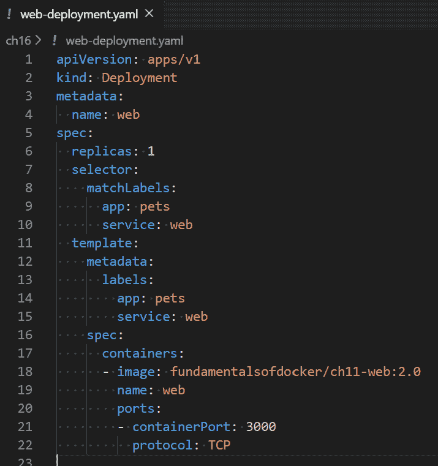用于 web 组件的 Kubernetes 部署定义

前面的部署定义可以在`~/fod/ch16`文件夹中的`web-deployment.yaml`文件中找到。代码行如下：

+   在第 4 行：我们为我们的`Deployment`对象定义了名称为`web`。

+   在第 6 行：我们声明我们想要运行一个`web`组件的实例。

+   从第 8 行到第 10 行：我们定义了哪些 pod 将成为我们部署的一部分，即那些具有`app`和`service`标签，其值分别为`pets`和`web`的 pod。

+   在第 11 行：在从第 11 行开始的 pod 模板中，我们定义每个 pod 将被应用`app`和`service`标签。

+   从第 17 行开始：我们定义将在 pod 中运行的单个容器。容器的镜像是我们熟悉的`fundamentalsofdocker/ch11-web:2.0`镜像，容器的名称将是`web`。

+   `ports`：最后，我们声明容器为 TCP 类型流量公开端口`3000`。

请确保您已将 kubectl 的上下文设置为 Minikube。有关如何执行此操作的详细信息，请参见第二章，“设置工作环境”。

我们可以使用 kubectl 部署这个 Deployment 对象：

```
$ kubectl create -f web-deployment.yaml
```

我们可以使用我们的 Kubernetes CLI 再次检查部署是否已创建。我们应该看到以下输出：

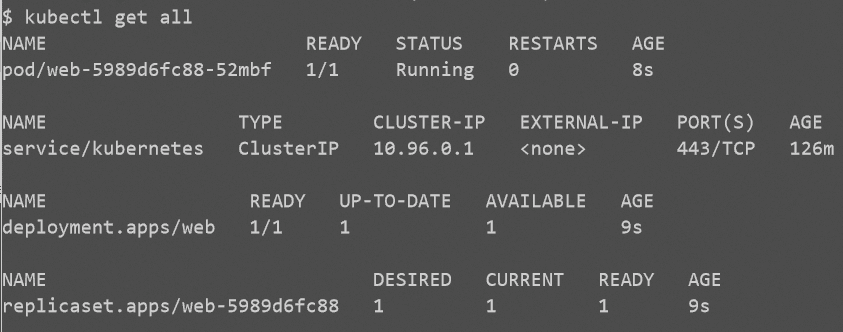列出在 Minikube 中运行的所有资源

在前面的输出中，我们可以看到 Kubernetes 创建了三个对象-部署、相关的 ReplicaSet 和一个单独的 pod（请记住，我们指定了我们只想要一个副本）。当前状态与所有三个对象的期望状态相对应，所以到目前为止一切都很好。

现在，web 服务需要暴露给公众。为此，我们需要定义一个`NodePort`类型的 Kubernetes `Service`对象。以下是定义，可以在`~/fod/ch16`文件夹中的`web-service.yaml`文件中找到：

为我们的 web 组件定义的 Service 对象

上述代码的前几行如下：

+   在第`4`行：我们将这个`Service`对象的`name`设置为`web`。

+   在第`6`行：我们定义了我们正在使用的`Service`对象的`type`。由于 web 组件必须从集群外部访问，这不能是`ClusterIP`类型的`Service`对象，必须是`NodePort`或`LoadBalancer`类型的。我们在上一章讨论了各种类型的 Kubernetes 服务，所以不会再详细讨论这个问题。在我们的示例中，我们使用了`NodePort`类型的服务。

+   在第`8`行和`9`行：我们指定我们要通过`TCP`协议公开端口`3000`。Kubernetes 将自动将容器端口`3000`映射到 30,000 到 32,768 范围内的空闲主机端口。Kubernetes 实际上选择的端口可以在创建后使用`kubectl get service`或`kubectl describe`命令来确定服务。

+   从第`10`行到`12`行：我们为这个服务定义筛选标准，以确定这个服务将作为哪些 pod 的稳定端点。在这种情况下，它是所有具有`app`和`service`标签的 pod，分别具有`pets`和`web`值。

现在我们有了一个`Service`对象的规范，我们可以使用`kubectl`来创建它：

```
$ kubectl create -f web-service.yaml
```

我们可以列出所有的服务来查看前面命令的结果：

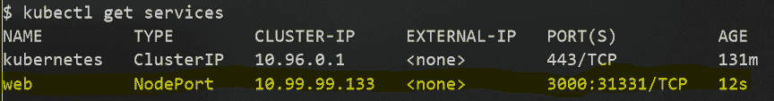为 web 组件创建的 Service 对象

在前面的输出中，我们可以看到一个名为`web`的服务已经被创建。为这个服务分配了一个唯一的`clusterIP`为`10.99.99.133`，并且容器端口`3000`已经发布到所有集群节点的端口`31331`上。

如果我们想测试这个部署，我们需要找出 Minikube 的 IP 地址，然后使用这个 IP 地址来访问我们的 web 服务。以下是我们可以用来做这件事的命令：

```
$ IP=$(minikube ip)
$ curl -4 $IP:31331/
Pets Demo Application
```

好的，响应是`Pets Demo Application`，这是我们预期的。web 服务在 Kubernetes 集群中已经启动。接下来，我们要部署数据库。

# 部署数据库

数据库是一个有状态的组件，必须与无状态的组件（如我们的 web 组件）有所不同对待。我们在第九章和第十二章中详细讨论了分布式应用架构中有状态和无状态组件的区别，以及编排器。

Kubernetes 为有状态的组件定义了一种特殊类型的 ReplicaSet 对象。这个对象被称为 StatefulSet。让我们使用这种对象来部署我们的数据库。定义可以在~fod/ch16/db-stateful-set.yaml 文件中找到。详细信息如下：

！[](assets/a0e35643-c85e-4f8d-8e9c-b62a372a42dd.png)DB 组件的 StatefulSet

好的，这看起来有点可怕，但其实并不是。由于我们还需要定义一个卷，让 PostgreSQL 数据库可以存储数据，所以它比 web 组件的部署定义要长一些。卷索赔定义在第 25 到 33 行。我们想要创建一个名为 pets-data 的卷，最大大小为 100MB。在第 22 到 24 行，我们使用这个卷并将其挂载到容器中的/var/lib/postgresql/data 目录，PostgreSQL 期望它在那里。在第 21 行，我们还声明 PostgreSQL 正在 5432 端口监听。

一如既往，我们使用 kubectl 来部署 StatefulSet：

```
$ kubectl create -f db-stateful-set.yaml
```

现在，如果我们列出集群中的所有资源，我们将能够看到已创建的附加对象。

！[](assets/65326383-101f-44f5-a370-5e936b3933fd.png)

StatefulSet 及其 pod

在这里，我们可以看到已经创建了一个 StatefulSet 和一个 pod。对于这两者，当前状态与期望状态相符，因此系统是健康的。但这并不意味着 web 组件此时可以访问数据库。服务发现到目前为止还不起作用。请记住，web 组件希望以 db 的名称访问 db 服务。

为了使服务发现在集群内部工作，我们还必须为数据库组件定义一个 Kubernetes Service 对象。由于数据库只能从集群内部访问，我们需要的 Service 对象类型是 ClusterIP。以下是规范，可以在~/fod/ch16/db-service.yaml 文件中找到：

！[](assets/50834c86-6427-4c33-b811-089547e1aef2.png)数据库的 Kubernetes Service 对象定义

数据库组件将由此 Service 对象表示，并且可以通过名称`db`访问，这是服务的名称，如第 4 行所定义。数据库组件不必是公开访问的，因此我们决定使用 ClusterIP 类型的 Service 对象。第 10 到 12 行的选择器定义了该服务代表具有相应标签的所有 Pod 的稳定端点，即`app: pets`和`service: db`。

让我们使用以下命令部署此服务：

```
$ kubectl create -f db-service.yaml
```

现在，我们应该准备好测试应用程序了。这次我们可以使用浏览器来欣赏美丽的动物图片：

在 Kubernetes 中运行宠物应用程序的测试

`172.29.64.78`是我的 Minikube 的 IP 地址。使用`minikube ip`命令验证您的地址。端口号`32722`是 Kubernetes 自动为我的`web`服务对象选择的端口号。将此数字替换为 Kubernetes 分配给您的服务的端口。您可以使用`kubectl get services`命令获取该数字。

现在，我们已成功将宠物应用程序部署到了 Minikube，这是一个单节点的 Kubernetes 集群。为此，我们必须定义四个工件，它们如下：

+   Web 组件的 Deployment 和 Service 对象

+   数据库组件的 StatefulSet 和 Service 对象

从集群中删除应用程序，我们可以使用以下小脚本：

```
kubectl delete svc/web
kubectl delete deploy/web
kubectl delete svc/db
kubectl delete statefulset/db
```

接下来，我们将简化部署。

# 简化部署

到目前为止，我们已经创建了四个需要部署到集群的工件。这只是一个非常简单的应用程序，由两个组件组成。想象一下拥有一个更复杂的应用程序。它很快就会变成一个维护的噩梦。幸运的是，我们有几种选项可以简化部署。我们将在这里讨论的方法是在 Kubernetes 中定义构成应用程序的所有组件的可能性在单个文件中。

超出本书范围的其他解决方案可能包括使用 Helm 等软件包管理器。

如果我们的应用程序由许多 Kubernetes 对象（如`Deployment`和`Service`对象）组成，那么我们可以将它们全部放在一个单独的文件中，并通过三个破折号分隔各个对象的定义。例如，如果我们想要在单个文件中为`web`组件定义`Deployment`和`Service`，则如下所示：

```
apiVersion: extensions/v1beta1
kind: Deployment
metadata:
  name: web
spec:
  replicas: 1
  selector:
    matchLabels:
      app: pets
      service: web
  template:
    metadata:
      labels:
        app: pets
        service: web
    spec:
      containers:
      - image: fundamentalsofdocker/ch11-web:2.0
        name: web
        ports:
        - containerPort: 3000
          protocol: TCP
---
apiVersion: v1
kind: Service
metadata:
  name: web
spec:
  type: NodePort
  ports:
  - port: 3000
    protocol: TCP
  selector:
    app: pets
    service: web
```

在这里，我们已经在`~/fod/ch16/pets.yaml`文件中收集了`pets`应用程序的所有四个对象定义，并且我们可以一次性部署该应用程序：

使用单个脚本部署宠物应用程序

同样，我们创建了一个名为`~/fod/ch16/remove-pets.sh`的脚本，用于从 Kubernetes 集群中删除宠物应用程序的所有构件：

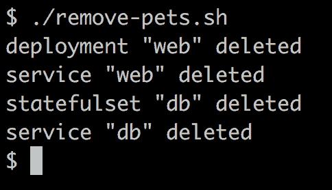从 Kubernetes 集群中删除宠物

通过这种方式，我们已经将我们在第十一章中介绍的宠物应用程序，*Docker Compose*，并定义了部署此应用程序到 Kubernetes 集群所必需的所有 Kubernetes 对象。在每个步骤中，我们确保获得了预期的结果，一旦所有构件存在于集群中，我们展示了运行中的应用程序。

# 定义存活和就绪

诸如 Kubernetes 和 Docker Swarm 之类的容器编排系统大大简化了部署、运行和更新高度分布式、使命关键的应用程序。编排引擎自动化了许多繁琐的任务，如扩展或缩减规模，确保始终保持所需状态等。

但是，编排引擎并不能自动完成所有事情。有时，我们开发人员需要提供一些只有我们才知道的信息来支持引擎。那么，我是什么意思呢？

让我们看一个单个的应用服务。假设它是一个微服务，我们称之为**服务 A**。如果我们在 Kubernetes 集群上容器化运行服务 A，那么 Kubernetes 可以确保我们在服务定义中需要的五个实例始终运行。如果一个实例崩溃，Kubernetes 可以快速启动一个新实例，从而保持所需的状态。但是，如果服务的一个实例并没有崩溃，而是不健康或者还没有准备好提供服务呢？显然，Kubernetes 应该知道这两种情况。但它不能，因为从应用服务的角度来看，健康与否是编排引擎无法知道的。只有我们应用开发人员知道我们的服务何时是健康的，何时不是。

例如，应用服务可能正在运行，但由于某些错误，其内部状态可能已经损坏，它可能陷入无限循环或死锁状态。同样，只有我们应用开发人员知道我们的服务是否准备好工作，或者它是否仍在初始化。虽然建议微服务的初始化阶段尽可能短，但如果某个特定服务需要较长的时间才能准备好运行，通常是无法避免的。处于初始化状态并不等同于不健康。初始化阶段是微服务或任何其他应用服务生命周期的预期部分。

因此，如果我们的微服务处于初始化阶段，Kubernetes 不应该试图终止它。但是，如果我们的微服务不健康，Kubernetes 应该尽快终止它，并用新实例替换它。

Kubernetes 有一个探针的概念，提供编排引擎和应用程序开发人员之间的接口。Kubernetes 使用这些探针来了解正在处理的应用服务的内部状态。探针在每个容器内部本地执行。有一个用于服务健康（也称为活跃性）的探针，一个用于启动的探针，以及一个用于服务就绪的探针。让我们依次来看看它们。

# Kubernetes 活跃性探针

Kubernetes 使用活跃探针来决定何时需要终止一个容器，以及何时应该启动另一个实例。由于 Kubernetes 在 pod 级别操作，如果其至少一个容器报告为不健康，相应的 pod 将被终止。或者，我们可以说反过来：只有当一个 pod 的所有容器报告为健康时，该 pod 才被认为是健康的。

我们可以在 pod 的规范中定义活跃探针如下：

```
apiVersion: v1
kind: Pod
metadata:
 ...
spec:
 containers:
 - name: liveness-demo
 image: postgres:12.10
 ...
 livenessProbe:
 exec:
 command: nc localhost 5432 || exit -1
 initialDelaySeconds: 10
 periodSeconds: 5
```

相关部分在`livenessProbe`部分。首先，我们定义一个命令，Kubernetes 将在容器内部执行作为探针。在我们的例子中，我们有一个 PostresSQL 容器，并使用`netcat` Linux 工具来探测 TCP 端口`5432`。一旦 Postgres 监听到它，`nc localhost 5432`命令就会成功。

另外两个设置，`initialDelaySeconds`和`periodSeconds`，定义了 Kubernetes 在启动容器后应该等待多长时间才首次执行探针，以及之后探针应该以多频率执行。在我们的例子中，Kubernetes 在启动容器后等待 10 秒才执行第一次探针，然后每 5 秒执行一次探针。

也可以探测 HTTP 端点，而不是使用命令。假设我们正在从一个镜像`acme.com/my-api:1.0`运行一个微服务，它有一个名为`/api/health`的端点，如果微服务健康则返回状态`200（OK）`，如果不健康则返回`50x（Error）`。在这里，我们可以定义活跃探针如下：

```
apiVersion: v1
kind: Pod
metadata:
  ...
spec:
  containers:
  - name: liveness
    image: acme.com/my-api:1.0
    ...
    livenessProbe:
 httpGet:
 path: /api/health
 port: 3000
 initialDelaySeconds: 5
 periodSeconds: 3
```

在上面的片段中，我已经定义了活跃探针，以便它使用 HTTP 协议，并在本地主机的端口`5000`上执行`GET`请求到`/api/health`端点。记住，探针是在容器内执行的，这意味着我可以使用本地主机。

我们也可以直接使用 TCP 协议来探测容器上的端口。但等一下，我们刚刚在我们的第一个示例中做过这个，我们使用了基于任意命令的通用活跃探针？是的，你说得对，我们做了。但我们必须依赖容器中`netcat`工具的存在才能这样做。我们不能假设这个工具总是存在。因此，依赖 Kubernetes 来为我们执行基于 TCP 的探测是有利的。修改后的 pod 规范如下：

```
apiVersion: v1kind: Pod
metadata:
 ...
spec:
 containers:
 - name: liveness-demo
   image: postgres:12.10
   ...
 livenessProbe:
 tcpSocket:
 port: 5432
 initialDelaySeconds: 10
 periodSeconds: 5
```

这看起来非常相似。唯一的变化是探针的类型已从`exec`更改为`tcpSocket`，而不是提供一个命令，我们提供了要探测的`port`。

让我们试一试：

1.  转到`~/fod/ch16/probes`文件夹，并使用以下命令构建 Docker 镜像：

```
$ docker image build -t fundamentalsofdocker/probes-demo:2.0 .
```

1.  使用`kubectl`部署在`probes-demo.yaml`中定义的示例 pod：

```
$ kubectl apply -f probes-demo.yaml
```

1.  描述 pod，特别分析输出的日志部分：

```
$ kubectl describe pods/probes-demo
```

在接下来的半分钟左右，你应该会得到以下输出：

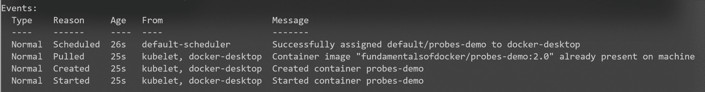

健康 pod 的日志输出

1.  等待至少 30 秒，然后再次描述 pod。这次，你应该看到以下输出：

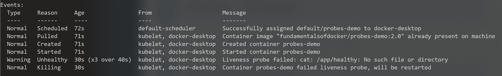将 pod 的状态更改为`Unhealthy`后的日志输出

最后两行表明了探针的失败以及 pod 将要重新启动的事实。

如果你获取 pod 列表，你会看到该 pod 已经重新启动了多次：

```
$ kubectl get pods
NAME         READY   STATUS    RESTARTS   AGE
probes-demo  1/1     Running   5          7m22s
```

当你完成示例后，使用以下命令删除 pod：

```
$ kubectl delete pods/probes-demo
```

接下来，我们将看一下 Kubernetes 的就绪探针。

# Kubernetes 就绪探针

Kubernetes 使用就绪探针来决定服务实例（即容器）何时准备好接受流量。现在，我们都知道 Kubernetes 部署和运行的是 pod 而不是容器，因此谈论 pod 的就绪性是有意义的。只有当 pod 中的所有容器报告准备就绪时，pod 才被认为是准备就绪的。如果一个 pod 报告未准备就绪，那么 Kubernetes 会将其从服务负载均衡器中移除。

就绪探针的定义方式与活跃性探针完全相同：只需将 pod 规范中的`livenessProbe`键切换为`readinessProbe`。以下是使用我们之前的 pod 规范的示例：

```
 ...
spec:
 containers:
 - name: liveness-demo
   image: postgres:12.10
   ...
   livenessProbe:
     tcpSocket:
       port: 5432
     failureThreshold: 2
     periodSeconds: 5

   readinessProbe:
 tcpSocket:
 port: 5432
 initialDelaySeconds: 10
 periodSeconds: 5
```

请注意，在这个例子中，我们不再需要活跃性探针的初始延迟，因为现在有了就绪探针。因此，我用一个名为`failureThreshold`的条目替换了活跃性探针的初始延迟条目，该条目指示 Kubernetes 在失败的情况下应重复探测多少次，直到假定容器不健康。

# Kubernetes 启动探针

对于 Kubernetes 来说，了解服务实例何时启动通常是有帮助的。如果我们为容器定义了启动探针，那么只要容器的启动探针不成功，Kubernetes 就不会执行活跃性或就绪性探针。再次强调，Kubernetes 会查看 pod，并且只有当所有 pod 容器的启动探针成功时，才会开始执行活跃性和就绪性探针。

在什么情况下会使用启动探测，考虑到我们已经有了存活性和就绪性探测？可能会出现需要考虑异常长的启动和初始化时间的情况，比如将传统应用程序容器化时。我们可以在技术上配置就绪性或存活性探测来考虑这一事实，但这将违背这些探测的目的。后者的探测旨在为 Kubernetes 提供有关容器健康和可用性的快速反馈。如果我们配置长时间的初始延迟或周期，那么这将抵消预期的结果。

毫不奇怪，启动探测的定义方式与就绪性和存活性探测完全相同。以下是一个例子：

```
spec:
  containers:
    ..
    startupProbe:
 tcpSocket:
 port: 3000
 failureThreshold: 30
 periodSeconds: 5
  ...
```

确保定义`failureThreshold * periodSeconds`产品，以便足够大以考虑最坏的启动时间。

在我们的示例中，最大启动时间不应超过 150 秒。

# 零停机部署

在关键任务环境中，应用程序始终保持运行是非常重要的。如今，我们不能再容忍任何停机时间。Kubernetes 给了我们各种手段来实现这一点。在集群中对应用程序执行不会导致停机的更新称为零停机部署。在本节中，我们将介绍两种实现这一目标的方法。这些方法如下：

+   滚动更新

+   蓝绿部署

让我们从讨论滚动更新开始。

# 滚动更新

在上一章中，我们了解到 Kubernetes 的 Deployment 对象与 ReplicaSet 对象的区别在于它在后者的功能基础上增加了滚动更新和回滚功能。让我们使用我们的 web 组件来演示这一点。显然，我们将不得不修改 web 组件的部署清单或描述。

我们将使用与上一节相同的部署定义，但有一个重要的区别 - 我们将有五个 web 组件的副本在运行。以下定义也可以在`~/fod/ch16/web-deploy-rolling-v1.yaml`文件中找到：

```
apiVersion: apps/v1
kind: Deployment
metadata:
  name: web
spec:
  replicas: 5
  selector:
    matchLabels:
      app: pets
      service: web
  template:
    metadata:
      labels:
        app: pets
        service: web
    spec:
      containers:
      - image: fundamentalsofdocker/ch11-web:2.0
        name: web
        ports:
        - containerPort: 3000
          protocol: TCP
```

现在，我们可以像往常一样创建这个部署，同时也创建使我们的组件可访问的服务：

```
$ kubectl create -f web-deploy-rolling-v1.yaml
$ kubectl create -f web-service.yaml
```

一旦我们部署了 pod 和服务，我们可以使用以下命令测试我们的 web 组件：

```
$ PORT=$(kubectl get svc/web -o yaml | grep nodePort | cut -d' ' -f5)
$ IP=$(minikube ip)
$ curl -4 ${IP}:${PORT}/
Pets Demo Application
```

我们可以看到，应用程序正在运行，并返回预期的消息`Pets Demo Application`。

现在，我们的开发人员已经创建了一个新版本 2.1 的`web`组件。新版本的`web`组件的代码可以在`~/fod/ch16/web`文件夹中找到，唯一的更改位于`server.js`文件的第 12 行：

Web 组件 2.0 版本的代码更改

开发人员已经按以下方式构建了新的镜像：

```
$ docker image build -t fundamentalsofdocker/ch16-web:2.1 web
```

随后，他们将镜像推送到 Docker Hub，如下所示：

```
$ docker image push fundamentalsofdocker/ch16-web:2.1
```

现在，我们想要更新`web`部署对象中的 pod 所使用的镜像。我们可以使用`kubectl`的`set image`命令来实现这一点：

```
$ kubectl set image deployment/web \
 web=fundamentalsofdocker/ch16-web:2.1
```

如果我们再次测试应用程序，我们将得到一个确认，更新确实已经发生：

```
$ curl -4 ${IP}:${PORT}/
Pets Demo Application v2
```

现在，我们如何知道在此更新过程中没有发生任何停机时间？更新确实是以滚动方式进行的吗？滚动更新到底意味着什么？让我们来调查一下。首先，我们可以通过使用`rollout status`命令从 Kubernetes 那里得到确认，部署确实已经发生并且成功了：

```
$ kubectl rollout status deploy/web
deployment "web" successfully rolled out
```

如果我们用`kubectl describe deploy/web`描述部署 web，我们会在输出的最后得到以下事件列表：

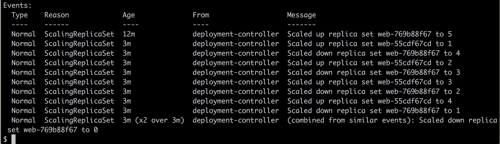Web 组件部署描述输出中找到的事件列表

第一个事件告诉我们，在创建部署时，一个名为`web-769b88f67`的 ReplicaSet 被创建，有五个副本。然后，我们执行了更新命令。列表中的第二个事件告诉我们，这意味着创建一个名为`web-55cdf67cd`的新 ReplicaSet，最初只有一个副本。因此，在那个特定的时刻，系统上存在六个 pod：五个初始 pod 和一个具有新版本的 pod。但是，由于部署对象的期望状态指定我们只想要五个副本，Kubernetes 现在将旧的 ReplicaSet 缩减到四个实例，我们可以在第三个事件中看到。

然后，新的 ReplicaSet 再次扩展到两个实例，随后，旧的 ReplicaSet 缩减到三个实例，依此类推，直到我们有了五个新实例，所有旧实例都被废弃。虽然我们无法看到确切的时间（除了 3 分钟），这发生的顺序告诉我们整个更新是以滚动方式进行的。

在短时间内，对 web 服务的一些调用可能会得到来自组件的旧版本的答复，而一些调用可能会得到来自组件的新版本的答复，但是服务从未中断。

我们还可以列出集群中的 ReplicaSet 对象，并确认我在前面部分所说的内容：

列出集群中的所有 ReplicaSet 对象

在这里，我们可以看到新的 ReplicaSet 有五个实例在运行，而旧的 ReplicaSet 已被缩减为零个实例。旧的 ReplicaSet 对象仍然存在的原因是 Kubernetes 为我们提供了回滚更新的可能性，在这种情况下，将重用该 ReplicaSet。

为了回滚图像的更新，以防一些未被检测到的错误潜入新代码，我们可以使用`rollout undo`命令：

```
$ kubectl rollout undo deploy/web
deployment "web"
$ curl -4 ${IP}:${PORT}/
Pets Demo Application
```

我还在前面的片段中列出了使用`curl`进行测试的命令，以验证回滚确实发生了。如果我们列出 ReplicaSets，我们将看到以下输出：

回滚后列出 ReplicaSet 对象

这证实了旧的 ReplicaSet（`web-769b88f67`）对象已被重用，新的 ReplicaSet 已被缩减为零个实例。

然而，有时我们不能或不想容忍旧版本与新版本共存的混合状态。我们希望采取“全有或全无”的策略。这就是蓝绿部署发挥作用的地方，接下来我们将讨论这个问题。

# 蓝绿部署

如果我们想要为宠物应用程序的 web 组件执行蓝绿部署，那么我们可以通过创造性地使用标签来实现。首先，让我们回顾一下蓝绿部署的工作原理。以下是一个大致的逐步说明：

1.  部署`web`组件的第一个版本为`blue`。我们将使用`color: blue`标签为 pod 打上标签。

1.  使用`color: blue`标签在选择器部分为这些 pod 部署 Kubernetes 服务。

1.  现在，我们可以部署版本 2 的 web 组件，但是这一次，pod 的标签是`color: green`。

1.  我们可以测试服务的绿色版本，以检查它是否按预期工作。

1.  现在，我们通过更新 web 组件的 Kubernetes 服务，将流量从蓝色切换到绿色。我们修改选择器，使其使用`color: green`标签。

让我们为版本 1（蓝色）定义一个 Deployment 对象：

Web 组件的蓝色部署规范

前面的定义可以在`~/fod/ch16/web-deploy-blue.yaml`文件中找到。请注意第 4 行，我们在那里定义了部署的名称为`web-blue`，以区分它与即将到来的部署`web-green`。还要注意，我们在第 11 行和第 17 行添加了标签`color: blue`。其他一切与以前一样。

现在，我们可以为 Web 组件定义 Service 对象。它将与之前使用的相同，但有一个小改变，如下面的屏幕截图所示：

Kubernetes 服务支持蓝绿部署的 Web 组件

关于我们在本章前面使用的服务定义的唯一区别是第 13 行，它在选择器中添加了`color: blue`标签。我们可以在`~/fod/ch16/web-svc-blue-green.yaml`文件中找到前面的定义。

然后，我们可以使用以下命令部署 Web 组件的蓝色版本：

```
$ kubectl create -f web-deploy-blue.yaml
$ kubectl create -f web-svc-blue-green.yaml
```

一旦服务启动运行，我们可以确定其 IP 地址和端口号并进行测试：

```
$ PORT=$(kubectl get svc/web -o yaml | grep nodePort | cut -d' ' -f5)
$ IP=$(minikube ip)
$ curl -4 ${IP}:${PORT}/
Pets Demo Application
```

正如预期的那样，我们得到了“宠物演示应用程序”的响应。现在，我们可以部署 Web 组件的绿色版本。其部署对象的定义可以在`~/fod/ch16/web-deploy-green.yaml`文件中找到，如下所示：

部署绿色 Web 组件的规范

有趣的行如下：

+   第 4 行：命名为`web-green`以区分它与`web-blue`并允许并行安装

+   第 11 行和第 17 行：颜色为绿色

+   第 20 行：现在使用图像的 2.1 版本

现在，我们准备部署这个绿色版本的服务。它应该与蓝色服务分开运行。

```
$ kubectl create -f web-deploy-green.yaml
```

我们可以确保两个部署共存如下：

显示在集群中运行的部署对象列表

正如预期的那样，蓝色和绿色都在运行。我们可以验证蓝色仍然是活动服务：

```
$ curl -4 ${IP}:${PORT}/
Pets Demo Application
```

现在是有趣的部分。我们可以通过编辑 Web 组件的现有服务将流量从蓝色切换到绿色。为此，请执行以下命令：

```
$ kubectl edit svc/web
```

将标签颜色的值从蓝色更改为绿色。然后保存并退出编辑器。Kubernetes CLI 将自动更新服务。现在再次查询 web 服务时，我们会得到这个：

```
$ curl -4 ${IP}:${PORT}/
Pets Demo Application v2
```

这证实了流量确实已经切换到 web 组件的绿色版本（注意响应`curl`命令末尾的`v2`）。

如果我们意识到我们的绿色部署出了问题，新版本有缺陷，我们可以通过再次编辑服务 web 并将标签颜色的值替换为蓝色，轻松地切换回蓝色版本。这种回滚是瞬时的，应该总是有效的。然后，我们可以移除有问题的绿色部署并修复组件。当我们纠正了问题后，我们可以再次部署绿色版本。

一旦组件的绿色版本按预期运行并表现良好，我们可以停用蓝色版本：

```
$ kubectl delete deploy/web-blue
```

当我们准备部署新版本 3.0 时，这个版本成为蓝色版本。我们相应地更新`~/fod/ch16/web-deploy-blue.yaml`文件并部署它。然后，我们将服务 web 从绿色切换到蓝色，依此类推。

我们已经成功地演示了在 Kubernetes 集群中如何实现蓝绿部署，使用了宠物应用程序的 web 组件。

# Kubernetes 秘密

有时，我们希望在 Kubernetes 集群中运行的服务必须使用诸如密码、秘密 API 密钥或证书等机密数据。我们希望确保这些敏感信息只能被授权或专用服务看到。集群中运行的所有其他服务都不应该访问这些数据。

因此，Kubernetes 引入了秘密。秘密是一个键值对，其中键是秘密的唯一名称，值是实际的敏感数据。秘密存储在 etcd 中。Kubernetes 可以配置为在休息时加密秘密，即在 etcd 中，以及在传输时，即当秘密从主节点传输到运行使用该秘密的服务的工作节点时。

# 手动定义秘密

我们可以像在 Kubernetes 中创建任何其他对象一样，声明性地创建一个秘密。以下是这样一个秘密的 YAML：

```
apiVersion: v1
kind: Secret
metadata:
  name: pets-secret
type: Opaque
data:
  username: am9obi5kb2UK
  password: c0VjcmV0LXBhc1N3MHJECg==
```

前面的定义可以在`~/fod/ch16/pets-secret.yaml`文件中找到。现在，你可能想知道这些值是什么。这些是真实的（未加密）值吗？不，不是。它们也不是真正加密的值，而只是 base64 编码的值。因此，它们并不是真正安全的，因为 base64 编码的值可以很容易地恢复为明文值。我是如何得到这些值的？很简单：按照以下步骤：

1.  使用`base64`工具如下编码值：

创建秘密的 base64 编码值

1.  使用前面的值，我们可以创建秘密并描述它：

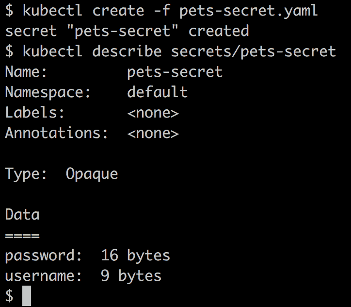创建和描述 Kubernetes 秘密

1.  在秘密的描述中，值是隐藏的，只给出了它们的长度。所以，也许现在秘密是安全的？不，不是真的。我们可以很容易地使用`kubectl get`命令解码这个秘密：

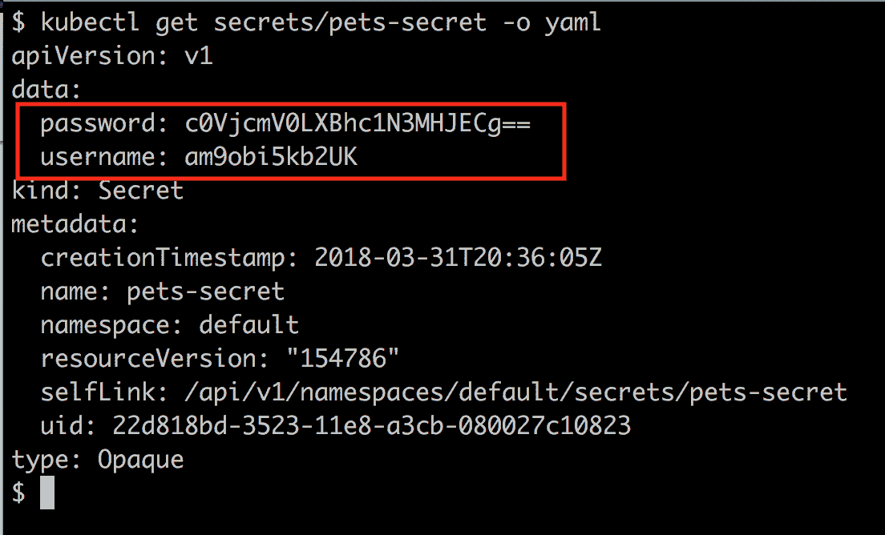Kubernetes 秘密解码

正如我们在前面的截图中看到的，我们恢复了我们的原始秘密值。

1.  解码之前获得的值：

```
$ echo "c0VjcmV0LXBhc1N3MHJECg==" | base64 --decode
sEcret-pasSw0rD
```

因此，这种创建 Kubernetes 的方法的后果是不应该在除了开发环境之外的任何环境中使用，我们在那里处理非敏感数据。在所有其他环境中，我们需要更好的方法来处理秘密。

# 使用 kubectl 创建秘密

定义秘密的一个更安全的方法是使用`kubectl`。首先，我们创建包含 base64 编码的秘密值的文件，类似于我们在前面的部分所做的，但是这次，我们将值存储在临时文件中：

```
$ echo "sue-hunter" | base64 > username.txt
$ echo "123abc456def" | base64 > password.txt
```

现在，我们可以使用`kubectl`从这些文件中创建一个秘密，如下所示：

```
$ kubectl create secret generic pets-secret-prod \
 --from-file=./username.txt \
 --from-file=./password.txt
secret "pets-secret-prod" created
```

秘密可以像手动创建的秘密一样使用。

你可能会问，为什么这种方法比另一种方法更安全？首先，没有定义秘密并存储在一些源代码版本控制系统（如 GitHub）中的 YAML，许多人都可以访问并查看和解码秘密。只有被授权知道秘密的管理员才能看到它们的值并直接在（生产）集群中创建秘密。集群本身受基于角色的访问控制的保护，因此未经授权的人员无法访问它，也无法解码集群中定义的秘密。

现在，让我们看看我们如何实际使用我们定义的秘密。

# 在 pod 中使用秘密

假设我们想要创建一个`Deployment`对象，其中`web`组件使用我们在前一节中介绍的秘密`pets-secret`。我们可以使用以下命令在集群中创建秘密：

```
$ kubectl create -f pets-secret.yaml
```

在`~/fod/ch16/web-deploy-secret.yaml`文件中，我们可以找到`Deployment`对象的定义。我们不得不添加从第`23`行开始的部分到`Deployment`对象的原始定义中：

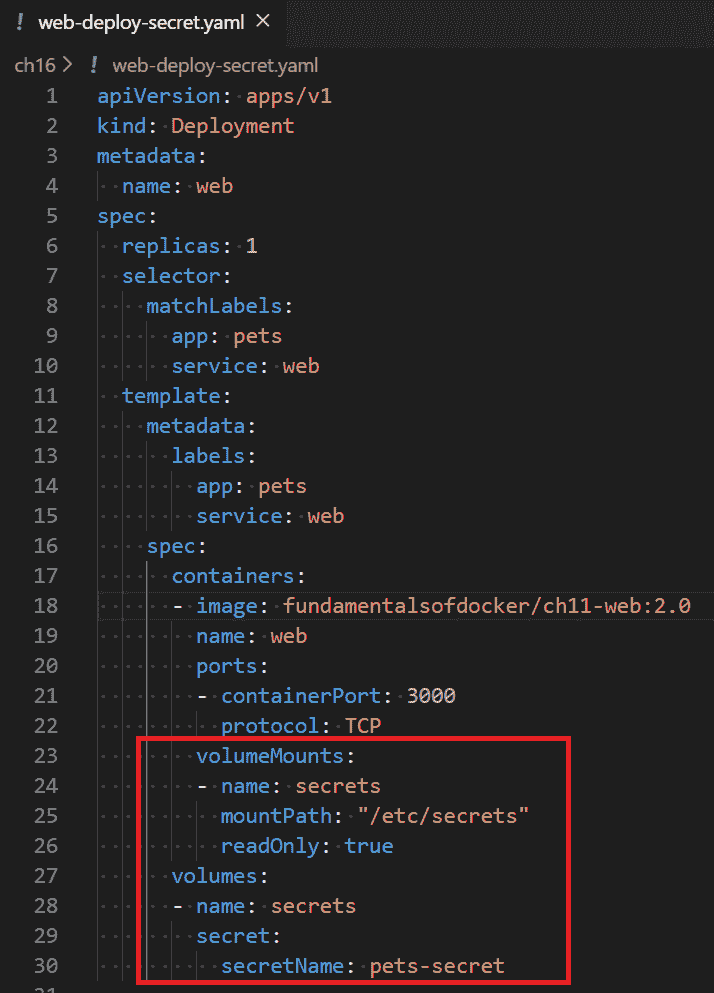带有秘密的 web 组件的部署对象

在第`27`到`30`行，我们定义了一个名为`secrets`的卷，来自我们的秘密`pets-secret`。然后，我们在容器中使用这个卷，如第`23`到`26`行所述。我们在容器文件系统中挂载秘密到`/etc/secrets`，并且以只读模式挂载卷。因此，秘密值将作为文件出现在容器中的文件夹中。文件的名称将对应于键名，文件的内容将是相应键的值。这些值将以未加密的形式提供给容器内运行的应用程序。

在我们的情况下，由于我们在秘密中有`username`和`password`键，我们将在容器文件系统的`/etc/secrets`文件夹中找到两个文件，名为`username`和`password`。`username`文件应包含值`john.doe`，`password`文件应包含值`sEcret-pasSw0rD`。这是确认：

确认秘密在容器内可用

在前面输出的第`1`行，我们`exec`进入 web 组件运行的容器。然后，在第`2`到`5`行，我们列出了`/etc/secrets`文件夹中的文件，最后，在第`6`到`8`行，我们显示了两个文件的内容，毫不奇怪地显示了明文的秘密值。

由于任何语言编写的应用程序都可以读取简单的文件，因此使用秘密的这种机制非常向后兼容。甚至一个老的 Cobol 应用程序也可以从文件系统中读取明文文件。

然而，有时应用程序希望秘密以环境变量的形式可用。让我们看看 Kubernetes 在这种情况下为我们提供了什么。

# 环境变量中的秘密值

假设我们的 web 组件期望在环境变量`PETS_USERNAME`中找到用户名，在`PETS_PASSWORD`中找到密码。如果是这种情况，我们可以修改我们的部署 YAML 文件，使其如下所示：

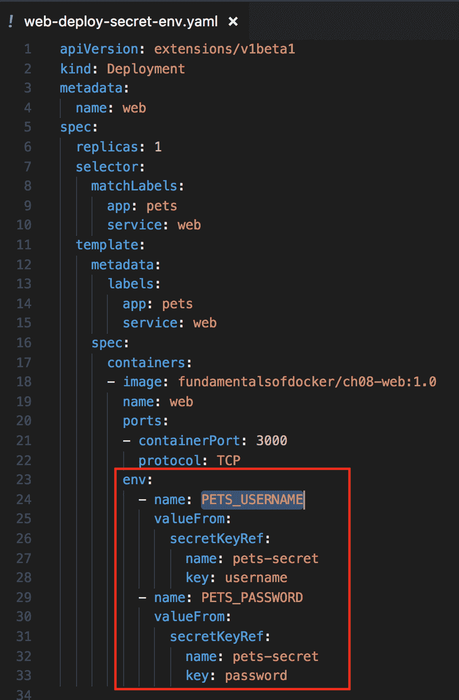部署映射秘密值到环境变量

在第 23 到 33 行，我们定义了两个环境变量`PETS_USERNAME`和`PETS_PASSWORD`，并将`pets-secret`的相应键值对映射到它们。

请注意，我们不再需要卷；相反，我们直接将`pets-secret`的各个键映射到容器内部有效的相应环境变量中。以下命令序列显示了秘密值确实在容器内部作为相应的环境变量可用：

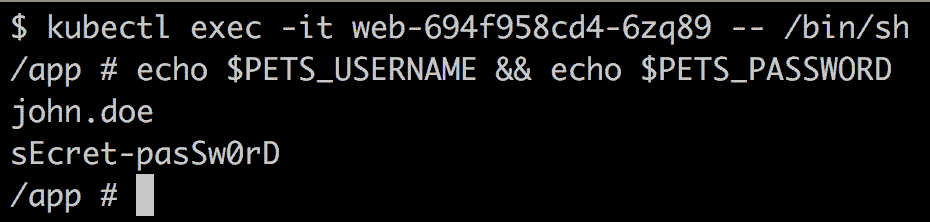秘密值映射到环境变量

在本节中，我们向您展示了如何在 Kubernetes 集群中定义秘密，并如何在作为部署的一部分运行的容器中使用这些秘密。我们展示了两种在容器内部映射秘密的变体，第一种使用文件，第二种使用环境变量。

# 总结

在本章中，我们学习了如何将应用程序部署到 Kubernetes 集群中，以及如何为该应用程序设置应用程序级别的路由。此外，我们还学习了如何在 Kubernetes 集群中运行的应用程序服务中进行更新而不会造成任何停机时间。最后，我们使用秘密来向运行在集群中的应用程序服务提供敏感信息。

在下一章中，我们将学习有关用于监视在 Kubernetes 集群上运行的单个服务或整个分布式应用程序的不同技术。我们还将学习如何在生产环境中运行的应用程序服务进行故障排除，而不会改变集群或运行服务的集群节点。敬请关注。

# 问题

为了评估你的学习进度，请回答以下问题：

1.  你有一个由两个服务组成的应用程序，第一个是 web API，第二个是一个数据库，比如 Mongo DB。你想将这个应用程序部署到 Kubernetes 集群中。简要解释一下你会如何进行。

1.  描述一下你需要哪些组件才能为你的应用程序建立第 7 层（或应用程序级）路由。

1.  列出实施简单应用服务的蓝绿部署所需的主要步骤。避免过多细节。

1.  您将通过 Kubernetes 秘密向应用服务提供三到四种类型的信息。

1.  Kubernetes 在创建秘密时接受哪些来源的名称。

# 进一步阅读

以下是一些链接，提供了本章讨论的主题的更多信息：

+   执行滚动更新：[`bit.ly/2o2okEQ`](https://bit.ly/2o2okEQ)

+   蓝绿部署：[`bit.ly/2r2IxNJ`](https://bit.ly/2r2IxNJ)

+   Kubernetes 中的秘密：[`bit.ly/2C6hMZF`](https://bit.ly/2C6hMZF)
