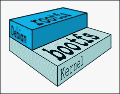
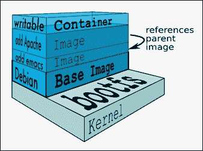

# 第二章：处理 Docker 容器

在上一章中，我们解释了激动人心和可持续的概念，展示了 Docker 打造未来和灵活的应用感知容器的方式。我们讨论了在多个环境（本地和离线）中生成 Docker 容器的所有相关细节。使用这些技术，您可以轻松地在自己的环境中复制这些功能，获得丰富的体验。因此，我们的下一步是以果断的方式了解容器的生命周期方面。您将学习如何以有效和无风险的方式最佳利用我们自己的容器以及其他第三方容器。容器可以被发现、评估、访问和利用，以实现更大更好的应用。出现了几种工具来简化容器的处理。

在本章中，我们将深入挖掘并详细描述容器处理的关键方面。本章还将讨论一些实用技巧和执行命令，以利用容器。

在这一章中，我们将涵盖以下主题：

+   澄清 Docker 术语

+   与 Docker 镜像和容器一起工作

+   Docker 注册表及其存储库的含义

+   Docker Hub 注册表

+   搜索 Docker 镜像

+   与交互式容器一起工作

+   跟踪容器内部的变化

+   控制和管理 Docker 容器

+   从容器构建镜像

+   将容器作为守护进程启动

# 澄清 Docker 术语

为了使本章更易于理解并尽量减少任何形式的歧义，常用术语将在下一节中解释。

## Docker 镜像和容器

Docker 镜像是构成软件应用程序的所有文件的集合。对原始镜像所做的每个更改都存储在单独的层中。准确地说，任何 Docker 镜像都必须源自基础镜像，根据各种要求。可以附加额外的模块到基础镜像，以派生出可以展现所需行为的各种镜像。每次提交到 Docker 镜像时，都会在 Docker 镜像上创建一个新的层，但原始镜像和每个现有的层都保持不变。换句话说，镜像通常是只读类型的。如果它们通过系统化附加新模块的方式得到增强，那么将创建一个带有新名称的新镜像。Docker 镜像正在成为开发和部署 Docker 容器的可行基础。

这里展示了一个基础镜像。Debian 是基础镜像，可以在基础镜像上合并各种所需的功能模块，以得到多个镜像：



每个镜像都有一个唯一的`ID`，如下一节所述。基础镜像可以进行增强，以便它们可以创建父镜像，而父镜像反过来可以用于创建子镜像。基础镜像没有任何父级，也就是说，父镜像位于基础镜像之上。当我们使用一个镜像时，如果没有通过适当的标识（比如一个新名称）指定该镜像，那么 Docker 引擎将始终识别并使用`latest`镜像（最近生成的）。

根据 Docker 官网，Docker 镜像是一个只读模板。例如，一个镜像可以包含一个 Ubuntu 操作系统，上面安装了 Apache 和你的 Web 应用程序。Docker 提供了一种简单的方法来构建新的镜像或更新现有的镜像。你也可以下载其他人已经创建的 Docker 镜像。Docker 镜像是 Docker 容器的构建组件。一般来说，基础 Docker 镜像代表一个操作系统，在 Linux 的情况下，基础镜像可以是其发行版之一，比如 Debian。向基础镜像添加额外的模块最终形成一个容器。最简单的想法是，容器是一个位于一个或多个只读镜像上的读写层。当容器运行时，Docker 引擎不仅将所有所需的镜像合并在一起，还将读写层的更改合并到容器本身。这使得它成为一个自包含、可扩展和可执行的系统。可以使用 Docker 的`docker commit`子命令来合并更改。新容器将容纳对基础镜像所做的所有更改。新镜像将形成基础镜像的新层。

下图将清楚地告诉你一切。基础镜像是**Debian**发行版，然后添加了两个镜像（**emacs**和**Apache**服务器），这将导致容器：



每次提交都会生成一个新镜像。这使得镜像数量稳步增加，因此管理它们变得复杂。然而，存储空间并不是一个大挑战，因为生成的新镜像只包括新添加的模块。在某种程度上，这类似于云环境中流行的对象存储。每次更新对象，都会创建一个带有最新修改的新对象，然后以新的`ID`存储。在对象存储的情况下，存储大小会显著增加。

## 一个 Docker 层

一个**Docker 层**可以代表只读镜像或读写镜像。然而，容器堆栈的顶层始终是读写（可写）层，其中托管着一个 Docker 容器。

## 一个 Docker 容器

从前面的图表可以看出，读写层是容器层。容器层下面可能有几个只读镜像。通常，容器是通过 `commit` 操作从只读镜像创建的。当您 `start` 一个容器时，实际上是通过其唯一的 `ID` 引用一个镜像。Docker 拉取所需的镜像及其父镜像。它继续拉取所有父镜像，直到达到基础镜像。

## Docker 注册表

**Docker 注册表**是 Docker 镜像可以存储的地方，以便全球开发人员可以快速创建新的复合应用程序，而不会有任何风险。因为所有存储的镜像都经过多次验证、核实和完善，这些镜像的质量将非常高。使用 Docker `push` 命令，您可以将 Docker 镜像发送到注册表，以便注册和存储。澄清一下，注册表是用于注册 Docker 镜像的，而仓库是用于在公开可发现和集中的位置存储这些已注册的 Docker 镜像。Docker 镜像存储在 Docker 注册表中的仓库中。每个用户或帐户的仓库都是唯一的。

## Docker 仓库

**Docker 仓库**是用于存储 Docker 镜像的命名空间。例如，如果您的应用程序命名为 `helloworld`，并且您的用户名或注册表的命名空间为 `thedockerbook`，那么在 Docker 仓库中，此镜像将存储在 Docker 注册表中，命名为 `thedockerbook/helloworld`。

基础镜像存储在 Docker 仓库中。基础镜像是实现更大更好镜像的源泉，通过谨慎添加新模块来帮助实现。子镜像是具有自己父镜像的镜像。基础镜像没有任何父镜像。坐在基础镜像上的镜像被称为父镜像，因为父镜像承载着子镜像。

# 使用 Docker 镜像

在上一章中，我们通过使用`busybox`镜像演示了典型的`Hello World!`示例。现在需要仔细观察`docker pull`子命令的输出，这是一个用于下载 Docker 镜像的标准命令。您可能已经注意到输出文本中存在`busybox:latest`的文本，我们将通过对`docker pull`子命令添加`-a`选项来详细解释这个谜团。

```
**$ sudo docker pull -a busybox**

```

令人惊讶的是，您会发现 Docker 引擎使用`-a`选项下载了更多的镜像。您可以通过运行`docker images`子命令轻松检查 Docker 主机上可用的镜像，这非常方便，并且通过运行此命令可以揭示有关`:latest`和其他附加镜像的更多细节。让我们运行这个命令：

```
**$ sudo docker images**

```

您将获得以下镜像列表：

```
**REPOSITORY TAG                  IMAGE ID      CREATED       VIRTUAL SIZE**
**busybox    ubuntu-14.04         f6169d24347d  3 months ago  5.609 MB**
**busybox    ubuntu-12.04         492dad4279ba  3 months ago  5.455 MB**
**busybox    buildroot-2014.02    4986bf8c1536  3 months ago  2.433 MB**
**busybox    latest               4986bf8c1536  3 months ago  2.433 MB**
**busybox    buildroot-2013.08.1  2aed48a4e41d  3 months ago  2.489 MB**

```

显然，我们在前面的列表中有五个项目，为了更好地理解这些项目，我们需要理解 Docker images 子命令打印出的信息。以下是可能的类别列表：

+   `仓库`: 这是仓库或镜像的名称。在前面的例子中，仓库名称是`busybox`。

+   `标签`: 这是与镜像相关联的标签，例如`buildroot-2014.02`，`ubuntu-14.04`，`latest`。一个镜像可以关联一个或多个标签。

### 注意

以`ubuntu-`*标记的镜像是使用`busybox-static` Ubuntu 软件包构建的，以`buildroot-`*标记的镜像是使用`buildroot`工具链从头开始构建的。

+   `镜像 ID`: 每个镜像都有一个唯一的`ID`。镜像`ID`由一个 64 位十六进制长的随机数表示。默认情况下，Docker images 子命令只会显示 12 位十六进制数。您可以使用`--no-trunc`标志显示所有 64 位十六进制数（例如：`sudo docker images --no-trunc`）。

+   `创建时间`: 表示镜像创建的时间。

+   `虚拟大小`: 突出显示镜像的虚拟大小。

也许您会想知道，在前面的例子中，一个带有`-a`选项的`pull`命令是如何能够下载五个镜像的，尽管我们只指定了一个名为`busybox`的镜像。这是因为每个 Docker 镜像存储库都可以有同一镜像的多个变体，`-a`选项会下载与该镜像相关的所有变体。在前面的例子中，这些变体被标记为`buildroot-2013.08.1`、`ubuntu-14.04`、`ubuntu-12.04`、`buildroot-2014.02`和`latest`。对镜像 ID 的仔细观察将揭示`buildroot-2014.02`和`latest`共享镜像 ID`4986bf8c1536`。

默认情况下，Docker 始终使用标记为`latest`的镜像。每个镜像变体都可以通过其标签直接识别。可以通过在标签和存储库名称之间添加`:`来将镜像标记为合格。例如，您可以使用`busybox:ubuntu-14.04`标签启动一个容器，如下所示：

```
**$ sudo docker run -t -i busybox:ubuntu-14.04**

```

`docker pull`子命令将始终下载具有该存储库中`latest`标签的镜像变体。但是，如果您选择下载除最新版本之外的其他镜像变体，则可以通过使用以下命令来限定镜像的标签名称来执行此操作：

```
**$ sudo docker pull busybox:ubuntu-14.04**

```

## Docker Hub 注册表

在上一节中，当您运行`docker pull`子命令时，`busybox`镜像神秘地被下载了。在本节中，让我们揭开`docker pull`子命令周围的神秘，并且 Docker Hub 对这一意外成功做出了巨大贡献。

Docker 社区的热心人士已经构建了一个镜像存储库，并且已经将其公开放置在默认位置`index.docker.io`。这个默认位置称为 Docker 索引。`docker pull`子命令被编程为在此位置查找镜像。因此，当您`pull`一个`busybox`镜像时，它会轻松地从默认注册表中下载。这种机制有助于加快 Docker 容器的启动速度。Docker Index 是官方存储库，其中包含由全球 Docker 开发社区创建和存放的所有经过精心策划的镜像。

这所谓的治疗措施是为了确保存储在 Docker 索引中的所有镜像都通过一系列隔离任务是安全的。有经过验证和验证的方法来清理任何故意或无意引入的恶意软件、广告软件、病毒等等，从这些 Docker 镜像中。数字签名是 Docker 镜像的最高完整性的突出机制。然而，如果官方镜像已经被损坏或篡改，那么 Docker 引擎将发出警告，然后继续运行镜像。

除了官方存储库之外，Docker Hub 注册表还为第三方开发人员和提供商提供了一个平台，供他们共享供一般用户使用的镜像。第三方镜像以其开发人员或存款人的用户 ID 为前缀。例如，`thedockerbook/helloworld`是一个第三方镜像，其中`thedockerbook`是用户 ID，`helloworld`是镜像存储库名称。您可以使用`docker pull`子命令下载任何第三方镜像，如下所示：

```
**$ sudo docker pull thedockerbook/helloworld**

```

除了前面的存储库之外，Docker 生态系统还提供了一种利用来自 Docker Hub 注册表以外的任何第三方存储库中的镜像的机制，并且它还提供了本地存储库中托管的镜像。如前所述，Docker 引擎默认情况下已编程为在`index.docker.io`中查找镜像，而在第三方或本地存储库中，我们必须手动指定应从哪里拉取镜像的路径。手动存储库路径类似于没有协议说明符的 URL，例如`https://`、`http://`和`ftp://`。以下是从第三方存储库中拉取镜像的示例：

```
**$ sudo docker pull registry.example.com/myapp**

```

## 搜索 Docker 镜像

正如我们在前一节中讨论的，Docker Hub 存储库通常托管官方镜像以及由第三方 Docker 爱好者贡献的镜像。在撰写本书时，超过 14,000 个镜像（也称为 Docker 化应用程序）可供用户使用。这些镜像可以直接使用，也可以作为用户特定应用程序的构建块使用。

您可以使用`docker search`子命令在 Docker Hub 注册表中搜索 Docker 镜像，如本示例所示：

```
**$ sudo docker search mysql**

```

在`mysql`上的搜索将列出 400 多个镜像，如下所示：

```
**NAME             DESCRIPTION          STARS  OFFICIAL   AUTOMATED**
**mysql            MySQL is the...      147    [OK]**
**tutum/mysql      MySQL Server..       60                [OK]**
**orchardup/mysql                       34                [OK]**
**. . . OUTPUT TRUNCATED . . .**

```

如前面的搜索输出摘录所示，图像是根据其星级排序的。搜索结果还表明图像是否官方。为了保持专注，在这个例子中，我们将只显示两个图像。在这里，您可以看到`mysql`的官方版本，它拉取了一个`147`星级的图像作为其第一个结果。第二个结果显示，这个版本的`mysql`图像是由用户`tutum`发布的。Docker 容器正迅速成为分布式应用程序的标准构建块。借助全球许多社区成员的热情贡献，将实现 Docker 图像的动态存储库。基于存储库的软件工程将使用户和程序员更容易快速编写和组装他们的项目。官方存储库可以免费从 Docker Hub Registry 下载，这些是经过策划的图像。它们代表了一个专注于为应用程序提供良好图像基础的社区努力，以便开发人员和系统管理员可以专注于构建新功能和功能，同时最大程度地减少他们在商品脚手架和管道上的重复工作。

根据 Docker Hub Registry 中的搜索查询和与许多开发人员社区成员的讨论，Docker 公司强有力而充满激情地领导了 Docker 运动，得出结论，开发人员社区希望获得他们最喜爱的编程语言的预构建堆栈。具体来说，开发人员希望尽快开始编写代码，而不浪费时间与环境、脚手架和依赖进行斗争。

# 与交互式容器一起工作

在第一章中，我们运行了我们的第一个`Hello World!`容器，以了解容器化技术的工作原理。在本节中，我们将以交互模式运行一个容器。`docker run`子命令以镜像作为输入，并将其作为容器启动。您必须在 docker run 子命令中传递`-t`和`-i`标志，以使容器变为交互式。`-i`标志是关键驱动程序，它通过获取容器的标准输入（`STDIN`）使容器变得交互式。`-t`标志分配一个伪 TTY 或伪终端（终端仿真器），然后将其分配给容器。

在下面的示例中，我们将使用`ubuntu:14.04`镜像和`/bin/bash`作为命令启动一个交互式容器：

```
**$ sudo docker run -i -t ubuntu:14.04 /bin/bash**

```

由于`ubuntu`镜像尚未下载，如果我们使用`docker pull`子命令，那么我们将收到以下消息，并且`run`命令将自动开始拉取`ubuntu`镜像，并显示以下消息：

```
**Unable to find image 'ubuntu:14.04' locally**
**Pulling repository ubuntu**

```

一旦下载完成，容器将与`ubuntu:14.04`镜像一起启动。它还将在容器内启动一个 bash shell，因为我们已指定`/bin/bash`作为要执行的命令。这将使我们进入一个 bash 提示符，如下所示：

```
**root@742718c21816:/#**

```

前面的 bash 提示将确认我们的容器已成功启动，并且准备好接受我们的输入。如果您对提示中的十六进制数字`742718c21816`感到困惑，那么它只是容器的主机名。在 Docker 术语中，主机名与容器`ID`相同。

让我们快速交互式地运行一些命令，然后确认我们之前提到的提示是正确的，如下所示：

```
**root@742718c21816:/# hostname**
**742718c21816**
**root@742718c21816:/# id**
**uid=0(root) gid=0(root) groups=0(root)**
**root@742718c21816:/# echo $PS1**
**${debian_chroot:+($debian_chroot)}\u@\h:\w\$**
**root@742718c21816:/#**

```

从前面的三个命令可以清楚地看出，提示是通过使用用户 ID、主机名和当前工作目录组成的。

现在，让我们使用 Docker 的一个特色功能，将其从交互式容器中分离出来，然后查看 Docker 为该容器管理的细节。是的，我们可以通过使用*Ctrl* + *P*和*Ctrl* + *Q*转义序列将其从容器中分离出来。这个转义序列将从容器中分离 TTY，并将我们置于 Docker 主机提示符`$`中，但是容器将继续运行。`docker ps`子命令将列出所有正在运行的容器及其重要属性，如下所示：

```
**$ sudo docker ps**
**CONTAINER ID        IMAGE               COMMAND             CREATED              STATUS              PORTS               NAMES**
**742718c21816        ubuntu:14.04        "/bin/bash"         About a minute ago   Up About a minute                       jolly_lovelace**

```

`docker ps`子命令将列出以下详细信息：

+   `容器 ID`：这显示了与容器关联的容器`ID`。容器`ID`是一个 64 位十六进制长随机数。默认情况下，`docker ps`子命令将只显示 12 位十六进制数。您可以使用`--no-trunc`标志显示所有 64 位数字（例如：`sudo docker ps --no-trunc`）。

+   `镜像`：这显示了 Docker 容器所制作的镜像。

+   `命令`：这显示了容器启动期间执行的命令。

+   `创建时间`：这告诉您容器何时创建。

+   `状态`：这告诉您容器的当前状态。

+   `PORTS`：这告诉你是否已经为容器分配了任何端口。

+   `NAMES`：Docker 引擎通过连接形容词和名词自动生成一个随机容器名称。容器的`ID`或名称都可以用来对容器进行进一步操作。容器名称可以通过在`docker run`子命令中使用`--name`选项手动配置。

查看了容器状态后，让我们使用`docker attach`子命令将其重新附加到我们的容器中，如下例所示。我们可以使用容器的`ID`或名称。在这个例子中，我们使用了容器的名称。如果你看不到提示符，那么再次按下*Enter*键：

```
**$ sudo docker attach jolly_lovelace**
**root@742718c21816:/#**

```

### 注意

Docker 允许任意次数地附加到容器，这对屏幕共享非常方便。

`docker attach`子命令将我们带回容器提示符。让我们使用这些命令对正在运行的交互式容器进行更多实验：

```
**root@742718c21816:/# pwd**
**/**
**root@742718c21816:/# ls**
**bin   dev  home  lib64  mnt  proc  run   srv  tmp  var**
**boot  etc  lib   media  opt  root  sbin  sys  usr**
**root@742718c21816:/# cd usr**
**root@742718c21816:/usr# ls**
**bin  games  include  lib  local  sbin  share  src**
**root@742718c21816:/usr# exit**
**exit**
**$**

```

一旦对交互式容器发出 bash 退出命令，它将终止 bash shell 进程，进而停止容器。因此，我们将会回到 Docker 主机的提示符`$`。

## 在容器内跟踪更改

在上一节中，我们演示了如何以`ubuntu`为基础镜像创建容器，然后运行一些基本命令，比如分离和附加容器。在这个过程中，我们还向您介绍了`docker ps`子命令，它提供了基本的容器管理功能。在本节中，我们将演示如何有效地跟踪我们在容器中引入的更改，并将其与我们启动容器的镜像进行比较。

让我们以交互模式启动一个容器，就像在上一节中所做的那样：

```
**$ sudo docker run -i -t ubuntu:14.04 /bin/bash**

```

让我们把目录切换到`/home`，如下所示：

```
**root@d5ad60f174d3:/# cd /home**

```

现在我们可以使用`touch`命令创建三个空文件，如下面的代码片段所示。第一个`ls -l`命令将显示目录中没有文件，第二个`ls -l`命令将显示有三个空文件：

```
**root@d5ad60f174d3:/home# ls -l**
**total 0**
**root@d5ad60f174d3:/home# touch {abc,cde,fgh}**
**root@d5ad60f174d3:/home# ls -l**
**total 0**
**-rw-r--r-- 1 root root 0 Sep 29 10:54 abc**
**-rw-r--r-- 1 root root 0 Sep 29 10:54 cde**
**-rw-r--r-- 1 root root 0 Sep 29 10:54 fgh**
**root@d5ad60f174d3:/home#**

```

Docker 引擎优雅地管理其文件系统，并允许我们使用`docker diff`子命令检查容器文件系统。为了检查容器文件系统，我们可以将其与容器分离，或者使用 Docker 主机的另一个终端，然后发出`docker diff`子命令。由于我们知道任何`ubuntu`容器都有其主机名，这是其提示的一部分，也是容器的`ID`，我们可以直接使用从提示中获取的容器`ID`运行`docker diff`子命令，如下所示：

```
**$ sudo docker diff d5ad60f174d3**

```

在给定的示例中，`docker diff`子命令将生成四行，如下所示：

```
**C /home**
**A /home/abc**
**A /home/cde**
**A /home/fgh**

```

前面的输出表明`/home`目录已被修改，这由`C,`表示，`/home/abc`，`/home/cde`和`/home/fgh`文件已被添加，这些由`A`表示。此外，`D`表示删除。由于我们没有删除任何文件，因此它不在我们的示例输出中。

## 控制 Docker 容器

到目前为止，我们已经讨论了一些实际示例，以清楚地阐明 Docker 容器的细枝末节。在本节中，让我们介绍一些基本的以及一些高级的命令结构，以精确地说明如何管理 Docker 容器。

Docker 引擎使您能够使用一组`docker`子命令`start`，`stop`和`restart`容器。让我们从`docker stop`子命令开始，该子命令停止正在运行的容器。当用户发出此命令时，Docker 引擎向容器内运行的主进程发送 SIGTERM（-15）。**SIGTERM**信号请求进程优雅地终止自身。大多数进程会处理此信号并促进优雅退出。但是，如果此进程未能这样做，那么 Docker 引擎将等待一段宽限期。即使在宽限期之后，如果进程未被终止，那么 Docker 引擎将强制终止该进程。通过发送 SIGKILL（-9）来实现强制终止。**SIGKILL**信号无法被捕获或忽略，因此它将导致进程在没有适当清理的情况下突然终止。

现在，让我们启动我们的容器，并尝试使用`docker stop`子命令，如下所示：

```
**$ sudo docker run -i -t ubuntu:14.04 /bin/bash**
**root@da1c0f7daa2a:/#**

```

启动容器后，让我们使用从提示中获取的容器`ID`在该容器上运行`docker stop`子命令。当然，我们必须使用第二个屏幕或终端来运行此命令，命令将始终回显到容器`ID`，如下所示：

```
**$ sudo docker stop da1c0f7daa2a**
**da1c0f7daa2a**

```

现在，如果我们切换到正在运行容器的屏幕或终端，我们将注意到容器正在被终止。如果你更仔细观察，你还会注意到容器提示旁边的文本`exit`。这是由于 bash shell 的 SIGTERM 处理机制导致的，如下所示：

```
**root@da1c0f7daa2a:/# exit**
**$**

```

如果我们再进一步运行`docker ps`子命令，那么我们将在列表中找不到这个容器。事实上，默认情况下，`docker ps`子命令总是列出处于运行状态的容器。由于我们的容器处于停止状态，它已经舒适地被从列表中排除了。现在，你可能会问，我们如何看到处于停止状态的容器呢？好吧，`docker ps`子命令带有一个额外的参数`-a`，它将列出 Docker 主机中的所有容器，而不管它的状态如何。可以通过运行以下命令来实现：

```
**$ sudo docker ps -a**
**CONTAINER ID        IMAGE               COMMAND                CREATED             STATUS                      PORTS               NAMES**
**da1c0f7daa2a        ubuntu:14.04        "/bin/bash"            20 minutes ago        Exited (0) 10 minutes ago                        desperate_engelbart**
**$**

```

接下来，让我们看看`docker start`子命令，它用于启动一个或多个已停止的容器。容器可以通过`docker stop`子命令或正常或异常地终止容器中的主进程而被移动到停止状态。对于正在运行的容器，此子命令没有任何效果。

让我们使用`docker start`子命令`start`先前停止的容器，如下所示：

```
**$ sudo docker start da1c0f7daa2a**
**da1c0f7daa2a**
**$**

```

默认情况下，`docker start`子命令不会附加到容器。您可以通过在`docker start`子命令中使用`-a`选项或显式使用`docker attach`子命令将其附加到容器，如下所示：

```
**$ sudo docker attach da1c0f7daa2a**
**root@da1c0f7daa2a:/#**

```

现在让我们运行`docker ps`并验证容器的运行状态，如下所示：

```
**$ sudo docker ps**
**CONTAINER ID        IMAGE               COMMAND                CREATED             STATUS                      PORTS               NAMES**
**da1c0f7daa2a        ubuntu:14.04        "/bin/bash"            25 minutes ago        Up 3 minutes                        desperate_engelbart**
**$**

```

`restart`命令是`stop`和`start`功能的组合。换句话说，`restart`命令将通过`docker stop`子命令遵循的精确步骤`stop`一个正在运行的容器，然后它将启动`start`过程。此功能将默认通过`docker restart`子命令执行。

下一个重要的容器控制子命令集是`docker pause`和`docker unpause`。`docker pause`子命令将基本上冻结容器中所有进程的执行。相反，`docker unpause`子命令将解冻容器中所有进程的执行，并从冻结的点恢复执行。

在看完`pause`和`unpause`的技术解释后，让我们看一个详细的示例来说明这个功能是如何工作的。我们使用了两个屏幕或终端场景。在一个终端上，我们启动了容器，并使用了一个无限循环来显示日期和时间，每隔 5 秒睡眠一次，然后继续循环。我们将运行以下命令：

```
**$ sudo docker run -i -t ubuntu:14.04 /bin/bash**
**root@c439077aa80a:/# while true; do date; sleep 5; done**
**Thu Oct  2 03:11:19 UTC 2014**
**Thu Oct  2 03:11:24 UTC 2014**
**Thu Oct  2 03:11:29 UTC 2014**
**Thu Oct  2 03:11:34 UTC 2014**
**Thu Oct  2 03:11:59 UTC 2014**
**Thu Oct  2 03:12:04 UTC 2014**
**Thu Oct  2 03:12:09 UTC 2014**
**Thu Oct  2 03:12:14 UTC 2014**
**Thu Oct  2 03:12:19 UTC 2014**
**Thu Oct  2 03:12:24 UTC 2014**
**Thu Oct  2 03:12:29 UTC 2014**
**Thu Oct  2 03:12:34 UTC 2014**
**$**

```

我们的小脚本非常忠实地每 5 秒打印一次日期和时间，但在以下位置有一个例外：

```
**Thu Oct  2 03:11:34 UTC 2014**
**Thu Oct  2 03:11:59 UTC 2014**

```

在这里，我们遇到了 25 秒的延迟，因为这是我们在第二个终端屏幕上启动了`docker pause`子命令的时候，如下所示：

```
**$ sudo docker pause c439077aa80a**
**c439077aa80a**

```

当我们暂停容器时，我们使用`docker ps`子命令查看了容器上的进程状态，它在同一屏幕上，并清楚地指示容器已被暂停，如此命令结果所示：

```
**$ sudo docker ps**
**CONTAINER ID        IMAGE               COMMAND             CREATED             STATUS                   PORTS               NAMES**
**c439077aa80a        ubuntu:14.04        "/bin/bash"         47 seconds ago      Up 46 seconds (Paused)                       ecstatic_torvalds**

```

我们继续使用`docker unpause`子命令，解冻了我们的容器，继续执行，并开始打印日期和时间，就像我们在前面的命令中看到的那样，如下所示：

```
**$ sudo docker unpause c439077aa80a**
**c439077aa80a**

```

我们在本节开始时解释了`pause`和`unpause`命令。最后，使用`docker stop`子命令停止了容器和其中运行的脚本，如下所示：

```
**$ sudo docker stop c439077aa80a**
**c439077aa80a**

```

## 容器清理

在许多先前的示例中，当我们发出`docker ps -a`时，我们看到了许多已停止的容器。如果我们选择不进行干预，这些容器可能会继续停留在停止状态很长时间。起初，这可能看起来像是一个故障，但实际上，我们可以执行操作，比如从容器中提交一个镜像，重新启动已停止的容器等。然而，并非所有已停止的容器都会被重用，每个未使用的容器都会占用 Docker 主机文件系统中的磁盘空间。Docker 引擎提供了几种方法来缓解这个问题。让我们开始探索它们。

在容器启动期间，我们可以指示 Docker 引擎在容器达到停止状态时立即清理容器。为此，`docker run`子命令支持`--rm`选项（例如：`sudo docker run -i -t --rm ubuntu:14.04 /bin/bash`）。

另一种选择是使用`docker ps`子命令的`-a`选项列出所有容器，然后通过使用`docker rm`子命令手动删除它们，如下所示：

```
**$ sudo docker ps -a**
**CONTAINER ID IMAGE        COMMAND     CREATED       STATUS
                   PORTS   NAMES**
**7473f2568add ubuntu:14.04 "/bin/bash" 5 seconds ago Exited(0) 3 seconds ago         jolly_wilson**
**$ sudo docker rm 7473f2568add**
**7473f2568add**
**$**

```

两个`docker`子命令，即`docker rm`和`docker ps`，可以组合在一起自动删除所有当前未运行的容器，如下命令所示：

```
**$ sudo docker rm 'sudo docker ps -aq --no-trunc'**

```

在上述命令中，反引号内的命令将产生每个容器的完整容器 ID 列表，无论是运行还是其他状态，这将成为`docker rm`子命令的参数。除非使用`-f`选项强制执行其他操作，否则`docker rm`子命令将仅删除未运行状态的容器。对于正在运行的容器，它将生成以下错误，然后继续到列表中的下一个容器：

```
**Error response from daemon: You cannot remove a running container. Stop the container before attempting removal or use -f**

```

## 从容器构建镜像

到目前为止，我们已经使用标准基本镜像`busybox`和`ubuntu`创建了一些容器。在本节中，让我们看看如何在运行的容器中向基本镜像添加更多软件，然后将该容器转换为镜像以供将来使用。

让我们以`ubuntu:14.04`作为基本镜像，安装`wget`应用程序，然后通过以下步骤将运行的容器转换为镜像：

1.  通过使用以下`docker run`子命令启动`ubuntu:14.04`容器，如下所示：

```
**$ sudo docker run -i -t ubuntu:14.04 /bin/bash**

```

1.  启动容器后，让我们快速验证我们的镜像中是否有`wget`可用。我们已经使用`which`命令并将`wget`作为参数用于此目的，在我们的情况下，它返回空值，这基本上意味着它在这个容器中找不到任何`wget`安装。该命令如下运行：

```
**root@472c96295678:/# which wget**
**root@472c96295678:/#**

```

1.  现在让我们继续下一步，涉及`wget`安装。由于这是一个全新的`ubuntu`容器，在安装`wget`之前，我们必须与`ubuntu`软件包存储库同步，如下所示：

```
**root@472c96295678:/# apt-get update**

```

1.  一旦`ubuntu`软件包存储库同步完成，我们可以继续安装`wget`，如下所示：

```
**root@472c96295678:/# apt-get install -y wget**

```

1.  完成`wget`安装后，让我们通过调用`which`命令并将`wget`作为参数来确认我们的`wget`安装，如下所示：

```
**root@472c96295678:/#which wget**
**/usr/bin/wget**
**root@472c96295678:/#**

```

1.  安装任何软件都会改变基础镜像的组成，我们也可以通过本章节*跟踪容器内部变化*介绍的`docker diff`子命令来追踪这些变化。我们可以在第二个终端或屏幕上使用`docker diff`子命令，如下所示：

```
**$ sudo docker diff 472c96295678**

```

前面的命令将显示对`ubuntu`镜像的几百行修改。这些修改包括软件包存储库的更新，`wget`二进制文件以及`wget`的支持文件。

1.  最后，让我们转向提交镜像的最重要步骤。Docker `commit`子命令可以在运行或停止的容器上执行。当在运行容器上执行`commit`时，Docker 引擎将在`commit`操作期间暂停容器，以避免任何数据不一致。我们强烈建议在停止的容器上执行`commit`操作。我们可以通过`docker commit`子命令将容器提交为镜像，如下所示：

```
**$ sudo docker commit 472c96295678 \**
 **learningdocker/ubuntu_wget**
**a530f0a0238654fa741813fac39bba2cc14457aee079a7ae1fe1c64dc7e1ac25**

```

我们已经使用名称`learningdocker/ubuntu_wget`提交了我们的镜像。

我们逐步看到了如何从容器创建镜像。现在，让我们快速列出我们的 Docker 主机上的镜像，并使用以下命令查看这个新创建的镜像是否是镜像列表的一部分：

```
**$ sudo docker images**
**REPOSITORY                      TAG                 IMAGE ID            CREATED             VIRTUAL SIZE**
**learningdocker/ubuntu_wget   latest              a530f0a02386        48 seconds ago      221.3 MB**
**busybox                         buildroot-2014.02   e72ac664f4f0        2 days ago          2.433 MB**
**ubuntu                          14.04               6b4e8a7373fe        2 days ago          194.8 MB**

```

从前面的`docker images`子命令输出中，很明显我们从容器创建的镜像非常成功。

现在您已经学会了如何通过几个简单的步骤从容器创建镜像，我们鼓励您主要使用这种方法进行测试。创建镜像的最优雅和最推荐的方法是使用`Dockerfile`方法，这将在下一章介绍。

## 作为守护进程启动容器

我们已经尝试过交互式容器，跟踪了对容器的更改，从容器创建了镜像，然后深入了解了容器化范式。现在，让我们继续了解 Docker 技术的真正工作马。是的，没错。在本节中，我们将为您介绍启动容器的步骤，以分离模式启动容器的步骤。换句话说，我们将了解启动容器作为守护进程所需的步骤。我们还将查看在容器中生成的文本。

`docker run`子命令支持一个选项`-d`，它将以分离模式启动一个容器，也就是说，它将以守护进程的方式启动一个容器。为了举例说明，让我们回到我们在“暂停和恢复”容器示例中使用的日期和时间脚本，如下所示：

```
**$ sudo docker run -d ubuntu \**
 **/bin/bash -c "while true; do date; sleep 5; done"**
**0137d98ee363b44f22a48246ac5d460c65b67e4d7955aab6cbb0379ac421269b**

```

`docker logs`子命令用于查看守护进程容器生成的输出，如下所示：

```
**$ sudo docker logs \**
**0137d98ee363b44f22a48246ac5d460c65b67e4d7955aab6cbb0379ac421269b**
**Sat Oct  4 17:41:04 UTC 2014**
**Sat Oct  4 17:41:09 UTC 2014**
**Sat Oct  4 17:41:14 UTC 2014**
**Sat Oct  4 17:41:19 UTC 2014**

```

# 总结

在本章中，我们描述了在后期实施阶段获得的知识，主要是关于 Docker 容器的操作方面。我们通过澄清重要术语（如镜像、容器、注册表和仓库）来开始本章，以便让您能够清晰地理解随后阐述的概念。我们解释了如何在 Docker 仓库中搜索镜像。我们还讨论了 Docker 容器的操作和处理，如何跟踪容器内部的更改，如何控制和维护容器。在下一章中，我们将以易于理解的方式解释 Docker 镜像构建的过程。
