# 第四章：发布图像

在上一章中，我们学习了如何构建 Docker 镜像。下一个逻辑步骤是将这些镜像发布到公共存储库以供公众发现和使用。因此，本章重点介绍了在 Docker Hub 上发布图像以及如何充分利用 Docker Hub。我们可以使用`commit`命令和`Dockerfile`创建一个新的 Docker 镜像，对其进行构建，并将其推送到 Docker Hub。将讨论受信任存储库的概念。这个受信任的存储库是从 GitHub 或 Bitbucket 创建的。然后可以将其与 Docker Hub 集成，以便根据存储库中的更新自动构建图像。GitHub 上的这个存储库用于存储之前创建的`Dockerfile`。此外，我们将说明全球组织如何使他们的开发团队能够创建和贡献各种 Docker 镜像，并将其存储在 Docker Hub 中。Docker Hub REST API 可用于用户管理和以编程方式操作存储库。

本章涵盖以下主题：

+   理解 Docker Hub

+   如何将图像推送到 Docker Hub

+   图像的自动构建

+   Docker Hub 上的私有存储库

+   在 Docker Hub 上创建组织

+   Docker Hub REST API

# 理解 Docker Hub

Docker Hub 是一个用于在公共或私有存储库中保存 Docker 镜像的中心位置。Docker Hub 提供了存储 Docker 镜像的存储库、用户认证、自动化图像构建、与 GitHub 或 Bitbucket 的集成以及管理组织和团队的功能。Docker Hub 的 Docker Registry 组件管理存储库。

Docker Registry 是用于存储图像的存储系统。自动构建是 Docker Hub 的一个功能，在撰写本书时尚未开源。以下图表显示了典型的功能：


要使用 Docker Hub，您必须在 Docker Hub 上注册，并使用以下链接创建帐户：[`hub.docker.com/account/signup`](https://hub.docker.com/account/signup)。您可以更新**用户名**、**密码**和**电子邮件地址**，如下面的屏幕截图所示：

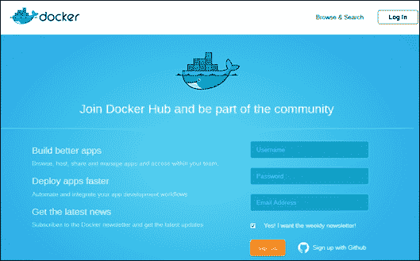

完成**注册**过程后，您需要完成通过电子邮件收到的验证。完成电子邮件验证后，当您登录到 Docker Hub 时，您将看到类似以下截图的内容：

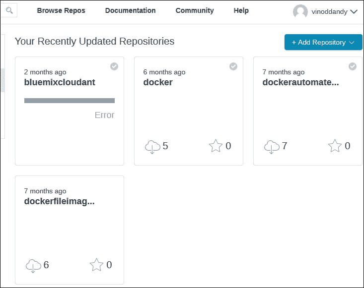

Docker Hub 中的帐户创建已成功完成，现在您可以使用[`hub.docker.com/account/login/?next=/account/welcome/`](https://hub.docker.com/account/login/?next=/account/welcome/)登录到您的 Docker Hub 帐户，如下截图所示：

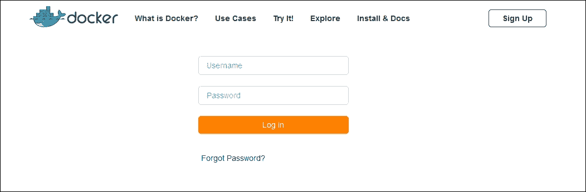

Docker Hub 还支持使用 Ubuntu 终端对 Docker Hub 进行命令行访问：

```
ubuntu@ip-172-31-21-44:~$ sudo docker login
Username: vinoddandy
Password:
Email: vinoddandy@gmail.com

```

成功登录后，输出如下：

```
Login Succeeded

```

您可以浏览 Docker Hub 中的可用图像，如下所示：

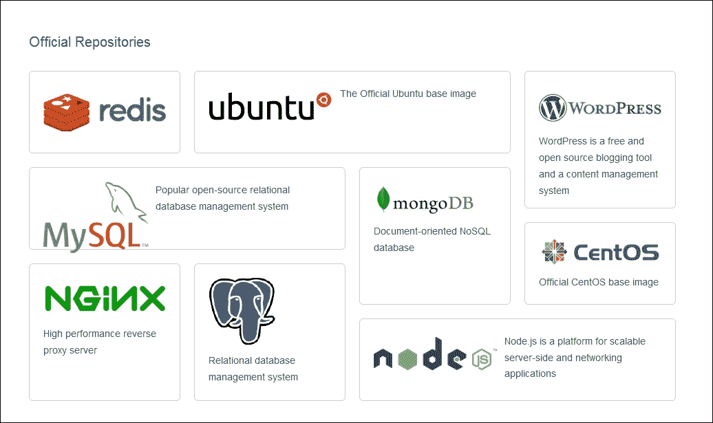

此外，您可以查看您的设置，更新您的个人资料，并获取支持的社区的详细信息，如 Twitter、stackoverflow、#IRC、Google Groups 和 GitHub。

# 将图像推送到 Docker Hub

在这里，我们将在本地机器上创建一个 Docker 图像，并将此图像推送到 Docker Hub。您需要在本节中执行以下步骤：

1.  通过以下方式在本地机器上创建 Docker 图像之一：

+   使用`docker commit`子命令

+   使用`Dockerfile`的`docker commit`子命令

1.  将此创建的图像推送到 Docker Hub。

1.  从 Docker Hub 中删除图像。

我们将使用 Ubuntu 基础图像，运行容器，添加一个新目录和一个新文件，然后创建一个新图像。在第三章，*构建图像*中，我们已经看到了使用`Dockerfile`创建 Docker 图像。您可以参考这个来检查`Dockerfile`语法的细节。

我们将从基本的`ubuntu`图像中使用名称为`containerforhub`的容器运行容器，如下终端代码所示：

```
$ sudo docker run -i --name="containerforhub" -t ubuntu /bin/bash
root@e3bb4b138daf:/#

```

接下来，我们将在`containerforhub`容器中创建一个新目录和文件。我们还将更新新文件，以便稍后进行测试：

```
root@bd7cc5df6d96:/# mkdir mynewdir
root@bd7cc5df6d96:/# cd mynewdir
root@bd7cc5df6d96:/mynewdir# echo 'this is my new container to make image and then push to hub' >mynewfile
root@bd7cc5df6d96:/mynewdir# cat mynewfile
This is my new container to make image and then push to hub
root@bd7cc5df6d96:/mynewdir#

```

让我们使用刚刚创建的容器的`docker commit`命令构建新图像。请注意，`commit`命令将从主机机器上执行，从容器正在运行的位置执行，而不是从容器内部执行：

```
$ sudo docker commit -m="NewImage" containerforhub vinoddandy/imageforhub
3f10a35019234af2b39d5fab38566d586f00b565b99854544c4c698c4a395d03

```

现在，我们在本地机器上有一个名为`vinoddandy/imageforhub`的新 Docker 图像。此时，本地创建了一个带有`mynewdir`和`mynewfile`的新图像。

我们将使用`sudo docker login`命令登录到 Docker Hub，就像本章前面讨论的那样。

让我们从主机机器将此图像推送到 Docker Hub：

```
$ sudo docker push vinoddandy/imageforhub
The push refers to a repository [vinoddandy/imageforhub] (len: 1)
Sending image list
Pushing tag for rev [c664d94bbc55] on {https://cdn-registry-1.docker.io/v1/repositories/vinoddandy/imageforhub/tags/latest}

```

现在，我们将`登录`到 Docker Hub 并在**存储库**中验证图像。

为了测试来自 Docker Hub 的图像，让我们从本地机器中删除此图像。要删除图像，首先需要停止容器，然后删除容器：

```
$ sudo docker stop containerforhub
$ sudo docker rm containerforhub
$

```

我们还将删除`vinoddandy/imageforhub`图像：

```
$ sudo docker rmi vinoddandy/imageforhub

```

我们将从 Docker Hub 中拉取新创建的图像，并在本地机器上运行新容器：

```
$ sudo docker run -i --name="newcontainerforhub" -t vinoddandy/imageforhub /bin/bash
Unable to find image 'vinoddandy/imageforhub' locally
Pulling repository vinoddandy/imageforhub
c664d94bbc55: Pulling image (latest) from vinoddandy/imageforhub, endpoint: http
c664d94bbc55: Download complete
5506de2b643b: Download complete
root@9bd40f1b5585:/# cat /mynewdir/mynewfile
This is my new container to make image and then push to hub
root@9bd40f1b5585:/#

```

因此，我们已经从 Docker Hub 中拉取了最新的图像，并使用新图像`vinoddandy/imageforhub`创建了容器。请注意，`无法在本地找到图像'vinoddandy/imageforhub'`的消息证实了该图像是从 Docker Hub 的远程存储库中下载的。

`mynewfile`中的文字证实了它是之前创建的相同图像。

最后，我们将从 Docker Hub 中删除图像，使用[`registry.hub.docker.com/u/vinoddandy/imageforhub/`](https://registry.hub.docker.com/u/vinoddandy/imageforhub/)，然后点击**删除存储库**，如下面的截图所示：

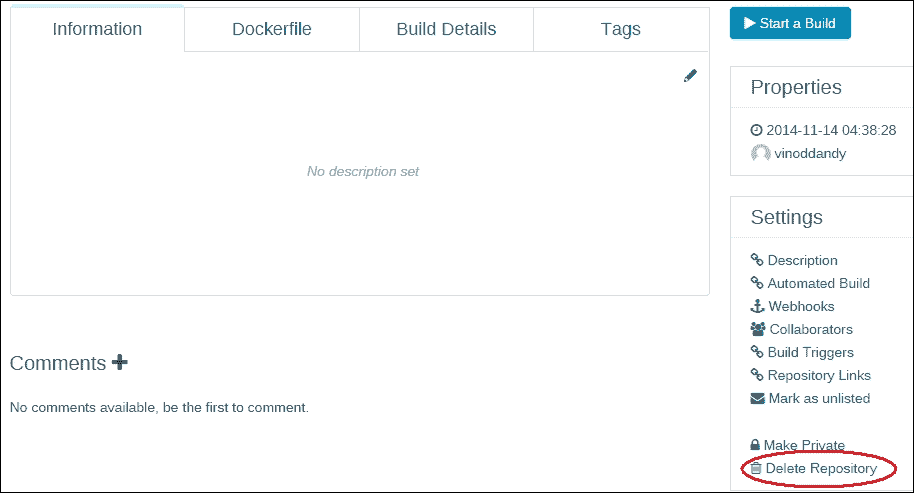

我们将再次创建此图像，但使用`Dockerfile`过程。因此，让我们使用第三章中解释的`Dockerfile`概念创建 Docker 图像，并将此图像推送到 Docker Hub。

本地机器上的`Dockerfile`如下所示：

```
###########################################
# Dockerfile to build a new image
###########################################
# Base image is Ubuntu
FROM ubuntu:14.04
# Author: Dr. Peter
MAINTAINER Dr. Peter <peterindia@gmail.com>
# create 'mynewdir' and 'mynewfile'
RUN mkdir mynewdir
RUN touch /mynewdir/mynewfile
# Write the message in file
RUN echo 'this is my new container to make image and then push to hub' \
 >/mynewdir/mynewfile
```

现在，我们使用以下命令在本地构建图像：

```
$ sudo docker build -t="vinoddandy/dockerfileimageforhub" .
Sending build context to Docker daemon  2.56 kB
Sending build context to Docker daemon
Step 0 : FROM ubuntu:14.04
---> 5506de2b643b
Step 1 : MAINTAINER Vinod Singh <vinod.puchi@gmail.com>
---> Running in 9f6859e2ca75
---> a96cfbf4a810
removing intermediate container 9f6859e2ca75
Step 2 : RUN mkdir mynewdir
---> Running in d4eba2a31467
---> 14f4c15610a7
removing intermediate container d4eba2a31467
Step 3 : RUN touch /mynewdir/mynewfile
---> Running in 7d810a384819
---> b5bbd55f221c
removing intermediate container 7d810a384819
Step 4 : RUN echo 'this is my new container to make image and then push to hub'
/mynewdir/mynewfile
---> Running in b7b48447e7b3
---> bcd8f63cfa79
removing intermediate container b7b48447e7b3
successfully built 224affbf9a65
ubuntu@ip-172-31-21-44:~/dockerfile_image_hub$

```

我们将使用此图像运行容器，如下所示：

```
$ sudo docker run -i --name="dockerfilecontainerforhub" –t vinoddandy/dockerfileimageforhub
root@d3130f21a408:/# cat /mynewdir/mynewfile
this is my new container to make image and then push to hub

```

`mynewdir`中的这段文字证实了新图像是通过新目录和新文件正确构建的。

重复`登录`过程，在 Docker Hub 中，然后推送这个新创建的镜像：

```
$ sudo docker login
Username (vinoddandy):
Login Succeeded
$ sudo docker push vinoddandy/dockerfileimageforhub
The push refers to a repository [vinoddandy/dockerfileimageforhub] (len: 1)
Sending image list
Pushing repository vinoddandy/dockerfileimageforhub (1 tags)
511136ea3c5a: Image already pushed, skipping
d497ad3926c8: Image already pushed, skipping
b5bbd55f221c: Image successfully pushed
bcd8f63cfa79: Image successfully pushed
224affbf9a65: Image successfully pushed
Pushing tag for rev [224affbf9a65] on {https://cdn-registry-1.docker.io/v1/repos
itories/vinoddandy/dockerfileimageforhub/tags/latest}
$

```

最后，我们可以验证 Docker Hub 上图像的可用性：

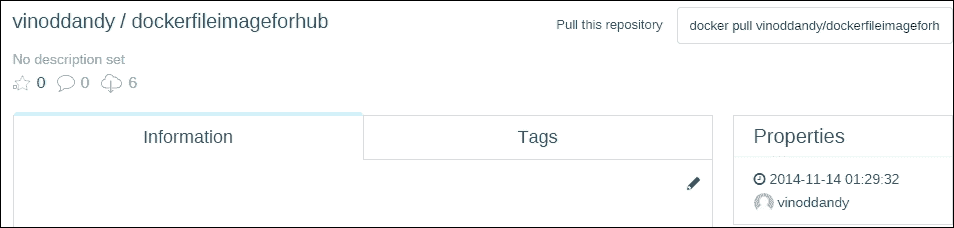

# 自动化图像构建过程

我们学会了如何在本地构建图像并将这些图像推送到 Docker Hub。Docker Hub 还具有从存储在 GitHub 或 Bitbucket 仓库中的`Dockerfile`自动构建图像的功能。自动构建支持 GitHub 和 Bitbucket 的私有和公共仓库。Docker Hub Registry 保存所有自动构建图像。Docker Hub Registry 基于开源，并且可以从[`github.com/docker/docker-registry`](https://github.com/docker/docker-registry)访问。

我们将讨论实施自动构建过程所需的步骤：

1.  我们首先将 Docker Hub 连接到我的 GitHub 帐户。

登录到 Docker Hub，并点击**查看个人资料**，然后转到**添加仓库** | **自动构建**，如下面的截图所示：

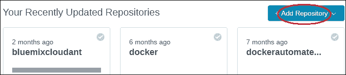

1.  现在我们选择**GitHub**：

1.  选择**GitHub**后，它将要求授权。在这里，我们将选择**公共和私有**，如下所示：

1.  点击**选择**后，它现在会显示您的 GitHub 仓库：

1.  点击您的仓库**vinodsinghh/dockerautomationbuild**的**选择**按钮，如前面的截图所示：

1.  我们选择默认分支，并使用`Githubimage`更新标签。此外，我们将保持位置为其默认值，即我们的 Docker Hub 的根目录，如下面的截图所示：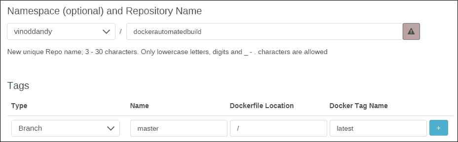

1.  最后，我们将点击**创建仓库**，如前面的截图所示：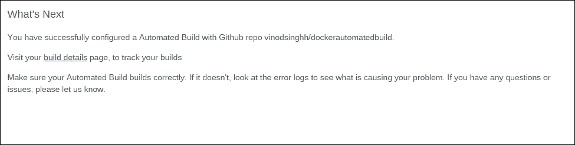

1.  点击**构建详情**以跟踪构建状态，如前面的截图所示。它将引导您到下面的截图：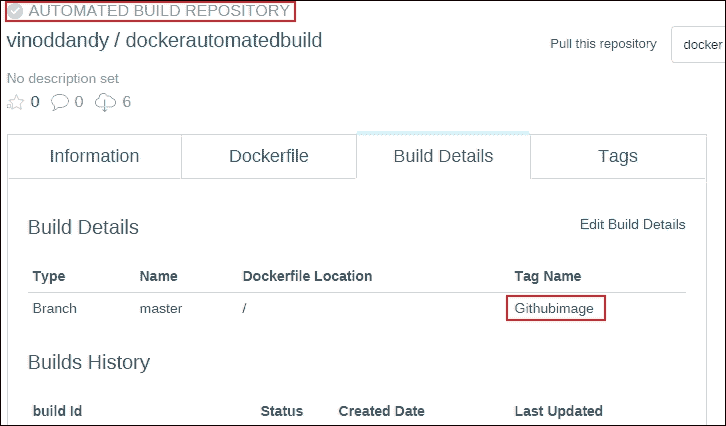

因此，每当 GitHub 中的`Dockerfile`更新时，自动构建就会被触发，并且新的镜像将存储在 Docker Hub 注册表中。我们可以随时检查构建历史记录。我们可以在本地机器上更改`Dockerfile`并推送到 GitHub。然后，我们可以在 Docker Hub 上看到自动构建链接[`registry.hub.docker.com/u/vinoddandy/dockerautomatedbuild/builds_history/82194/`](https://registry.hub.docker.com/u/vinoddandy/dockerautomatedbuild/builds_history/82194/)。

# Docker Hub 上的私有仓库

Docker Hub 提供公共和私有仓库。公共仓库对用户免费，私有仓库是付费服务。私有仓库的计划有不同的大小，如微型、小型、中型或大型订阅。

Docker 已经将他们的公共仓库代码发布为开源，网址是[`github.com/docker/docker-registry`](https://github.com/docker/docker-registry)。

通常，企业不喜欢将他们的 Docker 镜像存储在 Docker 的公共或私有仓库中。他们更喜欢保留、维护和支持自己的仓库。因此，Docker 也为企业提供了创建和安装自己的仓库的选项。

让我们使用 Docker 提供的注册表镜像在本地机器上创建一个仓库。我们将在本地机器上运行注册表容器，使用来自 Docker 的注册表镜像：

```
$ sudo docker run -p 5000:5000 -d registry
768fb5bcbe3a5a774f4996f0758151b1e9917dec21aedf386c5742d44beafa41

```

在自动构建部分，我们构建了`vinoddandy/dockerfileforhub`镜像。让我们将镜像 ID `224affbf9a65`标记到我们本地创建的`registry`镜像上。这个镜像的标记是为了在本地仓库中进行唯一标识。这个`registry`镜像可能在仓库中有多个变体，所以这个`tag`将帮助您识别特定的镜像：

```
$ sudo docker tag 224affbf9a65localhost:5000/vinoddandy/dockerfileimageforhub

```

标记完成后，使用`docker push`命令将此镜像推送到新的注册表：

```
$ sudo docker push localhost:5000/vinoddandy/dockerfile
imageforhub
The push refers to a repository [localhost:5000/vinoddandy/dockerfileimageforhub
] (len: 1)
Sending image list
Pushing repository localhost:5000/vinoddandy/dockerfileimageforhub (1 tags)
511136ea3c5a: Image successfully pushed
d497ad3926c8: Image successfully pushed
----------------------------------------------------
224affbf9a65: Image successfully pushed
Pushing tag for rev [224affbf9a65] on {http://localhost:5000/v1/repositories/vin
oddandy/dockerfileimageforhub/tags/latest}
ubuntu@ip-172-31-21-44:~$

```

现在，新的镜像已经在本地仓库中可用。您现在可以从本地注册表中检索此镜像并运行容器。这个任务留给你来完成。

# Docker Hub 上的组织和团队

私有仓库的一个有用方面是，您可以只与组织或团队成员共享它们。Docker Hub 允许您创建组织，在那里您可以与同事合作并管理私有仓库。您可以学习如何创建和管理组织。

第一步是在 Docker Hub 上创建一个组织，如下截图所示：

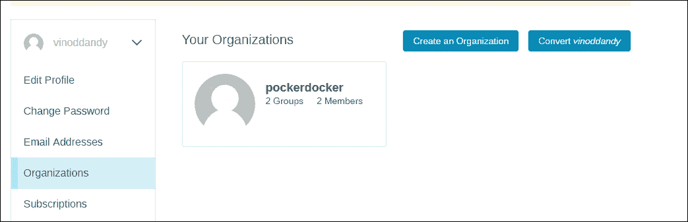

在您的组织中，您可以添加更多的组织，然后向其中添加成员：

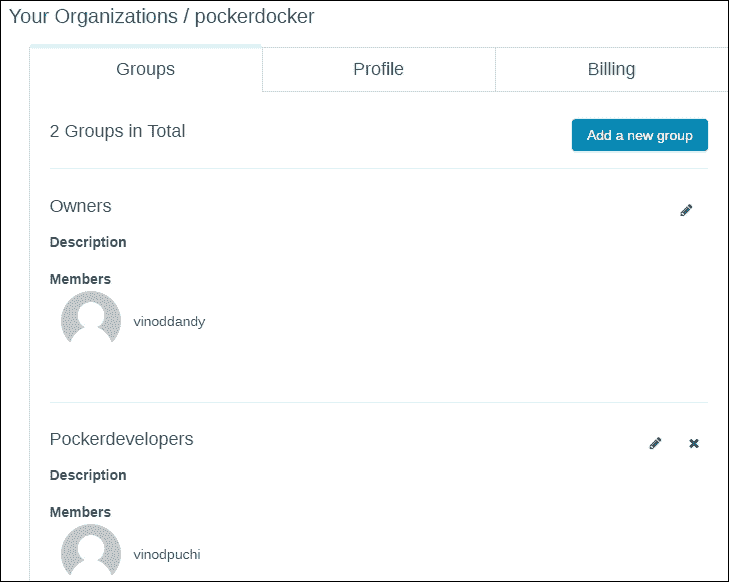

您的组织和团队成员可以与组织和团队合作。在私人存储库的情况下，此功能将更加有用。

# Docker Hub 的 REST API

Docker Hub 提供了 REST API，通过程序集成 Hub 功能。 REST API 支持用户和存储库管理。

用户管理支持以下功能：

+   用户登录：用于用户登录到 Docker Hub：

```
GET /v1/users

$ curl --raw -L --user vinoddandy:password https://index.docker.io/v1/users
4
"OK"
0
$

```

+   用户注册：用于注册新用户：

```
POST /v1/users
```

+   更新用户：用于更新用户的密码和电子邮件：

```
PUT /v1/users/(usename)/
```

存储库管理支持以下功能：

+   创建用户存储库：这将创建一个用户存储库：

```
PUT /v1/repositories/(namespace)/(repo_name)/
```

```
$ curl --raw -L -X POST --post301 -H "Accept:application/json" -H "Content-Type: application/json" --data-ascii '{"email": "singh_vinod@yahoo.com", "password": "password", "username": "singhvinod494" }' https://index.docker.io/v1/users
e
"User created"
0

```

创建存储库后，您的存储库将在此处列出，如此屏幕截图所示：

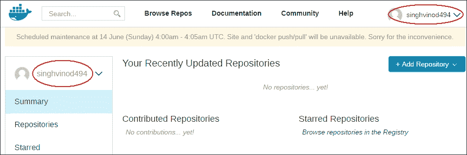

+   删除用户存储库：这将删除用户存储库：

```
DELETE /v1/repositories/(namespace)/(repo_name)/
```

+   创建库存储库：这将创建库存储库，仅供 Docker 管理员使用：

```
PUT /v1/repositories/(repo_name)/
```

+   删除库存储库：这将删除库存储库，仅供 Docker 管理员使用：

```
DELETE /v1/repositories/(repo_name)/
```

+   更新用户存储库图像：这将更新用户存储库的图像：

```
PUT /v1/repositories/(namespace)/(repo_name)/images
```

+   列出用户存储库图像：这将列出用户存储库的图像：

```
GET /v1/repositories/(namespace)/(repo_name)/images
```

+   更新库存储库图像：这将更新库存储库的图像：

```
PUT /v1/repositories/(repo_name)/images
```

+   列出库存储库图像：这将列出库存储库的图像：

```
GET /v1/repositories/(repo_name)/images
```

+   为库存储库授权令牌：为库存储库授权令牌：

```
PUT /v1/repositories/(repo_name)/auth
```

+   为用户存储库授权令牌：为用户存储库授权令牌：

```
PUT /v1/repositories/(namespace)/(repo_name)/auth
```

# 总结

Docker 镜像是用于衍生真实世界 Docker 容器的最突出的构建模块，可以在任何网络上作为服务公开。开发人员可以查找和检查镜像的独特功能，并根据自己的目的使用它们，以创建高度可用、公开可发现、可访问网络和认知可组合的容器。所有精心制作的镜像都需要放在公共注册库中。在本章中，我们清楚地解释了如何在存储库中发布镜像。我们还谈到了受信任的存储库及其独特的特点。最后，我们演示了如何利用存储库的 REST API 来推送和操作 Docker 镜像以及用户管理。

Docker 镜像需要存储在公共、受控和可访问网络的位置，以便全球软件工程师和系统管理员可以轻松找到并利用。Docker Hub 被誉为集中聚合、筛选和管理 Docker 镜像的最佳方法，源自 Docker 爱好者（内部和外部）。然而，企业无法将其 Docker 镜像存储在公共域中，因此，下一章将专门介绍在私人 IT 基础设施中暴露镜像部署和管理所需的步骤。
