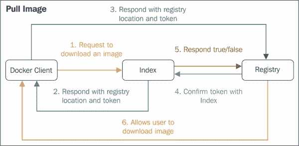
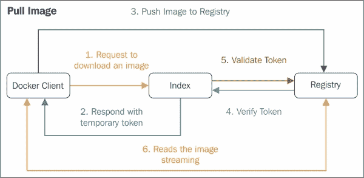

# 第五章：运行您的私有 Docker 基础设施

在第四章，*发布图像*中，我们讨论了 Docker 图像，并清楚地了解到 Docker 容器是 Docker 图像的运行时实现。如今，Docker 图像和容器数量众多，因为容器化范式已经席卷了 IT 领域。因此，全球企业有必要将他们的 Docker 图像保存在自己的私有基础设施中以考虑安全性。因此，部署 Docker Hub 到我们自己的基础设施的概念已经出现并发展。 Docker Hub 对于注册和存储不断增长的 Docker 图像至关重要和相关。主要，Docker Hub 专门用于集中和集中管理以下信息：

+   用户帐户

+   图像的校验和

+   公共命名空间

本章重点介绍了为您和 Docker 容器开发者提供所有相关信息，以便在自己的后院设计、填充和运行自己的私有 Docker Hub。本章涵盖了以下重要主题：

+   Docker 注册表和索引

+   Docker 注册表的用例

+   运行您自己的索引和注册表

+   将镜像推送到新创建的注册表

# Docker 注册表和索引

通常，Docker Hub 由 Docker 索引和注册表组成。 Docker 客户端可以通过网络连接和与 Docker Hub 交互。注册表具有以下特征：

+   它存储一组存储库的图像和图形

+   它没有用户帐户数据

+   它没有用户帐户或授权的概念

+   它将认证和授权委托给 Docker Hub 认证服务

+   它支持不同的存储后端（S3、云文件、本地文件系统等）

+   它没有本地数据库

+   它有与之关联的源代码

Docker 注册表的高级功能包括`bugsnag`、`new relic`和`cors`。`bugsnag`功能可检测和诊断应用程序中的崩溃，`new relic`封装了注册表并监视性能，`cors`可以启用以在我们自己的注册表域之外共享资源。建议您使用代理（如 nginx）将注册表部署到生产环境。您还可以直接在 Ubuntu 和基于 Red Hat Linux 的系统上运行 Docker 注册表。

目前，负责开发 Docker 平台的公司已在 GitHub 上发布了 Docker 注册表作为开源服务[`github.com/docker/docker-registry`](https://github.com/docker/docker-registry)。值得注意的是，Docker 索引只是一个建议，在撰写本书时，Docker 尚未发布任何开源项目。在本章中，我们将从 Docker 注册表的用例开始，然后从 GitHub 开始实际部署索引元素和 Docker 注册表。

# Docker 注册表用例

以下是 Docker 注册表的用例：

1.  拉取或下载图像

1.  推送图像

1.  删除图像

现在我们将详细介绍每个用例：

1.  **拉取或下载图像**：用户使用 Docker 客户端从索引请求图像，索引反过来向用户返回注册表详细信息。然后，Docker 客户端将直接请求注册表以获取所需的图像。注册表在内部使用索引对用户进行身份验证。如下图所示，图像拉取是通过客户端、索引和注册表模块的协作完成的：

1.  **推送图像**：用户请求推送图像，从索引获取注册表信息，然后直接将图像推送到注册表。注册表使用索引对用户进行身份验证，最后回应用户。控制流程如下图所示：

1.  **删除图像**：用户还可以请求从存储库中删除图像。

用户可以选择使用带有或不带有索引的注册表。在不带有索引的情况下使用注册表最适合存储私人图像。

# 运行自己的索引和注册表

在本节中，我们将执行以下步骤来运行自己的索引和注册表，并最终推送图像：

1.  从 GitHub 部署索引组件和注册表。

1.  配置 nginx 与 Docker 注册表。

1.  在 Web 服务器上设置 SSL 以进行安全通信。

## 第 1 步-从 GitHub 部署索引组件和注册表

索引组件包括`apache-utils`和`ngnix`，用于密码验证和 HTTPS 支持的 SSL 功能。用户必须注意，Docker 注册表的当前版本仅支持使用 HTTP 连接到注册表。因此，用户必须部署和使用**安全套接字层**（**SSL**）来保护数据。 SSL 在 Web 服务器和客户端的 Web 浏览器之间创建了加密连接，允许私人数据在没有窃听、数据篡改或消息伪造问题的情况下传输。这是使用广泛接受的 SSL 证书来保护数据的一种经过验证的方法。

Docker 注册表是一个 Python 应用程序，我们可以使用以下命令从[`github.com/docker/docker-registry`](https://github.com/docker/docker-registry)在本地 Ubuntu 机器上安装 Python：

```
$ sudo apt-get -y install build-essential python-dev \
 libevent-dev python-pip liblzma-dev swig libssl-dev

```

现在，安装 Docker 注册表：

```
$ sudo pip install docker-registry

```

这将更新 Python 软件包中的 Docker 注册表，并更新以下路径中的配置文件：

```
$ cd /usr/local/lib/python2.7/dist-packages/config/

```

将`config_sample.yml`文件复制到`config.yml`：

```
$ sudo cp config_sample.yml config.yml

```

默认情况下，Docker 将其数据保存在`/tmp`目录中，这可能会导致问题，因为在许多 Linux 系统上，`/tmp`文件夹在重新启动时会被清除。让我们创建一个永久文件夹来存储我们的数据：

```
$ sudo mkdir /var/docker-registry

```

让我们更新我们之前的`config.yml`文件，以适应以下两个位置的更新路径。第一个位置的更新代码如下：

```
sqlalchemy_index_database:
    _env:SQLALCHEMY_INDEX_DATABASE:sqlite:////var/docker-registry/docker-registry.db
```

以下是第二个位置的代码：

```
local: &local
    storage: local
    storage_path: _env:STORAGE_PATH:/var/docker-registry/registry
```

`config.yml`文件的其他默认配置正常工作。

现在，让我们使用`gunicorn`启动 Docker 注册表。 Gunicorn，也称为 Green Unicorn，是 Linux 系统的 Python **Web 服务器网关接口**（**WSGI**）HTTP 服务器：

```
$ sudo gunicorn --access-logfile - --debug -k gevent -b \
 0.0.0.0:5000 -w 1 docker_registry.wsgi:application
01/Dec/2014:04:59:23 +0000 WARNING: Cache storage disabled!
01/Dec/2014:04:59:23 +0000 WARNING: LRU cache disabled!
01/Dec/2014:04:59:23 +0000 DEBUG: Will return docker-registry.drivers.file.Storage

```

现在，Docker 注册表作为用户本地机器上的一个进程正在运行。

我们可以使用*Ctrl* + *C*来停止这个进程。

我们可以按以下方式启动 Linux 服务：

1.  为`docker-registry`工具创建一个目录：

```
$ sudo mkdir -p /var/log/docker-registry

```

1.  创建并更新 Docker 注册表配置文件：

```
$ sudo vi /etc/init/docker-registry.conf

```

1.  更新文件中的以下内容：

```
description "Docker Registry"
start on runlevel [2345]
stop on runlevel [016]
respawn
respawn limit 10 5
script
exec gunicorn --access-logfile /var/log/docker-registry/access.log --error-logfile /var/log/docker-registry/server.log -k gevent --max-requests 100 --graceful-timeout 3600 -t 3600 -b localhost:5000 -w 8 docker_registry.wsgi:application
end script
```

1.  保存文件后，运行 Docker 注册表服务：

```
$ sudo service docker-registry start
docker-registry start/running, process 25760

```

1.  现在，使用`apache-utils`来保护此注册表，启用密码保护功能，如下所示：

```
$ sudo apt-get -y install nginx apache2-utils

```

1.  用户创建登录 ID 和密码来访问 Docker 注册表：

```
$ sudo htpasswd -c /etc/nginx/docker-registry.htpasswd vinod1

```

1.  在提示时输入新密码。此时，我们有登录 ID 和密码来访问 Docker 注册表。

## 第 2 步 - 配置 nginx 与 Docker 注册表

接下来，我们需要告诉 nginx 使用该认证文件（在上一节的第 6 步和第 7 步中创建）来转发请求到我们的 Docker 注册表。

我们需要创建 nginx 配置文件。为此，我们需要按照以下步骤进行：

1.  通过运行以下命令创建 ngnix 配置文件：

```
$ sudo vi /etc/nginx/sites-available/docker-registry

```

使用以下内容更新文件：

```
upstream docker-registry {
 server localhost:5000;
}
server {
 listen 8080;
 server_name my.docker.registry.com;
 # ssl on;
 # ssl_certificate /etc/ssl/certs/docker-registry;
 # ssl_certificate_key /etc/ssl/private/docker-registry;
 proxy_set_header Host       $http_host;   # required for Docker client sake
 proxy_set_header X-Real-IP  $remote_addr; # pass on real client IP
 client_max_body_size 0; # disable any limits to avoid HTTP 413 for large image uploads
 # required to avoid HTTP 411: see Issue #1486 (https://github.com/dotcloud/docker/issues/1486)
 chunked_transfer_encoding on;
 location / {
     # let Nginx know about our auth file
     auth_basic              "Restricted";
     auth_basic_user_file    docker-registry.htpasswd;
     proxy_pass http://docker-registry;
 } location /_ping {
     auth_basic off;
     proxy_pass http://docker-registry;
 }   location /v1/_ping {
     auth_basic off;
     proxy_pass http://docker-registry;
 }
}
```

1.  创建软链接并重新启动 ngnix 服务：

```
$ sudo ln -s /etc/nginx/sites-available/docker-registry  \
 /etc/nginx/sites-enabled/docker-registry
$ sudo service nginx restart

```

1.  让我们检查一切是否正常工作。运行以下命令，我们应该得到这个输出：

```
$ sudo curl localhost:5000
"\"docker-registry server\""

```

太好了！现在我们的 Docker 注册表正在运行。现在，我们必须检查 nginx 是否按我们的预期工作。要做到这一点，请运行以下命令：

```
$ curl localhost:8080

```

这次，我们会收到一个未经授权的消息：

```
<html>
<head><title>401 Authorization Required</title></head>
<body bgcolor="white">
<center><h1>401 Authorization Required</h1></center>
<hr><center>nginx/1.4.6 (Ubuntu)</center>
</body>
</html>
```

使用之前创建的密码登录：

```
$ curl vinod1:vinod1@localhost:8080
"\"docker-registry server\""ubuntu@ip-172-31-21-44:~$

```

这证实了您的 Docker 注册表受到密码保护。

## 第 3 步 - 在 Web 服务器上设置 SSL 以进行安全通信

这是在本地机器上设置 SSL 的最后一步，该机器托管了用于加密数据的 Web 服务器。我们创建以下文件：

```
$sudo vi /etc/nginx/sites-available/docker-registry

```

使用以下内容更新文件： 

```
server {
 listen 8080;
 server_name mydomain.com;
 ssl on;
 ssl_certificate /etc/ssl/certs/docker-registry;
 ssl_certificate_key /etc/ssl/private/docker-registry;
```

请注意，我的 Ubuntu 机器可以在 Internet 上使用名称`mydomain.com`，并且 SSL 已设置为证书和密钥的路径。

让我们按照以下方式签署证书：

```
$ sudo mkdir ~/certs
$ sudo cd ~/certs

```

使用以下命令生成根密钥：

```
$ sudo openssl genrsa -out devdockerCA.key 2048
Generating RSA private key, 2048 bit long modulus
..........+++
....................+++
e is 65537 (0x10001)

```

现在我们有了根密钥，让我们生成一个根证书（在命令提示符处输入任何你想要的）：

```
$ sudo openssl req -x509 -new -nodes -key devdockerCA.key -days  \
 10000 -out devdockerCA.crt

```

然后，为我们的服务器生成一个密钥：

```
$ sudo openssl genrsa -out dev-docker-registry.com.key 2048

```

现在，我们必须创建一个证书签名请求。一旦我们运行签名命令，请确保“通用名称”是我们的服务器名称。这是强制性的，任何偏差都会导致错误：

```
$ sudo openssl req -new -key dev-docker-registry.com.key -out \
 dev-docker-registry.com.csr

```

在这里，“通用名称”看起来像`mydomain.com`。这是在 AWS 上运行的 Ubuntu VM。

上述命令的输出如下：

```
Country Name (2 letter code) [AU]:
State or Province Name (full name) [Some-State]:
Locality Name (eg, city) []:
Organization Name (eg, company) [Internet Widgits Pty Ltd]:
Organizational Unit Name (eg, section) []:
Common Name (e.g. server FQDN or YOUR name) []:mydomain.com
Email Address []:
Please enter the following 'extra' attributes
to be sent with your certificate request
A challenge password []:
An optional company name []:

```

“挑战密码”输入为空，并且用户也可以自由填写。然后，我们需要通过运行以下命令签署证书请求：

```
$ sudo openssl x509 -req -in dev-docker-registry.com.csr -CA  \
 devdockerCA.crt -CAkey devdockerCA.key -CAcreateserial -out \
 dev-docker-registry.com.crt -days 10000

```

现在我们已经生成了证书所需的所有文件，我们需要将这些文件复制到正确的位置。

首先，将证书和密钥复制到 nginx 期望它们在的路径：

```
$ sudo cp dev-docker-registry.com.crt /etc/ssl/certs/docker-registry
$ sudo chmod 777 /etc/ssl/certs/docker-registry
$ sudo cp dev-docker-registry.com.key /etc/ssl/private/docker-registry
$ sudo chmod 777 /etc/ssl/private/docker-registry

```

请注意，我们已经创建了自签名证书，并且它们是由任何已知的证书颁发机构签名的，因此我们需要通知注册表这是一个合法的证书：

```
$ sudo mkdir /usr/local/share/ca-certificates/docker-dev-cert
$ sudo cp devdockerCA.crt /usr/local/share/ca-certificates/docker-dev-cert
$ sudo update-ca-certificates
Updating certificates in /etc/ssl/certs... 1 added, 0 removed; done.
Running hooks in /etc/ca-certificates/updated....done.
ubuntu@ip-172-31-21-44:~/certs$

```

让我们重新启动 nginx 以重新加载配置和 SSL 密钥：

```
$ sudo service nginx restart

```

现在，我们将测试 SSL 证书，以检查它是否正常工作。由于`mydomain.com`不是互联网地址，请在`/etc/hosts`文件中添加条目：

```
172.31.24.44 mydomain.com

```

现在运行以下命令：

```
$ sudo curl https://vinod1:vinod1@ mydomain.com:8080
"\"docker-registry server\""ubuntu@ip-172-31-21-44:~$

```

因此，如果一切顺利，您应该会看到类似于这样的内容：

```
"docker-registry server"

```

# 将图像推送到新创建的 Docker 注册表

最后，将图像推送到 Docker 注册表。因此，让我们在本地 Ubuntu 机器上创建一个图像：

```
$ sudo docker run -t -i ubuntu /bin/bash
root@9593c56f9e70:/# echo "TEST" >/mydockerimage
root@9593c56f9e70:/# exit
$ sudo docker commit $(sudo docker ps -lq) vinod-image
e17b685ee6987bb0cd01b89d9edf81a9fc0a7ad565a7e85650c41fc7e5c0cf9e

```

让我们登录到在 Ubuntu 机器上本地创建的 Docker 注册表：

```
$ sudo docker --insecure-registry=mydomain.com:8080 \
 login https://mydomain.com:8080
Username: vinod1
Password:
Email: vinod.puchi@gmail.com
Login Succeeded

```

在将图像推送到注册表之前对其进行标记：

```
$ sudo docker tag vinod-image mydomain.com:8080/vinod-image

```

最后，使用`push`命令上传图像：

```
$ sudo docker push \
mydomain.com:8080/vinod-image
The push refers to a repository [mydomain.com
:8080/vinod-image] (len: 1)
Sending image list
Pushing repository mydomain.com:8080/vi
nod-image (1 tags)
511136ea3c5a: Image successfully pushed
5bc37dc2dfba: Image successfully pushed
----------------------------------------------------
e17b685ee698: Image successfully pushed
Pushing tag for rev [e17b685ee698] on {https://mydomain.com
:8080/v1/repositories/vinod-image/tags/latest}
$

```

现在，从本地磁盘中删除图像，并从 Docker 注册表中`pull`它：

```
$ sudo docker pull mydomain.com:8080/vinod-image
Pulling repository mydomain.com:8080/vi
nod-image
e17b685ee698: Pulling image (latest) from mydomain.com
17b685ee698: Download complete
dc07507cef42: Download complete
86ce37374f40: Download complete
Status: Downloaded newer image for mydomain.com:8080/vinod-image:latest
$

```

# 总结

Docker 引擎允许每个增值软件解决方案被容器化、索引化、注册化和存储化。Docker 正在成为一个系统化开发、发布、部署和在各处运行容器的强大工具。虽然`docker.io`允许您免费将 Docker 创建上传到他们的注册表，但您在那里上传的任何内容都是公开可发现和可访问的。创新者和公司对此并不感兴趣，因此坚持使用私人 Docker Hub。在本章中，我们以易于理解的方式为您解释了所有步骤、语法和语义。我们看到了如何检索图像以生成 Docker 容器，并描述了如何以安全的方式将我们的图像推送到 Docker 注册表，以便经过身份验证的开发人员找到并使用。认证和授权机制作为整个过程的重要部分，已经被详细解释。确切地说，本章被构想和具体化为设置自己的 Docker Hub 的指南。随着世界组织对容器化云表现出示范性兴趣，私人容器中心变得更加重要。

在下一章中，我们将深入探讨容器，这是从图像自然而然的发展。我们将演示在 Docker 容器中运行服务的能力，比如 Web 服务器，并展示它与主机和外部世界的交互。
