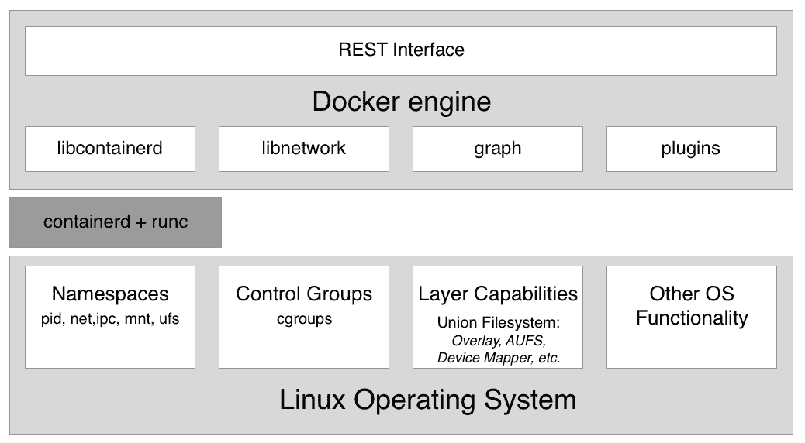

# 什么是容器，为什么我应该使用它们？

本章将向您介绍容器及其编排的世界。本书从最基础的知识开始，假设您对容器没有先前的了解，并将为您提供一个非常实用的主题介绍。

在本章中，我们将关注软件供应链及其中的摩擦。然后，我们将介绍容器，这些容器用于减少这种摩擦，并在其上添加企业级安全性。我们还将探讨容器及其生态系统是如何组装的。我们将特别指出上游开源软件（OSS）组件的区别，这些组件统一在代号 Moby 下，构成了 Docker 和其他供应商的下游产品的基本组成部分。

本章涵盖以下主题：

+   什么是容器？

+   为什么容器很重要？

+   对我或我的公司有什么好处？

+   Moby 项目

+   Docker 产品

+   容器架构

完成本模块后，您将能够做到以下事项：

+   用类似于物理容器的类比，向感兴趣的普通人解释容器是什么，用简单的几句话

+   用类似于物理容器与传统船运或公寓与独栋住宅等的类比来证明容器为何如此重要，以便向感兴趣的普通人解释

+   至少列出四个上游开源组件，这些组件被 Docker 产品使用，比如 Docker for Desktop

+   至少识别三个 Docker 产品

# 什么是容器？

软件容器是一个相当抽象的东西，因此，如果我们从一个对大多数人来说应该很熟悉的类比开始，可能会有所帮助。这个类比是运输行业中的集装箱。在历史上，人们一直通过各种方式从一个地方运输货物到另一个地方。在轮子发明之前，货物很可能是由人们自己的肩膀上的袋子、篮子或箱子运输的，或者他们可能使用驴、骆驼或大象等动物来运输它们。

随着轮子的发明，交通变得更加高效，因为人类修建了可以沿着道路移动他们的车辆。一次可以运输更多的货物。当第一台蒸汽驱动的机器，以及后来的汽油驱动引擎被引入时，交通变得更加强大。现在我们通过火车、船舶和卡车运输大量货物。与此同时，货物的种类变得越来越多样化，有时处理起来也更加复杂。

在这几千年的时间里，有一件事情没有改变，那就是在目的地卸货，也许将它们装载到另一种交通工具上的必要性。例如，一个农民将满满一车的苹果运到中央火车站，然后这些苹果与其他农民的苹果一起装上火车。或者想象一下，一位酿酒师用卡车将他的酒桶运到港口，然后卸货，然后转移到一艘将它们运往海外的船上。

这种从一种交通工具卸货，然后装载到另一种交通工具的过程是非常复杂和繁琐的。每种产品都以自己的方式包装，因此必须以自己的特定方式处理。此外，散装货物面临着被不道德的工人偷窃或在处理过程中受损的风险。

然后，集装箱出现了，它们彻底改变了运输行业。集装箱只是一个标准尺寸的金属箱子。每个集装箱的长度、宽度和高度都是相同的。这是一个非常重要的点。如果世界没有就一个标准尺寸达成一致，整个集装箱的事情就不会像现在这样成功。

现在，有了标准化的集装箱，想要将货物从 A 运送到 B 的公司将这些货物打包进这些集装箱中。然后，他们会联系一家船运公司，该公司配备了标准化的运输工具。这可以是一辆可以装载集装箱的卡车，或者每个运输一个或多个集装箱的火车车厢。最后，我们有专门运输大量集装箱的船只。船运公司永远不需要拆包和重新包装货物。对于船运公司来说，集装箱只是一个黑匣子，他们对其中的内容不感兴趣，在大多数情况下也不应该关心。它只是一个具有标准尺寸的大铁箱。现在，将货物打包进集装箱完全交给了想要运输货物的各方，他们应该知道如何处理和打包这些货物。

由于所有集装箱都具有相同的约定形状和尺寸，船公司可以使用标准化工具来处理集装箱；也就是说，用于卸载集装箱的起重机，比如从火车或卡车上卸载集装箱，并将其装上船舶，反之亦然。一种类型的起重机足以处理随时间而来的所有集装箱。此外，运输工具也可以标准化，比如集装箱船、卡车和火车。

由于所有这些标准化，围绕货物运输的所有流程也可以标准化，因此比集装箱时代之前的货物运输更加高效。

现在，你应该对为什么集装箱如此重要以及为什么它们彻底改变了整个运输行业有了很好的理解。我特意选择了这个类比，因为我们要在这里介绍的软件容器在所谓的软件供应链中扮演着与集装箱在实物货物供应链中扮演的完全相同的角色。

在过去，开发人员会开发一个新的应用程序。一旦他们认为该应用程序已经完成，他们会将该应用程序交给运维工程师，然后运维工程师应该在生产服务器上安装它并使其运行。如果运维工程师幸运的话，他们甚至可以从开发人员那里得到一份相对准确的安装说明文档。到目前为止，一切都很顺利，生活也很容易。

但当一个企业中有许多开发团队创建了完全不同类型的应用程序，但所有这些应用程序都需要安装在同一生产服务器上并在那里运行时，情况就有点失控了。通常，每个应用程序都有一些外部依赖项，比如它是基于哪个框架构建的，它使用了哪些库等等。有时，两个应用程序使用相同的框架，但是版本不同，这些版本可能与彼此兼容，也可能不兼容。我们的运维工程师的工作变得越来越困难。他们必须非常有创意地想办法在不破坏任何东西的情况下，将不同的应用程序加载到他们的船上（服务器）上。

现在安装某个应用程序的新版本已经成为一个复杂的项目，通常需要数月的规划和测试。换句话说，在软件供应链中存在很多摩擦。但如今，公司越来越依赖软件，发布周期需要变得越来越短。我们不能再负担得起每年只发布两次或更少的情况了。应用程序需要在几周或几天内进行更新，有时甚至一天内进行多次更新。不遵守这一点的公司会因缺乏灵活性而面临倒闭的风险。那么，解决方案是什么呢？

最初的方法之一是使用**虚拟机**（**VMs**）。公司不再在同一台服务器上运行多个应用程序，而是将单个应用程序打包并在每个虚拟机上运行。这样一来，所有的兼容性问题都消失了，生活似乎又变得美好起来。不幸的是，这种幸福感并没有持续多久。虚拟机本身就非常庞大，因为它们都包含了一个完整的操作系统，比如 Linux 或 Windows Server，而这一切只是为了运行一个应用程序。这就好像在运输行业中，你使用整艘船只是为了运输一车香蕉。多么浪费！这是永远不可能盈利的。

这个问题的最终解决方案是提供比虚拟机更轻量级的东西，但也能完美地封装需要传输的货物。在这里，货物是由我们的开发人员编写的实际应用程序，以及 - 这一点很重要 - 应用程序的所有外部依赖项，例如其框架、库、配置等。这种软件打包机制的圣杯就是 *Docker 容器*。

开发人员使用 Docker 容器将他们的应用程序，框架和库打包到其中，然后将这些容器发送给测试人员或运维工程师。对于测试人员和运维工程师来说，容器只是一个黑匣子。尽管如此，它是一个标准化的黑匣子。所有容器，无论其中运行什么应用程序，都可以被平等对待。工程师们知道，如果他们的服务器上运行任何容器，那么任何其他容器也应该运行。这实际上是真的，除了一些边缘情况，这种情况总是存在的。

因此，Docker 容器是一种以标准化方式打包应用程序及其依赖项的手段。Docker 随后创造了短语*构建，交付和在任何地方运行*。

# 为什么容器很重要？

如今，应用程序发布之间的时间变得越来越短，但软件本身并没有变得更简单。相反，软件项目的复杂性增加了。因此，我们需要一种方法来驯服野兽并简化软件供应链。

此外，我们每天都听说网络攻击正在上升。许多知名公司受到了安全漏洞的影响。在这些事件中，高度敏感的客户数据被盗，如社会安全号码，信用卡信息等。但不仅仅是客户数据受到了损害 - 敏感的公司机密也被窃取。

容器可以在许多方面提供帮助。首先，Gartner 发现在容器中运行的应用程序比不在容器中运行的应用程序更安全。容器使用 Linux 安全原语，如 Linux 内核*命名空间*来隔离在同一台计算机上运行的不同应用程序，以及**控制组**（**cgroups**）以避免嘈杂邻居问题，即一个糟糕的应用程序使用服务器的所有可用资源并使所有其他应用程序陷入困境。

由于容器图像是不可变的，很容易对其进行扫描以查找**常见漏洞和暴露**（**CVEs**），从而提高我们应用程序的整体安全性。

另一种使我们的软件供应链更加安全的方法是让我们的容器使用内容信任。内容信任基本上确保容器图像的作者是他们所声称的，并且容器图像的消费者有保证图像在传输过程中没有被篡改。后者被称为**中间人攻击**（**MITM**）。

当然，我刚才说的一切在没有使用容器的情况下也是技术上可能的，但是由于容器引入了一个全球公认的标准，它们使得实施这些最佳实践并强制执行它们变得更加容易。

好吧，但安全性并不是容器重要的唯一原因。还有其他原因。

一个原因是容器使得在开发人员的笔记本电脑上轻松模拟类似生产环境。如果我们可以将任何应用程序容器化，那么我们也可以将诸如 Oracle 或 MS SQL Server 之类的数据库容器化。现在，每个曾经在计算机上安装 Oracle 数据库的人都知道这并不是一件容易的事情，而且会占用大量宝贵的空间。你不会想要在你的开发笔记本上做这件事，只是为了测试你开发的应用程序是否真的能够端到端地工作。有了容器，我们可以像说 123 一样轻松地在容器中运行一个完整的关系型数据库。当测试完成后，我们可以停止并删除容器，数据库就会消失，不会在我们的计算机上留下任何痕迹。

由于容器与虚拟机相比非常精简，因此在开发人员的笔记本电脑上同时运行多个容器而不会使笔记本电脑不堪重负并不罕见。

容器之所以重要的第三个原因是，运营商最终可以集中精力做他们真正擅长的事情：提供基础设施、运行和监控生产中的应用程序。当他们需要在生产系统上运行的应用程序都被容器化时，运营商可以开始标准化他们的基础设施。每台服务器都只是另一个 Docker 主机。这些服务器上不需要安装特殊的库或框架，只需要一个操作系统和一个像 Docker 这样的容器运行时。

此外，运营商不再需要对应用程序的内部有深入的了解，因为这些应用程序在容器中自包含，对他们来说应该看起来像黑匣子一样，类似于运输行业的人员看待集装箱的方式。

# 对我或我的公司有什么好处？

有人曾经说过，今天，每家规模一定的公司都必须承认他们需要成为一家软件公司。从这个意义上讲，现代银行是一家专门从事金融业务的软件公司。软件驱动着所有的业务。随着每家公司都成为了一家软件公司，就需要建立一个软件供应链。为了保持竞争力，他们的软件供应链必须安全高效。通过彻底的自动化和标准化，可以实现效率。但在安全、自动化和标准化这三个领域，容器已经被证明是非常出色的。一些大型知名企业已经报告说，当他们将现有的传统应用程序（许多人称之为传统应用程序）容器化，并建立基于容器的完全自动化软件供应链时，他们可以将这些关键应用程序的维护成本降低 50%至 60%，并且可以将这些传统应用程序的新版本发布时间缩短 90%。

也就是说，采用容器技术可以为这些公司节省大量资金，同时加快开发过程并缩短上市时间。

# Moby 项目

最初，当 Docker（公司）推出 Docker 容器时，一切都是开源的。当时 Docker 没有任何商业产品。公司开发的 Docker 引擎是一个庞大的软件单体。它包含许多逻辑部分，如容器运行时、网络库、RESTful（REST）API、命令行界面等等。

其他供应商或项目，如红帽或 Kubernetes，都在他们自己的产品中使用 Docker 引擎，但大多数情况下，他们只使用了其部分功能。例如，Kubernetes 没有使用 Docker 引擎的网络库，而是提供了自己的网络方式。红帽则不经常更新 Docker 引擎，而更倾向于对旧版本的 Docker 引擎应用非官方的补丁，但他们仍然称之为 Docker 引擎。

出于这些原因以及许多其他原因，出现了这样一个想法，即 Docker 必须做一些事情，以清楚地将 Docker 开源部分与 Docker 商业部分分开。此外，公司希望阻止竞争对手利用和滥用 Docker 这个名字来谋取自己的利益。这就是 Moby 项目诞生的主要原因。它作为 Docker 开发和继续开发的大多数开源组件的总称。这些开源项目不再带有 Docker 的名称。

Moby 项目提供了用于图像管理、秘密管理、配置管理和网络和配置等的组件，仅举几例。此外，Moby 项目的一部分是特殊的 Moby 工具，例如用于将组件组装成可运行的工件。

从技术上属于 Moby 项目的一些组件已经被 Docker 捐赠给了云原生计算基金会（CNCF），因此不再出现在组件列表中。最突出的是`notary`、`containerd`和`runc`，其中第一个用于内容信任，后两者形成容器运行时。

# Docker 产品

Docker 目前将其产品线分为两个部分。有**社区版**（**CE**），它是闭源的，但完全免费，然后还有**企业版**（**EE**），它也是闭源的，需要按年度许可。这些企业产品得到 24/7 支持，并得到错误修复的支持。

# Docker CE

Docker 社区版的一部分是产品，如 Docker 工具箱和适用于 Mac 和 Windows 的 Docker 桌面版。所有这些产品主要面向开发人员。

Docker 桌面版是一个易于安装的桌面应用程序，可用于在 macOS 或 Windows 机器上构建、调试和测试 Docker 化的应用程序或服务。Docker for macOS 和 Docker for Windows 是与各自的虚拟化框架、网络和文件系统深度集成的完整开发环境。这些工具是在 Mac 或 Windows 上运行 Docker 的最快、最可靠的方式。

在 CE 的总称下，还有两个更偏向于运维工程师的产品。这些产品是 Docker for Azure 和 Docker for AWS。

例如，对于 Docker for Azure，这是一个本地 Azure 应用程序，您可以通过几次点击设置 Docker，优化并与底层 Azure **基础设施即服务**（**IaaS**）服务集成。它帮助运维工程师在 Azure 中构建和运行 Docker 应用程序时加快生产力。

Docker for AWS 的工作方式非常类似，但适用于亚马逊的云。

# Docker EE

Docker 企业版由**Universal Control Plane**（**UCP**）和**Docker Trusted Registry**（**DTR**）组成，两者都运行在 Docker Swarm 之上。两者都是 Swarm 应用程序。Docker EE 基于 Moby 项目的上游组件，并添加了企业级功能，如**基于角色的访问控制**（**RBAC**）、多租户、混合 Docker Swarm 和 Kubernetes 集群、基于 Web 的 UI 和内容信任，以及顶部的镜像扫描。

# 容器架构

现在，让我们讨论一下高层次上如何设计一个能够运行 Docker 容器的系统。以下图表说明了安装了 Docker 的计算机的外观。请注意，安装了 Docker 的计算机通常被称为 Docker 主机，因为它可以运行或托管 Docker 容器：

Docker 引擎的高级架构图

在上图中，我们可以看到三个基本部分：

+   在底部，我们有**Linux 操作系统**

+   在中间，深灰色部分，我们有容器运行时

+   在顶部，我们有**Docker 引擎**

容器之所以可能，是因为 Linux 操作系统提供了一些原语，比如命名空间、控制组、层功能等，所有这些都是由容器运行时和 Docker 引擎以非常特定的方式利用的。Linux 内核的命名空间，比如**进程 ID**（**pid**）命名空间或**网络**（**net**）命名空间，允许 Docker 封装或隔离在容器内运行的进程。**控制组**确保容器不会遭受嘈杂邻居综合症，即运行在容器中的单个应用程序可能会消耗整个 Docker 主机的大部分或全部可用资源。**控制组**允许 Docker 限制每个容器分配的资源，比如 CPU 时间或内存量。

Docker 主机上的容器运行时由 `containerd` 和 `runc` 组成。`runc` 是容器运行时的低级功能，而基于 `runc` 的 `containerd` 提供了更高级的功能。两者都是开源的，并且已由 Docker 捐赠给 CNCF。

容器运行时负责容器的整个生命周期。如果需要，它会从注册表中拉取容器镜像（这是容器的模板），从该镜像创建容器，初始化和运行容器，最终在系统中停止并删除容器。

**Docker 引擎**提供了容器运行时的附加功能，例如网络库或插件支持。它还提供了一个 REST 接口，通过该接口可以自动化所有容器操作。我们将在本书中经常使用的 Docker 命令行界面是这个 REST 接口的消费者之一。

# 总结

在本章中，我们看到容器如何大大减少了软件供应链中的摩擦，并且使供应链更加安全。

在下一章中，我们将学习如何准备我们的个人或工作环境，以便我们可以高效有效地使用 Docker。所以，请继续关注。

# 问题

请回答以下问题，以评估您的学习进度：

1.  哪些陈述是正确的（可以有多个答案）？

A. 一个容器就像一个轻量级的虚拟机

B. 一个容器只能在 Linux 主机上运行

C. 一个容器只能运行一个进程

D. 容器中的主进程始终具有 PID 1

E. 一个容器是由 Linux 命名空间封装的一个或多个进程，并受 cgroups 限制

1.  用自己的话，可能通过类比，解释什么是容器。

1.  为什么容器被认为是 IT 领域的一个改变者？列出三到四个原因。

1.  当我们声称：*如果一个容器在给定平台上运行，那么它就可以在任何地方运行...* 时，这意味着什么？列出两到三个原因，说明为什么这是真的。

1.  Docker 容器只对基于微服务的现代绿地应用程序真正有用。请证明你的答案。

A. True

B. False

1.  当企业将其传统应用程序容器化时，通常可以节省多少成本？

A. 20%

B. 33%

C. 50%

D. 75%

1.  Linux 容器基于哪两个核心概念？

# 进一步阅读

以下是一些链接列表，这些链接可以带您了解本章讨论的主题的更详细信息：

+   Docker 概述：[`docs.docker.com/engine/docker-overview/`](https://docs.docker.com/engine/docker-overview/)

+   Moby 项目：[`mobyproject.org/`](https://mobyproject.org/)

+   Docker 产品：[`www.docker.com/get-started`](https://www.docker.com/get-started)

+   Cloud-Native Computing Foundation：[`www.cncf.io/`](https://www.cncf.io/)

+   containerd – 一个行业标准的容器运行时：[`containerd.io/`](https://containerd.io/)
