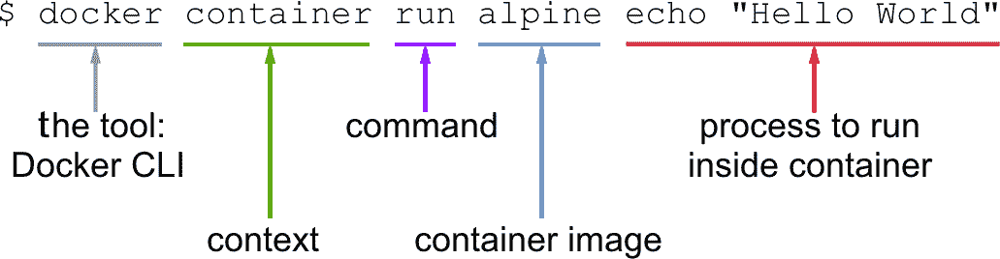
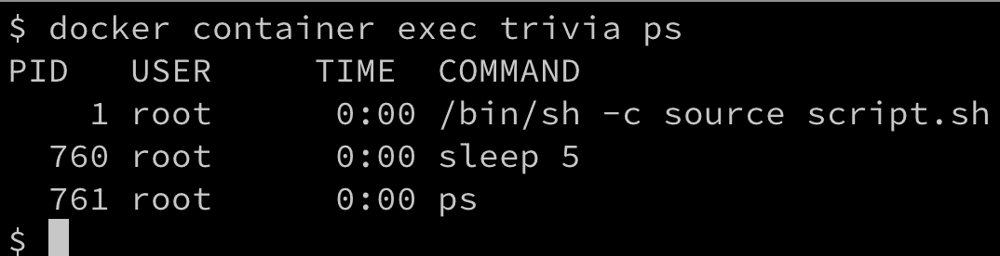
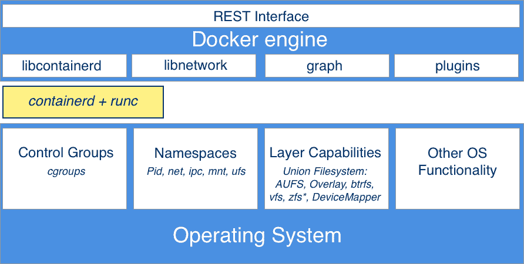
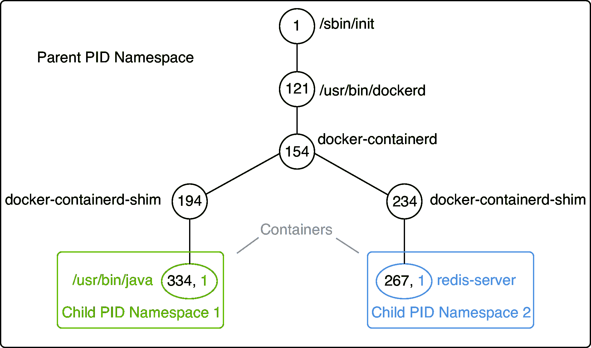

# 第三章：掌握容器

在上一章中，您学会了如何为高效和无摩擦地使用 Docker 准备您的工作环境。在本章中，我们将亲自动手，学习在使用容器时需要了解的一切重要内容。以下是本章我们将要涵盖的主题：

+   运行第一个容器

+   启动、停止和删除容器

+   检查容器

+   在运行的容器中执行

+   附加到运行的容器

+   检索容器日志

+   容器的结构

完成本章后，您将能够做到以下几点：

+   基于现有镜像（如 Nginx、BusyBox 或 Alpine）运行、停止和删除容器。

+   列出系统上的所有容器。

+   检查正在运行或已停止容器的元数据。

+   检索在容器内运行的应用程序产生的日志。

+   在已运行的容器中运行`/bin/sh`等进程。

+   将终端连接到已运行的容器。

+   用您自己的话向一个感兴趣的外行人解释容器的基础知识。

# 技术要求

本章中，您应该已经在您的 macOS 或 Windows PC 上安装了 Docker for Desktop。如果您使用的是较旧版本的 Windows 或者使用的是 Windows 10 家庭版，那么您应该已经安装并准备好使用 Docker Toolbox。在 macOS 上，请使用终端应用程序，在 Windows 上，请使用 PowerShell 或 Bash 控制台来尝试您将要学习的命令。

# 运行第一个容器

在我们开始之前，我们希望确保 Docker 已正确安装在您的系统上，并准备好接受您的命令。打开一个新的终端窗口，并输入以下命令：

```
$ docker version
```

如果您使用的是 Docker Toolbox，则请使用已与 Toolbox 一起安装的 Docker Quickstart 终端，而不是 macOS 上的终端或 Windows 上的 PowerShell。

如果一切正常，您应该在终端中看到安装在您的笔记本电脑上的 Docker 客户端和服务器的版本。在撰写本文时，它看起来是这样的（为了可读性而缩短）：

```
Client: Docker Engine - Community
 Version: 19.03.0-beta3
 API version: 1.40
 Go version: go1.12.4
 Git commit: c55e026
 Built: Thu Apr 25 19:05:38 2019
 OS/Arch: darwin/amd64
 Experimental: false

Server: Docker Engine - Community
 Engine:
 Version: 19.03.0-beta3
 API version: 1.40 (minimum version 1.12)
 Go version: go1.12.4
 Git commit: c55e026
 Built: Thu Apr 25 19:13:00 2019
 OS/Arch: linux/amd64
 ...
```

您可以看到我在我的 macOS 上安装了`19.03.0`版本的`beta3`。

如果这对您不起作用，那么您的安装可能有问题。请确保您已按照上一章中关于如何在您的系统上安装 Docker for Desktop 或 Docker Toolbox 的说明进行操作。

所以，您已经准备好看到一些操作了。请在您的终端窗口中输入以下命令并按*Return*键：

```
$ docker container run alpine echo "Hello World" 
```

当您第一次运行上述命令时，您应该在终端窗口中看到类似于这样的输出：

```
Unable to find image 'alpine:latest' locally
latest: Pulling from library/alpine
e7c96db7181b: Pull complete
Digest: sha256:769fddc7cc2f0a1c35abb2f91432e8beecf83916c421420e6a6da9f8975464b6
Status: Downloaded newer image for alpine:latest
Hello World
```

现在这很容易！让我们再次尝试运行完全相同的命令：

```
$ docker container run alpine echo "Hello World" 
```

第二次、第三次或第 n 次运行上述命令时，您应该在终端中只看到以下输出：

```
 Hello World  
```

尝试推理第一次运行命令时为什么会看到不同的输出，而所有后续次数都不同。但是如果您无法弄清楚，不要担心；我们将在本章的后续部分详细解释原因。

# 启动、停止和删除容器

在上一节中，您已成功运行了一个容器。现在，我们想详细调查到底发生了什么以及为什么。让我们再次看看我们使用的命令：

```
$ docker container run alpine echo "Hello World" 
```

这个命令包含多个部分。首先，我们有单词`docker`。这是 Docker**命令行界面**（**CLI**）工具的名称，我们使用它与负责运行容器的 Docker 引擎进行交互。接下来是单词`container`，它表示我们正在处理的上下文。因为我们要运行一个容器，所以我们的上下文是`container`。接下来是我们要在给定上下文中执行的实际命令，即`run`。

让我回顾一下——到目前为止，我们有`docker container run`，这意味着，“嘿，Docker，我们想要运行一个容器。”

现在我们还需要告诉 Docker 要运行哪个容器。在这种情况下，这就是所谓的`alpine`容器。

`alpine` 是一个基于 Alpine Linux 的最小 Docker 镜像，具有完整的软件包索引，大小仅为 5MB。

最后，我们需要定义在容器运行时应执行什么类型的进程或任务。在我们的情况下，这是命令的最后一部分，`echo "Hello World"`。

也许以下截图可以帮助您更好地了解整个过程：



docker container run 表达式的解剖

现在我们已经了解了运行容器命令的各个部分，让我们尝试在容器中运行另一个不同的进程。在终端中键入以下命令：

```
$ docker container run centos ping -c 5 127.0.0.1
```

您应该在终端窗口中看到类似以下的输出：

```
Unable to find image 'centos:latest' locally
latest: Pulling from library/centos
8ba884070f61: Pull complete
Digest: sha256:b5e66c4651870a1ad435cd75922fe2cb943c9e973a9673822d1414824a1d0475
Status: Downloaded newer image for centos:latest
PING 127.0.0.1 (127.0.0.1) 56(84) bytes of data.
64 bytes from 127.0.0.1: icmp_seq=1 ttl=64 time=0.104 ms
64 bytes from 127.0.0.1: icmp_seq=2 ttl=64 time=0.059 ms
64 bytes from 127.0.0.1: icmp_seq=3 ttl=64 time=0.081 ms
64 bytes from 127.0.0.1: icmp_seq=4 ttl=64 time=0.050 ms
64 bytes from 127.0.0.1: icmp_seq=5 ttl=64 time=0.055 ms
--- 127.0.0.1 ping statistics ---
5 packets transmitted, 5 received, 0% packet loss, time 4127ms
rtt min/avg/max/mdev = 0.050/0.069/0.104/0.022 ms
```

改变的是，这次我们使用的容器镜像是`centos`，我们在`centos`容器内执行的进程是`ping -c 5 127.0.0.1`，它会对回环地址进行五次 ping 直到停止。

`centos`是 CentOS Linux 的官方 Docker 镜像，这是一个社区支持的发行版，源自**Red Hat**为**Red Hat Enterprise Linux**（**RHEL**）免费提供给公众的源代码。

让我们详细分析输出。

第一行如下：

```
Unable to find image 'centos:latest' locally
```

这告诉我们 Docker 在系统的本地缓存中没有找到名为`centos:latest`的镜像。因此，Docker 知道它必须从存储容器镜像的某个注册表中拉取镜像。默认情况下，您的 Docker 环境配置为从`docker.io`的 Docker Hub 拉取镜像。这由第二行表示，如下所示：

```
latest: Pulling from library/centos 
```

接下来的三行输出如下：

```
8ba884070f61: Pull complete
Digest: sha256:b5e66c4651870a1ad435cd75922fe2cb943c9e973a9673822d1414824a1d0475
Status: Downloaded newer image for centos:latest
```

这告诉我们 Docker 已成功从 Docker Hub 拉取了`centos:latest`镜像。

输出的所有后续行都是由我们在容器内运行的进程生成的，这种情况下是 Ping 工具。如果你到目前为止一直很注意，那么你可能已经注意到`latest`关键字出现了几次。每个镜像都有一个版本（也称为`tag`），如果我们不明确指定版本，那么 Docker 会自动假定它是`latest`。

如果我们在我们的系统上再次运行前面的容器，输出的前五行将会丢失，因为这一次 Docker 会在本地找到容器镜像的缓存，因此不需要先下载它。试一试，验证我刚才告诉你的。

# 运行一个随机琐事问题容器

在本章的后续部分，我们需要一个在后台持续运行并产生一些有趣输出的容器。这就是为什么我们选择了一个产生随机琐事问题的算法。产生免费随机琐事的 API 可以在[`jservice.io/`](http://jservice.io/)找到。

现在的目标是在容器内运行一个进程，每五秒产生一个新的随机琐事问题，并将问题输出到`STDOUT`。以下脚本将完全做到这一点：

```
while : 
do 
 wget -qO- http://jservice.io/api/random | jq .[0].question 
 sleep 5 
done
```

在终端窗口中尝试一下。通过按*Ctrl*+*C*来停止脚本。输出应该类似于这样：

```
"In 2004 Pitt alumna Wangari Maathai became the first woman from this continent to win the Nobel Peace Prize"
"There are 86,400 of these in every day"
"For $5 million in 2013 an L.A. movie house became TCL Chinese Theatre, but we bet many will still call it this, after its founder"
^C
```

每个响应都是一个不同的琐事问题。

您可能需要先在您的 macOS 或 Windows 计算机上安装`jq`。`jq`是一个方便的工具，通常用于过滤和格式化 JSON 输出，这样可以增加屏幕上的可读性。

现在，让我们在一个`alpine`容器中运行这个逻辑。由于这不仅仅是一个简单的命令，我们想把前面的脚本包装在一个脚本文件中并执行它。为了简化事情，我创建了一个名为`fundamentalsofdocker/trivia`的 Docker 镜像，其中包含了所有必要的逻辑，这样我们就可以直接在这里使用它。稍后，一旦我们介绍了 Docker 镜像，我们将进一步分析这个容器镜像。暂时，让我们就这样使用它。执行以下命令将容器作为后台服务运行。在 Linux 中，后台服务也被称为守护进程：

```
$ docker container run -d --name trivia fundamentalsofdocker/trivia:ed2
```

在前面的表达式中，我们使用了两个新的命令行参数`-d`和`--name`。现在，`-d`告诉 Docker 将在容器中运行的进程作为 Linux 守护进程运行。而`--name`参数则可以用来给容器指定一个显式的名称。在前面的示例中，我们选择的名称是`trivia`。

如果我们在运行容器时没有指定显式的容器名称，那么 Docker 将自动为容器分配一个随机但唯一的名称。这个名称将由一个著名科学家的名字和一个形容词组成。这样的名称可能是`boring_borg`或`angry_goldberg`。我们的 Docker 工程师们相当幽默，*不是吗？*

我们还在容器中使用标签`ed2`。这个标签只是告诉我们这个镜像是为本书的第二版创建的。

一个重要的要点是，容器名称在系统上必须是唯一的。让我们确保`trivia`容器正在运行：

```
$ docker container ls -l
```

这应该给我们类似于这样的东西（为了可读性而缩短）：

```
CONTAINER ID  IMAGE                            ... CREATED         STATUS ...
0ff3d7cf7634  fundamentalsofdocker/trivia:ed2  ... 11 seconds ago  Up 9 seconds ...
```

前面输出的重要部分是`STATUS`列，本例中是`Up 9 seconds`。也就是说，容器已经运行了 9 秒钟。

如果最后一个 Docker 命令对您来说还不太熟悉，不要担心，我们将在下一节回到它。

完成本节，让我们停下来，使用以下命令停止并移除`trivia`容器：

```
$ docker rm -f trivia
```

现在是时候学习如何列出在我们的系统上运行或悬空的容器了。

# 列出容器

随着时间的推移，我们继续运行容器，我们的系统中会有很多容器。要找出当前在我们的主机上运行的是什么，我们可以使用`container ls`命令，如下所示：

```
$ docker container ls
```

这将列出所有当前正在运行的容器。这样的列表可能看起来类似于这样：

列出系统上所有正在运行的容器

默认情况下，Docker 输出七列，含义如下：

| **列** | **描述** |
| --- | --- |
| `容器 ID` | 这是容器的唯一 ID。它是一个 SHA-256。 |
| `镜像` | 这是实例化该容器的容器镜像的名称。 |
| `命令` | 这是用于在容器中运行主进程的命令。 |
| `创建时间` | 这是容器创建的日期和时间。 |
| `状态` | 这是容器的状态（已创建、重新启动、运行中、正在移除、暂停、已退出或已停止）。 |
| `端口` | 这是已映射到主机的容器端口列表。 |
| `名称` | 这是分配给该容器的名称（可以有多个名称）。 |

如果我们不仅想列出当前正在运行的容器，而是所有在系统上定义的容器，那么我们可以使用命令行参数`-a`或`--all`，如下所示：

```
$ docker container ls -a
```

这将列出任何状态的容器，例如`已创建`、`运行中`或`已退出`。

有时，我们只想列出所有容器的 ID。为此，我们有`-q`参数：

```
$ docker container ls -q
```

您可能会想知道这有什么用。我将在这里向您展示一个非常有用的命令：

```
$ docker container rm -f $(docker container ls -a -q)
```

往后倾斜，深呼吸。然后，尝试找出前面的命令是做什么的。在找到答案或放弃之前，请不要再往下读。

前面的命令会删除系统上当前定义的所有容器，包括已停止的容器。`rm`命令代表删除，很快就会解释。

在前面的部分，我们在列表命令中使用了`-l`参数。尝试使用 Docker 帮助找出`-l`参数代表什么。您可以按照以下方式调用列表命令的帮助：

```
$ docker container ls -h 
```

接下来，让我们学习如何停止和重新启动容器。

# 停止和启动容器

有时，我们想（暂时）停止一个运行中的容器。让我们尝试一下之前使用的 trivia 容器：

1.  用这个命令再次运行容器：

```
$ docker container run -d --name trivia fundamentalsofdocker/trivia:ed2
```

1.  现在，如果我们想要停止这个容器，我们可以通过发出这个命令来做到：

```
$ docker container stop trivia
```

当您尝试停止 trivia 容器时，您可能会注意到这个命令执行起来需要一段时间。确切地说，大约需要 10 秒。*为什么会这样？*

Docker 向容器内部运行的主进程发送 Linux `SIGTERM`信号。如果进程对此信号不做出反应并终止自身，Docker 将等待 10 秒，然后发送`SIGKILL`，这将强制终止进程并终止容器。

在前面的命令中，我们使用容器的名称来指定我们要停止的容器。但我们也可以使用容器 ID。

*我们如何获取容器的 ID？*有几种方法可以做到这一点。手动方法是列出所有运行中的容器，并在列表中找到我们要找的容器。然后，我们复制它的 ID。更自动化的方法是使用一些 shell 脚本和环境变量。例如，如果我们想要获取 trivia 容器的 ID，我们可以使用这个表达式：

```
$ export CONTAINER_ID=$(docker container ls -a | grep trivia | awk '{print $1}')
```

我们在 Docker `container ls`命令中使用`-a`参数来列出所有容器，即使是已停止的。在这种情况下是必要的，因为我们刚刚停止了 trivia 容器。

现在，我们可以在表达式中使用`$CONTAINER_ID`变量，而不是使用容器名称：

```
$ docker container stop $CONTAINER_ID 
```

一旦我们停止了容器，它的状态就会变为`Exited`。

如果容器已停止，可以使用`docker container start`命令重新启动。让我们用 trivia 容器来做这个操作。让它再次运行是很好的，因为我们将在本章的后续部分中需要它：

```
$ docker container start trivia 
```

现在是时候讨论我们不再需要的已停止容器该怎么办了。

# 删除容器

当我们运行`docker container ls -a`命令时，我们可以看到相当多的容器处于`Exited`状态。如果我们不再需要这些容器，那么将它们从内存中删除是一件好事；否则，它们会不必要地占用宝贵的资源。删除容器的命令如下：

```
$ docker container rm <container ID>
```

另一个删除容器的命令如下：

```
$ docker container rm <container name>
```

尝试使用其 ID 删除一个已退出的容器。

有时，删除容器可能不起作用，因为它仍在运行。如果我们想要强制删除，无论容器当前的状态如何，我们可以使用命令行参数`-f`或`--force`。

# 检查容器

容器是镜像的运行时实例，并且具有许多特征其行为的关联数据。要获取有关特定容器的更多信息，我们可以使用`inspect`命令。通常情况下，我们必须提供容器 ID 或名称来标识我们想要获取数据的容器。因此，让我们检查我们的示例容器：

```
$ docker container inspect trivia 
```

响应是一个充满细节的大型 JSON 对象。它看起来类似于这样：

```
[
    {
        "Id": "48630a3bf188...",
        ...
        "State": {
            "Status": "running",
            "Running": true,
            ...
        },
        "Image": "sha256:bbc92c8f014d605...",
        ...
        "Mounts": [],
        "Config": {
            "Hostname": "48630a3bf188",
            "Domainname": "",
            ...
        },
        "NetworkSettings": {
            "Bridge": "",
            "SandboxID": "82aed83429263ceb6e6e...",
            ...
        }
    }
]
```

输出已经被缩短以便阅读。

请花一点时间分析你得到的信息。您应该看到诸如以下信息：

+   容器的 ID

+   容器的创建日期和时间

+   构建容器的镜像

输出的许多部分，如`Mounts`或`NetworkSettings`，现在并没有太多意义，但我们肯定会在本书的后续章节中讨论这些内容。您在这里看到的数据也被称为容器的元数据。在本书的其余部分中，我们将经常使用`inspect`命令作为信息来源。

有时，我们只需要整体信息的一小部分，为了实现这一点，我们可以使用`grep`工具或过滤器。前一种方法并不总是得到预期的答案，所以让我们看看后一种方法：

```
$ docker container inspect -f "{{json .State}}" trivia | jq .
```

`-f`或`--filter`参数用于定义过滤器。过滤器表达式本身使用 Go 模板语法。在这个例子中，我们只想以 JSON 格式看到整个输出中的状态部分。

为了使输出格式良好，我们将结果传输到`jq`工具中：

```
{
  "Status": "running",
  "Running": true,
  "Paused": false,
  "Restarting": false,
  "OOMKilled": false,
  "Dead": false,
  "Pid": 18252,
  "ExitCode": 0,
  "Error": "",
  "StartedAt": "2019-06-16T13:30:15.776272Z",
  "FinishedAt": "2019-06-16T13:29:38.6412298Z"
}
```

在我们学会如何检索有关容器的大量重要和有用的元信息之后，我们现在想调查如何在运行的容器中执行它。

# 在运行的容器中执行

有时，我们希望在已经运行的容器内运行另一个进程。一个典型的原因可能是尝试调试行为异常的容器。*我们如何做到这一点？*首先，我们需要知道容器的 ID 或名称，然后我们可以定义我们想要运行的进程以及我们希望它如何运行。再次，我们使用当前正在运行的 trivia 容器，并使用以下命令在其中交互式运行一个 shell：

```
$ docker container exec -i -t trivia /bin/sh
```

`-i`标志表示我们要交互式地运行附加进程，`-t`告诉 Docker 我们希望它为命令提供 TTY（终端仿真器）。最后，我们运行的进程是`/bin/sh`。

如果我们在终端中执行上述命令，那么我们将看到一个新的提示符`/app＃`。我们现在在 trivia 容器内的 shell 中。我们可以很容易地通过执行`ps`命令来证明这一点，该命令将列出上下文中所有正在运行的进程：

```
/app # ps
```

结果应该看起来与这个有些相似：


列出在 trivia 容器内运行的进程

我们可以清楚地看到，具有`PID 1`的进程是我们在 trivia 容器内定义的要运行的命令。具有`PID 1`的进程也被称为主进程。

通过按下*Ctrl* + *D*来离开容器。我们不仅可以在容器中交互地执行额外的进程。请考虑以下命令：

```
$ docker container exec trivia ps
```

输出显然与前面的输出非常相似。



列出在 trivia 容器内运行的进程

我们甚至可以使用`-d`标志以守护进程的形式运行进程，并使用`-e`标志变量定义环境变量，如下所示：

```
$ docker container exec -it \
 -e MY_VAR="Hello World" \
 trivia /bin/sh
/app # echo $MY_VAR
Hello World
/app # <CTRL-d>
```

很好，我们已经学会了如何进入一个正在运行的容器并运行额外的进程。但是还有另一种重要的方式可以与正在运行的容器交互。

# 附加到一个正在运行的容器

我们可以使用`attach`命令将我们终端的标准输入、输出和错误（或三者的任意组合）附加到正在运行的容器，使用容器的 ID 或名称。让我们为我们的 trivia 容器这样做：

```
$ docker container attach trivia
```

在这种情况下，我们将每隔五秒左右在输出中看到一个新的引用出现。

要退出容器而不停止或杀死它，我们可以按下组合键*Ctrl* + *P* + *Ctrl* + *Q*。这样我们就可以从容器中分离出来，同时让它在后台运行。另一方面，如果我们想要分离并同时停止容器，我们只需按下*Ctrl* + *C*。

让我们运行另一个容器，这次是一个 Nginx Web 服务器：

```
$ docker run -d --name nginx -p 8080:80 nginx:alpine
```

在这里，我们在一个名为`nginx`的容器中以守护进程的形式运行 Alpine 版本的 Nginx。`-p 8080:80`命令行参数在主机上打开端口`8080`，以便访问容器内运行的 Nginx Web 服务器。不用担心这里的语法，因为我们将在第十章“单主机网络”中更详细地解释这个特性：

1.  让我们看看是否可以使用`curl`工具访问 Nginx 并运行这个命令：

```
$ curl -4 localhost:8080
```

如果一切正常，你应该会看到 Nginx 的欢迎页面（为了方便阅读而缩短）：

```
<html> 
<head> 
<title>Welcome to nginx!</title> 
<style> 
    body { 
        width: 35em; 
        margin: 0 auto; 
        font-family: Tahoma, Verdana, Arial, sans-serif; 
    } 
</style> 
</head> 
<body> 
<h1>Welcome to nginx!</h1> 
...
</html> 
```

1.  现在，让我们附加我们的终端到`nginx`容器，观察发生了什么：

```
$ docker container attach nginx
```

1.  一旦你附加到容器上，你首先看不到任何东西。但现在打开另一个终端，在这个新的终端窗口中，重复`curl`命令几次，例如，使用以下脚本：

```
$ for n in {1..10}; do curl -4 localhost:8080; done 
```

你应该会看到 Nginx 的日志输出，看起来类似于这样：

```
172.17.0.1 - - [16/Jun/2019:14:14:02 +0000] "GET / HTTP/1.1" 200 612 "-" "curl/7.54.0" "-"
172.17.0.1 - - [16/Jun/2019:14:14:02 +0000] "GET / HTTP/1.1" 200 612 "-" "curl/7.54.0" "-"
172.17.0.1 - - [16/Jun/2019:14:14:02 +0000] "GET / HTTP/1.1" 200 612 "-" "curl/7.54.0" "-"
...
```

1.  按下*Ctrl*+*C*来退出容器。这将分离你的终端，并同时停止`nginx`容器。

1.  清理时，使用以下命令删除`nginx`容器：

```
$ docker container rm nginx 
```

在下一节中，我们将学习如何处理容器日志。

# 检索容器日志

对于任何良好的应用程序来说，生成一些日志信息是最佳实践，开发人员和运维人员都可以使用这些信息来找出应用程序在特定时间正在做什么，以及是否存在任何问题，以帮助找出问题的根本原因。

在容器内运行时，应用程序最好将日志项输出到`STDOUT`和`STDERR`，而不是输出到文件中。如果日志输出被定向到`STDOUT`和`STDERR`，那么 Docker 可以收集这些信息，并准备好供用户或任何其他外部系统使用：

1.  要访问特定容器的日志，我们可以使用`docker container logs`命令。例如，如果我们想要检索我们的`trivia`容器的日志，我们可以使用以下表达式：

```
$ docker container logs trivia
```

这将检索应用程序从其存在的最开始产生的整个日志。

停下，等一下——我刚才说的不太对。默认情况下，Docker 使用所谓的`json-file`日志驱动程序。这个驱动程序将日志信息存储在一个文件中。如果定义了文件滚动策略，那么`docker container logs`只会检索当前活动日志文件中的内容，而不是之前滚动文件中可能仍然可用的内容。

1.  如果我们只想获取一些最新的条目，我们可以使用`-t`或`--tail`参数，如下所示：

```
$ docker container logs --tail 5 trivia
```

这将只检索容器内运行的进程产生的最后五个条目。

有时，我们希望跟踪容器产生的日志。当使用`-f`或`--follow`参数时，这是可能的。以下表达式将输出最后五个日志项，然后跟踪容器化进程产生的日志：

```
$ docker container logs --tail 5 --follow trivia 
```

通常使用容器日志的默认机制是不够的。我们需要一种不同的日志记录方式。这将在下一节中讨论。

# 日志记录驱动程序

Docker 包括多种日志记录机制，帮助我们从运行的容器中获取信息。这些机制被称为**日志记录驱动程序**。使用哪个日志记录驱动程序可以在 Docker 守护程序级别进行配置。默认的日志记录驱动程序是`json-file`。目前原生支持的一些驱动程序如下：

| **驱动程序** | **描述** |
| --- | --- |
| `none` | 不会产生特定容器的日志输出。 |
| `json-file` | 这是默认驱动程序。日志信息存储在以 JSON 格式的文件中。 |
| `journald` | 如果主机上运行着日志守护程序，我们可以使用此驱动程序。它将日志转发到`journald`守护程序。 |
| `syslog` | 如果主机上运行着`syslog`守护程序，我们可以配置此驱动程序，它将日志消息转发到`syslog`守护程序。 |
| `gelf` | 使用此驱动程序时，日志消息将写入**Graylog 扩展日志格式**（**GELF**）端点。此类端点的常见示例包括 Graylog 和 Logstash。 |
| `fluentd` | 假设在主机系统上安装了`fluentd`守护程序，此驱动程序将日志消息写入其中。 |

如果更改了日志记录驱动程序，请注意`docker container logs`命令仅适用于`json-file`和`journald`驱动程序。

# 使用特定于容器的日志记录驱动程序

我们已经看到日志记录驱动程序可以在 Docker 守护程序配置文件中全局设置。但我们也可以在容器与容器之间定义日志记录驱动程序。在以下示例中，我们运行了一个`busybox`容器，并使用`--log-driver`参数配置了`none`日志记录驱动程序：

```
$ docker container run --name test -it \
 --log-driver none \
 busybox sh -c 'for N in 1 2 3; do echo "Hello $N"; done'
```

我们应该看到以下内容：

```
Hello 1
Hello 2
Hello 3 
```

现在，让我们尝试获取前一个容器的日志：

```
$ docker container logs test
```

输出如下：

```
Error response from daemon: configured logging driver does not support reading
```

这是可以预期的，因为`none`驱动程序不会产生任何日志输出。让我们清理并删除`test`容器：

```
$ docker container rm test
```

# 高级主题-更改默认日志记录驱动程序

让我们更改 Linux 主机的默认日志记录驱动程序：

1.  在真实的 Linux 主机上进行这项操作是最简单的。为此，我们将使用 Vagrant 和 Ubuntu 镜像：

```
$ vagrant init bento/ubuntu-17.04
$ vagrant up
$ vagrant ssh
```

**Vagrant**是由 Hashicorp 开发的开源工具，通常用于构建和维护可移植的虚拟软件开发环境。

1.  进入 Ubuntu 虚拟机后，我们要编辑 Docker 守护程序配置文件。转到`/etc/docker`文件夹并运行`vi`如下：

```
$ vi daemon.json 
```

1.  输入以下内容：

```
{
  "Log-driver": "json-log",
  "log-opts": {
    "max-size": "10m",
    "max-file": 3
  }
}
```

1.  通过首先按*Esc*，然后输入`:w:q`，最后按*Enter*键保存并退出`vi`。

前面的定义告诉 Docker 守护程序使用`json-log`驱动程序，最大日志文件大小为 10MB，然后滚动，并且在系统上可以存在的最大日志文件数为`3`，在最老的文件被清除之前。

现在我们必须向 Docker 守护程序发送`SIGHUP`信号，以便它接受配置文件中的更改：

```
$ sudo kill -SIGHUP $(pidof dockerd)
```

请注意，前面的命令只重新加载配置文件，而不重新启动守护程序。

# 容器的解剖学

许多人错误地将容器与虚拟机进行比较。然而，这是一个值得商榷的比较。容器不仅仅是轻量级的虚拟机。那么，*容器的正确描述是什么*？

容器是在主机系统上运行的特殊封装和安全进程。容器利用了 Linux 操作系统中许多可用的特性和原语。最重要的是*命名空间*和*cgroups*。在容器中运行的所有进程只共享底层主机操作系统的相同 Linux 内核。这与虚拟机有根本的不同，因为每个虚拟机都包含自己的完整操作系统。

Typical container 的启动时间可以用毫秒来衡量，而虚拟机通常需要几秒到几分钟才能启动。虚拟机的寿命较长。每个运维工程师的主要目标是最大化虚拟机的正常运行时间。相反，容器的寿命较短。它们相对快速地出现和消失。

让我们首先对使我们能够运行容器的架构进行高级概述。

# 架构

在这里，我们有一个关于所有这些如何组合在一起的架构图：



Docker 的高级架构

在上图的下部，我们有 Linux 操作系统及其**cgroups**、**名称空间**和**层** **功能**，以及我们不需要在这里明确提到的**其他操作系统功能**。然后，有一个由**containerd**和**runc**组成的中间层。现在所有这些之上是**Docker 引擎**。**Docker 引擎**为外部世界提供了一个 RESTful 接口，可以被任何工具访问，比如 Docker CLI、Docker for macOS 和 Docker for Windows 或 Kubernetes 等。

现在让我们更详细地描述一下主要的构建模块。

# 名称空间

Linux 名称空间在被 Docker 用于其容器之前已经存在多年。名称空间是全局资源的抽象，如文件系统、网络访问和进程树（也称为 PID 名称空间）或系统组 ID 和用户 ID。Linux 系统初始化时具有每种名称空间类型的单个实例。初始化后，可以创建或加入其他名称空间。

Linux 名称空间起源于 2002 年的 2.4.19 内核。在内核版本 3.8 中，引入了用户名称空间，随之而来的是名称空间已经准备好被容器使用。

如果我们将一个正在运行的进程，比如说，放在一个文件系统名称空间中，那么这个进程会产生一种错觉，认为它拥有自己完整的文件系统。当然，这是不真实的；这只是一个虚拟文件系统。从主机的角度来看，包含的进程获得了整体文件系统的受保护子部分。就像一个文件系统中的文件系统：

Linux 上的文件系统名称空间

对于所有其他全局资源，名称空间也适用。用户 ID 名称空间是另一个例子。有了用户名称空间，我们现在可以在系统上定义一个`jdoe`用户多次，只要它存在于自己的名称空间中。

PID 名称空间是防止一个容器中的进程看到或与另一个容器中的进程交互的机制。一个进程在容器内可能具有表面上的 PID **1**，但如果我们从主机系统检查它，它将具有普通的 PID，比如**334**：

Docker 主机上的进程树

在给定的名称空间中，我们可以运行一个到多个进程。当我们谈论容器时，这一点很重要，当我们在已经运行的容器中执行另一个进程时，我们已经有了这种经验。

# 控制组（cgroups）

Linux cgroups 被用来限制、管理和隔离在系统上运行的进程集合的资源使用。资源包括 CPU 时间、系统内存、网络带宽，或者这些资源的组合等等。

Google 的工程师最初在 2006 年实现了这个功能。cgroups 功能被合并到 Linux 内核主线中，内核版本为 2.6.24，发布于 2008 年 1 月。

使用 cgroups，管理员可以限制容器可以消耗的资源。通过这种方式，我们可以避免例如经典的“吵闹的邻居”问题，其中在容器中运行的恶意进程消耗了所有的 CPU 时间或者保留了大量的内存，从而使得所有在主机上运行的其他进程，无论它们是否被容器化，都饿死了。

# 联合文件系统（Unionfs）

Unionfs 构成了所谓的容器镜像的基础。我们将在下一章详细讨论容器镜像。此时，我们只想更好地理解 Unionfs 是什么，以及它是如何工作的。Unionfs 主要用于 Linux，允许不同文件系统的文件和目录叠加在一起，形成一个统一的文件系统。在这种情况下，各个文件系统被称为分支。在合并分支时，指定了分支之间的优先级。这样，当两个分支包含相同的文件时，具有更高优先级的文件将出现在最终的文件系统中。

# 容器管道

Docker 引擎构建的基础是**容器管道**，由两个组件**runc**和**containerd**组成。

最初，Docker 是以单片方式构建的，并包含了运行容器所需的所有功能。随着时间的推移，这变得过于僵化，Docker 开始将功能的部分拆分成它们自己的组件。两个重要的组件是 runc 和 containerd。

# runC

runC 是一个轻量级、便携的容器运行时。它完全支持 Linux 命名空间，以及 Linux 上所有可用的安全功能，如 SELinux、AppArmor、seccomp 和 cgroups。

runC 是一个根据**Open Container Initiative**（OCI）规范生成和运行容器的工具。它是一个经过正式规范化的配置格式，由 Linux Foundation 的**Open Container Project**（OCP）监管。

# Containerd

runC 是一个容器运行时的低级实现；containerd 在其基础上构建，并添加了更高级的功能，如镜像传输和存储、容器执行和监督，以及网络和存储附件。通过这些功能，它管理容器的完整生命周期。Containerd 是 OCI 规范的参考实现，是目前最受欢迎和广泛使用的容器运行时。

Containerd 于 2017 年捐赠并被 CNCF 接受。OCI 规范存在替代实现。其中一些是 CoreOS 的 rkt，RedHat 的 CRI-O 和 Linux Containers 的 LXD。然而，containerd 目前是最受欢迎的容器运行时，并且是 Kubernetes 1.8 或更高版本和 Docker 平台的默认运行时。

# 总结

在本章中，您学习了如何使用基于现有镜像的容器。我们展示了如何运行、停止、启动和删除容器。然后，我们检查了容器的元数据，提取了它的日志，并学习了如何在已运行的容器中运行任意进程。最后，我们深入挖掘了容器的工作原理以及它们利用的底层 Linux 操作系统的特性。

在下一章中，您将学习容器镜像是什么，以及我们如何构建和共享我们自己的自定义镜像。我们还将讨论构建自定义镜像时常用的最佳实践，例如最小化其大小和利用镜像缓存。敬请关注！

# 问题

为了评估您的学习进度，请回答以下问题：

1.  容器的状态是什么？

1.  哪个命令帮助我们找出当前在我们的 Docker 主机上运行的内容？

1.  用于列出所有容器的 ID 的命令是什么？

# 进一步阅读

以下文章为您提供了一些与本章讨论的主题相关的更多信息：

+   Docker 容器在[`dockr.ly/2iLBV2I`](http://dockr.ly/2iLBV2I)

+   使用容器入门在[`dockr.ly/2gmxKWB`](http://dockr.ly/2gmxKWB)

+   使用用户命名空间隔离容器在[`dockr.ly/2gmyKdf`](http://dockr.ly/2gmyKdf)

+   限制容器的资源在[`dockr.ly/2wqN5Nn`](http://dockr.ly/2wqN5Nn)。
