# 第十三章：介绍 Docker Swarm

在上一章中，我们介绍了编排器。就像管弦乐队中的指挥一样，编排器确保我们所有的容器化应用服务和谐地共同演奏，为共同的目标做出贡献。这样的编排器有很多责任，我们详细讨论了这些责任。最后，我们简要概述了市场上最重要的容器编排器。

本章介绍了 Docker 的本地编排器 SwarmKit。它详细阐述了 SwarmKit 用于在本地或云上部署和运行分布式、有弹性、健壮和高可用应用的所有概念和对象。本章还介绍了 SwarmKit 如何通过使用软件定义网络（SDN）来隔离容器来确保安全应用。此外，本章演示了如何在云中安装一个高可用的 Docker Swarm。它介绍了路由网格，提供了第四层路由和负载平衡。最后，它演示了如何在群集上部署由多个服务组成的第一个应用程序。

本章我们将讨论以下主题：

+   Docker Swarm 架构

+   Swarm 节点

+   堆栈、服务和任务

+   多主机网络

+   创建一个 Docker Swarm

+   部署第一个应用程序

+   Swarm 路由网格

完成本章后，您将能够做到以下事项：

+   在白板上勾画一个高可用的 Docker Swarm 的基本部分

+   用两三个简单的句子向感兴趣的门外汉解释（群）服务是什么

+   在 AWS、Azure 或 GCP 中创建一个高可用的 Docker Swarm，包括三个管理节点和两个工作节点

+   成功在 Docker Swarm 上部署一个复制的服务，如 Nginx

+   扩展正在运行的 Docker Swarm 服务

+   检索复制的 Docker Swarm 服务的聚合日志

+   为一个由至少两个相互作用的服务组成的示例应用程序编写一个简单的堆栈文件

+   将一个堆栈部署到 Docker Swarm 中

# Docker Swarm 架构

从 30,000 英尺的视角来看，Docker Swarm 的架构由两个主要部分组成——一个由奇数个管理节点组成的 raft 一致性组，以及一个与控制平面上的八卦网络相互通信的工作节点组。以下图表说明了这种架构：


Docker Swarm 的高级架构

**管理节点**管理 Swarm，而**工作节点**执行部署到 Swarm 中的应用程序。每个**管理节点**在其本地 Raft 存储中都有完整的 Swarm 状态副本。管理节点之间同步通信，它们的 Raft 存储始终保持同步。

另一方面，为了可伸缩性的原因，**工作节点**是异步通信的。在一个 Swarm 中可能有数百甚至数千个**工作节点**。现在我们已经对 Docker Swarm 有了一个高层次的概述，让我们更详细地描述 Docker Swarm 的所有单个元素。

# Swarm 节点

Swarm 是节点的集合。我们可以将节点分类为物理计算机或虚拟机（VM）。如今，物理计算机通常被称为“裸金属”。人们说“我们在裸金属上运行”以区别于在虚拟机上运行。

当我们在这样的节点上安装 Docker 时，我们称这个节点为 Docker 主机。以下图表更好地说明了节点和 Docker 主机是什么：

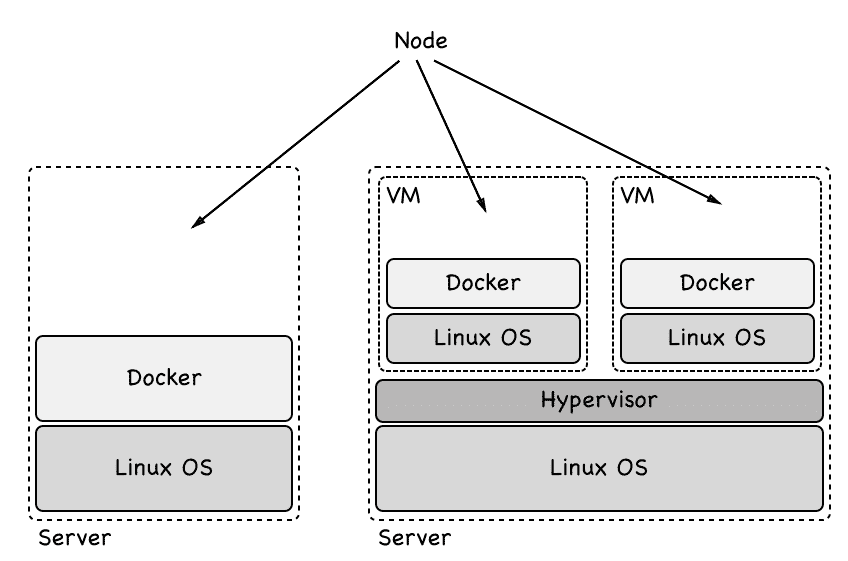

裸金属和虚拟机类型的 Docker Swarm 节点

要成为 Docker Swarm 的成员，节点必须是 Docker 主机。Docker Swarm 中的节点可以担任两种角色之一。它可以是管理节点，也可以是工作节点。管理节点做其名字所示的事情；它们管理 Swarm。而工作节点则执行应用程序工作负载。

从技术上讲，管理节点也可以是工作节点，因此运行应用程序工作负载，尽管这并不被推荐，特别是如果 Swarm 是运行关键任务应用程序的生产系统。

# Swarm 管理节点

每个 Docker Swarm 至少需要包括一个**管理节点**。出于高可用性的原因，我们应该在 Swarm 中有多个管理节点。这对于生产环境或类似生产环境尤为重要。如果我们有多个管理节点，那么这些节点将使用 Raft 一致性协议一起工作。Raft 一致性协议是一个标准协议，当多个实体需要共同工作并且始终需要就下一步执行的活动达成一致意见时，通常会使用该协议。

为了良好运行，Raft 共识协议要求在所谓的共识组中有奇数个成员。因此，我们应该始终有 1、3、5、7 等管理者节点。在这样的共识组中，总是有一个领导者。在 Docker Swarm 的情况下，最初启动 Swarm 的第一个节点成为领导者。如果领导者离开，剩下的管理者节点将选举新的领导者。共识组中的其他节点称为跟随者。

现在，让我们假设出于维护原因关闭当前的领导节点。剩下的管理者节点将选举新的领导者。当之前的领导节点恢复在线时，它将成为跟随者。新的领导者仍然是领导者。

共识组的所有成员之间进行同步通信。每当共识组需要做出决策时，领导者会要求所有跟随者同意。如果大多数管理者节点给出积极答复，那么领导者执行任务。这意味着如果我们有三个管理者节点，那么至少有一个跟随者必须同意领导者。如果我们有五个管理者节点，那么至少有两个跟随者必须同意。

由于所有管理者跟随者节点都必须与领导节点同步通信，以在集群中做出决策，所以随着形成共识组的管理者节点数量增加，决策过程变得越来越慢。Docker 的建议是在开发、演示或测试环境中使用一个管理者。在小到中等规模的 Swarm 中使用三个管理者节点，在大型到超大型的 Swarm 中使用五个管理者。在 Swarm 中使用超过五个管理者几乎没有理由。

管理者节点不仅负责管理 Swarm，还负责维护 Swarm 的状态。*我们指的是什么？*当我们谈论 Swarm 的状态时，我们指的是关于它的所有信息，例如*Swarm 中有多少节点*，*每个节点的属性是什么，比如名称或 IP 地址*。我们还指的是 Swarm 中哪个节点上运行了哪些容器等更多信息。另一方面，Swarm 状态中不包括由 Swarm 上容器中运行的应用服务产生的数据。这被称为应用数据，绝对不是由管理者节点管理的状态的一部分。

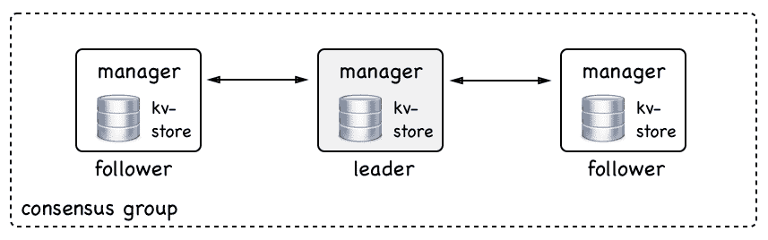

一个 Swarm 管理器共识组

所有 Swarm 状态都存储在每个**manager**节点上的高性能键值存储（**kv-store**）中。没错，每个**manager**节点都存储了整个 Swarm 状态的完整副本。这种冗余使 Swarm 具有高可用性。如果一个**manager**节点宕机，剩下的**manager**都有完整的状态可用。

如果一个新的**manager**加入共识组，那么它会与现有组成员同步 Swarm 状态，直到拥有完整的副本。在典型的 Swarm 中，这种复制通常非常快，但如果 Swarm 很大并且有许多应用程序在其中运行，可能需要一段时间。

# Swarm 工人

正如我们之前提到的，Swarm 工作节点旨在托管和运行包含我们感兴趣在集群上运行的实际应用服务的容器。它们是 Swarm 的工作马。理论上，管理节点也可以是工作节点。但是，正如我们已经说过的，这在生产系统上是不推荐的。在生产系统上，我们应该让管理节点成为管理节点。

工作节点通过所谓的控制平面彼此交流。它们使用流言协议进行通信。这种通信是异步的，这意味着在任何给定时间，可能并非所有工作节点都完全同步。

现在，您可能会问——*工作节点交换什么信息？*主要是用于服务发现和路由的信息，即关于哪些容器正在哪些节点上运行等信息：

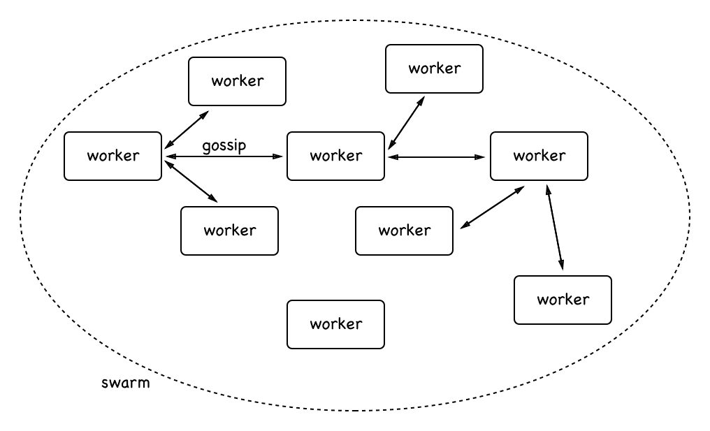

工作节点之间的通信

在上图中，您可以看到工人如何彼此交流。为了确保流言蜚语在大型 Swarm 中能够良好扩展，每个**worker**节点只与三个随机邻居同步自己的状态。对于熟悉大 O 符号的人来说，这意味着使用流言协议同步**worker**节点的规模为 O(0)。

**Worker**节点有点被动。除了运行由管理节点分配的工作负载之外，它们从不主动做任何事情。然而，**worker**确保以最佳能力运行这些工作负载。在本章后面，我们将更多地了解由管理节点分配给工作节点的工作负载。

# 堆栈、服务和任务

当使用 Docker Swarm 而不是单个 Docker 主机时，会有一种范式变化。我们不再谈论运行进程的单个容器，而是将其抽象为代表每个进程的一组副本的服务，并以这种方式变得高度可用。我们也不再谈论具有众所周知的名称和 IP 地址的单个 Docker 主机，我们现在将会提到部署服务的主机集群。我们不再关心单个主机或节点。我们不给它一个有意义的名称；对我们来说，每个节点都变成了一个数字。我们也不再关心个别容器以及它们被部署到哪里——我们只关心通过服务定义所需状态。我们可以尝试将其描述如下图所示：


容器部署到众所周知的服务器

与前面的图中将个别容器部署到众所周知的服务器不同，其中我们将**web**容器部署到具有 IP 地址`52.120.12.1`的**alpha**服务器，将**payments**容器部署到具有 IP`52.121.24.33`的**beta**服务器，我们转向了这种新的服务和 Swarm（或更一般地说，集群）的范式：

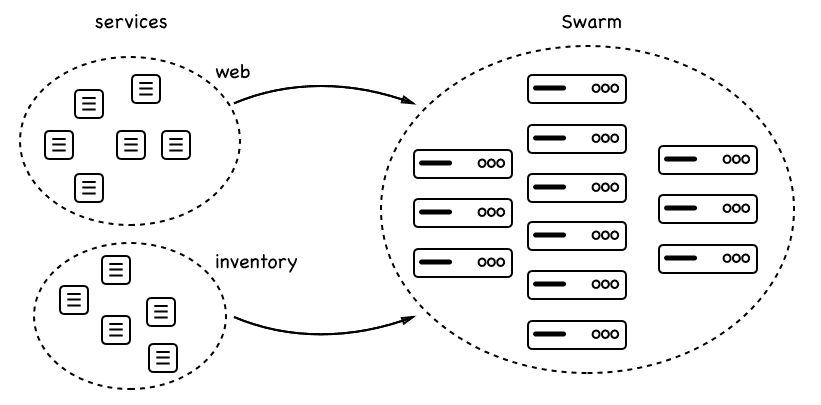

服务部署到 Swarm

在前面的图中，我们看到一个**web**服务和一个**inventory**服务都部署到了由许多节点组成的**Swarm**中。每个服务都有一定数量的副本：**web**有六个，**inventory**有五个。我们并不关心副本将在哪个节点上运行；我们只关心所请求的副本数量始终在**Swarm**调度器决定放置它们的任何节点上运行。

# 服务

Swarm 服务是一个抽象的东西。它是对我们想要在 Swarm 中运行的应用程序或应用程序服务的期望状态的描述。Swarm 服务就像一个描述，描述了以下内容：

+   服务的名称

+   用于创建容器的镜像

+   要运行的副本数量

+   服务的容器附加到的网络

+   应该映射的端口

有了这个服务清单，Swarm 管理器确保所描述的期望状态始终得到调和，如果实际状态偏离了期望状态。因此，例如，如果服务的一个实例崩溃，那么 Swarm 管理器上的调度程序会在具有空闲资源的节点上调度这个特定服务的新实例，以便重新建立期望状态。

# 任务

我们已经了解到，服务对应于应用程序服务应始终处于的期望状态的描述。该描述的一部分是服务应该运行的副本数量。每个副本由一个任务表示。在这方面，Swarm 服务包含一组任务。在 Docker Swarm 上，任务是部署的原子单位。服务的每个任务由 Swarm 调度程序部署到工作节点。任务包含工作节点运行基于服务描述的镜像的所有必要信息。在任务和容器之间存在一对一的关系。容器是在工作节点上运行的实例，而任务是这个容器作为 Swarm 服务的一部分的描述。

# 堆栈

现在我们对 Swarm 服务和任务有了一个很好的了解，我们可以介绍堆栈。堆栈用于描述一组相关的 Swarm 服务，很可能是因为它们是同一应用程序的一部分。在这种意义上，我们也可以说堆栈描述了一个由我们想要在 Swarm 上运行的一到多个服务组成的应用程序。

通常，我们在一个文本文件中以 YAML 格式进行格式化描述堆栈，并使用与已知的 Docker Compose 文件相同的语法。这导致有时人们会说堆栈是由`docker-compose`文件描述的。更好的措辞应该是：堆栈是在使用类似于`docker-compose`文件的堆栈文件中描述的。

让我们尝试用下图来说明堆栈、服务和任务之间的关系，并将其与堆栈文件的典型内容联系起来：

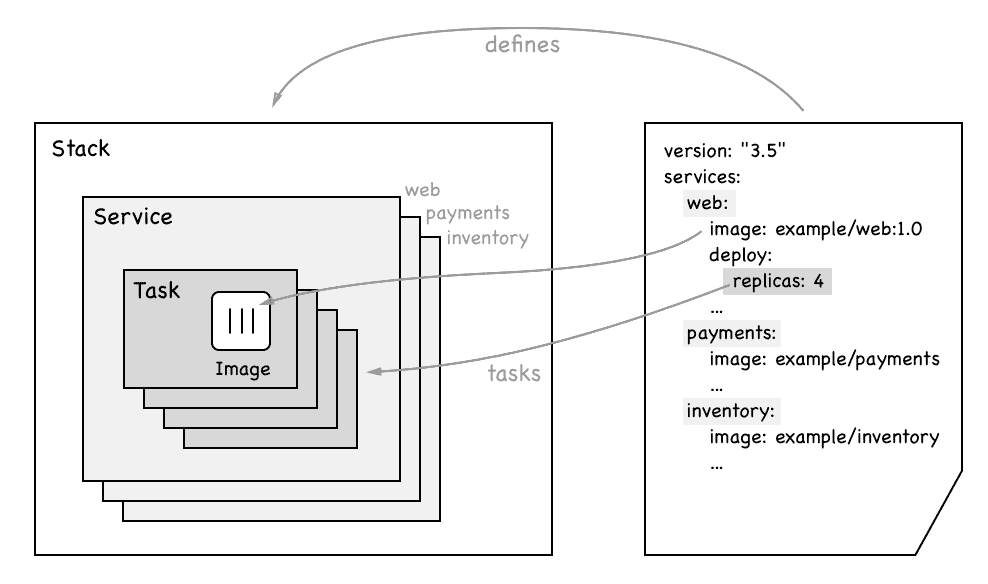

显示堆栈、服务和任务之间关系的图表

在前面的图表中，我们可以看到右侧是一个样本**Stack**的声明性描述。**Stack**包括了三种服务，分别是**web**，**payments**和**inventory**。我们还可以看到**web**服务使用**example/web:1.0**镜像，并且有四个副本。

在图表的左侧，我们可以看到**Stack**包含了提到的三种服务。每种服务又包含了一系列的**Tasks**，数量与副本一样多。在**web**服务的情况下，我们有一个包含四个**Tasks**的集合。每个**Task**包含了它将实例化容器的**Image**的名称，一旦**Task**被安排在 Swarm 节点上。

# 多主机网络

在第十章中，*单主机网络*，我们讨论了容器在单个 Docker 主机上的通信。现在，我们有一个由节点或 Docker 主机组成的 Swarm。位于不同节点上的容器需要能够相互通信。有许多技术可以帮助我们实现这个目标。Docker 选择为 Docker Swarm 实现了一个**覆盖网络**驱动程序。这个**覆盖网络**允许连接到同一**覆盖网络**的容器相互发现并自由通信。以下是**覆盖网络**的工作原理的示意图：

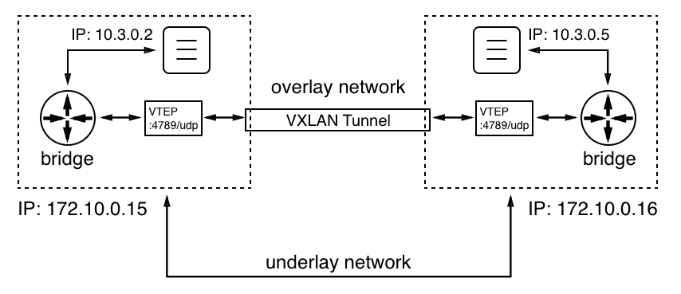

覆盖网络

我们有两个节点或 Docker 主机，IP 地址分别为`172.10.0.15`和`172.10.0.16`。我们选择的 IP 地址的值并不重要；重要的是两个主机都有不同的 IP 地址，并且通过一个物理网络（网络电缆）连接，这个网络称为**底层网络**。

在左侧的节点上有一个运行着 IP 地址为`10.3.0.2`的容器，右侧的节点上有另一个 IP 地址为`10.3.0.5`的容器。现在，前者的容器想要与后者通信。*这怎么可能？*在第十章中，*单主机网络*，我们看到了当两个容器位于同一节点上时，这是如何工作的——通过使用 Linux 桥接。但 Linux 桥接只能在本地操作，无法跨越节点。所以，我们需要另一种机制。Linux VXLAN 来解救。VXLAN 在容器出现之前就已经在 Linux 上可用。

当左侧容器发送数据包时，**桥接**意识到数据包的目标不在此主机上。现在，参与覆盖网络的每个节点都会得到一个所谓的**VXLAN 隧道端点**（**VTEP**）对象，它拦截数据包（此时的数据包是 OSI 第 2 层数据包），用包含运行目标容器的主机的目标 IP 地址的头部包装它（这样它现在是 OSI 第 3 层数据包），并将其发送到**VXLAN 隧道**。隧道另一侧的**VTEP**解包数据包并将其转发到本地桥接，本地桥接再将其转发到目标容器。

覆盖驱动程序包含在 SwarmKit 中，在大多数情况下是 Docker Swarm 的推荐网络驱动程序。还有其他来自第三方的多节点网络驱动程序可作为插件安装到每个参与的 Docker 主机上。Docker 商店提供认证的网络插件。

# 创建一个 Docker Swarm

创建一个 Docker Swarm 几乎是微不足道的。如果你知道编排器是什么，那么它是如此容易，以至于似乎不真实。但事实是，Docker 在使 Swarm 简单而优雅的使用方面做得非常出色。与此同时，Docker Swarm 已被大型企业证明在使用中非常稳健和可扩展。

# 创建一个本地单节点 Swarm

所以，想象足够了，让我们演示一下我们如何创建一个 Swarm。在其最简单的形式中，一个完全功能的 Docker Swarm 只包括一个单节点。如果你正在使用 Docker for Mac 或 Windows，甚至是使用 Docker Toolbox，那么你的个人计算机或笔记本电脑就是这样一个节点。因此，我们可以从这里开始，演示 Swarm 的一些最重要的特性。

让我们初始化一个 Swarm。在命令行上，只需输入以下命令：

```
$ docker swarm init
```

在非常短的时间后，你应该看到类似以下截图的东西：

Docker Swarm init 命令的输出

我们的计算机现在是一个 Swarm 节点。它的角色是管理者，它是领导者（管理者中的领导者，这是有道理的，因为此时只有一个管理者）。虽然`docker swarm init`只花了很短的时间就完成了，但在那段时间里命令做了很多事情。其中一些如下：

+   它创建了一个根**证书颁发机构**（**CA**）。

+   它创建了一个用于存储整个 Swarm 状态的键值存储。

现在，在前面的输出中，我们可以看到一个命令，可以用来加入我们刚刚创建的 Swarm 的其他节点。命令如下：

```
$ docker swarm join --token <join-token> <IP address>:2377
```

在这里，我们有以下内容：

+   <join-token>是 Swarm 领导者在初始化 Swarm 时生成的令牌。

+   <IP 地址>是领导者的 IP 地址。

尽管我们的集群仍然很简单，因为它只包含一个成员，但我们仍然可以要求 Docker CLI 列出 Swarm 的所有节点。这将类似于以下屏幕截图：

列出 Docker Swarm 的节点

在此输出中，我们首先看到赋予节点的 ID。跟随 ID 的星号（*）表示这是执行 docker node ls 的节点，基本上表示这是活动节点。然后，我们有节点的（人类可读的）名称，其状态，可用性和管理器状态。正如前面提到的，Swarm 的第一个节点自动成为领导者，这在前面的屏幕截图中有所指示。最后，我们看到我们正在使用的 Docker 引擎的版本。

要获取有关节点的更多信息，我们可以使用 docker node inspect 命令，如下面的屏幕截图所示：

使用 docker node inspect 命令的截断输出

此命令生成了大量信息，因此我们只呈现输出的截断版本。例如，当您需要排除集群节点的故障时，此输出可能很有用。

# 在 VirtualBox 或 Hyper-V 中创建本地 Swarm

有时，单个节点的 Swarm 是不够的，但我们没有或不想使用帐户在云中创建 Swarm。在这种情况下，我们可以在 VirtualBox 或 Hyper-V 中创建本地 Swarm。在 VirtualBox 中创建 Swarm 比在 Hyper-V 中创建 Swarm 稍微容易一些，但是如果您使用 Windows 10 并且正在运行 Docker for Windows，则无法同时使用 VirtualBox。这两个 hypervisor 是互斥的。

假设我们的笔记本电脑上已安装了 VirtualBox 和 docker-machine。然后，我们可以使用 docker-machine 列出当前定义并可能在 VirtualBox 中运行的所有 Docker 主机：

```
$ docker-machine ls
NAME ACTIVE DRIVER STATE URL SWARM DOCKER ERRORS
default - virtualbox Stopped Unknown
```

在我的情况下，我定义了一个名为 default 的 VM，当前已停止。我可以通过发出 docker-machine start default 命令轻松启动 VM。此命令需要一段时间，并将导致以下（缩短的）输出：

```
$ docker-machine start default
Starting "default"...
(default) Check network to re-create if needed...
(default) Waiting for an IP...
Machine "default" was started.
Waiting for SSH to be available...
Detecting the provisioner...
Started machines may have new IP addresses. You may need to re-run the `docker-machine env` command.
```

现在，如果我再次列出我的虚拟机，我应该看到以下截图：

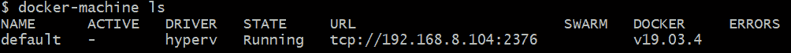在 Hyper-V 中运行的所有虚拟机列表

如果我们还没有名为`default`的虚拟机，我们可以使用`create`命令轻松创建一个：

```
docker-machine create --driver virtualbox default
```

这将产生以下输出：

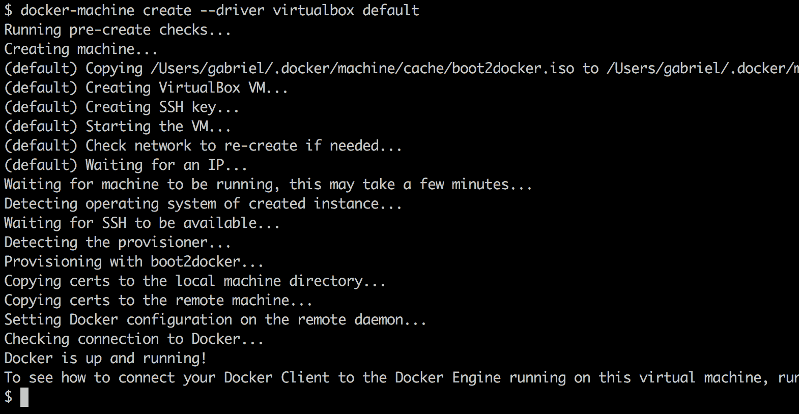docker-machine create 的输出

我们可以在前面的输出中看到`docker-machine`如何从 ISO 映像创建虚拟机，定义 SSH 密钥和证书，并将它们复制到虚拟机和本地`~/.docker/machine`目录，以便我们以后在通过 Docker CLI 远程访问此虚拟机时使用。它还为新的虚拟机提供了一个 IP 地址。

我们使用`docker-machine create`命令和`--driver virtualbox`参数。docker-machine 也可以使用其他驱动程序，如 Hyper-V、AWS、Azure、DigitalOcean 等。有关更多信息，请参阅`docker-machine`的文档。默认情况下，新的虚拟机关联了 1GB 的内存，这足以将此虚拟机用作开发或测试 Swarm 的节点。

如果您使用的是带有 Docker for Desktop 的 Windows 10，请改用`hyperv`驱动程序。但是，要成功，您需要以管理员身份运行。此外，您需要在 Hyper-V 上首先定义一个外部虚拟交换机。您可以使用 Hyper-V 管理器来完成。该命令的输出将与`virtualbox`驱动程序的输出非常相似。

现在，让我们为一个五节点的 Swarm 创建五个虚拟机。我们可以使用一些脚本来减少手动工作：

```
$ for NODE in `seq 1 5`; do
  docker-machine create --driver virtualbox "node-${NODE}"
done
```

`docker-machine`现在将创建五个名为`node-1`到`node-5`的虚拟机。这可能需要一些时间，所以现在是喝杯热茶的好时机。虚拟机创建完成后，我们可以列出它们：

我们需要 Swarm 的所有虚拟机列表

现在，我们准备构建一个 Swarm。从技术上讲，我们可以 SSH 到第一个 VM `node-1`并初始化一个 Swarm，然后 SSH 到所有其他 VM 并加入它们到 Swarm 领导者。但这并不高效。让我们再次使用一个可以完成所有繁重工作的脚本：

```
# get IP of Swarm leader
$ export IP=$(docker-machine ip node-1)
# init the Swarm
$ docker-machine ssh node-1 docker swarm init --advertise-addr $IP
# Get the Swarm join-token
$ export JOIN_TOKEN=$(docker-machine ssh node-1 \
    docker swarm join-token worker -q)
```

现在我们有了加入令牌和 Swarm 领导者的 IP 地址，我们可以要求其他节点加入 Swarm，如下所示：

```
$ for NODE in `seq 2 5`; do
  NODE_NAME="node-${NODE}"
  docker-machine ssh $NODE_NAME docker swarm join \
        --token $JOIN_TOKEN $IP:2377
done
```

为了使 Swarm 具有高可用性，我们现在可以将例如`node-2`和`node-3`提升为管理者：

```
$ docker-machine ssh node-1 docker node promote node-2 node-3
Node node-2 promoted to a manager in the swarm.
Node node-3 promoted to a manager in the swarm.
```

最后，我们可以列出 Swarm 的所有节点：

```
$ docker-machine ssh node-1 docker node ls
```

我们应该看到以下内容：

VirtualBox 上 Docker Swarm 的所有节点列表

这证明我们刚刚在本地笔记本电脑或工作站上创建了一个高可用的 Docker Swarm。让我们把所有的代码片段放在一起，使整个过程更加健壮。脚本如下所示：

```
alias dm="docker-machine"
for NODE in `seq 1 5`; do
  NODE_NAME=node-${NODE}
  dm rm --force $NODE_NAME
  dm create --driver virtualbox $NODE_NAME
done
alias dms="docker-machine ssh"
export IP=$(docker-machine ip node-1)
dms node-1 docker swarm init --advertise-addr $IP;
export JOIN_TOKEN=$(dms node-1 docker swarm join-token worker -q);
for NODE in `seq 2 5`; do
  NODE_NAME="node-${NODE}"
  dms $NODE_NAME docker swarm join --token $JOIN_TOKEN $IP:2377
done;
dms node-1 docker node promote node-2 node-3
```

上述脚本首先删除（如果存在），然后重新创建名为`node-1`到`node-5`的五个虚拟机，然后在`node-1`上初始化一个 Swarm。之后，剩下的四个虚拟机被添加到 Swarm 中，最后，`node-2`和`node-3`被提升为管理者状态，使 Swarm 高可用。整个脚本执行时间不到 5 分钟，可以重复执行多次。完整的脚本可以在存储库的`docker-swarm`子文件夹中找到；它被称为`create-swarm.sh`。

在我们的笔记本电脑或工作站上，始终编写脚本并自动化操作是一种强烈推荐的最佳实践。

# 使用 Play with Docker 生成一个 Swarm

为了在我们的计算机上**无需**安装或配置**任何**东西的情况下尝试 Docker Swarm，我们可以使用**Play with Docker**（**PWD**）。PWD 是一个可以通过浏览器访问的网站，它为我们提供了创建一个由最多五个节点组成的 Docker Swarm 的能力。正如名称所示，它绝对是一个游乐场，我们可以使用的时间限制为每个会话四个小时。我们可以打开尽可能多的会话，但每个会话在四小时后会自动结束。除此之外，它是一个完全功能的 Docker 环境，非常适合尝试 Docker 或演示一些功能。

现在让我们访问该网站。在浏览器中，导航到网站[`labs.play-with-docker.com`](https://labs.play-with-docker.com)。您将看到一个欢迎和登录屏幕。使用您的 Docker ID 登录。成功登录后，您将看到一个看起来像以下截图的屏幕：

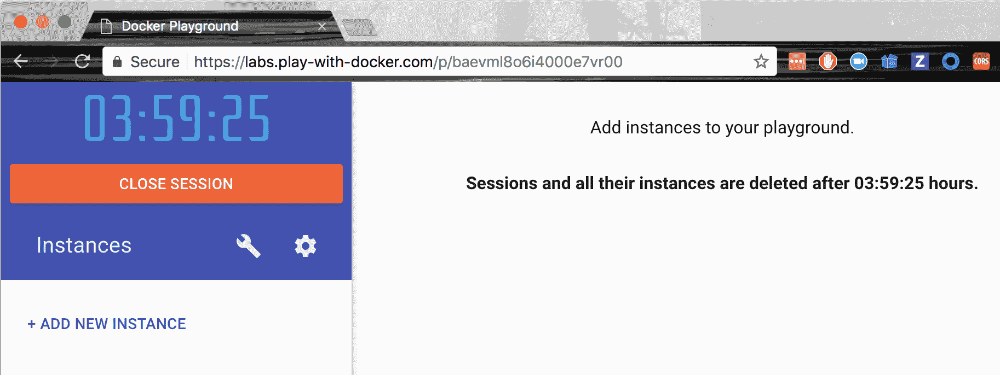Play with Docker 窗口

正如我们立即看到的，有一个大计时器从四小时开始倒计时。这是我们在本次会话中剩下的时间。此外，我们看到一个+ ADD NEW INSTANCE 链接。单击它以创建一个新的 Docker 主机。这样做后，您的屏幕应该看起来像以下的截图：

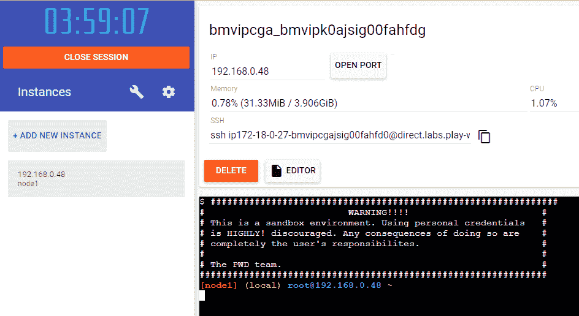PWD 带有一个新节点

在左侧，我们看到了新创建的节点及其 IP 地址（`192.168.0.48`）和名称（`node1`）。在右侧，屏幕的上半部分显示了有关这个新节点的一些额外信息，下半部分显示了一个终端。是的，这个终端用于在我们刚刚创建的节点上执行命令。这个节点已经安装了 Docker CLI，因此我们可以在上面执行所有熟悉的 Docker 命令，比如`docker version`。试一下吧。

但现在我们想要创建一个 Docker Swarm。在浏览器的终端中执行以下命令：

```
$ docker swarm init --advertise-addr=eth0
```

前面命令生成的输出与我们之前在工作站上使用单节点集群和在 VirtualBox 或 Hyper-V 上使用本地集群时已经知道的内容相对应。重要的信息再次是我们想要用来加入额外节点到我们刚刚创建的集群的`join`命令。

你可能已经注意到，这次我们在 Swarm 的`init`命令中指定了`--advertise-addr`参数。*为什么在这里有必要？*原因是 PWD 生成的节点有多个与之关联的 IP 地址。我们可以通过在节点上执行`ip a`命令轻松验证这一点。这个命令将向我们显示确实存在两个端点，`eth0`和`eth1`。因此，我们必须明确地指定给新的 Swarm 管理器我们想要使用哪一个。在我们的情况下，是`eth0`。

通过点击四次“+添加新实例”链接在 PWD 中创建四个额外的节点。新节点将被命名为`node2`、`node3`、`node4`和`node5`，并且都将列在左侧。如果你点击左侧的一个节点，右侧将显示相应节点的详细信息和该节点的终端窗口。

选择每个节点（2 到 5）并在相应的终端中执行从领导节点（`node1`）复制的`docker swarm join`命令：

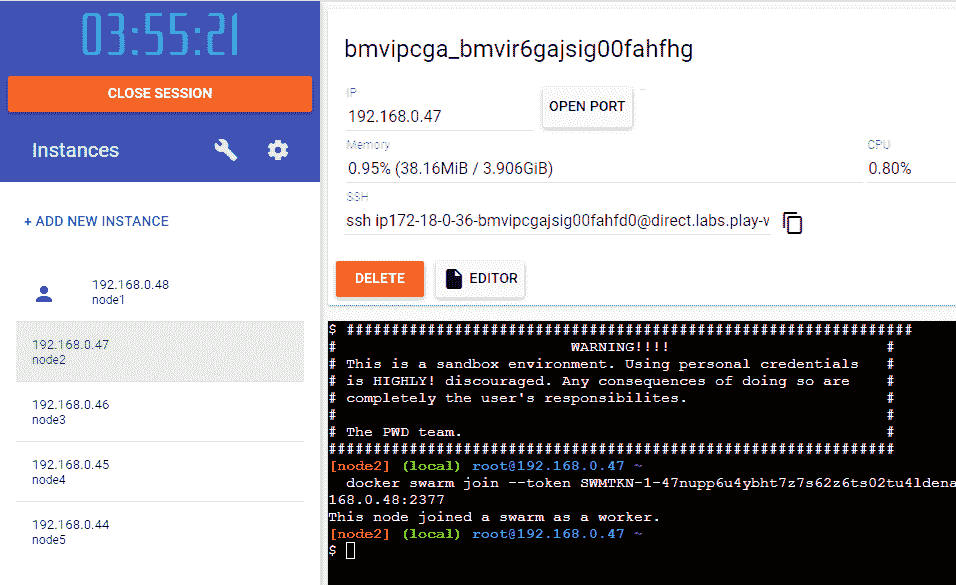加入节点到 PWD 中的 Swarm

一旦你将所有四个节点加入到 Swarm 中，切换回`node1`并列出所有节点，结果如下：

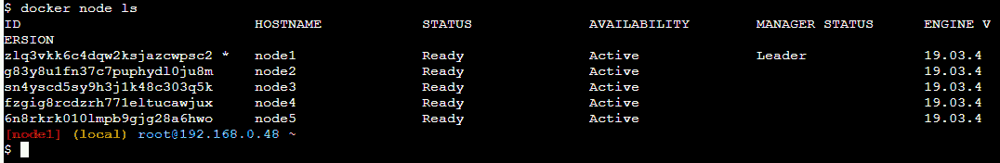PWD 中 Swarm 的所有节点列表

仍然在`node1`上，我们现在可以提升，比如说，`node2`和`node3`，使 Swarm 高度可用：

```
$ docker node promote node2 node3
Node node2 promoted to a manager in the swarm.
Node node3 promoted to a manager in the swarm.
```

有了这个，我们在 PWD 上的 Swarm 已经准备好接受工作负载。我们已经创建了一个高可用的 Docker Swarm，其中包括三个管理节点，形成一个 Raft 共识组，以及两个工作节点。

# 在云端创建一个 Docker Swarm

到目前为止，我们创建的所有 Docker Swarms 都非常适合在开发中使用，或者用于实验或演示目的。但是，如果我们想创建一个可以用作生产环境的 Swarm，在那里运行我们的关键应用程序，那么我们需要在云端或本地创建一个——我很想说——真正的 Swarm。在本书中，我们将演示如何在 AWS 中创建 Docker Swarm。

创建 Swarm 的一种方法是使用**docker-machine**（**DM**）。DM 在 AWS 上有一个驱动程序。如果我们在 AWS 上有一个账户，我们需要 AWS 访问密钥 ID 和 AWS 秘密访问密钥。我们可以将这两个值添加到一个名为`~/.aws/configuration`的文件中。它应该看起来像下面这样：

```
[default]
aws_access_key_id = AKID1234567890
aws_secret_access_key = MY-SECRET-KEY
```

每次我们运行`docker-machine create`，DM 都会在该文件中查找这些值。有关如何获取 AWS 账户和获取两个秘钥的更深入信息，请参考此链接：[`dockr.ly/2FFelyT`](http://dockr.ly/2FFelyT)。

一旦我们有了 AWS 账户并将访问密钥存储在配置文件中，我们就可以开始构建我们的 Swarm。所需的代码看起来与我们在 VirtualBox 上的本地机器上创建 Swarm 时使用的代码完全相同。让我们从第一个节点开始：

```
$ docker-machine create --driver amazonec2 \
 --amazonec2-region us-east-1 aws-node-1
```

这将在请求的区域（在我的情况下是`us-east-1`）中创建一个名为`aws-node-1`的 EC2 实例。前面命令的输出如下截图所示：

使用 DM 在 AWS 上创建一个 Swarm 节点

它看起来与我们已经知道的与 VirtualBox 一起工作的输出非常相似。我们现在可以配置我们的终端以远程访问该 EC2 实例：

```
$ eval $(docker-machine env aws-node-1)
```

这将相应地配置 Docker CLI 使用的环境变量：

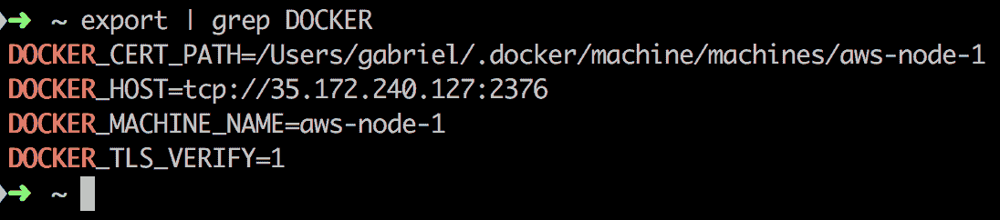Docker 用于启用对 AWS EC2 节点的远程访问的环境变量

出于安全原因，**传输层安全**（**TLS**）用于我们的 CLI 和远程节点之间的通信。DM 将必要的证书复制到我们分配给环境变量`DOCKER_CERT_PATH`的路径。

我们现在在终端中执行的所有 Docker 命令都将在我们的 EC2 实例上远程执行。让我们尝试在此节点上运行 Nginx：

```
$ docker container run -d -p 8000:80 nginx:alpine
```

我们可以使用`docker container ls`来验证容器是否正在运行。如果是的话，让我们使用`curl`进行测试：

```
$ curl -4 <IP address>:8000
```

这里，`<IP 地址>`是 AWS 节点的公共 IP 地址；在我的情况下，它将是`35.172.240.127`。遗憾的是，这不起作用；前面的命令超时：

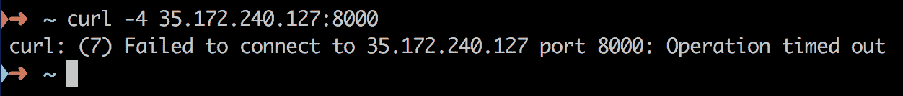访问 AWS 节点上的 Nginx 超时

原因是我们的节点是 AWS **安全组**（SG）的一部分。默认情况下，拒绝对此 SG 内部的对象的访问。因此，我们必须找出我们的实例属于哪个 SG，并显式配置访问权限。为此，我们通常使用 AWS 控制台。转到 EC2 仪表板，并在左侧选择实例。找到名为`aws-node-1`的 EC2 实例并选择它。在详细视图中，在“安全组”下，单击 docker-machine 链接，如下图所示：

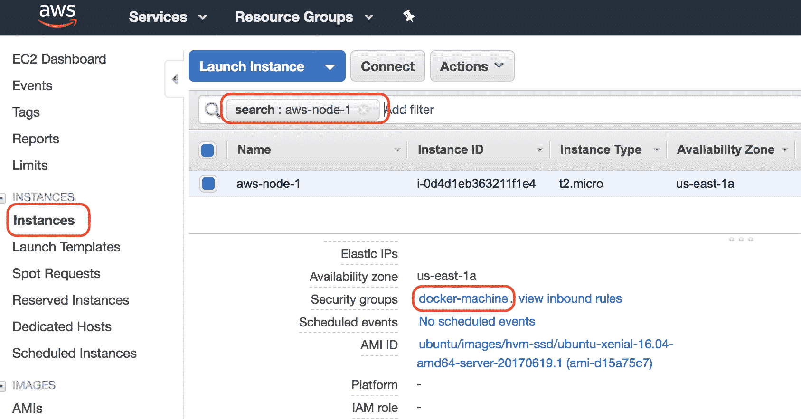找到我们的 Swarm 节点所属的 SG

这将引导我们到 SG 页面，其中`docker-machine` SG 被预先选择。在“入站”选项卡下的详细信息部分，为您的 IP 地址（工作站的 IP 地址）添加一个新规则：


为我们的计算机打开 SG 访问权限

在前面的屏幕截图中，IP 地址`70.113.114.234`恰好是分配给我的个人工作站的 IP 地址。我已经允许来自此 IP 地址的所有入站流量进入`docker-machine` SG。请注意，在生产系统中，您应该非常小心地选择要向公众开放的 SG 端口。通常，这是用于 HTTP 和 HTTPS 访问的端口`80`和`443`。其他所有内容都是对黑客的潜在邀请。

您可以通过诸如[`www.whatismyip.com/`](https://www.whatismyip.com/)之类的服务获取自己的 IP 地址。现在，如果我们再次执行`curl`命令，将返回 Nginx 的欢迎页面。

在我们离开 SG 之前，我们应该向其添加另一个规则。Swarm 节点需要能够通过 TCP 和 UDP 自由通信的端口`7946`和`4789`，以及通过 TCP 的端口`2377`。我们现在可以添加五个符合这些要求的规则，其中源是 SG 本身，或者我们只需定义一个允许 SG 内部所有入站流量的粗糙规则（在我的情况下是`sg-c14f4db3`）：

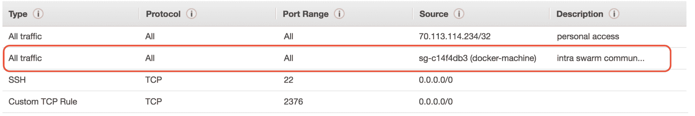 SG 规则以启用 Swarm 内部通信

现在，让我们继续创建剩下的四个节点。我们可以再次使用脚本来简化这个过程：

```
$ for NODE in `seq 2 5`; do
 docker-machine create --driver amazonec2 \
 --amazonec2-region us-east-1 aws-node-${NODE}
done
```

节点的配置完成后，我们可以使用 DM 列出所有节点。在我的情况下，我看到了这个：

DM 创建的所有节点列表

在前面的截图中，我们可以看到我们最初在 VirtualBox 中创建的五个节点和我们在 AWS 中创建的五个新节点。显然，AWS 上的节点正在使用一个新版本的 Docker；这里的版本是`18.02.0-ce`。我们在`URL`列中看到的 IP 地址是我的 EC2 实例的公共 IP 地址。

因为我们的 CLI 仍然配置为远程访问`aws-node-1`节点，所以我们可以直接运行以下`swarm init`命令：

```
$ docker swarm init
```

要获取加入令牌，请执行以下操作：

```
$ export JOIN_TOKEN=$(docker swarm join-token -q worker)
```

要获取领导者的 IP 地址，请使用以下命令：

```
$ export LEADER_ADDR=$(docker node inspect \
 --format "{{.ManagerStatus.Addr}}" self)
```

有了这些信息，我们现在可以将其他四个节点加入到 Swarm 的领导者中：

```
$ for NODE in `seq 2 5`; do
 docker-machine ssh aws-node-${NODE} \
 sudo docker swarm join --token ${JOIN_TOKEN} ${LEADER_ADDR}
done
```

实现相同目标的另一种方法是，无需登录到各个节点，每次想要访问不同的节点时都重新配置我们的客户端 CLI：

```
$ for NODE in `seq 2 5`; do
 eval $(docker-machine env aws-node-${NODE})
 docker swarm join --token ${JOIN_TOKEN} ${LEADER_ADDR}
done
```

作为最后一步，我们希望将节点`2`和`3`提升为管理节点：

```
$ eval $(docker-machine env node-1)
$ docker node promote aws-node-2 aws-node-3
```

然后，我们可以列出所有 Swarm 节点，如下截图所示：

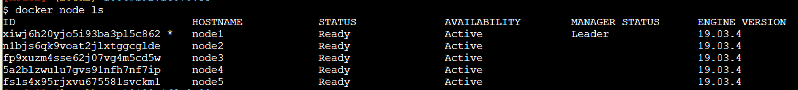云中我们 Swarm 的所有节点列表

因此，我们在云中拥有一个高可用的 Docker Swarm。为了清理云中的 Swarm 并避免产生不必要的成本，我们可以使用以下命令：

```
$ for NODE in `seq 1 5`; do
 docker-machine rm -f aws-node-${NODE}
done
```

# 部署第一个应用程序

我们在各种平台上创建了一些 Docker Swarms。一旦创建，Swarm 在任何平台上的行为都是相同的。我们在 Swarm 上部署和更新应用程序的方式并不依赖于平台。Docker 的主要目标之一就是避免在使用 Swarm 时出现供应商锁定。支持 Swarm 的应用程序可以轻松地从例如在本地运行的 Swarm 迁移到基于云的 Swarm。甚至在技术上可以在本地运行 Swarm 的一部分，另一部分在云中运行。这是可行的，但我们当然必须考虑由于地理上相距较远的节点之间的更高延迟可能导致的可能的副作用。

现在我们有一个高可用的 Docker Swarm 正在运行，是时候在其上运行一些工作负载了。我正在使用通过 docker-machine 创建的本地 Swarm。我们将首先创建一个单一服务。为此，我们需要 SSH 登录到其中一个管理节点。我选择`node-1`：

```
$ docker-machine ssh node-1
```

# 创建一个服务

服务可以作为堆栈的一部分创建，也可以直接使用 Docker CLI 创建。让我们首先看一个定义单一服务的示例堆栈文件：

```
version: "3.7"
services:
  whoami:
    image: training/whoami:latest
    networks:
      - test-net
    ports:
      - 81:8000
    deploy:
      replicas: 6
      update_config:
        parallelism: 2
        delay: 10s
      labels:
        app: sample-app
        environment: prod-south

networks:
  test-net:
    driver: overlay
```

在前面的示例中，我们看到了一个名为`whoami`的服务的期望状态：

+   它基于`training/whoami:latest`镜像。

+   服务的容器连接到`test-net`网络。

+   容器端口`8000`发布到端口`81`。

+   它以六个副本（或任务）运行

+   在滚动更新期间，单个任务以每批两个的方式更新，每个成功批之间延迟 10 秒。

+   该服务（及其任务和容器）被分配了两个标签`app`和`environment`，其值分别为`sample-app`和`prod-south`。

我们可以为服务定义许多其他设置，但前面的设置是一些更重要的设置。大多数设置都有有意义的默认值。例如，如果我们没有指定副本的数量，那么 Docker 会将其默认为`1`。服务的名称和镜像当然是必需的。请注意，服务的名称在 Swarm 中必须是唯一的。

要创建前面的服务，我们使用`docker stack deploy`命令。假设存储前面内容的文件名为`stack.yaml`，我们有以下内容：

```
$ docker stack deploy -c stack.yaml sample-stack
```

在这里，我们创建了一个名为`sample-stack`的堆栈，其中包含一个名为`whoami`的服务。我们可以列出我们的 Swarm 上的所有堆栈，然后我们应该得到这个：

```
$ docker stack ls
NAME             SERVICES
sample-stack     1
```

如果我们列出我们的 Swarm 中定义的服务，我们会得到以下输出：

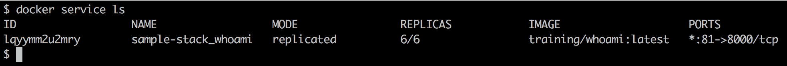列出在 Swarm 中运行的所有服务

在输出中，我们可以看到目前只有一个正在运行的服务，这是可以预料的。该服务有一个`ID`。与迄今为止用于容器、网络或卷的格式相反，`ID`的格式是字母数字（在后一种情况下，它总是`sha256`）。我们还可以看到服务的`NAME`是我们在堆栈文件中定义的服务名称和堆栈的名称的组合，堆栈的名称被用作前缀。这是有道理的，因为我们希望能够使用相同的堆栈文件将多个堆栈（具有不同名称）部署到我们的 Swarm 中。为了确保服务名称是唯一的，Docker 决定将服务名称和堆栈名称组合起来。

在第三列中，我们看到模式是`replicated`。`REPLICAS`的数量显示为`6/6`。这告诉我们，六个请求的`REPLICAS`中有六个正在运行。这对应于期望的状态。在输出中，我们还可以看到服务使用的镜像和服务的端口映射。

# 检查服务及其任务

在前面的输出中，我们看不到已创建的`6`个副本的详细信息。为了更深入地了解这一点，我们可以使用`docker service ps`命令。如果我们为我们的服务执行此命令，我们将得到以下输出：

whoami 服务的详细信息

在前面的输出中，我们可以看到与我们请求的`whoami`服务的六个副本相对应的六个任务的列表。在`NODE`列中，我们还可以看到每个任务部署到的节点。每个任务的名称是服务名称加上递增索引的组合。还要注意，与服务本身类似，每个任务都被分配了一个字母数字 ID。

在我的情况下，显然任务 2，名称为`sample-stack_whoami.2`，已部署到了`node-1`，这是我们 Swarm 的领导者。因此，我应该在这个节点上找到一个正在运行的容器。让我们看看如果我们列出在`node-1`上运行的所有容器会得到什么：

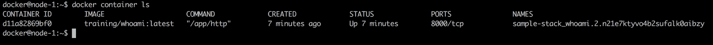节点 1 上的容器列表

预期地，我们发现一个容器正在运行`training/whoami:latest`镜像，其名称是其父任务名称和 ID 的组合。我们可以尝试可视化我们部署示例堆栈时生成的所有对象的整个层次结构：


Docker Swarm 堆栈的对象层次结构

**堆栈**可以由一个到多个服务组成。每个服务都有一组任务。每个任务与一个容器有一对一的关联。堆栈和服务是在 Swarm 管理节点上创建和存储的。然后将任务调度到 Swarm 工作节点，工作节点在那里创建相应的容器。我们还可以通过检查来获取有关我们的服务的更多信息。执行以下命令：

```
$ docker service inspect sample-stack_whoami
```

这提供了有关服务的所有相关设置的丰富信息。这包括我们在`stack.yaml`文件中明确定义的设置，但也包括我们没有指定的设置，因此被分配了它们的默认值。我们不会在这里列出整个输出，因为它太长了，但我鼓励读者在自己的机器上检查它。我们将在*Swarm 路由网格*部分更详细地讨论部分信息。

# 服务的日志

在早些章节中，我们处理了容器产生的日志。在这里，我们专注于一个服务。请记住，最终，具有许多副本的服务有许多容器在运行。因此，我们期望，如果我们要求服务的日志，Docker 会返回属于该服务的所有容器的日志的聚合。确实，这就是我们使用`docker service logs`命令得到的内容：

whoami 服务的日志

在这一点上，日志中没有太多信息，但足以讨论我们得到了什么。日志中每行的第一部分始终包含容器的名称，以及日志条目来源的节点名称。然后，通过竖线（`|`）分隔，我们得到实际的日志条目。因此，如果我们直接要求获取列表中第一个容器的日志，我们将只获得一个条目，而在这种情况下我们将看到的值是`Listening on :8000`。

使用`docker service logs`命令获取的聚合日志没有按任何特定方式排序。因此，如果事件的相关性发生在不同的容器中，您应该在日志输出中添加信息，使这种相关性成为可能。通常，这是每个日志条目的时间戳。但这必须在源头完成；例如，产生日志条目的应用程序还需要确保添加时间戳。

我们也可以通过提供任务 ID 而不是服务 ID 或名称来查询服务的单个任务的日志。因此，查询任务 2 的日志会给我们以下输出：

whoami 服务的单个任务的日志

# 调和期望的状态

我们已经了解到，Swarm 服务是我们希望应用程序或应用程序服务在其中运行的期望状态的描述或清单。现在，让我们看看 Docker Swarm 如何调和这个期望的状态，如果我们做了一些导致服务的实际状态与期望状态不同的事情。这样做的最简单方法是强制杀死服务的一个任务或容器。

让我们用安排在`node-1`上的容器来做这个：

```
$ docker container rm -f sample-stack_whoami.2.n21e7ktyvo4b2sufalk0aibzy
```

如果我们这样做，然后立即运行`docker service ps`，我们将看到以下输出：

Docker Swarm 在一个任务失败后调和期望的状态

我们看到任务 2 以退出码`137`失败，并且 Swarm 立即通过在具有空闲资源的节点上重新调度失败的任务来调和期望的状态。在这种情况下，调度程序选择了与失败任务相同的节点，但这并不总是这样。因此，在我们不干预的情况下，Swarm 完全解决了问题，并且由于服务正在多个副本中运行，服务从未停机。

让我们尝试另一种失败场景。这一次，我们将关闭整个节点，并看看 Swarm 的反应。让我们选择`node-2`，因为它上面有两个任务（任务 3 和任务 4）正在运行。为此，我们需要打开一个新的终端窗口，并使用`docker-machine`来停止`node-2`：

```
$ docker-machine stop node-2
```

回到`node-1`，我们现在可以再次运行`docker service ps`来看看发生了什么：

Swarm 重新安排了一个失败节点的所有任务

在前面的屏幕截图中，我们可以看到立即任务 3 被重新安排在`node-1`上，而任务 4 被重新安排在`node-3`上。即使这种更激进的失败也能被 Docker Swarm 优雅地处理。

但需要注意的是，如果`node-2`在 Swarm 中重新上线，之前在其上运行的任务将不会自动转移到它上面。但是该节点现在已经准备好接受新的工作负载。

# 删除服务或堆栈

如果我们想要从 Swarm 中移除特定的服务，我们可以使用`docker service rm`命令。另一方面，如果我们想要从 Swarm 中移除一个堆栈，我们类似地使用`docker stack rm`命令。这个命令会移除堆栈定义中的所有服务。在`whoami`服务的情况下，它是通过使用堆栈文件创建的，因此我们将使用后者命令：

移除一个堆栈

上述命令将确保堆栈的每个服务的所有任务被终止，并且相应的容器首先发送`SIGTERM`，然后，如果不成功，在 10 秒的超时后发送`SIGKILL`。

重要的是要注意，停止的容器不会从 Docker 主机中删除。因此，建议定期清理工作节点上的容器，以回收未使用的资源。为此，使用`docker container purge -f`。

问题：为什么让停止或崩溃的容器留在工作节点上，而不自动删除它们是有意义的？

# 部署多服务堆栈

在第十一章中，*Docker Compose*，我们使用了一个由两个服务组成的应用程序，在 Docker compose 文件中进行了声明性描述。我们可以使用这个 compose 文件作为模板，创建一个堆栈文件，允许我们将相同的应用程序部署到 Swarm 中。我们的堆栈文件的内容，名为`pet-stack.yaml`，如下所示：

```
version: "3.7"
services:
 web:
   image: fundamentalsofdocker/ch11-web:2.0
   networks:
   - pets-net
   ports:
   - 3000:3000
   deploy:
     replicas: 3
 db:
   image: fundamentalsofdocker/ch11-db:2.0
   networks:
   - pets-net
   volumes:
   - pets-data:/var/lib/postgresql/data

volumes:
 pets-data:

networks:
 pets-net:
 driver: overlay
```

我们要求`web`服务有三个副本，并且两个服务都连接到叠加网络`pets-net`。我们可以使用`docker stack deploy`命令部署这个应用程序：

部署宠物堆栈

Docker 创建了`pets_pets-net`叠加网络，然后创建了两个服务`pets_web`和`pets_db`。然后我们可以列出`pets`堆栈中的所有任务：

宠物堆栈中所有任务的列表

最后，让我们使用`curl`测试应用程序。确实，应用程序按预期工作：

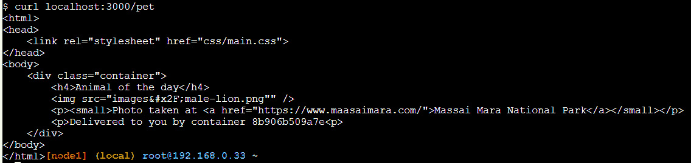使用 curl 测试宠物应用程序

容器 ID 在输出中，其中写着`由容器 8b906b509a7e 提供给您`。如果多次运行`curl`命令，ID 应该在三个不同的值之间循环。这些是我们为`web`服务请求的三个容器（或副本）的 ID。

完成后，我们可以使用`docker stack rm pets`来删除堆栈。

# Swarm 路由网格

如果你一直在关注，那么你可能已经注意到了上一节中的一些有趣的事情。我们部署了`pets`应用程序，结果是`web`服务的一个实例被安装在三个节点`node-1`、`node-2`和`node-3`上。然而，我们能够通过`localhost`访问`node-1`上的`web`服务，并从那里访问每个容器。*这是怎么可能的？*嗯，这是由于所谓的 Swarm 路由网格。路由网格确保当我们发布一个服务的端口时，该端口会在 Swarm 的所有节点上发布。因此，命中 Swarm 的任何节点并请求使用特定端口的网络流量将通过路由网格转发到服务容器之一。让我们看看下面的图表，看看它是如何工作的：


Docker Swarm 路由网格

在这种情况下，我们有三个节点，称为**主机 A**到**主机 C**，它们的 IP 地址分别是`172.10.0.15`、`172.10.0.17`和`172.10.0.33`。在图表的左下角，我们看到了创建一个具有两个副本的**web**服务的命令。相应的任务已经被安排在**主机 B**和**主机 C**上。任务 1 落在**主机 B**上，而任务 2 落在**主机 C**上。

当在 Docker Swarm 上创建服务时，它会自动分配一个**虚拟 IP**（VIP）地址。这个 IP 地址在整个服务的生命周期内是稳定和保留的。假设在我们的情况下，VIP 是`10.2.0.1`。

如果现在来自外部**负载均衡器**（**LB**）的端口`8080`的请求被定向到我们 Swarm 的一个节点上，那么这个请求将由该节点上的 Linux **IP 虚拟服务器**（**IPVS**）服务处理。该服务在 IP 表中使用给定的端口`8080`进行查找，并将找到这对应于**web**服务的 VIP。现在，由于 VIP 不是一个真正的目标，IPVS 服务将负载均衡与该服务关联的任务的 IP 地址。在我们的情况下，它选择了任务 2，其 IP 地址为`10.2.0.3`。最后，**入口**网络（**Overlay**）用于将请求转发到**Host C**上的目标容器。

重要的是要注意，外部请求被**外部 LB**转发到哪个 Swarm 节点并不重要。路由网格将始终正确处理请求并将其转发到目标服务的任务之一。

# 总结

在本章中，我们介绍了 Docker Swarm，它是继 Kubernetes 之后第二受欢迎的容器编排器。我们研究了 Swarm 的架构，讨论了在 Swarm 中运行的所有类型的资源，如服务、任务等，并在 Swarm 中创建了服务，并部署了由多个相关服务组成的应用程序。

在下一章中，我们将探讨如何在 Docker Swarm 上部署服务或应用程序，实现零停机时间和自动回滚功能。我们还将介绍秘密作为保护敏感信息的手段。

# 问题

为了评估您的学习进度，请回答以下问题：

1.  如何初始化一个新的 Docker Swarm？

A. `docker init swarm`

B. `docker swarm init --advertise-addr <IP 地址>`

C. `docker swarm join --token <加入令牌>`

1.  您想要从 Docker Swarm 中删除一个工作节点。需要哪些步骤？

1.  如何创建一个名为`front-tier`的覆盖网络？使网络可附加。

1.  您将如何从`nginx:alpine`镜像创建一个名为`web`的服务，该服务有五个副本，将端口`3000`暴露在入口网络上，并附加到`front-tier`网络？

1.  您将如何将 web 服务缩减到三个实例？

# 进一步阅读

请参考以下链接，了解有关所选主题的更深入信息：

+   AWS EC2 示例在[`dockr.ly/2FFelyT`](http://dockr.ly/2FFelyT)

+   Raft 一致性算法在[`raft.github.io/`](https://raft.github.io/)

+   Gossip Protocol 的[`en.wikipedia.org/wiki/Gossip_protocol`](https://en.wikipedia.org/wiki/Gossip_protocol)

+   VXLAN 和 Linux 的[`vincent.bernat.ch/en/blog/2017-vxlan-linux`](https://vincent.bernat.ch/en/blog/2017-vxlan-linux)
