# 第十五章：Kubernetes 简介

在上一章中，我们学习了 SwarmKit 如何使用滚动更新来实现零停机部署。我们还介绍了 Docker 配置文件，用于在集群中存储非敏感数据并用于配置应用程序服务，以及 Docker 秘密，用于与在 Docker Swarm 中运行的应用程序服务共享机密数据。

在本章中，我们将介绍 Kubernetes。Kubernetes 目前是容器编排领域的明显领导者。我们将从高层次概述 Kubernetes 集群的架构开始，然后讨论 Kubernetes 中用于定义和运行容器化应用程序的主要对象。

本章涵盖以下主题：

+   Kubernetes 架构

+   Kubernetes 主节点

+   集群节点

+   MiniKube 简介

+   Docker for Desktop 中的 Kubernetes 支持

+   Pod 简介

+   Kubernetes ReplicaSet

+   Kubernetes 部署

+   Kubernetes 服务

+   基于上下文的路由

+   比较 SwarmKit 和 Kubernetes

完成本章后，您将能够做到以下事项：

+   在餐巾纸上起草 Kubernetes 集群的高层架构

+   解释 Kubernetes pod 的三到四个主要特征

+   用两三句话描述 Kubernetes ReplicaSets 的作用

+   解释 Kubernetes 服务的两三个主要职责

+   在 Minikube 中创建一个 pod

+   配置 Docker for Desktop 以使用 Kubernetes 作为编排器

+   在 Docker for Desktop 中创建一个部署

+   创建一个 Kubernetes 服务，将应用程序服务在集群内（或外部）暴露出来

# 技术要求

本章的代码文件可以在 GitHub 上找到：[`github.com/PacktPublishing/Learn-Docker---Fundamentals-of-Docker-19.x-Second-Edition`](https://github.com/PacktPublishing/Learn-Docker---Fundamentals-of-Docker-19.x-Second-Edition)。或者，如果您在计算机上克隆了伴随本书的 GitHub 存储库，如第二章中所述，*设置工作环境*，那么您可以在`~/fod-solution/ch15`找到代码。

# Kubernetes 架构

Kubernetes 集群由一组服务器组成。这些服务器可以是虚拟机或物理服务器。后者也被称为**裸金属**。集群的每个成员可以扮演两种角色中的一种。它要么是 Kubernetes 主节点，要么是（工作）节点。前者用于管理集群，而后者将运行应用程序工作负载。我在工作节点中加了括号，因为在 Kubernetes 术语中，只有在谈论运行应用程序工作负载的服务器时才会谈论节点。但在 Docker 术语和 Swarm 中，相当于的是*工作节点*。我认为工作节点这个概念更好地描述了服务器的角色，而不仅仅是一个*节点*。

在一个集群中，你会有少量奇数个的主节点和所需数量的工作节点。小集群可能只有几个工作节点，而更现实的集群可能有数十甚至数百个工作节点。从技术上讲，集群可以拥有无限数量的工作节点；但实际上，当处理数千个节点时，你可能会在一些管理操作中遇到显著的减速。集群的所有成员都需要通过一个物理网络连接，即所谓的**底层网络**。

Kubernetes 为整个集群定义了一个扁平网络。Kubernetes 不会提供任何开箱即用的网络实现；相反，它依赖于第三方的插件。Kubernetes 只是定义了**容器网络接口**（CNI），并将实现留给其他人。CNI 非常简单。它基本上规定了集群中运行的每个 pod 必须能够在不经过任何**网络地址转换**（NAT）的情况下到达集群中运行的任何其他 pod。集群节点和 pod 之间也必须是如此，也就是说，直接在集群节点上运行的应用程序或守护程序必须能够到达集群中的每个 pod，反之亦然。

下图说明了 Kubernetes 集群的高级架构：

Kubernetes 的高级架构图

前面的图解释如下：

+   在顶部中间，我们有一组**etcd**节点。**etcd**是一个分布式键值存储，在 Kubernetes 集群中用于存储集群的所有状态。**etcd**节点的数量必须是奇数，根据 Raft 共识协议的规定，该协议规定了用于彼此协调的节点。当我们谈论**集群状态**时，我们不包括集群中运行的应用程序产生或消耗的数据；相反，我们谈论的是集群拓扑的所有信息，正在运行的服务，网络设置，使用的密钥等。也就是说，这个**etcd**集群对整个集群非常关键，因此，在生产环境或需要高可用性的任何环境中，我们永远不应该只运行单个**etcd**服务器。

+   然后，我们有一组 Kubernetes **master**节点，它们也形成一个**共识组**，类似于**etcd**节点。主节点的数量也必须是奇数。我们可以使用单个主节点运行集群，但在生产或关键系统中绝不能这样做。在那里，我们应该始终至少有三个主节点。由于主节点用于管理整个集群，我们也在谈论管理平面。主节点使用**etcd**集群作为其后备存储。在主节点前面放置一个**负载均衡器**（**LB**）是一个良好的做法，具有一个众所周知的**完全合格的域名**（**FQDN**），例如`https://admin.example.com`。用于管理 Kubernetes 集群的所有工具都应该通过这个 LB 访问，而不是使用其中一个主节点的公共 IP 地址。这在上图的左上方显示。

+   图表底部，我们有一组**worker**节点。节点数量可以低至一个，没有上限。Kubernetes 的主节点和工作节点之间进行通信。这是一种双向通信，与我们从 Docker Swarm 中所知的通信方式不同。在 Docker Swarm 中，只有管理节点与工作节点通信，而不是相反。访问集群中运行的应用程序的所有入口流量都应该通过另一个**负载均衡器**。这是应用程序**负载均衡器**或反向代理。我们永远不希望外部流量直接访问任何工作节点。

现在我们对 Kubernetes 集群的高级架构有了一个概念，让我们深入一点，看看 Kubernetes 的主节点和工作节点。

# Kubernetes 主节点

Kubernetes 主节点用于管理 Kubernetes 集群。以下是这样一个主节点的高级图表：


Kubernetes 主节点

在上图的底部，我们有**基础设施**，它可以是本地或云端的虚拟机，也可以是本地或云端的服务器（通常称为裸金属）。目前，Kubernetes 主节点只能在**Linux**上运行。支持最流行的 Linux 发行版，如 RHEL、CentOS 和 Ubuntu。在这台 Linux 机器上，我们至少运行以下四个 Kubernetes 服务：

+   **API 服务器**：这是 Kubernetes 的网关。所有对集群中任何资源进行列出、创建、修改或删除的请求都必须通过这个服务。它暴露了一个 REST 接口，像`kubectl`这样的工具用来管理集群和集群中的应用程序。

+   **控制器**：控制器，或者更准确地说是控制器管理器，是一个控制循环，通过 API 服务器观察集群的状态并进行更改，试图将当前状态或有效状态移向期望的状态，如果它们不同。

+   **调度器**：调度器是一个服务，它尽力在考虑各种边界条件时将 pod 调度到工作节点上，例如资源需求、策略、服务质量需求等。

+   **集群存储**：这是一个 etcd 的实例，用于存储集群状态的所有信息。

更准确地说，作为集群存储使用的 etcd 不一定要安装在与其他 Kubernetes 服务相同的节点上。有时，Kubernetes 集群配置为使用独立的 etcd 服务器集群，就像在前一节的架构图中所示。但使用哪种变体是一个高级管理决策，超出了本书的范围。

我们至少需要一个主节点，但为了实现高可用性，我们需要三个或更多的主节点。这与我们所学习的 Docker Swarm 的管理节点非常相似。在这方面，Kubernetes 的主节点相当于 Swarm 的管理节点。

Kubernetes 主节点从不运行应用负载。它们的唯一目的是管理集群。Kubernetes 主节点构建 Raft 一致性组。Raft 协议是一种标准协议，用于需要做出决策的成员组的情况。它被用于许多知名软件产品，如 MongoDB、Docker SwarmKit 和 Kubernetes。有关 Raft 协议的更详细讨论，请参见*进一步阅读*部分中的链接。

正如我们在前一节中提到的，Kubernetes 集群的状态存储在 etcd 中。如果 Kubernetes 集群应该是高可用的，那么 etcd 也必须配置为 HA 模式，这通常意味着我们至少有三个运行在不同节点上的 etcd 实例。

让我们再次声明，整个集群状态存储在 etcd 中。这包括所有集群节点的所有信息，所有副本集、部署、秘密、网络策略、路由信息等等。因此，对于这个键值存储，我们必须有一个强大的备份策略。

现在，让我们来看看将运行集群实际工作负载的节点。

# 集群节点

集群节点是 Kubernetes 调度应用负载的节点。它们是集群的工作马。Kubernetes 集群可以有少数、几十个、上百个，甚至上千个集群节点。Kubernetes 是从头开始构建的，具有高可扩展性。不要忘记，Kubernetes 是模仿 Google Borg 而建立的，Google Borg 多年来一直在运行数万个容器：

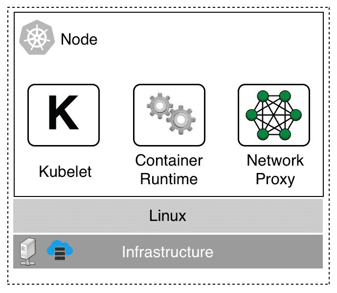

Kubernetes 工作节点

工作节点可以在虚拟机、裸机、本地或云上运行。最初，工作节点只能在 Linux 上配置。但自 Kubernetes 1.10 版本以来，工作节点也可以在 Windows Server 上运行。在混合集群中拥有 Linux 和 Windows 工作节点是完全可以的。

在每个节点上，我们需要运行三个服务，如下：

+   **Kubelet**：这是第一个，也是最重要的服务。Kubelet 是主要的节点代理。kubelet 服务使用 pod 规范来确保相应 pod 的所有容器都在运行并且健康。Pod 规范是以 YAML 或 JSON 格式编写的文件，它们以声明方式描述一个 pod。我们将在下一节了解什么是 pod。Pod 规范主要通过 API 服务器提供给 kubelet。

+   **容器运行时**：每个工作节点上需要存在的第二个服务是容器运行时。Kubernetes 默认从 1.9 版本开始使用`containerd`作为其容器运行时。在那之前，它使用 Docker 守护程序。其他容器运行时，如 rkt 或 CRI-O，也可以使用。容器运行时负责管理和运行 pod 中的各个容器。

+   **kube-proxy**：最后，还有 kube-proxy。它作为一个守护进程运行，是一个简单的网络代理和负载均衡器，用于运行在该特定节点上的所有应用服务。

现在我们已经了解了 Kubernetes 的架构、主节点和工作节点，是时候介绍一下我们可以用来开发针对 Kubernetes 的应用程序的工具了。

# Minikube 简介

Minikube 是一个工具，它在 VirtualBox 或 Hyper-V 中创建一个单节点 Kubernetes 集群（其他虚拟化程序也支持），可以在开发容器化应用程序期间使用。在第二章《设置工作环境》中，我们了解了如何在我们的 macOS 或 Windows 笔记本电脑上安装 Minikube 和`kubectl`。正如在那里所述，Minikube 是一个单节点 Kubernetes 集群，因此该节点同时也是 Kubernetes 主节点和工作节点。

让我们确保 Minikube 正在运行，使用以下命令：

```
$ minikube start
```

一旦 Minikube 准备就绪，我们可以使用`kubectl`访问它的单节点集群。我们应该会看到类似以下的内容：

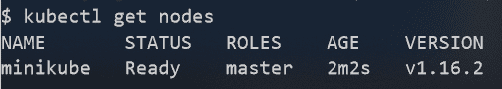列出 Minikube 中的所有节点

正如我们之前提到的，我们有一个名为`minikube`的单节点集群。Minikube 使用的 Kubernetes 版本是`v1.16.2`（在我的情况下）。

现在，让我们尝试将一个 pod 部署到这个集群中。现在不要担心 pod 是什么；我们将在本章后面深入了解所有细节。暂时就按原样进行。

我们可以使用`labs`文件夹中`ch15`子文件夹中的`sample-pod.yaml`文件来创建这样一个 pod。它的内容如下：

```
apiVersion: v1
kind: Pod
metadata:
  name: nginx
spec:
  containers:
  - name: nginx
    image: nginx:alpine
    ports:
    - containerPort: 80
    - containerPort: 443
```

使用以下步骤运行 pod：

1.  首先，导航到正确的文件夹：

```
$ cd ~/fod/ch15
```

1.  现在，让我们使用名为`kubectl`的 Kubernetes CLI 来部署这个 pod：

```
$ kubectl create -f sample-pod.yaml
pod/nginx created
```

如果我们现在列出所有的 pod，我们应该会看到以下内容：

```
$ kubectl get pods
NAME    READY   STATUS    RESTARTS   AGE
nginx   1/1     Running   0          51s
```

1.  为了能够访问这个 pod，我们需要创建一个服务。让我们使用名为`sample-service.yaml`的文件，它的内容如下：

```
apiVersion: v1
kind: Service
metadata:
  name: nginx-service
spec:
  type: LoadBalancer
  ports:
  - port: 8080
    targetPort: 80
    protocol: TCP
  selector:
    app: nginx
```

1.  再次强调，现在不用担心服务是什么。我们稍后会解释这个。让我们创建这个服务：

```
$ kubectl create -f sample-service.yaml
```

1.  现在，我们可以使用`curl`来访问服务：

```
$ curl -4 http://localhost
```

我们应该收到 Nginx 欢迎页面作为答案。

1.  在继续之前，请删除刚刚创建的两个对象：

```
$ kubectl delete po/nginx
$ kubectl delete svc/nginx-service
```

# Docker for Desktop 中的 Kubernetes 支持

从版本 18.01-ce 开始，Docker for macOS 和 Docker for Windows 已经开始默认支持 Kubernetes。想要将其容器化应用程序部署到 Kubernetes 的开发人员可以使用这个编排器，而不是 SwarmKit。Kubernetes 支持默认关闭，必须在设置中启用。第一次启用 Kubernetes 时，Docker for macOS 或 Windows 需要一些时间来下载创建单节点 Kubernetes 集群所需的所有组件。与 Minikube 相反，后者也是单节点集群，Docker 工具提供的版本使用所有 Kubernetes 组件的容器化版本：

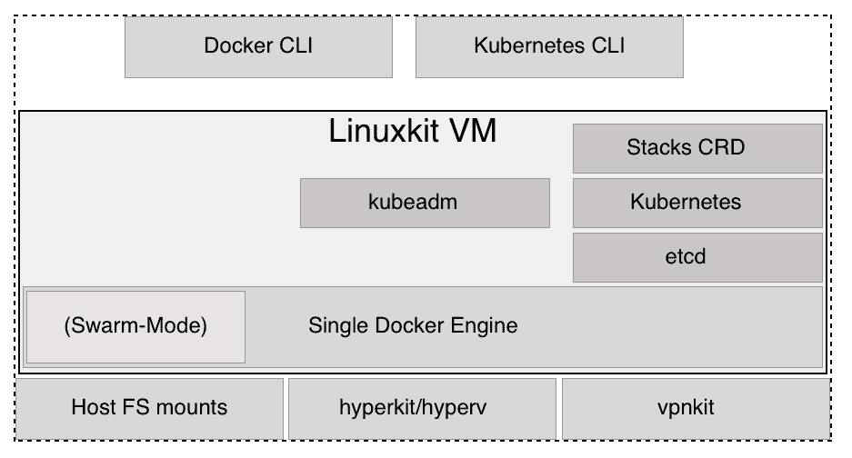Docker for macOS 和 Windows 中的 Kubernetes 支持

上图大致概述了 Kubernetes 支持是如何添加到 Docker for macOS 和 Windows 中的。Docker for macOS 使用 hyperkit 来运行基于 LinuxKit 的 VM。Docker for Windows 使用 Hyper-V 来实现结果。在 VM 内部，安装了 Docker 引擎。引擎的一部分是 SwarmKit，它启用了**Swarm-Mode**。Docker for macOS 或 Windows 使用**kubeadm**工具在 VM 中设置和配置 Kubernetes。以下三个事实值得一提：Kubernetes 将其集群状态存储在**etcd**中，因此我们在此 VM 上运行**etcd**。然后，我们有组成 Kubernetes 的所有服务，最后，一些支持从**Docker CLI**部署 Docker 堆栈到 Kubernetes 的服务。这项服务不是官方 Kubernetes 发行版的一部分，但它是特定于 Docker 的。

所有 Kubernetes 组件都在**LinuxKit VM**中以容器形式运行。这些容器可以通过 Docker for macOS 或 Windows 中的设置进行隐藏。在本节的后面，我们将提供在您的笔记本电脑上运行的所有 Kubernetes 系统容器的完整列表，如果您启用了 Kubernetes 支持。为避免重复，从现在开始，我将只谈论 Docker for Desktop 而不是 Docker for macOS 和 Docker for Windows。我将要说的一切同样适用于两个版本。

启用 Docker Desktop 的 Kubernetes 的一个很大优势是，它允许开发人员使用单个工具构建、测试和运行针对 Kubernetes 的容器化应用程序。甚至可以使用 Docker Compose 文件将多服务应用程序部署到 Kubernetes。

现在，让我们动手：

1.  首先，我们必须启用 Kubernetes。在 macOS 上，点击菜单栏中的 Docker 图标；或者在 Windows 上，转到命令托盘并选择“首选项”。在打开的对话框中，选择 Kubernetes，如下面的屏幕截图所示：

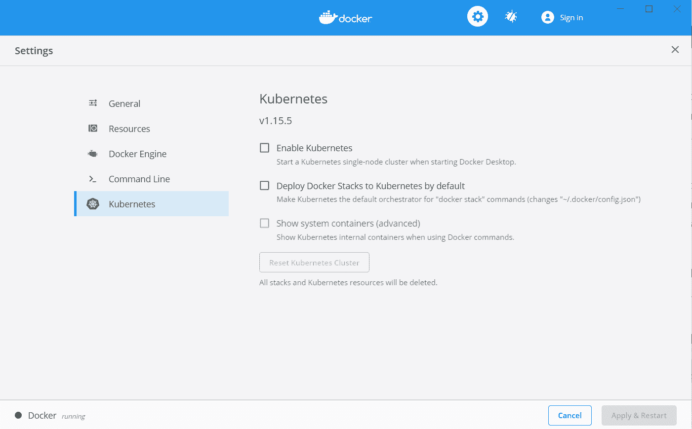在 Docker Desktop 中启用 Kubernetes

1.  然后，选中“启用 Kubernetes”复选框。还要选中“默认情况下将 Docker 堆叠部署到 Kubernetes”和“显示系统容器（高级）”复选框。然后，点击“应用并重启”按钮。安装和配置 Kubernetes 需要几分钟。现在，是时候休息一下，享受一杯好茶了。

1.  安装完成后（Docker 通过在设置对话框中显示绿色状态图标来通知我们），我们可以进行测试。由于我们现在在笔记本电脑上运行了两个 Kubernetes 集群，即 Minikube 和 Docker Desktop，我们需要配置`kubectl`以访问后者。

首先，让我们列出所有我们拥有的上下文：

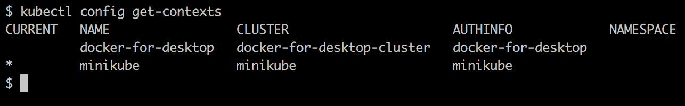kubectl 的上下文列表

在这里，我们可以看到，在我的笔记本电脑上，我有之前提到的两个上下文。当前，Minikube 上下文仍然处于活动状态，在`CURRENT`列中标有星号。我们可以使用以下命令切换到`docker-for-desktop`上下文：

更改 Kubernetes CLI 的上下文

现在，我们可以使用`kubectl`来访问 Docker Desktop 刚刚创建的集群。我们应该看到以下内容：

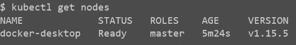Docker Desktop 创建的单节点 Kubernetes 集群

好的，这看起来非常熟悉。这几乎与我们在使用 Minikube 时看到的一样。我的 Docker Desktop 使用的 Kubernetes 版本是`1.15.5`。我们还可以看到节点是主节点。

如果我们列出当前在 Docker Desktop 上运行的所有容器，我们将得到下面截图中显示的列表（请注意，我使用`--format`参数来输出容器的`Container ID`和`Names`）：

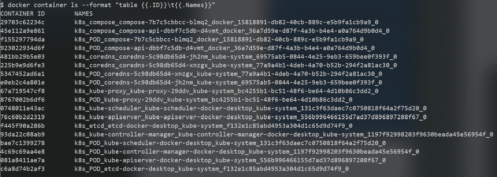Kubernetes 系统容器

在前面的列表中，我们可以识别出组成 Kubernetes 的所有熟悉组件，如下所示：

+   API 服务器

+   etcd

+   Kube 代理

+   DNS 服务

+   Kube 控制器

+   Kube 调度程序

还有一些容器中带有`compose`一词。这些是特定于 Docker 的服务，允许我们将 Docker Compose 应用程序部署到 Kubernetes 上。Docker 将 Docker Compose 语法进行转换，并隐式创建必要的 Kubernetes 对象，如部署、Pod 和服务。

通常，我们不希望在容器列表中混杂这些系统容器。因此，我们可以在 Kubernetes 的设置中取消选中“显示系统容器（高级）”复选框。

现在，让我们尝试将 Docker Compose 应用程序部署到 Kubernetes。转到`~/fod`文件夹的`ch15`子文件夹。我们使用`docker-compose.yml`文件将应用程序部署为堆栈：

```
$ docker stack deploy -c docker-compose.yml app
```

我们应该看到以下内容：

将堆栈部署到 Kubernetes

我们可以使用`curl`来测试应用程序，并且会发现它按预期运行：

在 Docker 桌面上的 Kubernetes 中运行的宠物应用程序

现在，让我们看看在执行`docker stack deploy`命令时 Docker 到底做了什么。我们可以使用`kubectl`来找出：

列出由 docker stack deploy 创建的所有 Kubernetes 对象

Docker 为`web`服务创建了一个部署，为`db`服务创建了一个有状态集。它还自动为`web`和`db`创建了 Kubernetes 服务，以便它们可以在集群内部访问。它还创建了 Kubernetes `svc/web-published`服务，用于外部访问。

这相当酷，至少可以说，极大地减少了团队在开发过程中针对 Kubernetes 作为编排平台时的摩擦

在继续之前，请从集群中删除堆栈：

```
$ docker stack rm app
```

还要确保将`kubectl`的上下文重置回 Minikube，因为我们将在本章中使用 Minikube 进行所有示例：

```
$ kubectl config use-context minikube
```

现在，我们已经介绍了用于开发最终将在 Kubernetes 集群中运行的应用程序的工具，是时候了解用于定义和管理这样的应用程序的所有重要 Kubernetes 对象了。我们将从 Pod 开始。

# Pod 简介

与 Docker Swarm 中可能的情况相反，在 Kubernetes 集群中不能直接运行容器。在 Kubernetes 集群中，您只能运行 Pod。Pod 是 Kubernetes 中部署的原子单位。Pod 是一个或多个共同定位的容器的抽象，它们共享相同的内核命名空间，如网络命名空间。在 Docker SwarmKit 中不存在等价物。多个容器可以共同定位并共享相同的网络命名空间的事实是一个非常强大的概念。下图说明了两个 Pod：

Kubernetes pods

在上图中，我们有两个 Pod，**Pod 1**和**Pod 2**。第一个 Pod 包含两个容器，而第二个 Pod 只包含一个容器。每个 Pod 都由 Kubernetes 分配一个 IP 地址，在整个 Kubernetes 集群中是唯一的。在我们的情况下，它们的 IP 地址分别是：`10.0.12.3`和`10.0.12.5`。它们都是由 Kubernetes 网络驱动程序管理的私有子网的一部分。

一个 Pod 可以包含一个到多个容器。所有这些容器共享相同的 Linux 内核命名空间，特别是它们共享网络命名空间。这是由包围容器的虚线矩形表示的。由于在同一个 Pod 中运行的所有容器共享网络命名空间，因此每个容器都需要确保使用自己的端口，因为在单个网络命名空间中不允许重复端口。在这种情况下，在**Pod 1**中，**主容器**使用端口`80`，而**支持容器**使用端口`3000`。

来自其他 Pod 或节点的请求可以使用 Pod 的 IP 地址和相应的端口号来访问各个容器。例如，您可以通过`10.0.12.3:80`访问**Pod 1**中主容器中运行的应用程序。

# 比较 Docker 容器和 Kubernetes Pod 网络

现在，让我们比较一下 Docker 的容器网络和 Kubernetes 的 Pod 网络。在下图中，我们将前者放在左侧，后者放在右侧：

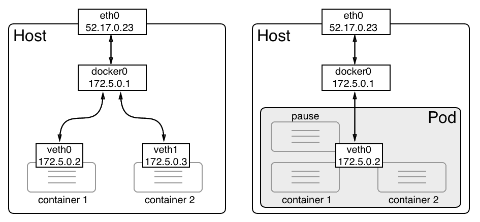Pod 中的容器共享相同的网络命名空间

当创建一个 Docker 容器并且没有指定特定的网络时，Docker 引擎会创建一个**虚拟以太网**（veth）端点。第一个容器得到**veth0**，下一个得到**veth1**，以此类推。这些虚拟以太网端点连接到 Linux 桥**docker0**，Docker 在安装时自动创建。流量从**docker0**桥路由到每个连接的**veth**端点。每个容器都有自己的网络命名空间。没有两个容器使用相同的命名空间。这是有意为之，目的是隔离容器内运行的应用程序。

对于 Kubernetes pod，情况是不同的。在创建一个新的 pod 时，Kubernetes 首先创建一个所谓的**pause**容器，其唯一目的是创建和管理 pod 将与所有容器共享的命名空间。除此之外，它没有任何有用的功能；它只是在睡觉。**pause**容器通过**veth0**连接到**docker0**桥。任何随后成为 pod 一部分的容器都使用 Docker 引擎的一个特殊功能，允许它重用现有的网络命名空间。这样做的语法看起来像这样：

```
$ docker container create --net container:pause ... 
```

重要的部分是`--net`参数，它使用`container:<container name>`作为值。如果我们以这种方式创建一个新容器，那么 Docker 不会创建一个新的 veth 端点；容器使用与`pause`容器相同的端点。

多个容器共享相同的网络命名空间的另一个重要后果是它们相互通信的方式。让我们考虑以下情况：一个包含两个容器的 pod，一个在端口`80`上监听，另一个在端口`3000`上监听。

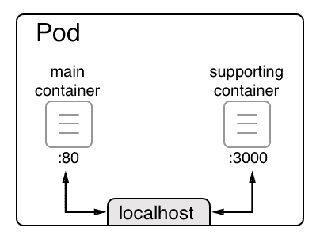Pod 中的容器通过 localhost 通信

当两个容器使用相同的 Linux 内核网络命名空间时，它们可以通过 localhost 相互通信，类似于当两个进程在同一主机上运行时，它们也可以通过 localhost 相互通信。这在前面的图表中有所说明。从主容器中，其中的容器化应用程序可以通过`http://localhost:3000`访问支持容器内运行的服务。

# 共享网络命名空间

在所有这些理论之后，你可能会想知道 Kubernetes 是如何实际创建一个 Pod 的。Kubernetes 只使用 Docker 提供的内容。那么，*这个网络命名空间共享是如何工作的呢？*首先，Kubernetes 创建所谓的`pause`容器，如前所述。这个容器除了保留内核命名空间给该 Pod 并保持它们的活动状态外，没有其他功能，即使 Pod 内没有其他容器在运行。然后，我们模拟创建一个 Pod。我们首先创建`pause`容器，并使用 Nginx 来实现这个目的：

```
$ docker container run -d --name pause nginx:alpine
```

现在，我们添加一个名为`main`的第二个容器，将其附加到与`pause`容器相同的网络命名空间：

```
$ docker container run --name main -dit \
 --net container:pause \
 alpine:latest /bin/sh
```

由于`pause`和示例容器都是同一个网络命名空间的一部分，它们可以通过`localhost`相互访问。为了证明这一点，我们必须`exec`进入主容器：

```
$ docker exec -it main /bin/sh
```

现在，我们可以测试连接到运行在`pause`容器中并监听端口`80`的 Nginx。如果我们使用`wget`工具来做到这一点，我们会得到以下结果：

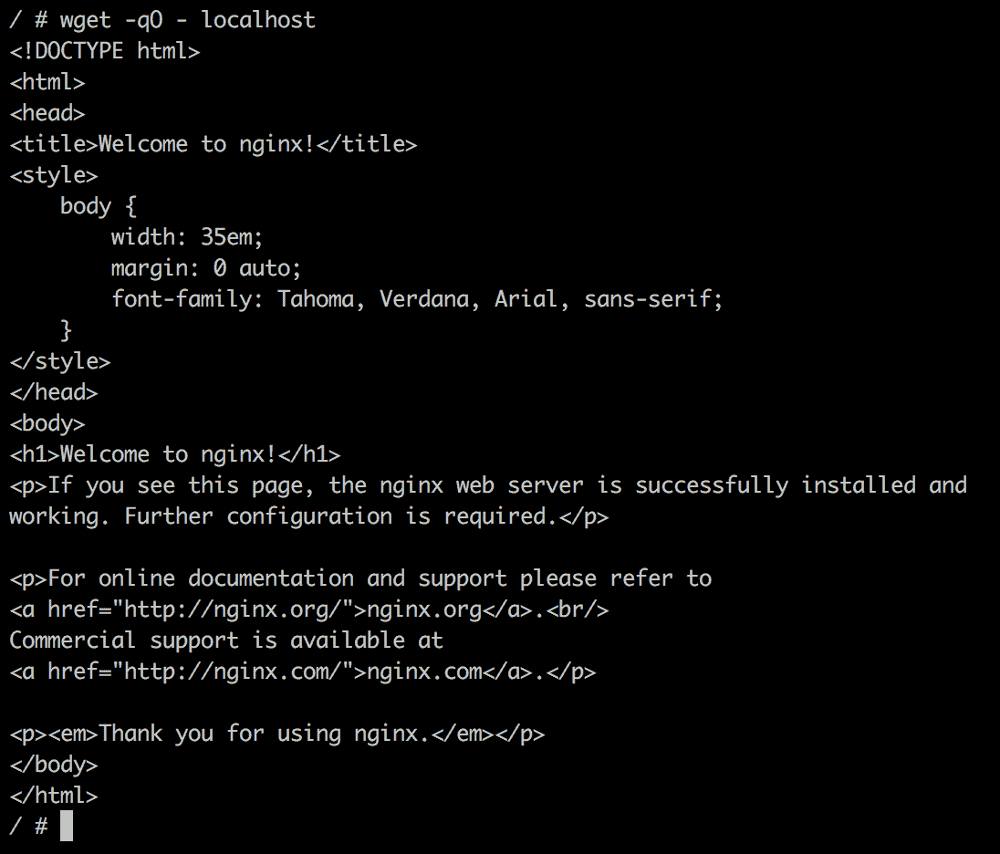两个共享相同网络命名空间的容器

输出显示我们确实可以在`localhost`上访问 Nginx。这证明了这两个容器共享相同的命名空间。如果这还不够，我们可以使用`ip`工具来显示两个容器内部的`eth0`，我们将得到完全相同的结果，具体来说，相同的 IP 地址，这是 Pod 的特征之一，所有容器共享相同的 IP 地址：

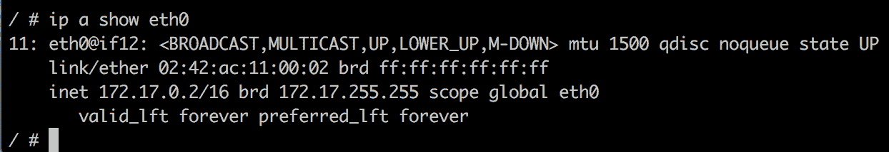使用`ip`工具显示`eth0`的属性

如果我们检查`bridge`网络，我们会看到只有`pause`容器被列出。另一个容器没有在`Containers`列表中得到条目，因为它正在重用`pause`容器的端点：

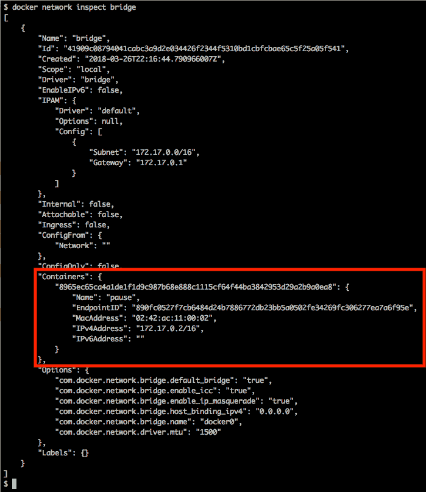检查 Docker 默认桥接网络

接下来，我们将研究 Pod 的生命周期。

# Pod 的生命周期

在本书的前面，我们学到了容器有一个生命周期。容器被初始化，运行，最终退出。当一个容器退出时，它可以以退出码零的方式优雅地退出，也可以以错误终止，这相当于非零的退出码。

同样，一个 Pod 也有一个生命周期。由于一个 Pod 可以包含多个容器，因此其生命周期比单个容器的生命周期稍微复杂一些。Pod 的生命周期可以在下图中看到：

Kubernetes Pod 的生命周期

当在集群节点上创建一个**Pod**时，它首先进入**pending**状态。一旦所有的 Pod 容器都启动并运行，Pod 就会进入**running**状态。只有当所有容器成功运行时，Pod 才会进入这个状态。如果要求 Pod 终止，它将请求所有容器终止。如果所有容器以退出码零终止，那么 Pod 就会进入**succeeded**状态。这是一条顺利的路径。

现在，让我们看一些导致 Pod 处于 failed 状态的情景。有三种可能的情景：

+   如果在 Pod 启动过程中，至少有一个容器无法运行并失败（即以非零退出码退出），Pod 将从**pending**状态转换为**failed**状态。

+   如果 Pod 处于 running 状态，而其中一个容器突然崩溃或以非零退出码退出，那么 Pod 将从 running 状态转换为 failed 状态。

+   如果要求 Pod 终止，并且在关闭过程中至少有一个容器以非零退出码退出，那么 Pod 也会进入 failed 状态。

现在，让我们来看一下 Pod 的规范。

# Pod 规范

在 Kubernetes 集群中创建一个 Pod 时，我们可以使用命令式或声明式方法。我们之前在本书中讨论过这两种方法的区别，但是，重申最重要的一点，使用声明式方法意味着我们编写一个描述我们想要实现的最终状态的清单。我们将略去编排器的细节。我们想要实现的最终状态也被称为**desired state**。一般来说，在所有已建立的编排器中，声明式方法都是强烈推荐的，Kubernetes 也不例外。

因此，在本章中，我们将专注于声明式方法。Pod 的清单或规范可以使用 YAML 或 JSON 格式编写。在本章中，我们将专注于 YAML，因为它对我们人类来说更容易阅读。让我们看一个样本规范。这是`pod.yaml`文件的内容，可以在我们的`labs`文件夹的`ch12`子文件夹中找到：

```
apiVersion: v1
kind: Pod
metadata:
  name: web-pod
spec:
  containers:
  - name: web
    image: nginx:alpine
    ports:
    - containerPort: 80
```

Kubernetes 中的每个规范都以版本信息开头。Pods 已经存在了相当长的时间，因此 API 版本是`v1`。第二行指定了我们要定义的 Kubernetes 对象或资源的类型。显然，在这种情况下，我们要指定一个`Pod`。接下来是包含元数据的块。至少，我们需要给 pod 一个名称。在这里，我们称其为`web-pod`。接下来跟随的是`spec`块，其中包含 pod 的规范。最重要的部分（也是这个简单示例中唯一的部分）是这个 pod 中所有容器的列表。我们这里只有一个容器，但是多个容器是可能的。我们为容器选择的名称是`web`，容器镜像是`nginx:alpine`。最后，我们定义了容器正在暴露的端口列表。

一旦我们编写了这样的规范，我们就可以使用 Kubernetes CLI `kubectl`将其应用到集群中。在终端中，导航到`ch15`子文件夹，并执行以下命令：

```
$ kubectl create -f pod.yaml
```

这将回应`pod "web-pod" created`。然后我们可以使用`kubectl get pods`列出集群中的所有 pod：

```
$ kubectl get pods
NAME      READY   STATUS    RESTARTS   AGE
web-pod   1/1     Running   0          2m
```

正如预期的那样，我们在运行状态中有一个 pod。该 pod 被称为`web-pod`，如所定义。我们可以使用`describe`命令获取有关运行中 pod 的更详细信息：

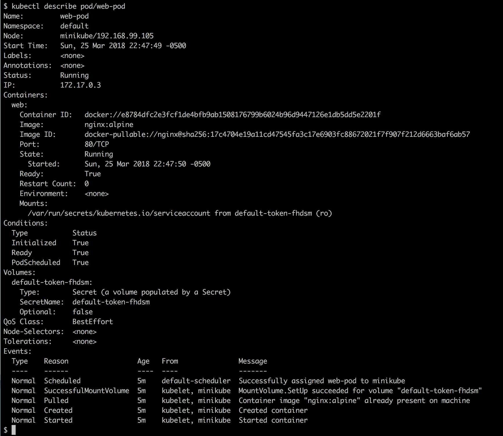描述运行在集群中的 pod

请注意在前面的`describe`命令中的`pod/web-pod`表示法。其他变体也是可能的；例如，`pods/web-pod`，`po/web-pod`。`pod`和`po`是`pods`的别名。`kubectl`工具定义了许多别名，使我们的生活变得更加轻松。

`describe`命令为我们提供了关于 pod 的大量有价值的信息，其中包括发生的事件列表，以及影响了这个 pod 的事件。列表显示在输出的末尾。

`Containers`部分中的信息与`docker container inspect`输出中的信息非常相似。

我们还可以看到`Volumes`部分中有一个`Secret`类型的条目。我们将在下一章讨论 Kubernetes secrets。另一方面，卷将在下一章讨论。

# Pods 和 volumes

在第五章中，*数据卷和配置*，我们学习了卷及其目的：访问和存储持久数据。由于容器可以挂载卷，Pod 也可以这样做。实际上，实际上是 Pod 内的容器挂载卷，但这只是一个语义细节。首先，让我们看看如何在 Kubernetes 中定义卷。Kubernetes 支持大量的卷类型，所以我们不会深入讨论这个问题。让我们通过隐式定义一个名为`my-data-claim`的`PersistentVolumeClaim`来创建一个本地卷：

```
apiVersion: v1
kind: PersistentVolumeClaim
metadata:
  name: my-data-claim
spec:
  accessModes:
    - ReadWriteOnce
  resources:
    requests:
      storage: 2Gi
```

我们已经定义了一个请求 2GB 数据的声明。让我们创建这个声明：

```
$ kubectl create -f volume-claim.yaml
```

我们可以使用`kubectl`列出声明（`pvc`是`PersistentVolumeClaim`的快捷方式）：

在集群中列出持久存储声明对象

在输出中，我们可以看到声明已经隐式创建了一个名为`pvc-<ID>`的卷。我们现在准备在 Pod 中使用声明创建的卷。让我们使用之前使用的 Pod 规范的修改版本。我们可以在`ch12`文件夹中的`pod-with-vol.yaml`文件中找到这个更新的规范。让我们详细看一下这个规范：

```
apiVersion: v1
kind: Pod
metadata:
  name: web-pod
spec:
  containers:
  - name: web
    image: nginx:alpine
    ports:
    - containerPort: 80
    volumeMounts:
    - name: my-data
      mountPath: /data
  volumes:
  - name: my-data
    persistentVolumeClaim:
      claimName: my-data-claim
```

在最后四行中，在`volumes`块中，我们定义了我们想要为这个 Pod 使用的卷的列表。我们在这里列出的卷可以被 Pod 的任何一个容器使用。在我们的特定情况下，我们只有一个卷。我们指定我们有一个名为`my-data`的卷，这是一个持久卷声明，其声明名称就是我们刚刚创建的。然后，在容器规范中，我们有`volumeMounts`块，这是我们定义我们想要使用的卷以及容器内部的（绝对）路径的地方，卷将被挂载到容器文件系统的`/data`文件夹。让我们创建这个 Pod：

```
$ kubectl create -f pod-with-vol.yaml
```

然后，我们可以通过`exec`进入容器，通过导航到`/data`文件夹，创建一个文件，并退出容器来再次检查卷是否已挂载：

```
$ kubectl exec -it web-pod -- /bin/sh
/ # cd /data
/data # echo "Hello world!" > sample.txt
/data # exit
```

如果我们是正确的，那么这个容器中的数据必须在 Pod 的生命周期之外持续存在。因此，让我们删除 Pod，然后重新创建它并进入其中，以确保数据仍然存在。这是结果：

存储在卷中的数据在 Pod 重新创建时仍然存在

现在我们对 pod 有了很好的理解，让我们来看看如何借助 ReplicaSets 来管理这些 pod。

# Kubernetes ReplicaSet

在具有高可用性要求的环境中，单个 pod 是不够的。如果 pod 崩溃了怎么办？如果我们需要更新 pod 内运行的应用程序，但又不能承受任何服务中断怎么办？这些问题等等表明单独的 pod 是不够的，我们需要一个可以管理多个相同 pod 实例的更高级概念。在 Kubernetes 中，ReplicaSet 用于定义和管理在不同集群节点上运行的相同 pod 的集合。除其他事项外，ReplicaSet 定义了在 pod 内运行的容器使用哪些容器镜像，以及集群中将运行多少个 pod 实例。这些属性和许多其他属性被称为所需状态。

ReplicaSet 负责始终协调所需的状态，如果实际状态偏离所需状态。这是一个 Kubernetes ReplicaSet：

Kubernetes ReplicaSet

在前面的图表中，我们可以看到一个名为 rs-api 的 ReplicaSet，它管理着一些 pod。这些 pod 被称为 pod-api。ReplicaSet 负责确保在任何给定时间，始终有所需数量的 pod 在运行。如果其中一个 pod 因任何原因崩溃，ReplicaSet 会在具有空闲资源的节点上安排一个新的 pod。如果 pod 的数量超过所需数量，那么 ReplicaSet 会终止多余的 pod。通过这种方式，我们可以说 ReplicaSet 保证了一组 pod 的自愈和可伸缩性。ReplicaSet 可以容纳多少个 pod 没有限制。

# ReplicaSet 规范

与我们对 pod 的学习类似，Kubernetes 也允许我们以命令式或声明式方式定义和创建 ReplicaSet。由于在大多数情况下，声明式方法是最推荐的方法，我们将集中讨论这种方法。以下是一个 Kubernetes ReplicaSet 的样本规范：

```
apiVersion: apps/v1
kind: ReplicaSet
metadata:
  name: rs-web
spec:
  selector:
    matchLabels:
      app: web
  replicas: 3
  template: 
    metadata:
      labels:
        app: web
    spec:
      containers:
      - name: nginx
        image: nginx:alpine
        ports:
        - containerPort: 80
```

这看起来非常像我们之前介绍的 Pod 规范。让我们集中精力关注不同之处。首先，在第 2 行，我们有`kind`，它曾经是`Pod`，现在是`ReplicaSet`。然后，在第 6-8 行，我们有一个选择器，它确定将成为`ReplicaSet`一部分的 Pods。在这种情况下，它是所有具有`app`标签值为`web`的 Pods。然后，在第 9 行，我们定义了我们想要运行的 Pod 的副本数量；在这种情况下是三个。最后，我们有`template`部分，首先定义了`metadata`，然后定义了`spec`，它定义了在 Pod 内运行的容器。在我们的情况下，我们有一个使用`nginx:alpine`镜像并导出端口`80`的单个容器。

真正重要的元素是副本的数量和选择器，它指定了由`ReplicaSet`管理的 Pod 集合。

在我们的`ch15`文件夹中，有一个名为`replicaset.yaml`的文件，其中包含了前面的规范。让我们使用这个文件来创建`ReplicaSet`：

```
$ kubectl create -f replicaset.yaml
replicaset "rs-web" created
```

如果我们列出集群中的所有 ReplicaSets，我们会得到以下结果（`rs`是`replicaset`的缩写）：

```
$ kubectl get rs
NAME     DESIRED   CURRENT   READY   AGE
rs-web   3         3         3       51s
```

在上面的输出中，我们可以看到我们有一个名为`rs-web`的单个 ReplicaSet，其期望状态为三（个 Pods）。当前状态也显示了三个 Pods，并告诉我们所有三个 Pods 都已准备就绪。我们还可以列出系统中的所有 Pods。这将导致以下输出：

```
$ kubectl get pods
NAME           READY   STATUS    RESTARTS   AGE
rs-web-6qzld   1/1     Running   0          4m
rs-web-frj2m   1/1     Running   0          4m
rs-web-zd2kt   1/1     Running   0          4m
```

在这里，我们可以看到我们期望的三个 Pods。Pods 的名称使用 ReplicaSet 的名称，并为每个 Pod 附加了唯一的 ID。在`READY`列中，我们可以看到在 Pod 中定义了多少个容器以及其中有多少个是就绪的。在我们的情况下，每个 Pod 只有一个容器，并且每种情况下都已准备就绪。因此，Pod 的整体状态是`Running`。我们还可以看到每个 Pod 需要重新启动的次数。在我们的情况下，我们没有任何重新启动。

# 自愈

现在，让我们测试自愈`ReplicaSet`的魔力，随机杀死其中一个 Pod 并观察发生了什么。让我们从前面的列表中删除第一个 Pod：

```
$ kubectl delete po/rs-web-6qzld
pod "rs-web-6qzld" deleted
```

现在，让我们再次列出所有的 Pods。我们期望只看到两个 Pods，*对吗*？错了：

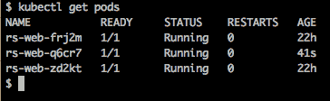杀死 ReplicaSet 中一个 Pod 后的 Pod 列表

好的；显然，列表中的第二个 Pod 已经被重新创建，我们可以从`AGE`列中看到。这就是自动修复的工作。让我们看看如果我们描述 ReplicaSet 会发现什么：

描述 ReplicaSet

确实，在“事件”下我们找到了一个条目，告诉我们 ReplicaSet 创建了名为 rs-web-q6cr7 的新 pod。

# Kubernetes 部署

Kubernetes 非常严肃地遵循单一责任原则。所有 Kubernetes 对象都被设计成只做一件事，并且它们被设计得非常出色。在这方面，我们必须了解 Kubernetes 的 ReplicaSets 和 Deployments。正如我们所学到的，ReplicaSet 负责实现和协调应用服务的期望状态。这意味着 ReplicaSet 管理一组 pod。

部署通过在 ReplicaSet 的基础上提供滚动更新和回滚功能来增强 ReplicaSet。在 Docker Swarm 中，Swarm 服务结合了 ReplicaSet 和部署的功能。在这方面，SwarmKit 比 Kubernetes 更加单片化。下图显示了部署与 ReplicaSet 的关系：

Kubernetes 部署

在上图中，ReplicaSet 定义和管理一组相同的 pod。ReplicaSet 的主要特点是它是自愈的、可扩展的，并且始终尽最大努力协调期望状态。而 Kubernetes 部署则为此添加了滚动更新和回滚功能。在这方面，部署实际上是对 ReplicaSet 的包装对象。

我们将在第十六章《使用 Kubernetes 部署、更新和保护应用程序》中学习滚动更新和回滚。

在下一节中，我们将更多地了解 Kubernetes 服务以及它们如何实现服务发现和路由。

# Kubernetes 服务

一旦我们开始处理由多个应用服务组成的应用程序，我们就需要服务发现。下图说明了这个问题：

服务发现

在上图中，我们有一个需要访问其他三个服务的**Web API**服务：**支付**，**运输**和**订购**。**Web API**不应该关心如何以及在哪里找到这三个服务。在 API 代码中，我们只想使用我们想要到达的服务的名称和端口号。一个示例是以下 URL `http://payments:3000`，用于访问支付服务的一个实例。

在 Kubernetes 中，支付应用程序服务由一组 Pod 的 ReplicaSet 表示。由于高度分布式系统的性质，我们不能假设 Pod 具有稳定的端点。一个 Pod 可能随心所欲地出现和消失。但是，如果我们需要从内部或外部客户端访问相应的应用程序服务，这就是一个问题。如果我们不能依赖于 Pod 端点的稳定性，*我们还能做什么呢？*

这就是 Kubernetes 服务发挥作用的地方。它们旨在为 ReplicaSets 或 Deployments 提供稳定的端点，如下所示：

Kubernetes 服务为客户端提供稳定的端点

在上图中，中心位置有一个这样的 Kubernetes **Service**。它提供了一个**可靠的**集群范围**IP**地址，也称为**虚拟 IP**（**VIP**），以及整个集群中唯一的**可靠**端口。Kubernetes 服务代理的 Pod 由服务规范中定义的**选择器**确定。选择器总是基于标签。每个 Kubernetes 对象都可以分配零个或多个标签。在我们的情况下，**选择器**是**app=web**；也就是说，所有具有名为 app 且值为 web 的标签的 Pod 都被代理。

在接下来的部分，我们将学习更多关于基于上下文的路由以及 Kubernetes 如何减轻这项任务。

# 基于上下文的路由

通常，我们希望为我们的 Kubernetes 集群配置基于上下文的路由。Kubernetes 为我们提供了各种方法来做到这一点。目前，首选和最可扩展的方法是使用**IngressController**。以下图尝试说明这个 IngressController 是如何工作的：

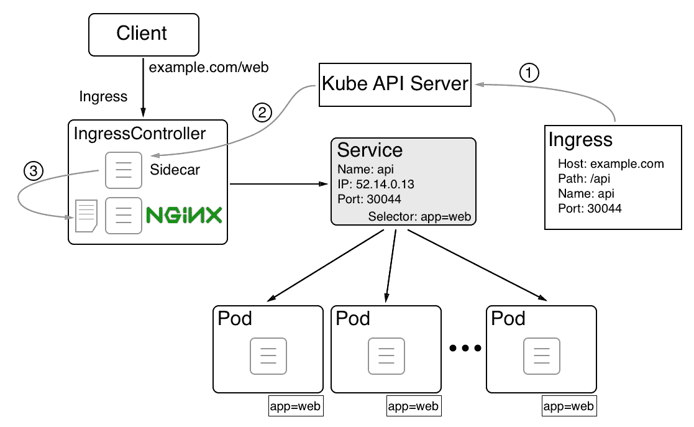

使用 Kubernetes Ingress Controller 进行基于上下文的路由

在上图中，我们可以看到当使用**IngressController**（如 Nginx）时，基于上下文（或第 7 层）的路由是如何工作的。在这里，我们部署了一个名为**web**的应用服务。该应用服务的所有 pod 都具有以下标签：**app=web**。然后，我们有一个名为**web**的 Kubernetes 服务，为这些 pod 提供了一个稳定的端点。该服务具有一个（虚拟）**IP**为`52.14.0.13`，并暴露端口`30044`。也就是说，如果任何 Kubernetes 集群的节点收到对**web**名称和端口`30044`的请求，那么它将被转发到该服务。然后该服务将请求负载均衡到其中一个 pod。

到目前为止，一切都很好，*但是客户端对`http[s]://example.com/web`*的 Ingress 请求是如何路由到我们的 web 服务的呢？*首先，我们必须定义从基于上下文的请求到相应的`<service name>/<port>请求`的路由。这是通过一个**Ingress**对象完成的：

1.  在**Ingress**对象中，我们将**Host**和**Path**定义为源和（服务）名称，端口定义为目标。当 Kubernetes API 服务器创建此 Ingress 对象时，运行在`IngressController`中的一个进程会捕捉到这个变化。

1.  该进程修改了 Nginx 反向代理的配置文件。

1.  通过添加新路由，然后要求 Nginx 重新加载其配置，从而能够正确地将任何传入请求路由到`http[s]://example.com/web`。

在接下来的部分，我们将通过对比每个编排引擎的一些主要资源来比较 Docker SwarmKit 和 Kubernetes。

# 比较 SwarmKit 和 Kubernetes

现在我们已经学习了关于 Kubernetes 中最重要的资源的许多细节，通过匹配重要资源来比较两个编排器 SwarmKit 和 Kubernetes 是有帮助的。让我们来看一下：

| **SwarmKit** | **Kubernetes** | **描述** |
| --- | --- | --- |
| Swarm | 集群 | 由各自编排器管理的一组服务器/节点。 |
| 节点 | 集群成员 | Swarm/集群的单个主机（物理或虚拟）。 |
| 管理节点 | 主节点 | 管理 Swarm/集群的节点。这是控制平面。 |
| 工作节点 | 节点 | 运行应用程序工作负载的 Swarm/集群成员。 |
| 容器 | 容器** | 在节点上运行的容器镜像的实例。**注意：在 Kubernetes 集群中，我们不能直接运行容器。 |
| 任务 | Pod | 在节点上运行的服务（Swarm）或 ReplicaSet（Kubernetes）的实例。一个任务管理一个容器，而一个 Pod 包含一个到多个共享相同网络命名空间的容器。 |
| 服务 | 副本集 | 定义并协调由多个实例组成的应用服务的期望状态。 |
| 服务 | 部署 | 部署是一个带有滚动更新和回滚功能的 ReplicaSet。 |
| 路由网格 | 服务 | Swarm 路由网格使用 IPVS 提供 L4 路由和负载平衡。Kubernetes 服务是一个抽象，定义了一组逻辑 pod 和可用于访问它们的策略。它是一组 pod 的稳定端点。 |
| 堆栈 | 堆栈 ** | 由多个（Swarm）服务组成的应用程序的定义。**注意：虽然堆栈不是 Kubernetes 的本机功能，但 Docker 的工具 Docker for Desktop 将它们转换为部署到 Kubernetes 集群上的功能。 |
| 网络 | 网络策略 | Swarm 的软件定义网络（SDN）用于防火墙容器。Kubernetes 只定义了一个单一的平面网络。除非明确定义了网络策略来限制 pod 之间的通信，否则每个 pod 都可以访问每个其他 pod 和/或节点。 |

# 总结

在本章中，我们了解了 Kubernetes 的基础知识。我们概述了其架构，并介绍了在 Kubernetes 集群中定义和运行应用程序的主要资源。我们还介绍了 Minikube 和 Docker for Desktop 中的 Kubernetes 支持。

在下一章中，我们将在 Kubernetes 集群中部署一个应用程序。然后，我们将使用零停机策略更新此应用程序的其中一个服务。最后，我们将使用机密信息对在 Kubernetes 中运行的应用程序服务进行仪器化。敬请关注！

# 问题

请回答以下问题以评估您的学习进度：

1.  用几句简短的话解释一下 Kubernetes 主节点的作用。

1.  列出每个 Kubernetes（工作）节点上需要存在的元素。

1.  我们不能在 Kubernetes 集群中运行单独的容器。

A. 是

B. 否

1.  解释为什么 pod 中的容器可以使用`localhost`相互通信。

1.  所谓的暂停容器在 pod 中的目的是什么？

1.  鲍勃告诉你：“我们的应用由三个 Docker 镜像组成：`web`、`inventory`和`db`。由于我们可以在 Kubernetes pod 中运行多个容器，我们将在一个单独的 pod 中部署我们应用的所有服务。”列出三到四个这样做是个坏主意的原因。

1.  用自己的话解释为什么我们需要 Kubernetes ReplicaSets。

1.  在什么情况下我们需要 Kubernetes 部署？

1.  列出至少三种 Kubernetes 服务类型，并解释它们的目的和区别。

# 进一步阅读

以下是一些包含更多关于我们在本章讨论的各种主题的详细信息的文章列表：

+   Raft 一致性算法：[`raft.github.io/`](https://raft.github.io/)

+   使用 Docker 桌面版的 Docker Compose 和 Kubernetes：[`dockr.ly/2G8Iqb9`](https://dockr.ly/2G8Iqb9)

+   Kubernetes 文档：[`kubernetes.io/docs/home/`](https://kubernetes.io/docs/home/)
